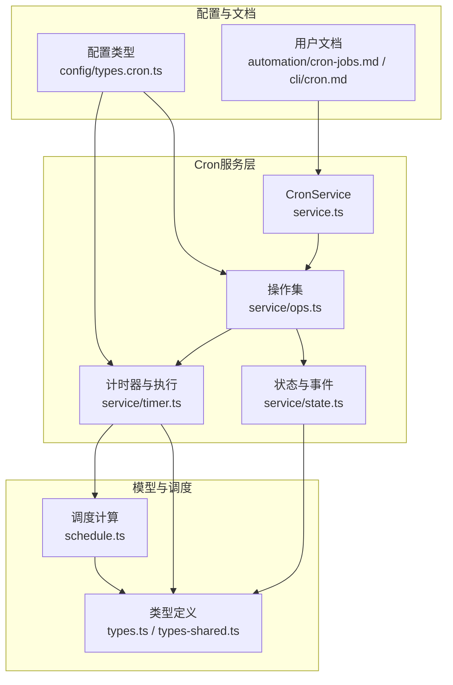
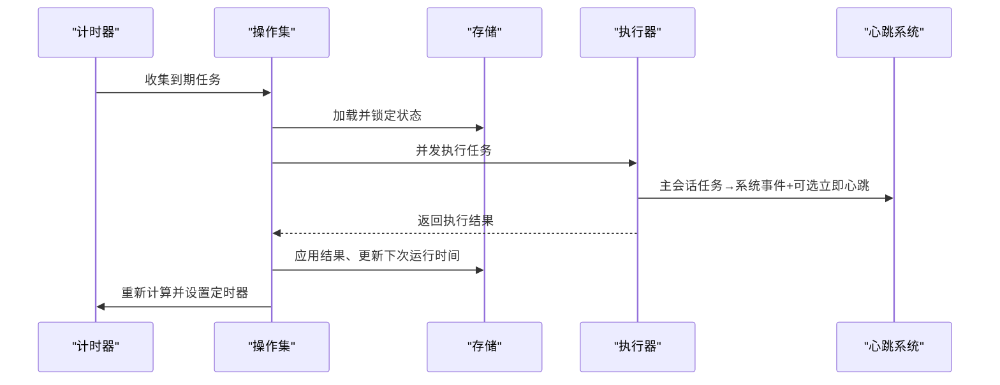
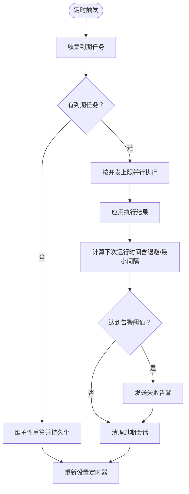
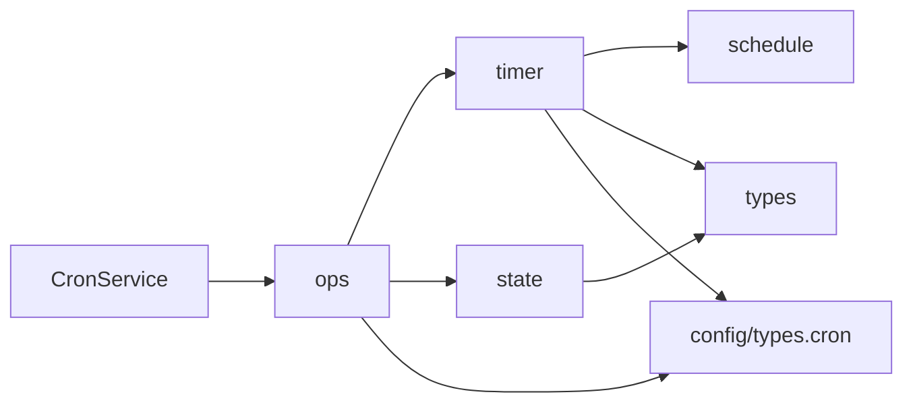

# 定时任务工具

<cite>
**本文档引用的文件**
- [src/cron/service.ts](file://src/cron/service.ts)
- [src/cron/service/ops.ts](file://src/cron/service/ops.ts)
- [src/cron/service/timer.ts](file://src/cron/service/timer.ts)
- [src/cron/service/state.ts](file://src/cron/service/state.ts)
- [src/cron/types.ts](file://src/cron/types.ts)
- [src/cron/types-shared.ts](file://src/cron/types-shared.ts)
- [src/cron/schedule.ts](file://src/cron/schedule.ts)
- [src/config/types.cron.ts](file://src/config/types.cron.ts)
- [docs/automation/cron-jobs.md](file://docs/automation/cron-jobs.md)
- [docs/cli/cron.md](file://docs/cli/cron.md)
- [src/cron/service/jobs.schedule-error-isolation.test.ts](file://src/cron/service/jobs.schedule-error-isolation.test.ts)
</cite>

## 目录

1. [简介](#简介)
2. [项目结构](#项目结构)
3. [核心组件](#核心组件)
4. [架构总览](#架构总览)
5. [详细组件分析](#详细组件分析)
6. [依赖关系分析](#依赖关系分析)
7. [性能考量](#性能考量)
8. [故障排查指南](#故障排查指南)
9. [结论](#结论)
10. [附录](#附录)

## 简介

本文件面向OpenClaw的定时任务工具（Cron服务），系统化阐述其架构设计、任务调度、作业管理、执行监控与失败重试机制，并说明与AI代理的集成方式。文档覆盖Cron服务的类与方法、任务队列管理、并发控制、与心跳系统的协作、以及配置语法与执行策略。同时提供可操作的实践建议与性能优化要点，帮助读者在生产环境中稳定运行高可靠、可观测的定时任务。

## 项目结构

Cron子系统位于src/cron目录下，采用按职责分层的组织方式：

- service：对外暴露的CronService类与内部操作（ops）、计时器与状态管理（timer、state）
- 类型定义：types.ts与types-shared.ts描述任务结构、调度、交付、失败告警等
- schedule.ts：调度表达式解析与下一运行时间计算
- 配置：src/config/types.cron.ts定义Cron相关配置项
- 文档：docs/automation/cron-jobs.md与docs/cli/cron.md提供用户侧使用说明

图表来源

- [src/cron/service.ts:1-61](file://src/cron/service.ts#L1-L61)
- [src/cron/service/ops.ts:1-570](file://src/cron/service/ops.ts#L1-L570)
- [src/cron/service/timer.ts:1-1262](file://src/cron/service/timer.ts#L1-L1262)
- [src/cron/service/state.ts:1-170](file://src/cron/service/state.ts#L1-L170)
- [src/cron/types.ts:1-160](file://src/cron/types.ts#L1-L160)
- [src/cron/types-shared.ts:1-19](file://src/cron/types-shared.ts#L1-L19)
- [src/cron/schedule.ts:1-171](file://src/cron/schedule.ts#L1-L171)
- [src/config/types.cron.ts:1-61](file://src/config/types.cron.ts#L1-L61)

章节来源

- [src/cron/service.ts:1-61](file://src/cron/service.ts#L1-L61)
- [src/cron/service/ops.ts:1-570](file://src/cron/service/ops.ts#L1-L570)
- [src/cron/service/timer.ts:1-1262](file://src/cron/service/timer.ts#L1-L1262)
- [src/cron/service/state.ts:1-170](file://src/cron/service/state.ts#L1-L170)
- [src/cron/types.ts:1-160](file://src/cron/types.ts#L1-L160)
- [src/cron/types-shared.ts:1-19](file://src/cron/types-shared.ts#L1-L19)
- [src/cron/schedule.ts:1-171](file://src/cron/schedule.ts#L1-L171)
- [src/config/types.cron.ts:1-61](file://src/config/types.cron.ts#L1-L61)
- [docs/automation/cron-jobs.md:1-687](file://docs/automation/cron-jobs.md#L1-L687)
- [docs/cli/cron.md:1-78](file://docs/cli/cron.md#L1-L78)

## 核心组件

- CronService：对外API入口，封装启动、停止、查询、增删改、手动运行、入队执行等能力
- 操作集（ops）：实现任务生命周期管理（新增、更新、删除、列表、分页、手动运行、入队执行）
- 计时器（timer）：负责定时触发、并发执行、超时控制、失败重试、告警、会话清理
- 状态（state）：定义事件、依赖注入接口、服务状态与默认行为
- 类型定义（types、types-shared）：统一的任务结构、调度、交付、失败告警、运行结果与遥测
- 调度（schedule）：解析cron表达式、时区、缓存、计算下一运行时刻
- 配置（config/types.cron.ts）：重试策略、失败告警、会话保留、运行日志裁剪等

章节来源

- [src/cron/service.ts:7-60](file://src/cron/service.ts#L7-L60)
- [src/cron/service/ops.ts:92-131](file://src/cron/service/ops.ts#L92-L131)
- [src/cron/service/timer.ts:507-559](file://src/cron/service/timer.ts#L507-L559)
- [src/cron/service/state.ts:15-130](file://src/cron/service/state.ts#L15-L130)
- [src/cron/types.ts:5-160](file://src/cron/types.ts#L5-L160)
- [src/cron/types-shared.ts:1-19](file://src/cron/types-shared.ts#L1-L19)
- [src/cron/schedule.ts:64-139](file://src/cron/schedule.ts#L64-L139)
- [src/config/types.cron.ts:30-60](file://src/config/types.cron.ts#L30-L60)

## 架构总览

Cron服务以“状态机 + 计时器 + 并发执行 + 事件驱动”的方式工作：

- 启动时加载持久化存储，清理异常运行标记，回放错过的任务，计算下次唤醒时间并设置定时器
- 定时器触发后收集到期任务，按并发上限并行执行；执行结果写回状态并更新下次运行时间
- 执行过程中支持超时、错误分类、指数退避、一次性重试、失败告警、会话清理与事件上报
- 通过心跳系统将主会话任务投递到系统事件队列并按需立即唤醒

图表来源

- [src/cron/service/timer.ts:572-731](file://src/cron/service/timer.ts#L572-L731)
- [src/cron/service/ops.ts:518-525](file://src/cron/service/ops.ts#L518-L525)
- [src/cron/service/state.ts:63-114](file://src/cron/service/state.ts#L63-L114)

## 详细组件分析

### CronService与对外API

- 提供start/stop/status/list/listPage/add/update/remove/run/enqueueRun/wake等方法
- 内部通过状态机与操作集完成具体逻辑，保证并发安全与一致性

章节来源

- [src/cron/service.ts:7-60](file://src/cron/service.ts#L7-L60)

### 操作集（ops）：任务生命周期与并发控制

- start：加载存储、清理异常运行标记、回放错过的任务、计算并设置定时器
- list/listPage：支持过滤、排序、分页
- add/update/remove：规范化输入、计算下一运行时间、持久化、重新计算并设置定时器
- run/enqueueRun：手动运行与入队执行，支持“due/force”模式；入队通过命令队列限制并发
- 事件发布：对添加、更新、移除、开始、结束等事件进行上报

章节来源

- [src/cron/service/ops.ts:92-131](file://src/cron/service/ops.ts#L92-L131)
- [src/cron/service/ops.ts:149-234](file://src/cron/service/ops.ts#L149-L234)
- [src/cron/service/ops.ts:236-269](file://src/cron/service/ops.ts#L236-L269)
- [src/cron/service/ops.ts:271-323](file://src/cron/service/ops.ts#L271-L323)
- [src/cron/service/ops.ts:325-342](file://src/cron/service/ops.ts#L325-L342)
- [src/cron/service/ops.ts:518-525](file://src/cron/service/ops.ts#L518-L525)
- [src/cron/service/ops.ts:527-562](file://src/cron/service/ops.ts#L527-L562)

### 计时器（timer）：调度、执行、重试与告警

- armTimer：根据下次唤醒时间设置定时器，限制最大延迟避免漂移
- onTimer：收集到期任务、并发执行、应用结果、维护性重算、设置下一次定时器
- executeJobCoreWithTimeout：带超时控制的执行包装
- applyJobResult：根据执行结果更新状态、计算下次运行时间、指数退避、失败告警
- 失败告警：基于连续错误次数与冷却期，支持公告或Webhook
- 会话清理：定时清理过期的隔离运行会话
- 错误分类：对瞬时错误（限流、过载、网络、超时、5xx）进行重试，永久错误直接禁用

图表来源

- [src/cron/service/timer.ts:572-731](file://src/cron/service/timer.ts#L572-L731)
- [src/cron/service/timer.ts:295-474](file://src/cron/service/timer.ts#L295-L474)
- [src/cron/service/timer.ts:246-288](file://src/cron/service/timer.ts#L246-L288)

章节来源

- [src/cron/service/timer.ts:507-559](file://src/cron/service/timer.ts#L507-L559)
- [src/cron/service/timer.ts:572-731](file://src/cron/service/timer.ts#L572-L731)
- [src/cron/service/timer.ts:295-474](file://src/cron/service/timer.ts#L295-L474)
- [src/cron/service/timer.ts:246-288](file://src/cron/service/timer.ts#L246-L288)

### 状态与事件（state）

- CronEvent：事件载体，包含任务ID、动作、运行时间、状态、错误、交付状态、遥测等
- CronServiceDeps：依赖注入接口，包括时间回调、日志、存储路径、心跳接口、隔离执行器、失败告警发送器、事件回调等
- 默认行为：未指定nowMs时使用Date.now；未指定会话存储路径时按默认策略解析

章节来源

- [src/cron/service/state.ts:15-130](file://src/cron/service/state.ts#L15-L130)

### 类型定义（types与types-shared）

- CronSchedule：支持at（一次性）、every（固定间隔）、cron（表达式+时区+可选抖动窗口）
- CronDelivery/CronFailureAlert：交付模式（none/announce/webhook）、目标通道与账号、最佳努力投递、失败通知
- CronJob/CronJobState：任务实体与状态字段（下次运行、运行中、最近运行、错误、连续错误、失败告警时间、交付状态等）
- 运行结果与遥测：状态、错误、摘要、会话信息、模型/提供商、用量统计

章节来源

- [src/cron/types.ts:5-160](file://src/cron/types.ts#L5-L160)
- [src/cron/types-shared.ts:1-19](file://src/cron/types-shared.ts#L1-L19)

### 调度（schedule）

- cron表达式解析与缓存，支持时区与年份回滚修复
- 计算下一运行时刻（at/every/cron），处理边界情况（过去时间、无效表达式）
- 周期性任务的抖动窗口（staggerMs）用于削峰

章节来源

- [src/cron/schedule.ts:6-47](file://src/cron/schedule.ts#L6-L47)
- [src/cron/schedule.ts:64-139](file://src/cron/schedule.ts#L64-L139)

### 配置（config/types.cron.ts）

- retry：一次性任务瞬时错误的最大重试次数、退避序列、仅重试的错误类型
- failureAlert：全局失败告警开关、阈值、冷却时间、模式与账号
- sessionRetention：隔离运行会话保留时长或关闭
- runLog：运行日志文件大小与行数限制
- webhook/webhookToken：遗留回退Webhook与令牌

章节来源

- [src/config/types.cron.ts:3-60](file://src/config/types.cron.ts#L3-L60)

### 与AI代理的集成

- 主会话任务：通过enqueueSystemEvent将系统事件投递到心跳系统，可选择立即心跳或等待下一个心跳
- 隔离任务：调用runIsolatedAgentJob执行专用代理回合，支持模型/思考级别覆盖、轻量上下文、交付策略
- 心跳协调：当主会话任务选择“now”时，若心跳正在处理请求，会进行轮询等待并在超时后降级为请求立即心跳

章节来源

- [src/cron/service/timer.ts:1005-1155](file://src/cron/service/timer.ts#L1005-L1155)
- [src/cron/service/state.ts:63-114](file://src/cron/service/state.ts#L63-L114)

### 实际用法与示例（路径指引）

- 创建一次性提醒（主会话，立即唤醒，成功后删除）：[示例路径:36-50](file://docs/automation/cron-jobs.md#L36-L50)
- 创建周期性隔离任务（公告到Slack）：[示例路径:52-64](file://docs/automation/cron-jobs.md#L52-L64)
- 使用CLI编辑交付设置：[示例路径:41-51](file://docs/cli/cron.md#L41-L51)
- 使用CLI添加轻量上下文的隔离任务：[示例路径:65-75](file://docs/cli/cron.md#L65-L75)
- 手动运行与排队执行：[说明路径:24-27](file://docs/cli/cron.md#L24-L27)

章节来源

- [docs/automation/cron-jobs.md:34-78](file://docs/automation/cron-jobs.md#L34-L78)
- [docs/cli/cron.md:19-78](file://docs/cli/cron.md#L19-L78)

## 依赖关系分析

- CronService依赖state创建状态，委托ops执行业务操作
- ops依赖timer中的执行与计时逻辑、jobs工具函数、store持久化
- timer依赖schedule计算时间、state事件发布、config重试与告警策略
- types与types-shared为所有模块提供统一的数据契约
- 配置通过config/types.cron.ts影响timer的重试、告警、会话清理与日志裁剪

图表来源

- [src/cron/service.ts:1-11](file://src/cron/service.ts#L1-L11)
- [src/cron/service/ops.ts:1-27](file://src/cron/service/ops.ts#L1-L27)
- [src/cron/service/timer.ts:1-27](file://src/cron/service/timer.ts#L1-L27)
- [src/cron/schedule.ts:1-4](file://src/cron/schedule.ts#L1-L4)
- [src/cron/types.ts:1-4](file://src/cron/types.ts#L1-L4)
- [src/config/types.cron.ts:1-61](file://src/config/types.cron.ts#L1-L61)

章节来源

- [src/cron/service.ts:1-11](file://src/cron/service.ts#L1-L11)
- [src/cron/service/ops.ts:1-27](file://src/cron/service/ops.ts#L1-L27)
- [src/cron/service/timer.ts:1-27](file://src/cron/service/timer.ts#L1-L27)
- [src/cron/schedule.ts:1-4](file://src/cron/schedule.ts#L1-L4)
- [src/cron/types.ts:1-4](file://src/cron/types.ts#L1-L4)
- [src/config/types.cron.ts:1-61](file://src/config/types.cron.ts#L1-L61)

## 性能考量

- 并发控制：通过配置maxConcurrentRuns限制同时执行的任务数量，避免资源争用
- 抖动窗口：对周期性任务在整点等高负载时段施加抖动，降低瞬时压力
- 最大定时延迟：定时器最大延迟限制防止长时间暂停或系统时钟跳跃导致的漂移
- 维护性重算：在无到期任务时进行维护性重算，避免错过未来到期任务
- 日志与会话清理：合理设置runLog与sessionRetention，避免IO与磁盘占用过高
- 超时与中断：执行器支持超时与AbortSignal，及时中断长时间阻塞的调用

章节来源

- [src/cron/service/timer.ts:30-45](file://src/cron/service/timer.ts#L30-L45)
- [src/cron/service/timer.ts:507-559](file://src/cron/service/timer.ts#L507-L559)
- [src/cron/service/timer.ts:65-91](file://src/cron/service/timer.ts#L65-L91)
- [src/cron/service/timer.ts:692-727](file://src/cron/service/timer.ts#L692-L727)
- [src/config/types.cron.ts:40-60](file://src/config/types.cron.ts#L40-L60)
- [docs/automation/cron-jobs.md:464-480](file://docs/automation/cron-jobs.md#L464-L480)

## 故障排查指南

- 无任务运行
  - 检查cron.enabled与环境变量是否禁用
  - 确认Gateway持续运行且非暂停
  - 核对计划表达式与时区
- 周期性任务反复延后
  - 观察指数退避策略（30s→1m→5m→15m→60m），成功后自动恢复
  - 对一次性任务，瞬时错误最多重试3次
- Telegram目标不正确
  - 明确使用“群组ID:topic:编号”或“群组ID:编号”形式
- 调度表达式错误
  - 单个任务的调度错误不会影响其他任务；连续错误超过阈值会自动禁用
- 运行日志过大
  - 调整runLog.maxBytes与keepLines，或缩短sessionRetention

章节来源

- [docs/automation/cron-jobs.md:660-687](file://docs/automation/cron-jobs.md#L660-L687)
- [src/cron/service/jobs.schedule-error-isolation.test.ts:105-127](file://src/cron/service/jobs.schedule-error-isolation.test.ts#L105-L127)
- [src/cron/service/timer.ts:394-414](file://src/cron/service/timer.ts#L394-L414)

## 结论

OpenClaw的Cron服务通过清晰的分层设计与严格的事件驱动机制，实现了高可用、可观测、可扩展的定时任务调度。其特性包括：

- 精准的调度计算与抖动削峰
- 可配置的并发与超时控制
- 面向瞬时与永久错误的差异化重试策略
- 与心跳系统的无缝集成与主/隔离两种执行模式
- 全面的失败告警与会话清理
- 丰富的CLI与文档支持

在生产实践中，建议结合配置参数与日志监控，合理设置并发、重试与保留策略，确保系统在高负载场景下的稳定性与可维护性。

## 附录

### 配置语法与执行策略速览

- 重试策略：一次性任务瞬时错误的重试次数、退避序列与仅重试的错误类型
- 失败告警：告警阈值、冷却时间、公告或Webhook模式
- 会话保留：隔离运行会话的保留时长或关闭
- 运行日志：按大小与行数裁剪
- 执行模式：主会话（系统事件+心跳）与隔离会话（专用代理回合）

章节来源

- [src/config/types.cron.ts:6-60](file://src/config/types.cron.ts#L6-L60)
- [docs/automation/cron-jobs.md:401-445](file://docs/automation/cron-jobs.md#L401-L445)
