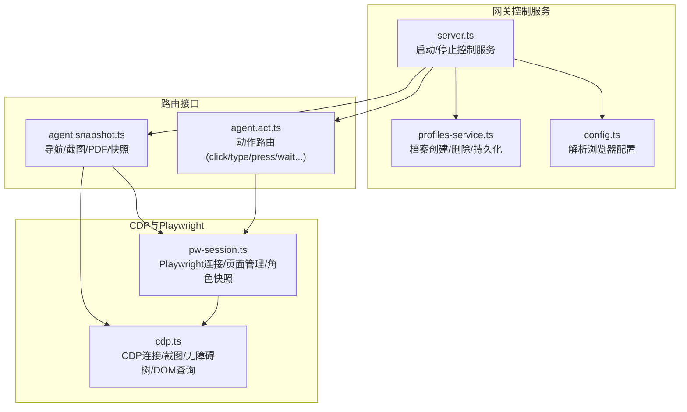
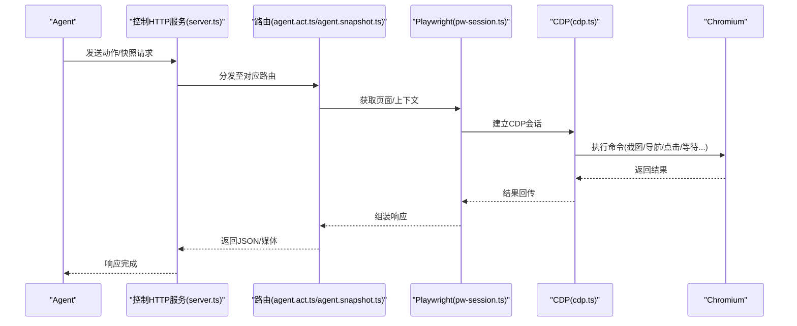
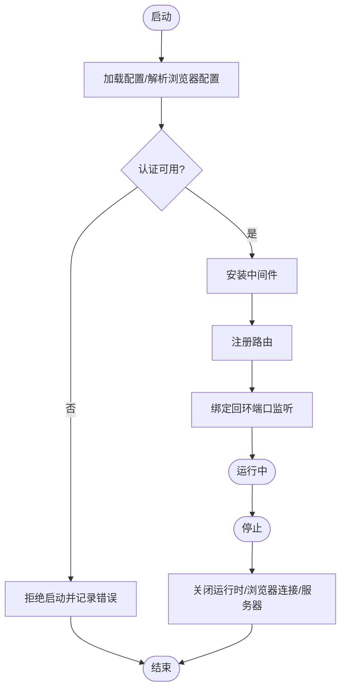
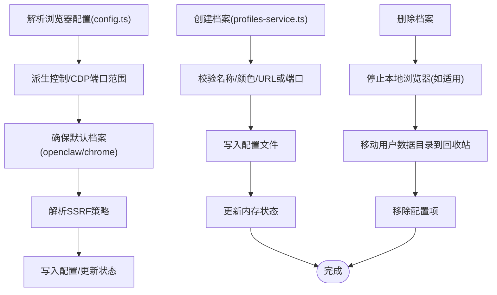
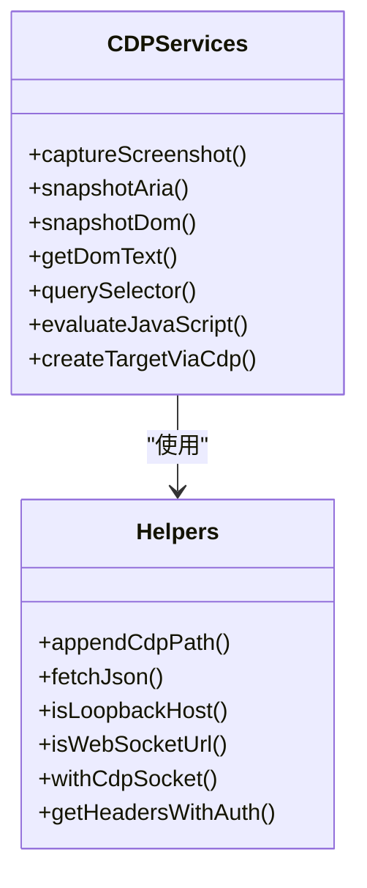
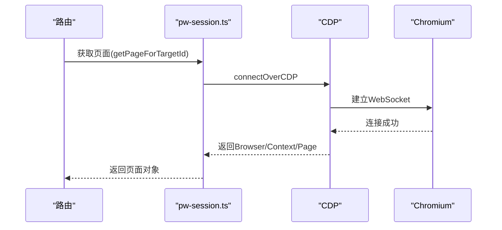
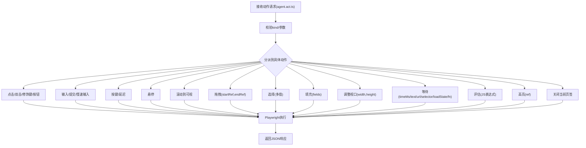
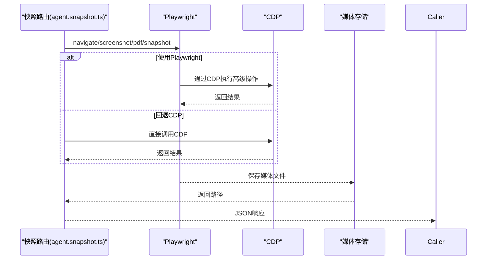
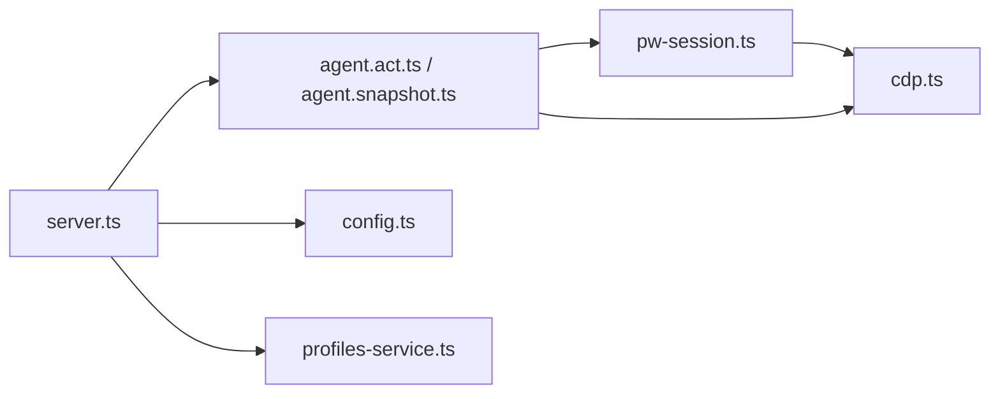

# 浏览器控制工具

<cite>
**本文档引用的文件**
- [browser.md](file://docs/tools/browser.md)
- [server.ts](file://src/browser/server.ts)
- [cdp.ts](file://src/browser/cdp.ts)
- [pw-session.ts](file://src/browser/pw-session.ts)
- [client-actions.ts](file://src/browser/client-actions.ts)
- [agent.act.ts](file://src/browser/routes/agent.act.ts)
- [agent.snapshot.ts](file://src/browser/routes/agent.snapshot.ts)
- [config.ts](file://src/browser/config.ts)
- [profiles-service.ts](file://src/browser/profiles-service.ts)
</cite>

## 目录

1. [简介](#简介)
2. [项目结构](#项目结构)
3. [核心组件](#核心组件)
4. [架构总览](#架构总览)
5. [详细组件分析](#详细组件分析)
6. [依赖关系分析](#依赖关系分析)
7. [性能考虑](#性能考虑)
8. [故障排查指南](#故障排查指南)
9. [结论](#结论)
10. [附录](#附录)

## 简介

本文件面向OpenClaw的浏览器控制工具，系统性阐述其浏览器自动化、CDP协议集成、页面交互、截图与PDF生成、会话与页面管理、文件下载、安全策略与AI代理集成等能力。文档以“从入门到进阶”的方式组织，既适合快速上手，也提供深入的实现细节与可视化图示，帮助开发者理解并扩展该工具。

## 项目结构

浏览器控制工具由“网关控制服务 + 多配置档案 + Playwright桥接 + CDP通道 + 路由接口”构成，核心模块如下：

- 控制服务：启动/停止本地浏览器控制HTTP服务，安装认证与通用中间件，注册路由。
- 配置解析：解析浏览器配置、派生端口范围、默认档案、SSRF策略等。
- 档案服务：创建/删除多档案，分配端口与颜色，持久化配置。
- CDP层：封装WebSocket连接、截图、无障碍树快照、DOM文本/查询等基础能力。
- Playwright层：通过CDP连接Chromium，提供高级交互（点击/输入/拖拽/等待）、角色快照、元素截图、PDF导出、跟踪录制等。
- 路由层：暴露统一的HTTP API，供Agent调用执行动作、获取快照、截图、PDF、状态等。

**图表来源**

- [server.ts:20-86](file://src/browser/server.ts#L20-L86)
- [config.ts:212-319](file://src/browser/config.ts#L212-L319)
- [profiles-service.ts:74-235](file://src/browser/profiles-service.ts#L74-L235)
- [cdp.ts:1-486](file://src/browser/cdp.ts#L1-L486)
- [pw-session.ts:1-800](file://src/browser/pw-session.ts#L1-L800)
- [agent.act.ts:21-381](file://src/browser/routes/agent.act.ts#L21-L381)
- [agent.snapshot.ts:88-343](file://src/browser/routes/agent.snapshot.ts#L88-L343)

**章节来源**

- [browser.md:10-103](file://docs/tools/browser.md#L10-L103)
- [server.ts:20-86](file://src/browser/server.ts#L20-L86)
- [config.ts:212-319](file://src/browser/config.ts#L212-L319)
- [profiles-service.ts:74-235](file://src/browser/profiles-service.ts#L74-L235)

## 核心组件

- 控制服务与认证
  - 启动时加载配置，解析浏览器配置与认证参数；若未配置认证且无法自动生成，则拒绝启动。
  - 安装通用中间件与浏览器专用认证中间件，确保所有路由均受控。
  - 绑定到回环地址，端口派生自网关端口，避免与开发工具冲突。
- 配置解析与派生
  - 解析启用状态、默认档案、颜色、无头模式、沙箱、附加模式、可执行路径、SSRF策略、远程CDP超时等。
  - 自动派生控制端口与CDP端口范围，内置“openclaw”与“chrome”档案。
- 档案服务
  - 创建档案时自动分配端口或校验URL合法性；删除档案时清理用户数据目录并更新配置。
  - 支持扩展驱动（Chrome扩展中继）与本地驱动（OpenClaw托管）。
- CDP与Playwright
  - CDP层提供截图、无障碍树、DOM查询、JS求值等基础能力。
  - Playwright层在CDP之上提供稳定的角色定位、元素截图、PDF导出、等待策略、跟踪录制等高级能力。
- 路由接口
  - 动作路由支持点击、输入、按键、悬停、拖拽、选择、填充、等待、评估、关闭等。
  - 快照路由支持导航、截图、PDF、无障碍/角色快照、标签叠加截图等。

**章节来源**

- [server.ts:20-86](file://src/browser/server.ts#L20-L86)
- [config.ts:212-319](file://src/browser/config.ts#L212-L319)
- [profiles-service.ts:79-170](file://src/browser/profiles-service.ts#L79-L170)
- [cdp.ts:49-140](file://src/browser/cdp.ts#L49-L140)
- [pw-session.ts:332-534](file://src/browser/pw-session.ts#L332-L534)
- [agent.act.ts:25-322](file://src/browser/routes/agent.act.ts#L25-L322)
- [agent.snapshot.ts:92-210](file://src/browser/routes/agent.snapshot.ts#L92-L210)

## 架构总览

浏览器控制工具采用“HTTP控制服务 + CDP/Playwright桥接 + 多档案路由”的分层设计：

- HTTP控制服务：统一入口，负责鉴权、路由注册、生命周期管理。
- CDP层：直接与Chromium基于CDP通信，提供像素级截图、无障碍树、DOM查询等。
- Playwright层：在CDP之上提供稳定的页面对象模型与交互API，用于复杂动作与快照。
- 路由层：将Agent指令映射为具体动作，按档案与目标页签执行。

**图表来源**

- [server.ts:53-61](file://src/browser/server.ts#L53-L61)
- [agent.act.ts:37-321](file://src/browser/routes/agent.act.ts#L37-L321)
- [agent.snapshot.ts:99-120](file://src/browser/routes/agent.snapshot.ts#L99-L120)
- [pw-session.ts:332-534](file://src/browser/pw-session.ts#L332-L534)
- [cdp.ts:103-140](file://src/browser/cdp.ts#L103-L140)

## 详细组件分析

### 控制服务与生命周期

- 启动流程
  - 加载配置并解析浏览器配置，检查是否启用。
  - 尝试确保浏览器控制认证（若未配置则自动生成），失败则拒绝启动。
  - 安装中间件，创建路由上下文，监听回环端口。
- 停止流程
  - 关闭运行时状态，释放浏览器连接，可选关闭HTTP服务器。

**图表来源**

- [server.ts:20-86](file://src/browser/server.ts#L20-L86)

**章节来源**

- [server.ts:20-86](file://src/browser/server.ts#L20-L86)

### 配置解析与档案派生

- 配置解析要点
  - 控制端口与CDP端口范围派生自网关端口；默认“openclaw”档案存在且自动分配CDP端口。
  - 默认档案“chrome”内置指向本地中继端口（控制端口+1），仅限回环主机。
  - SSRF策略默认信任内网，可通过策略显式收紧。
- 档案创建/删除
  - 创建：校验名称、颜色、CDP URL或端口；写入配置并更新内存状态。
  - 删除：停止本地浏览器（如适用）、移动用户数据目录到回收站、更新配置。

**图表来源**

- [config.ts:212-319](file://src/browser/config.ts#L212-L319)
- [profiles-service.ts:79-170](file://src/browser/profiles-service.ts#L79-L170)
- [profiles-service.ts:172-228](file://src/browser/profiles-service.ts#L172-L228)

**章节来源**

- [config.ts:212-319](file://src/browser/config.ts#L212-L319)
- [profiles-service.ts:79-170](file://src/browser/profiles-service.ts#L79-L170)
- [profiles-service.ts:172-228](file://src/browser/profiles-service.ts#L172-L228)

### CDP协议与基础能力

- 截图
  - 支持全页与元素截图，PNG/JPEG格式，质量参数（JPEG）。
- 无障碍树与DOM查询
  - 提供无障碍树快照（含引用编号）、DOM文本抽取、CSS选择器匹配等。
- JS求值
  - 在页面上下文中执行表达式，返回结果或异常详情。
- 目标创建
  - 通过CDP创建新目标（Tab），支持HTTP与WebSocket两种CDP端点发现方式。

**图表来源**

- [cdp.ts:49-140](file://src/browser/cdp.ts#L49-L140)
- [cdp.ts:282-364](file://src/browser/cdp.ts#L282-L364)
- [cdp.ts:381-474](file://src/browser/cdp.ts#L381-L474)

**章节来源**

- [cdp.ts:49-140](file://src/browser/cdp.ts#L49-L140)
- [cdp.ts:282-364](file://src/browser/cdp.ts#L282-L364)
- [cdp.ts:381-474](file://src/browser/cdp.ts#L381-L474)

### Playwright会话与页面管理

- 连接与缓存
  - 通过CDP连接Chromium，支持重连与速率限制处理；连接按CDP URL缓存，避免重复握手。
- 页面定位与目标ID解析
  - 支持通过目标ID解析页面，兼容扩展中继场景；在缺失目标ID时提供最佳努力回退。
- 角色快照与引用缓存
  - 缓存角色引用（role refs），跨请求保持稳定性；支持帧作用域与模式切换（aria/role）。
- 强制断开与终止执行
  - 针对卡死的页面操作，通过断开CDP连接与终止执行上下文实现快速恢复。

**图表来源**

- [pw-session.ts:332-390](file://src/browser/pw-session.ts#L332-L390)
- [pw-session.ts:510-534](file://src/browser/pw-session.ts#L510-L534)

**章节来源**

- [pw-session.ts:332-390](file://src/browser/pw-session.ts#L332-L390)
- [pw-session.ts:498-534](file://src/browser/pw-session.ts#L498-L534)
- [pw-session.ts:575-601](file://src/browser/pw-session.ts#L575-L601)
- [pw-session.ts:700-729](file://src/browser/pw-session.ts#L700-L729)

### 动作路由与页面交互

- 支持的动作类型
  - 点击、双击、修饰键、按钮；输入文本、提交；按键；悬停；滚动到可视；拖拽；选择；填充字段；调整视口；等待（时间/文本/选择器/URL/加载状态/JS谓词）；评估；高亮；关闭。
- 参数校验与错误处理
  - 对必需参数进行校验，对不支持的选择器参数给出明确错误；对禁用的评估动作返回权限错误。
- 与Playwright集成
  - 所有动作最终通过Playwright在指定目标页签上执行，保证稳定性与一致性。

**图表来源**

- [agent.act.ts:25-322](file://src/browser/routes/agent.act.ts#L25-L322)

**章节来源**

- [agent.act.ts:25-322](file://src/browser/routes/agent.act.ts#L25-L322)

### 快照、截图与PDF

- 导航
  - 导航前应用SSRF策略，导航后尝试解析新的目标ID（考虑渲染器切换）。
- 截图
  - 支持全页与元素截图；根据是否具备Playwright能力选择不同实现路径；输出前进行尺寸与字节限制的归一化。
- PDF
  - 通过Playwright生成PDF并保存到媒体存储。
- 快照
  - 支持AI快照（数字引用）与角色快照（aria/ref），可叠加标签截图；支持选择器与帧作用域限定。

**图表来源**

- [agent.snapshot.ts:92-120](file://src/browser/routes/agent.snapshot.ts#L92-L120)
- [agent.snapshot.ts:148-210](file://src/browser/routes/agent.snapshot.ts#L148-L210)
- [agent.snapshot.ts:212-343](file://src/browser/routes/agent.snapshot.ts#L212-L343)
- [cdp.ts:49-101](file://src/browser/cdp.ts#L49-L101)

**章节来源**

- [agent.snapshot.ts:92-120](file://src/browser/routes/agent.snapshot.ts#L92-L120)
- [agent.snapshot.ts:148-210](file://src/browser/routes/agent.snapshot.ts#L148-L210)
- [agent.snapshot.ts:212-343](file://src/browser/routes/agent.snapshot.ts#L212-L343)
- [cdp.ts:49-101](file://src/browser/cdp.ts#L49-L101)

### 安全与隐私

- 认证与访问控制
  - 控制服务仅监听回环地址；若启用认证，所有HTTP路由需携带令牌或密码。
- SSRF防护
  - 默认信任内网，可通过策略收紧；导航前进行SSRF策略校验，远程CDP连接设置超时。
- 评估与隐私
  - 评估功能默认开启，可通过配置禁用；涉及任意JS执行，需谨慎使用。
- 远程CDP
  - 支持HTTP与WebSocket两种端点；建议使用加密端点与短期令牌；避免将长期令牌写入配置文件。

**章节来源**

- [browser.md:246-259](file://docs/tools/browser.md#L246-L259)
- [config.ts:101-128](file://src/browser/config.ts#L101-L128)
- [server.ts:31-51](file://src/browser/server.ts#L31-L51)

## 依赖关系分析

- 组件耦合
  - 控制服务依赖配置解析与档案服务；路由层依赖Playwright与CDP；Playwright依赖CDP。
- 外部依赖
  - Playwright-core用于高级交互与快照；Chromium通过CDP暴露调试接口。
- 可能的循环依赖
  - 通过模块化拆分避免循环导入；路由层仅通过上下文与状态间接访问底层实现。

**图表来源**

- [server.ts:53-61](file://src/browser/server.ts#L53-L61)
- [agent.act.ts:37-43](file://src/browser/routes/agent.act.ts#L37-L43)
- [agent.snapshot.ts:99-104](file://src/browser/routes/agent.snapshot.ts#L99-L104)
- [pw-session.ts:332-390](file://src/browser/pw-session.ts#L332-L390)
- [cdp.ts:103-140](file://src/browser/cdp.ts#L103-L140)
- [config.ts:212-319](file://src/browser/config.ts#L212-L319)
- [profiles-service.ts:79-170](file://src/browser/profiles-service.ts#L79-L170)

**章节来源**

- [server.ts:53-61](file://src/browser/server.ts#L53-L61)
- [agent.act.ts:37-43](file://src/browser/routes/agent.act.ts#L37-L43)
- [agent.snapshot.ts:99-104](file://src/browser/routes/agent.snapshot.ts#L99-L104)
- [pw-session.ts:332-390](file://src/browser/pw-session.ts#L332-L390)
- [cdp.ts:103-140](file://src/browser/cdp.ts#L103-L140)
- [config.ts:212-319](file://src/browser/config.ts#L212-L319)
- [profiles-service.ts:79-170](file://src/browser/profiles-service.ts#L79-L170)

## 性能考虑

- 连接复用与缓存
  - 按CDP URL缓存Playwright连接，减少握手成本；针对扩展中继场景提供目标列表回退。
- 截图优化
  - 元素截图优先使用Playwright以获得更高质量；全页截图在CDP层实现以降低资源消耗。
- 超时与重试
  - CDP连接与远程CDP握手设置合理超时；对速率限制错误避免盲目重试。
- 角色引用缓存
  - 缓存最近目标的角色引用，提升快照稳定性与响应速度。

[本节为通用指导，无需特定文件来源]

## 故障排查指南

- 启动失败（认证未配置）
  - 若未配置认证且无法自动生成，控制服务将拒绝启动。请配置网关令牌或密码。
- 远程CDP连接问题
  - 检查端点协议（HTTP/HTTPS/WSS）、超时设置、认证信息；优先使用加密端点与短期令牌。
- 评估被禁用
  - 若配置禁用了评估功能，相关动作将返回权限错误。请在需要时启用评估。
- 页面目标ID解析失败
  - 在扩展中继场景下，若CDP API不可用，系统提供最佳努力回退；必要时重新获取快照并使用新引用。
- 截图/PDF失败
  - 确认是否具备Playwright；若缺失，部分功能将返回不可用错误；安装Playwright后重启网关。

**章节来源**

- [server.ts:31-51](file://src/browser/server.ts#L31-L51)
- [agent.act.ts:238-247](file://src/browser/routes/agent.act.ts#L238-L247)
- [pw-session.ts:451-496](file://src/browser/pw-session.ts#L451-L496)
- [agent.snapshot.ts:173-177](file://src/browser/routes/agent.snapshot.ts#L173-L177)

## 结论

OpenClaw的浏览器控制工具通过清晰的分层设计与严格的SSRF/认证策略，在保证安全性的同时提供了强大的浏览器自动化能力。CDP与Playwright的结合使得工具既能满足基础截图与快照需求，也能胜任复杂的页面交互与AI辅助分析。多档案与目标页签管理进一步增强了灵活性与可扩展性。

[本节为总结，无需特定文件来源]

## 附录

### 常见使用场景与示例路径

- 网页抓取
  - 导航到目标URL，执行角色快照，提取引用并进行后续动作。
  - 示例路径：[agent.snapshot.ts:92-120](file://src/browser/routes/agent.snapshot.ts#L92-L120)
- 表单填写
  - 获取角色快照，定位输入字段，使用填充动作一次性提交多个字段。
  - 示例路径：[agent.act.ts:187-208](file://src/browser/routes/agent.act.ts#L187-L208)
- 自动化测试
  - 使用等待动作组合（文本出现/URL变化/加载状态/JS谓词），确保页面稳定后再执行下一步。
  - 示例路径：[agent.act.ts:223-276](file://src/browser/routes/agent.act.ts#L223-L276)
- 截图与PDF
  - 元素截图用于精确定位；全页截图用于整体分析；PDF导出用于报告归档。
  - 示例路径：[agent.snapshot.ts:148-210](file://src/browser/routes/agent.snapshot.ts#L148-L210)

### 配置参考

- 基本配置项
  - 启用开关、默认档案、颜色、无头模式、沙箱、附加模式、可执行路径、SSRF策略、远程CDP超时、默认档案等。
- 档案配置
  - 本地档案自动分配端口；远程档案需提供CDP URL；扩展中继档案需为回环HTTP端点。
- 安全建议
  - 使用加密端点与短期令牌；避免在配置中硬编码长期令牌；保持网关与节点主机在私有网络。

**章节来源**

- [browser.md:54-103](file://docs/tools/browser.md#L54-L103)
- [config.ts:212-319](file://src/browser/config.ts#L212-L319)
- [profiles-service.ts:107-141](file://src/browser/profiles-service.ts#L107-L141)
