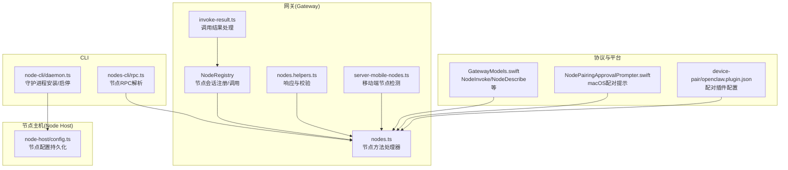
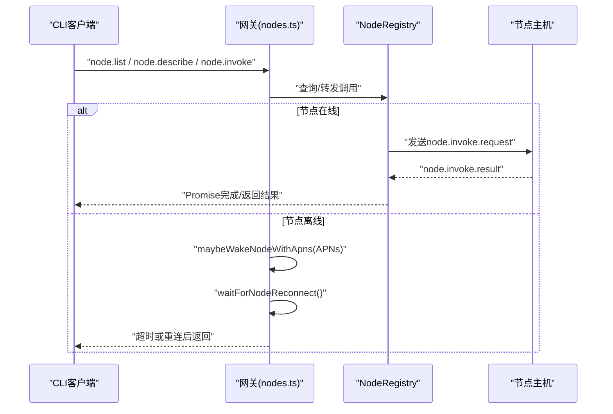
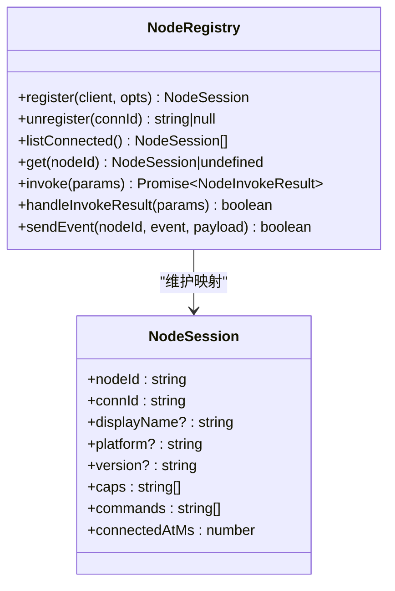
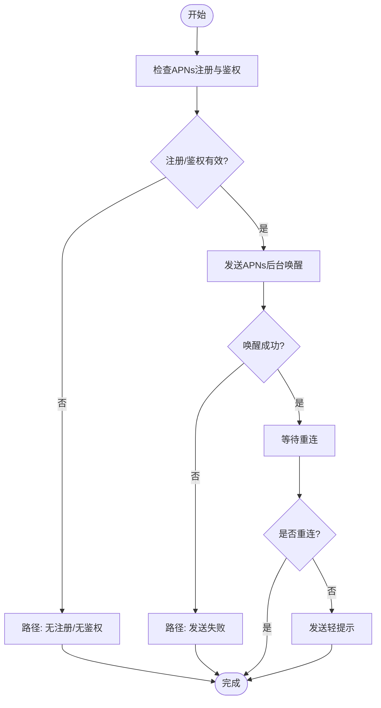
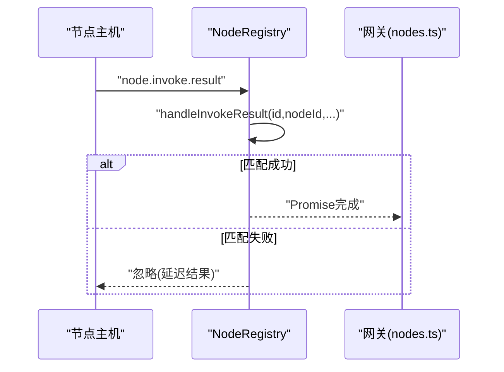
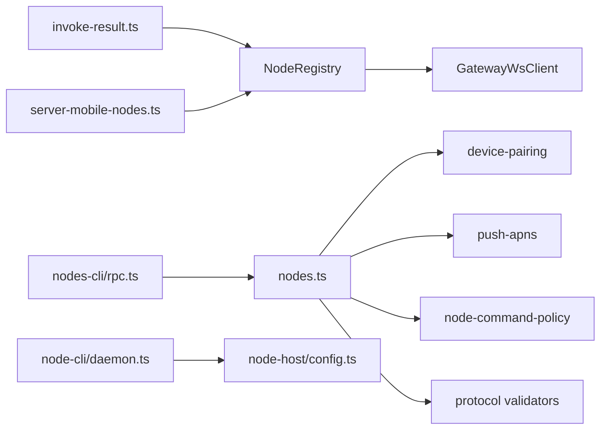

# 节点管理工具

<cite>
**本文引用的文件**
- [src/gateway/node-registry.ts](file://src/gateway/node-registry.ts)
- [src/gateway/server-methods/nodes.ts](file://src/gateway/server-methods/nodes.ts)
- [src/gateway/server-methods/nodes.handlers.invoke-result.ts](file://src/gateway/server-methods/nodes.handlers.invoke-result.ts)
- [src/gateway/server-methods/nodes.helpers.ts](file://src/gateway/server-methods/nodes.helpers.ts)
- [src/gateway/server-mobile-nodes.ts](file://src/gateway/server-mobile-nodes.ts)
- [src/node-host/config.ts](file://src/node-host/config.ts)
- [src/cli/nodes-cli/rpc.ts](file://src/cli/nodes-cli/rpc.ts)
- [src/cli/node-cli/daemon.ts](file://src/cli/node-cli/daemon.ts)
- [apps/shared/OpenClawKit/Sources/OpenClawProtocol/GatewayModels.swift](file://apps/shared/OpenClawKit/Sources/OpenClawProtocol/GatewayModels.swift)
- [apps/macos/Sources/OpenClaw/NodePairingApprovalPrompter.swift](file://apps/macos/Sources/OpenClaw/NodePairingApprovalPrompter.swift)
- [extensions/device-pair/openclaw.plugin.json](file://extensions/device-pair/openclaw.plugin.json)
</cite>

## 目录

1. [简介](#简介)
2. [项目结构](#项目结构)
3. [核心组件](#核心组件)
4. [架构总览](#架构总览)
5. [详细组件分析](#详细组件分析)
6. [依赖关系分析](#依赖关系分析)
7. [性能考量](#性能考量)
8. [故障排查指南](#故障排查指南)
9. [结论](#结论)
10. [附录：配置与扩展开发](#附录配置与扩展开发)

## 简介

本文件面向OpenClaw的“节点管理工具”，系统性阐述节点生命周期管理、进程控制、资源调度与节点间通信机制；并详细说明节点注册、发现、健康检查与故障转移（含APNs唤醒）的实现方式。文档同时提供配置参数说明、性能监控建议与扩展开发指南，并通过图示与路径引用帮助读者快速定位源码位置以开展实践。

## 项目结构

围绕节点管理的关键代码主要分布在以下模块：

- 网关侧节点注册与调用：src/gateway/node-registry.ts、src/gateway/server-methods/nodes.ts
- 节点调用结果处理：src/gateway/server-methods/nodes.handlers.invoke-result.ts
- 节点辅助与错误处理：src/gateway/server-methods/nodes.helpers.ts
- 移动端节点检测：src/gateway/server-mobile-nodes.ts
- 节点主机配置：src/node-host/config.ts
- CLI节点RPC与守护进程：src/cli/nodes-cli/rpc.ts、src/cli/node-cli/daemon.ts
- 协议模型（跨平台）：apps/shared/OpenClawKit/Sources/OpenClawProtocol/GatewayModels.swift
- macOS配对提示器：apps/macos/Sources/OpenClaw/NodePairingApprovalPrompter.swift
- 设备配对插件配置：extensions/device-pair/openclaw.plugin.json

图表来源

- [src/gateway/node-registry.ts:1-210](file://src/gateway/node-registry.ts#L1-L210)
- [src/gateway/server-methods/nodes.ts:1-800](file://src/gateway/server-methods/nodes.ts#L1-L800)
- [src/gateway/server-methods/nodes.handlers.invoke-result.ts:1-72](file://src/gateway/server-methods/nodes.handlers.invoke-result.ts#L1-L72)
- [src/gateway/server-methods/nodes.helpers.ts:55-80](file://src/gateway/server-methods/nodes.helpers.ts#L55-L80)
- [src/gateway/server-mobile-nodes.ts:1-14](file://src/gateway/server-mobile-nodes.ts#L1-L14)
- [src/node-host/config.ts:1-67](file://src/node-host/config.ts#L1-L67)
- [src/cli/nodes-cli/rpc.ts:75-96](file://src/cli/nodes-cli/rpc.ts#L75-L96)
- [src/cli/node-cli/daemon.ts:91-237](file://src/cli/node-cli/daemon.ts#L91-L237)
- [apps/shared/OpenClawKit/Sources/OpenClawProtocol/GatewayModels.swift:813-1047](file://apps/shared/OpenClawKit/Sources/OpenClawProtocol/GatewayModels.swift#L813-L1047)
- [apps/macos/Sources/OpenClaw/NodePairingApprovalPrompter.swift:209-222](file://apps/macos/Sources/OpenClaw/NodePairingApprovalPrompter.swift#L209-L222)
- [extensions/device-pair/openclaw.plugin.json:1-21](file://extensions/device-pair/openclaw.plugin.json#L1-L21)

章节来源

- [src/gateway/node-registry.ts:1-210](file://src/gateway/node-registry.ts#L1-L210)
- [src/gateway/server-methods/nodes.ts:1-800](file://src/gateway/server-methods/nodes.ts#L1-L800)
- [src/gateway/server-methods/nodes.handlers.invoke-result.ts:1-72](file://src/gateway/server-methods/nodes.handlers.invoke-result.ts#L1-L72)
- [src/gateway/server-methods/nodes.helpers.ts:55-80](file://src/gateway/server-methods/nodes.helpers.ts#L55-L80)
- [src/gateway/server-mobile-nodes.ts:1-14](file://src/gateway/server-mobile-nodes.ts#L1-L14)
- [src/node-host/config.ts:1-67](file://src/node-host/config.ts#L1-L67)
- [src/cli/nodes-cli/rpc.ts:75-96](file://src/cli/nodes-cli/rpc.ts#L75-L96)
- [src/cli/node-cli/daemon.ts:91-237](file://src/cli/node-cli/daemon.ts#L91-L237)
- [apps/shared/OpenClawKit/Sources/OpenClawProtocol/GatewayModels.swift:813-1047](file://apps/shared/OpenClawKit/Sources/OpenClawProtocol/GatewayModels.swift#L813-L1047)
- [apps/macos/Sources/OpenClaw/NodePairingApprovalPrompter.swift:209-222](file://apps/macos/Sources/OpenClaw/NodePairingApprovalPrompter.swift#L209-L222)
- [extensions/device-pair/openclaw.plugin.json:1-21](file://extensions/device-pair/openclaw.plugin.json#L1-L21)

## 核心组件

- 节点注册中心（NodeRegistry）
  - 维护节点会话映射（按nodeId与connId），支持注册、注销、查询、事件发送与调用转发。
  - 提供invoke方法进行请求-响应式调用，并内置超时与挂起请求管理。
- 节点方法处理器（nodes.ts）
  - 实现节点配对、重命名、列表、描述、画布能力刷新、待处理动作拉取与确认、节点唤醒（APNs）、等待重连等。
  - 包含前台受限命令队列策略与节流控制。
- 调用结果处理（invoke-result.ts）
  - 校验并规范化调用结果，回填到NodeRegistry的挂起调用队列，触发Promise完成。
- 辅助与错误处理（nodes.helpers.ts）
  - 统一响应格式与参数校验失败处理，将节点侧错误映射为网关可用状态。
- 移动端节点检测（server-mobile-nodes.ts）
  - 基于平台标识判断是否存在已连接的移动端节点。
- 节点主机配置（node-host/config.ts）
  - 节点主机配置的加载、归一化与原子写入，确保节点ID与网关连接信息持久化。
- CLI节点RPC与守护进程（nodes-cli/rpc.ts、node-cli/daemon.ts）
  - 解析节点查询与列表，封装守护进程安装/启动/重启/停止/状态查询。
- 协议模型（GatewayModels.swift）
  - 定义节点调用、描述、待处理队列等参数与返回结构，跨平台共享。
- macOS配对提示器（NodePairingApprovalPrompter.swift）
  - 针对配对请求的审批流程与提示逻辑。
- 设备配对插件配置（device-pair/openclaw.plugin.json）
  - 插件元数据与UI提示，用于生成配对码与批准流程。

章节来源

- [src/gateway/node-registry.ts:1-210](file://src/gateway/node-registry.ts#L1-L210)
- [src/gateway/server-methods/nodes.ts:1-800](file://src/gateway/server-methods/nodes.ts#L1-L800)
- [src/gateway/server-methods/nodes.handlers.invoke-result.ts:1-72](file://src/gateway/server-methods/nodes.handlers.invoke-result.ts#L1-L72)
- [src/gateway/server-methods/nodes.helpers.ts:55-80](file://src/gateway/server-methods/nodes.helpers.ts#L55-L80)
- [src/gateway/server-mobile-nodes.ts:1-14](file://src/gateway/server-mobile-nodes.ts#L1-L14)
- [src/node-host/config.ts:1-67](file://src/node-host/config.ts#L1-L67)
- [src/cli/nodes-cli/rpc.ts:75-96](file://src/cli/nodes-cli/rpc.ts#L75-L96)
- [src/cli/node-cli/daemon.ts:91-237](file://src/cli/node-cli/daemon.ts#L91-L237)
- [apps/shared/OpenClawKit/Sources/OpenClawProtocol/GatewayModels.swift:813-1047](file://apps/shared/OpenClawKit/Sources/OpenClawProtocol/GatewayModels.swift#L813-L1047)
- [apps/macos/Sources/OpenClaw/NodePairingApprovalPrompter.swift:209-222](file://apps/macos/Sources/OpenClaw/NodePairingApprovalPrompter.swift#L209-L222)
- [extensions/device-pair/openclaw.plugin.json:1-21](file://extensions/device-pair/openclaw.plugin.json#L1-L21)

## 架构总览

下图展示了从CLI到网关、再到节点主机的典型调用链路，以及节点唤醒与结果回调的关键步骤。

图表来源

- [src/gateway/server-methods/nodes.ts:776-875](file://src/gateway/server-methods/nodes.ts#L776-L875)
- [src/gateway/node-registry.ts:107-155](file://src/gateway/node-registry.ts#L107-L155)
- [src/gateway/server-methods/nodes.handlers.invoke-result.ts:25-71](file://src/gateway/server-methods/nodes.handlers.invoke-result.ts#L25-L71)

## 详细组件分析

### 节点注册与生命周期（NodeRegistry）

- 注册：接收WebSocket连接信息，提取设备与能力字段，建立会话并登记映射。
- 注销：断开连接时清理会话与未完成的调用，拒绝后续结果。
- 查询：提供按nodeId与按连接ID的查询接口，支持遍历已连接节点。
- 调用：构造请求ID与载荷，发送到节点；若发送失败或超时，返回标准化错误。
- 结果处理：根据请求ID匹配挂起调用，清理定时器并完成Promise。

图表来源

- [src/gateway/node-registry.ts:4-210](file://src/gateway/node-registry.ts#L4-L210)

章节来源

- [src/gateway/node-registry.ts:1-210](file://src/gateway/node-registry.ts#L1-L210)

### 节点方法与健康检查（nodes.ts）

- 节点配对：请求、列出、批准、拒绝、验证令牌，广播配对结果。
- 节点管理：重命名、列出、描述、画布能力刷新、待处理动作拉取与确认。
- 健康检查与唤醒：
  - maybeWakeNodeWithApns：基于APNs后台唤醒，带节流与重试等待。
  - maybeSendNodeWakeNudge：向移动端发送轻提示，避免频繁打扰。
  - waitForNodeReconnect：轮询等待节点重连。
- 前台受限命令策略：iOS/iPadOS上对特定命令在后台不可用时，自动入队待处理并限制最大数量与TTL。

图表来源

- [src/gateway/server-methods/nodes.ts:211-382](file://src/gateway/server-methods/nodes.ts#L211-L382)

章节来源

- [src/gateway/server-methods/nodes.ts:1-800](file://src/gateway/server-methods/nodes.ts#L1-L800)

### 调用结果处理（invoke-result.ts）

- 参数规范化：兼容payload与payloadJSON，统一为payload对象。
- 身份校验：确保结果中的nodeId与调用发起方一致。
- 回填与忽略：匹配挂起调用并完成Promise；对超时后的延迟结果仅记录日志并返回成功。

图表来源

- [src/gateway/server-methods/nodes.handlers.invoke-result.ts:25-71](file://src/gateway/server-methods/nodes.handlers.invoke-result.ts#L25-L71)
- [src/gateway/node-registry.ts:157-181](file://src/gateway/node-registry.ts#L157-L181)

章节来源

- [src/gateway/server-methods/nodes.handlers.invoke-result.ts:1-72](file://src/gateway/server-methods/nodes.handlers.invoke-result.ts#L1-L72)
- [src/gateway/server-methods/nodes.helpers.ts:55-80](file://src/gateway/server-methods/nodes.helpers.ts#L55-L80)

### 移动端节点检测（server-mobile-nodes.ts）

- 判断平台前缀（iOS/iPadOS/Android）以识别移动节点。
- 提供hasConnectedMobileNode用于条件逻辑（如启用特定功能）。

章节来源

- [src/gateway/server-mobile-nodes.ts:1-14](file://src/gateway/server-mobile-nodes.ts#L1-L14)

### 节点主机配置（node-host/config.ts）

- 归一化配置：缺失时自动生成nodeId，保留用户显式设置。
- 原子写入：使用安全写入模式，权限为0o600，防止泄露敏感信息。
- 加载/保存/确保存在：提供完整生命周期管理。

章节来源

- [src/node-host/config.ts:1-67](file://src/node-host/config.ts#L1-L67)

### CLI节点RPC与守护进程（nodes-cli/rpc.ts、node-cli/daemon.ts）

- 节点解析：优先从网关node.list获取节点列表，若失败则回退到node.pair.list。
- 守护进程：支持安装、启动、重启、停止与状态查询，输出富文本或JSON。
- 运行时警告：在特定运行时环境给出系统Node版本提示。

章节来源

- [src/cli/nodes-cli/rpc.ts:75-96](file://src/cli/nodes-cli/rpc.ts#L75-L96)
- [src/cli/node-cli/daemon.ts:91-237](file://src/cli/node-cli/daemon.ts#L91-L237)

### 协议模型与跨平台交互（GatewayModels.swift）

- 定义节点调用参数（nodeId、command、params、timeoutMs、idempotencyKey）与结果结构。
- 支持payload与payloadJSON两种序列化形式，便于跨语言传输。

章节来源

- [apps/shared/OpenClawKit/Sources/OpenClawProtocol/GatewayModels.swift:813-1047](file://apps/shared/OpenClawKit/Sources/OpenClawProtocol/GatewayModels.swift#L813-L1047)

### macOS配对提示器（NodePairingApprovalPrompter.swift）

- 推断配对决议：根据已配对节点与时间戳决定批准或拒绝。
- 结束活动提醒：统一管理弹窗状态。

章节来源

- [apps/macos/Sources/OpenClaw/NodePairingApprovalPrompter.swift:209-222](file://apps/macos/Sources/OpenClaw/NodePairingApprovalPrompter.swift#L209-L222)

### 设备配对插件配置（device-pair/openclaw.plugin.json）

- 插件元数据：名称、描述、配置Schema与UI提示。
- 关键配置项：publicUrl（用于配对码生成与批准流程）。

章节来源

- [extensions/device-pair/openclaw.plugin.json:1-21](file://extensions/device-pair/openclaw.plugin.json#L1-L21)

## 依赖关系分析

- NodeRegistry依赖WebSocket客户端类型（GatewayWsClient）以发送事件。
- nodes.ts依赖设备配对、APNs、Canvas能力、命令策略与参数校验模块。
- invoke-result.ts依赖NodeRegistry以回填调用结果。
- server-mobile-nodes.ts依赖NodeRegistry以判断移动端节点存在性。
- CLI层依赖网关RPC与守护进程服务抽象。

图表来源

- [src/gateway/node-registry.ts:1-210](file://src/gateway/node-registry.ts#L1-L210)
- [src/gateway/server-methods/nodes.ts:1-800](file://src/gateway/server-methods/nodes.ts#L1-L800)
- [src/gateway/server-methods/nodes.handlers.invoke-result.ts:1-72](file://src/gateway/server-methods/nodes.handlers.invoke-result.ts#L1-L72)
- [src/gateway/server-mobile-nodes.ts:1-14](file://src/gateway/server-mobile-nodes.ts#L1-L14)
- [src/cli/nodes-cli/rpc.ts:75-96](file://src/cli/nodes-cli/rpc.ts#L75-L96)
- [src/cli/node-cli/daemon.ts:91-237](file://src/cli/node-cli/daemon.ts#L91-L237)
- [src/node-host/config.ts:1-67](file://src/node-host/config.ts#L1-L67)

章节来源

- [src/gateway/node-registry.ts:1-210](file://src/gateway/node-registry.ts#L1-L210)
- [src/gateway/server-methods/nodes.ts:1-800](file://src/gateway/server-methods/nodes.ts#L1-L800)
- [src/gateway/server-methods/nodes.handlers.invoke-result.ts:1-72](file://src/gateway/server-methods/nodes.handlers.invoke-result.ts#L1-L72)
- [src/gateway/server-mobile-nodes.ts:1-14](file://src/gateway/server-mobile-nodes.ts#L1-L14)
- [src/cli/nodes-cli/rpc.ts:75-96](file://src/cli/nodes-cli/rpc.ts#L75-L96)
- [src/cli/node-cli/daemon.ts:91-237](file://src/cli/node-cli/daemon.ts#L91-L237)
- [src/node-host/config.ts:1-67](file://src/node-host/config.ts#L1-L67)

## 性能考量

- 调用超时与挂起管理：默认超时30秒，避免长时间占用Promise；超时后清理挂起项。
- APNs唤醒节流：唤醒请求有最小间隔限制，减少无效推送。
- 待处理动作队列：限制最大长度与TTL，避免内存膨胀与过期任务堆积。
- 广播消息丢弃策略：对慢消费者使用dropIfSlow降低拥塞风险。
- 移动端前台受限命令：在后台不可用时自动入队，提升用户体验与稳定性。

章节来源

- [src/gateway/node-registry.ts:138-155](file://src/gateway/node-registry.ts#L138-L155)
- [src/gateway/server-methods/nodes.ts:50-56](file://src/gateway/server-methods/nodes.ts#L50-L56)
- [src/gateway/server-methods/nodes.ts:141-198](file://src/gateway/server-methods/nodes.ts#L141-L198)

## 故障排查指南

- 节点未连接
  - 现象：返回“NOT_CONNECTED”错误。
  - 处理：确认节点已通过网关认证并保持WS连接。
  - 参考：[src/gateway/node-registry.ts:114-119](file://src/gateway/node-registry.ts#L114-L119)
- 调用发送失败
  - 现象：返回“UNAVAILABLE”错误。
  - 处理：检查网关到节点的网络连通性与WS通道状态。
  - 参考：[src/gateway/node-registry.ts:132-137](file://src/gateway/node-registry.ts#L132-L137)
- 调用超时
  - 现象：返回“TIMEOUT”错误。
  - 处理：延长超时时间或优化节点处理耗时；必要时使用待处理队列。
  - 参考：[src/gateway/node-registry.ts:140-146](file://src/gateway/node-registry.ts#L140-L146)
- 节点离线唤醒
  - 现象：APNs未注册/鉴权失败/发送失败。
  - 处理：检查APNs配置、证书与设备注册状态；必要时发送轻提示。
  - 参考：[src/gateway/server-methods/nodes.ts:211-382](file://src/gateway/server-methods/nodes.ts#L211-L382)
- 调用结果不匹配
  - 现象：nodeId不一致导致拒绝。
  - 处理：确保调用方与结果上报方一致。
  - 参考：[src/gateway/server-methods/nodes.handlers.invoke-result.ts:48-52](file://src/gateway/server-methods/nodes.handlers.invoke-result.ts#L48-L52)
- 配对问题
  - 现象：请求未知、令牌无效、批准/拒绝失败。
  - 处理：核对requestId与nodeId；检查插件配置与公共URL。
  - 参考：[src/gateway/server-methods/nodes.ts:384-508](file://src/gateway/server-methods/nodes.ts#L384-L508)，[extensions/device-pair/openclaw.plugin.json:1-21](file://extensions/device-pair/openclaw.plugin.json#L1-L21)

章节来源

- [src/gateway/node-registry.ts:114-155](file://src/gateway/node-registry.ts#L114-L155)
- [src/gateway/server-methods/nodes.ts:211-382](file://src/gateway/server-methods/nodes.ts#L211-L382)
- [src/gateway/server-methods/nodes.handlers.invoke-result.ts:48-52](file://src/gateway/server-methods/nodes.handlers.invoke-result.ts#L48-L52)
- [extensions/device-pair/openclaw.plugin.json:1-21](file://extensions/device-pair/openclaw.plugin.json#L1-L21)

## 结论

OpenClaw的节点管理工具通过“注册中心+方法处理器+结果回填”的分层设计，实现了稳定的节点生命周期管理与调用编排。配合APNs唤醒、待处理队列与前台受限策略，系统在复杂网络环境下仍能保持高可用与良好体验。建议在生产环境中结合日志与指标监控，持续优化超时与节流参数，并完善配对与安全策略。

## 附录：配置与扩展开发

### 节点主机配置参数

- 文件位置：state目录下的node.json（由NodeHostConfig持久化）
- 关键字段
  - version：配置版本号
  - nodeId：节点唯一标识（未提供时自动生成）
  - token：可选访问令牌
  - displayName：显示名称
  - gateway.host/port/tls/tlsFingerprint：网关连接参数

章节来源

- [src/node-host/config.ts:14-66](file://src/node-host/config.ts#L14-L66)

### CLI节点操作要点

- 节点解析：优先使用node.list，失败回退node.pair.list。
- 守护进程：支持安装/启动/重启/停止/状态查询，输出JSON或富文本。
- 运行时警告：在系统Node环境下提示潜在兼容性问题。

章节来源

- [src/cli/nodes-cli/rpc.ts:75-96](file://src/cli/nodes-cli/rpc.ts#L75-L96)
- [src/cli/node-cli/daemon.ts:91-237](file://src/cli/node-cli/daemon.ts#L91-L237)

### 节点间通信与协议

- 调用参数：nodeId、command、params、timeoutMs、idempotencyKey
- 结果结构：ok、payload/payloadJSON、error
- 事件通道：通过WebSocket事件“node.invoke.request”与“node.invoke.result”进行双向通信

章节来源

- [apps/shared/OpenClawKit/Sources/OpenClawProtocol/GatewayModels.swift:867-929](file://apps/shared/OpenClawKit/Sources/OpenClawProtocol/GatewayModels.swift#L867-L929)

### 扩展开发指南

- 设备配对插件
  - 在openclaw.plugin.json中声明插件元数据与配置Schema
  - 使用publicUrl作为配对码生成与批准流程的入口
- 自定义节点
  - 通过NodeHostConfig配置节点ID与网关连接参数
  - 在节点侧实现命令处理逻辑，并通过WebSocket上报结果
- 前台受限命令
  - 对iOS/iPadOS后台不可用的命令，采用待处理队列策略，避免阻塞主流程

章节来源

- [extensions/device-pair/openclaw.plugin.json:1-21](file://extensions/device-pair/openclaw.plugin.json#L1-L21)
- [src/gateway/server-methods/nodes.ts:120-139](file://src/gateway/server-methods/nodes.ts#L120-L139)
