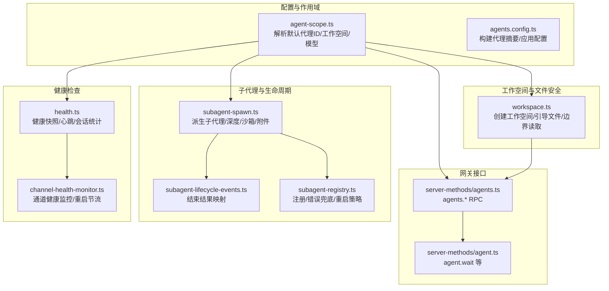
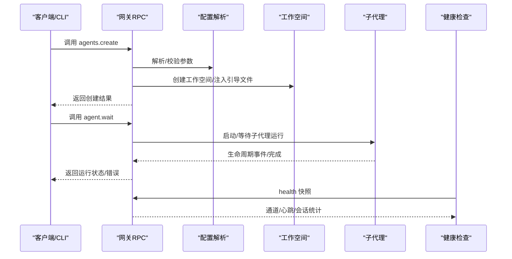
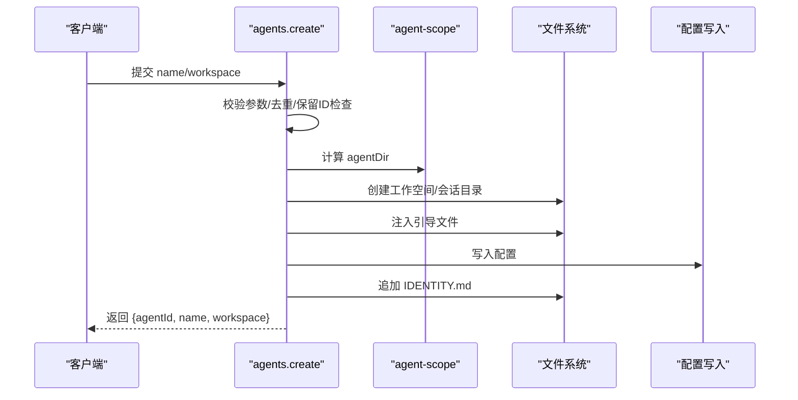
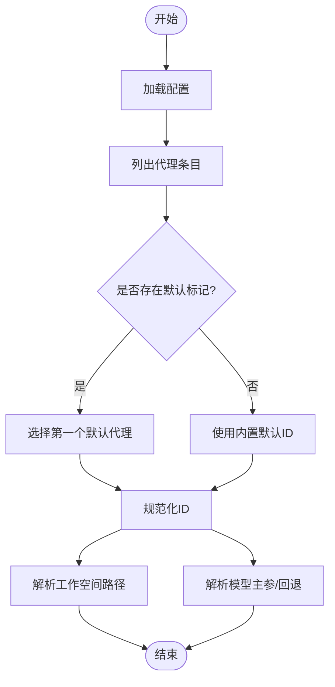
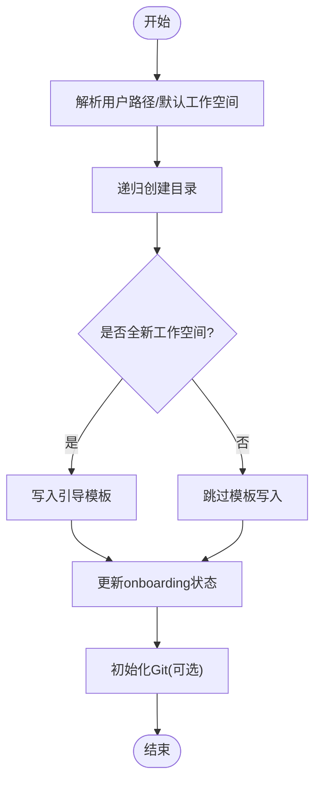
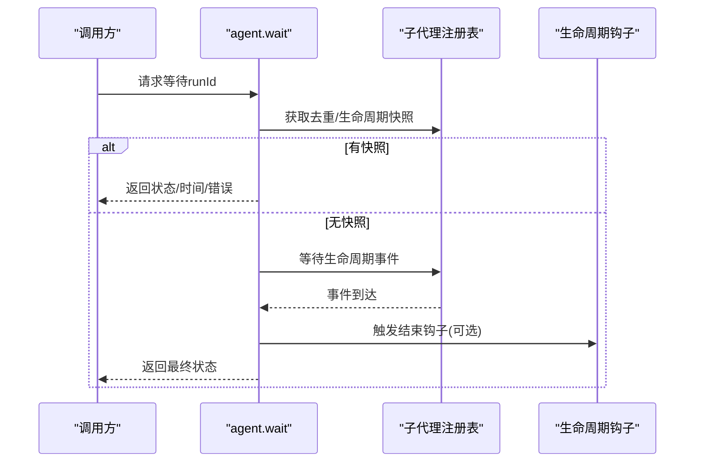
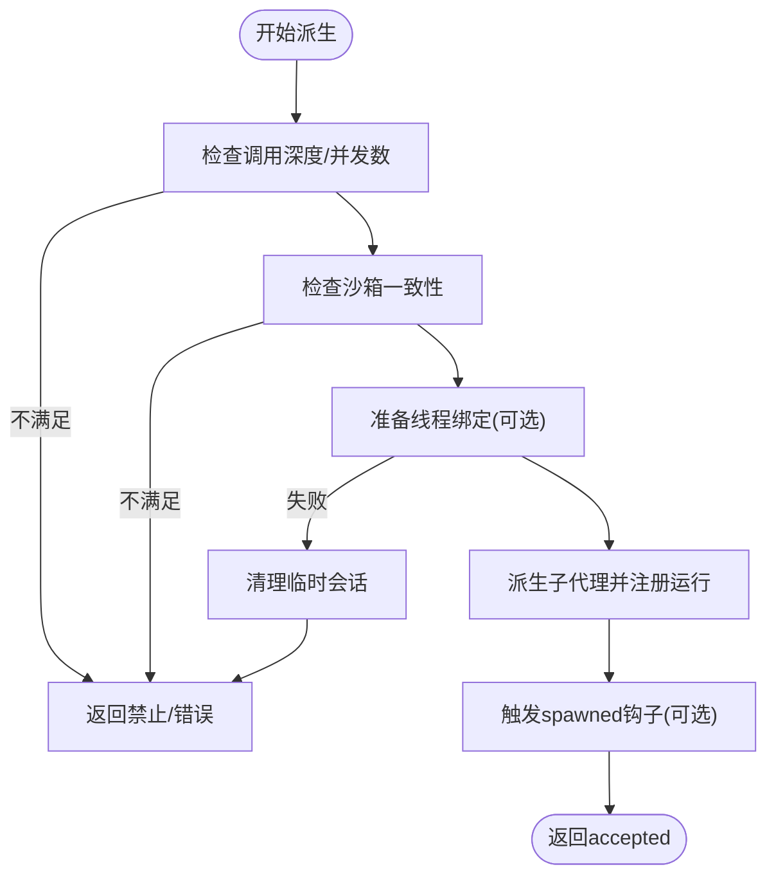
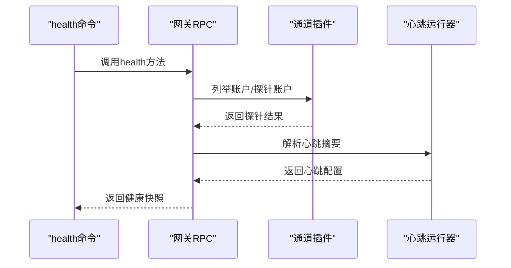
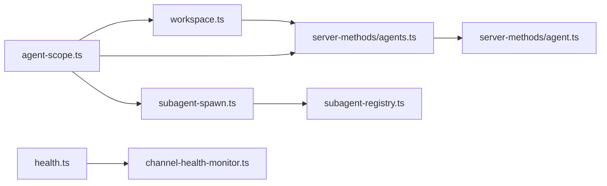

# 代理生命周期管理

<cite>
**本文引用的文件**
- [src/agents/workspace.ts](file://src/agents/workspace.ts)
- [src/agents/agent-scope.ts](file://src/agents/agent-scope.ts)
- [src/agents/subagent-spawn.ts](file://src/agents/subagent-spawn.ts)
- [src/agents/subagent-lifecycle-events.ts](file://src/agents/subagent-lifecycle-events.ts)
- [src/agents/subagent-registry.ts](file://src/agents/subagent-registry.ts)
- [src/gateway/server-methods/agents.ts](file://src/gateway/server-methods/agents.ts)
- [src/gateway/server-methods/agent.ts](file://src/gateway/server-methods/agent.ts)
- [src/commands/agents.config.ts](file://src/commands/agents.config.ts)
- [src/commands/health.ts](file://src/commands/health.ts)
- [src/config/validation.ts](file://src/config/validation.ts)
- [src/gateway/channel-health-monitor.ts](file://src/gateway/channel-health-monitor.ts)
- [apps/macos/Sources/OpenClaw/AgentWorkspace.swift](file://apps/macos/Sources/OpenClaw/AgentWorkspace.swift)
</cite>

## 目录

1. [简介](#简介)
2. [项目结构](#项目结构)
3. [核心组件](#核心组件)
4. [架构总览](#架构总览)
5. [详细组件分析](#详细组件分析)
6. [依赖关系分析](#依赖关系分析)
7. [性能考量](#性能考量)
8. [故障排查指南](#故障排查指南)
9. [结论](#结论)
10. [附录](#附录)

## 简介

本技术文档围绕 OpenClaw 的代理生命周期管理展开，系统阐述代理从创建、初始化、运行、暂停、恢复到销毁的完整流程；详解代理配置解析（默认代理 ID 解析、配置合并、参数校验）、工作空间的创建与管理（路径解析、权限与边界保护、资源隔离）、状态监控与健康检查、以及异常处理策略。文档同时提供可操作的实践建议与常见问题处理方案，帮助开发者在复杂多代理场景下稳定地管理代理生命周期。

## 项目结构

OpenClaw 将代理生命周期管理拆分为多个层次：

- 配置与作用域：负责代理配置解析、默认代理 ID 决策、工作空间目录解析与路径规范化。
- 工作空间与文件安全：负责工作空间的创建、引导文件注入、文件读写边界保护与缓存。
- 网关方法：提供 agents._ 与 agent._ RPC 接口，支撑代理的创建、更新、删除、文件读写与等待。
- 子代理与生命周期事件：负责子代理派生、深度控制、会话绑定、生命周期钩子与错误兜底。
- 健康检查与通道监控：提供跨通道的健康快照与重启节流策略，保障代理运行稳定性。

图示来源

- [src/agents/agent-scope.ts:72-116](file://src/agents/agent-scope.ts#L72-L116)
- [src/agents/workspace.ts:321-459](file://src/agents/workspace.ts#L321-L459)
- [src/gateway/server-methods/agents.ts:458-775](file://src/gateway/server-methods/agents.ts#L458-L775)
- [src/gateway/server-methods/agent.ts:754-783](file://src/gateway/server-methods/agent.ts#L754-L783)
- [src/agents/subagent-spawn.ts:238-745](file://src/agents/subagent-spawn.ts#L238-L745)
- [src/agents/subagent-lifecycle-events.ts:32-47](file://src/agents/subagent-lifecycle-events.ts#L32-L47)
- [src/agents/subagent-registry.ts:279-313](file://src/agents/subagent-registry.ts#L279-L313)
- [src/commands/health.ts:348-523](file://src/commands/health.ts#L348-L523)
- [src/gateway/channel-health-monitor.ts:76-111](file://src/gateway/channel-health-monitor.ts#L76-L111)

章节来源

- [src/agents/agent-scope.ts:72-116](file://src/agents/agent-scope.ts#L72-L116)
- [src/agents/workspace.ts:321-459](file://src/agents/workspace.ts#L321-L459)
- [src/gateway/server-methods/agents.ts:458-775](file://src/gateway/server-methods/agents.ts#L458-L775)

## 核心组件

- 代理作用域与配置解析：负责默认代理 ID 决策、代理列表与 ID 规范化、工作空间与模型解析、技能过滤等。
- 工作空间与引导文件：负责工作空间目录创建、引导文件注入、文件读写边界保护、Git 初始化与状态记录。
- 网关代理管理 RPC：提供 agents.list/create/update/delete/files.\* 等方法，确保配置变更与文件操作的安全性与原子性。
- 子代理派生与生命周期：负责子代理深度限制、沙箱一致性、线程绑定、系统提示词拼装、附件材料化与生命周期钩子。
- 健康检查与通道监控：提供跨通道健康快照、心跳汇总、会话统计与通道重启节流策略。

章节来源

- [src/agents/agent-scope.ts:118-145](file://src/agents/agent-scope.ts#L118-L145)
- [src/agents/workspace.ts:498-555](file://src/agents/workspace.ts#L498-L555)
- [src/gateway/server-methods/agents.ts:458-775](file://src/gateway/server-methods/agents.ts#L458-L775)
- [src/agents/subagent-spawn.ts:238-745](file://src/agents/subagent-spawn.ts#L238-L745)
- [src/commands/health.ts:348-523](file://src/commands/health.ts#L348-L523)

## 架构总览

OpenClaw 的代理生命周期由“配置解析—工作空间—RPC 接口—子代理—健康监控”五条主线协同完成。配置解析模块为其他模块提供标准化的代理 ID、工作空间路径与模型主参；工作空间模块提供边界安全的文件读写能力；RPC 模块保证配置变更与文件操作的原子性与安全性；子代理模块在严格约束下派生并管理子任务；健康检查模块持续评估通道与代理状态，必要时触发重启与节流。

图示来源

- [src/gateway/server-methods/agents.ts:476-547](file://src/gateway/server-methods/agents.ts#L476-L547)
- [src/gateway/server-methods/agent.ts:754-783](file://src/gateway/server-methods/agent.ts#L754-L783)
- [src/commands/health.ts:348-523](file://src/commands/health.ts#L348-L523)

## 详细组件分析

### 代理创建与初始化

- 参数校验与冲突检测：agents.create 对必填字段进行校验，拒绝保留 ID（如 main）与重复 ID，并在写入配置前确保工作空间与会话目录存在。
- 配置应用与持久化：先应用配置（含名称、工作空间、agentDir），再写入配置文件，最后写入 IDENTITY.md。
- 工作空间引导：调用 ensureAgentWorkspace 注入 AGENTS.md、SOUL.md、TOOLS.md、IDENTITY.md、USER.md、HEARTBEAT.md 等引导文件，并在需要时初始化 Git 仓库。

图示来源

- [src/gateway/server-methods/agents.ts:476-547](file://src/gateway/server-methods/agents.ts#L476-L547)
- [src/agents/agent-scope.ts:330-338](file://src/agents/agent-scope.ts#L330-L338)

章节来源

- [src/gateway/server-methods/agents.ts:476-547](file://src/gateway/server-methods/agents.ts#L476-L547)
- [src/agents/workspace.ts:321-459](file://src/agents/workspace.ts#L321-L459)

### 代理配置解析与合并

- 默认代理 ID 解析：当未配置默认代理时回退到内置默认值；若存在多个 default=true，仅使用第一个并发出警告。
- 代理列表与 ID 规范化：对代理列表进行去重与规范化，确保后续解析一致。
- 工作空间与模型解析：优先使用代理显式配置，其次使用全局默认配置；模型主参支持字符串或对象 primary 字段。
- 技能过滤与模型回退：支持按技能过滤与模型回退数组覆盖。

图示来源

- [src/agents/agent-scope.ts:72-116](file://src/agents/agent-scope.ts#L72-L116)
- [src/agents/agent-scope.ts:256-272](file://src/agents/agent-scope.ts#L256-L272)
- [src/agents/agent-scope.ts:178-191](file://src/agents/agent-scope.ts#L178-L191)

章节来源

- [src/agents/agent-scope.ts:72-116](file://src/agents/agent-scope.ts#L72-L116)
- [src/agents/agent-scope.ts:256-272](file://src/agents/agent-scope.ts#L256-L272)
- [src/agents/agent-scope.ts:178-191](file://src/agents/agent-scope.ts#L178-L191)

### 代理工作空间的创建与管理

- 路径解析与规范化：支持用户路径替换、空字节清理、大小写归一化（Windows 平台）与真实路径解析（避免符号链接别名）。
- 引导文件注入：首次创建时写入 AGENTS.md、SOUL.md、TOOLS.md、IDENTITY.md、USER.md、HEARTBEAT.md；兼容旧版迁移逻辑。
- 边界安全与缓存：通过边界文件打开与 inode/设备/大小/修改时间组合的身份标识缓存，防止越界访问与缓存污染。
- Git 初始化：在新工作空间中尝试初始化 Git 仓库，忽略失败不影响整体成功。

图示来源

- [src/agents/workspace.ts:321-459](file://src/agents/workspace.ts#L321-L459)
- [src/agents/workspace.ts:498-555](file://src/agents/workspace.ts#L498-L555)
- [src/agents/workspace.ts:565-573](file://src/agents/workspace.ts#L565-L573)

章节来源

- [src/agents/workspace.ts:321-459](file://src/agents/workspace.ts#L321-L459)
- [src/agents/workspace.ts:498-555](file://src/agents/workspace.ts#L498-L555)

### 代理运行、暂停、恢复与销毁

- 运行与等待：agent.wait 支持去重与生命周期双通道快照，超时返回 timeout，否则返回运行状态、起止时间与错误信息。
- 暂停与恢复：当前实现以会话键与生命周期事件为主，暂停/恢复通常通过会话状态与线程绑定实现，具体行为由通道插件与钩子决定。
- 销毁：agents.delete 支持删除配置与可选删除文件（工作空间、agent 目录、会话转录），并清理绑定与工具允许列表。

图示来源

- [src/gateway/server-methods/agent.ts:754-783](file://src/gateway/server-methods/agent.ts#L754-L783)
- [src/agents/subagent-registry.ts:279-313](file://src/agents/subagent-registry.ts#L279-L313)

章节来源

- [src/gateway/server-methods/agent.ts:754-783](file://src/gateway/server-methods/agent.ts#L754-L783)
- [src/gateway/server-methods/agents.ts:594-632](file://src/gateway/server-methods/agents.ts#L594-L632)

### 子代理派生与生命周期事件

- 深度与并发限制：基于会话存储计算调用深度，限制最大派生深度与每会话最大活跃子代理数量，防止资源滥用。
- 沙箱一致性：要求从沙箱会话派生的子代理必须为沙箱运行，或显式指定继承模式。
- 线程绑定：通过全局钩子准备线程绑定，失败时清理临时会话并返回错误。
- 生命周期事件与错误兜底：注册子代理运行，若后续生命周期事件缺失，定时器兜底触发错误完成并清理资源。

图示来源

- [src/agents/subagent-spawn.ts:315-389](file://src/agents/subagent-spawn.ts#L315-L389)
- [src/agents/subagent-spawn.ts:458-490](file://src/agents/subagent-spawn.ts#L458-L490)
- [src/agents/subagent-registry.ts:279-313](file://src/agents/subagent-registry.ts#L279-L313)

章节来源

- [src/agents/subagent-spawn.ts:315-389](file://src/agents/subagent-spawn.ts#L315-L389)
- [src/agents/subagent-spawn.ts:458-490](file://src/agents/subagent-spawn.ts#L458-L490)
- [src/agents/subagent-registry.ts:279-313](file://src/agents/subagent-registry.ts#L279-L313)

### 代理状态监控与健康检查

- 健康快照：聚合通道账户探针、心跳间隔、会话统计与默认代理信息，支持可选探针执行。
- 通道健康监控：周期性检查通道运行状态，带冷却周期与重启频率限制，避免频繁重启。
- 会话与心跳：按代理维度汇总最近会话与心跳配置，便于定位运行异常。

图示来源

- [src/commands/health.ts:348-523](file://src/commands/health.ts#L348-L523)
- [src/gateway/channel-health-monitor.ts:76-111](file://src/gateway/channel-health-monitor.ts#L76-L111)

章节来源

- [src/commands/health.ts:348-523](file://src/commands/health.ts#L348-L523)
- [src/gateway/channel-health-monitor.ts:76-111](file://src/gateway/channel-health-monitor.ts#L76-L111)

### 代理参数验证与配置合并

- 配置校验：validateConfigObjectRaw 使用 Zod Schema 校验配置，发现重复代理目录、头像问题、Tailscale 绑定问题等。
- 参数合并：applyAgentConfig 将传入参数与现有配置合并，自动补齐默认代理条目，确保配置一致性。

章节来源

- [src/config/validation.ts:225-273](file://src/config/validation.ts#L225-L273)
- [src/commands/agents.config.ts:127-165](file://src/commands/agents.config.ts#L127-L165)

## 依赖关系分析

- agent-scope.ts 依赖路由与路径解析工具，为 workspace.ts 与 agents.config.ts 提供标准化的代理 ID、工作空间与模型解析。
- workspace.ts 依赖边界文件读取与模板系统，确保文件读写的边界安全与一致性。
- server-methods/agents.ts 依赖 agent-scope.ts 与 workspace.ts，提供原子化的配置写入与文件操作。
- subagent-spawn.ts 依赖 agent-scope.ts 与钩子系统，严格控制子代理的运行环境与生命周期。
- health.ts 依赖通道插件与心跳运行器，提供跨通道的健康评估。

图示来源

- [src/agents/agent-scope.ts:1-339](file://src/agents/agent-scope.ts#L1-L339)
- [src/agents/workspace.ts:1-656](file://src/agents/workspace.ts#L1-L656)
- [src/gateway/server-methods/agents.ts:1-775](file://src/gateway/server-methods/agents.ts#L1-L775)
- [src/gateway/server-methods/agent.ts:1-783](file://src/gateway/server-methods/agent.ts#L1-L783)
- [src/agents/subagent-spawn.ts:1-745](file://src/agents/subagent-spawn.ts#L1-L745)
- [src/agents/subagent-registry.ts:1-313](file://src/agents/subagent-registry.ts#L1-L313)
- [src/commands/health.ts:1-752](file://src/commands/health.ts#L1-L752)
- [src/gateway/channel-health-monitor.ts:1-111](file://src/gateway/channel-health-monitor.ts#L1-L111)

章节来源

- [src/agents/agent-scope.ts:1-339](file://src/agents/agent-scope.ts#L1-L339)
- [src/agents/workspace.ts:1-656](file://src/agents/workspace.ts#L1-L656)
- [src/gateway/server-methods/agents.ts:1-775](file://src/gateway/server-methods/agents.ts#L1-L775)
- [src/gateway/server-methods/agent.ts:1-783](file://src/gateway/server-methods/agent.ts#L1-L783)
- [src/agents/subagent-spawn.ts:1-745](file://src/agents/subagent-spawn.ts#L1-L745)
- [src/agents/subagent-registry.ts:1-313](file://src/agents/subagent-registry.ts#L1-L313)
- [src/commands/health.ts:1-752](file://src/commands/health.ts#L1-L752)
- [src/gateway/channel-health-monitor.ts:1-111](file://src/gateway/channel-health-monitor.ts#L1-L111)

## 性能考量

- 文件读写缓存：workspace.ts 使用 inode/dev/大小/修改时间组合的身份标识缓存，减少重复读取与 IO 压力。
- 路径规范化：优先 realpath 以消除符号链接别名，提升路径比较效率与一致性。
- 会话与心跳：health.ts 按需构建会话摘要并复用，降低重复扫描成本。
- 通道重启节流：channel-health-monitor.ts 通过冷却周期与小时级重启计数限制，避免抖动。

## 故障排查指南

- 代理创建失败
  - 症状：agents.create 返回无效参数或已存在。
  - 处理：检查保留 ID（如 main）、重复 ID、workspace 权限与磁盘空间；确认配置校验通过后再写入。
  - 参考路径：[agents.create 参数校验与写入流程:476-547](file://src/gateway/server-methods/agents.ts#L476-L547)

- 内存不足
  - 症状：子代理派生失败或运行中断。
  - 处理：降低并发（maxChildrenPerAgent）、缩短 runTimeoutSeconds、检查系统可用内存与进程限制。
  - 参考路径：[子代理并发与超时控制:315-332](file://src/agents/subagent-spawn.ts#L315-L332)

- 资源竞争
  - 症状：文件写入被拒绝或硬链接报错。
  - 处理：确保工作空间内文件为常规文件且无硬链接；使用 writeFileWithinRoot 与边界保护函数。
  - 参考路径：[文件写入边界保护:714-773](file://src/gateway/server-methods/agents.ts#L714-L773)

- 生命周期事件缺失
  - 症状：子代理长时间无事件导致阻塞。
  - 处理：启用生命周期错误兜底定时器，确保在超时后仍能完成并清理。
  - 参考路径：[生命周期错误兜底:279-313](file://src/agents/subagent-registry.ts#L279-L313)

- 通道健康异常
  - 症状：通道探针失败或频繁重启。
  - 处理：查看健康快照中的探针详情与错误信息，调整探针超时与重启节流策略。
  - 参考路径：[健康快照与通道监控:348-523](file://src/commands/health.ts#L348-L523), [通道健康监控:76-111](file://src/gateway/channel-health-monitor.ts#L76-L111)

- 工作空间路径安全
  - 症状：文件路径越界或非常规文件。
  - 处理：使用边界文件打开与 realpath 校验，避免符号链接与硬链接风险。
  - 参考路径：[工作空间路径解析与校验:168-247](file://src/agents/workspace.ts#L168-L247)

## 结论

OpenClaw 的代理生命周期管理通过严格的配置解析、边界安全的工作空间、健壮的 RPC 接口、受控的子代理派生与完善的健康检查体系，实现了在复杂场景下的稳定运行。遵循本文提供的最佳实践与排障建议，可有效规避常见问题并提升系统的可靠性与可维护性。

## 附录

- macOS 工作空间引导安全检查：在首次引导时对目标路径进行存在性、类型与内容检查，确保引导流程安全可控。
  - 参考路径：[macOS 工作空间引导安全检查:73-92](file://apps/macos/Sources/OpenClaw/AgentWorkspace.swift#L73-L92)
