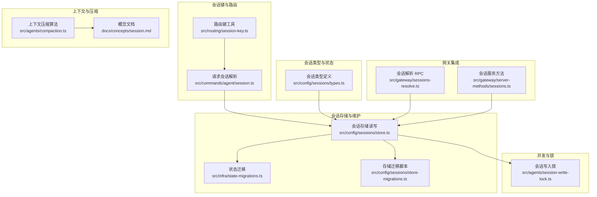
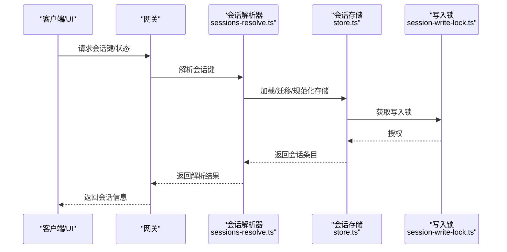
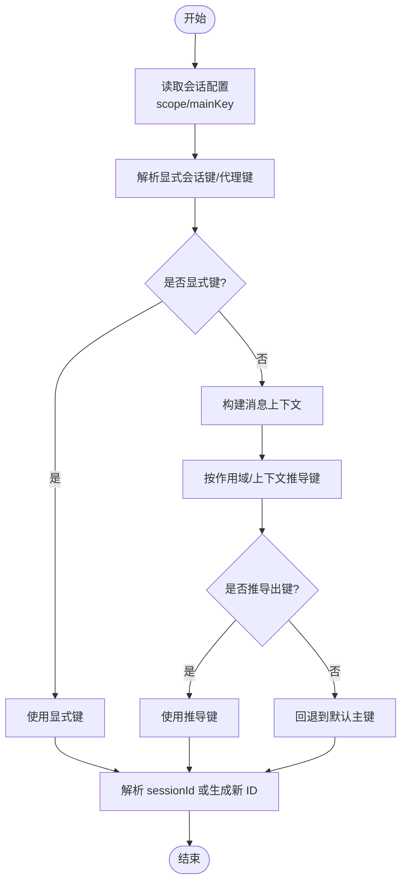
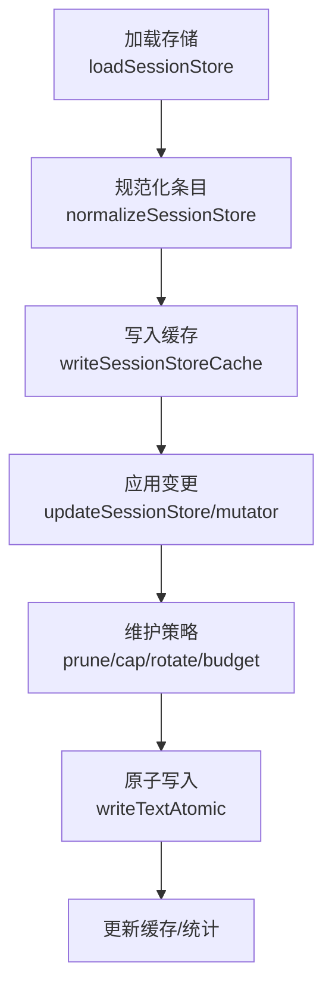
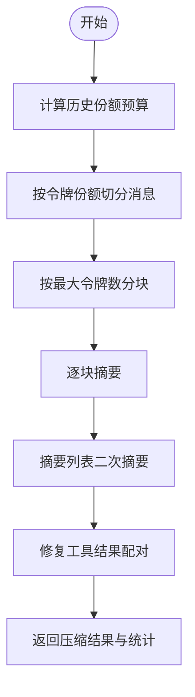
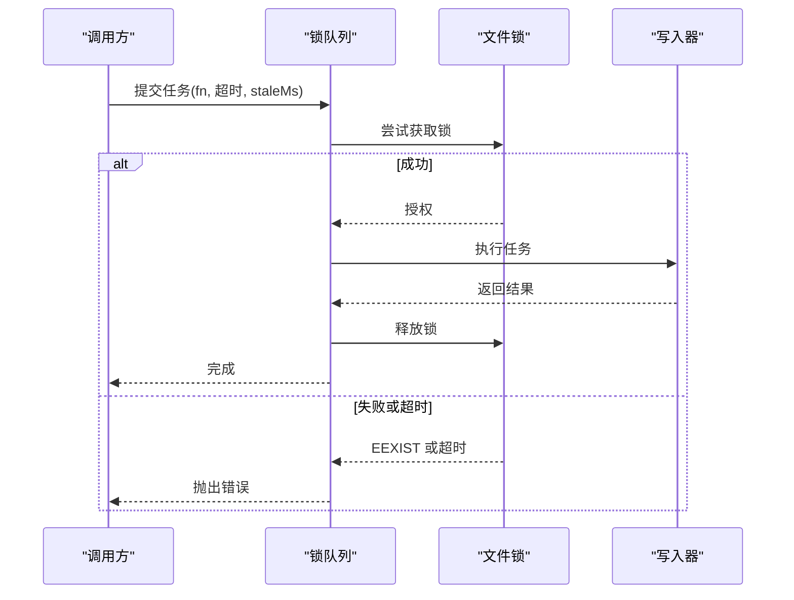
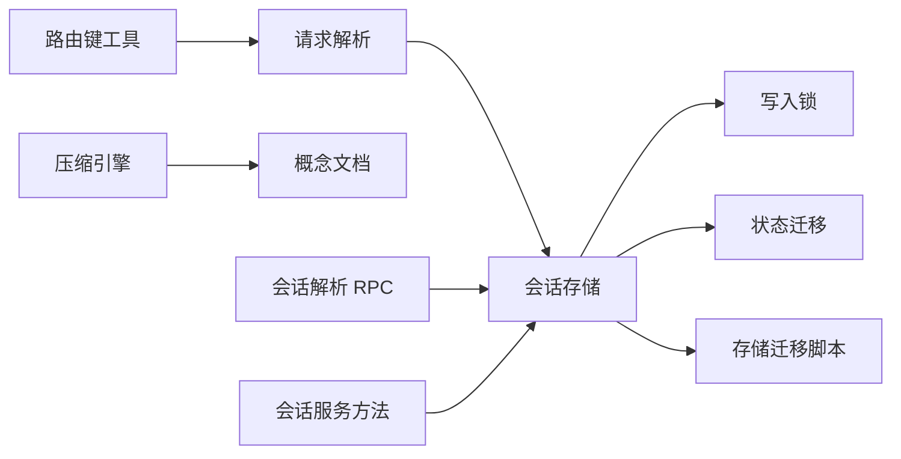

# 会话管理机制

<cite>
**本文引用的文件**
- [src/commands/agent/session.ts](file://src/commands/agent/session.ts)
- [src/routing/session-key.ts](file://src/routing/session-key.ts)
- [src/sessions/session-id.ts](file://src/sessions/session-id.ts)
- [src/config/sessions/types.ts](file://src/config/sessions/types.ts)
- [src/config/sessions/store.ts](file://src/config/sessions/store.ts)
- [src/agents/session-write-lock.ts](file://src/agents/session-write-lock.ts)
- [src/agents/compaction.ts](file://src/agents/compaction.ts)
- [docs/concepts/session.md](file://docs/concepts/session.md)
- [src/gateway/sessions-resolve.ts](file://src/gateway/sessions-resolve.ts)
- [src/gateway/server-methods/sessions.ts](file://src/gateway/server-methods/sessions.ts)
- [src/infra/state-migrations.ts](file://src/infra/state-migrations.ts)
- [src/config/sessions/store-migrations.ts](file://src/config/sessions/store-migrations.ts)
- [src/auto-reply/reply/commands-context-report.ts](file://src/auto-reply/reply/commands-context-report.ts)
- [src/auto-reply/reply/commands-compact.ts](file://src/auto-reply/reply/commands-compact.ts)
- [src/agents/pi-extensions/compaction-safeguard.ts](file://src/agents/pi-extensions/compaction-safeguard.ts)
</cite>

## 目录

1. [简介](#简介)
2. [项目结构](#项目结构)
3. [核心组件](#核心组件)
4. [架构总览](#架构总览)
5. [详细组件分析](#详细组件分析)
6. [依赖关系分析](#依赖关系分析)
7. [性能考量](#性能考量)
8. [故障排查指南](#故障排查指南)
9. [结论](#结论)
10. [附录](#附录)

## 简介

本文件系统性阐述 OpenClaw 的会话管理机制，覆盖会话键解析与管理（含会话 ID 生成、会话键格式、会话路由规则）、会话状态持久化与恢复（含序列化、状态快照与迁移）、上下文管理（消息历史、上下文窗口与压缩策略）、并发控制（会话锁、并发访问与死锁预防），并提供可操作的实践建议与排障指引。

## 项目结构

围绕会话管理的关键模块分布如下：

- 会话键与路由：src/routing/session-key.ts、src/commands/agent/session.ts
- 会话类型与状态：src/config/sessions/types.ts
- 会话存储与维护：src/config/sessions/store.ts、src/infra/state-migrations.ts、src/config/sessions/store-migrations.ts
- 会话写入锁与并发：src/agents/session-write-lock.ts
- 上下文压缩与窗口：src/agents/compaction.ts、docs/concepts/session.md
- 网关会话解析与迁移：src/gateway/sessions-resolve.ts、src/gateway/server-methods/sessions.ts
- 上下文报告与压缩命令：src/auto-reply/reply/commands-context-report.ts、src/auto-reply/reply/commands-compact.ts
- 压缩安全防护：src/agents/pi-extensions/compaction-safeguard.ts

图示来源

- [src/routing/session-key.ts:1-254](file://src/routing/session-key.ts#L1-L254)
- [src/commands/agent/session.ts:1-173](file://src/commands/agent/session.ts#L1-L173)
- [src/config/sessions/types.ts:1-380](file://src/config/sessions/types.ts#L1-L380)
- [src/config/sessions/store.ts:1-800](file://src/config/sessions/store.ts#L1-L800)
- [src/agents/session-write-lock.ts:1-561](file://src/agents/session-write-lock.ts#L1-L561)
- [src/agents/compaction.ts:1-465](file://src/agents/compaction.ts#L1-L465)
- [docs/concepts/session.md:1-311](file://docs/concepts/session.md#L1-L311)
- [src/gateway/sessions-resolve.ts:47-70](file://src/gateway/sessions-resolve.ts#L47-L70)
- [src/gateway/server-methods/sessions.ts:95-118](file://src/gateway/server-methods/sessions.ts#L95-L118)
- [src/infra/state-migrations.ts:720-761](file://src/infra/state-migrations.ts#L720-L761)
- [src/config/sessions/store-migrations.ts:1-27](file://src/config/sessions/store-migrations.ts#L1-L27)

章节来源

- [src/commands/agent/session.ts:1-173](file://src/commands/agent/session.ts#L1-L173)
- [src/routing/session-key.ts:1-254](file://src/routing/session-key.ts#L1-L254)
- [src/config/sessions/types.ts:1-380](file://src/config/sessions/types.ts#L1-L380)
- [src/config/sessions/store.ts:1-800](file://src/config/sessions/store.ts#L1-L800)
- [src/agents/session-write-lock.ts:1-561](file://src/agents/session-write-lock.ts#L1-L561)
- [src/agents/compaction.ts:1-465](file://src/agents/compaction.ts#L1-L465)
- [docs/concepts/session.md:1-311](file://docs/concepts/session.md#L1-L311)
- [src/gateway/sessions-resolve.ts:47-70](file://src/gateway/sessions-resolve.ts#L47-L70)
- [src/gateway/server-methods/sessions.ts:95-118](file://src/gateway/server-methods/sessions.ts#L95-L118)
- [src/infra/state-migrations.ts:720-761](file://src/infra/state-migrations.ts#L720-L761)
- [src/config/sessions/store-migrations.ts:1-27](file://src/config/sessions/store-migrations.ts#L1-L27)

## 核心组件

- 会话键解析与路由
  - 路由键工具负责构建与解析会话键，支持主键、DM 范围、群组键、线程键等形态，并提供规范化与归一化能力。
  - 请求级解析根据配置与上下文推导会话键，同时支持显式键与按会话 ID 回溯。
- 会话类型与状态
  - 定义会话条目字段、运行时模型字段、合并策略、新鲜度判定等，确保跨模块一致的状态语义。
- 会话存储与维护
  - 提供原子写入、缓存、维护（清理、裁剪、轮转、磁盘预算）与迁移，保证高可用与一致性。
- 并发控制
  - 基于文件锁的写入互斥与队列化执行，避免竞态与死锁；内置看门狗与回收逻辑。
- 上下文压缩与窗口
  - 提供分块、切片、摘要与回退策略，保障在上下文窗口约束下的稳定性与性能。
- 网关集成
  - 通过 RPC 解析与迁移会话键，统一会话存储目标，支持跨版本兼容。

章节来源

- [src/routing/session-key.ts:1-254](file://src/routing/session-key.ts#L1-L254)
- [src/commands/agent/session.ts:1-173](file://src/commands/agent/session.ts#L1-L173)
- [src/config/sessions/types.ts:1-380](file://src/config/sessions/types.ts#L1-L380)
- [src/config/sessions/store.ts:1-800](file://src/config/sessions/store.ts#L1-L800)
- [src/agents/session-write-lock.ts:1-561](file://src/agents/session-write-lock.ts#L1-L561)
- [src/agents/compaction.ts:1-465](file://src/agents/compaction.ts#L1-L465)
- [src/gateway/sessions-resolve.ts:47-70](file://src/gateway/sessions-resolve.ts#L47-L70)
- [src/gateway/server-methods/sessions.ts:95-118](file://src/gateway/server-methods/sessions.ts#L95-L118)

## 架构总览

OpenClaw 的会话管理以“网关为中心”的分布式设计：所有客户端均通过网关查询/更新会话状态，确保 UI 与后端一致。会话键由路由层生成并标准化，存储层提供原子写入与维护，压缩引擎在调用前对上下文进行修剪或摘要，写入锁保障并发安全。

图示来源

- [src/gateway/sessions-resolve.ts:47-70](file://src/gateway/sessions-resolve.ts#L47-L70)
- [src/gateway/server-methods/sessions.ts:95-118](file://src/gateway/server-methods/sessions.ts#L95-L118)
- [src/config/sessions/store.ts:1-800](file://src/config/sessions/store.ts#L1-L800)
- [src/agents/session-write-lock.ts:1-561](file://src/agents/session-write-lock.ts#L1-L561)

## 详细组件分析

### 会话键解析与管理

- 会话键生成与归一化
  - 支持 agent 主键、DM 范围（main/per-peer/per-channel-peer/per-account-channel-peer）、群组键、线程键等。
  - 提供规范化函数，确保大小写、非法字符与路径安全。
- 会话键解析流程
  - 优先使用显式键或显式代理会话键；否则基于上下文与作用域推导。
  - 若仅提供 sessionId，则在当前存储或全量代理存储中回溯匹配。
- 会话 ID 生成
  - 使用随机 UUID 作为 sessionId，确保全局唯一性与不可预测性。

图示来源

- [src/commands/agent/session.ts:43-173](file://src/commands/agent/session.ts#L43-L173)
- [src/routing/session-key.ts:118-254](file://src/routing/session-key.ts#L118-L254)
- [src/sessions/session-id.ts:1-6](file://src/sessions/session-id.ts#L1-L6)

章节来源

- [src/commands/agent/session.ts:43-173](file://src/commands/agent/session.ts#L43-L173)
- [src/routing/session-key.ts:1-254](file://src/routing/session-key.ts#L1-L254)
- [src/sessions/session-id.ts:1-6](file://src/sessions/session-id.ts#L1-L6)

### 会话状态持久化与恢复

- 存储结构与缓存
  - sessions.json 记录 sessionKey → { sessionId, updatedAt, ... }，并支持 TTL 缓存与对象缓存。
  - 读取时自动重试与迁移，写入采用原子落盘与缓存同步。
- 维护策略
  - 清理过期条目、限制条目数量、轮转文件、磁盘预算扫描与归档清理。
- 迁移与兼容
  - 存储迁移脚本将旧字段映射为新字段；状态迁移合并历史与目标存储，保留最新活动时间。
- 恢复与一致性
  - 写入锁队列化执行，避免并发覆盖；维护阶段对已删除会话进行历史归档清理。

图示来源

- [src/config/sessions/store.ts:195-800](file://src/config/sessions/store.ts#L195-L800)
- [src/infra/state-migrations.ts:720-761](file://src/infra/state-migrations.ts#L720-L761)
- [src/config/sessions/store-migrations.ts:1-27](file://src/config/sessions/store-migrations.ts#L1-L27)

章节来源

- [src/config/sessions/store.ts:195-800](file://src/config/sessions/store.ts#L195-L800)
- [src/infra/state-migrations.ts:720-761](file://src/infra/state-migrations.ts#L720-L761)
- [src/config/sessions/store-migrations.ts:1-27](file://src/config/sessions/store-migrations.ts#L1-L27)

### 上下文管理与压缩策略

- 上下文窗口与预算
  - 基于模型上下文窗口计算历史份额预算，结合安全系数补偿估算误差。
- 压缩算法
  - 分块与切片：按令牌数切分为多块，必要时拆分超大消息。
  - 摘要：对每块生成摘要，再对摘要列表进行二次摘要合并。
  - 回退：当完整摘要失败时尝试仅摘要小消息，最终降级为说明性提示。
- 工具结果配对修复
  - 在丢弃块后修复 tool_use 与 tool_result 配对，避免 API 报错。
- 安全防护
  - 当新内容占比过高时触发压缩，记录日志并减少历史块数量。

图示来源

- [src/agents/compaction.ts:398-465](file://src/agents/compaction.ts#L398-L465)
- [src/agents/pi-extensions/compaction-safeguard.ts:766-790](file://src/agents/pi-extensions/compaction-safeguard.ts#L766-L790)

章节来源

- [src/agents/compaction.ts:1-465](file://src/agents/compaction.ts#L1-L465)
- [src/agents/pi-extensions/compaction-safeguard.ts:766-790](file://src/agents/pi-extensions/compaction-safeguard.ts#L766-L790)

### 并发控制与死锁预防

- 写入锁
  - 基于文件锁实现互斥；支持可重入计数、超时、最大持有时间与看门狗回收。
- 锁队列
  - 同一存储路径的任务排队串行执行，避免竞争；超时即拒绝并报错。
- 死锁预防
  - 明确的释放顺序、看门狗定时检查、进程退出清理、PID/启动时间校验与孤儿锁回收。

图示来源

- [src/agents/session-write-lock.ts:444-561](file://src/agents/session-write-lock.ts#L444-L561)
- [src/config/sessions/store.ts:641-727](file://src/config/sessions/store.ts#L641-L727)

章节来源

- [src/agents/session-write-lock.ts:1-561](file://src/agents/session-write-lock.ts#L1-L561)
- [src/config/sessions/store.ts:641-727](file://src/config/sessions/store.ts#L641-L727)

### 会话路由规则与键格式

- DM 范围
  - main：跨通道连续对话；per-peer：按发送者隔离；per-channel-peer：按通道+发送者；per-account-channel-peer：按账户+通道+发送者。
- 群组与线程
  - 群组键：agent:<agentId>:<channel>:group:<id>；主题/线程键：在基础键后追加 :thread:<threadId>。
- 其他来源
  - 定时任务：cron:<job.id>；Webhook：hook:<uuid>；节点运行：node-<nodeId>。

章节来源

- [docs/concepts/session.md:189-205](file://docs/concepts/session.md#L189-L205)
- [src/routing/session-key.ts:137-174](file://src/routing/session-key.ts#L137-L174)
- [src/routing/session-key.ts:234-254](file://src/routing/session-key.ts#L234-L254)

### 会话生命周期与重置策略

- 生命周期
  - 会话在到期前复用；到期评估在下一次入站消息时进行。
- 重置策略
  - 日常重置（本地时间 4:00）与空闲重置（idleMinutes）；类型与通道级覆盖；重置触发词 /new、/reset。
- 发送策略
  - 可按通道/键前缀/原始键前缀进行允许/拒绝规则配置。

章节来源

- [docs/concepts/session.md:207-244](file://docs/concepts/session.md#L207-L244)
- [src/commands/agent/session.ts:111-173](file://src/commands/agent/session.ts#L111-L173)

### 会话迁移与兼容

- 存储迁移
  - 将 provider/lastProvider、room/groupChannel 等字段迁移为 channel/lastChannel 与 groupChannel。
- 状态迁移
  - 合并历史与目标存储，保留最新 updatedAt 的条目，确保跨版本兼容。

章节来源

- [src/config/sessions/store-migrations.ts:1-27](file://src/config/sessions/store-migrations.ts#L1-L27)
- [src/infra/state-migrations.ts:720-761](file://src/infra/state-migrations.ts#L720-L761)

### 上下文报告与压缩命令

- 上下文报告
  - 展示会话总令牌、输入/输出令牌、上下文令牌等指标，辅助诊断上下文占用。
- 压缩命令
  - 手动触发压缩，更新会话条目中的压缩计数与令牌统计，反馈压缩前后对比。

章节来源

- [src/auto-reply/reply/commands-context-report.ts:77-108](file://src/auto-reply/reply/commands-context-report.ts#L77-L108)
- [src/auto-reply/reply/commands-compact.ts:112-144](file://src/auto-reply/reply/commands-compact.ts#L112-L144)

## 依赖关系分析

- 路由层依赖会话键工具与配置，生成标准化键。
- 请求解析依赖路由层与存储层，支持显式键与按 sessionId 回溯。
- 存储层依赖写入锁、缓存与维护模块，确保一致性与性能。
- 压缩引擎依赖上下文窗口与令牌估算，配合工具结果修复。
- 网关层提供会话解析 RPC 与服务方法，统一存储目标与迁移。

图示来源

- [src/routing/session-key.ts:1-254](file://src/routing/session-key.ts#L1-L254)
- [src/commands/agent/session.ts:1-173](file://src/commands/agent/session.ts#L1-L173)
- [src/config/sessions/store.ts:1-800](file://src/config/sessions/store.ts#L1-L800)
- [src/agents/session-write-lock.ts:1-561](file://src/agents/session-write-lock.ts#L1-L561)
- [src/agents/compaction.ts:1-465](file://src/agents/compaction.ts#L1-L465)
- [docs/concepts/session.md:1-311](file://docs/concepts/session.md#L1-L311)
- [src/gateway/sessions-resolve.ts:47-70](file://src/gateway/sessions-resolve.ts#L47-L70)
- [src/gateway/server-methods/sessions.ts:95-118](file://src/gateway/server-methods/sessions.ts#L95-L118)
- [src/infra/state-migrations.ts:720-761](file://src/infra/state-migrations.ts#L720-L761)
- [src/config/sessions/store-migrations.ts:1-27](file://src/config/sessions/store-migrations.ts#L1-L27)

章节来源

- [src/commands/agent/session.ts:1-173](file://src/commands/agent/session.ts#L1-L173)
- [src/config/sessions/store.ts:1-800](file://src/config/sessions/store.ts#L1-L800)
- [src/agents/session-write-lock.ts:1-561](file://src/agents/session-write-lock.ts#L1-L561)
- [src/agents/compaction.ts:1-465](file://src/agents/compaction.ts#L1-L465)
- [src/gateway/sessions-resolve.ts:47-70](file://src/gateway/sessions-resolve.ts#L47-L70)
- [src/gateway/server-methods/sessions.ts:95-118](file://src/gateway/server-methods/sessions.ts#L95-L118)

## 性能考量

- 存储缓存与 TTL：减少频繁磁盘 IO，提升读取性能。
- 维护策略：定期清理、裁剪与轮转，避免 sessions.json 无限增长。
- 压缩策略：在调用前修剪旧工具结果，降低上下文体积；对大消息分块摘要，避免单次摘要失败影响整体。
- 写入锁队列：串行化写入，避免高并发下的抖动与冲突。
- 磁盘预算：在大规模部署中启用磁盘预算，防止磁盘空间膨胀。

## 故障排查指南

- 会话键无法解析
  - 检查显式键与上下文是否匹配；确认会话 ID 是否存在于目标存储或其它代理存储。
- 写入锁超时
  - 查看锁文件是否存在与过期；确认进程是否异常退出未清理；必要时使用清理工具回收孤儿锁。
- 上下文过大导致摘要失败
  - 触发手动压缩或调整摘要指令；检查工具结果配对修复是否生效。
- 会话迁移失败
  - 检查存储迁移脚本与状态迁移逻辑，确认字段映射与合并策略正确。

章节来源

- [src/commands/agent/session.ts:83-106](file://src/commands/agent/session.ts#L83-L106)
- [src/agents/session-write-lock.ts:387-442](file://src/agents/session-write-lock.ts#L387-L442)
- [src/agents/compaction.ts:264-331](file://src/agents/compaction.ts#L264-L331)
- [src/infra/state-migrations.ts:720-761](file://src/infra/state-migrations.ts#L720-L761)

## 结论

OpenClaw 的会话管理以“键标准化 + 存储原子化 + 压缩安全 + 并发受控”为核心设计，既满足多通道、多账号、多群组的复杂场景，又通过维护与迁移策略保障长期稳定运行。建议在生产环境启用强制维护模式与磁盘预算，并合理设置重置策略与 DM 范围，以获得最佳的性能与安全性平衡。

## 附录

- 实现自定义会话管理
  - 自定义会话键：参考路由键工具的构建函数，扩展 DM/群组/线程键规则。
  - 自定义重置策略：在配置中设置 per-type/per-channel 覆盖与重置触发词。
  - 自定义压缩策略：通过摘要指令与标识符保护策略，定制摘要重点。
- 处理会话冲突
  - 使用写入锁队列串行化写入；在解析阶段优先匹配显式键或按 sessionId 回溯。
- 优化会话性能
  - 启用缓存与维护；合理设置上下文窗口与历史份额；在高并发场景下缩短超时与最大持有时间。
