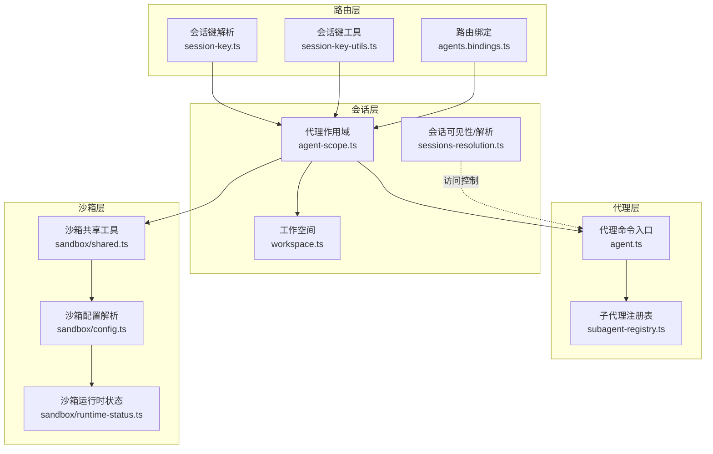
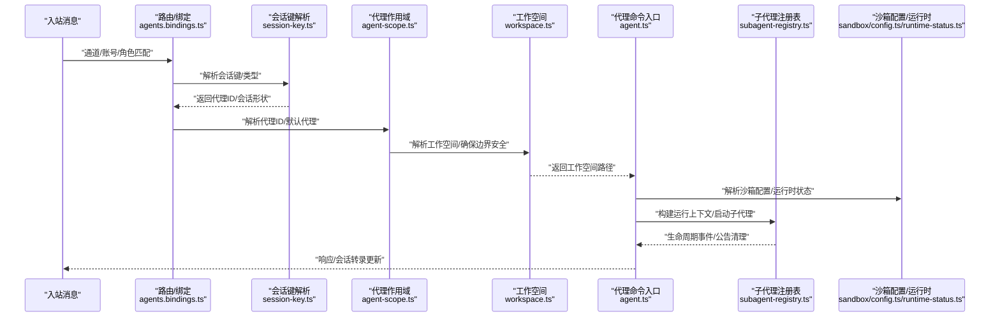
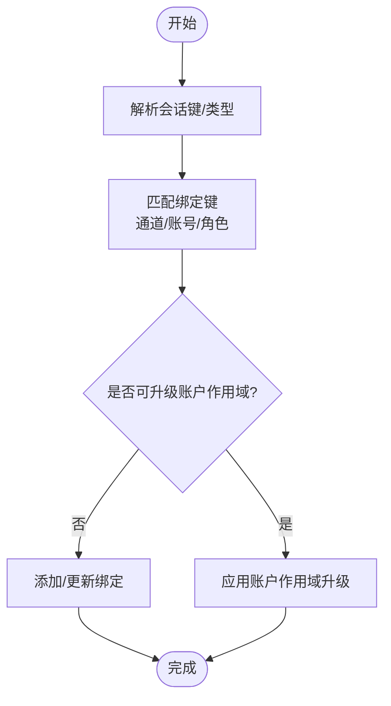
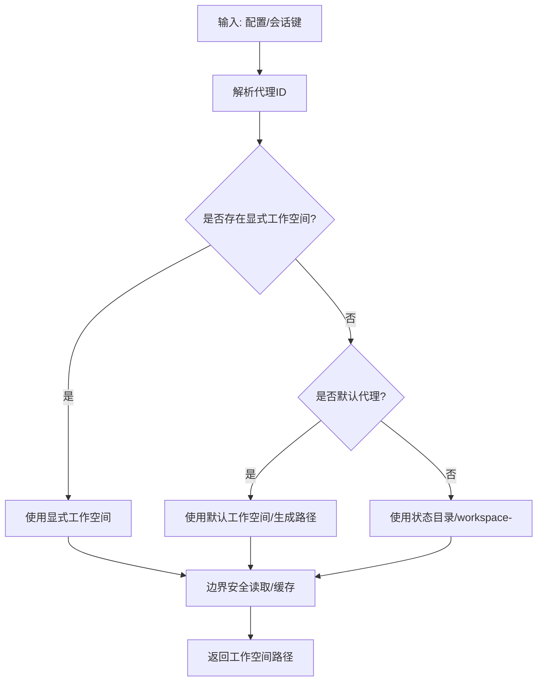
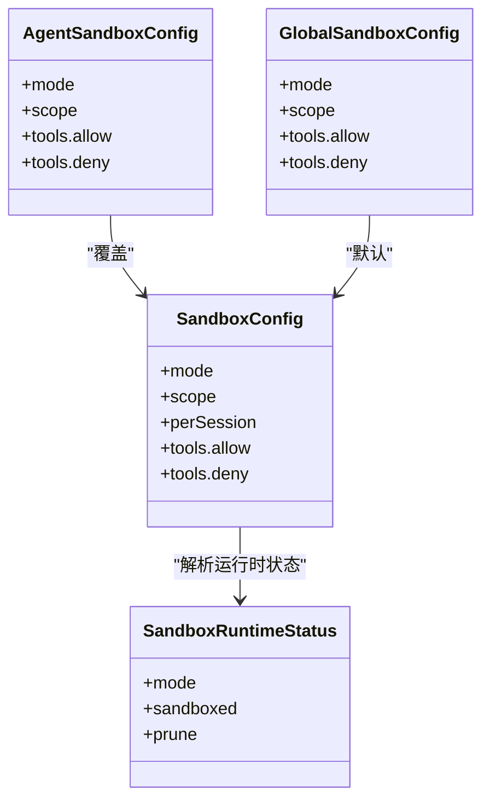
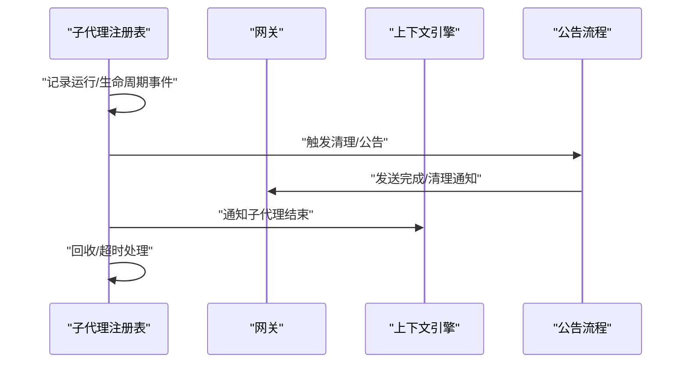
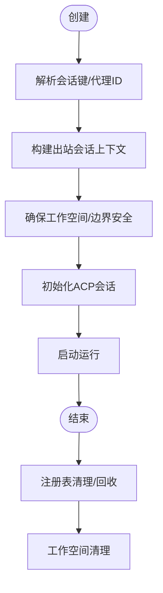
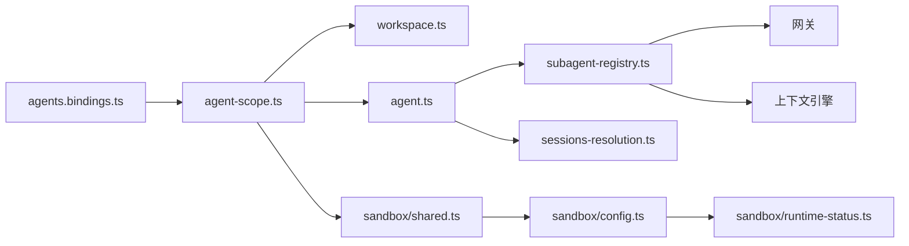

# 多代理路由系统

<cite>
**本文档引用的文件**
- [src/routing/session-key.ts](file://src/routing/session-key.ts)
- [src/sessions/session-key-utils.ts](file://src/sessions/session-key-utils.ts)
- [src/agents/agent-scope.ts](file://src/agents/agent-scope.ts)
- [src/agents/workspace.ts](file://src/agents/workspace.ts)
- [src/agents/sandbox/shared.ts](file://src/agents/sandbox/shared.ts)
- [src/agents/sandbox/config.ts](file://src/agents/sandbox/config.ts)
- [src/agents/sandbox/runtime-status.ts](file://src/agents/sandbox/runtime-status.ts)
- [src/agents/sandbox-agent-config.agent-specific-sandbox-config.e2e.test.ts](file://src/agents/sandbox-agent-config.agent-specific-sandbox-config.e2e.test.ts)
- [src/agents/pi-tools-agent-config.test.ts](file://src/agents/pi-tools-agent-config.test.ts)
- [src/agents/sandbox-explain.test.ts](file://src/agents/sandbox-explain.test.ts)
- [src/agents/subagent-registry.ts](file://src/agents/subagent-registry.ts)
- [src/commands/agent.ts](file://src/commands/agent.ts)
- [src/commands/agents.bindings.ts](file://src/commands/agents.bindings.ts)
- [src/agents/tools/sessions-resolution.ts](file://src/agents/tools/sessions-resolution.ts)
- [src/agents/tools/sessions-spawn-tool.ts](file://src/agents/tools/sessions-spawn-tool.ts)
- [src/commands/cleanup-utils.ts](file://src/commands/cleanup-utils.ts)
</cite>

## 目录

1. [引言](#引言)
2. [项目结构](#项目结构)
3. [核心组件](#核心组件)
4. [架构总览](#架构总览)
5. [详细组件分析](#详细组件分析)
6. [依赖关系分析](#依赖关系分析)
7. [性能考虑](#性能考虑)
8. [故障排除指南](#故障排除指南)
9. [结论](#结论)
10. [附录](#附录)

## 引言

本文件面向OpenClaw的多代理路由系统，聚焦于如何将入站消息路由到隔离的代理实例，涵盖工作空间隔离、会话管理与代理生命周期控制。文档同时阐述多代理环境下的权限控制、沙箱隔离与跨代理通信方式，并提供配置最佳实践、性能调优建议与故障排除指南。为便于不同背景读者理解，内容采用渐进式层次与可视化图示。

## 项目结构

OpenClaw在“路由-会话-代理-沙箱-子代理”链路上形成清晰分层：

- 路由层：负责解析会话键、识别会话类型（直接/群组/频道/定时任务/子代理/ACP），并根据绑定规则进行路由决策。
- 会话层：管理会话存储、会话键规范化、线程/父会话解析、会话可见性与访问控制。
- 代理层：解析代理ID、工作空间路径、代理目录、模型回退策略、运行上下文构建与清理。
- 沙箱层：基于代理与全局配置解析沙箱模式、作用域、工具策略、运行时状态与清理策略。
- 子代理层：注册表维护子代理运行记录、生命周期事件、公告与清理流程、回收与超时处理。

**图表来源**

- [src/routing/session-key.ts:1-254](file://src/routing/session-key.ts#L1-L254)
- [src/sessions/session-key-utils.ts:1-133](file://src/sessions/session-key-utils.ts#L1-L133)
- [src/commands/agents.bindings.ts:1-327](file://src/commands/agents.bindings.ts#L1-L327)
- [src/agents/agent-scope.ts:1-339](file://src/agents/agent-scope.ts#L1-L339)
- [src/agents/workspace.ts:1-656](file://src/agents/workspace.ts#L1-L656)
- [src/agents/tools/sessions-resolution.ts:302-329](file://src/agents/tools/sessions-resolution.ts#L302-L329)
- [src/commands/agent.ts:1-200](file://src/commands/agent.ts#L1-L200)
- [src/agents/subagent-registry.ts:1-800](file://src/agents/subagent-registry.ts#L1-L800)
- [src/agents/sandbox/shared.ts:1-46](file://src/agents/sandbox/shared.ts#L1-L46)
- [src/agents/sandbox/config.ts:157-188](file://src/agents/sandbox/config.ts#L157-L188)
- [src/agents/sandbox/runtime-status.ts](file://src/agents/sandbox/runtime-status.ts)

**章节来源**

- [src/routing/session-key.ts:1-254](file://src/routing/session-key.ts#L1-L254)
- [src/sessions/session-key-utils.ts:1-133](file://src/sessions/session-key-utils.ts#L1-L133)
- [src/commands/agents.bindings.ts:1-327](file://src/commands/agents.bindings.ts#L1-L327)
- [src/agents/agent-scope.ts:1-339](file://src/agents/agent-scope.ts#L1-L339)
- [src/agents/workspace.ts:1-656](file://src/agents/workspace.ts#L1-L656)
- [src/agents/tools/sessions-resolution.ts:302-329](file://src/agents/tools/sessions-resolution.ts#L302-L329)
- [src/commands/agent.ts:1-200](file://src/commands/agent.ts#L1-L200)
- [src/agents/subagent-registry.ts:1-800](file://src/agents/subagent-registry.ts#L1-L800)
- [src/agents/sandbox/shared.ts:1-46](file://src/agents/sandbox/shared.ts#L1-L46)
- [src/agents/sandbox/config.ts:157-188](file://src/agents/sandbox/config.ts#L157-L188)
- [src/agents/sandbox/runtime-status.ts](file://src/agents/sandbox/runtime-status.ts)

## 核心组件

- 会话键与路由规则
  - 会话键解析与分类：支持标准“agent:<id>:...”格式、历史别名、线程/话题标记、定时任务与子代理/ACP标识。
  - 绑定规则应用：通过匹配通道、账号、身份角色等维度，生成或更新路由绑定；支持账户级作用域升级与冲突检测。
- 代理作用域与工作空间
  - 代理ID解析与默认代理选择；代理配置合并（显式优先于全局默认）；工作空间路径解析与边界安全读取；最小化启动文件加载策略。
- 沙箱与权限控制
  - 基于代理与全局配置解析沙箱模式、作用域与工具策略；运行时状态判定与清理策略；工具策略叠加与最严格原则。
- 子代理生命周期与公告
  - 注册表维护运行记录、生命周期事件监听、公告重试与过期处理、完成结果冻结与清理流程、回收器与超时控制。

**章节来源**

- [src/routing/session-key.ts:1-254](file://src/routing/session-key.ts#L1-L254)
- [src/sessions/session-key-utils.ts:1-133](file://src/sessions/session-key-utils.ts#L1-L133)
- [src/commands/agents.bindings.ts:1-327](file://src/commands/agents.bindings.ts#L1-L327)
- [src/agents/agent-scope.ts:1-339](file://src/agents/agent-scope.ts#L1-L339)
- [src/agents/workspace.ts:1-656](file://src/agents/workspace.ts#L1-L656)
- [src/agents/sandbox/config.ts:157-188](file://src/agents/sandbox/config.ts#L157-L188)
- [src/agents/subagent-registry.ts:1-800](file://src/agents/subagent-registry.ts#L1-L800)

## 架构总览

下图展示了从入站消息到隔离代理实例的端到端流程：路由层解析会话键与绑定规则，会话层确保可见性与访问控制，代理层构建工作空间与运行上下文，沙箱层实施权限与隔离，子代理层负责生命周期与公告清理。

**图表来源**

- [src/commands/agents.bindings.ts:1-327](file://src/commands/agents.bindings.ts#L1-L327)
- [src/routing/session-key.ts:1-254](file://src/routing/session-key.ts#L1-L254)
- [src/agents/agent-scope.ts:1-339](file://src/agents/agent-scope.ts#L1-L339)
- [src/agents/workspace.ts:1-656](file://src/agents/workspace.ts#L1-L656)
- [src/commands/agent.ts:1-200](file://src/commands/agent.ts#L1-L200)
- [src/agents/subagent-registry.ts:1-800](file://src/agents/subagent-registry.ts#L1-L800)
- [src/agents/sandbox/config.ts:157-188](file://src/agents/sandbox/config.ts#L157-L188)
- [src/agents/sandbox/runtime-status.ts](file://src/agents/sandbox/runtime-status.ts)

## 详细组件分析

### 会话键与路由绑定

- 会话键解析与分类
  - 支持标准“agent:<id>:...”格式、历史别名、线程/话题标记、定时任务与子代理/ACP标识。
  - 提供派生聊天类型、线程父键解析、子代理深度计算等辅助能力。
- 路由绑定应用
  - 匹配键由通道、账号、身份角色等构成；支持账户级作用域升级与冲突检测；新增/更新/跳过/冲突返回值用于幂等操作。
  - 支持从规范字符串解析绑定规格，或按通道选择批量构建绑定。

**图表来源**

- [src/sessions/session-key-utils.ts:1-133](file://src/sessions/session-key-utils.ts#L1-L133)
- [src/commands/agents.bindings.ts:1-327](file://src/commands/agents.bindings.ts#L1-L327)

**章节来源**

- [src/sessions/session-key-utils.ts:1-133](file://src/sessions/session-key-utils.ts#L1-L133)
- [src/commands/agents.bindings.ts:1-327](file://src/commands/agents.bindings.ts#L1-L327)

### 代理作用域与工作空间

- 代理ID解析与默认代理
  - 解析显式代理ID、会话键中的代理ID、默认代理ID；规范化代理ID以保证路径安全与shell友好。
- 工作空间解析与边界安全
  - 支持显式配置、默认配置、按代理生成的默认路径；通过边界安全读取与缓存避免越界与重复读取；最小化启动文件加载策略。
- 代理目录解析
  - 代理目录位于状态目录下，按代理ID组织；支持显式配置覆盖。

**图表来源**

- [src/agents/agent-scope.ts:256-339](file://src/agents/agent-scope.ts#L256-L339)
- [src/agents/workspace.ts:1-656](file://src/agents/workspace.ts#L1-L656)

**章节来源**

- [src/agents/agent-scope.ts:1-339](file://src/agents/agent-scope.ts#L1-L339)
- [src/agents/workspace.ts:1-656](file://src/agents/workspace.ts#L1-L656)

### 沙箱隔离与权限控制

- 沙箱配置解析
  - 优先级：代理特定配置 > 全局配置 > 默认配置；作用域与每会话策略可独立配置；工具策略允许/拒绝集合叠加并遵循最严格原则。
- 运行时状态与清理
  - 运行时状态根据配置与会话键判定沙箱模式与是否启用；清理策略包含空闲与最大存活时间阈值。
- 工具策略与权限
  - 代理工具策略与沙箱工具策略叠加，最终策略以更严格的为准；测试用例验证策略叠加与优先级。

**图表来源**

- [src/agents/sandbox/config.ts:157-188](file://src/agents/sandbox/config.ts#L157-L188)
- [src/agents/sandbox/runtime-status.ts](file://src/agents/sandbox/runtime-status.ts)

**章节来源**

- [src/agents/sandbox/config.ts:157-188](file://src/agents/sandbox/config.ts#L157-L188)
- [src/agents/sandbox/runtime-status.ts](file://src/agents/sandbox/runtime-status.ts)
- [src/agents/sandbox/shared.ts:1-46](file://src/agents/sandbox/shared.ts#L1-L46)
- [src/agents/sandbox-agent-config.agent-specific-sandbox-config.e2e.test.ts:196-376](file://src/agents/sandbox-agent-config.agent-specific-sandbox-config.e2e.test.ts#L196-L376)
- [src/agents/pi-tools-agent-config.test.ts:570-608](file://src/agents/pi-tools-agent-config.test.ts#L570-L608)
- [src/agents/sandbox-explain.test.ts:1-34](file://src/agents/sandbox-explain.test.ts#L1-L34)

### 子代理生命周期与公告

- 注册表与运行记录
  - 维护子代理运行记录、生命周期事件监听、公告重试与过期处理、完成结果冻结与清理流程。
- 回收与超时
  - 清理器按配置的归档时间阈值回收；等待完成设置硬性超时上限；错误事件延迟清理以避免误判。
- 会话可见性与跨代理通信
  - 通过会话可见性解析确保请求者仅能访问其可见的会话；跨代理通信通过会话键与公告机制实现。

**图表来源**

- [src/agents/subagent-registry.ts:1-800](file://src/agents/subagent-registry.ts#L1-L800)
- [src/agents/tools/sessions-resolution.ts:302-329](file://src/agents/tools/sessions-resolution.ts#L302-L329)

**章节来源**

- [src/agents/subagent-registry.ts:1-800](file://src/agents/subagent-registry.ts#L1-L800)
- [src/agents/tools/sessions-resolution.ts:302-329](file://src/agents/tools/sessions-resolution.ts#L302-L329)

### 代理创建、销毁与资源管理

- 创建流程
  - 解析会话键与代理ID；构建出站会话上下文；解析工作空间并确保边界安全；初始化ACP会话；准备运行上下文。
- 销毁与清理
  - 注册表完成清理流程；回收器按阈值清理；会话删除接口用于清理转录与生命周期钩子。
- 资源管理
  - 工作空间目录清理工具支持干运行与批量清理；会话目录枚举用于审计与清理。

**图表来源**

- [src/commands/agent.ts:612-649](file://src/commands/agent.ts#L612-L649)
- [src/commands/cleanup-utils.ts:130-153](file://src/commands/cleanup-utils.ts#L130-L153)
- [src/agents/subagent-registry.ts:714-751](file://src/agents/subagent-registry.ts#L714-L751)

**章节来源**

- [src/commands/agent.ts:612-649](file://src/commands/agent.ts#L612-L649)
- [src/commands/cleanup-utils.ts:130-153](file://src/commands/cleanup-utils.ts#L130-L153)
- [src/agents/subagent-registry.ts:714-751](file://src/agents/subagent-registry.ts#L714-L751)

### 自定义代理路由规则与扩展

- 自定义路由规则
  - 使用绑定规格解析函数从字符串构建绑定；批量构建通道绑定时可指定账号ID；支持插件解析账号ID与强制账户绑定。
- 扩展代理功能
  - 通过会话解析工具限制非子代理/定时任务会话的启动文件加载范围；子代理工具支持“运行时=acp/subagent”与持久化会话模式。

**章节来源**

- [src/commands/agents.bindings.ts:264-327](file://src/commands/agents.bindings.ts#L264-L327)
- [src/agents/tools/sessions-resolution.ts:565-573](file://src/agents/tools/sessions-resolution.ts#L565-L573)
- [src/agents/tools/sessions-spawn-tool.ts:68-98](file://src/agents/tools/sessions-spawn-tool.ts#L68-L98)

## 依赖关系分析

- 组件耦合与内聚
  - 路由层与会话层高内聚，共同决定代理实例归属；代理层与沙箱层解耦，通过配置解析实现动态隔离；子代理注册表对生命周期事件高度内聚。
- 直接与间接依赖
  - 代理命令入口依赖代理作用域、工作空间与沙箱配置；子代理注册表依赖网关与上下文引擎；会话可见性解析依赖沙箱共享工具。
- 外部依赖与集成点
  - 网关用于会话删除与生命周期钩子；上下文引擎用于子代理结束通知；边界安全读取用于工作空间文件访问。

**图表来源**

- [src/commands/agents.bindings.ts:1-327](file://src/commands/agents.bindings.ts#L1-L327)
- [src/agents/agent-scope.ts:1-339](file://src/agents/agent-scope.ts#L1-L339)
- [src/agents/workspace.ts:1-656](file://src/agents/workspace.ts#L1-L656)
- [src/commands/agent.ts:1-200](file://src/commands/agent.ts#L1-L200)
- [src/agents/subagent-registry.ts:1-800](file://src/agents/subagent-registry.ts#L1-L800)
- [src/agents/sandbox/shared.ts:1-46](file://src/agents/sandbox/shared.ts#L1-L46)
- [src/agents/sandbox/config.ts:157-188](file://src/agents/sandbox/config.ts#L157-L188)
- [src/agents/sandbox/runtime-status.ts](file://src/agents/sandbox/runtime-status.ts)
- [src/agents/tools/sessions-resolution.ts:302-329](file://src/agents/tools/sessions-resolution.ts#L302-L329)

**章节来源**

- [src/commands/agents.bindings.ts:1-327](file://src/commands/agents.bindings.ts#L1-L327)
- [src/agents/agent-scope.ts:1-339](file://src/agents/agent-scope.ts#L1-L339)
- [src/agents/workspace.ts:1-656](file://src/agents/workspace.ts#L1-L656)
- [src/commands/agent.ts:1-200](file://src/commands/agent.ts#L1-L200)
- [src/agents/subagent-registry.ts:1-800](file://src/agents/subagent-registry.ts#L1-L800)
- [src/agents/sandbox/shared.ts:1-46](file://src/agents/sandbox/shared.ts#L1-L46)
- [src/agents/sandbox/config.ts:157-188](file://src/agents/sandbox/config.ts#L157-L188)
- [src/agents/sandbox/runtime-status.ts](file://src/agents/sandbox/runtime-status.ts)
- [src/agents/tools/sessions-resolution.ts:302-329](file://src/agents/tools/sessions-resolution.ts#L302-L329)

## 性能考虑

- 会话键解析与缓存
  - 使用预编译正则与小写化降低比较成本；会话键分类与派生类型减少重复解析。
- 工作空间边界安全读取
  - 文件内容按inode/dev/大小/修改时间身份缓存，避免重复IO；最小化启动文件加载范围，缩短启动时间。
- 子代理公告与清理
  - 指数回退重试与最大重试次数限制，防止无限重试；完成结果冻结与延迟清理避免误判。
- 沙箱策略叠加
  - 最严格策略优先，减少不必要的工具授权，降低运行时开销。

[本节为通用指导，无需具体文件分析]

## 故障排除指南

- 路由绑定冲突
  - 当同一匹配键存在不同代理ID时，应用返回冲突列表；检查绑定规格与匹配键一致性。
- 会话不可见
  - 若请求者无法访问目标会话，解析会返回禁止错误；确认会话键与可见性规则。
- 工作空间清理失败
  - 使用清理工具的干运行模式先审计；检查路径解析与边界安全读取日志。
- 子代理未完成清理
  - 观察注册表回收器与超时设置；检查生命周期事件与公告流程日志。

**章节来源**

- [src/commands/agents.bindings.ts:161-227](file://src/commands/agents.bindings.ts#L161-L227)
- [src/agents/tools/sessions-resolution.ts:316-324](file://src/agents/tools/sessions-resolution.ts#L316-L324)
- [src/commands/cleanup-utils.ts:130-153](file://src/commands/cleanup-utils.ts#L130-L153)
- [src/agents/subagent-registry.ts:594-628](file://src/agents/subagent-registry.ts#L594-L628)

## 结论

OpenClaw的多代理路由系统通过“会话键解析—路由绑定—代理作用域—工作空间—沙箱隔离—子代理生命周期”的完整链路，实现了高隔离、可扩展、可观测的多代理运行环境。借助最小化启动文件加载、边界安全读取、最严格策略叠加与回收器机制，系统在安全性与性能之间取得平衡。建议在生产中结合绑定规格与沙箱策略进行精细化配置，并利用注册表与清理工具进行持续运维。

## 附录

- 最佳实践
  - 明确代理ID与会话键命名规范；为不同代理设置差异化的沙箱模式与工具策略；合理配置子代理归档时间与等待超时。
- 性能调优
  - 启动阶段仅加载必要文件；启用边界安全读取缓存；优化公告重试参数与回收周期。
- 故障排除清单
  - 检查绑定规格与匹配键；核对会话可见性；验证工作空间路径与权限；审查子代理注册表与网关日志。

[本节为通用指导，无需具体文件分析]
