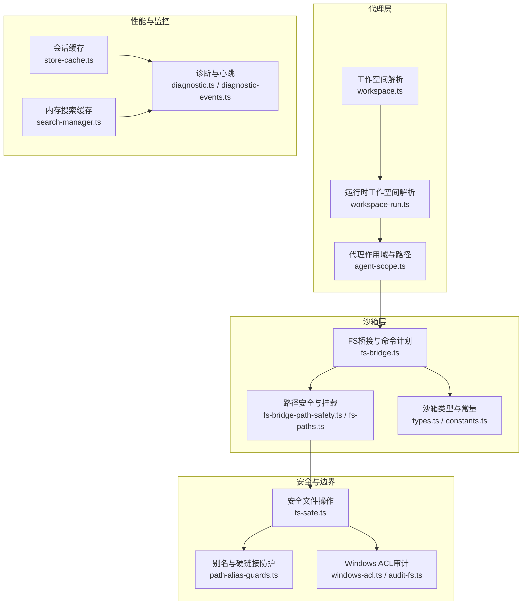
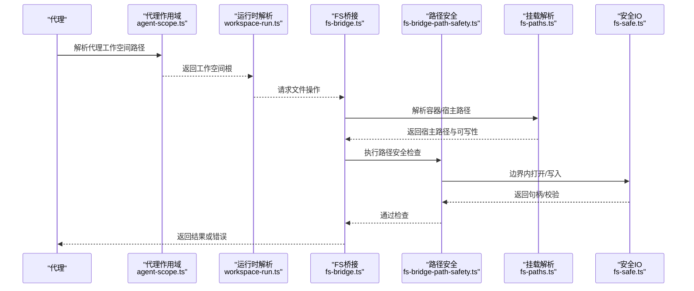
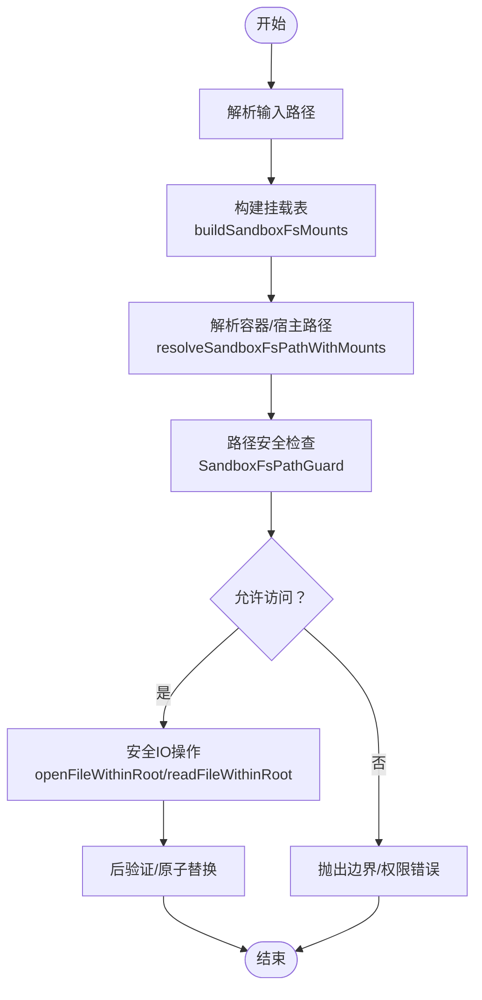
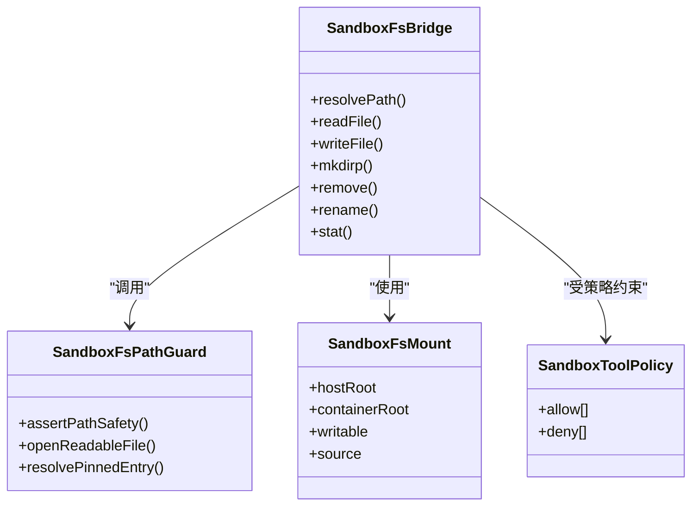
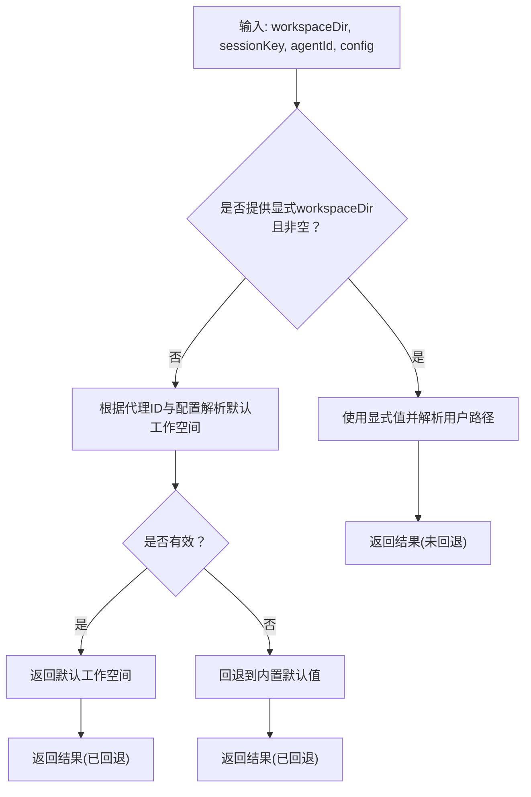
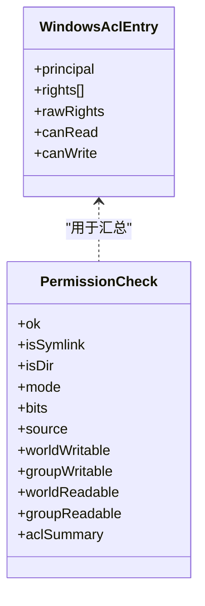
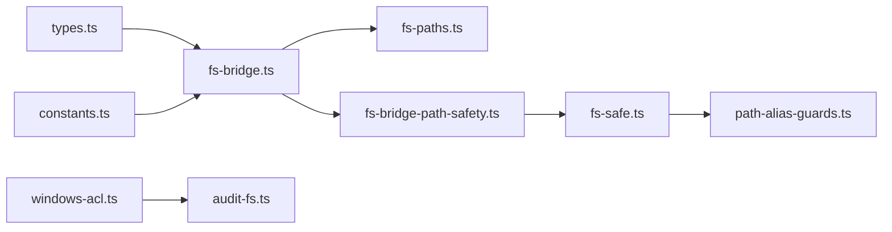

# 工作空间隔离机制

<cite>
**本文档引用的文件**
- [src/agents/workspace.ts](file://src/agents/workspace.ts)
- [src/agents/workspace-run.ts](file://src/agents/workspace-run.ts)
- [src/agents/agent-scope.ts](file://src/agents/agent-scope.ts)
- [src/agents/sandbox/fs-bridge.ts](file://src/agents/sandbox/fs-bridge.ts)
- [src/agents/sandbox/fs-bridge-path-safety.ts](file://src/agents/sandbox/fs-bridge-path-safety.ts)
- [src/agents/sandbox/fs-paths.ts](file://src/agents/sandbox/fs-paths.ts)
- [src/agents/sandbox/types.ts](file://src/agents/sandbox/types.ts)
- [src/agents/sandbox/constants.ts](file://src/agents/sandbox/constants.ts)
- [src/infra/fs-safe.ts](file://src/infra/fs-safe.ts)
- [src/infra/path-alias-guards.ts](file://src/infra/path-alias-guards.ts)
- [src/security/windows-acl.ts](file://src/security/windows-acl.ts)
- [src/security/audit-fs.ts](file://src/security/audit-fs.ts)
- [src/config/sessions/store-cache.ts](file://src/config/sessions/store-cache.ts)
- [src/memory/search-manager.ts](file://src/memory/search-manager.ts)
- [src/agents/pi-tools.read.ts](file://src/agents/pi-tools.read.ts)
- [src/gateway/server-methods/agents.ts](file://src/gateway/server-methods/agents.ts)
- [src/commands/onboard-non-interactive/local/workspace.ts](file://src/commands/onboard-non-interactive/local/workspace.ts)
- [src/agents/workspace-dir.ts](file://src/agents/workspace-dir.ts)
- [src/logging/diagnostic.ts](file://src/logging/diagnostic.ts)
- [src/infra/diagnostic-events.ts](file://src/infra/diagnostic-events.ts)
</cite>

## 目录

1. [引言](#引言)
2. [项目结构](#项目结构)
3. [核心组件](#核心组件)
4. [架构总览](#架构总览)
5. [详细组件分析](#详细组件分析)
6. [依赖关系分析](#依赖关系分析)
7. [性能考虑](#性能考虑)
8. [故障排除指南](#故障排除指南)
9. [结论](#结论)
10. [附录](#附录)

## 引言

本文件系统性阐述 OpenClaw 的工作空间隔离机制，覆盖文件系统隔离、进程隔离与网络隔离的实现方式；详述工作空间路径解析算法（默认、自定义、动态）的优先级规则；解释工作空间权限模型（读写、执行、访问控制列表）；并提供性能优化策略（缓存、预加载、内存管理）。同时给出配置、监控与冲突排查的实践指引。

## 项目结构

OpenClaw 将工作空间隔离能力分布在多个子模块中：

- 代理工作空间与运行时解析：agents/workspace.ts、agents/workspace-run.ts、agents/agent-scope.ts
- 沙箱文件系统桥接与边界安全：agents/sandbox/fs-bridge.ts、fs-bridge-path-safety.ts、fs-paths.ts
- 安全与边界检查：infra/fs-safe.ts、infra/path-alias-guards.ts
- 权限与ACL：security/windows-acl.ts、security/audit-fs.ts
- 缓存与性能：config/sessions/store-cache.ts、memory/search-manager.ts
- 路径与诊断：agents/workspace-dir.ts、logging/diagnostic.ts、infra/diagnostic-events.ts

图表来源

- [src/agents/workspace.ts:1-656](file://src/agents/workspace.ts#L1-L656)
- [src/agents/workspace-run.ts:1-117](file://src/agents/workspace-run.ts#L1-L117)
- [src/agents/agent-scope.ts:256-338](file://src/agents/agent-scope.ts#L256-L338)
- [src/agents/sandbox/fs-bridge.ts:1-329](file://src/agents/sandbox/fs-bridge.ts#L1-L329)
- [src/agents/sandbox/fs-bridge-path-safety.ts:1-224](file://src/agents/sandbox/fs-bridge-path-safety.ts#L1-L224)
- [src/agents/sandbox/fs-paths.ts:1-258](file://src/agents/sandbox/fs-paths.ts#L1-L258)
- [src/agents/sandbox/types.ts:1-91](file://src/agents/sandbox/types.ts#L1-L91)
- [src/agents/sandbox/constants.ts:1-55](file://src/agents/sandbox/constants.ts#L1-L55)
- [src/infra/fs-safe.ts:1-800](file://src/infra/fs-safe.ts#L1-L800)
- [src/infra/path-alias-guards.ts:1-35](file://src/infra/path-alias-guards.ts#L1-L35)
- [src/security/windows-acl.ts:82-363](file://src/security/windows-acl.ts#L82-L363)
- [src/security/audit-fs.ts:1-60](file://src/security/audit-fs.ts#L1-L60)
- [src/config/sessions/store-cache.ts:37-81](file://src/config/sessions/store-cache.ts#L37-L81)
- [src/memory/search-manager.ts:239-252](file://src/memory/search-manager.ts#L239-L252)
- [src/logging/diagnostic.ts:1-433](file://src/logging/diagnostic.ts#L1-L433)
- [src/infra/diagnostic-events.ts:125-175](file://src/infra/diagnostic-events.ts#L125-L175)

章节来源

- [src/agents/workspace.ts:1-656](file://src/agents/workspace.ts#L1-L656)
- [src/agents/workspace-run.ts:1-117](file://src/agents/workspace-run.ts#L1-L117)
- [src/agents/agent-scope.ts:256-338](file://src/agents/agent-scope.ts#L256-L338)
- [src/agents/sandbox/fs-bridge.ts:1-329](file://src/agents/sandbox/fs-bridge.ts#L1-L329)
- [src/agents/sandbox/fs-bridge-path-safety.ts:1-224](file://src/agents/sandbox/fs-bridge-path-safety.ts#L1-L224)
- [src/agents/sandbox/fs-paths.ts:1-258](file://src/agents/sandbox/fs-paths.ts#L1-L258)
- [src/agents/sandbox/types.ts:1-91](file://src/agents/sandbox/types.ts#L1-L91)
- [src/agents/sandbox/constants.ts:1-55](file://src/agents/sandbox/constants.ts#L1-L55)
- [src/infra/fs-safe.ts:1-800](file://src/infra/fs-safe.ts#L1-L800)
- [src/infra/path-alias-guards.ts:1-35](file://src/infra/path-alias-guards.ts#L1-L35)
- [src/security/windows-acl.ts:82-363](file://src/security/windows-acl.ts#L82-L363)
- [src/security/audit-fs.ts:1-60](file://src/security/audit-fs.ts#L1-L60)
- [src/config/sessions/store-cache.ts:37-81](file://src/config/sessions/store-cache.ts#L37-L81)
- [src/memory/search-manager.ts:239-252](file://src/memory/search-manager.ts#L239-L252)
- [src/logging/diagnostic.ts:1-433](file://src/logging/diagnostic.ts#L1-L433)
- [src/infra/diagnostic-events.ts:125-175](file://src/infra/diagnostic-events.ts#L125-L175)

## 核心组件

- 工作空间解析与引导
  - 默认工作空间目录生成、模板填充、引导文件管理与Git初始化等逻辑集中在 agents/workspace.ts 中。
  - 运行时工作空间解析（含回退策略）在 agents/workspace-run.ts 中实现。
  - 代理作用域与工作空间路径映射在 agents/agent-scope.ts 中实现。
- 沙箱文件系统桥接
  - 通过 agents/sandbox/fs-bridge.ts 提供统一的文件系统操作接口，结合 fs-bridge-path-safety.ts 与 fs-paths.ts 实现路径解析、挂载与边界安全校验。
  - 类型与常量定义在 agents/sandbox/types.ts 与 constants.ts 中。
- 安全与边界
  - 安全文件读写与原子替换在 infra/fs-safe.ts 中实现，包含硬链接与符号链接防护、路径别名逃逸检测。
  - 别名与硬链接防护在 infra/path-alias-guards.ts 中实现。
  - Windows ACL 审计与摘要在 security/windows-acl.ts 与 security/audit-fs.ts 中实现。
- 性能与缓存
  - 会话存储缓存在 config/sessions/store-cache.ts 中实现。
  - 内存搜索缓存键构建在 memory/search-manager.ts 中实现。
- 监控与诊断
  - 诊断心跳与会话状态在 logging/diagnostic.ts 中维护。
  - 诊断事件类型在 infra/diagnostic-events.ts 中定义。

章节来源

- [src/agents/workspace.ts:1-656](file://src/agents/workspace.ts#L1-L656)
- [src/agents/workspace-run.ts:1-117](file://src/agents/workspace-run.ts#L1-L117)
- [src/agents/agent-scope.ts:256-338](file://src/agents/agent-scope.ts#L256-L338)
- [src/agents/sandbox/fs-bridge.ts:1-329](file://src/agents/sandbox/fs-bridge.ts#L1-L329)
- [src/agents/sandbox/fs-bridge-path-safety.ts:1-224](file://src/agents/sandbox/fs-bridge-path-safety.ts#L1-L224)
- [src/agents/sandbox/fs-paths.ts:1-258](file://src/agents/sandbox/fs-paths.ts#L1-L258)
- [src/agents/sandbox/types.ts:1-91](file://src/agents/sandbox/types.ts#L1-L91)
- [src/agents/sandbox/constants.ts:1-55](file://src/agents/sandbox/constants.ts#L1-L55)
- [src/infra/fs-safe.ts:1-800](file://src/infra/fs-safe.ts#L1-L800)
- [src/infra/path-alias-guards.ts:1-35](file://src/infra/path-alias-guards.ts#L1-L35)
- [src/security/windows-acl.ts:82-363](file://src/security/windows-acl.ts#L82-L363)
- [src/security/audit-fs.ts:1-60](file://src/security/audit-fs.ts#L1-L60)
- [src/config/sessions/store-cache.ts:37-81](file://src/config/sessions/store-cache.ts#L37-L81)
- [src/memory/search-manager.ts:239-252](file://src/memory/search-manager.ts#L239-L252)
- [src/logging/diagnostic.ts:1-433](file://src/logging/diagnostic.ts#L1-L433)
- [src/infra/diagnostic-events.ts:125-175](file://src/infra/diagnostic-events.ts#L125-L175)

## 架构总览

下图展示了从代理到沙箱再到宿主机文件系统的完整数据流与边界保护链路。

图表来源

- [src/agents/agent-scope.ts:256-338](file://src/agents/agent-scope.ts#L256-L338)
- [src/agents/workspace-run.ts:74-117](file://src/agents/workspace-run.ts#L74-L117)
- [src/agents/sandbox/fs-bridge.ts:64-329](file://src/agents/sandbox/fs-bridge.ts#L64-L329)
- [src/agents/sandbox/fs-bridge-path-safety.ts:57-135](file://src/agents/sandbox/fs-bridge-path-safety.ts#L57-L135)
- [src/agents/sandbox/fs-paths.ts:98-159](file://src/agents/sandbox/fs-paths.ts#L98-L159)
- [src/infra/fs-safe.ts:155-210](file://src/infra/fs-safe.ts#L155-L210)

## 详细组件分析

### 文件系统隔离

- 路径解析与边界
  - 通过 resolvePathWithinRoot 与 openFileWithinRoot 等函数确保所有文件操作均在指定根目录内进行，拒绝符号链接与硬链接，防止路径别名逃逸。
  - 在 Windows 平台采用替代写入流程，使用临时文件与原子重命名保证一致性。
- 沙箱路径解析
  - buildSandboxFsMounts 基于工作空间根、代理工作空间与绑定挂载生成挂载表，按容器路径长度降序与来源优先级排序，避免自定义绑定覆盖默认挂载。
  - resolveSandboxFsPathWithMounts 支持绝对容器路径与相对宿主路径解析，返回宿主路径、容器路径与可写性标记。
- 路径安全检查
  - SandboxFsPathGuard 在执行前对目标路径进行边界检查与可写性验证，必要时解析规范路径以消除符号链接影响。
  - 对挂载点内的相对路径进行规范化与合法性校验，防止越权访问。

图表来源

- [src/agents/sandbox/fs-paths.ts:60-96](file://src/agents/sandbox/fs-paths.ts#L60-L96)
- [src/agents/sandbox/fs-paths.ts:98-159](file://src/agents/sandbox/fs-paths.ts#L98-L159)
- [src/agents/sandbox/fs-bridge-path-safety.ts:57-135](file://src/agents/sandbox/fs-bridge-path-safety.ts#L57-L135)
- [src/infra/fs-safe.ts:155-210](file://src/infra/fs-safe.ts#L155-L210)

章节来源

- [src/agents/sandbox/fs-paths.ts:1-258](file://src/agents/sandbox/fs-paths.ts#L1-L258)
- [src/agents/sandbox/fs-bridge-path-safety.ts:1-224](file://src/agents/sandbox/fs-bridge-path-safety.ts#L1-L224)
- [src/infra/fs-safe.ts:155-210](file://src/infra/fs-safe.ts#L155-L210)

### 进程隔离

- 沙箱容器与命令执行
  - 通过 Docker exec 执行文件系统命令，脚本参数化，避免直接暴露宿主环境变量与权限。
  - 命令计划（command plans）在 fs-bridge.ts 中集中构建，确保每次操作都经过路径安全检查与挂载约束。
- 工具策略与访问控制
  - SandboxToolPolicy 控制工具集的允许/禁止列表，结合来源信息（agent/global/default）便于审计与溯源。
  - 默认工具白名单与黑名单在 constants.ts 中定义，浏览器、画布、节点、定时器、网关等高风险工具默认禁用。

图表来源

- [src/agents/sandbox/fs-bridge.ts:64-329](file://src/agents/sandbox/fs-bridge.ts#L64-L329)
- [src/agents/sandbox/fs-bridge-path-safety.ts:42-135](file://src/agents/sandbox/fs-bridge-path-safety.ts#L42-L135)
- [src/agents/sandbox/fs-paths.ts:9-21](file://src/agents/sandbox/fs-paths.ts#L9-L21)
- [src/agents/sandbox/types.ts:6-27](file://src/agents/sandbox/types.ts#L6-L27)

章节来源

- [src/agents/sandbox/fs-bridge.ts:18-329](file://src/agents/sandbox/fs-bridge.ts#L18-L329)
- [src/agents/sandbox/types.ts:55-91](file://src/agents/sandbox/types.ts#L55-L91)
- [src/agents/sandbox/constants.ts:13-55](file://src/agents/sandbox/constants.ts#L13-L55)

### 网络隔离

- 浏览器沙箱网络
  - 默认浏览器沙箱使用独立网络（如 openclaw-sandbox-browser），限制对外连接，CDP/VNC 端口仅限本地或受控范围。
  - 通过容器前缀与自动启动超时控制生命周期，避免长期开放端口带来的风险。
- 网络策略与端口
  - CDP 端口、VNC/NoVNC 端口、自动启动超时等参数在 constants.ts 中集中配置，便于统一治理。

章节来源

- [src/agents/sandbox/constants.ts:39-55](file://src/agents/sandbox/constants.ts#L39-L55)
- [src/agents/sandbox/types.ts:31-46](file://src/agents/sandbox/types.ts#L31-L46)

### 工作空间路径解析算法与优先级

- 默认工作空间
  - resolveDefaultAgentWorkspaceDir 根据用户主目录与配置文件夹生成默认工作空间路径，支持多配置档案（profile）区分。
- 自定义工作空间
  - 通过 agents/workspace.ts 的 ensureAgentWorkspace 与 workspace-run.ts 的 resolveRunWorkspaceDir，支持显式传入、配置覆盖与回退策略。
- 动态工作空间
  - resolveRunWorkspaceDir 根据会话键与代理ID动态选择工作空间，若请求为空或无效则回退到代理作用域解析结果。
- 优先级规则
  - 显式请求 > 代理配置 > 默认配置 > 内置默认值。
  - 对于空白字符串与缺失值，分别记录回退原因并采用相应策略。

图表来源

- [src/agents/workspace-run.ts:74-117](file://src/agents/workspace-run.ts#L74-L117)
- [src/agents/agent-scope.ts:256-272](file://src/agents/agent-scope.ts#L256-L272)
- [src/agents/workspace.ts:12-22](file://src/agents/workspace.ts#L12-L22)

章节来源

- [src/agents/workspace-run.ts:1-117](file://src/agents/workspace-run.ts#L1-L117)
- [src/agents/agent-scope.ts:256-338](file://src/agents/agent-scope.ts#L256-L338)
- [src/agents/workspace.ts:12-22](file://src/agents/workspace.ts#L12-L22)

### 权限模型与访问控制

- 读写权限
  - SandboxWorkspaceAccess 支持 none/ro/rw 三种级别；仅 rw 允许写入操作。
  - SandboxFsBridge 在写入前检查可写性与路径安全，失败时抛出明确错误。
- 执行权限与工具策略
  - SandboxToolPolicy 的 allow/deny 列表控制工具可用性；默认工具白名单与黑名单在 constants.ts 中定义。
- 访问控制列表（ACL）
  - Windows 平台通过 icacls 输出解析与分类，识别 trusted/world/group 权限主体，支持生成重置命令与摘要输出。
  - audit-fs 提供安全统计与摘要格式化，辅助审计与合规检查。

图表来源

- [src/security/windows-acl.ts:209-211](file://src/security/windows-acl.ts#L209-L211)
- [src/security/audit-fs.ts:9-22](file://src/security/audit-fs.ts#L9-L22)

章节来源

- [src/agents/sandbox/fs-bridge.ts:295-299](file://src/agents/sandbox/fs-bridge.ts#L295-L299)
- [src/agents/sandbox/types.ts:29](file://src/agents/sandbox/types.ts#L29)
- [src/agents/sandbox/constants.ts:13-37](file://src/agents/sandbox/constants.ts#L13-L37)
- [src/security/windows-acl.ts:213-246](file://src/security/windows-acl.ts#L213-L246)
- [src/security/audit-fs.ts:30-60](file://src/security/audit-fs.ts#L30-L60)

### 性能优化策略

- 缓存机制
  - 会话存储缓存：基于时间戳与元信息（mtime/size）的 TTL 缓存，避免重复读取与序列化开销。
  - 内存搜索缓存键：使用稳定序列化的配置作为键，减少深度比较成本。
- 预加载策略
  - 运行时工作空间解析对回退路径进行提示与日志记录，便于提前发现配置问题。
  - 沙箱路径解析对挂载表进行去重与排序，提升查找效率。
- 内存管理
  - 安全IO在读取后及时关闭文件描述符，写入后进行原子替换与一致性校验，降低内存占用与竞态风险。

章节来源

- [src/config/sessions/store-cache.ts:37-81](file://src/config/sessions/store-cache.ts#L37-L81)
- [src/memory/search-manager.ts:248-252](file://src/memory/search-manager.ts#L248-L252)
- [src/infra/fs-safe.ts:281-294](file://src/infra/fs-safe.ts#L281-L294)

### 配置、监控与冲突排查

- 配置工作空间隔离
  - 使用 agents/workspace.ts 的 ensureAgentWorkspace 初始化工作空间与引导文件。
  - 通过 agents/workspace-run.ts 的 resolveRunWorkspaceDir 设置运行时工作空间，结合 agent-scope.ts 的代理作用域解析。
  - 在沙箱层通过 types.ts 的 SandboxConfig 与 constants.ts 的默认值配置容器镜像、网络与工具策略。
- 监控工作空间使用
  - 通过 logging/diagnostic.ts 的诊断心跳与会话状态，观察活动会话数量、队列深度与处理延迟。
  - 诊断事件类型在 infra/diagnostic-events.ts 中定义，便于集成外部监控系统。
- 排查工作空间冲突
  - 使用 agents/workspace-dir.ts 的路径归一化与根拒绝策略，避免将文件系统根作为工作空间。
  - 通过 infra/fs-safe.ts 的边界检查与 path-alias-guards.ts 的别名/硬链接防护，定位越权与逃逸问题。
  - Windows 平台使用 security/windows-acl.ts 的 ACL 审计与重置命令，快速恢复受污染权限。

章节来源

- [src/agents/workspace.ts:321-459](file://src/agents/workspace.ts#L321-L459)
- [src/agents/workspace-run.ts:74-117](file://src/agents/workspace-run.ts#L74-L117)
- [src/agents/agent-scope.ts:256-338](file://src/agents/agent-scope.ts#L256-L338)
- [src/agents/sandbox/types.ts:55-64](file://src/agents/sandbox/types.ts#L55-L64)
- [src/agents/sandbox/constants.ts:5-11](file://src/agents/sandbox/constants.ts#L5-L11)
- [src/logging/diagnostic.ts:333-433](file://src/logging/diagnostic.ts#L333-L433)
- [src/infra/diagnostic-events.ts:125-175](file://src/infra/diagnostic-events.ts#L125-L175)
- [src/agents/workspace-dir.ts:4-16](file://src/agents/workspace-dir.ts#L4-L16)
- [src/infra/fs-safe.ts:155-210](file://src/infra/fs-safe.ts#L155-L210)
- [src/infra/path-alias-guards.ts:12-34](file://src/infra/path-alias-guards.ts#L12-L34)
- [src/security/windows-acl.ts:332-363](file://src/security/windows-acl.ts#L332-L363)

## 依赖关系分析

- 组件耦合
  - fs-bridge 依赖 fs-bridge-path-safety 与 fs-paths，形成“解析-安全-执行”的分层。
  - fs-safe 与 path-alias-guards 协同实现跨平台边界与一致性保障。
  - 沙箱类型与常量为上层提供统一配置入口。
- 外部依赖
  - Docker exec 用于容器内命令执行；Windows 平台依赖 icacls 进行 ACL 管理。
- 循环依赖
  - 代码组织避免了循环导入；各模块职责清晰，接口稳定。

图表来源

- [src/infra/fs-safe.ts:1-18](file://src/infra/fs-safe.ts#L1-L18)
- [src/infra/path-alias-guards.ts:1-10](file://src/infra/path-alias-guards.ts#L1-L10)
- [src/agents/sandbox/fs-bridge.ts:1-16](file://src/agents/sandbox/fs-bridge.ts#L1-L16)
- [src/agents/sandbox/fs-paths.ts:1-7](file://src/agents/sandbox/fs-paths.ts#L1-L7)
- [src/agents/sandbox/fs-bridge-path-safety.ts:1-8](file://src/agents/sandbox/fs-bridge-path-safety.ts#L1-L8)
- [src/agents/sandbox/types.ts:1-16](file://src/agents/sandbox/types.ts#L1-L16)
- [src/agents/sandbox/constants.ts:1-5](file://src/agents/sandbox/constants.ts#L1-L5)
- [src/security/windows-acl.ts:1-7](file://src/security/windows-acl.ts#L1-L7)
- [src/security/audit-fs.ts:1-7](file://src/security/audit-fs.ts#L1-L7)

章节来源

- [src/infra/fs-safe.ts:1-800](file://src/infra/fs-safe.ts#L1-L800)
- [src/infra/path-alias-guards.ts:1-35](file://src/infra/path-alias-guards.ts#L1-L35)
- [src/agents/sandbox/fs-bridge.ts:1-329](file://src/agents/sandbox/fs-bridge.ts#L1-L329)
- [src/agents/sandbox/fs-bridge-path-safety.ts:1-224](file://src/agents/sandbox/fs-bridge-path-safety.ts#L1-L224)
- [src/agents/sandbox/fs-paths.ts:1-258](file://src/agents/sandbox/fs-paths.ts#L1-L258)
- [src/agents/sandbox/types.ts:1-91](file://src/agents/sandbox/types.ts#L1-L91)
- [src/agents/sandbox/constants.ts:1-55](file://src/agents/sandbox/constants.ts#L1-L55)
- [src/security/windows-acl.ts:82-363](file://src/security/windows-acl.ts#L82-L363)
- [src/security/audit-fs.ts:1-60](file://src/security/audit-fs.ts#L1-L60)

## 性能考虑

- 缓存策略
  - 会话存储缓存按 TTL 与元信息失效，避免重复解析与序列化。
  - 内存搜索缓存键稳定化，减少深拷贝与哈希计算。
- I/O 优化
  - 安全写入采用原子替换与后验证，减少竞态与回滚成本。
  - 跨平台差异处理（Windows 临时文件）保证一致性能。
- 资源管理
  - 及时关闭文件描述符与清理临时文件，降低句柄泄漏风险。

章节来源

- [src/config/sessions/store-cache.ts:37-81](file://src/config/sessions/store-cache.ts#L37-L81)
- [src/memory/search-manager.ts:239-252](file://src/memory/search-manager.ts#L239-L252)
- [src/infra/fs-safe.ts:307-350](file://src/infra/fs-safe.ts#L307-L350)

## 故障排除指南

- 路径逃逸与越权
  - 现象：报错提示路径超出工作空间根或读写权限不足。
  - 排查：检查 resolvePathWithinRoot 与 SandboxFsPathGuard 的错误码；确认挂载表与容器路径解析。
- 符号链接与硬链接
  - 现象：打开文件被拒绝或路径不匹配。
  - 排查：确认 fs-safe 的硬链接与符号链接防护；在 Windows 平台检查 ACL 与权限。
- 工具策略冲突
  - 现象：工具被阻止执行。
  - 排查：核对 SandboxToolPolicy 的 allow/deny 列表与来源；调整 constants.ts 中的默认策略。
- 诊断与监控
  - 使用 logging/diagnostic.ts 的心跳与会话状态，结合 infra/diagnostic-events.ts 的事件类型定位问题。

章节来源

- [src/infra/fs-safe.ts:155-210](file://src/infra/fs-safe.ts#L155-L210)
- [src/agents/sandbox/fs-bridge-path-safety.ts:57-135](file://src/agents/sandbox/fs-bridge-path-safety.ts#L57-L135)
- [src/agents/sandbox/types.ts:6-27](file://src/agents/sandbox/types.ts#L6-L27)
- [src/agents/sandbox/constants.ts:13-37](file://src/agents/sandbox/constants.ts#L13-L37)
- [src/logging/diagnostic.ts:333-433](file://src/logging/diagnostic.ts#L333-L433)
- [src/infra/diagnostic-events.ts:125-175](file://src/infra/diagnostic-events.ts#L125-L175)

## 结论

OpenClaw 的工作空间隔离机制通过“路径解析—边界安全—容器执行—权限控制”四层防护，实现了多代理间的资源隔离。其路径解析算法具备明确优先级与回退策略；权限模型结合工具策略与 ACL 审计，满足不同平台的安全需求；性能优化策略覆盖缓存、预加载与内存管理。配合完善的监控与诊断能力，可有效支撑大规模多代理场景下的稳定性与安全性。

## 附录

- 相关实现路径示例（仅路径，不含具体代码内容）
  - 工作空间初始化与引导：[src/agents/workspace.ts:321-459](file://src/agents/workspace.ts#L321-L459)
  - 运行时工作空间解析：[src/agents/workspace-run.ts:74-117](file://src/agents/workspace-run.ts#L74-L117)
  - 代理作用域解析：[src/agents/agent-scope.ts:256-338](file://src/agents/agent-scope.ts#L256-L338)
  - 沙箱文件系统桥接：[src/agents/sandbox/fs-bridge.ts:64-329](file://src/agents/sandbox/fs-bridge.ts#L64-L329)
  - 路径安全与挂载：[src/agents/sandbox/fs-bridge-path-safety.ts:57-135](file://src/agents/sandbox/fs-bridge-path-safety.ts#L57-L135)、[src/agents/sandbox/fs-paths.ts:98-159](file://src/agents/sandbox/fs-paths.ts#L98-L159)
  - 安全文件操作：[src/infra/fs-safe.ts:155-210](file://src/infra/fs-safe.ts#L155-L210)
  - 别名与硬链接防护：[src/infra/path-alias-guards.ts:12-34](file://src/infra/path-alias-guards.ts#L12-L34)
  - Windows ACL 审计：[src/security/windows-acl.ts:213-246](file://src/security/windows-acl.ts#L213-L246)
  - 会话缓存：[src/config/sessions/store-cache.ts:37-81](file://src/config/sessions/store-cache.ts#L37-L81)
  - 内存搜索缓存：[src/memory/search-manager.ts:248-252](file://src/memory/search-manager.ts#L248-L252)
  - 诊断与心跳：[src/logging/diagnostic.ts:333-433](file://src/logging/diagnostic.ts#L333-L433)
  - 诊断事件类型：[src/infra/diagnostic-events.ts:125-175](file://src/infra/diagnostic-events.ts#L125-L175)
