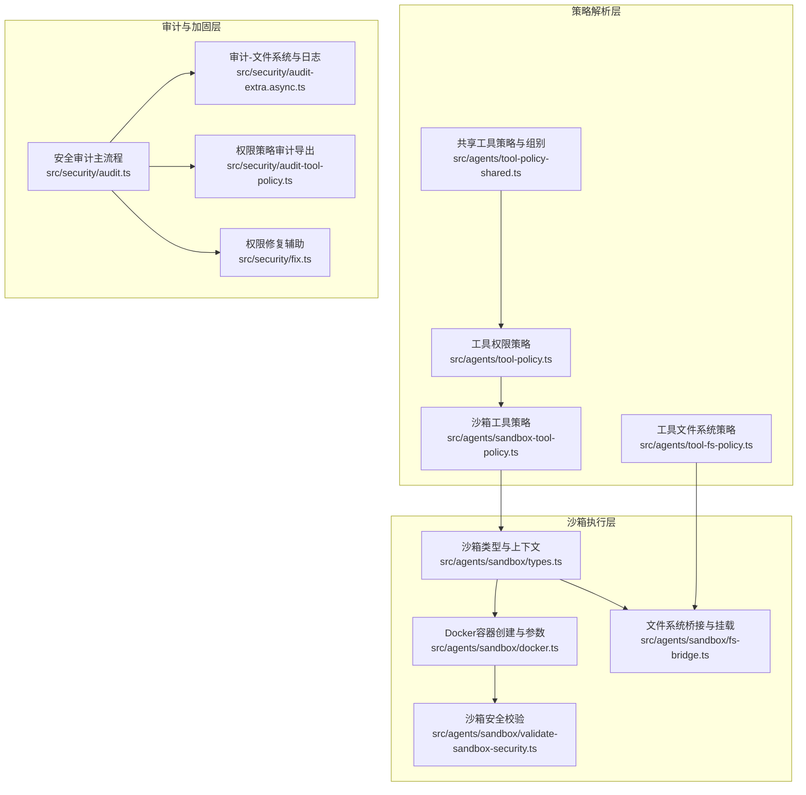
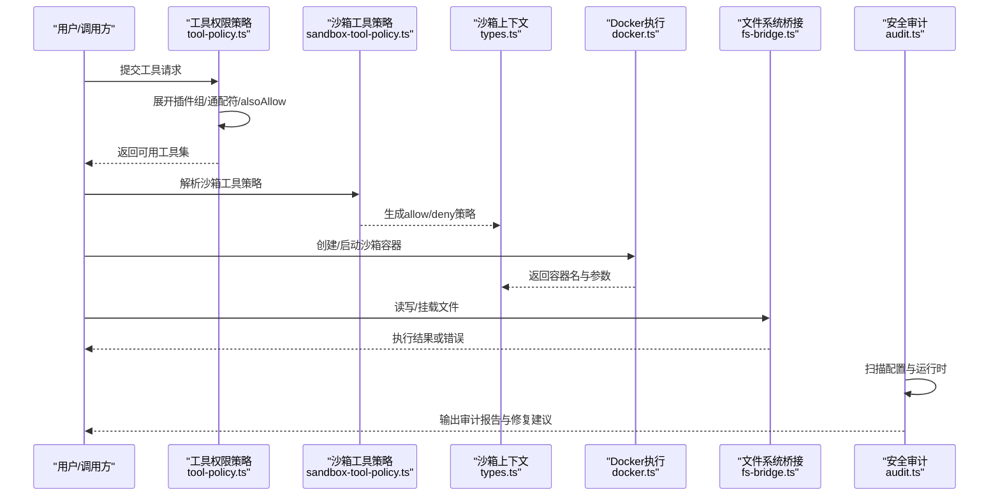
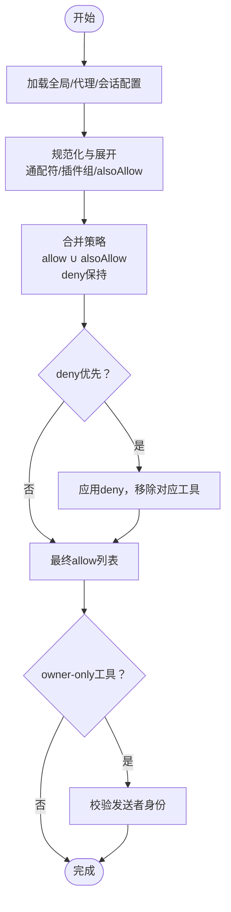
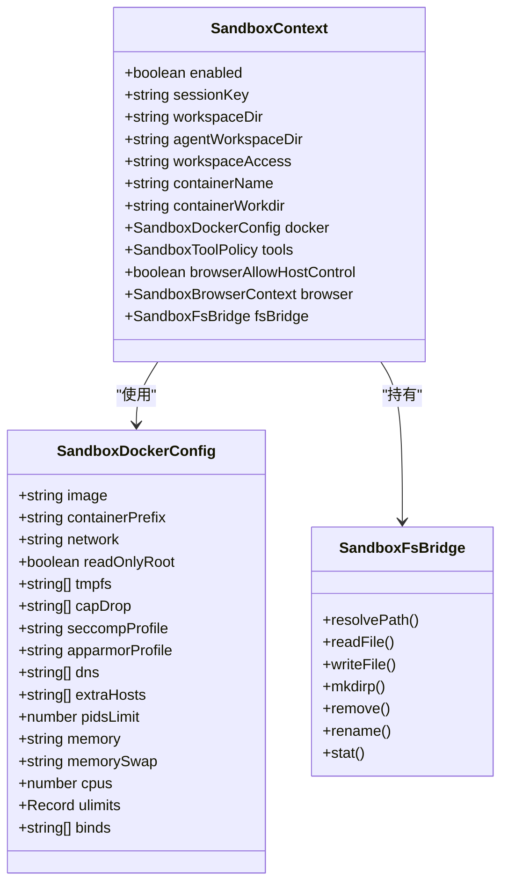
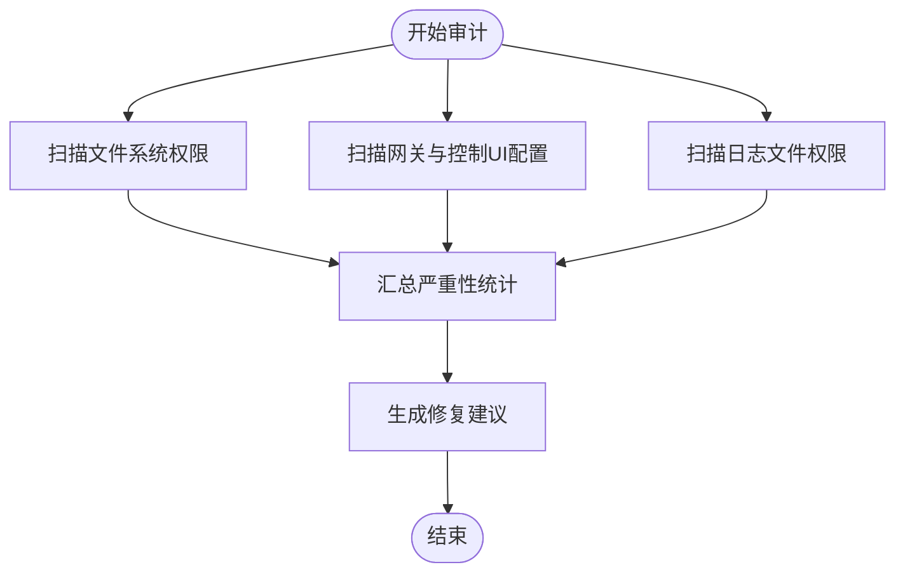
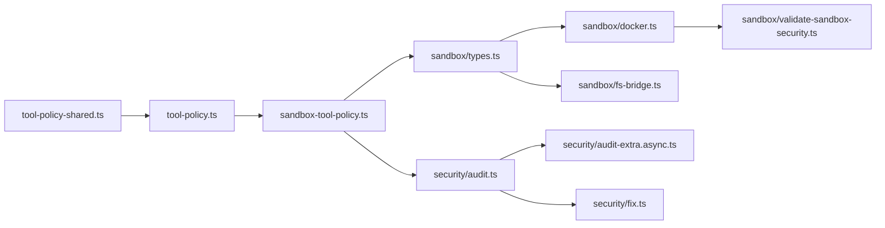

# 权限控制系统

<cite>
**本文引用的文件**
- [src/agents/sandbox-tool-policy.ts](file://src/agents/sandbox-tool-policy.ts)
- [src/agents/tool-policy.ts](file://src/agents/tool-policy.ts)
- [src/agents/tool-policy-shared.ts](file://src/agents/tool-policy-shared.ts)
- [src/agents/tool-fs-policy.ts](file://src/agents/tool-fs-policy.ts)
- [src/agents/sandbox/types.ts](file://src/agents/sandbox/types.ts)
- [src/agents/sandbox/docker.ts](file://src/agents/sandbox/docker.ts)
- [src/agents/sandbox/fs-bridge.ts](file://src/agents/sandbox/fs-bridge.ts)
- [src/security/audit.ts](file://src/security/audit.ts)
- [src/security/audit-tool-policy.ts](file://src/security/audit-tool-policy.ts)
- [src/agents/sandbox-explain.test.ts](file://src/agents/sandbox-explain.test.ts)
- [src/agents/pi-tools-agent-config.test.ts](file://src/agents/pi-tools-agent-config.test.ts)
- [src/agents/sandbox/validate-sandbox-security.ts](file://src/agents/sandbox/validate-sandbox-security.ts)
- [src/agents/sandbox/validate-sandbox-security.test.ts](file://src/agents/sandbox/validate-sandbox-security.test.ts)
- [src/security/audit-extra.async.ts](file://src/security/audit-extra.async.ts)
- [src/security/fix.ts](file://src/security/fix.ts)
- [docs/gateway/sandboxing.md](file://docs/gateway/sandboxing.md)
- [docs/gateway/sandbox-vs-tool-policy-vs-elevated.md](file://docs/gateway/sandbox-vs-tool-policy-vs-elevated.md)
- [docs/tools/multi-agent-sandbox-tools.md](file://docs/tools/multi-agent-sandbox-tools.md)
- [docs/cli/sandbox.md](file://docs/cli/sandbox.md)
- [docs/zh-CN/cli/sandbox.md](file://docs/zh-CN/cli/sandbox.md)
</cite>

## 目录

1. [引言](#引言)
2. [项目结构](#项目结构)
3. [核心组件](#核心组件)
4. [架构总览](#架构总览)
5. [详细组件分析](#详细组件分析)
6. [依赖关系分析](#依赖关系分析)
7. [性能考量](#性能考量)
8. [故障排查指南](#故障排查指南)
9. [结论](#结论)
10. [附录](#附录)

## 引言

本文件面向OpenClaw的权限控制系统，系统性阐述多层级权限模型与实现，覆盖代理权限、工具权限、文件系统权限、网络权限；解释权限继承与优先级（默认、代理特定、会话级）；详述沙箱权限控制（容器化沙箱、文件系统挂载、系统调用限制）；并提供权限审计与日志记录机制，以及可操作的配置与调试指引。

## 项目结构

OpenClaw的权限控制由“策略解析层”“沙箱执行层”“审计与加固层”三部分协同构成：

- 策略解析层：负责工具权限、文件系统访问策略的合并与规范化，支持通配符、插件组展开、所有者专用工具等。
- 沙箱执行层：负责容器生命周期、安全参数注入、文件系统桥接、网络隔离与系统调用限制。
- 审计与加固层：对配置与运行时进行安全扫描，识别风险点并给出修复建议。

图表来源

- [src/agents/tool-policy.ts:1-206](file://src/agents/tool-policy.ts#L1-L206)
- [src/agents/sandbox-tool-policy.ts:1-38](file://src/agents/sandbox-tool-policy.ts#L1-L38)
- [src/agents/tool-fs-policy.ts:1-31](file://src/agents/tool-fs-policy.ts#L1-L31)
- [src/agents/sandbox/types.ts:1-91](file://src/agents/sandbox/types.ts#L1-L91)
- [src/agents/sandbox/docker.ts:1-568](file://src/agents/sandbox/docker.ts#L1-L568)
- [src/agents/sandbox/fs-bridge.ts:1-329](file://src/agents/sandbox/fs-bridge.ts#L1-L329)
- [src/agents/sandbox/validate-sandbox-security.ts](file://src/agents/sandbox/validate-sandbox-security.ts)
- [src/security/audit.ts:1-800](file://src/security/audit.ts#L1-L800)
- [src/security/audit-extra.async.ts:1095-1137](file://src/security/audit-extra.async.ts#L1095-L1137)
- [src/security/audit-tool-policy.ts:1-1](file://src/security/audit-tool-policy.ts#L1-L1)
- [src/security/fix.ts:319-355](file://src/security/fix.ts#L319-L355)

章节来源

- [src/agents/tool-policy.ts:1-206](file://src/agents/tool-policy.ts#L1-L206)
- [src/agents/sandbox-tool-policy.ts:1-38](file://src/agents/sandbox-tool-policy.ts#L1-L38)
- [src/agents/tool-fs-policy.ts:1-31](file://src/agents/tool-fs-policy.ts#L1-L31)
- [src/agents/sandbox/types.ts:1-91](file://src/agents/sandbox/types.ts#L1-L91)
- [src/agents/sandbox/docker.ts:1-568](file://src/agents/sandbox/docker.ts#L1-L568)
- [src/agents/sandbox/fs-bridge.ts:1-329](file://src/agents/sandbox/fs-bridge.ts#L1-L329)
- [src/security/audit.ts:1-800](file://src/security/audit.ts#L1-L800)

## 核心组件

- 工具权限策略
  - 支持允许/拒绝列表、通配符与插件组展开、owner-only工具限制、alsoAllow累加、strip仅插件工具的allowlist等。
  - 关键函数路径：[collectExplicitAllowlist:70-87](file://src/agents/tool-policy.ts#L70-L87)、[expandPluginGroups:110-136](file://src/agents/tool-policy.ts#L110-L136)、[stripPluginOnlyAllowlist:151-195](file://src/agents/tool-policy.ts#L151-L195)、[mergeAlsoAllowPolicy:197-205](file://src/agents/tool-policy.ts#L197-L205)。
- 沙箱工具策略
  - 将allow/alsoAllow/deny合并为标准化策略对象，支持空allow视为“允许全部（除deny例外）”，并处理通配符与模式匹配。
  - 关键函数路径：[pickSandboxToolPolicy:21-37](file://src/agents/sandbox-tool-policy.ts#L21-L37)。
- 文件系统访问策略
  - 基于全局与代理配置解析workspaceOnly策略，决定工具是否仅限工作区访问。
  - 关键函数路径：[resolveToolFsConfig:14-24](file://src/agents/tool-fs-policy.ts#L14-L24)、[resolveEffectiveToolFsWorkspaceOnly:26-31](file://src/agents/tool-fs-policy.ts#L26-L31)。
- 沙箱上下文与类型
  - 定义沙箱模式、作用域、工作区访问级别、Docker参数、浏览器配置、工具策略等。
  - 关键类型路径：[SandboxConfig:55-64](file://src/agents/sandbox/types.ts#L55-L64)、[SandboxContext:72-85](file://src/agents/sandbox/types.ts#L72-L85)、[SandboxToolPolicy:6-9](file://src/agents/sandbox/types.ts#L6-L9)。
- Docker沙箱执行
  - 构建容器创建参数（只读根文件系统、tmpfs、cap-drop、seccomp/apparmor、DNS/hosts、ulimit、pids/memory限制等），并确保镜像存在、启动容器、执行初始化命令。
  - 关键函数路径：[buildSandboxCreateArgs:317-427](file://src/agents/sandbox/docker.ts#L317-L427)、[ensureSandboxContainer:492-567](file://src/agents/sandbox/docker.ts#L492-L567)、[execDockerRaw:67-163](file://src/agents/sandbox/docker.ts#L67-L163)。
- 文件系统桥接
  - 将宿主路径映射到容器内，执行安全检查后通过计划化的shell命令在容器中执行文件操作，支持stat/read/write/mkdirp/remove/rename。
  - 关键接口路径：[SandboxFsBridge:37-62](file://src/agents/sandbox/fs-bridge.ts#L37-L62)、[resolveSandboxFsPathWithMounts:12-15](file://src/agents/sandbox/fs-bridge.ts#L12-L15)。
- 安全审计
  - 对网关绑定/鉴权、反向代理信任、日志文件权限、状态目录权限、通道安全、沙箱危险配置等进行扫描，并输出严重性统计与修复建议。
  - 关键函数路径：[collectFilesystemFindings:208-337](file://src/security/audit.ts#L208-L337)、[collectGatewayConfigFindings:339-687](file://src/security/audit.ts#L339-L687)、[collectLoggingFindings:799-800](file://src/security/audit.ts#L799-L800)。
- 权限策略审计导出
  - 导出pickSandboxToolPolicy以供审计模块复用。
  - 关键导出路径：[src/security/audit-tool-policy.ts:1-1](file://src/security/audit-tool-policy.ts#L1-L1)。

章节来源

- [src/agents/tool-policy.ts:1-206](file://src/agents/tool-policy.ts#L1-L206)
- [src/agents/sandbox-tool-policy.ts:1-38](file://src/agents/sandbox-tool-policy.ts#L1-L38)
- [src/agents/tool-fs-policy.ts:1-31](file://src/agents/tool-fs-policy.ts#L1-L31)
- [src/agents/sandbox/types.ts:1-91](file://src/agents/sandbox/types.ts#L1-L91)
- [src/agents/sandbox/docker.ts:1-568](file://src/agents/sandbox/docker.ts#L1-L568)
- [src/agents/sandbox/fs-bridge.ts:1-329](file://src/agents/sandbox/fs-bridge.ts#L1-L329)
- [src/security/audit.ts:1-800](file://src/security/audit.ts#L1-L800)
- [src/security/audit-tool-policy.ts:1-1](file://src/security/audit-tool-policy.ts#L1-L1)

## 架构总览

下图展示了从策略到执行再到审计的整体流程：

图表来源

- [src/agents/tool-policy.ts:1-206](file://src/agents/tool-policy.ts#L1-L206)
- [src/agents/sandbox-tool-policy.ts:1-38](file://src/agents/sandbox-tool-policy.ts#L1-L38)
- [src/agents/sandbox/types.ts:1-91](file://src/agents/sandbox/types.ts#L1-L91)
- [src/agents/sandbox/docker.ts:1-568](file://src/agents/sandbox/docker.ts#L1-L568)
- [src/agents/sandbox/fs-bridge.ts:1-329](file://src/agents/sandbox/fs-bridge.ts#L1-L329)
- [src/security/audit.ts:1-800](file://src/security/audit.ts#L1-L800)

## 详细组件分析

### 多层级权限模型与继承规则

- 默认权限
  - 全局默认策略：未显式配置时采用“允许全部（除deny例外）”的宽松模型，配合通配符与模式匹配。
  - 参考：[pickSandboxToolPolicy:21-37](file://src/agents/sandbox-tool-policy.ts#L21-L37)。
- 代理特定权限
  - 代理级配置可覆盖全局策略，如tools.sandbox.tools.allow/deny，或通过alsoAllow累加。
  - 参考：[mergeAlsoAllowPolicy:197-205](file://src/agents/tool-policy.ts#L197-L205)、[unionAllow:9-19](file://src/agents/sandbox-tool-policy.ts#L9-L19)。
- 会话级权限
  - 会话级策略通常在运行时动态生效，与代理策略合并时遵循“最严格优先”原则（例如代理允许exec，但会话策略拒绝，则最终拒绝）。
  - 参考：[pi-tools-agent-config测试用例:570-608](file://src/agents/pi-tools-agent-config.test.ts#L570-L608)。

图表来源

- [src/agents/sandbox-tool-policy.ts:1-38](file://src/agents/sandbox-tool-policy.ts#L1-L38)
- [src/agents/tool-policy.ts:1-206](file://src/agents/tool-policy.ts#L1-L206)
- [src/agents/pi-tools-agent-config.test.ts:570-608](file://src/agents/pi-tools-agent-config.test.ts#L570-L608)

章节来源

- [src/agents/sandbox-tool-policy.ts:1-38](file://src/agents/sandbox-tool-policy.ts#L1-L38)
- [src/agents/tool-policy.ts:1-206](file://src/agents/tool-policy.ts#L1-L206)
- [src/agents/pi-tools-agent-config.test.ts:570-608](file://src/agents/pi-tools-agent-config.test.ts#L570-L608)

### 沙箱权限控制

- 容器化沙箱
  - 通过Docker创建容器，启用只读根文件系统、drop capability、no-new-privileges、seccomp/apparmor等安全选项。
  - 参考：[buildSandboxCreateArgs:317-427](file://src/agents/sandbox/docker.ts#L317-L427)。
- 文件系统挂载
  - 通过fs-bridge将宿主路径映射到容器内，执行前进行路径安全检查与写入权限校验。
  - 参考：[SandboxFsBridge.writeFile:103-131](file://src/agents/sandbox/fs-bridge.ts#L103-L131)、[allowsWrites:312-314](file://src/agents/sandbox/fs-bridge.ts#L312-L314)。
- 系统调用限制
  - 通过cap-drop、seccomp、apparmor、ulimit、pids/memory限制等降低容器逃逸与资源滥用风险。
  - 参考：[buildSandboxCreateArgs:371-421](file://src/agents/sandbox/docker.ts#L371-L421)。
- 浏览器沙箱
  - 可选的headless浏览器容器，支持CDP/VNC/noVNC接入与网络隔离。
  - 参考：[SandboxBrowserConfig:31-46](file://src/agents/sandbox/types.ts#L31-L46)。

图表来源

- [src/agents/sandbox/types.ts:1-91](file://src/agents/sandbox/types.ts#L1-L91)
- [src/agents/sandbox/docker.ts:317-427](file://src/agents/sandbox/docker.ts#L317-L427)
- [src/agents/sandbox/fs-bridge.ts:37-62](file://src/agents/sandbox/fs-bridge.ts#L37-L62)

章节来源

- [src/agents/sandbox/docker.ts:1-568](file://src/agents/sandbox/docker.ts#L1-L568)
- [src/agents/sandbox/fs-bridge.ts:1-329](file://src/agents/sandbox/fs-bridge.ts#L1-L329)
- [src/agents/sandbox/types.ts:1-91](file://src/agents/sandbox/types.ts#L1-L91)

### 权限审计与日志记录

- 配置文件与状态目录权限扫描
  - 检测world/group可读写、符号链接、敏感信息泄露等风险，并提供修复建议。
  - 参考：[collectFilesystemFindings:208-337](file://src/security/audit.ts#L208-L337)。
- 网关与控制UI安全扫描
  - 绑定地址、鉴权模式、受信代理、allowedOrigins、Tailscale模式、mDNS模式等。
  - 参考：[collectGatewayConfigFindings:339-687](file://src/security/audit.ts#L339-L687)。
- 日志文件权限扫描
  - 检查日志文件是否对其他用户可读，必要时提示调整权限。
  - 参考：[audit-extra.async.ts:1095-1137](file://src/security/audit-extra.async.ts#L1095-L1137)。
- 权限修复辅助
  - 自动修正凭证与状态目录权限，确保符合最小暴露原则。
  - 参考：[fix.ts:319-355](file://src/security/fix.ts#L319-L355)。

图表来源

- [src/security/audit.ts:208-687](file://src/security/audit.ts#L208-L687)
- [src/security/audit-extra.async.ts:1095-1137](file://src/security/audit-extra.async.ts#L1095-L1137)
- [src/security/fix.ts:319-355](file://src/security/fix.ts#L319-L355)

章节来源

- [src/security/audit.ts:1-800](file://src/security/audit.ts#L1-L800)
- [src/security/audit-extra.async.ts:1095-1137](file://src/security/audit-extra.async.ts#L1095-L1137)
- [src/security/fix.ts:319-355](file://src/security/fix.ts#L319-L355)

### 具体代码示例与最佳实践

- 配置沙箱工具策略
  - 使用allow/alsoAllow/deny组合，空allow表示“允许全部（除deny例外）”，并支持通配符与模式匹配。
  - 示例参考：[sandbox-tool-policy测试用例:122-205](file://src/agents/sandbox-tool-policy.ts#L122-L205)。
- 合并代理与会话策略
  - 代理策略先于沙箱策略生效，两者取交集（更严格的策略胜出）。
  - 示例参考：[pi-tools-agent-config测试用例:570-608](file://src/agents/pi-tools-agent-config.test.ts#L570-L608)。
- 自定义权限检查
  - 在工具执行前调用策略解析函数，结合owner-only与插件组展开，确保仅授予必要权限。
  - 示例参考：[tool-policy公共函数:70-205](file://src/agents/tool-policy.ts#L70-L205)、[tool-policy-shared:19-43](file://src/agents/tool-policy-shared.ts#L19-L43)。
- 调试权限问题
  - 使用沙箱解释消息定位阻断原因，包含模式、配置键路径与主会话提示。
  - 示例参考：[sandbox-explain测试用例:89-117](file://src/agents/sandbox-explain.test.ts#L89-L117)。
- 文档与CLI参考
  - 沙箱与工具策略的详细说明与CLI用法，请参阅：
    - [docs/gateway/sandboxing.md](file://docs/gateway/sandboxing.md)
    - [docs/gateway/sandbox-vs-tool-policy-vs-elevated.md](file://docs/gateway/sandbox-vs-tool-policy-vs-elevated.md)
    - [docs/tools/multi-agent-sandbox-tools.md](file://docs/tools/multi-agent-sandbox-tools.md)
    - [docs/cli/sandbox.md](file://docs/cli/sandbox.md)
    - [docs/zh-CN/cli/sandbox.md](file://docs/zh-CN/cli/sandbox.md)

章节来源

- [src/agents/sandbox-tool-policy.ts:122-205](file://src/agents/sandbox-tool-policy.ts#L122-L205)
- [src/agents/pi-tools-agent-config.test.ts:570-608](file://src/agents/pi-tools-agent-config.test.ts#L570-L608)
- [src/agents/tool-policy.ts:70-205](file://src/agents/tool-policy.ts#L70-L205)
- [src/agents/tool-policy-shared.ts:19-43](file://src/agents/tool-policy-shared.ts#L19-L43)
- [src/agents/sandbox-explain.test.ts:89-117](file://src/agents/sandbox-explain.test.ts#L89-L117)
- [docs/gateway/sandboxing.md](file://docs/gateway/sandboxing.md)
- [docs/gateway/sandbox-vs-tool-policy-vs-elevated.md](file://docs/gateway/sandbox-vs-tool-policy-vs-elevated.md)
- [docs/tools/multi-agent-sandbox-tools.md](file://docs/tools/multi-agent-sandbox-tools.md)
- [docs/cli/sandbox.md](file://docs/cli/sandbox.md)
- [docs/zh-CN/cli/sandbox.md](file://docs/zh-CN/cli/sandbox.md)

## 依赖关系分析

- 策略解析依赖共享工具组与核心工具档案，确保插件组与通配符正确展开。
- 沙箱执行依赖Docker命令封装与安全校验，确保容器参数合法且最小授权。
- 审计模块依赖配置读取、文件系统权限探测、网关连通性探测等能力，形成闭环。

图表来源

- [src/agents/tool-policy-shared.ts:1-50](file://src/agents/tool-policy-shared.ts#L1-L50)
- [src/agents/tool-policy.ts:1-206](file://src/agents/tool-policy.ts#L1-L206)
- [src/agents/sandbox-tool-policy.ts:1-38](file://src/agents/sandbox-tool-policy.ts#L1-L38)
- [src/agents/sandbox/types.ts:1-91](file://src/agents/sandbox/types.ts#L1-L91)
- [src/agents/sandbox/docker.ts:1-568](file://src/agents/sandbox/docker.ts#L1-L568)
- [src/agents/sandbox/fs-bridge.ts:1-329](file://src/agents/sandbox/fs-bridge.ts#L1-L329)
- [src/agents/sandbox/validate-sandbox-security.ts](file://src/agents/sandbox/validate-sandbox-security.ts)
- [src/security/audit.ts:1-800](file://src/security/audit.ts#L1-L800)
- [src/security/audit-extra.async.ts:1095-1137](file://src/security/audit-extra.async.ts#L1095-L1137)
- [src/security/fix.ts:319-355](file://src/security/fix.ts#L319-L355)

章节来源

- [src/agents/tool-policy-shared.ts:1-50](file://src/agents/tool-policy-shared.ts#L1-L50)
- [src/agents/tool-policy.ts:1-206](file://src/agents/tool-policy.ts#L1-L206)
- [src/agents/sandbox-tool-policy.ts:1-38](file://src/agents/sandbox-tool-policy.ts#L1-L38)
- [src/agents/sandbox/types.ts:1-91](file://src/agents/sandbox/types.ts#L1-L91)
- [src/agents/sandbox/docker.ts:1-568](file://src/agents/sandbox/docker.ts#L1-L568)
- [src/agents/sandbox/fs-bridge.ts:1-329](file://src/agents/sandbox/fs-bridge.ts#L1-L329)
- [src/security/audit.ts:1-800](file://src/security/audit.ts#L1-L800)

## 性能考量

- 策略解析
  - 插件组展开与通配符展开为线性复杂度，建议避免过长的allow/deny列表与过多的插件组。
- 沙箱执行
  - 容器创建与启动成本较高，应复用热容器并按需重建；合理设置ulimit/pids/memory限制以避免资源争用。
- 审计扫描
  - 深度扫描可能涉及外部进程与网络探测，建议在CI或离线环境执行，避免影响生产延迟。

## 故障排查指南

- 沙箱工具被阻断
  - 使用沙箱解释消息定位原因，检查模式、配置键路径与主会话提示。
  - 参考：[sandbox-explain测试用例:89-117](file://src/agents/sandbox-explain.test.ts#L89-L117)。
- 权限策略冲突
  - 检查代理策略与会话策略的合并逻辑，确认“deny优先”与“最严格优先”的生效顺序。
  - 参考：[pi-tools-agent-config测试用例:570-608](file://src/agents/pi-tools-agent-config.test.ts#L570-L608)。
- 审计发现高危项
  - 根据审计报告中的修复建议调整配置（如鉴权、受信代理、日志文件权限等）。
  - 参考：[security/audit.ts:339-687](file://src/security/audit.ts#L339-L687)、[audit-extra.async.ts:1095-1137](file://src/security/audit-extra.async.ts#L1095-L1137)、[fix.ts:319-355](file://src/security/fix.ts#L319-L355)。

章节来源

- [src/agents/sandbox-explain.test.ts:89-117](file://src/agents/sandbox-explain.test.ts#L89-L117)
- [src/agents/pi-tools-agent-config.test.ts:570-608](file://src/agents/pi-tools-agent-config.test.ts#L570-L608)
- [src/security/audit.ts:339-687](file://src/security/audit.ts#L339-L687)
- [src/security/audit-extra.async.ts:1095-1137](file://src/security/audit-extra.async.ts#L1095-L1137)
- [src/security/fix.ts:319-355](file://src/security/fix.ts#L319-L355)

## 结论

OpenClaw的权限控制系统通过“策略解析—沙箱执行—审计加固”的分层设计，实现了从工具、文件系统到网络与系统调用的多维度最小授权。借助通配符、插件组与alsoAllow机制，既保证灵活性又维持安全性；通过容器安全参数与文件系统桥接，有效降低越权与逃逸风险；通过持续审计与修复辅助，保障配置与运行时的长期安全。

## 附录

- 相关文档与CLI参考
  - [docs/gateway/sandboxing.md](file://docs/gateway/sandboxing.md)
  - [docs/gateway/sandbox-vs-tool-policy-vs-elevated.md](file://docs/gateway/sandbox-vs-tool-policy-vs-elevated.md)
  - [docs/tools/multi-agent-sandbox-tools.md](file://docs/tools/multi-agent-sandbox-tools.md)
  - [docs/cli/sandbox.md](file://docs/cli/sandbox.md)
  - [docs/zh-CN/cli/sandbox.md](file://docs/zh-CN/cli/sandbox.md)
