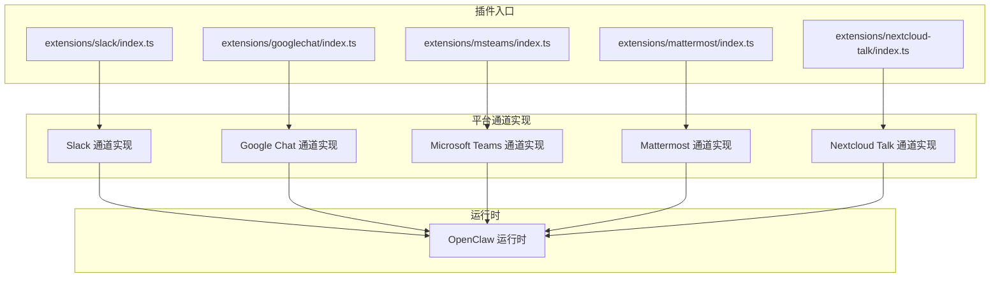
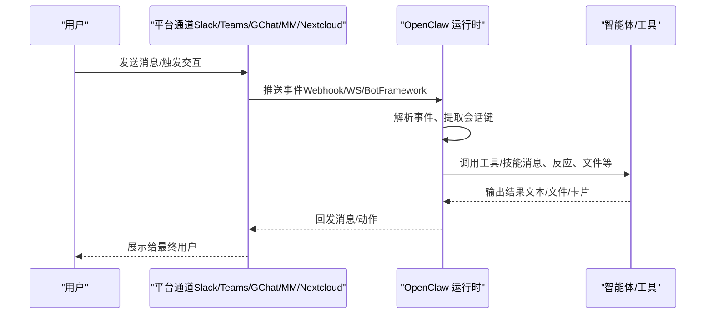
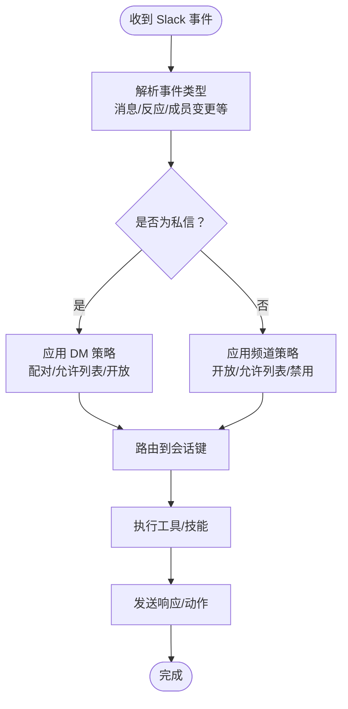
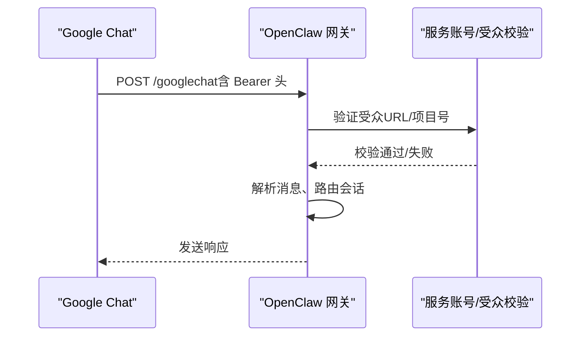
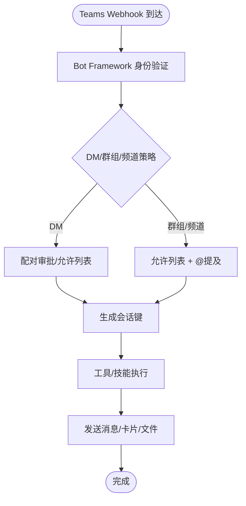
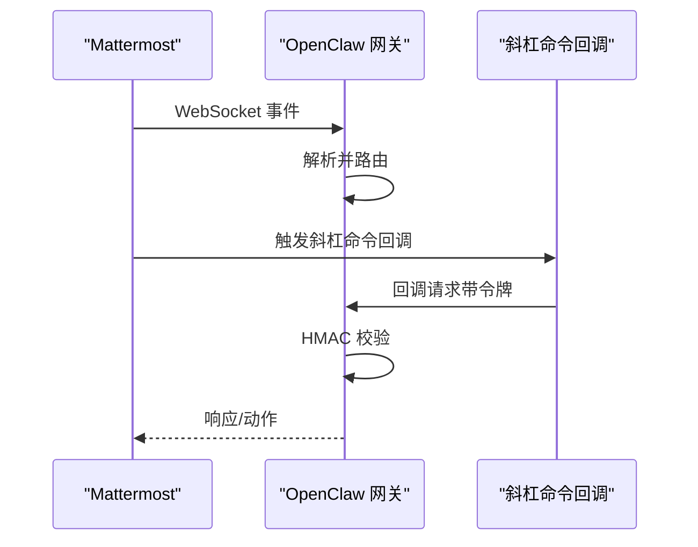
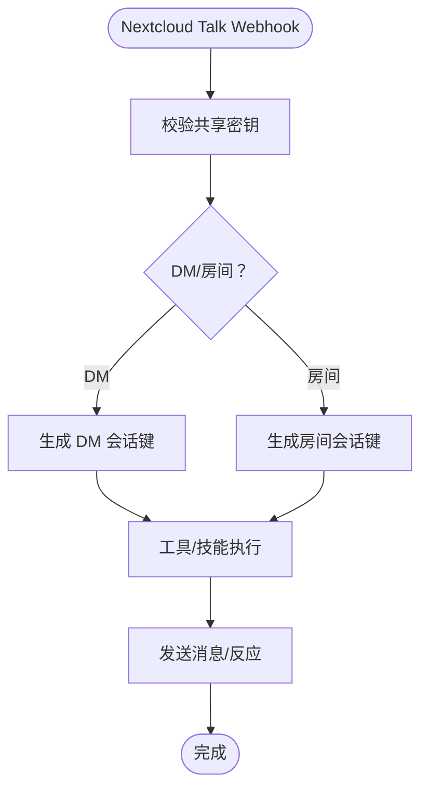
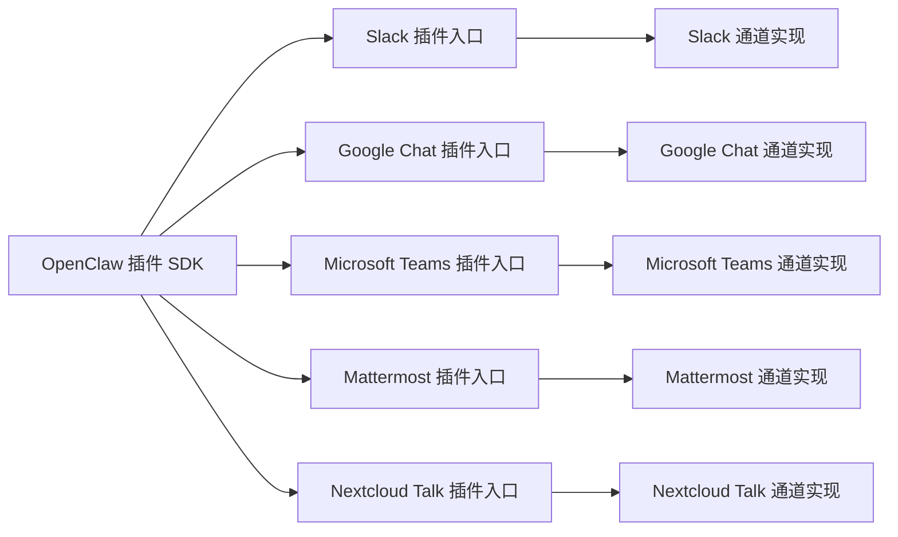

# 企业协作平台

<cite>
**本文引用的文件**
- [slack.md](file://docs/channels/slack.md)
- [googlechat.md](file://docs/channels/googlechat.md)
- [msteams.md](file://docs/channels/msteams.md)
- [mattermost.md](file://docs/channels/mattermost.md)
- [nextcloud-talk.md](file://docs/channels/nextcloud-talk.md)
- [index.ts（Slack 插件）](file://extensions/slack/index.ts)
- [index.ts（Google Chat 插件）](file://extensions/googlechat/index.ts)
- [index.ts（Microsoft Teams 插件）](file://extensions/msteams/index.ts)
- [index.ts（Mattermost 插件）](file://extensions/mattermost/index.ts)
- [index.ts（Nextcloud Talk 插件）](file://extensions/nextcloud-talk/index.ts)
- [openclaw.plugin.json（Mattermost 插件清单）](file://extensions/mattermost/openclaw.plugin.json)
</cite>

## 目录

1. [简介](#简介)
2. [项目结构](#项目结构)
3. [核心组件](#核心组件)
4. [架构总览](#架构总览)
5. [详细组件分析](#详细组件分析)
6. [依赖关系分析](#依赖关系分析)
7. [性能考量](#性能考量)
8. [故障排查指南](#故障排查指南)
9. [结论](#结论)
10. [附录](#附录)

## 简介

本文件面向企业级部署场景，系统化梳理 OpenClaw 在 Slack、Google Chat、Microsoft Teams、Mattermost、Nextcloud Talk 等主流协作平台的集成实现与最佳实践。内容覆盖认证与授权、权限控制、组织架构集成、Socket Mode/Webhook/OAuth 流程、企业安全策略、团队与频道路由、文件共享、以及与现有 IT 基础设施的对接方式。目标是帮助企业安全、稳定地将 OpenClaw 的智能体能力接入内部协作系统。

## 项目结构

OpenClaw 将各平台通道以“插件”形式组织在 extensions 目录下，并通过统一的插件 SDK 注册到运行时。每个平台插件包含：

- 插件入口：定义插件标识、名称、描述与配置模式，并注册通道实现
- 通道实现：负责事件接收、消息路由、会话管理、工具调用等
- 运行时设置：注入平台特定的运行时上下文（如 HTTP 路由、WebSocket 客户端等）

**图表来源**

- [index.ts（Slack 插件）:1-18](file://extensions/slack/index.ts#L1-L18)
- [index.ts（Google Chat 插件）:1-18](file://extensions/googlechat/index.ts#L1-L18)
- [index.ts（Microsoft Teams 插件）:1-18](file://extensions/msteams/index.ts#L1-L18)
- [index.ts（Mattermost 插件）:1-24](file://extensions/mattermost/index.ts#L1-L24)
- [index.ts（Nextcloud Talk 插件）:1-18](file://extensions/nextcloud-talk/index.ts#L1-L18)

**章节来源**

- [index.ts（Slack 插件）:1-18](file://extensions/slack/index.ts#L1-L18)
- [index.ts（Google Chat 插件）:1-18](file://extensions/googlechat/index.ts#L1-L18)
- [index.ts（Microsoft Teams 插件）:1-18](file://extensions/msteams/index.ts#L1-L18)
- [index.ts（Mattermost 插件）:1-24](file://extensions/mattermost/index.ts#L1-L24)
- [index.ts（Nextcloud Talk 插件）:1-18](file://extensions/nextcloud-talk/index.ts#L1-L18)

## 核心组件

- 平台通道插件：封装平台特有的认证、事件订阅、消息发送、媒体处理、交互按钮/反应等能力
- 配置与模式：支持 Socket Mode（Slack）、HTTP Events API（Slack）、Webhook（Google Chat、Mattermost、Nextcloud Talk）、Bot Framework（Microsoft Teams）
- 访问控制：基于 DM/群组/频道策略、用户/房间白名单、提及要求、配对审批等
- 会话与路由：按会话键聚合对话历史，支持线程/回复模式、分块传输、媒体下载
- 工具与动作：消息、反应、钉钉、成员信息、表情列表等动作开关；部分平台支持原生命令或交互式按钮

**章节来源**

- [slack.md:10-135](file://docs/channels/slack.md#L10-L135)
- [googlechat.md:10-206](file://docs/channels/googlechat.md#L10-L206)
- [msteams.md:14-84](file://docs/channels/msteams.md#L14-L84)
- [mattermost.md:11-184](file://docs/channels/mattermost.md#L11-L184)
- [nextcloud-talk.md:10-139](file://docs/channels/nextcloud-talk.md#L10-L139)

## 架构总览

下图展示 OpenClaw 与各企业协作平台的集成路径：插件注册到运行时，平台通过各自协议（WebSocket/HTTP/Bot Framework）向 OpenClaw 推送事件，OpenClaw 解析后路由至对应会话并执行工具/技能，再回发消息或动作。

**图表来源**

- [index.ts（Slack 插件）:11-14](file://extensions/slack/index.ts#L11-L14)
- [index.ts（Google Chat 插件）:11-14](file://extensions/googlechat/index.ts#L11-L14)
- [index.ts（Microsoft Teams 插件）:11-14](file://extensions/msteams/index.ts#L11-L14)
- [index.ts（Mattermost 插件）:11-14](file://extensions/mattermost/index.ts#L11-L14)
- [index.ts（Nextcloud Talk 插件）:11-14](file://extensions/nextcloud-talk/index.ts#L11-L14)

## 详细组件分析

### Slack 集成

- 模式与认证
  - 默认 Socket Mode：需要 App Token 与 Bot Token；适合低延迟实时交互
  - HTTP Events API：需配置签名密钥与 Webhook 路径；适合多账户隔离
- 权限与路由
  - DM 策略：配对、允许列表、开放、禁用；支持组播（MPIM）白名单
  - 频道策略：开放/允许列表/禁用；支持按频道细粒度控制（提及、用户白名单、工具策略）
  - 提及与线程：默认按应用提及、正则、回复线程行为控制；支持显式回复标签
- 功能特性
  - 原生流式输出（AI 应用流）：可选局部替换/追加/进度提示
  - 反应与打字态：可配置确认反应与临时反应
  - 文件与媒体：按大小限制下载，支持分块文本与线程回复
- 安全与合规
  - 事件校验（签名）、最小权限作用域、会话隔离、审计日志

**图表来源**

- [slack.md:136-205](file://docs/channels/slack.md#L136-L205)
- [slack.md:234-282](file://docs/channels/slack.md#L234-L282)
- [slack.md:492-532](file://docs/channels/slack.md#L492-L532)

**章节来源**

- [slack.md:10-135](file://docs/channels/slack.md#L10-L135)
- [slack.md:136-205](file://docs/channels/slack.md#L136-L205)
- [slack.md:234-282](file://docs/channels/slack.md#L234-L282)
- [slack.md:492-532](file://docs/channels/slack.md#L492-L532)

### Google Chat（Chat API）集成

- 模式与认证
  - 仅支持 HTTP Webhook；使用服务账号与受众（Audience）校验
  - 支持 Tailscale Funnel、反向代理或 Cloudflare Tunnel 暴露单一路由
- 权限与路由
  - DM 默认配对；空间（群组）默认需要 @提及
  - 会话键区分 DM 与空间；支持按空间细粒度控制（提及、用户白名单、系统提示）
- 功能特性
  - 反应与打字指示器；附件下载与媒体上限
  - 允许使用 botUser 提升提及检测准确性
- 安全与合规
  - Bearer Token 校验；严格 Audience 匹配；最小暴露面（仅公开 /googlechat）

**图表来源**

- [googlechat.md:139-153](file://docs/channels/googlechat.md#L139-L153)
- [googlechat.md:163-206](file://docs/channels/googlechat.md#L163-L206)

**章节来源**

- [googlechat.md:10-131](file://docs/channels/googlechat.md#L10-L131)
- [googlechat.md:139-206](file://docs/channels/googlechat.md#L139-L206)

### Microsoft Teams 集成

- 插件化部署：作为独立插件安装，Bot Framework Webhook（默认 /api/messages）
- 认证与权限
  - Azure Bot（App ID/密码/租户）；Teams 应用清单 + RSC 权限
  - 可选启用 Microsoft Graph 权限以读取历史与下载媒体
- 访问控制
  - DM：配对策略；群组/频道：允许列表 + @提及要求
  - 支持按团队/频道覆盖策略（提及、回复样式、工具策略）
- 功能特性
  - 文本/图片/文件发送；投票以自适应卡片形式发送
  - 文件上传至 SharePoint（需站点 ID 与相应 Graph 权限）
- 安全与合规
  - Webhook 超时与重试风险；最小权限与受限主机白名单

**图表来源**

- [msteams.md:142-149](file://docs/channels/msteams.md#L142-L149)
- [msteams.md:450-478](file://docs/channels/msteams.md#L450-L478)
- [msteams.md:531-597](file://docs/channels/msteams.md#L531-L597)

**章节来源**

- [msteams.md:16-84](file://docs/channels/msteams.md#L16-L84)
- [msteams.md:142-286](file://docs/channels/msteams.md#L142-L286)
- [msteams.md:450-597](file://docs/channels/msteams.md#L450-L597)

### Mattermost 集成

- 插件化部署：独立插件安装；使用 Bot Token + WebSocket 事件
- 认证与回调
  - 原生斜杠命令：可注册 oc\_\* 命令并通过回调路径回传；回调 URL 需可达
  - 交互按钮：HMAC-SHA256 校验，外部脚本需按约定生成 token
- 访问控制
  - DM：配对策略；群组：允许列表 + @提及要求；支持按用户 ID 白名单
  - 会话键区分频道与用户；支持内联按钮能力
- 功能特性
  - 反应、按钮、目录适配器（解析 #频道 与 @用户名）
  - 多账户配置与环境变量（仅默认账户生效）
- 安全与合规
  - 内部连接白名单（AllowedUntrustedInternalConnections）；回调 URL 可达性

**图表来源**

- [mattermost.md:37-96](file://docs/channels/mattermost.md#L37-L96)
- [mattermost.md:185-242](file://docs/channels/mattermost.md#L185-L242)

**章节来源**

- [mattermost.md:15-96](file://docs/channels/mattermost.md#L15-L96)
- [mattermost.md:185-242](file://docs/channels/mattermost.md#L185-L242)
- [openclaw.plugin.json（Mattermost 插件清单）:1-9](file://extensions/mattermost/openclaw.plugin.json#L1-L9)

### Nextcloud Talk 集成

- 插件化部署：独立插件安装；Webhook Bot 模式
- 认证与路由
  - 使用共享密钥与 Webhook URL；DM 识别需 API 用户/密码以区分房间类型
  - 会话键区分 DM 与房间；支持按房间细粒度控制
- 功能特性
  - 支持反应；媒体以 URL 形式发送；不支持机器人发起 DM
  - 分块文本与历史限制配置
- 安全与合规
  - Webhook URL 可达性；最小暴露面与只读策略

**图表来源**

- [nextcloud-talk.md:33-69](file://docs/channels/nextcloud-talk.md#L33-L69)
- [nextcloud-talk.md:79-139](file://docs/channels/nextcloud-talk.md#L79-L139)

**章节来源**

- [nextcloud-talk.md:12-69](file://docs/channels/nextcloud-talk.md#L12-L69)
- [nextcloud-talk.md:79-139](file://docs/channels/nextcloud-talk.md#L79-L139)

## 依赖关系分析

- 插件入口依赖统一的插件 SDK，注册平台通道与运行时
- 各平台通道依赖平台官方 API/SDK（Bot Framework、Chat API、WebSocket、REST）
- 运行时提供通用能力：会话管理、工具调度、事件路由、日志与安全策略

**图表来源**

- [index.ts（Slack 插件）:1-18](file://extensions/slack/index.ts#L1-L18)
- [index.ts（Google Chat 插件）:1-18](file://extensions/googlechat/index.ts#L1-L18)
- [index.ts（Microsoft Teams 插件）:1-18](file://extensions/msteams/index.ts#L1-L18)
- [index.ts（Mattermost 插件）:1-24](file://extensions/mattermost/index.ts#L1-L24)
- [index.ts（Nextcloud Talk 插件）:1-18](file://extensions/nextcloud-talk/index.ts#L1-L18)

**章节来源**

- [index.ts（Slack 插件）:1-18](file://extensions/slack/index.ts#L1-L18)
- [index.ts（Google Chat 插件）:1-18](file://extensions/googlechat/index.ts#L1-L18)
- [index.ts（Microsoft Teams 插件）:1-18](file://extensions/msteams/index.ts#L1-L18)
- [index.ts（Mattermost 插件）:1-24](file://extensions/mattermost/index.ts#L1-L24)
- [index.ts（Nextcloud Talk 插件）:1-18](file://extensions/nextcloud-talk/index.ts#L1-L18)

## 性能考量

- 事件处理吞吐：选择合适的模式（Socket Mode/HTTP/Webhook），避免不必要的轮询
- 媒体与分块：合理设置媒体上限与文本分块参数，减少大文件传输开销
- 会话历史：按需限制历史长度，降低提示词成本
- 并发与超时：Teams Webhook 存在超时风险，建议快速响应并异步处理长任务
- 缓存与鉴权：对平台 API 的鉴权头与资源访问进行缓存与复用

## 故障排查指南

- Slack
  - 无回复：检查频道策略、提及要求、用户白名单
  - DM 忽略：检查 DM 策略与配对状态
  - Socket Mode 不连：核对 App Token/Bot Token 与 Socket Mode 开启
  - HTTP 模式未接收：核对签名密钥、Webhook 路径与请求 URL
- Google Chat
  - 405：确认通道已启用且路由注册
  - Audience 配置缺失：核对受众类型与值
- Microsoft Teams
  - 图片/文件不显示：确认 Graph 权限与管理员同意
  - Webhook 超时：优化响应速度或缩短处理链路
- Mattermost
  - 斜杠命令回调 404：确认回调 URL 可达与白名单配置
  - 按钮点击无效：检查按钮 ID 仅含字母数字、HMAC 校验一致
- Nextcloud Talk
  - DM 识别错误：配置 API 用户/密码以区分房间类型
  - Webhook 不可达：设置公网 URL 或确保代理正确转发

**章节来源**

- [slack.md:433-490](file://docs/channels/slack.md#L433-L490)
- [googlechat.md:209-256](file://docs/channels/googlechat.md#L209-L256)
- [msteams.md:745-777](file://docs/channels/msteams.md#L745-L777)
- [mattermost.md:358-370](file://docs/channels/mattermost.md#L358-L370)
- [nextcloud-talk.md:63-139](file://docs/channels/nextcloud-talk.md#L63-L139)

## 结论

OpenClaw 通过插件化架构将多家企业协作平台无缝接入，提供统一的会话、路由与工具调度能力。企业可依据自身安全与合规要求，选择合适模式（Socket Mode/Webhook/Bot Framework），结合严格的访问控制与最小权限原则，实现安全、可控、可扩展的智能体协作体验。

## 附录

- 企业部署建议
  - 使用反向代理或隧道（如 Tailscale Funnel）仅暴露必要路径
  - 采用最小权限作用域与严格的 Audience/Token 校验
  - 对敏感配置使用密钥管理与只读策略
  - 建立事件审计与日志留存，满足合规要求
- 与现有 IT 基础设施集成
  - Slack/Google Chat：结合企业 IAM 与应用商店策略
  - Microsoft Teams：通过 Entra ID 与 Teams 管理中心集中治理
  - Mattermost：利用服务器配置与内部连接白名单
  - Nextcloud Talk：通过 OCC 命令与 Webhook 集成
