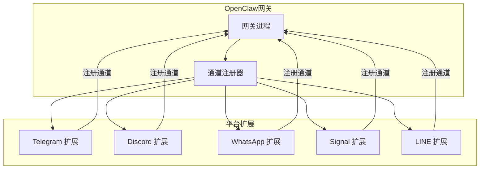
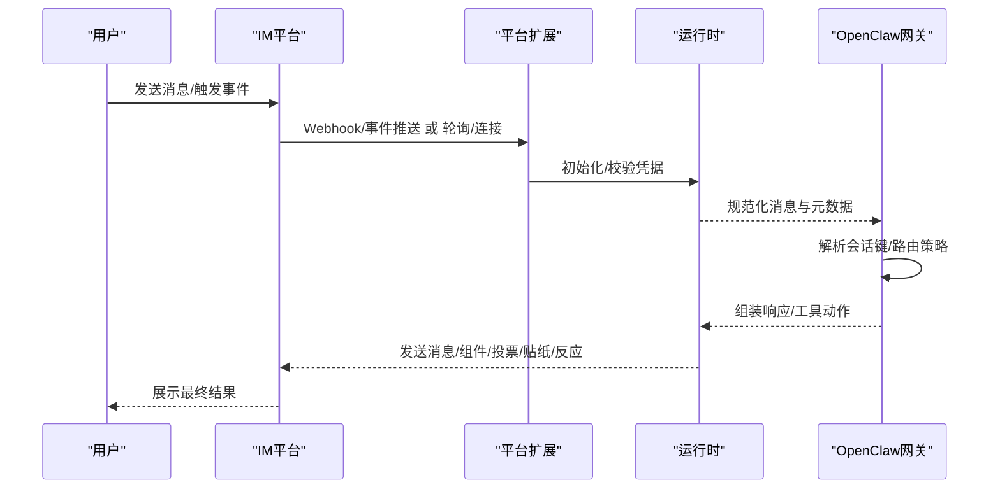
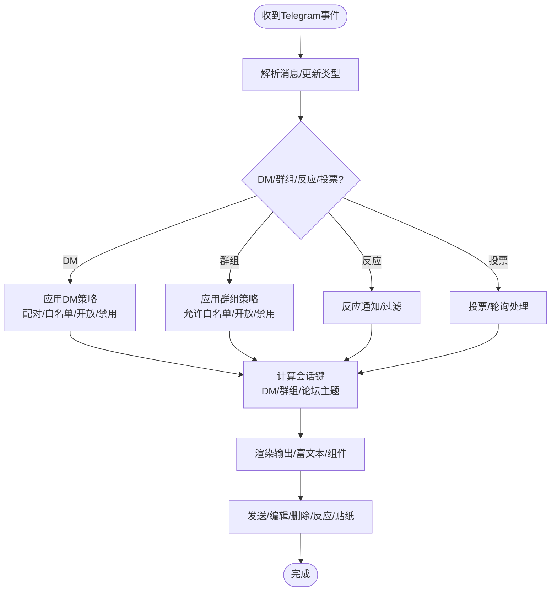
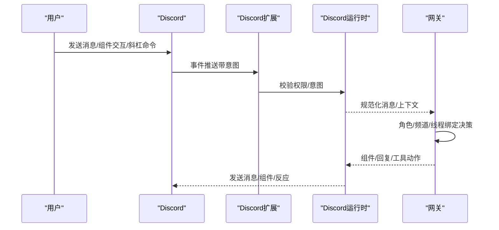
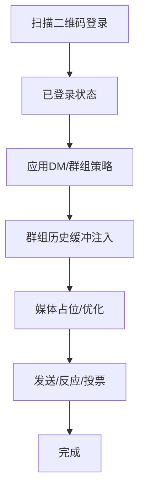
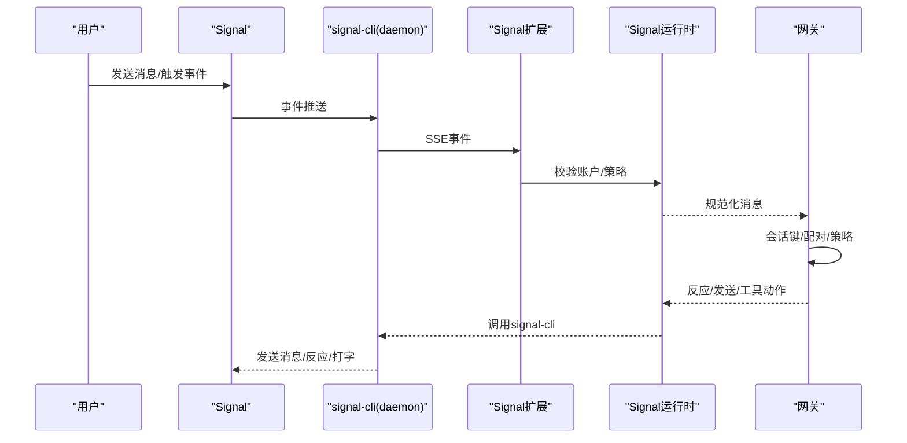
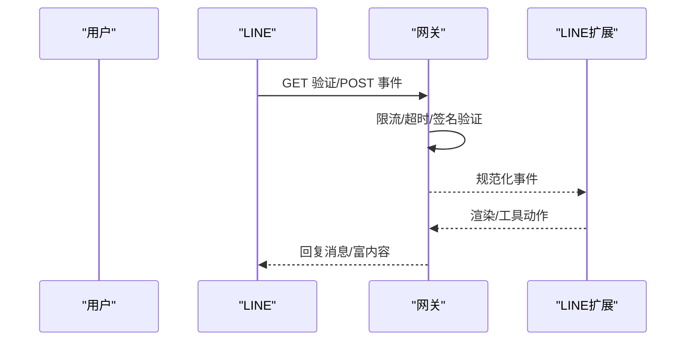
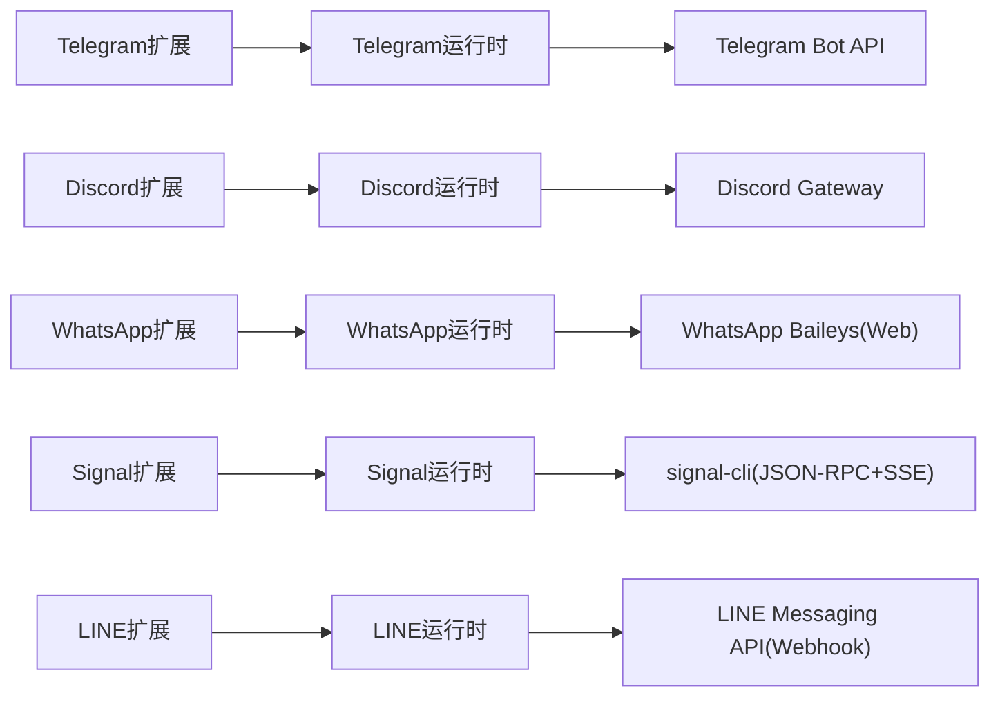

# 即时通讯平台

<cite>
**本文引用的文件**
- [docs/channels/telegram.md](file://docs/channels/telegram.md)
- [docs/channels/discord.md](file://docs/channels/discord.md)
- [docs/channels/whatsapp.md](file://docs/channels/whatsapp.md)
- [docs/channels/signal.md](file://docs/channels/signal.md)
- [docs/channels/line.md](file://docs/channels/line.md)
- [extensions/telegram/index.ts](file://extensions/telegram/index.ts)
- [extensions/discord/index.ts](file://extensions/discord/index.ts)
- [extensions/whatsapp/index.ts](file://extensions/whatsapp/index.ts)
- [extensions/signal/index.ts](file://extensions/signal/index.ts)
- [extensions/line/index.ts](file://extensions/line/index.ts)
</cite>

## 目录

1. [简介](#简介)
2. [项目结构](#项目结构)
3. [核心组件](#核心组件)
4. [架构总览](#架构总览)
5. [详细组件分析](#详细组件分析)
6. [依赖关系分析](#依赖关系分析)
7. [性能考量](#性能考量)
8. [故障排查指南](#故障排查指南)
9. [结论](#结论)
10. [附录](#附录)

## 简介

本文件面向OpenClaw支持的即时通讯平台，系统性梳理Telegram、Discord、WhatsApp、Signal、LINE等主流IM渠道的集成实现与使用方法。内容覆盖各平台API特性、认证与配对流程、消息路由与会话隔离、平台特有能力（如富文本、组件、投票、话题绑定、贴纸、反应通知等）、配置示例、Webhook与OAuth要点、消息格式转换与媒体处理、用户身份验证与访问控制、常见问题与性能优化建议。

## 项目结构

OpenClaw通过“插件化通道”架构在网关层统一接入多平台IM。每个平台以独立扩展存在，负责：

- 注册通道：向OpenClaw注册具体通道实现
- 运行时注入：设置平台专用运行时（如长轮询、Webhook、外部CLI）
- 配置模式：提供空配置Schema，实际参数由用户配置文件或环境变量驱动

图表来源

- [extensions/telegram/index.ts:1-18](file://extensions/telegram/index.ts#L1-L18)
- [extensions/discord/index.ts:1-20](file://extensions/discord/index.ts#L1-L20)
- [extensions/whatsapp/index.ts:1-18](file://extensions/whatsapp/index.ts#L1-L18)
- [extensions/signal/index.ts:1-18](file://extensions/signal/index.ts#L1-L18)
- [extensions/line/index.ts:1-20](file://extensions/line/index.ts#L1-L20)

章节来源

- [extensions/telegram/index.ts:1-18](file://extensions/telegram/index.ts#L1-L18)
- [extensions/discord/index.ts:1-20](file://extensions/discord/index.ts#L1-L20)
- [extensions/whatsapp/index.ts:1-18](file://extensions/whatsapp/index.ts#L1-L18)
- [extensions/signal/index.ts:1-18](file://extensions/signal/index.ts#L1-L18)
- [extensions/line/index.ts:1-20](file://extensions/line/index.ts#L1-L20)

## 核心组件

- 通道插件入口：各平台扩展在index.ts中导出插件对象，注册通道并注入运行时
- 通道能力与配置：各平台文档详细列出配置键、行为开关、默认值与限制
- 访问控制与配对：多数平台支持“配对码”或“允许白名单”，确保安全入站
- 消息路由与会话隔离：按用户/群组/频道/论坛主题生成稳定会话键，保证上下文与回复方向正确
- 平台特性：富文本、组件容器、投票、贴纸、反应通知、话题绑定、线程/论坛支持等

章节来源

- [docs/channels/telegram.md:1-975](file://docs/channels/telegram.md#L1-L975)
- [docs/channels/discord.md:1-1224](file://docs/channels/discord.md#L1-L1224)
- [docs/channels/whatsapp.md:1-446](file://docs/channels/whatsapp.md#L1-L446)
- [docs/channels/signal.md:1-326](file://docs/channels/signal.md#L1-L326)
- [docs/channels/line.md:1-194](file://docs/channels/line.md#L1-L194)

## 架构总览

下图展示OpenClaw如何通过扩展接入各IM平台，并在网关内完成认证、消息收发、会话管理与平台特性处理。

图表来源

- [extensions/telegram/index.ts:1-18](file://extensions/telegram/index.ts#L1-L18)
- [extensions/discord/index.ts:1-20](file://extensions/discord/index.ts#L1-L20)
- [extensions/whatsapp/index.ts:1-18](file://extensions/whatsapp/index.ts#L1-L18)
- [extensions/signal/index.ts:1-18](file://extensions/signal/index.ts#L1-L18)
- [extensions/line/index.ts:1-20](file://extensions/line/index.ts#L1-L20)

## 详细组件分析

### Telegram 集成

- 认证与配对
  - 使用BotFather创建机器人并获取令牌；默认DM策略为“配对”
  - 支持环境变量回退（默认账户），配置优先级高于环境变量
- Webhook与长轮询
  - 默认长轮询；可选Webhook（需设置URL、密钥、路径、主机与端口）
- 访问控制
  - DM策略：配对、允许白名单、开放、禁用
  - 群组策略：允许白名单、开放、禁用；支持每群/每话题覆盖
  - 提及行为：默认需要提及，可通过配置关闭或全局/群组覆盖
- 消息与媒体
  - 文本分片与换行优先；链接预览可禁用
  - 贴纸缓存与描述；语音/视频消息发送选项
  - 反应通知与ACK反应；投票与轮询（含论坛话题）
- 会话与话题
  - DM会话按主会话合并或独立；群组按群ID隔离
  - 论坛主题附加“topic:<threadId>”形成独立会话；支持话题级代理路由
- 命令与工具
  - 启动时注册原生命令菜单；自定义命令列表
  - 工具动作：发送、删除、编辑、反应、贴纸、话题创建等
  - 配置写入：支持从事件触发的配置变更（如群迁移）

图表来源

- [docs/channels/telegram.md:1-975](file://docs/channels/telegram.md#L1-L975)

章节来源

- [docs/channels/telegram.md:1-975](file://docs/channels/telegram.md#L1-L975)

### Discord 集成

- 认证与权限
  - 在开发者门户创建应用与机器人，启用“消息内容意图”“服务器成员意图”等
  - 通过邀请URL添加到服务器；支持私有服务器作为工作区
- 访问控制
  - DM策略：配对、允许白名单、开放、禁用
  - 服务器/频道策略：允许白名单、开放、禁用；支持角色与用户名匹配（谨慎使用）
  - 提及与忽略其他提及；群组DM默认忽略
- 会话与线程
  - DM共享主会话；频道独立会话；线程作为频道会话
  - 支持线程绑定会话目标，用于子代理/ACP持久工作区
- 富文本与组件
  - 支持组件容器（按钮、选择、模态表单）；交互结果回流为普通消息
  - 论坛/媒体频道仅接受主题帖子；支持自动创建与显式创建
- 命令与反应
  - 原生斜杠命令；命令执行遵循与消息相同的授权策略
  - 反应通知与ACK反应；支持持久化ACP通道绑定

图表来源

- [extensions/discord/index.ts:1-20](file://extensions/discord/index.ts#L1-L20)
- [docs/channels/discord.md:1-1224](file://docs/channels/discord.md#L1-L1224)

章节来源

- [extensions/discord/index.ts:1-20](file://extensions/discord/index.ts#L1-L20)
- [docs/channels/discord.md:1-1224](file://docs/channels/discord.md#L1-L1224)

### WhatsApp 集成（Web）

- 登录与配对
  - 通过二维码登录（支持多账户）；未知发送者默认“配对”策略
- 访问控制
  - DM策略：配对、允许白名单、开放、禁用
  - 群组策略：允许白名单、开放、禁用；支持每群覆盖
  - 提及检测：显式提及、正则模式、回复到机器人
- 自聊天保护
  - 当自身号码在允许列表中时，跳过自聊回执、避免自我提醒
- 消息与媒体
  - 文本分片与换行优先；媒体自动优化；支持PTT语音
  - 位置/联系人提取为文本上下文；未处理消息缓冲注入
- 运行时与多账户
  - 多账户凭据目录；默认账户选择；登出清理
- 工具与配置写入
  - 反应动作；投票动作；默认允许通道发起的配置写入

图表来源

- [docs/channels/whatsapp.md:1-446](file://docs/channels/whatsapp.md#L1-L446)

章节来源

- [docs/channels/whatsapp.md:1-446](file://docs/channels/whatsapp.md#L1-L446)

### Signal 集成（signal-cli）

- 外部CLI集成
  - 通过HTTP JSON-RPC + SSE与signal-cli通信；支持外部守护进程
- 设置路径
  - 链接现有账号（二维码）或注册专用号码（需验证码与浏览器验证码）
- 访问控制
  - DM策略：配对（推荐）；群组策略：允许白名单、开放、禁用
  - UUID发送者支持；配对码有效期
- 行为与媒体
  - 文本分片；附件下载；打字指示与已读回执（DM）
  - 反应动作与级别；群组反应需提供作者信息
- 多账户
  - 支持多账户配置与名称；独立凭据与运行时

图表来源

- [extensions/signal/index.ts:1-18](file://extensions/signal/index.ts#L1-L18)
- [docs/channels/signal.md:1-326](file://docs/channels/signal.md#L1-L326)

章节来源

- [extensions/signal/index.ts:1-18](file://extensions/signal/index.ts#L1-L18)
- [docs/channels/signal.md:1-326](file://docs/channels/signal.md#L1-L326)

### LINE 集成（插件）

- 插件化接入
  - 安装@openclaw/line插件；通过Webhook接收事件
- 凭据与Webhook
  - 使用Channel access token与Channel secret；开启Webhook并设置URL
  - 签名验证基于原始请求体（HMAC），网关在验证前施加严格限制
- 访问控制
  - DM默认配对；支持允许白名单与开放策略
  - 群组/房间ID大小写敏感（U/C/R + 32十六进制字符）
- 消息与富内容
  - 文本分片（5000字符）；Markdown转Flex卡片；媒体下载上限
  - 快捷回复、位置、Flex卡片、模板消息等channelData支持
- 多账户
  - 支持多账户与自定义Webhook路径

图表来源

- [extensions/line/index.ts:1-20](file://extensions/line/index.ts#L1-L20)
- [docs/channels/line.md:1-194](file://docs/channels/line.md#L1-L194)

章节来源

- [extensions/line/index.ts:1-20](file://extensions/line/index.ts#L1-L20)
- [docs/channels/line.md:1-194](file://docs/channels/line.md#L1-L194)

## 依赖关系分析

- 插件注册：各平台扩展在index.ts中调用registerChannel注册通道，并注入平台运行时
- 配置来源：各平台文档给出配置键、默认值、环境变量与文件路径
- 运行时差异：Telegram使用grammy长轮询/Webhook；Discord使用官方网关；WhatsApp使用Baileys Web；Signal通过signal-cli；LINE通过Webhook

图表来源

- [extensions/telegram/index.ts:1-18](file://extensions/telegram/index.ts#L1-L18)
- [extensions/discord/index.ts:1-20](file://extensions/discord/index.ts#L1-L20)
- [extensions/whatsapp/index.ts:1-18](file://extensions/whatsapp/index.ts#L1-L18)
- [extensions/signal/index.ts:1-18](file://extensions/signal/index.ts#L1-L18)
- [extensions/line/index.ts:1-20](file://extensions/line/index.ts#L1-L20)

章节来源

- [extensions/telegram/index.ts:1-18](file://extensions/telegram/index.ts#L1-L18)
- [extensions/discord/index.ts:1-20](file://extensions/discord/index.ts#L1-L20)
- [extensions/whatsapp/index.ts:1-18](file://extensions/whatsapp/index.ts#L1-L18)
- [extensions/signal/index.ts:1-18](file://extensions/signal/index.ts#L1-L18)
- [extensions/line/index.ts:1-20](file://extensions/line/index.ts#L1-L20)

## 性能考量

- 分片与缓冲
  - 文本分片与换行优先，减少平台长度限制导致的失败
  - 群组历史缓冲注入，提升上下文质量但需控制上限
- 并发与限流
  - 长轮询/网关并发受全局并发限制影响
  - Webhook模式下需合理设置反向代理与超时
- 媒体处理
  - 自动压缩与大小限制，避免超限失败
  - 附件下载可禁用以降低资源消耗
- 会话隔离
  - 按用户/群组/频道/论坛主题隔离，避免跨会话污染
- 反应与ACK
  - ACK反应在处理期间发送，改善感知延迟；失败不阻塞主流程

## 故障排查指南

- Telegram
  - Webhook失败：检查URL、密钥、路径与反向代理；确认DNS/HTTPS可达
  - 配对码过期：重新申请并及时批准
  - 隐私模式：关闭隐私或设为管理员以接收群组消息
- Discord
  - 缺少意图：启用“消息内容意图”“服务器成员意图”
  - 权限不足：检查邀请URL权限与服务器权限
  - 线程绑定：确认会话线程绑定配置与命令可用性
- WhatsApp
  - 未登录/断连：重新扫码登录；查看诊断日志
  - 无活动监听：确保网关运行且账户已登录
  - 群消息被忽略：核对群策略、允许列表、提及规则
- Signal
  - 守护进程不可达：确认httpUrl/account/启动等待时间
  - DM被忽略：待配对批准；UUID发送者需加入允许列表
  - 注册冲突：注册可能使主应用会话失效，建议专用号码
- LINE
  - Webhook验证失败：确认HTTPS与Channel secret一致
  - 媒体下载错误：提高媒体上限或检查网络

章节来源

- [docs/channels/telegram.md:1-975](file://docs/channels/telegram.md#L1-L975)
- [docs/channels/discord.md:1-1224](file://docs/channels/discord.md#L1-L1224)
- [docs/channels/whatsapp.md:1-446](file://docs/channels/whatsapp.md#L1-L446)
- [docs/channels/signal.md:1-326](file://docs/channels/signal.md#L1-L326)
- [docs/channels/line.md:1-194](file://docs/channels/line.md#L1-L194)

## 结论

OpenClaw通过插件化通道实现了对Telegram、Discord、WhatsApp、Signal、LINE的统一接入。各平台在认证、路由、会话隔离、富文本与组件、投票/贴纸/反应等方面具备差异化能力，同时共享一致的配置模型与安全策略。建议根据部署场景选择合适认证方式（配对/白名单/意图/CLI），并结合平台限制与性能建议进行调优。

## 附录

- 配置参考与示例请参阅各平台文档中的“快速设置/配置示例/字段参考”部分
- 多账户与凭据：各平台均支持多账户配置与凭据文件/环境变量
- 最佳实践
  - 使用专用号码/账号隔离个人与机器人流量
  - 启用必要的意图/权限与Webhook
  - 控制历史上下文与分片策略，平衡体验与性能
  - 对外暴露Webhook时确保HTTPS与签名验证
