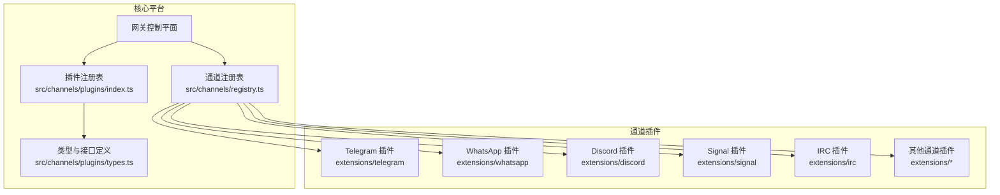
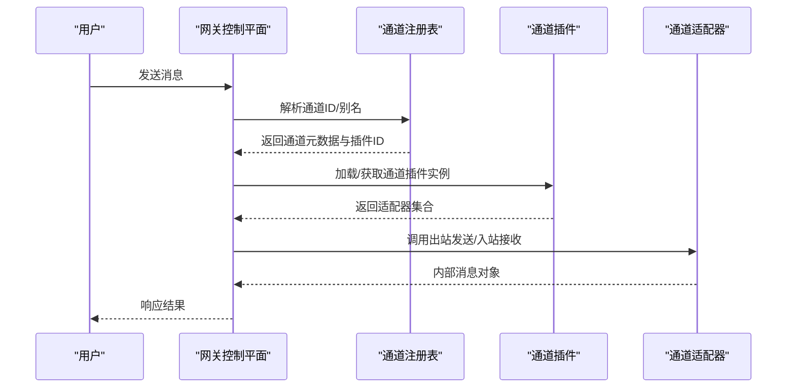
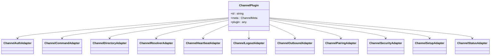
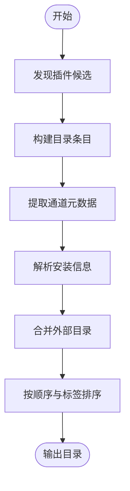
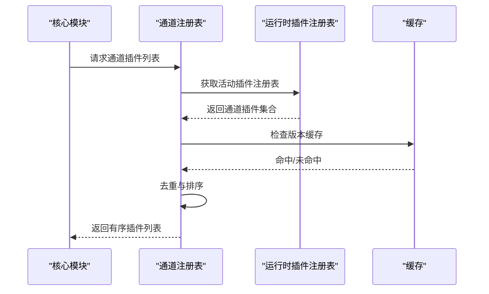
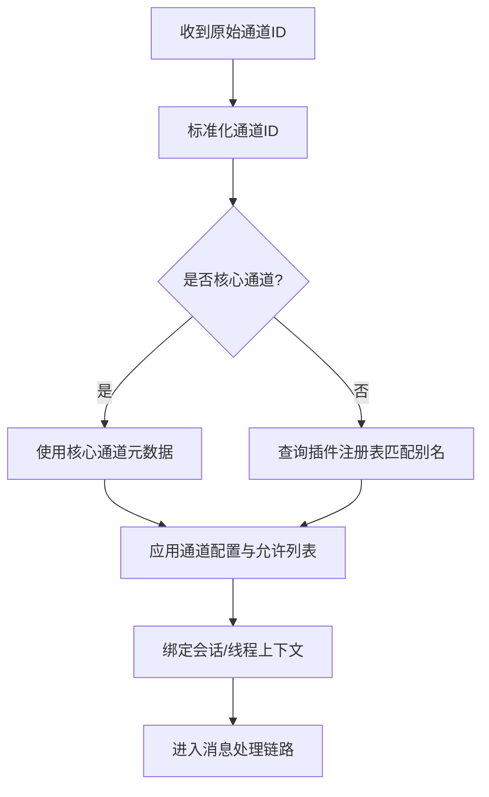
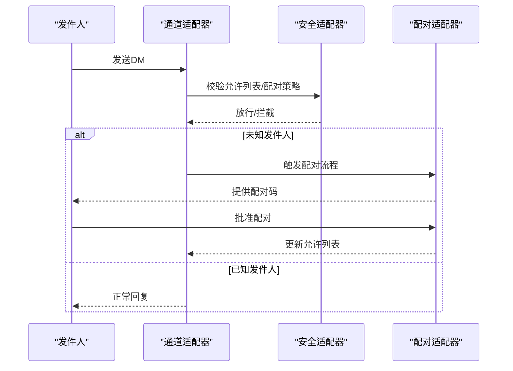

# 多通道消息集成

<cite>
**本文档引用的文件**
- [README.md](file://README.md)
- [channels/index.md](file://docs/channels/index.md)
- [src/channels/plugins/types.ts](file://src/channels/plugins/types.ts)
- [src/channels/plugins/catalog.ts](file://src/channels/plugins/catalog.ts)
- [src/channels/plugins/load.ts](file://src/channels/plugins/load.ts)
- [src/channels/registry.ts](file://src/channels/registry.ts)
- [src/channels/plugins/index.ts](file://src/channels/plugins/index.ts)
- [extensions/telegram/openclaw.plugin.json](file://extensions/telegram/openclaw.plugin.json)
- [extensions/whatsapp/openclaw.plugin.json](file://extensions/whatsapp/openclaw.plugin.json)
- [extensions/discord/openclaw.plugin.json](file://extensions/discord/openclaw.plugin.json)
- [extensions/signal/openclaw.plugin.json](file://extensions/signal/openclaw.plugin.json)
- [extensions/irc/openclaw.plugin.json](file://extensions/irc/openclaw.plugin.json)
</cite>

## 目录

1. [简介](#简介)
2. [项目结构](#项目结构)
3. [核心组件](#核心组件)
4. [架构总览](#架构总览)
5. [详细组件分析](#详细组件分析)
6. [依赖关系分析](#依赖关系分析)
7. [性能考虑](#性能考虑)
8. [故障排除指南](#故障排除指南)
9. [结论](#结论)
10. [附录](#附录)

## 简介

本文件面向OpenClaw的多通道消息集成功能，系统性阐述其架构设计、通道适配器模型、消息路由机制、认证与配置流程，以及扩展新平台的插件化开发方法。OpenClaw支持20+消息平台（如WhatsApp、Telegram、Discord、Slack、Google Chat、Signal、iMessage、BlueBubbles、IRC、Microsoft Teams、Matrix、Feishu、LINE、Mattermost、Nextcloud Talk、Nostr、Synology Chat、Tlon、Twitch、Zalo、WebChat），通过统一的“通道插件”体系实现标准化接入与运行时加载。

## 项目结构

OpenClaw采用“核心平台 + 插件化通道”的分层架构：

- 核心平台：包含网关控制平面、会话管理、工具系统、安全策略等。
- 通道插件：以独立扩展的形式提供各消息平台的适配器与运行时逻辑。
- 统一注册表：集中管理通道元数据、别名、排序与规范化。

图表来源

- [src/channels/registry.ts:1-201](file://src/channels/registry.ts#L1-L201)
- [src/channels/plugins/index.ts:1-118](file://src/channels/plugins/index.ts#L1-L118)
- [src/channels/plugins/types.ts:1-66](file://src/channels/plugins/types.ts#L1-L66)

章节来源

- [README.md:21-22](file://README.md#L21-L22)
- [docs/channels/index.md:14-37](file://docs/channels/index.md#L14-L37)

## 核心组件

- 通道插件接口与类型：定义了认证、命令、目录、解析、心跳、登出、出站消息、配对、安全、设置、状态等适配器契约，确保各平台以一致的方式接入。
- 通道目录与清单：提供通道元数据（标签、文档路径、图标、别名等）、安装信息（npm 规范、本地路径、默认选择）与UI目录构建。
- 通道注册与加载：在运行时发现并加载已安装的通道插件，按预设顺序与优先级进行去重与排序，并提供按ID查询与规范化能力。

章节来源

- [src/channels/plugins/types.ts:1-66](file://src/channels/plugins/types.ts#L1-L66)
- [src/channels/plugins/catalog.ts:1-308](file://src/channels/plugins/catalog.ts#L1-L308)
- [src/channels/plugins/load.ts:1-9](file://src/channels/plugins/load.ts#L1-L9)
- [src/channels/plugins/index.ts:1-118](file://src/channels/plugins/index.ts#L1-L118)

## 架构总览

OpenClaw的消息集成遵循“插件化适配器 + 注册表驱动 + 运行时加载”的模式。通道插件通过manifest声明自身ID、支持的通道列表与配置模式；核心平台在启动时扫描并加载这些插件，随后根据用户配置与路由规则将入站消息分发到对应通道适配器，再由适配器转换为内部消息格式并进入会话处理链路。

图表来源

- [src/channels/registry.ts:135-183](file://src/channels/registry.ts#L135-L183)
- [src/channels/plugins/index.ts:74-90](file://src/channels/plugins/index.ts#L74-L90)
- [src/channels/plugins/types.ts:7-63](file://src/channels/plugins/types.ts#L7-L63)

## 详细组件分析

### 通道插件接口与适配器族

通道插件通过一组适配器抽象与核心平台交互，涵盖认证、命令、目录、解析、心跳、登出、出站消息、配对、安全、设置、状态等职责域。这些适配器以统一契约定义，确保不同平台的差异被封装在插件内部。

图表来源

- [src/channels/plugins/types.ts:7-63](file://src/channels/plugins/types.ts#L7-L63)

章节来源

- [src/channels/plugins/types.ts:1-66](file://src/channels/plugins/types.ts#L1-L66)

### 通道目录与清单构建

通道目录负责从插件清单中提取元数据，生成UI目录项（含标签、详情标签、系统图标等），并解析安装信息（npm 规范、本地路径、默认选择）。外部目录可通过环境变量或配置文件路径注入，实现灵活扩展。

图表来源

- [src/channels/plugins/catalog.ts:193-296](file://src/channels/plugins/catalog.ts#L193-L296)

章节来源

- [src/channels/plugins/catalog.ts:1-308](file://src/channels/plugins/catalog.ts#L1-L308)

### 通道注册与运行时加载

通道注册表维护核心通道的顺序、别名与元数据；同时提供“任意通道ID规范化”能力，借助活动插件注册表匹配插件ID与别名，避免在共享代码中直接导入重型插件模块。运行时加载通过注册表版本缓存与去重策略提升性能。

图表来源

- [src/channels/registry.ts:135-183](file://src/channels/registry.ts#L135-L183)
- [src/channels/plugins/index.ts:42-72](file://src/channels/plugins/index.ts#L42-L72)

章节来源

- [src/channels/registry.ts:1-201](file://src/channels/registry.ts#L1-L201)
- [src/channels/plugins/index.ts:1-118](file://src/channels/plugins/index.ts#L1-L118)

### 入站消息路由与解析

- 通道ID规范化：通过注册表将用户输入的通道ID或别名标准化为核心通道ID。
- 配置匹配与允许列表：结合通道配置与允许列表决策是否放行消息。
- 会话绑定与线程策略：依据通道策略将消息绑定到会话或线程上下文。

图表来源

- [src/channels/registry.ts:147-183](file://src/channels/registry.ts#L147-L183)
- [src/channels/plugins/index.ts:86-90](file://src/channels/plugins/index.ts#L86-L90)

章节来源

- [src/channels/registry.ts:135-201](file://src/channels/registry.ts#L135-L201)
- [src/channels/plugins/index.ts:74-90](file://src/channels/plugins/index.ts#L74-L90)

### 认证与配对流程

- 渠道认证：各通道插件提供认证适配器，支持令牌、OAuth、QR登录等多种认证方式。
- 配对与允许列表：针对私信（DM）场景，可启用“配对”策略，未知发件人需经批准后方可通信；允许列表用于白名单放行。

图表来源

- [README.md:118-124](file://README.md#L118-L124)

章节来源

- [README.md:118-124](file://README.md#L118-L124)

### 平台特定实现概览

- Telegram：基于Bot API，支持群组与Webhook；配置简单，适合快速上手。
- WhatsApp：基于Baileys，需要QR配对，状态较多，适合个人号码长期运行。
- Discord：Bot API + 网关；支持服务器、频道与私信。
- Signal：基于signal-cli；注重隐私。
- IRC：经典IRC网络；支持DM与频道，具备配对/允许列表控制。

章节来源

- [docs/channels/index.md:16-37](file://docs/channels/index.md#L16-L37)
- [README.md:340-403](file://README.md#L340-L403)

### 新增通道平台的插件开发指南

- 插件清单：在插件根目录提供清单文件，声明通道ID、支持的通道列表与配置模式。
- 适配器实现：至少实现必要的适配器（如认证、出站消息、配对、安全等），以满足基本消息收发与安全策略。
- 目录与元数据：在清单中提供通道标签、文档路径、系统图标、别名等，便于UI展示与用户选择。
- 安装与发布：支持npm规范或本地路径，默认选择策略，便于用户安装与切换。
- 测试与验证：在本地或工作区环境中安装插件，通过核心平台的通道目录与注册表验证加载与功能。

章节来源

- [extensions/telegram/openclaw.plugin.json:1-10](file://extensions/telegram/openclaw.plugin.json#L1-L10)
- [extensions/whatsapp/openclaw.plugin.json:1-10](file://extensions/whatsapp/openclaw.plugin.json#L1-L10)
- [extensions/discord/openclaw.plugin.json:1-10](file://extensions/discord/openclaw.plugin.json#L1-L10)
- [extensions/signal/openclaw.plugin.json:1-10](file://extensions/signal/openclaw.plugin.json#L1-L10)
- [extensions/irc/openclaw.plugin.json:1-10](file://extensions/irc/openclaw.plugin.json#L1-L10)

## 依赖关系分析

- 低耦合高内聚：通道插件通过适配器接口与核心平台解耦，新增平台仅需实现对应适配器。
- 运行时发现：通过插件注册表在运行时动态加载，避免静态导入带来的体积与启动时间开销。
- 优先级与排序：核心通道有固定顺序，插件可自定义顺序，注册表按顺序与标签综合排序，保证一致性与可预测性。

图表来源

- [src/channels/plugins/types.ts:1-66](file://src/channels/plugins/types.ts#L1-L66)
- [src/channels/plugins/catalog.ts:1-308](file://src/channels/plugins/catalog.ts#L1-L308)
- [src/channels/plugins/load.ts:1-9](file://src/channels/plugins/load.ts#L1-L9)
- [src/channels/registry.ts:1-201](file://src/channels/registry.ts#L1-L201)
- [src/channels/plugins/index.ts:1-118](file://src/channels/plugins/index.ts#L1-L118)
- [extensions/telegram/openclaw.plugin.json:1-10](file://extensions/telegram/openclaw.plugin.json#L1-L10)

章节来源

- [src/channels/plugins/types.ts:1-66](file://src/channels/plugins/types.ts#L1-L66)
- [src/channels/plugins/catalog.ts:1-308](file://src/channels/plugins/catalog.ts#L1-L308)
- [src/channels/plugins/load.ts:1-9](file://src/channels/plugins/load.ts#L1-L9)
- [src/channels/registry.ts:1-201](file://src/channels/registry.ts#L1-L201)
- [src/channels/plugins/index.ts:1-118](file://src/channels/plugins/index.ts#L1-L118)

## 性能考虑

- 启动与加载：通过注册表版本缓存与去重策略减少重复加载与排序成本。
- 运行时模块化：通道插件按需加载，避免在共享路径中引入重型依赖。
- 路由与匹配：在共享路径中使用轻量的ID规范化与匹配逻辑，将重型插件加载延迟至执行边界。
- 并发与背压：通道适配器应实现合理的并发与背压策略，避免阻塞网关主循环。

## 故障排除指南

- 通道无法识别：检查通道ID或别名是否在注册表中定义，或插件清单中的别名是否正确。
- 插件未加载：确认插件已安装且清单有效，检查目录与环境变量配置的目录路径是否存在。
- 配对失败：核对配对策略与允许列表配置，确保未知发件人已完成批准流程。
- 文档与参考：可参考官方文档的“通道故障排除”与“安全”章节获取更详细的诊断步骤。

章节来源

- [README.md:430-431](file://README.md#L430-L431)

## 结论

OpenClaw通过“插件化适配器 + 注册表驱动 + 运行时加载”的架构，实现了对20+消息平台的一致接入与扩展。该设计在保证跨平台兼容性的同时，兼顾了性能、安全性与可维护性。开发者可基于适配器契约快速实现新平台支持，并通过目录与清单机制完善用户体验。

## 附录

- 快速参考：核心通道顺序与别名映射、UI目录构建与安装信息解析。
- 最佳实践：在清单中提供清晰的元数据与文档路径；在适配器中最小化对外部库的直接依赖；在运行时按需加载插件。
