# 核心通道适配器

<cite>
**本文引用的文件**
- [src/channels/plugins/types.adapters.ts](file://src/channels/plugins/types.adapters.ts)
- [src/channels/plugins/types.core.ts](file://src/channels/plugins/types.core.ts)
- [src/channels/plugins/types.ts](file://src/channels/plugins/types.ts)
- [src/channels/plugins/index.ts](file://src/channels/plugins/index.ts)
- [src/channels/plugins/load.ts](file://src/channels/plugins/load.ts)
- [src/channels/plugins/registry-loader.ts](file://src/channels/plugins/registry-loader.ts)
- [src/channels/registry.ts](file://src/channels/registry.ts)
- [src/infra/outbound/channel-adapters.ts](file://src/infra/outbound/channel-adapters.ts)
- [src/plugins/registry.ts](file://src/plugins/registry.ts)
- [extensions/discord/openclaw.plugin.json](file://extensions/discord/openclaw.plugin.json)
- [extensions/telegram/index.ts](file://extensions/telegram/index.ts)
- [extensions/whatsapp/index.ts](file://extensions/whatsapp/index.ts)
</cite>

## 目录

1. [引言](#引言)
2. [项目结构](#项目结构)
3. [核心组件](#核心组件)
4. [架构总览](#架构总览)
5. [详细组件分析](#详细组件分析)
6. [依赖关系分析](#依赖关系分析)
7. [性能考量](#性能考量)
8. [故障排查指南](#故障排查指南)
9. [结论](#结论)
10. [附录](#附录)

## 引言

本文件面向OpenClaw的核心通道适配器系统，系统性阐述通道注册机制、插件架构设计、以及20+支持平台的基础适配器实现。重点覆盖通道元数据管理、ID标准化与别名解析、通道消息适配器、生命周期管理、错误处理与性能优化策略，并提供通道插件的开发指南、接口规范与最佳实践，以及如何扩展新通道支持的完整流程（从插件注册到配置管理与测试）。

## 项目结构

OpenClaw将“通道”抽象为可插拔的插件单元，通过统一的插件注册表进行集中管理；通道适配器以类型安全的方式定义了入站/出站、状态、网关、目录、解析、安全等能力边界。核心模块分布如下：

- 通道插件类型与适配器：src/channels/plugins/types.adapters.ts、types.core.ts、types.ts
- 通道插件入口与缓存：src/channels/plugins/index.ts、load.ts、registry-loader.ts
- 通道元数据与ID标准化：src/channels/registry.ts
- 消息跨上下文适配器：src/infra/outbound/channel-adapters.ts
- 插件注册表与注册逻辑：src/plugins/registry.ts
- 示例插件：extensions/discord、extensions/telegram、extensions/whatsapp 等

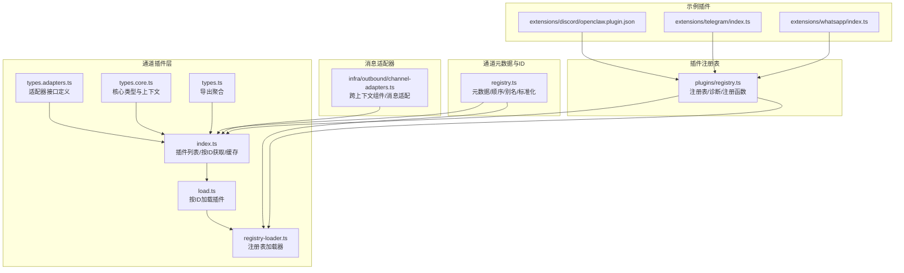

图表来源

- [src/channels/plugins/types.adapters.ts:1-384](file://src/channels/plugins/types.adapters.ts#L1-L384)
- [src/channels/plugins/types.core.ts:1-403](file://src/channels/plugins/types.core.ts#L1-L403)
- [src/channels/plugins/types.ts:1-66](file://src/channels/plugins/types.ts#L1-L66)
- [src/channels/plugins/index.ts:1-118](file://src/channels/plugins/index.ts#L1-L118)
- [src/channels/plugins/load.ts:1-9](file://src/channels/plugins/load.ts#L1-L9)
- [src/channels/plugins/registry-loader.ts:1-35](file://src/channels/plugins/registry-loader.ts#L1-L35)
- [src/channels/registry.ts:1-201](file://src/channels/registry.ts#L1-L201)
- [src/infra/outbound/channel-adapters.ts:1-57](file://src/infra/outbound/channel-adapters.ts#L1-L57)
- [src/plugins/registry.ts:1-200](file://src/plugins/registry.ts#L1-L200)
- [extensions/discord/openclaw.plugin.json:1-10](file://extensions/discord/openclaw.plugin.json#L1-L10)
- [extensions/telegram/index.ts:1-18](file://extensions/telegram/index.ts#L1-L18)
- [extensions/whatsapp/index.ts:1-18](file://extensions/whatsapp/index.ts#L1-L18)

章节来源

- [src/channels/plugins/index.ts:1-118](file://src/channels/plugins/index.ts#L1-L118)
- [src/channels/registry.ts:1-201](file://src/channels/registry.ts#L1-L201)
- [src/plugins/registry.ts:1-200](file://src/plugins/registry.ts#L1-L200)

## 核心组件

- 通道适配器接口族：涵盖设置、配置、群组、出站、状态、网关、认证、心跳、目录、解析、安全等能力，形成统一的扩展点。
- 通道核心类型：定义通道ID、账户快照、能力集、线程化、消息动作、轮询上下文等基础数据结构。
- 通道插件入口：提供插件列表、按ID获取、ID标准化、缓存与排序等运行时能力。
- 注册表加载器：基于活跃插件注册表，按ID解析并缓存插件或适配器值，避免重复查找。
- 元数据与ID标准化：内置核心通道顺序、别名映射与通用ID标准化逻辑，兼容已注册插件的别名。
- 消息跨上下文适配器：针对不同通道的消息组件渲染策略（如Discord容器），提供默认与特定通道的适配器。

章节来源

- [src/channels/plugins/types.adapters.ts:24-384](file://src/channels/plugins/types.adapters.ts#L24-L384)
- [src/channels/plugins/types.core.ts:11-403](file://src/channels/plugins/types.core.ts#L11-L403)
- [src/channels/plugins/types.ts:7-66](file://src/channels/plugins/types.ts#L7-L66)
- [src/channels/plugins/index.ts:14-90](file://src/channels/plugins/index.ts#L14-L90)
- [src/channels/plugins/registry-loader.ts:9-35](file://src/channels/plugins/registry-loader.ts#L9-L35)
- [src/channels/registry.ts:7-183](file://src/channels/registry.ts#L7-L183)
- [src/infra/outbound/channel-adapters.ts:15-57](file://src/infra/outbound/channel-adapters.ts#L15-L57)

## 架构总览

OpenClaw采用“插件注册表 + 通道插件入口 + 适配器接口”的分层架构：

- 插件注册表负责收集所有已加载插件（含通道插件），并维护诊断信息与版本控制。
- 通道插件入口在运行时根据注册表构建插件缓存，提供稳定查询与排序能力。
- 适配器接口定义了通道能力边界，外部插件通过实现这些接口参与入站/出站、状态检查、网关生命周期等流程。
- ID标准化与元数据管理确保跨平台一致性，支持别名解析与顺序优先级。

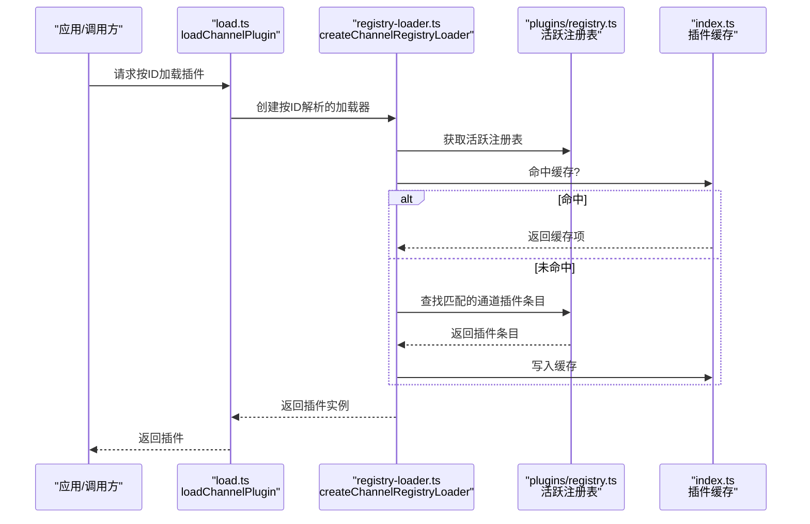

图表来源

- [src/channels/plugins/load.ts:1-9](file://src/channels/plugins/load.ts#L1-L9)
- [src/channels/plugins/registry-loader.ts:9-35](file://src/channels/plugins/registry-loader.ts#L9-L35)
- [src/channels/plugins/index.ts:42-72](file://src/channels/plugins/index.ts#L42-L72)
- [src/plugins/registry.ts:168-183](file://src/plugins/registry.ts#L168-L183)

## 详细组件分析

### 组件A：通道适配器接口族

通道适配器以“职责单一、可选实现”的方式定义能力边界，便于扩展与演进。关键接口包括：

- 设置适配器：账号解析、绑定、名称应用、输入校验与配置应用。
- 配置适配器：账户枚举、解析、启用/删除、可用性与未配置原因、快照描述、允许来源与默认目标解析。
- 群组适配器：提及要求、群组提示、工具策略解析。
- 出站适配器：直连/网关/混合投递模式、文本分块、目标解析、发送文本/媒体/Poll。
- 状态适配器：摘要构建、探针/审计、快照生成、状态计算、问题收集。
- 网关适配器：账号启动/停止、二维码登录开始/等待、登出。
- 认证适配器：登录。
- 心跳适配器：就绪检查、收件人解析。
- 目录适配器：自描述、列出用户/群组、实时列表、成员列表。
- 解析适配器：目标解析（用户/群组）。
- 安全适配器：DM策略解析、告警收集。

```mermaid
classDiagram
class ChannelSetupAdapter {
+resolveAccountId(params)
+resolveBindingAccountId(params)
+applyAccountName(params)
+applyAccountConfig(params)
+validateInput(params)
}
class ChannelConfigAdapter {
+listAccountIds(cfg)
+resolveAccount(cfg,accountId)
+isEnabled(account,cfg)
+isConfigured(account,cfg)
+describeAccount(account,cfg)
+resolveAllowFrom(cfg,accountId)
+resolveDefaultTo(cfg,accountId)
}
class ChannelOutboundAdapter {
+deliveryMode
+chunker
+chunkerMode
+textChunkLimit
+pollMaxOptions
+resolveTarget(params)
+sendPayload(ctx)
+sendText(ctx)
+sendMedia(ctx)
+sendPoll(ctx)
}
class ChannelStatusAdapter {
+buildChannelSummary(params)
+probeAccount(params)
+auditAccount(params)
+buildAccountSnapshot(params)
+logSelfId(params)
+resolveAccountState(params)
+collectStatusIssues(accounts)
}
class ChannelGatewayAdapter {
+startAccount(ctx)
+stopAccount(ctx)
+loginWithQrStart(params)
+loginWithQrWait(params)
+logoutAccount(ctx)
}
class ChannelAuthAdapter {
+login(params)
}
class ChannelHeartbeatAdapter {
+checkReady(params)
+resolveRecipients(params)
}
class ChannelDirectoryAdapter {
+self(params)
+listPeers(params)
+listPeersLive(params)
+listGroups(params)
+listGroupsLive(params)
+listGroupMembers(params)
}
class ChannelResolverAdapter {
+resolveTargets(params)
}
class ChannelSecurityAdapter {
+resolveDmPolicy(ctx)
+collectWarnings(ctx)
}
```

图表来源

- [src/channels/plugins/types.adapters.ts:24-384](file://src/channels/plugins/types.adapters.ts#L24-L384)

章节来源

- [src/channels/plugins/types.adapters.ts:24-384](file://src/channels/plugins/types.adapters.ts#L24-L384)

### 组件B：通道核心类型与上下文

核心类型定义了通道生态的数据契约，包括：

- ChannelId：核心通道ID集合与任意字符串扩展。
- 账户快照：连接状态、运行状态、错误、令牌来源、探测结果等。
- 能力集：聊天类型、轮询、回复、编辑、撤回、反应、群组管理、线程、媒体、原生命令、阻塞流式等。
- 线程化上下文：当前消息、回复模式、工具上下文等。
- 目录条目：用户/群组/频道的标识与显示信息。
- 消息动作：动作清单、按钮/卡片支持、工具发送提取、动作处理。
- 轮询上下文与结果：轮询输入、发送上下文、消息ID等。

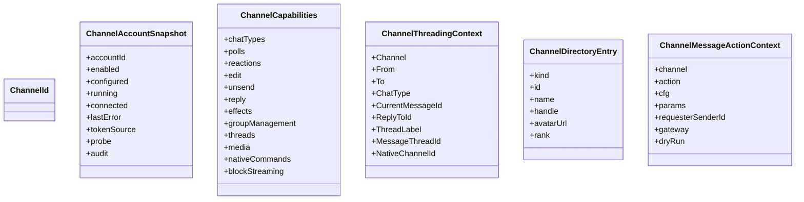

图表来源

- [src/channels/plugins/types.core.ts:11-403](file://src/channels/plugins/types.core.ts#L11-L403)

章节来源

- [src/channels/plugins/types.core.ts:11-403](file://src/channels/plugins/types.core.ts#L11-L403)

### 组件C：通道插件入口与缓存

- 列表与按ID获取：对注册表中的通道插件去重、排序（按预设顺序与元数据序号）、建立ID索引。
- ID标准化：优先使用核心通道顺序与别名，其次回退到已注册插件的ID与别名。
- 缓存策略：基于注册表版本的缓存失效与重建，避免重复遍历注册表。

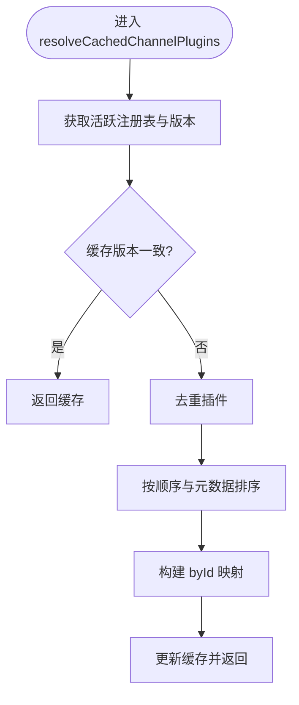

图表来源

- [src/channels/plugins/index.ts:42-72](file://src/channels/plugins/index.ts#L42-L72)

章节来源

- [src/channels/plugins/index.ts:14-90](file://src/channels/plugins/index.ts#L14-L90)

### 组件D：注册表加载器与插件加载

- 加载器：以工厂函数形式创建按ID解析的加载器，内部维护缓存与注册表版本。
- 插件加载：通过ID在注册表中查找条目，解析所需值（通常是插件对象），并写入缓存。

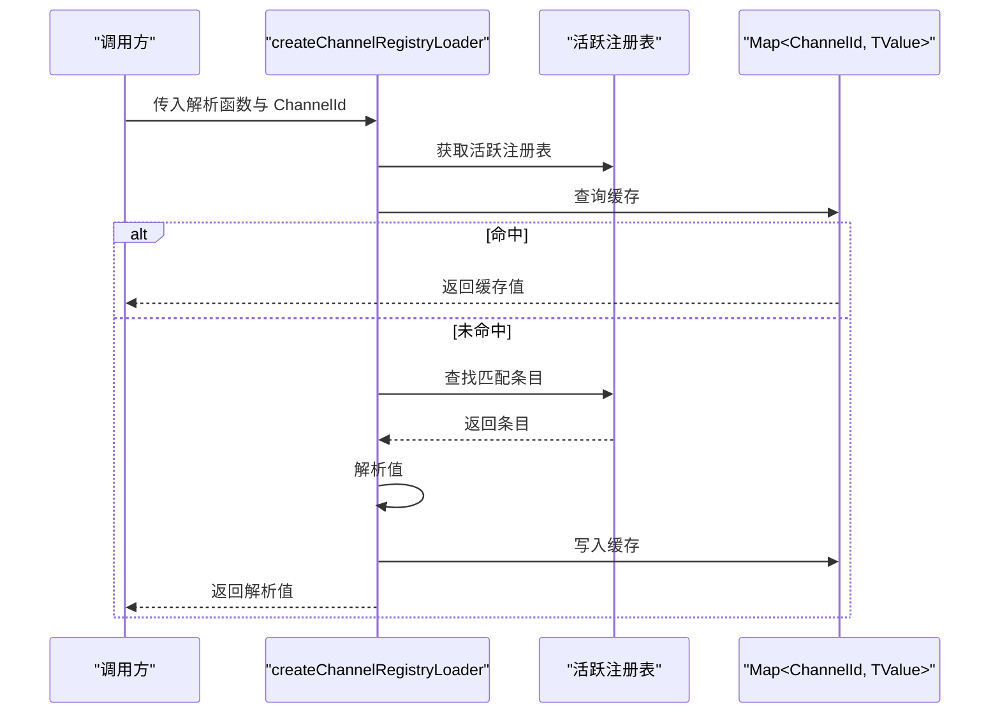

图表来源

- [src/channels/plugins/registry-loader.ts:9-35](file://src/channels/plugins/registry-loader.ts#L9-L35)
- [src/channels/plugins/load.ts:6-8](file://src/channels/plugins/load.ts#L6-L8)

章节来源

- [src/channels/plugins/registry-loader.ts:1-35](file://src/channels/plugins/registry-loader.ts#L1-L35)
- [src/channels/plugins/load.ts:1-9](file://src/channels/plugins/load.ts#L1-L9)

### 组件E：通道元数据管理与ID标准化

- 核心通道顺序：定义内置通道的优先级与展示顺序。
- 别名映射：提供常见别名到标准ID的映射。
- ID标准化：先尝试核心通道ID/别名，再回退到已注册插件的ID与别名，保证跨平台一致性。

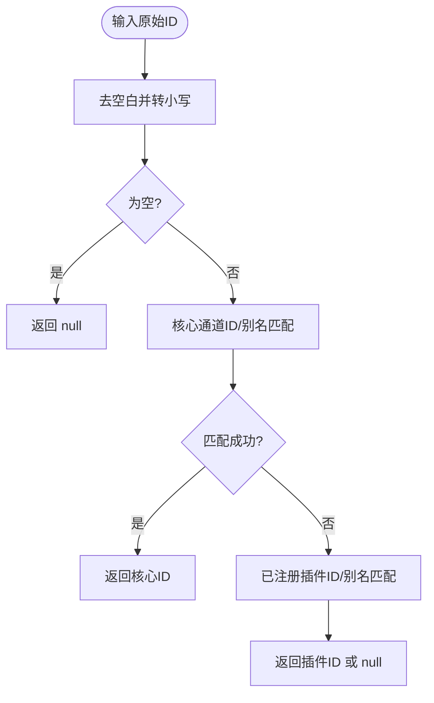

图表来源

- [src/channels/registry.ts:147-183](file://src/channels/registry.ts#L147-L183)

章节来源

- [src/channels/registry.ts:7-183](file://src/channels/registry.ts#L7-L183)

### 组件F：消息跨上下文适配器

- 默认适配器：不支持组件V2。
- Discord适配器：支持组件V2，提供跨上下文容器组件，用于在消息前添加来源标注与分隔符。
- 适配器选择：按通道ID返回对应适配器。

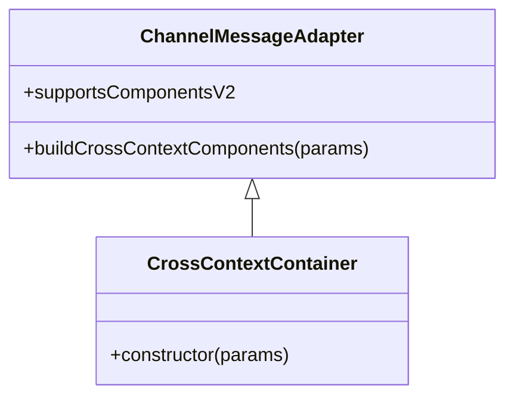

图表来源

- [src/infra/outbound/channel-adapters.ts:15-57](file://src/infra/outbound/channel-adapters.ts#L15-L57)

章节来源

- [src/infra/outbound/channel-adapters.ts:1-57](file://src/infra/outbound/channel-adapters.ts#L1-L57)

### 组件G：插件注册与通道注册

- 注册表结构：维护插件记录、工具、钩子、通道、提供者、HTTP路由、CLI命令、服务等。
- 通道注册：规范化插件ID，去空格与小写，校验非空；记录到注册表并登记到插件记录的通道ID列表。
- 诊断：当注册缺失ID时推送错误诊断，便于定位问题。

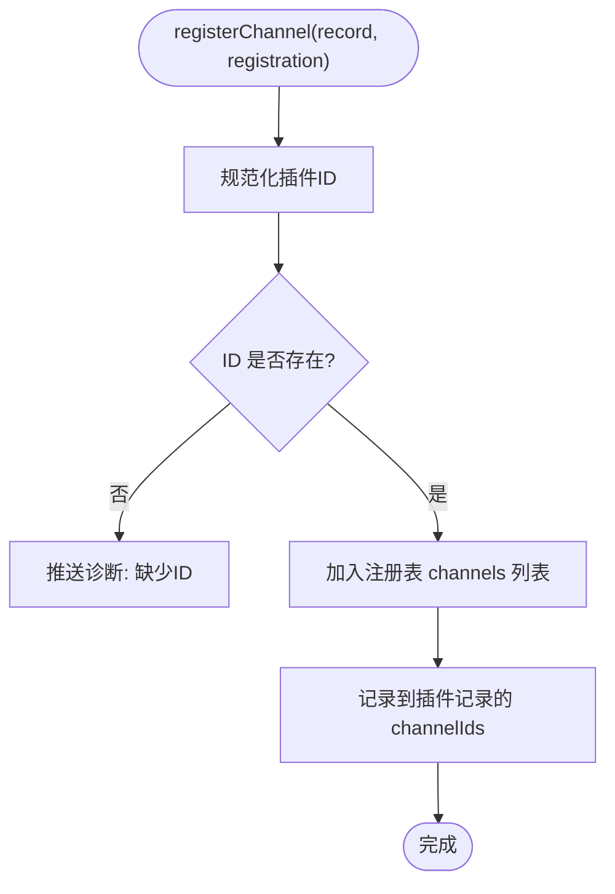

图表来源

- [src/plugins/registry.ts:402-428](file://src/plugins/registry.ts#L402-L428)

章节来源

- [src/plugins/registry.ts:1-200](file://src/plugins/registry.ts#L1-L200)
- [src/plugins/registry.ts:402-428](file://src/plugins/registry.ts#L402-L428)

### 组件H：示例插件（Discord/Telegram/WhatsApp）

- 插件清单：通过 openclaw.plugin.json 声明插件ID与支持的通道。
- 插件入口：在 index.ts 中调用 api.registerChannel 注册通道插件，并注入运行时。

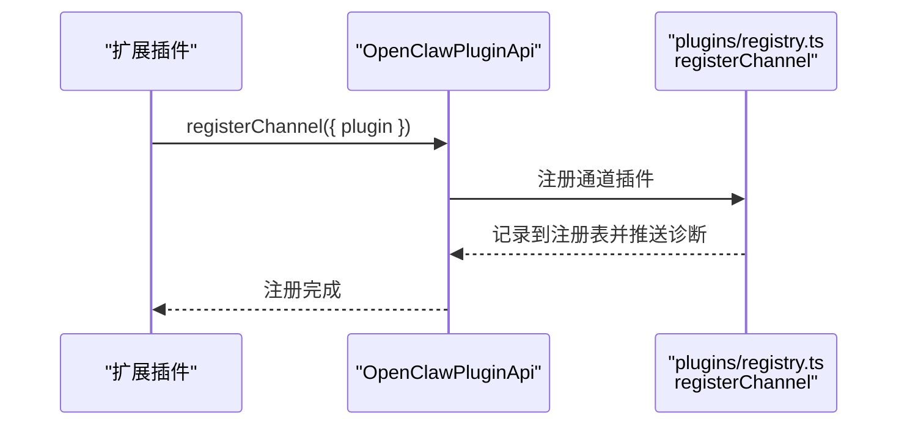

图表来源

- [extensions/discord/openclaw.plugin.json:1-10](file://extensions/discord/openclaw.plugin.json#L1-L10)
- [extensions/telegram/index.ts:11-14](file://extensions/telegram/index.ts#L11-L14)
- [extensions/whatsapp/index.ts:11-14](file://extensions/whatsapp/index.ts#L11-L14)
- [src/plugins/registry.ts:402-428](file://src/plugins/registry.ts#L402-L428)

章节来源

- [extensions/discord/openclaw.plugin.json:1-10](file://extensions/discord/openclaw.plugin.json#L1-L10)
- [extensions/telegram/index.ts:1-18](file://extensions/telegram/index.ts#L1-L18)
- [extensions/whatsapp/index.ts:1-18](file://extensions/whatsapp/index.ts#L1-L18)

## 依赖关系分析

- 低耦合高内聚：通道适配器接口彼此独立，插件仅实现所需能力；入口模块仅依赖注册表与缓存。
- 关键依赖链：
  - 通道插件入口依赖注册表与ID标准化。
  - 注册表加载器依赖活跃注册表与缓存。
  - 消息适配器依赖通道ID与UI组件库。
  - 示例插件依赖注册表的通道注册函数。

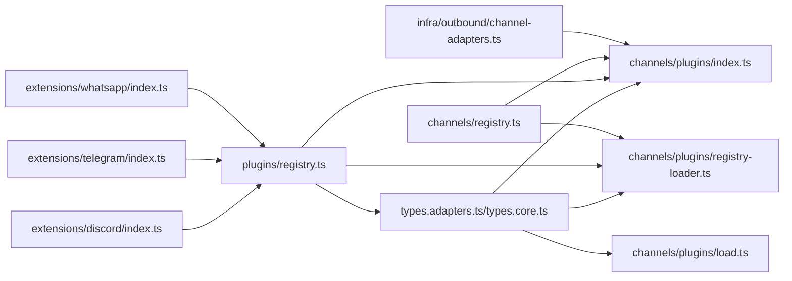

图表来源

- [src/channels/plugins/types.adapters.ts:1-384](file://src/channels/plugins/types.adapters.ts#L1-L384)
- [src/channels/plugins/types.core.ts:1-403](file://src/channels/plugins/types.core.ts#L1-L403)
- [src/channels/plugins/index.ts:1-118](file://src/channels/plugins/index.ts#L1-L118)
- [src/channels/plugins/load.ts:1-9](file://src/channels/plugins/load.ts#L1-L9)
- [src/channels/plugins/registry-loader.ts:1-35](file://src/channels/plugins/registry-loader.ts#L1-L35)
- [src/plugins/registry.ts:1-200](file://src/plugins/registry.ts#L1-L200)
- [src/channels/registry.ts:1-201](file://src/channels/registry.ts#L1-L201)
- [src/infra/outbound/channel-adapters.ts:1-57](file://src/infra/outbound/channel-adapters.ts#L1-L57)
- [extensions/discord/openclaw.plugin.json:1-10](file://extensions/discord/openclaw.plugin.json#L1-L10)
- [extensions/telegram/index.ts:1-18](file://extensions/telegram/index.ts#L1-L18)
- [extensions/whatsapp/index.ts:1-18](file://extensions/whatsapp/index.ts#L1-L18)

章节来源

- [src/channels/plugins/index.ts:1-118](file://src/channels/plugins/index.ts#L1-L118)
- [src/channels/plugins/registry-loader.ts:1-35](file://src/channels/plugins/registry-loader.ts#L1-L35)
- [src/plugins/registry.ts:1-200](file://src/plugins/registry.ts#L1-L200)

## 性能考量

- 缓存策略
  - 插件缓存：基于注册表版本的全局缓存，避免重复去重与排序。
  - 注册表加载器缓存：按ID缓存解析结果，减少重复查找。
- 规模优化
  - ID标准化与别名解析：先核心后扩展，减少遍历范围。
  - 适配器按需实现：仅在需要时实现对应接口，降低内存与初始化成本。
- 运行时开销
  - 消息跨上下文适配器：默认适配器零组件渲染，减少UI开销；特定通道按需启用组件V2。
- 可观测性
  - 状态适配器提供探针/审计与问题收集，便于定位性能瓶颈与异常。

[本节为通用性能建议，无需具体文件引用]

## 故障排查指南

- 注册缺失ID
  - 现象：注册通道时缺少ID，触发诊断。
  - 处理：确保插件ID非空且唯一，符合规范化规则。
  - 参考路径：[src/plugins/registry.ts:412-420](file://src/plugins/registry.ts#L412-L420)
- 插件未找到
  - 现象：按ID加载插件返回undefined。
  - 处理：确认插件是否已注册、ID是否正确、缓存是否过期。
  - 参考路径：[src/channels/plugins/load.ts:6-8](file://src/channels/plugins/load.ts#L6-L8)、[src/channels/plugins/registry-loader.ts:25-28](file://src/channels/plugins/registry-loader.ts#L25-L28)
- ID标准化失败
  - 现象：normalizeAnyChannelId返回null。
  - 处理：检查核心通道ID/别名与已注册插件ID/别名是否一致。
  - 参考路径：[src/channels/registry.ts:166-183](file://src/channels/registry.ts#L166-L183)
- 诊断收集
  - 使用注册表的诊断数组收集与输出错误信息，便于定位问题。
  - 参考路径：[src/plugins/registry.ts:189-191](file://src/plugins/registry.ts#L189-L191)

章节来源

- [src/plugins/registry.ts:412-420](file://src/plugins/registry.ts#L412-L420)
- [src/channels/plugins/load.ts:6-8](file://src/channels/plugins/load.ts#L6-L8)
- [src/channels/plugins/registry-loader.ts:25-28](file://src/channels/plugins/registry-loader.ts#L25-L28)
- [src/channels/registry.ts:166-183](file://src/channels/registry.ts#L166-L183)

## 结论

OpenClaw的核心通道适配器系统通过“统一类型接口 + 插件注册表 + 缓存入口”的设计，实现了高扩展性与强一致性。通道元数据与ID标准化保障了跨平台体验，适配器接口明确了能力边界，注册表与加载器提供了稳定的运行时支撑。遵循本文档的开发指南与最佳实践，可高效扩展新通道支持并保持系统的可维护性与性能。

[本节为总结性内容，无需具体文件引用]

## 附录

### 开发指南：扩展新通道支持

- 步骤一：准备插件清单
  - 在插件根目录创建 openclaw.plugin.json，声明插件ID与支持的通道列表。
  - 参考路径：[extensions/discord/openclaw.plugin.json:1-10](file://extensions/discord/openclaw.plugin.json#L1-L10)
- 步骤二：实现通道插件
  - 实现 ChannelPlugin 并至少实现必要适配器（如出站/状态/网关等）。
  - 参考路径：[src/channels/plugins/types.adapters.ts:24-384](file://src/channels/plugins/types.adapters.ts#L24-L384)
- 步骤三：注册通道
  - 在插件入口 index.ts 中调用 api.registerChannel 注册插件。
  - 参考路径：[extensions/telegram/index.ts:11-14](file://extensions/telegram/index.ts#L11-L14)、[extensions/whatsapp/index.ts:11-14](file://extensions/whatsapp/index.ts#L11-L14)
- 步骤四：配置与元数据
  - 提供 configSchema 与 meta（标签、文档路径、别名、顺序等）。
  - 参考路径：[src/channels/plugins/types.core.ts:76-95](file://src/channels/plugins/types.core.ts#L76-L95)、[src/channels/registry.ts:27-121](file://src/channels/registry.ts#L27-L121)
- 步骤五：ID标准化与别名
  - 如需别名，可在通道元数据中声明，或在ID标准化逻辑中补充。
  - 参考路径：[src/channels/registry.ts:123-183](file://src/channels/registry.ts#L123-L183)
- 步骤六：消息跨上下文适配
  - 如需组件V2，实现 buildCrossContextComponents 并在 getChannelMessageAdapter 中注册。
  - 参考路径：[src/infra/outbound/channel-adapters.ts:51-57](file://src/infra/outbound/channel-adapters.ts#L51-L57)
- 步骤七：测试与验证
  - 使用注册表加载器与插件入口进行端到端测试，验证ID解析、适配器可用性与状态快照。
  - 参考路径：[src/channels/plugins/load.ts:6-8](file://src/channels/plugins/load.ts#L6-L8)、[src/channels/plugins/registry-loader.ts:15-34](file://src/channels/plugins/registry-loader.ts#L15-L34)

章节来源

- [extensions/discord/openclaw.plugin.json:1-10](file://extensions/discord/openclaw.plugin.json#L1-L10)
- [extensions/telegram/index.ts:1-18](file://extensions/telegram/index.ts#L1-L18)
- [extensions/whatsapp/index.ts:1-18](file://extensions/whatsapp/index.ts#L1-L18)
- [src/channels/plugins/types.adapters.ts:24-384](file://src/channels/plugins/types.adapters.ts#L24-L384)
- [src/channels/plugins/types.core.ts:76-95](file://src/channels/plugins/types.core.ts#L76-L95)
- [src/channels/registry.ts:27-183](file://src/channels/registry.ts#L27-L183)
- [src/infra/outbound/channel-adapters.ts:51-57](file://src/infra/outbound/channel-adapters.ts#L51-L57)
- [src/channels/plugins/load.ts:6-8](file://src/channels/plugins/load.ts#L6-L8)
- [src/channels/plugins/registry-loader.ts:15-34](file://src/channels/plugins/registry-loader.ts#L15-L34)
