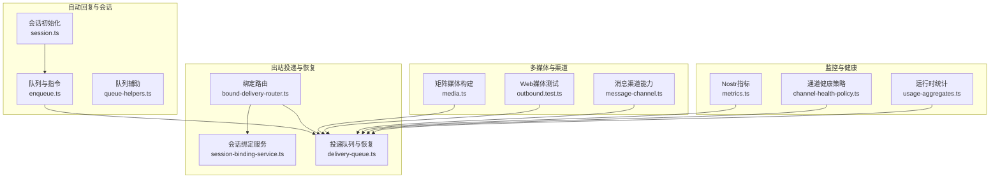
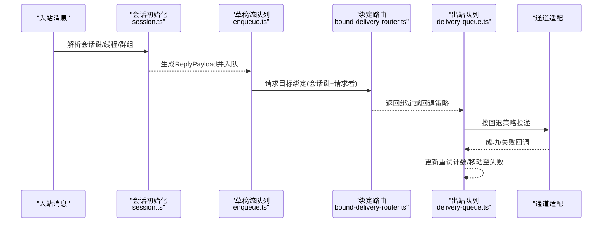
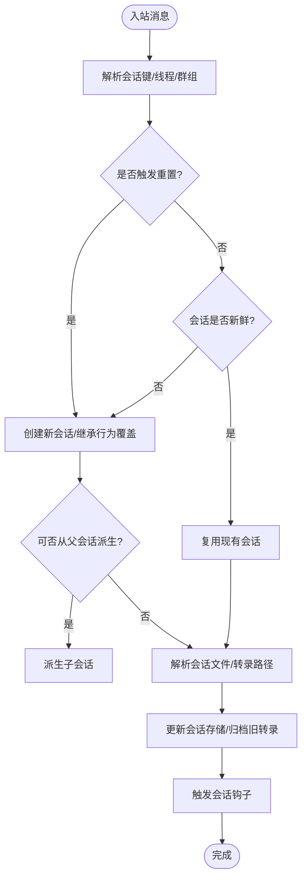
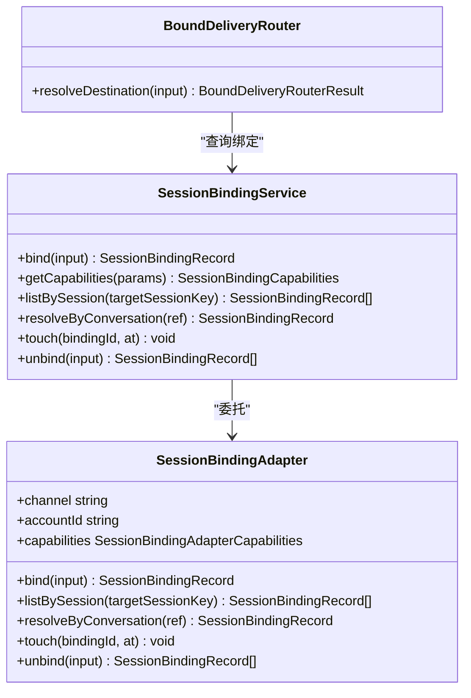
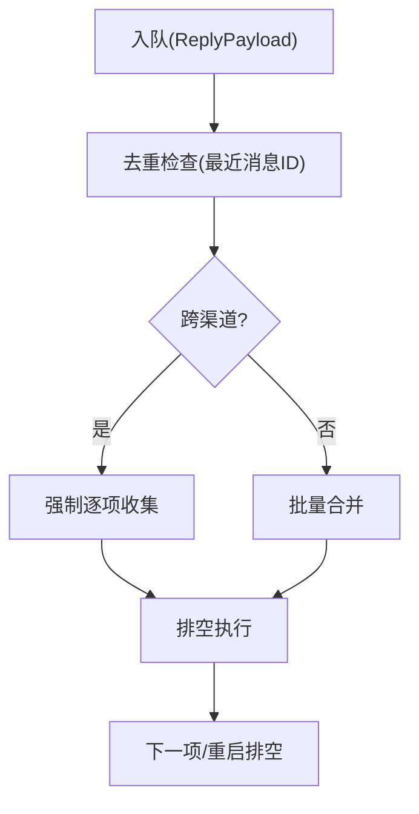
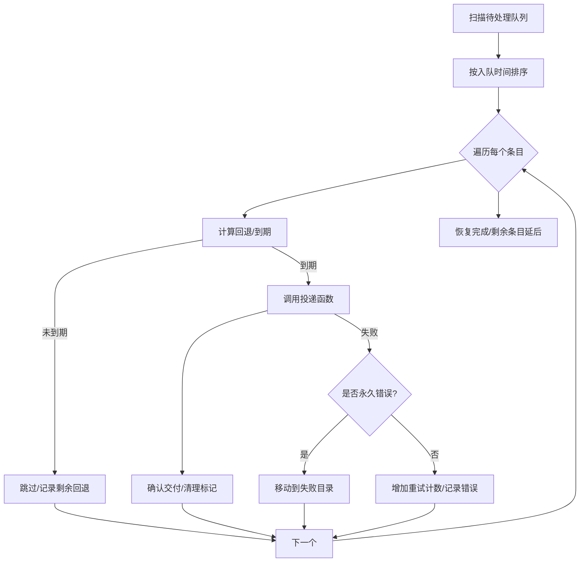
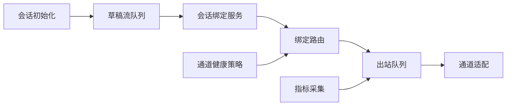

# 消息路由与处理

<cite>
**本文引用的文件**
- [bound-delivery-router.ts](file://src/infra/outbound/bound-delivery-router.ts)
- [delivery-queue.ts](file://src/infra/outbound/delivery-queue.ts)
- [session-binding-service.ts](file://src/infra/outbound/session-binding-service.ts)
- [session.ts](file://src/auto-reply/reply/session.ts)
- [types.ts](file://src/auto-reply/types.ts)
- [media.ts](file://extensions/matrix/src/matrix/send/media.ts)
- [outbound.test.ts](file://src/web/outbound.test.ts)
- [metrics.ts](file://extensions/nostr/src/metrics.ts)
- [channel-health-policy.ts](file://src/gateway/channel-health-policy.ts)
- [enqueue.ts](file://src/auto-reply/reply/queue/enqueue.ts)
- [queue-helpers.ts](file://src/utils/queue-helpers.ts)
- [message-channel.ts](file://src/utils/message-channel.ts)
- [run.ts](file://src/agents/pi-embedded-runner/run.ts)
- [usage-aggregates.ts](file://src/shared/usage-aggregates.ts)
</cite>

## 目录

1. [引言](#引言)
2. [项目结构](#项目结构)
3. [核心组件](#核心组件)
4. [架构总览](#架构总览)
5. [详细组件分析](#详细组件分析)
6. [依赖关系分析](#依赖关系分析)
7. [性能考量](#性能考量)
8. [故障排查指南](#故障排查指南)
9. [结论](#结论)
10. [附录](#附录)

## 引言

本文件面向OpenClaw的消息路由与处理系统，聚焦以下关键能力：消息会话封装、线程绑定、草稿流（队列）处理、自动回复机制、消息路由算法与优先级、批量处理与错误重试策略、消息生命周期管理与状态跟踪、性能监控、消息格式标准化与多媒体内容处理、跨平台兼容性方案，并给出优化吞吐量、降低延迟与提升可靠性的实践建议。

## 项目结构

OpenClaw采用分层与模块化设计：

- 自动回复与会话：负责消息进入后的会话初始化、上下文构建、草稿流队列与指令解析。
- 出站投递与恢复：负责消息持久化、出站队列、回退重试、失败转移与恢复扫描。
- 会话绑定服务：抽象通道账户到会话的绑定关系，支持多适配器注册与查询。
- 多媒体与渠道适配：针对不同渠道（如Matrix）进行媒体内容标准化与格式转换。
- 性能与健康度：通过指标采集、健康评估与运行时统计，保障系统可观测性与稳定性。

图表来源

- [session.ts:190-642](file://src/auto-reply/reply/session.ts#L190-L642)
- [enqueue.ts:85-108](file://src/auto-reply/reply/queue/enqueue.ts#L85-L108)
- [queue-helpers.ts:135-175](file://src/utils/queue-helpers.ts#L135-L175)
- [bound-delivery-router.ts:55-132](file://src/infra/outbound/bound-delivery-router.ts#L55-L132)
- [session-binding-service.ts:198-310](file://src/infra/outbound/session-binding-service.ts#L198-L310)
- [delivery-queue.ts:109-440](file://src/infra/outbound/delivery-queue.ts#L109-L440)
- [media.ts:22-108](file://extensions/matrix/src/matrix/send/media.ts#L22-L108)
- [outbound.test.ts:64-112](file://src/web/outbound.test.ts#L64-L112)
- [metrics.ts:378-424](file://extensions/nostr/src/metrics.ts#L378-L424)
- [channel-health-policy.ts:112-148](file://src/gateway/channel-health-policy.ts#L112-L148)
- [usage-aggregates.ts:32-66](file://src/shared/usage-aggregates.ts#L32-L66)

章节来源

- [session.ts:190-642](file://src/auto-reply/reply/session.ts#L190-L642)
- [delivery-queue.ts:109-440](file://src/infra/outbound/delivery-queue.ts#L109-L440)
- [bound-delivery-router.ts:55-132](file://src/infra/outbound/bound-delivery-router.ts#L55-L132)
- [session-binding-service.ts:198-310](file://src/infra/outbound/session-binding-service.ts#L198-L310)
- [media.ts:22-108](file://extensions/matrix/src/matrix/send/media.ts#L22-L108)
- [outbound.test.ts:64-112](file://src/web/outbound.test.ts#L64-L112)
- [metrics.ts:378-424](file://extensions/nostr/src/metrics.ts#L378-L424)
- [channel-health-policy.ts:112-148](file://src/gateway/channel-health-policy.ts#L112-L148)
- [enqueue.ts:85-108](file://src/auto-reply/reply/queue/enqueue.ts#L85-L108)
- [queue-helpers.ts:135-175](file://src/utils/queue-helpers.ts#L135-L175)
- [message-channel.ts:135-148](file://src/utils/message-channel.ts#L135-L148)
- [usage-aggregates.ts:32-66](file://src/shared/usage-aggregates.ts#L32-L66)

## 核心组件

- 会话初始化与上下文：负责消息进入后的会话键解析、重置策略、线程/群组识别、父会话派生、会话文件持久化与钩子触发。
- 绑定路由与会话绑定：根据目标会话与请求者身份，选择最佳绑定或回退策略；支持多适配器注册与能力查询。
- 出站队列与恢复：基于磁盘的可靠队列，带指数回退、最大重试次数、失败转移与启动恢复扫描。
- 草稿流与批量处理：按会话键聚合消息，支持去重、限流、批量合并与跨渠道收集。
- 自动回复类型与负载：统一ReplyPayload结构，承载文本、媒体、回复引用、错误标记等；支持通道特定扩展数据。
- 多媒体内容处理：对图片、视频、音频等进行尺寸、时长、MIME类型与加密信息标准化。
- 健康度与性能监控：通道健康评估、运行时统计聚合、指标快照与重置。

章节来源

- [session.ts:190-642](file://src/auto-reply/reply/session.ts#L190-L642)
- [bound-delivery-router.ts:55-132](file://src/infra/outbound/bound-delivery-router.ts#L55-L132)
- [session-binding-service.ts:198-310](file://src/infra/outbound/session-binding-service.ts#L198-L310)
- [delivery-queue.ts:109-440](file://src/infra/outbound/delivery-queue.ts#L109-L440)
- [enqueue.ts:85-108](file://src/auto-reply/reply/queue/enqueue.ts#L85-L108)
- [types.ts:71-88](file://src/auto-reply/types.ts#L71-L88)
- [media.ts:22-108](file://extensions/matrix/src/matrix/send/media.ts#L22-L108)
- [metrics.ts:378-424](file://extensions/nostr/src/metrics.ts#L378-L424)
- [channel-health-policy.ts:112-148](file://src/gateway/channel-health-policy.ts#L112-L148)

## 架构总览

消息从入站到出站的关键流程如下：

- 入站消息经会话初始化，生成会话上下文与会话条目。
- 自动回复引擎根据上下文生成ReplyPayload，进入草稿流队列。
- 绑定路由根据会话绑定与请求者身份解析目标通道账户。
- 出站队列将负载持久化并按回退策略重试，直至成功或移入失败目录。
- 健康策略与指标监控贯穿全链路，保障稳定与可观测。

图表来源

- [session.ts:190-642](file://src/auto-reply/reply/session.ts#L190-L642)
- [enqueue.ts:85-108](file://src/auto-reply/reply/queue/enqueue.ts#L85-L108)
- [bound-delivery-router.ts:55-132](file://src/infra/outbound/bound-delivery-router.ts#L55-L132)
- [delivery-queue.ts:323-421](file://src/infra/outbound/delivery-queue.ts#L323-L421)

## 详细组件分析

### 会话封装与生命周期

- 会话键解析与派生：支持按发送者、群组、线程等维度生成主键，避免重复会话。
- 重置策略：支持“/new”、“/reset”等触发词，结合通道配置与ACB绑定上下文决定是否就地重置。
- 父会话派生：当父会话上下文过大时，避免过早溢出，直接创建新会话。
- 文件与转录：会话文件与转录路径解析与持久化，支持重置后归档旧转录。
- 钩子事件：会话开始/结束钩子异步触发，便于外部扩展。

图表来源

- [session.ts:190-642](file://src/auto-reply/reply/session.ts#L190-L642)

章节来源

- [session.ts:190-642](file://src/auto-reply/reply/session.ts#L190-L642)

### 线程绑定与会话绑定服务

- 绑定记录：包含绑定ID、目标会话键、目标类型（会话/子代理）、对话引用、状态、过期时间与元数据。
- 适配器注册：按“通道:账号”注册适配器，支持能力查询与绑定/解绑操作。
- 路由决策：根据请求者身份与活动绑定列表，优先精确匹配，否则在无请求者时单绑定回退，否则回退。

图表来源

- [session-binding-service.ts:70-310](file://src/infra/outbound/session-binding-service.ts#L70-L310)
- [bound-delivery-router.ts:21-132](file://src/infra/outbound/bound-delivery-router.ts#L21-L132)

章节来源

- [session-binding-service.ts:70-310](file://src/infra/outbound/session-binding-service.ts#L70-L310)
- [bound-delivery-router.ts:55-132](file://src/infra/outbound/bound-delivery-router.ts#L55-L132)

### 草稿流与批量处理

- 入队与去重：按会话键聚合，使用最近消息ID去重集合避免重复处理。
- 批量与跨渠道：跨渠道场景强制逐项收集，保证顺序一致性；非跨渠道可批量合并。
- 队列深度与后续调度：提供队列深度查询与空闲时重启排空逻辑。

图表来源

- [enqueue.ts:85-108](file://src/auto-reply/reply/queue/enqueue.ts#L85-L108)
- [queue-helpers.ts:135-175](file://src/utils/queue-helpers.ts#L135-L175)

章节来源

- [enqueue.ts:85-108](file://src/auto-reply/reply/queue/enqueue.ts#L85-L108)
- [queue-helpers.ts:135-175](file://src/utils/queue-helpers.ts#L135-L175)

### 自动回复与负载模型

- ReplyPayload：统一承载文本、媒体URL、回复引用、错误标记、通道扩展数据等字段。
- 类型选项：支持超时、思维/推理块回调、打字指示控制、心跳模型覆盖等。

章节来源

- [types.ts:71-88](file://src/auto-reply/types.ts#L71-L88)

### 多媒体内容处理与跨平台兼容

- 矩阵媒体构建：根据尺寸、时长、MIME类型与缩略图信息构建媒体内容；支持加密文件与语音消息标记。
- Web端媒体映射：根据扩展名与内容类型映射（如Ogg→Opus MIME），视频与GIF播放标记。
- 渠道能力：判断Markdown可用性等，确保消息格式与渠道能力匹配。

章节来源

- [media.ts:22-108](file://extensions/matrix/src/matrix/send/media.ts#L22-L108)
- [outbound.test.ts:64-112](file://src/web/outbound.test.ts#L64-L112)
- [message-channel.ts:135-148](file://src/utils/message-channel.ts#L135-L148)

### 消息路由算法与优先级

- 绑定路由：优先精确匹配请求者与会话绑定；单绑定且允许回退时走回退；否则回退。
- 会话绑定：按“当前/子”放置策略与适配器能力决定绑定位置与可行性。
- 通道健康：基于连接状态、事件时间与重启原因评估通道健康，指导重连策略。

章节来源

- [bound-delivery-router.ts:55-132](file://src/infra/outbound/bound-delivery-router.ts#L55-L132)
- [session-binding-service.ts:198-310](file://src/infra/outbound/session-binding-service.ts#L198-L310)
- [channel-health-policy.ts:112-148](file://src/gateway/channel-health-policy.ts#L112-L148)

### 错误重试策略与恢复

- 回退策略：基于重试次数的指数回退（固定间隔数组），首次崩溃重放或存在上次尝试时间点作为基线。
- 最大重试：超过阈值后移动到失败目录，永久错误模式直接迁移。
- 启动恢复：启动时扫描队列，按到期时间与回退策略重试，超时预算内尽可能恢复。

图表来源

- [delivery-queue.ts:323-421](file://src/infra/outbound/delivery-queue.ts#L323-L421)
- [delivery-queue.ts:244-276](file://src/infra/outbound/delivery-queue.ts#L244-L276)
- [delivery-queue.ts:425-440](file://src/infra/outbound/delivery-queue.ts#L425-L440)

章节来源

- [delivery-queue.ts:244-440](file://src/infra/outbound/delivery-queue.ts#L244-L440)

### 性能监控与健康度

- 指标采集：事件接收/处理/重复/拒绝、中继统计、速率限制命中、解密结果、内存占用等。
- 快照与重置：提供快照获取与重置接口，便于周期性导出与清零。
- 通道健康：基于最后事件时间与生命周期事件间隙评估“陈旧套接字”，决定重启原因。

章节来源

- [metrics.ts:378-424](file://extensions/nostr/src/metrics.ts#L378-L424)
- [channel-health-policy.ts:112-148](file://src/gateway/channel-health-policy.ts#L112-L148)

## 依赖关系分析

- 低耦合高内聚：会话初始化与草稿流独立于出站投递；绑定路由仅依赖会话绑定服务。
- 可插拔适配器：会话绑定服务通过适配器注册机制支持多通道账户绑定。
- 数据一致性：出站队列通过两阶段标记文件确保崩溃不重放；失败目录隔离不可恢复错误。
- 可观测性：健康策略与指标采集贯穿系统，便于定位瓶颈与异常。

图表来源

- [session.ts:190-642](file://src/auto-reply/reply/session.ts#L190-L642)
- [enqueue.ts:85-108](file://src/auto-reply/reply/queue/enqueue.ts#L85-L108)
- [session-binding-service.ts:198-310](file://src/infra/outbound/session-binding-service.ts#L198-L310)
- [bound-delivery-router.ts:55-132](file://src/infra/outbound/bound-delivery-router.ts#L55-L132)
- [delivery-queue.ts:109-440](file://src/infra/outbound/delivery-queue.ts#L109-L440)
- [metrics.ts:378-424](file://extensions/nostr/src/metrics.ts#L378-L424)
- [channel-health-policy.ts:112-148](file://src/gateway/channel-health-policy.ts#L112-L148)

章节来源

- [session.ts:190-642](file://src/auto-reply/reply/session.ts#L190-L642)
- [enqueue.ts:85-108](file://src/auto-reply/reply/queue/enqueue.ts#L85-L108)
- [session-binding-service.ts:198-310](file://src/infra/outbound/session-binding-service.ts#L198-L310)
- [bound-delivery-router.ts:55-132](file://src/infra/outbound/bound-delivery-router.ts#L55-L132)
- [delivery-queue.ts:109-440](file://src/infra/outbound/delivery-queue.ts#L109-L440)
- [metrics.ts:378-424](file://extensions/nostr/src/metrics.ts#L378-L424)
- [channel-health-policy.ts:112-148](file://src/gateway/channel-health-policy.ts#L112-L148)

## 性能考量

- 吞吐优化
  - 批量合并：非跨渠道场景合并多个负载，减少通道往返。
  - 去重与限流：利用最近消息ID去重集合，避免重复处理。
  - 并发与排队：队列辅助函数支持逐项收集与排空，平衡吞吐与一致性。
- 延迟降低
  - 回退策略：指数回退避免瞬时风暴，同时首播快速重试。
  - 启动恢复预算：限定恢复扫描时间预算，尽快释放资源。
- 可靠性增强
  - 两阶段交付标记：崩溃不重放，失败目录隔离。
  - 永久错误识别：正则匹配常见不可恢复错误，直接迁移。
  - 健康评估：通道陈旧事件检测与重启原因判定，主动恢复。

章节来源

- [enqueue.ts:85-108](file://src/auto-reply/reply/queue/enqueue.ts#L85-L108)
- [queue-helpers.ts:135-175](file://src/utils/queue-helpers.ts#L135-L175)
- [delivery-queue.ts:244-440](file://src/infra/outbound/delivery-queue.ts#L244-L440)
- [channel-health-policy.ts:112-148](file://src/gateway/channel-health-policy.ts#L112-L148)

## 故障排查指南

- 出站失败
  - 检查失败目录中的条目，确认错误信息与永久错误模式匹配。
  - 观察回退剩余时间，确认是否因回退未到期而延迟重试。
- 绑定问题
  - 使用绑定路由结果中的模式与原因定位：单绑定、请求者匹配、回退等。
  - 查询会话绑定服务的能力与已注册适配器，确认通道账户是否可用。
- 健康问题
  - 查看通道健康评估结果与重启原因，结合最后事件时间与生命周期事件间隙判断。
- 指标异常
  - 获取指标快照，关注速率限制命中、解密失败、内存占用等关键指标。

章节来源

- [delivery-queue.ts:425-440](file://src/infra/outbound/delivery-queue.ts#L425-L440)
- [bound-delivery-router.ts:55-132](file://src/infra/outbound/bound-delivery-router.ts#L55-L132)
- [session-binding-service.ts:198-310](file://src/infra/outbound/session-binding-service.ts#L198-L310)
- [metrics.ts:378-424](file://extensions/nostr/src/metrics.ts#L378-L424)
- [channel-health-policy.ts:112-148](file://src/gateway/channel-health-policy.ts#L112-L148)

## 结论

OpenClaw的消息路由与处理系统以“会话为中心”的设计，结合可靠的出站队列、灵活的绑定路由与完善的健康监控，实现了高吞吐、低延迟与强可靠性的消息处理闭环。通过草稿流批量合并、指数回退与失败隔离、以及跨渠道多媒体标准化，系统在多平台环境下具备良好的兼容性与可维护性。建议在生产环境中配合健康策略与指标监控持续优化，以获得更稳定的性能表现。

## 附录

- 运行时统计聚合：提供延迟与用量的合并与日级聚合，便于趋势分析与容量规划。
- 运行时重试上限：嵌入式运行器对重试迭代次数进行防御性上限控制，避免无限重试。

章节来源

- [usage-aggregates.ts:32-66](file://src/shared/usage-aggregates.ts#L32-L66)
- [run.ts:121-155](file://src/agents/pi-embedded-runner/run.ts#L121-L155)
