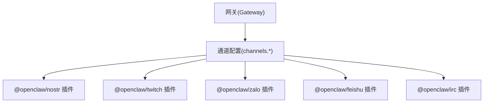
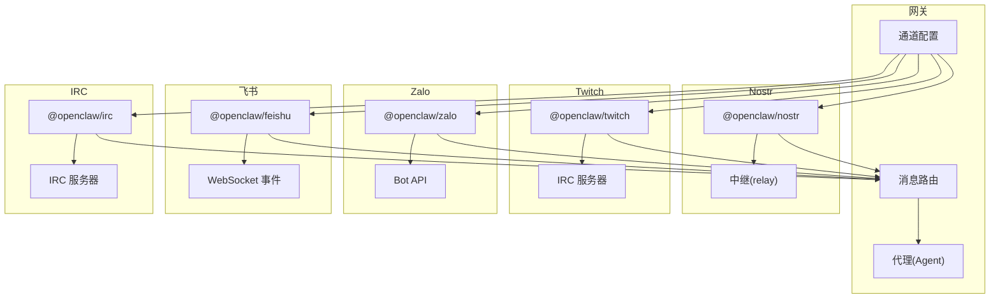
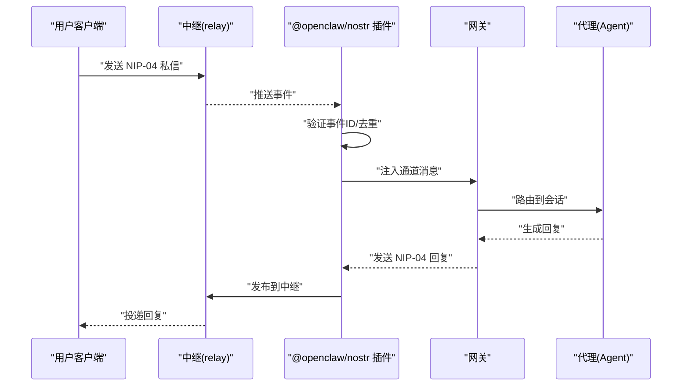
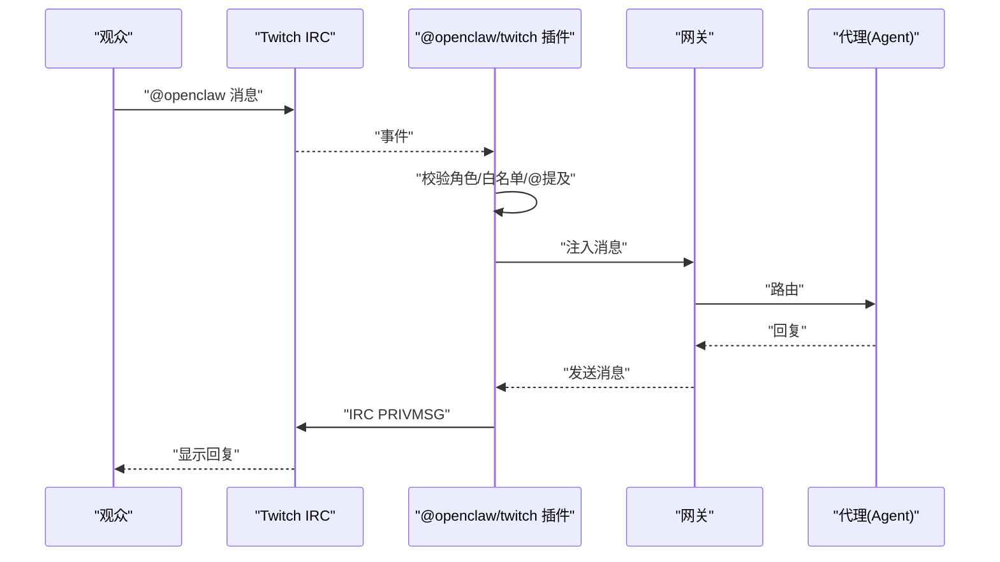
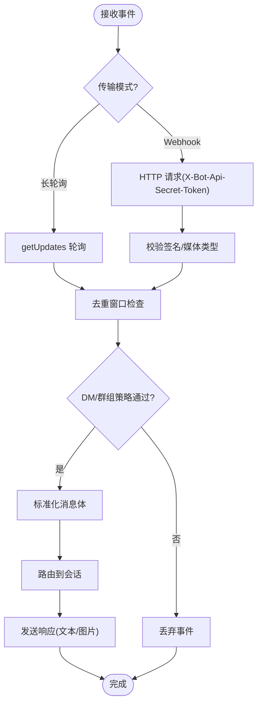
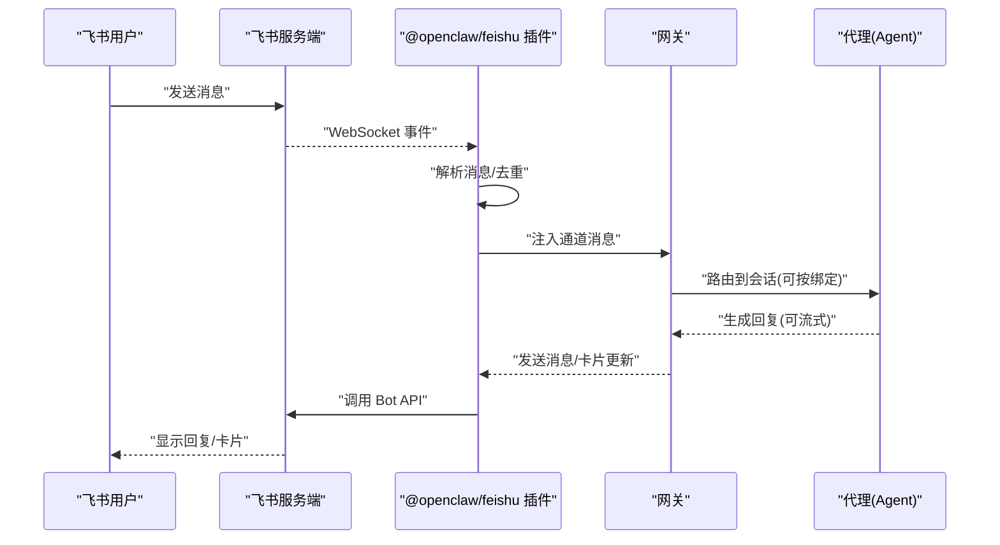
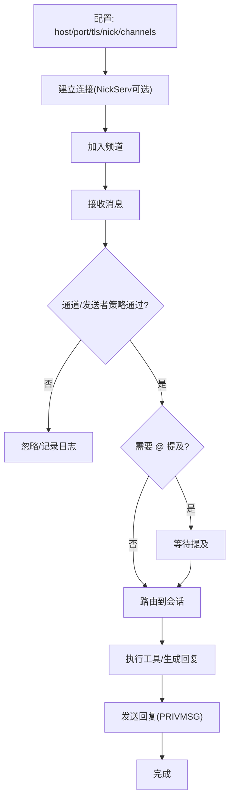
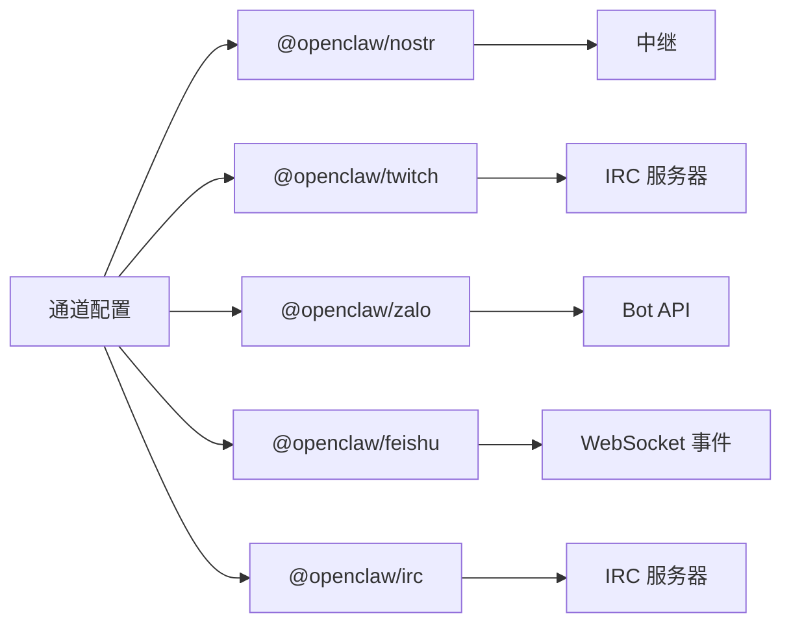

# 社交新兴平台

<cite>
**本文引用的文件**
- [docs/channels/nostr.md](file://docs/channels/nostr.md)
- [docs/channels/twitch.md](file://docs/channels/twitch.md)
- [docs/channels/zalo.md](file://docs/channels/zalo.md)
- [docs/channels/feishu.md](file://docs/channels/feishu.md)
- [docs/channels/irc.md](file://docs/channels/irc.md)
- [extensions/nostr/src/index.ts](file://extensions/nostr/src/index.ts)
- [extensions/twitch/src/index.ts](file://extensions/twitch/src/index.ts)
- [extensions/zalo/src/index.ts](file://extensions/zalo/src/index.ts)
- [extensions/feishu/src/index.ts](file://extensions/feishu/src/index.ts)
- [extensions/irc/src/index.ts](file://extensions/irc/src/index.ts)
- [extensions/nostr/src/nostr.ts](file://extensions/nostr/src/nostr.ts)
- [extensions/twitch/src/twitch.ts](file://extensions/twitch/src/twitch.ts)
- [extensions/zalo/src/zalo.ts](file://extensions/zalo/src/zalo.ts)
- [extensions/feishu/src/feishu.ts](file://extensions/feishu/src/feishu.ts)
- [extensions/irc/src/irc.ts](file://extensions/irc/src/irc.ts)
</cite>

## 目录

1. [简介](#简介)
2. [项目结构](#项目结构)
3. [核心组件](#核心组件)
4. [架构总览](#架构总览)
5. [详细组件分析](#详细组件分析)
6. [依赖关系分析](#依赖关系分析)
7. [性能考量](#性能考量)
8. [故障排查指南](#故障排查指南)
9. [结论](#结论)
10. [附录](#附录)

## 简介

本技术文档聚焦于 OpenClaw 支持的社交与新兴平台：Nostr（去中心化协议）、Twitch（直播聊天）、Zalo（东南亚即时通讯）、飞书（企业协作）、IRC（经典网络协议）。文档从架构、数据流、认证与访问控制、消息格式与平台 API 使用、实时性与并发处理、差异化需求与限制等方面进行系统化说明，并结合各平台特性给出实践建议与扩展方向。

## 项目结构

OpenClaw 将各平台作为独立插件实现，统一通过通道配置与网关路由接入。核心结构包括：

- 文档层：各平台独立的用户文档，覆盖安装、配置、认证、限流与排障。
- 插件层：各平台插件源码，包含连接建立、消息编解码、事件订阅、工具调用等。
- 配置层：统一的通道配置键值，支持多账户、策略与传输模式切换。

图表来源

- [docs/channels/nostr.md:1-234](file://docs/channels/nostr.md#L1-L234)
- [docs/channels/twitch.md:1-380](file://docs/channels/twitch.md#L1-L380)
- [docs/channels/zalo.md:1-207](file://docs/channels/zalo.md#L1-L207)
- [docs/channels/feishu.md:1-652](file://docs/channels/feishu.md#L1-L652)
- [docs/channels/irc.md:1-242](file://docs/channels/irc.md#L1-L242)

章节来源

- [docs/channels/nostr.md:1-234](file://docs/channels/nostr.md#L1-L234)
- [docs/channels/twitch.md:1-380](file://docs/channels/twitch.md#L1-L380)
- [docs/channels/zalo.md:1-207](file://docs/channels/zalo.md#L1-L207)
- [docs/channels/feishu.md:1-652](file://docs/channels/feishu.md#L1-L652)
- [docs/channels/irc.md:1-242](file://docs/channels/irc.md#L1-L242)

## 核心组件

- 通道配置键值：各平台在 channels.\* 下定义启用开关、凭证、策略、传输模式等。
- 认证与令牌：Nostr 私钥/公钥；Twitch OAuth；Zalo Bot Token；飞书 App ID/Secret；IRC 密码/NickServ。
- 访问控制：DM 策略（配对/白名单/开放/禁用）与群组策略（开放/白名单/禁用），以及提及触发规则。
- 实时性与并发：WebSocket/长连接、轮询、事件去重、速率限制与重试。
- 工具调用：平台特定的发送动作（如 Twitch 发送消息、Zalo 发送图片等）。

章节来源

- [docs/channels/nostr.md:72-175](file://docs/channels/nostr.md#L72-L175)
- [docs/channels/twitch.md:287-380](file://docs/channels/twitch.md#L287-L380)
- [docs/channels/zalo.md:174-207](file://docs/channels/zalo.md#L174-L207)
- [docs/channels/feishu.md:590-652](file://docs/channels/feishu.md#L590-L652)
- [docs/channels/irc.md:46-186](file://docs/channels/irc.md#L46-L186)

## 架构总览

下图展示 OpenClaw 与各平台的交互关系：网关根据通道配置加载对应插件，插件负责与平台 API/协议交互，接收消息后进入统一的消息处理流程，再按会话与工具策略执行响应。

图表来源

- [docs/channels/nostr.md:13-175](file://docs/channels/nostr.md#L13-L175)
- [docs/channels/twitch.md:10-380](file://docs/channels/twitch.md#L10-L380)
- [docs/channels/zalo.md:46-207](file://docs/channels/zalo.md#L46-L207)
- [docs/channels/feishu.md:9-652](file://docs/channels/feishu.md#L9-L652)
- [docs/channels/irc.md:10-242](file://docs/channels/irc.md#L10-L242)

## 详细组件分析

### Nostr（去中心化协议）

- 协议与特性
  - 基于中继的去中心化通信，支持 NIP-01（资料）、NIP-04（加密私信）。
  - 默认使用多个中继提升冗余，支持本地中继测试。
- 认证与密钥
  - 支持 nsec 私钥或 64 字十六进制私钥；公钥可由私钥派生。
- 访问控制
  - DM 策略：配对（默认）、白名单、开放、禁用；白名单可指定公钥列表。
- 消息格式与实时性
  - 私信采用 NIP-04 加密；事件去重基于事件 ID。
- 平台限制（MVP）
  - 仅支持私信，不支持群聊与媒体附件；计划支持 NIP-17 与 NIP-44。

图表来源

- [docs/channels/nostr.md:13-175](file://docs/channels/nostr.md#L13-L175)
- [extensions/nostr/src/nostr.ts](file://extensions/nostr/src/nostr.ts)

章节来源

- [docs/channels/nostr.md:1-234](file://docs/channels/nostr.md#L1-L234)
- [extensions/nostr/src/index.ts](file://extensions/nostr/src/index.ts)
- [extensions/nostr/src/nostr.ts](file://extensions/nostr/src/nostr.ts)

### Twitch（直播聊天）

- 连接与认证
  - 通过 IRC 连接至 Twitch 服务器；使用 OAuth Bot Token 与 Client ID。
  - 支持自动令牌刷新（需 Client Secret 与 Refresh Token）。
- 访问控制
  - DM/群组均支持策略：配对、白名单、开放、禁用；默认需要 @ 提及。
  - 推荐使用永久用户 ID（而非用户名）作为白名单。
- 消息与工具
  - 发送消息使用平台动作；消息长度限制约 500 字符，自动按词边界分片。
- 并发与限流
  - 使用平台内置限流；插件侧无额外速率限制。

图表来源

- [docs/channels/twitch.md:10-380](file://docs/channels/twitch.md#L10-L380)
- [extensions/twitch/src/twitch.ts](file://extensions/twitch/src/twitch.ts)

章节来源

- [docs/channels/twitch.md:1-380](file://docs/channels/twitch.md#L1-L380)
- [extensions/twitch/src/index.ts](file://extensions/twitch/src/index.ts)
- [extensions/twitch/src/twitch.ts](file://extensions/twitch/src/twitch.ts)

### Zalo（企业/个人通讯）

- 连接与认证
  - Bot API 令牌；支持长轮询与 Webhook（HTTPS、签名头）。
- 访问控制
  - DM 默认配对策略；群组默认“白名单”，可按群与发送者分别控制。
- 消息与媒体
  - 文本上限约 2000 字；图片下载/上传大小限制可配置；默认禁用流式输出。
- 并发与限流
  - Webhook 受平台限流保护；重复事件按事件名+消息 ID 去重。

图表来源

- [docs/channels/zalo.md:120-133](file://docs/channels/zalo.md#L120-L133)
- [extensions/zalo/src/zalo.ts](file://extensions/zalo/src/zalo.ts)

章节来源

- [docs/channels/zalo.md:1-207](file://docs/channels/zalo.md#L1-L207)
- [extensions/zalo/src/index.ts](file://extensions/zalo/src/index.ts)
- [extensions/zalo/src/zalo.ts](file://extensions/zalo/src/zalo.ts)

### 飞书（企业协作）

- 连接与认证
  - 企业应用 App ID/Secret；支持 WebSocket 事件长连接与 Webhook（可选）。
  - 支持 Lark（国际版）域名切换。
- 访问控制
  - DM 默认配对；群组策略可设为开放/白名单/禁用；默认需要 @ 提及。
- 消息与能力
  - 支持文本、富文本、图片、文件、音频、视频、贴纸；发送富文本部分支持。
  - 流式输出通过交互卡片实现，可配置块级流式。
- 多账号与路由
  - 支持多账号与绑定路由到不同代理，按用户/群隔离会话。

图表来源

- [docs/channels/feishu.md:9-652](file://docs/channels/feishu.md#L9-L652)
- [extensions/feishu/src/feishu.ts](file://extensions/feishu/src/feishu.ts)

章节来源

- [docs/channels/feishu.md:1-652](file://docs/channels/feishu.md#L1-L652)
- [extensions/feishu/src/index.ts](file://extensions/feishu/src/index.ts)
- [extensions/feishu/src/feishu.ts](file://extensions/feishu/src/feishu.ts)

### IRC（经典网络协议）

- 连接与认证
  - 支持 TLS；可配置 NickServ 身份识别与一次性注册。
- 访问控制与提及
  - DM 默认配对；群组默认白名单；可通过 groups 为通道设置允许列表与是否需要 @ 提及。
  - 支持按发送者粒度的工具策略（toolsBySender）。
- 安全建议
  - 在公共频道允许 \* 时应收紧工具权限，避免高风险操作。

图表来源

- [docs/channels/irc.md:46-186](file://docs/channels/irc.md#L46-L186)
- [extensions/irc/src/irc.ts](file://extensions/irc/src/irc.ts)

章节来源

- [docs/channels/irc.md:1-242](file://docs/channels/irc.md#L1-L242)
- [extensions/irc/src/index.ts](file://extensions/irc/src/index.ts)
- [extensions/irc/src/irc.ts](file://extensions/irc/src/irc.ts)

## 依赖关系分析

- 插件与平台依赖
  - Nostr：依赖中继 WebSocket；消息经 NIP-04 解密/加密。
  - Twitch：依赖 Twitch IRC；OAuth 令牌管理。
  - Zalo：依赖 Bot API；支持长轮询与 Webhook。
  - 飞书：依赖 WebSocket 事件与 Bot API；支持 Lark 域。
  - IRC：依赖 IRC 服务器；支持 TLS 与 NickServ。
- 网关耦合与内聚
  - 通道配置集中管理，插件遵循统一接口；消息在网关内标准化后路由至代理。

图表来源

- [docs/channels/nostr.md:13-175](file://docs/channels/nostr.md#L13-L175)
- [docs/channels/twitch.md:10-380](file://docs/channels/twitch.md#L10-L380)
- [docs/channels/zalo.md:120-133](file://docs/channels/zalo.md#L120-L133)
- [docs/channels/feishu.md:9-652](file://docs/channels/feishu.md#L9-L652)
- [docs/channels/irc.md:10-242](file://docs/channels/irc.md#L10-L242)

章节来源

- [docs/channels/nostr.md:1-234](file://docs/channels/nostr.md#L1-L234)
- [docs/channels/twitch.md:1-380](file://docs/channels/twitch.md#L1-L380)
- [docs/channels/zalo.md:1-207](file://docs/channels/zalo.md#L1-L207)
- [docs/channels/feishu.md:1-652](file://docs/channels/feishu.md#L1-L652)
- [docs/channels/irc.md:1-242](file://docs/channels/irc.md#L1-L242)

## 性能考量

- 实时性
  - WebSocket/长连接优先（飞书、Nostr），降低延迟；IRC/Twitch 通过 IRC 与轮询/Webhook 组合满足场景。
- 并发与吞吐
  - 合理选择中继数量（Nostr）与 Webhook 并发；避免过多中继导致重复与延迟。
  - Zalo/Webhook 模式下注意平台限流与去重窗口。
- 限流与重试
  - Twitch 使用平台限流；Zalo/Webhook 有明确的 429 与重放窗口；飞书/Nostr 需关注平台速率限制。
- 媒体与大消息
  - Zalo/飞书 对媒体大小有限制；Twitch 文本分片；Nostr 私信体积受中继策略影响。

## 故障排查指南

- Nostr
  - 无法接收：核对私钥格式、中继可达性、启用状态；检查连接错误日志。
  - 无法发送：确认中继写入权限、出站连通性、限流。
  - 重复回复：多中继预期行为，事件 ID 去重。
- Twitch
  - 不回复：检查白名单/角色/提及；确认 bot 已加入频道。
  - 令牌问题：核对 OAuth scopes、refresh 配置；查看令牌刷新日志。
- Zalo
  - 不回复：核对令牌、发送者批准或 allowFrom；查看日志。
  - Webhook 不生效：确认 HTTPS、签名长度、路径可达、轮询未同时开启。
- 飞书
  - 不接收：确认应用已发布、事件订阅含 receive_v1、长连接启用、权限完整。
  - 发送失败：确认 send_as_bot 权限、应用已发布、查看详细错误。
- IRC
  - 不回复：检查 groups 配置与 @ 提及；若允许 \*，收紧工具权限。

章节来源

- [docs/channels/nostr.md:203-234](file://docs/channels/nostr.md#L203-L234)
- [docs/channels/twitch.md:249-380](file://docs/channels/twitch.md#L249-L380)
- [docs/channels/zalo.md:159-207](file://docs/channels/zalo.md#L159-L207)
- [docs/channels/feishu.md:450-652](file://docs/channels/feishu.md#L450-L652)
- [docs/channels/irc.md:237-242](file://docs/channels/irc.md#L237-L242)

## 结论

OpenClaw 通过模块化的插件体系与统一的通道配置，实现了对多种社交与新兴平台的灵活接入。每类平台在认证、消息格式、实时性与并发处理上各有侧重：去中心化协议强调隐私与中继冗余；直播聊天强调角色与提及控制；企业通讯强调长连接与卡片流式；经典协议强调安全与细粒度策略。建议在生产环境优先采用配对/白名单策略、启用 TLS/签名、合理配置限流与去重，并结合平台特性选择合适的传输模式与路由策略。

## 附录

- 新兴平台趋势与扩展建议
  - 去中心化：关注 NIP 版本演进（如 NIP-17、NIP-44），增强隐私与兼容性。
  - 企业通讯：探索卡片/交互式输出、多租户与域切换、更细粒度的会话绑定。
  - 直播生态：结合礼物/打赏事件扩展工具链，完善角色与权限模型。
  - 经典协议：在 IRC 基础上引入更多身份与权限扩展，强化安全策略。
- 最佳实践清单
  - 令牌与密钥：使用环境变量或安全存储，定期轮换。
  - 访问控制：默认最小权限，白名单优先，提及/角色双保险。
  - 实时性：优先 WebSocket/长连接；必要时启用 Webhook 并做好签名与限流。
  - 日志与可观测：开启通道探针与诊断命令，持续监控连接与事件处理指标。
