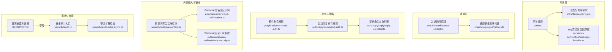
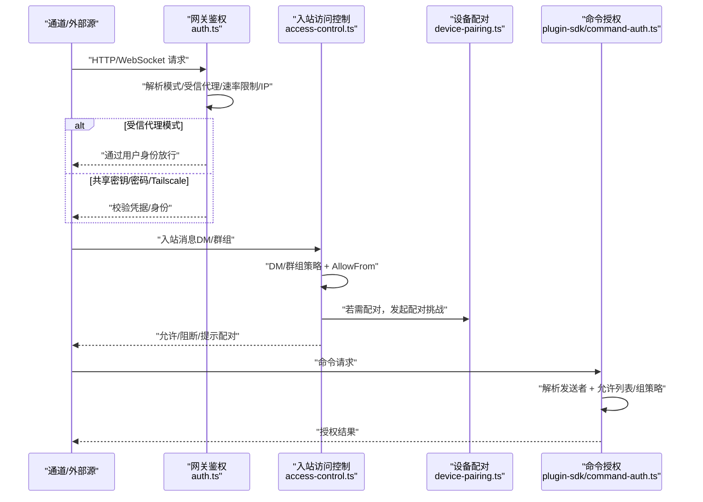
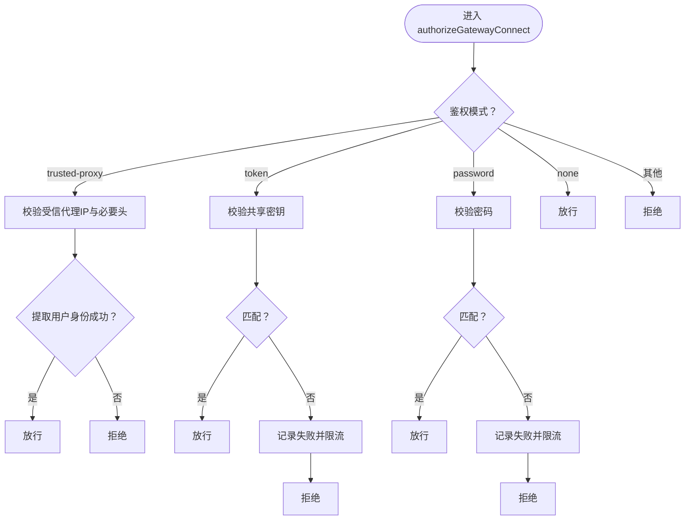
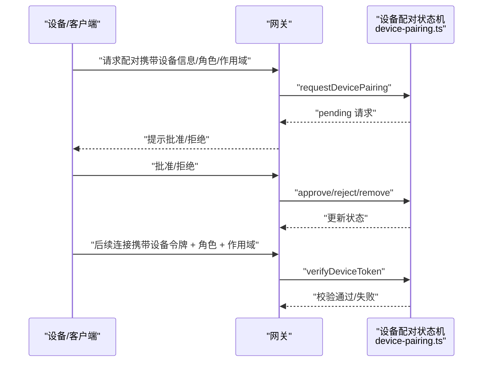
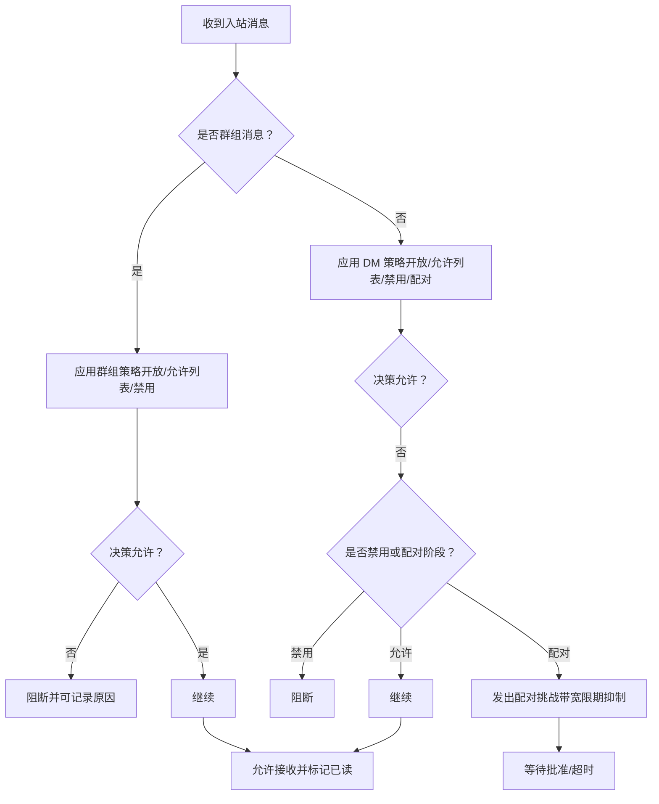
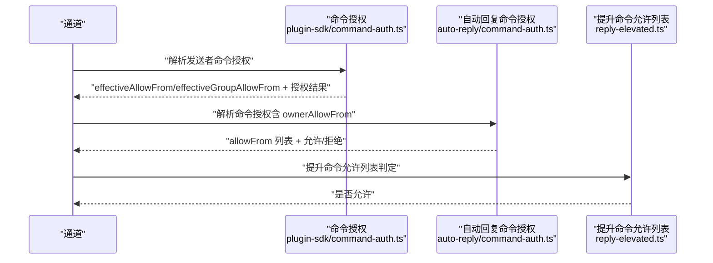
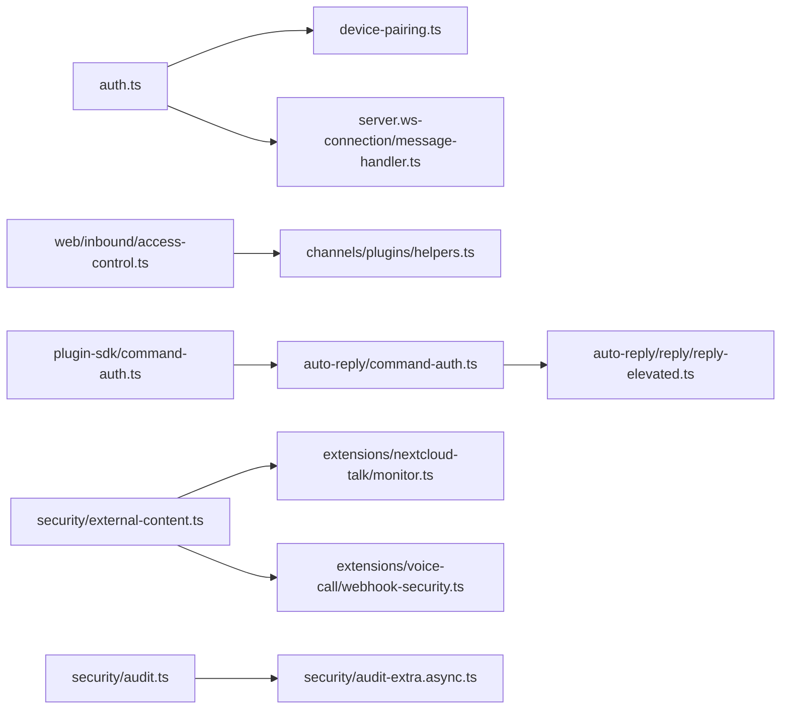

# 通道认证与安全

<cite>
**本文引用的文件**
- [docs/security/README.md](file://docs/security/README.md)
- [docs/security/THREAT-MODEL-ATLAS.md](file://docs/security/THREAT-MODEL-ATLAS.md)
- [docs/concepts/oauth.md](file://docs/concepts/oauth.md)
- [docs/gateway/authentication.md](file://docs/gateway/authentication.md)
- [docs/gateway/trusted-proxy-auth.md](file://docs/gateway/trusted-proxy-auth.md)
- [src/gateway/auth.ts](file://src/gateway/auth.ts)
- [src/gateway/server-methods/devices.ts](file://src/gateway/server-methods/devices.ts)
- [src/gateway/server.ws-connection/message-handler.ts](file://src/gateway/server.ws-connection/message-handler.ts)
- [src/infra/device-pairing.ts](file://src/infra/device-pairing.ts)
- [src/infra/device-pairing.ts（协议schema）](file://src/gateway/protocol/schema/devices.ts)
- [src/web/inbound/access-control.ts](file://src/web/inbound/access-control.ts)
- [src/channels/plugins/helpers.ts](file://src/channels/plugins/helpers.ts)
- [src/plugin-sdk/command-auth.ts](file://src/plugin-sdk/command-auth.ts)
- [src/auto-reply/command-auth.ts](file://src/auto-reply/command-auth.ts)
- [src/auto-reply/reply/reply-elevated.ts](file://src/auto-reply/reply/reply-elevated.ts)
- [src/security/external-content.ts](file://src/security/external-content.ts)
- [src/security/audit.ts](file://src/security/audit.ts)
- [src/security/audit-extra.async.ts](file://src/security/audit-extra.async.ts)
- [src/security/secret-equal.ts](file://src/security/secret-equal.ts)
- [extensions/device-pair/index.ts](file://extensions/device-pair/index.ts)
- [extensions/nextcloud-talk/src/monitor.ts](file://extensions/nextcloud-talk/src/monitor.ts)
- [extensions/voice-call/src/webhook-security.ts](file://extensions/voice-call/src/webhook-security.ts)
- [SECURITY.md](file://SECURITY.md)
</cite>

## 目录

1. [简介](#简介)
2. [项目结构](#项目结构)
3. [核心组件](#核心组件)
4. [架构总览](#架构总览)
5. [详细组件分析](#详细组件分析)
6. [依赖关系分析](#依赖关系分析)
7. [性能考量](#性能考量)
8. [故障排查指南](#故障排查指南)
9. [结论](#结论)
10. [附录](#附录)

## 简介

本文件系统化梳理 OpenClaw 在“通道认证与安全”方面的机制与实现，覆盖以下主题：

- 认证方式：API 密钥、OAuth、Webhook 签名验证、设备配对与设备令牌
- 安全策略：账户快照管理、发送者身份验证、允许列表（AllowFrom）与组策略、命令访问控制
- 威胁模型与风险矩阵：基于 MITRE ATLAS 的攻击面识别与缓解建议
- 合规与审计：安全审计工具、常见漏洞与误报澄清、跨平台一致安全体验

## 项目结构

围绕“通道认证与安全”的关键代码分布在如下模块：

- 网关认证与接入控制：网关鉴权模式、受信代理、速率限制、设备配对与令牌校验
- 通道入站访问控制：DM/群组策略、允许列表、配对挑战与宽限期
- OAuth 与凭据存储：令牌交换、刷新、多账号路由与存储位置
- 外部内容处理：Webhook/邮件/抓取内容的边界包装与注入检测
- 审计与合规：文件权限检查、安全审计报告、漏洞披露与误报说明

图表来源

- [src/gateway/auth.ts:1-504](file://src/gateway/auth.ts#L1-L504)
- [src/infra/device-pairing.ts:1-654](file://src/infra/device-pairing.ts#L1-L654)
- [src/gateway/server.ws-connection/message-handler.ts:209-234](file://src/gateway/server.ws-connection/message-handler.ts#L209-L234)
- [src/web/inbound/access-control.ts:1-228](file://src/web/inbound/access-control.ts#L1-L228)
- [src/channels/plugins/helpers.ts:23-58](file://src/channels/plugins/helpers.ts#L23-L58)
- [src/plugin-sdk/command-auth.ts:63-95](file://src/plugin-sdk/command-auth.ts#L63-L95)
- [src/auto-reply/command-auth.ts:258-301](file://src/auto-reply/command-auth.ts#L258-L301)
- [src/auto-reply/reply/reply-elevated.ts:31-78](file://src/auto-reply/reply/reply-elevated.ts#L31-L78)
- [src/security/external-content.ts:1-346](file://src/security/external-content.ts#L1-L346)
- [extensions/nextcloud-talk/src/monitor.ts:94-130](file://extensions/nextcloud-talk/src/monitor.ts#L94-L130)
- [extensions/voice-call/src/webhook-security.ts:130-165](file://extensions/voice-call/src/webhook-security.ts#L130-L165)
- [src/security/audit.ts:87-1129](file://src/security/audit.ts#L87-L1129)
- [src/security/audit-extra.async.ts:1028-1067](file://src/security/audit-extra.async.ts#L1028-L1067)
- [SECURITY.md:48-67](file://SECURITY.md#L48-L67)

章节来源

- [docs/security/README.md:1-18](file://docs/security/README.md#L1-L18)
- [docs/security/THREAT-MODEL-ATLAS.md:1-604](file://docs/security/THREAT-MODEL-ATLAS.md#L1-L604)

## 核心组件

- 网关鉴权与接入控制
  - 支持模式：无、共享密钥（token）、密码、受信代理（trusted-proxy）、Tailscale 身份透传
  - 速率限制与失败计数、客户端 IP 解析、受信代理白名单
- 设备配对与设备令牌
  - 请求、批准、拒绝、移除、轮换、吊销、校验；支持作用域与角色推导
- 入站访问控制（通道）
  - DM/群组策略（开放/允许列表/禁用），允许列表（AllowFrom）与账户快照
  - 配对宽限期内的配对挑战与历史消息抑制
- OAuth 与凭据管理
  - 存储位置、刷新与过期处理、多账号/多配置文件路由
- 外部内容与 Webhook 安全
  - 外部内容包装与注入检测、Webhook 签名验证、转发头安全重建
- 审计与合规
  - 文件权限检查、网关探测、安全审计报告生成

章节来源

- [src/gateway/auth.ts:217-292](file://src/gateway/auth.ts#L217-L292)
- [src/gateway/auth.ts:378-485](file://src/gateway/auth.ts#L378-L485)
- [src/infra/device-pairing.ts:272-318](file://src/infra/device-pairing.ts#L272-L318)
- [src/infra/device-pairing.ts:320-384](file://src/infra/device-pairing.ts#L320-L384)
- [src/infra/device-pairing.ts:470-508](file://src/infra/device-pairing.ts#L470-L508)
- [src/web/inbound/access-control.ts:41-223](file://src/web/inbound/access-control.ts#L41-L223)
- [docs/concepts/oauth.md:1-159](file://docs/concepts/oauth.md#L1-L159)
- [src/security/external-content.ts:1-346](file://src/security/external-content.ts#L1-L346)
- [src/security/audit.ts:87-1129](file://src/security/audit.ts#L87-L1129)

## 架构总览

下图展示从“通道入站消息/外部Webhook”到“网关鉴权与设备令牌校验”的整体流程，以及“命令授权与策略”的贯穿路径。

图表来源

- [src/gateway/auth.ts:378-485](file://src/gateway/auth.ts#L378-L485)
- [src/web/inbound/access-control.ts:41-223](file://src/web/inbound/access-control.ts#L41-L223)
- [src/infra/device-pairing.ts:272-318](file://src/infra/device-pairing.ts#L272-L318)
- [src/plugin-sdk/command-auth.ts:63-95](file://src/plugin-sdk/command-auth.ts#L63-L95)

## 详细组件分析

### 组件A：网关鉴权与接入控制

- 模式选择与优先级
  - 明确“无/共享密钥/密码/受信代理/Tailscale”五种模式，支持配置覆盖与默认回退
- 受信代理（trusted-proxy）
  - 仅允许来自可信代理 IP 的请求，读取指定头部提取用户身份，并可选限制用户白名单
  - 控制 UI WebSocket 连接在该模式下的行为差异
- 速率限制与失败计数
  - 对错误凭据进行失败计数，支持按 IP 限流与重试等待时间返回
- 客户端 IP 解析
  - 支持 X-Forwarded-For/X-Real-IP/X-Forwarded-Proto/Host 等头，结合受信代理白名单
- Tailscale 身份透传
  - 仅在 WS Control UI 场景启用，要求严格的反向代理与 Whois 校验

图表来源

- [src/gateway/auth.ts:378-485](file://src/gateway/auth.ts#L378-L485)

章节来源

- [src/gateway/auth.ts:217-292](file://src/gateway/auth.ts#L217-L292)
- [src/gateway/auth.ts:331-372](file://src/gateway/auth.ts#L331-L372)
- [src/gateway/auth.ts:378-485](file://src/gateway/auth.ts#L378-L485)
- [docs/gateway/trusted-proxy-auth.md:30-79](file://docs/gateway/trusted-proxy-auth.md#L30-L79)

### 组件B：设备配对与设备令牌

- 生命周期
  - 请求配对（requestDevicePairing）→ 批准（approveDevicePairing）→ 拒绝/移除
  - 令牌轮换（rotateDeviceToken）、吊销（revokeDeviceToken）、校验（verifyDeviceToken）
- 角色与作用域
  - 角色与作用域的归一化、合并与推导（如 admin 隐含 read/write 等）
  - 校验时要求角色存在、令牌未吊销、令牌匹配、作用域满足
- 会话绑定
  - WS 连接处理器中对“声明平台/设备族”与“已配对平台/设备族”的不一致进行标记

图表来源

- [src/infra/device-pairing.ts:272-318](file://src/infra/device-pairing.ts#L272-L318)
- [src/infra/device-pairing.ts:320-384](file://src/infra/device-pairing.ts#L320-L384)
- [src/infra/device-pairing.ts:470-508](file://src/infra/device-pairing.ts#L470-L508)
- [src/gateway/server-methods/devices.ts:1-32](file://src/gateway/server-methods/devices.ts#L1-L32)
- [src/gateway/server.ws-connection/message-handler.ts:209-234](file://src/gateway/server.ws-connection/message-handler.ts#L209-L234)

章节来源

- [src/infra/device-pairing.ts:195-220](file://src/infra/device-pairing.ts#L195-L220)
- [src/infra/device-pairing.ts:470-508](file://src/infra/device-pairing.ts#L470-L508)
- [src/gateway/server-methods/devices.ts:1-32](file://src/gateway/server-methods/devices.ts#L1-L32)
- [src/gateway/server.ws-connection/message-handler.ts:209-234](file://src/gateway/server.ws-connection/message-handler.ts#L209-L234)

### 组件C：通道入站访问控制与允许列表

- DM/群组策略
  - 默认策略：DM（开放/允许列表/禁用），群组策略：开放/允许列表/禁用
  - 允许列表来源：配置、账户快照（storeAllowFrom）、自对话（self-chat）
- 配对宽限期
  - 在配对宽限期内（默认 30 秒）对未授权发送者触发配对挑战，避免历史消息重复打扰
- 发送者身份
  - 对于 WhatsApp 等渠道，支持 E164 归一化与推送名称元数据

图表来源

- [src/web/inbound/access-control.ts:41-223](file://src/web/inbound/access-control.ts#L41-L223)

章节来源

- [src/web/inbound/access-control.ts:41-223](file://src/web/inbound/access-control.ts#L41-L223)
- [src/channels/plugins/helpers.ts:23-58](file://src/channels/plugins/helpers.ts#L23-L58)

### 组件D：命令访问控制与发送者身份验证

- 插件命令授权
  - 统一解析发送者命令授权：考虑 DM/群组策略、允许列表、账户快照、访问组开关
- 自动回复命令授权
  - 基于上下文（provider/accountId）解析 commands.allowFrom、ownerAllowFrom、上下文 ownerAllowFrom
- 提升命令允许列表
  - 支持格式化 AllowFrom 列表，通配符与多条目处理，结合发送者身份判定

图表来源

- [src/plugin-sdk/command-auth.ts:63-95](file://src/plugin-sdk/command-auth.ts#L63-L95)
- [src/auto-reply/command-auth.ts:258-301](file://src/auto-reply/command-auth.ts#L258-L301)
- [src/auto-reply/reply/reply-elevated.ts:31-78](file://src/auto-reply/reply/reply-elevated.ts#L31-L78)

章节来源

- [src/plugin-sdk/command-auth.ts:63-95](file://src/plugin-sdk/command-auth.ts#L63-L95)
- [src/auto-reply/command-auth.ts:258-301](file://src/auto-reply/command-auth.ts#L258-L301)
- [src/auto-reply/reply/reply-elevated.ts:31-78](file://src/auto-reply/reply/reply-elevated.ts#L31-L78)

### 组件E：OAuth 与凭据管理

- 存储位置
  - per-agent 的 auth-profiles.json，兼容历史文件与环境变量
- 刷新与过期
  - 运行时根据 expires 决定使用旧令牌或刷新，刷新在文件锁保护下原子写入
- 多账号/多配置文件
  - 支持多个 profileId，可通过会话命令切换或全局排序控制

章节来源

- [docs/concepts/oauth.md:41-159](file://docs/concepts/oauth.md#L41-L159)

### 组件F：外部内容与 Webhook 安全

- 外部内容包装
  - 使用随机边界标记与安全警告块包裹，检测可疑注入模式，屏蔽伪造边界标记
- Webhook 签名验证
  - 不同插件实现签名验证与错误响应；示例包括 Nextcloud Talk 与 Voice Call 插件
- 转发头安全重建
  - 通过 allowedHosts 或信任转发头策略，防止主机头注入

章节来源

- [src/security/external-content.ts:1-346](file://src/security/external-content.ts#L1-L346)
- [extensions/nextcloud-talk/src/monitor.ts:94-130](file://extensions/nextcloud-talk/src/monitor.ts#L94-L130)
- [extensions/voice-call/src/webhook-security.ts:130-165](file://extensions/voice-call/src/webhook-security.ts#L130-L165)

### 组件G：安全审计与合规

- 安全审计入口
  - 支持文件系统检查、通道安全检查、深度网关探测、插件扫描、代码安全性摘要缓存
- 审计扩展检查
  - 重点检查 auth-profiles.json 权限（世界可写/可读）等高危问题
- 漏洞披露与误报澄清
  - 明确常见误报场景与关闭标准，强调“必须证明越过了既定信任边界”

章节来源

- [src/security/audit.ts:87-1129](file://src/security/audit.ts#L87-L1129)
- [src/security/audit-extra.async.ts:1028-1067](file://src/security/audit-extra.async.ts#L1028-L1067)
- [SECURITY.md:48-67](file://SECURITY.md#L48-L67)

## 依赖关系分析

- 网关鉴权依赖：
  - 速率限制器、受信代理配置、Tailscale Whois 查询
- 设备配对依赖：
  - 异步锁、状态文件读写、令牌生成/校验
- 入站访问控制依赖：
  - 账户配置、允许列表存储、渠道运行时策略
- 命令授权依赖：
  - 上下文（provider/accountId）、允许列表格式化、访问组开关
- 外部内容与 Webhook 依赖：
  - 插件实现差异，但共同遵循“签名验证/边界包装/转发头安全”原则

图表来源

- [src/gateway/auth.ts:1-504](file://src/gateway/auth.ts#L1-L504)
- [src/infra/device-pairing.ts:1-654](file://src/infra/device-pairing.ts#L1-L654)
- [src/gateway/server.ws-connection/message-handler.ts:209-234](file://src/gateway/server.ws-connection/message-handler.ts#L209-L234)
- [src/web/inbound/access-control.ts:1-228](file://src/web/inbound/access-control.ts#L1-L228)
- [src/channels/plugins/helpers.ts:23-58](file://src/channels/plugins/helpers.ts#L23-L58)
- [src/plugin-sdk/command-auth.ts:63-95](file://src/plugin-sdk/command-auth.ts#L63-L95)
- [src/auto-reply/command-auth.ts:258-301](file://src/auto-reply/command-auth.ts#L258-L301)
- [src/auto-reply/reply/reply-elevated.ts:31-78](file://src/auto-reply/reply/reply-elevated.ts#L31-L78)
- [src/security/external-content.ts:1-346](file://src/security/external-content.ts#L1-L346)
- [extensions/nextcloud-talk/src/monitor.ts:94-130](file://extensions/nextcloud-talk/src/monitor.ts#L94-L130)
- [extensions/voice-call/src/webhook-security.ts:130-165](file://extensions/voice-call/src/webhook-security.ts#L130-L165)
- [src/security/audit.ts:87-1129](file://src/security/audit.ts#L87-L1129)
- [src/security/audit-extra.async.ts:1028-1067](file://src/security/audit-extra.async.ts#L1028-L1067)

## 性能考量

- 速率限制与失败计数
  - 对错误凭据进行失败计数，避免暴力尝试；合理设置限流阈值与重试等待
- 异步锁与原子写
  - 设备配对状态文件读写采用异步锁与原子写，降低并发冲突开销
- 外部内容包装
  - 随机边界标记与注入检测在保证安全的同时尽量减少额外处理成本
- 审计扫描
  - 深度网关探测与插件扫描可配置超时，避免长时间阻塞

## 故障排查指南

- 网关鉴权失败
  - 检查模式配置与环境变量、受信代理 IP 白名单、速率限制状态
  - 参考：[src/gateway/auth.ts:378-485](file://src/gateway/auth.ts#L378-L485)
- 设备配对异常
  - 查看 pending/requestId/deviceId 是否正确、批准/拒绝流程是否完成
  - 参考：[src/infra/device-pairing.ts:320-384](file://src/infra/device-pairing.ts#L320-L384)
- 入站消息被阻断
  - 检查 DM/群组策略、AllowFrom 列表、账户快照、配对宽限期
  - 参考：[src/web/inbound/access-control.ts:41-223](file://src/web/inbound/access-control.ts#L41-L223)
- 命令未授权
  - 核对发送者身份、允许列表、访问组开关、ownerAllowFrom
  - 参考：[src/plugin-sdk/command-auth.ts:63-95](file://src/plugin-sdk/command-auth.ts#L63-L95)
- Webhook 未生效或被拒
  - 核对签名验证逻辑、转发头重建策略、插件特定实现
  - 参考：[extensions/nextcloud-talk/src/monitor.ts:94-130](file://extensions/nextcloud-talk/src/monitor.ts#L94-L130)
- 审计发现高危问题
  - 修复文件权限（如 auth-profiles.json 的世界可写/可读）
  - 参考：[src/security/audit-extra.async.ts:1028-1067](file://src/security/audit-extra.async.ts#L1028-L1067)

章节来源

- [src/gateway/auth.ts:378-485](file://src/gateway/auth.ts#L378-L485)
- [src/infra/device-pairing.ts:320-384](file://src/infra/device-pairing.ts#L320-L384)
- [src/web/inbound/access-control.ts:41-223](file://src/web/inbound/access-control.ts#L41-L223)
- [src/plugin-sdk/command-auth.ts:63-95](file://src/plugin-sdk/command-auth.ts#L63-L95)
- [extensions/nextcloud-talk/src/monitor.ts:94-130](file://extensions/nextcloud-talk/src/monitor.ts#L94-L130)
- [src/security/audit-extra.async.ts:1028-1067](file://src/security/audit-extra.async.ts#L1028-L1067)

## 结论

OpenClaw 在“通道认证与安全”方面形成了“多层防御”的体系：网关侧的多种鉴权模式与速率限制、设备配对与令牌校验、通道入站的允许列表与配对宽限期、命令层面的发送者身份与访问组控制、对外部输入的包装与注入检测，以及完善的审计与合规流程。通过 MITRE ATLAS 威胁模型与持续的安全审计，项目能够持续识别与缓解风险，保障在多平台部署中的一致安全体验。

## 附录

- 威胁模型与缓解
  - 参考：[docs/security/THREAT-MODEL-ATLAS.md:1-604](file://docs/security/THREAT-MODEL-ATLAS.md#L1-L604)
- OAuth 流程与存储
  - 参考：[docs/concepts/oauth.md:1-159](file://docs/concepts/oauth.md#L1-L159)
- 网关认证与受信代理
  - 参考：[docs/gateway/authentication.md:1-180](file://docs/gateway/authentication.md#L1-L180)
  - 参考：[docs/gateway/trusted-proxy-auth.md:30-79](file://docs/gateway/trusted-proxy-auth.md#L30-L79)
- 安全审计与合规
  - 参考：[src/security/audit.ts:87-1129](file://src/security/audit.ts#L87-L1129)
  - 参考：[SECURITY.md:48-67](file://SECURITY.md#L48-L67)
