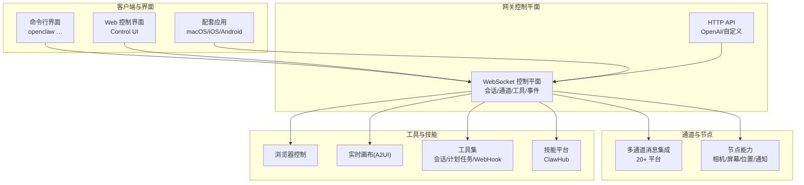
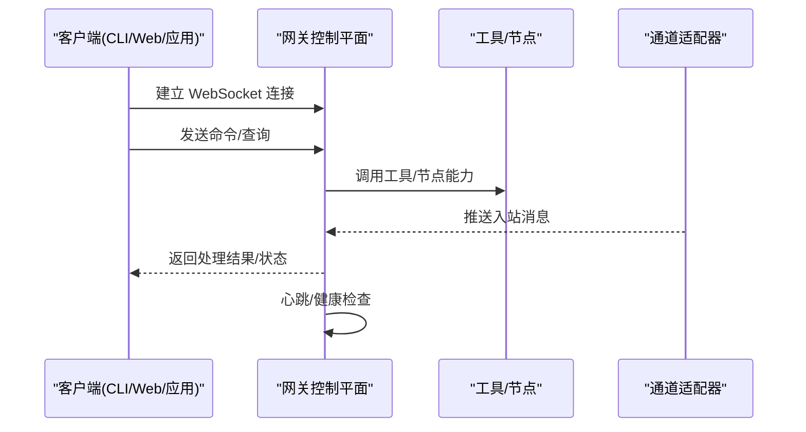
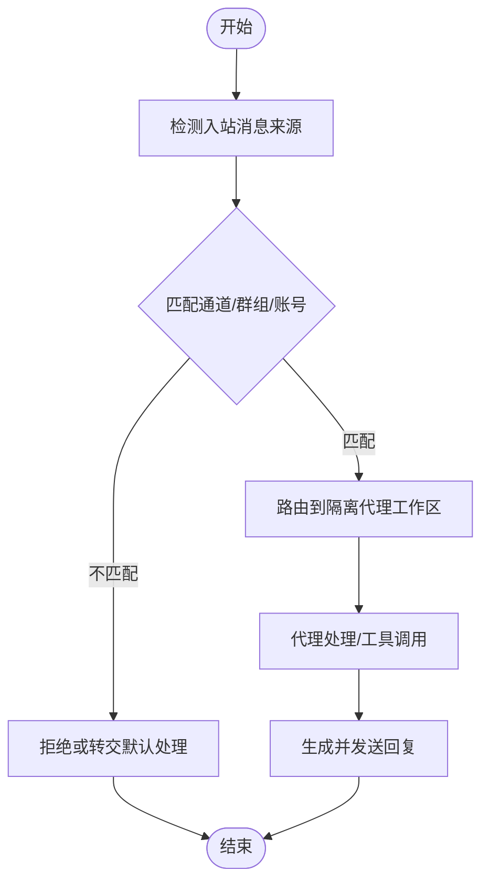
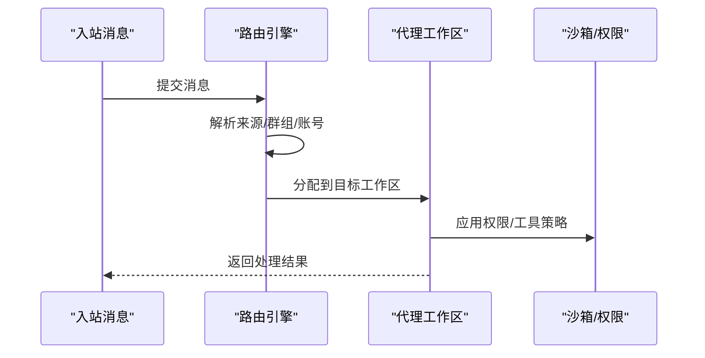
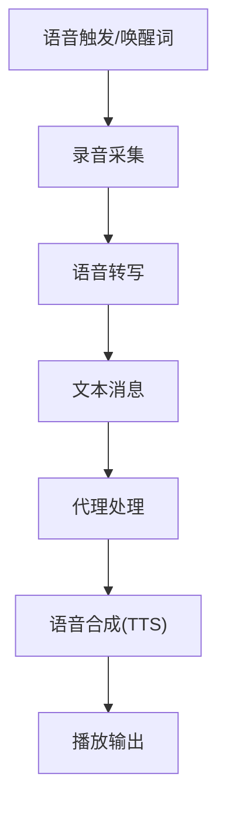
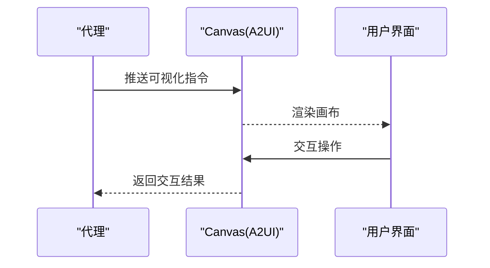
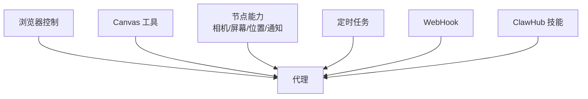
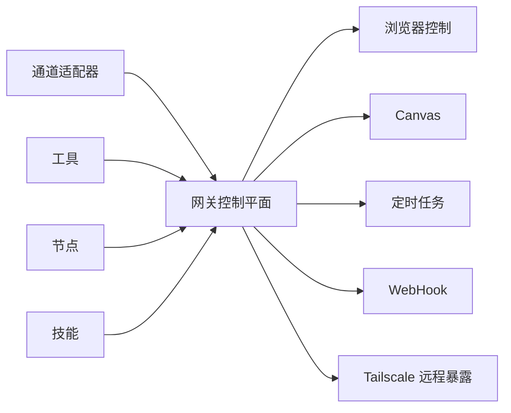

# 核心功能特性

<cite>
**本文引用的文件**
- [README.md](file://README.md)
- [VISION.md](file://VISION.md)
- [gateway/index.md](file://docs/gateway/index.md)
- [channels/index.md](file://docs/channels/index.md)
- [nodes/voicewake.md](file://docs/nodes/voicewake.md)
- [nodes/talk.md](file://docs/nodes/talk.md)
- [platforms/mac/canvas.md](file://docs/platforms/mac/canvas.md)
- [tools/browser.md](file://docs/tools/browser.md)
- [tools/skills.md](file://docs/tools/skills.md)
- [platforms/macos.md](file://docs/platforms/macos.md)
- [platforms/ios.md](file://docs/platforms/ios.md)
- [platforms/android.md](file://docs/platforms/android.md)
- [web/control-ui.md](file://docs/web/control-ui.md)
- [concepts/architecture.md](file://docs/concepts/architecture.md)
- [gateway/configuration.md](file://docs/gateway/configuration.md)
- [gateway/security.md](file://docs/gateway/security.md)
- [gateway/remote.md](file://docs/gateway/remote.md)
- [gateway/tailscale.md](file://docs/gateway/tailscale.md)
- [gateway/pairing.md](file://docs/gateway/pairing.md)
- [gateway/discovery.md](file://docs/gateway/discovery.md)
- [gateway/bonjour.md](file://docs/gateway/bonjour.md)
- [gateway/heartbeat.md](file://docs/gateway/heartbeat.md)
- [gateway/doctor.md](file://docs/gateway/doctor.md)
- [gateway/health.md](file://docs/gateway/health.md)
- [gateway/background-process.md](file://docs/gateway/background-process.md)
- [gateway/logging.md](file://docs/gateway/logging.md)
- [gateway/openai-http-api.md](file://docs/gateway/openai-http-api.md)
- [gateway/openresponses-http-api.md](file://docs/gateway/openresponses-http-api.md)
- [gateway/tools-invoke-http-api.md](file://docs/gateway/tools-invoke-http-api.md)
- [gateway/bridge-protocol.md](file://docs/gateway/bridge-protocol.md)
- [gateway/protocol.md](file://docs/gateway/protocol.md)
- [gateway/multiple-gateways.md](file://docs/gateway/multiple-gateways.md)
- [gateway/network-model.md](file://docs/gateway/network-model.md)
- [gateway/local-models.md](file://docs/gateway/local-models.md)
- [gateway/sandboxing.md](file://docs/gateway/sandboxing.md)
- [gateway/trusted-proxy-auth.md](file://docs/gateway/trusted-proxy-auth.md)
- [gateway/secrets.md](file://docs/gateway/secrets.md)
- [gateway/secrets-plan-contract.md](file://docs/gateway/secrets-plan-contract.md)
- [gateway/gateway-lock.md](file://docs/gateway/gateway-lock.md)
- [gateway/authentication.md](file://docs/gateway/authentication.md)
- [gateway/cli-backends.md](file://docs/gateway/cli-backends.md)
- [gateway/configuration-examples.md](file://docs/gateway/configuration-examples.md)
- [gateway/configuration-reference.md](file://docs/gateway/configuration-reference.md)
- [gateway/doctor.md](file://docs/gateway/doctor.md)
- [gateway/troubleshooting.md](file://docs/gateway/troubleshooting.md)
- [gateway/sandbox-vs-tool-policy-vs-elevated.md](file://docs/gateway/sandbox-vs-tool-policy-vs-elevated.md)
- [gateway/sandboxing.md](file://docs/gateway/sandboxing.md)
- [gateway/sandboxing.md](file://docs/gateway/sandboxing.md)
- [gateway/sandboxing.md](file://docs/gateway/sandboxing.md)
- [gateway/sandboxing.md](file://docs/gateway/sandboxing.md)
- [gateway/sandboxing.md](file://docs/gateway/sandboxing.md)
- [gateway/sandboxing.md](file://docs/gateway/sandboxing.md)
- [gateway/sandboxing.md](file://docs/gateway/sandboxing.md)
- [gateway/sandboxing.md](file://docs/gateway/sandboxing.md)
- [gateway/sandboxing.md](file://docs/gateway/sandboxing.md)
- [gateway/sandboxing.md](file://docs/gateway/sandboxing.md)
- [gateway/sandboxing.md](file://docs/gateway/sandboxing.md)
- [gateway/sandboxing.md](file://docs/gateway/sandboxing.md)
- [gateway/sandboxing.md](file://docs/gateway/sandboxing.md)
- [gateway/sandboxing.md](file://docs/gateway/sandboxing.md)
- [gateway/sandboxing.md](file://docs/gateway/sandboxing.md)
- [gateway/sandboxing.md](file://docs/gateway/sandboxing.md)
- [gateway/sandboxing.md](file://docs/gateway/sandboxing.md)
- [gateway/sandboxing.md](file://docs/gateway/sandboxing.md)
- [gateway/sandboxing.md](file://docs/gateway/sandboxing.md)
- [gateway/sandboxing.md](file://docs/gateway/sandboxing.md)
- [gateway/sandboxing.md](file://docs/gateway/sandboxing.md)
- [gateway/sandboxing.md](file://docs/gateway/sandboxing.md)
- [gateway/sandboxing.md](file://docs/gateway/sandboxing.md)
- [gateway/sandboxing.md](file://docs/gateway/sandboxing.md)
- [gateway/sandboxing.md](file://docs/gateway/sandboxing.md)
- [gateway/sandboxing.md](file://docs/gateway/sandboxing.md)
- [gateway/sandboxing.md](file://docs/gateway/sandboxing.md)
- [gateway/sandboxing.md](file://docs/gateway/sandboxing.md)
- [gateway/sandbox......](file://docs/gateway/sandboxing.md)
</cite>

## 目录

1. [简介](#简介)
2. [项目结构](#项目结构)
3. [核心组件](#核心组件)
4. [架构总览](#架构总览)
5. [详细组件分析](#详细组件分析)
6. [依赖关系分析](#依赖关系分析)
7. [性能考量](#性能考量)
8. [故障排查指南](#故障排查指南)
9. [结论](#结论)
10. [附录](#附录)

## 简介

OpenClaw 是一个在您自己的设备上运行的个人 AI 助手，支持您已使用的多种即时通讯渠道（如 WhatsApp、Telegram、Slack、Discord、Google Chat、Signal、iMessage、BlueBubbles、IRC、Microsoft Teams、Matrix、Feishu、LINE、Mattermost、Nextcloud Talk、Nostr、Synology Chat、Tlon、Twitch、Zalo、Zalo Personal、WebChat），可在 macOS/iOS/Android 上进行语音唤醒与持续对话，并可渲染一个由您控制的实时画布（Canvas）。其核心是“网关”这一单一控制平面，产品即助手本身。

OpenClaw 的目标是提供易用、快速、始终在线且尊重隐私与安全的个人助理体验。它通过终端向导驱动的安装流程，结合多通道消息集成、多代理路由、语音唤醒、实时画布、一流工具与配套应用，帮助用户提升个人生产力与沟通效率。

章节来源

- [README.md:126-136](file://README.md#L126-L136)
- [README.md:185-212](file://README.md#L185-L212)
- [VISION.md:15-32](file://VISION.md#L15-L32)

## 项目结构

OpenClaw 采用模块化与分层组织方式，核心围绕“网关（Gateway）”这一 WebSocket 控制平面展开，向上提供 CLI、Web 控制界面、远程访问能力；向下连接各即时通讯渠道、节点（Nodes）、工具（Tools）与技能（Skills）。配套应用覆盖 macOS、iOS、Android 平台，提供菜单栏控制、语音唤醒/按住说话叠加层、WebChat 与调试工具等。

- 网关控制平面：统一会话、通道、工具与事件的控制中心，提供 WebSocket 接口与 HTTP API。
- 多通道消息集成：支持 20+ 即时通讯平台，覆盖主流 IM、企业协作与新兴生态。
- 多代理路由：按通道/账号/群组路由到隔离的代理工作区，保障安全性与上下文独立性。
- 语音唤醒与持续对话：macOS/iOS 支持唤醒词，Android 支持持续语音输入。
- 实时画布：基于 A2UI 的可视化工作空间，支持推送、重置、执行与快照。
- 一流工具：浏览器控制、Canvas、节点（相机、屏幕录制、位置、通知等）、定时任务与 WebHook 触发。
- 配套应用：macOS 菜单栏应用 + iOS/Android 节点，提供设备级能力与本地动作执行。

图表来源

- [README.md:185-212](file://README.md#L185-L212)
- [docs/web/control-ui.md](file://docs/web/control-ui.md)
- [docs/platforms/macos.md](file://docs/platforms/macos.md)
- [docs/platforms/ios.md](file://docs/platforms/ios.md)
- [docs/platforms/android.md](file://docs/platforms/android.md)
- [docs/tools/browser.md](file://docs/tools/browser.md)
- [docs/platforms/mac/canvas.md](file://docs/platforms/mac/canvas.md)
- [docs/tools/skills.md](file://docs/tools/skills.md)

章节来源

- [README.md:141-184](file://README.md#L141-L184)
- [docs/gateway/index.md](file://docs/gateway/index.md)
- [docs/channels/index.md](file://docs/channels/index.md)

## 核心组件

本节聚焦 OpenClaw 的六大核心功能模块及其优势：

- 本地网关控制平面
  - 作用：作为单一 WebSocket 控制平面，统一管理会话、通道、工具与事件，同时提供 HTTP API 表面与远程暴露能力。
  - 优势：简化部署与运维，降低复杂度；便于扩展与安全控制。
  - 参考：[网关索引](file://docs/gateway/index.md)，[协议与桥接](file://docs/gateway/protocol.md)，[桥接协议](file://docs/gateway/bridge-protocol.md)。

- 多通道消息集成
  - 作用：连接 20+ 即时通讯平台，实现消息收发、群组路由与规则控制。
  - 优势：覆盖广泛生态，减少切换成本；支持分组路由与权限策略。
  - 参考：[通道索引](file://docs/channels/index.md)，[通道路由](file://docs/channels/channel-routing.md)，[群组消息](file://docs/channels/group-messages.md)。

- 多代理路由
  - 作用：将不同通道/账号/群组的消息路由到隔离的代理工作区，实现上下文与权限分离。
  - 优势：提升安全性与稳定性；避免跨会话干扰。
  - 参考：[多代理配置](file://docs/gateway/configuration.md)，[会话模型](file://docs/concepts/session.md)。

- 语音唤醒与持续对话
  - 作用：macOS/iOS 支持唤醒词，Android 支持持续语音输入，结合系统 TTS/第三方 TTS。
  - 优势：自然交互体验；跨平台一致的语音能力。
  - 参考：[语音唤醒](file://docs/nodes/voicewake.md)，[Talk 模式](file://docs/nodes/talk.md)。

- 实时画布（Canvas）
  - 作用：基于 A2UI 的可视化工作空间，支持推送、重置、执行与快照。
  - 优势：直观的工作空间；便于协作与演示。
  - 参考：[Canvas 文档](file://docs/platforms/mac/canvas.md)。

- 一流工具与配套应用
  - 作用：浏览器控制、节点能力（相机/屏幕/位置/通知）、定时任务、WebHook、技能平台；配套应用提供菜单栏控制、语音叠加层与 WebChat。
  - 优势：工具链完整；跨平台应用增强本地能力。
  - 参考：[浏览器控制](file://docs/tools/browser.md)，[技能平台](file://docs/tools/skills.md)，[macOS 应用](file://docs/platforms/macos.md)，[iOS 节点](file://docs/platforms/ios.md)，[Android 节点](file://docs/platforms/android.md)。

章节来源

- [README.md:126-136](file://README.md#L126-L136)
- [README.md:141-184](file://README.md#L141-L184)
- [docs/nodes/voicewake.md](file://docs/nodes/voicewake.md)
- [docs/nodes/talk.md](file://docs/nodes/talk.md)
- [docs/platforms/mac/canvas.md](file://docs/platforms/mac/canvas.md)
- [docs/tools/browser.md](file://docs/tools/browser.md)
- [docs/tools/skills.md](file://docs/tools/skills.md)
- [docs/platforms/macos.md](file://docs/platforms/macos.md)
- [docs/platforms/ios.md](file://docs/platforms/ios.md)
- [docs/platforms/android.md](file://docs/platforms/android.md)

## 架构总览

下图展示 OpenClaw 的整体架构：从多通道消息入口到网关控制平面，再到工具、节点与技能，最终通过配套应用与 Web 界面触达用户。

```mermaid
graph TB
subgraph "外部通道"
WA["WhatsApp"]
TG["Telegram"]
SL["Slack"]
DC["Discord"]
GC["Google Chat"]
SI["Signal"]
IM["iMessage/BlueBubbles"]
IR["IRC"]
MT["Microsoft Teams"]
MX["Matrix"]
FS["Feishu"]
LI["LINE"]
MM["Mattermost"]
NT["Nextcloud Talk"]
NS["Nostr"]
SC["Synology Chat"]
TL["Tlon"]
TW["Twitch"]
ZA["Zalo/Zalo Personal"]
WC["WebChat"]
end
subgraph "网关控制平面"
WS["WebSocket 控制平面"]
API["HTTP API"]
SEC["安全与鉴权"]
SAN["沙箱与隔离"]
end
subgraph "内部能力"
AG["代理与会话"]
BR["浏览器控制"]
CV["Canvas(A2UI)"]
ND["节点能力"]
TK["工具与自动化"]
SK["技能平台"]
end
subgraph "客户端"
MB["macOS 菜单栏应用"]
IO["iOS 节点"]
AD["Android 节点"]
WC_UI["WebChat/Control UI"]
end
WA --> WS
TG --> WS
SL --> WS
DC --> WS
GC --> WS
SI --> WS
IM --> WS
IR --> WS
MT --> WS
MX --> WS
FS --> WS
LI --> WS
MM --> WS
NT --> WS
NS --> WS
SC --> WS
TL --> WS
TW --> WS
ZA --> WS
WC --> WS
WS --> AG
WS --> BR
WS --> CV
WS --> ND
WS --> TK
WS --> SK
SEC --> WS
SAN --> WS
MB --> WS
IO --> WS
AD --> WS
WC_UI --> WS
API --> WS
```

图表来源

- [README.md:185-212](file://README.md#L185-L212)
- [docs/gateway/index.md](file://docs/gateway/index.md)
- [docs/gateway/protocol.md](file://docs/gateway/protocol.md)
- [docs/gateway/bridge-protocol.md](file://docs/gateway/bridge-protocol.md)
- [docs/gateway/security.md](file://docs/gateway/security.md)
- [docs/gateway/sandboxing.md](file://docs/gateway/sandboxing.md)

章节来源

- [README.md:185-212](file://README.md#L185-L212)
- [docs/concepts/architecture.md](file://docs/concepts/architecture.md)

## 详细组件分析

### 组件一：本地网关控制平面

- 设计要点
  - 单一 WebSocket 控制平面，承载会话、通道、工具与事件。
  - 提供 HTTP API 表面（如 OpenAI 兼容接口），便于外部集成。
  - 支持远程暴露（Tailscale Serve/Funnel 或 SSH 隧道），并内置鉴权与安全策略。
- 数据流
  - 客户端（CLI/Web/应用）通过 WS 连接网关；工具与节点通过 WS 注册与调用；通道适配器将外部消息注入网关。
- 安全与隔离
  - 默认工具在主会话运行；群组/频道会话可通过沙箱隔离；支持密码/身份验证与尾流策略。
- 性能与可用性
  - 心跳与健康检查保障连通性；后台进程与守护服务确保持续运行；日志与诊断工具辅助排障。

图表来源

- [docs/gateway/heartbeat.md](file://docs/gateway/heartbeat.md)
- [docs/gateway/health.md](file://docs/gateway/health.md)
- [docs/gateway/background-process.md](file://docs/gateway/background-process.md)
- [docs/gateway/logging.md](file://docs/gateway/logging.md)
- [docs/gateway/openai-http-api.md](file://docs/gateway/openai-http-api.md)
- [docs/gateway/openresponses-http-api.md](file://docs/gateway/openresponses-http-api.md)
- [docs/gateway/tools-invoke-http-api.md](file://docs/gateway/tools-invoke-http-api.md)

章节来源

- [docs/gateway/index.md](file://docs/gateway/index.md)
- [docs/gateway/protocol.md](file://docs/gateway/protocol.md)
- [docs/gateway/bridge-protocol.md](file://docs/gateway/bridge-protocol.md)
- [docs/gateway/security.md](file://docs/gateway/security.md)
- [docs/gateway/sandboxing.md](file://docs/gateway/sandboxing.md)
- [docs/gateway/tailscale.md](file://docs/gateway/tailscale.md)
- [docs/gateway/remote.md](file://docs/gateway/remote.md)
- [docs/gateway/authentication.md](file://docs/gateway/authentication.md)
- [docs/gateway/gateway-lock.md](file://docs/gateway/gateway-lock.md)
- [docs/gateway/doctor.md](file://docs/gateway/doctor.md)

### 组件二：多通道消息集成

- 设计要点
  - 支持 20+ 即时通讯平台，覆盖企业协作、开源社区与新兴生态。
  - 提供通道路由、群组消息、权限与白名单策略。
- 数据流
  - 通道适配器监听外部平台事件，转换为网关内部消息格式，经路由后进入对应代理工作区。
- 使用场景
  - 在 Slack/Teams 中接收任务，在 Telegram/WhatsApp 中与朋友沟通，统一在网关中查看与回复。
- 配置参考
  - 各平台的令牌、Webhook、群组策略与允许列表配置。

图表来源

- [docs/channels/index.md](file://docs/channels/index.md)
- [docs/channels/channel-routing.md](file://docs/channels/channel-routing.md)
- [docs/channels/group-messages.md](file://docs/channels/group-messages.md)

章节来源

- [README.md:129-154](file://README.md#L129-L154)
- [docs/channels/index.md](file://docs/channels/index.md)

### 组件三：多代理路由

- 设计要点
  - 将不同来源的消息路由到隔离的代理工作区，实现上下文与权限分离。
  - 支持激活模式、队列模式与回复回传策略。
- 数据流
  - 入站消息经路由规则判定归属；进入对应工作区后，代理根据会话上下文与工具策略执行。
- 安全优势
  - 主会话默认拥有较高权限；群组/频道会话可启用沙箱，限制工具与权限范围。

图表来源

- [docs/gateway/configuration.md](file://docs/gateway/configuration.md)
- [docs/concepts/session.md](file://docs/concepts/session.md)
- [docs/gateway/sandboxing.md](file://docs/gateway/sandboxing.md)

章节来源

- [README.md:130-131](file://README.md#L130-L131)
- [docs/gateway/configuration.md](file://docs/gateway/configuration.md)
- [docs/concepts/session.md](file://docs/concepts/session.md)

### 组件四：语音唤醒与持续对话

- 设计要点
  - macOS/iOS 支持唤醒词；Android 支持持续语音输入；可结合系统 TTS 或第三方 TTS。
  - 支持按住说话叠加层与 Talk 模式。
- 数据流
  - 语音触发 → 录音/转写 → 文本消息 → 代理处理 → 语音合成 → 输出播放。
- 使用场景
  - 一边开车一边询问路线；一边做会议一边记录要点；在移动设备上快速表达想法。

图表来源

- [docs/nodes/voicewake.md](file://docs/nodes/voicewake.md)
- [docs/nodes/talk.md](file://docs/nodes/talk.md)

章节来源

- [README.md:131-132](file://README.md#L131-L132)
- [docs/nodes/voicewake.md](file://docs/nodes/voicewake.md)
- [docs/nodes/talk.md](file://docs/nodes/talk.md)

### 组件五：实时画布（Canvas）

- 设计要点
  - 基于 A2UI 的可视化工作空间，支持推送、重置、执行与快照。
  - macOS 菜单栏应用与 iOS/Android 节点均可访问。
- 数据流
  - 代理生成可视化指令 → Canvas 渲染 → 用户交互 → 结果反馈。
- 使用场景
  - 展示数据分析图表；在会议中共享屏幕；与伙伴共同编辑可视化内容。

图表来源

- [docs/platforms/mac/canvas.md](file://docs/platforms/mac/canvas.md)
- [docs/platforms/macos.md](file://docs/platforms/macos.md)
- [docs/platforms/ios.md](file://docs/platforms/ios.md)
- [docs/platforms/android.md](file://docs/platforms/android.md)

章节来源

- [README.md:132-133](file://README.md#L132-L133)
- [docs/platforms/mac/canvas.md](file://docs/platforms/mac/canvas.md)

### 组件六：一流工具与配套应用

- 浏览器控制
  - 提供专用 Chrome/Chromium 实例，支持快照、动作与上传。
- Canvas 工具
  - 与 Canvas 协同，支持可视化工作流。
- 节点能力
  - 相机抓拍/视频录制、屏幕录制、位置获取、通知等。
- 自动化与技能
  - Cron 任务、WebHook、Gmail Pub/Sub；ClawHub 技能注册表。
- 配套应用
  - macOS 菜单栏控制、语音唤醒/按住说话叠加层、WebChat 与调试工具；iOS/Android 节点提供设备级能力。

图表来源

- [docs/tools/browser.md](file://docs/tools/browser.md)
- [docs/platforms/mac/canvas.md](file://docs/platforms/mac/canvas.md)
- [docs/tools/skills.md](file://docs/tools/skills.md)
- [docs/platforms/macos.md](file://docs/platforms/macos.md)
- [docs/platforms/ios.md](file://docs/platforms/ios.md)
- [docs/platforms/android.md](file://docs/platforms/android.md)

章节来源

- [README.md:133-135](file://README.md#L133-L135)
- [docs/tools/browser.md](file://docs/tools/browser.md)
- [docs/tools/skills.md](file://docs/tools/skills.md)
- [docs/platforms/macos.md](file://docs/platforms/macos.md)
- [docs/platforms/ios.md](file://docs/platforms/ios.md)
- [docs/platforms/android.md](file://docs/platforms/android.md)

## 依赖关系分析

- 组件耦合
  - 网关控制平面是核心枢纽，与通道、工具、节点、技能高度解耦，通过 WS/HTTP 接口交互。
  - 多代理路由与沙箱策略在网关内集中配置，降低通道适配器复杂度。
- 外部依赖
  - 各即时通讯平台的 SDK/API；Tailscale 用于远程暴露；浏览器控制依赖 Chromium。
- 安全边界
  - 通过沙箱与权限策略限制工具调用；通过鉴权与网络模型保护控制平面。

图表来源

- [docs/gateway/index.md](file://docs/gateway/index.md)
- [docs/gateway/tailscale.md](file://docs/gateway/tailscale.md)
- [docs/tools/browser.md](file://docs/tools/browser.md)
- [docs/platforms/mac/canvas.md](file://docs/platforms/mac/canvas.md)

章节来源

- [docs/gateway/network-model.md](file://docs/gateway/network-model.md)
- [docs/gateway/sandboxing.md](file://docs/gateway/sandboxing.md)
- [docs/gateway/trusted-proxy-auth.md](file://docs/gateway/trusted-proxy-auth.md)

## 性能考量

- 低延迟交互
  - WebSocket 控制平面与本地工具调用减少网络往返；语音唤醒与持续对话优化用户体验。
- 资源隔离
  - 沙箱与多代理路由降低资源争用与错误传播风险。
- 可观测性
  - 心跳、健康检查、日志与诊断工具帮助定位性能瓶颈。
- 远程访问
  - Tailscale Serve/Funnel 与 SSH 隧道在保证安全的前提下提供远程访问能力。

章节来源

- [docs/gateway/heartbeat.md](file://docs/gateway/heartbeat.md)
- [docs/gateway/health.md](file://docs/gateway/health.md)
- [docs/gateway/logging.md](file://docs/gateway/logging.md)
- [docs/gateway/tailscale.md](file://docs/gateway/tailscale.md)
- [docs/gateway/remote.md](file://docs/gateway/remote.md)

## 故障排查指南

- 常见问题
  - 通道认证失败、Webhook 配置错误、沙箱策略导致工具不可用、远程访问鉴权异常。
- 排查步骤
  - 使用 doctor 检查配置与安全策略；查看网关日志与心跳状态；确认 Tailscale/SSH 隧道配置。
- 安全建议
  - 默认最小权限原则；对未知发件人启用配对流程；定期审查允许列表与策略。

章节来源

- [docs/gateway/doctor.md](file://docs/gateway/doctor.md)
- [docs/gateway/troubleshooting.md](file://docs/gateway/troubleshooting.md)
- [docs/gateway/security.md](file://docs/gateway/security.md)

## 结论

OpenClaw 以“本地网关控制平面”为核心，整合多通道消息、多代理路由、语音唤醒、实时画布、一流工具与配套应用，形成一套完整、安全、可扩展的个人 AI 助手体系。通过终端向导驱动的安装与配置，OpenClaw 在保障隐私与安全的同时，提供跨平台、低延迟、高可用的智能助手体验，显著提升个人生产力与沟通效率。

## 附录

- 快速开始与安装
  - 参考：[安装与更新:50-81](file://README.md#L50-L81)
- 配置参考
  - 参考：[网关配置](file://docs/gateway/configuration.md)，[配置示例](file://docs/gateway/configuration-examples.md)，[配置参考](file://docs/gateway/configuration-reference.md)
- 运维与安全
  - 参考：[网关运行手册](file://docs/gateway/index.md)，[安全指南](file://docs/gateway/security.md)，[远程访问](file://docs/gateway/remote.md)，[Tailscale](file://docs/gateway/tailscale.md)
- 平台与应用
  - 参考：[macOS 应用](file://docs/platforms/macos.md)，[iOS 节点](file://docs/platforms/ios.md)，[Android 节点](file://docs/platforms/android.md)，[Web 控制界面](file://docs/web/control-ui.md)
