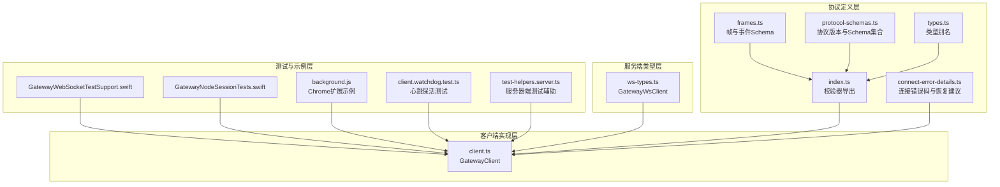
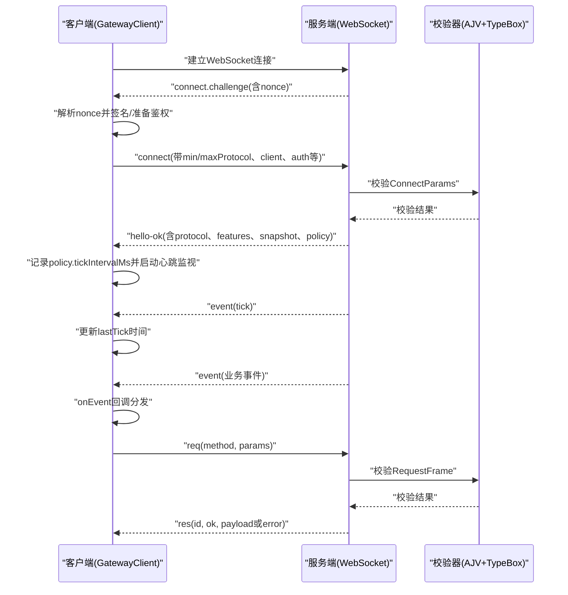
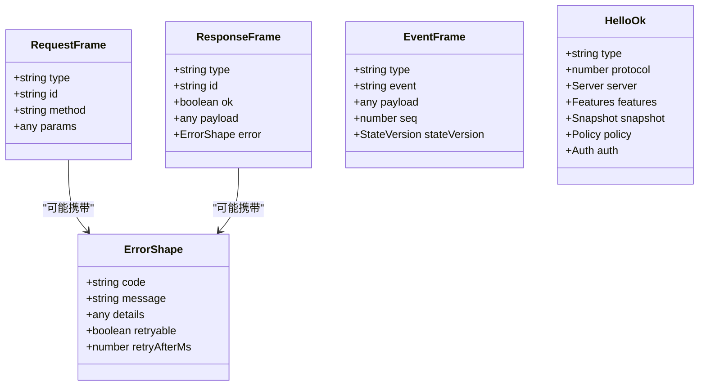
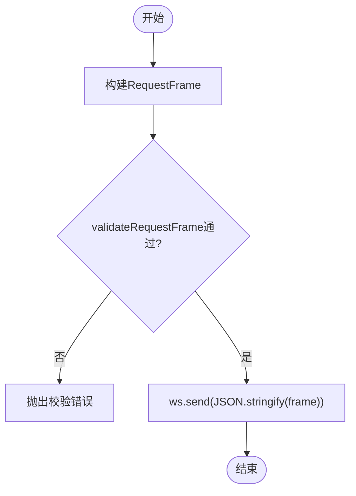
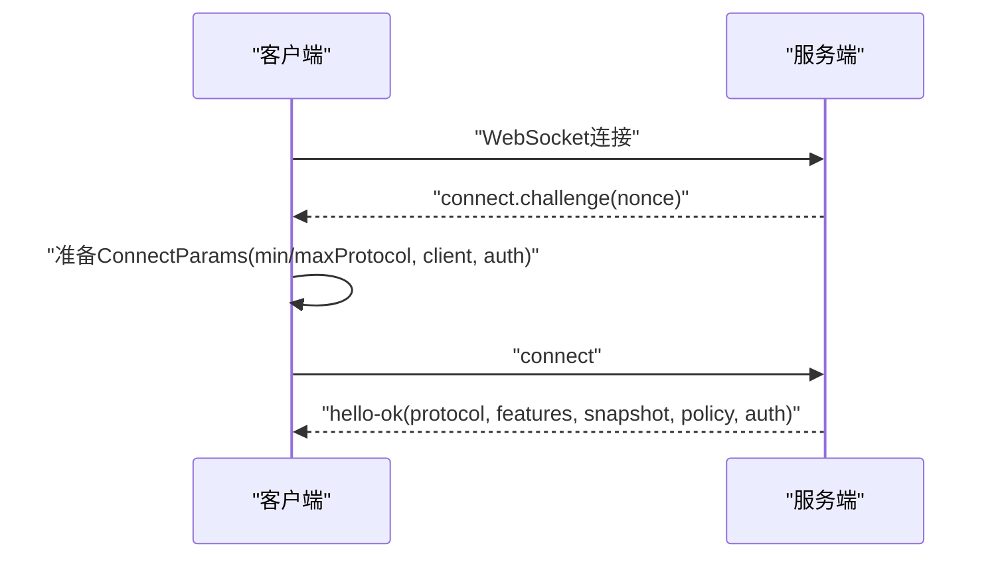
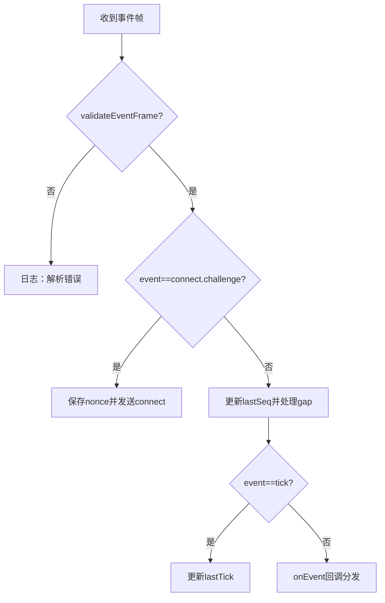
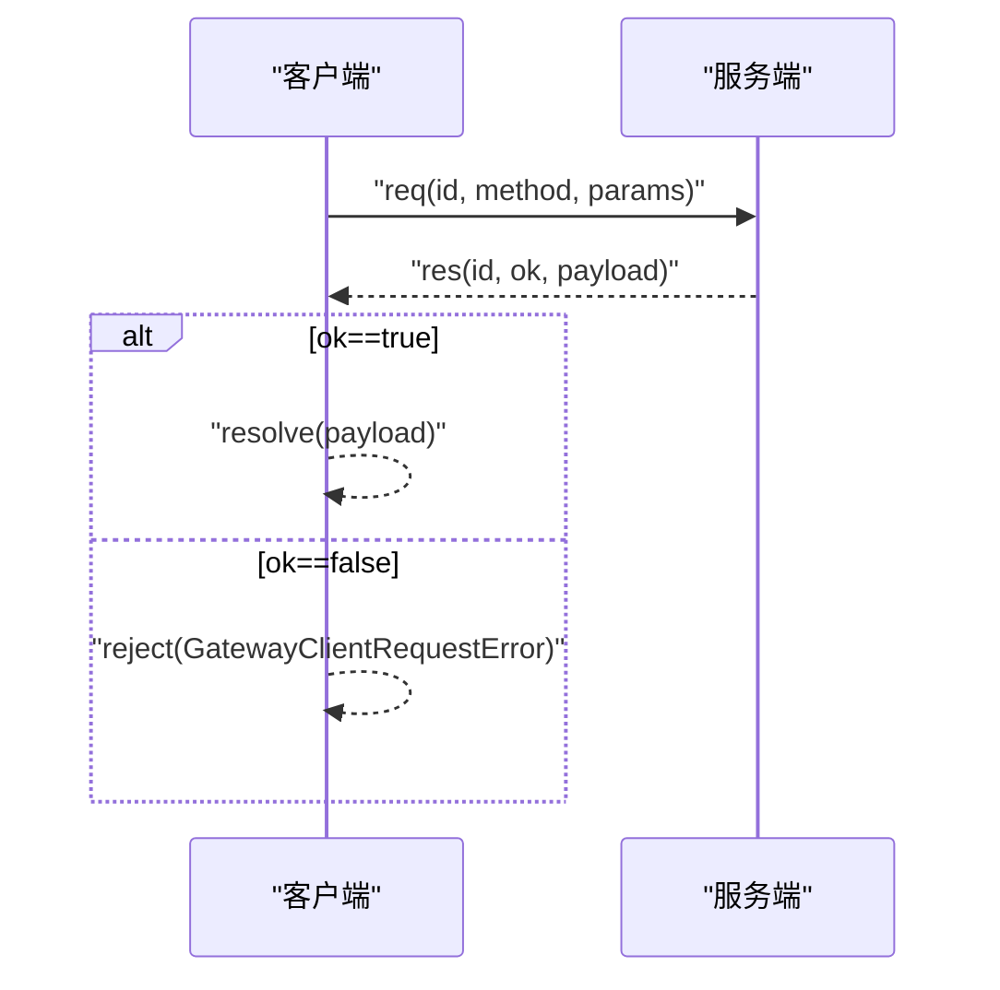
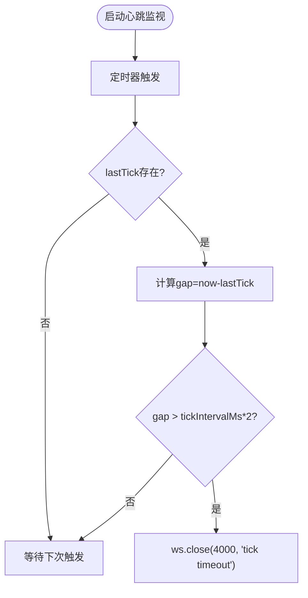
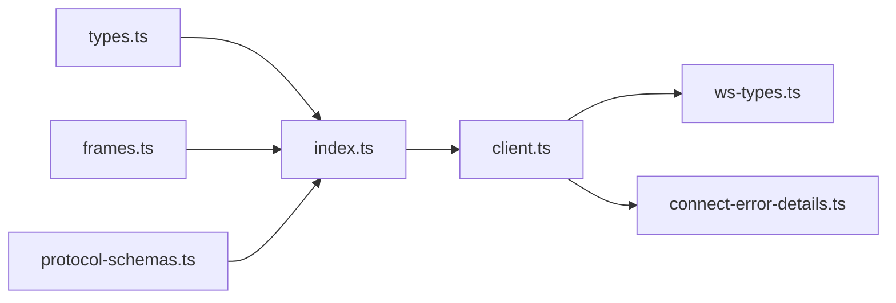

# WebSocket通信协议

<cite>
**本文引用的文件**
- [src/gateway/protocol/schema/frames.ts](file://src/gateway/protocol/schema/frames.ts)
- [src/gateway/protocol/schema/protocol-schemas.ts](file://src/gateway/protocol/schema/protocol-schemas.ts)
- [src/gateway/protocol/schema/types.ts](file://src/gateway/protocol/schema/types.ts)
- [src/gateway/protocol/index.ts](file://src/gateway/protocol/index.ts)
- [src/gateway/protocol/connect-error-details.ts](file://src/gateway/protocol/connect-error-details.ts)
- [src/gateway/client.ts](file://src/gateway/client.ts)
- [src/gateway/server/ws-types.ts](file://src/gateway/server/ws-types.ts)
- [apps/macos/Tests/OpenClawIPCTests/GatewayWebSocketTestSupport.swift](file://apps/macos/Tests/OpenClawIPCTests/GatewayWebSocketTestSupport.swift)
- [apps/shared/OpenClawKit/Tests/OpenClawKitTests/GatewayNodeSessionTests.swift](file://apps/shared/OpenClawKit/Tests/OpenClawKitTests/GatewayNodeSessionTests.swift)
- [assets/chrome-extension/background.js](file://assets/chrome-extension/background.js)
- [src/gateway/client.watchdog.test.ts](file://src/gateway/client.watchdog.test.ts)
- [src/gateway/test-helpers.server.ts](file://src/gateway/test-helpers.server.ts)
</cite>

## 目录

1. [引言](#引言)
2. [项目结构](#项目结构)
3. [核心组件](#核心组件)
4. [架构总览](#架构总览)
5. [详细组件分析](#详细组件分析)
6. [依赖关系分析](#依赖关系分析)
7. [性能考量](#性能考量)
8. [故障排查指南](#故障排查指南)
9. [结论](#结论)
10. [附录](#附录)

## 引言

本文件系统化阐述 OpenClaw 的 WebSocket 通信协议，覆盖连接建立流程、帧格式与校验、事件类型与状态同步、协议版本管理、消息序列化与反序列化、连接状态与保活机制，以及在 CLI、Web 界面与移动端之间的兼容性处理。文档同时提供关键流程的时序图与类图，帮助开发者快速理解并实现兼容的客户端。

## 项目结构

OpenClaw 的 WebSocket 协议由“协议定义层”“客户端实现层”“服务端类型层”“跨平台测试与示例层”构成：

- 协议定义层：以 TypeBox Schema 定义帧结构、参数与返回值，统一校验与生成类型。
- 客户端实现层：GatewayClient 负责握手、鉴权、请求-响应、事件分发、重连与心跳保活。
- 服务端类型层：定义网关侧 WebSocket 客户端上下文与连接元数据。
- 测试与示例层：包含 macOS/iOS 测试用例、Chrome 扩展示例、Node 端测试，验证协议行为与边界条件。

图表来源

- [src/gateway/protocol/schema/frames.ts:1-164](file://src/gateway/protocol/schema/frames.ts#L1-L164)
- [src/gateway/protocol/schema/protocol-schemas.ts:1-302](file://src/gateway/protocol/schema/protocol-schemas.ts#L1-L302)
- [src/gateway/protocol/schema/types.ts:1-132](file://src/gateway/protocol/schema/types.ts#L1-L132)
- [src/gateway/protocol/index.ts:1-673](file://src/gateway/protocol/index.ts#L1-L673)
- [src/gateway/protocol/connect-error-details.ts:1-137](file://src/gateway/protocol/connect-error-details.ts#L1-L137)
- [src/gateway/client.ts:1-674](file://src/gateway/client.ts#L1-L674)
- [src/gateway/server/ws-types.ts:1-14](file://src/gateway/server/ws-types.ts#L1-L14)
- [apps/macos/Tests/OpenClawIPCTests/GatewayWebSocketTestSupport.swift:31-71](file://apps/macos/Tests/OpenClawIPCTests/GatewayWebSocketTestSupport.swift#L31-L71)
- [apps/shared/OpenClawKit/Tests/OpenClawKitTests/GatewayNodeSessionTests.swift:104-152](file://apps/shared/OpenClawKit/Tests/OpenClawKitTests/GatewayNodeSessionTests.swift#L104-L152)
- [assets/chrome-extension/background.js:166-204](file://assets/chrome-extension/background.js#L166-L204)
- [src/gateway/client.watchdog.test.ts:1-86](file://src/gateway/client.watchdog.test.ts#L1-L86)
- [src/gateway/test-helpers.server.ts:661-704](file://src/gateway/test-helpers.server.ts#L661-L704)

章节来源

- [src/gateway/protocol/schema/frames.ts:1-164](file://src/gateway/protocol/schema/frames.ts#L1-L164)
- [src/gateway/protocol/schema/protocol-schemas.ts:1-302](file://src/gateway/protocol/schema/protocol-schemas.ts#L1-L302)
- [src/gateway/protocol/schema/types.ts:1-132](file://src/gateway/protocol/schema/types.ts#L1-L132)
- [src/gateway/protocol/index.ts:1-673](file://src/gateway/protocol/index.ts#L1-L673)
- [src/gateway/protocol/connect-error-details.ts:1-137](file://src/gateway/protocol/connect-error-details.ts#L1-L137)
- [src/gateway/client.ts:1-674](file://src/gateway/client.ts#L1-L674)
- [src/gateway/server/ws-types.ts:1-14](file://src/gateway/server/ws-types.ts#L1-L14)
- [apps/macos/Tests/OpenClawIPCTests/GatewayWebSocketTestSupport.swift:31-71](file://apps/macos/Tests/OpenClawIPCTests/GatewayWebSocketTestSupport.swift#L31-L71)
- [apps/shared/OpenClawKit/Tests/OpenClawKitTests/GatewayNodeSessionTests.swift:104-152](file://apps/shared/OpenClawKit/Tests/OpenClawKitTests/GatewayNodeSessionTests.swift#L104-L152)
- [assets/chrome-extension/background.js:166-204](file://assets/chrome-extension/background.js#L166-L204)
- [src/gateway/client.watchdog.test.ts:1-86](file://src/gateway/client.watchdog.test.ts#L1-L86)
- [src/gateway/test-helpers.server.ts:661-704](file://src/gateway/test-helpers.server.ts#L661-L704)

## 核心组件

- 帧与事件模型：通过 TypeBox 定义 req/res/event 三类帧及事件类型，确保强类型与可验证性。
- 协议版本：PROTOCOL_VERSION 指定当前协议版本，客户端通过 min/maxProtocol 进行协商。
- 客户端 GatewayClient：负责连接、鉴权、请求-响应、事件分发、重连与心跳保活。
- 服务端类型：GatewayWsClient 描述服务端对每个连接的上下文信息。
- 错误细节：ConnectErrorDetailCodes 与恢复建议，指导客户端行为与用户提示。

章节来源

- [src/gateway/protocol/schema/frames.ts:125-164](file://src/gateway/protocol/schema/frames.ts#L125-L164)
- [src/gateway/protocol/schema/protocol-schemas.ts:298-302](file://src/gateway/protocol/schema/protocol-schemas.ts#L298-L302)
- [src/gateway/client.ts:109-132](file://src/gateway/client.ts#L109-L132)
- [src/gateway/server/ws-types.ts:4-13](file://src/gateway/server/ws-types.ts#L4-L13)
- [src/gateway/protocol/connect-error-details.ts:1-137](file://src/gateway/protocol/connect-error-details.ts#L1-L137)

## 架构总览

下图展示了从客户端到服务端的典型交互路径：握手、鉴权、心跳保活、事件分发与请求-响应。

图表来源

- [src/gateway/client.ts:199-251](file://src/gateway/client.ts#L199-L251)
- [src/gateway/client.ts:497-554](file://src/gateway/client.ts#L497-L554)
- [src/gateway/client.ts:596-618](file://src/gateway/client.ts#L596-L618)
- [src/gateway/protocol/schema/frames.ts:125-164](file://src/gateway/protocol/schema/frames.ts#L125-L164)
- [src/gateway/protocol/index.ts:259-262](file://src/gateway/protocol/index.ts#L259-L262)

## 详细组件分析

### 协议帧与事件模型

- 请求帧(req)：包含 type、id、method、params；用于调用服务端方法。
- 响应帧(res)：包含 type、id、ok、payload 或 error；用于返回请求结果。
- 事件帧(event)：包含 type、event、payload、seq、stateVersion；用于推送状态变更与业务事件。
- hello-ok：握手成功后的响应，包含协议版本、特性列表、快照、策略与可选认证信息。
- 错误形状(ErrorShape)：包含 code、message、details、retryable、retryAfterMs。

图表来源

- [src/gateway/protocol/schema/frames.ts:125-164](file://src/gateway/protocol/schema/frames.ts#L125-L164)

章节来源

- [src/gateway/protocol/schema/frames.ts:1-164](file://src/gateway/protocol/schema/frames.ts#L1-L164)

### 协议版本管理与消息序列化

- 版本常量：PROTOCOL_VERSION = 3，客户端通过 min/maxProtocol 进行协商。
- 序列化：所有帧以 JSON 字符串传输；客户端在发送前进行 RequestFrame 校验。
- 校验器：AJV 编译各 Schema，提供 validateXxx 方法用于运行时校验。

图表来源

- [src/gateway/protocol/schema/protocol-schemas.ts:298-302](file://src/gateway/protocol/schema/protocol-schemas.ts#L298-L302)
- [src/gateway/protocol/index.ts:259-262](file://src/gateway/protocol/index.ts#L259-L262)
- [src/gateway/client.ts:647-672](file://src/gateway/client.ts#L647-L672)

章节来源

- [src/gateway/protocol/schema/protocol-schemas.ts:298-302](file://src/gateway/protocol/schema/protocol-schemas.ts#L298-L302)
- [src/gateway/protocol/index.ts:253-458](file://src/gateway/protocol/index.ts#L253-L458)
- [src/gateway/client.ts:647-672](file://src/gateway/client.ts#L647-L672)

### 连接建立与握手流程

- 安全检查：非 loopback 主机上的 ws:// 将被阻止，除非启用 break-glass 环境变量。
- TLS 指纹：wss:// 可配置指纹校验，避免中间人攻击。
- 握手挑战：服务端下发 connect.challenge 含 nonce；客户端收集设备/令牌/密码后发送 connect。
- 成功响应：服务端返回 hello-ok，包含 protocol、features、snapshot、policy 与可选 auth。

图表来源

- [src/gateway/client.ts:134-251](file://src/gateway/client.ts#L134-L251)
- [src/gateway/client.ts:267-415](file://src/gateway/client.ts#L267-L415)
- [src/gateway/protocol/schema/frames.ts:71-112](file://src/gateway/protocol/schema/frames.ts#L71-L112)

章节来源

- [src/gateway/client.ts:134-251](file://src/gateway/client.ts#L134-L251)
- [src/gateway/client.ts:267-415](file://src/gateway/client.ts#L267-L415)
- [src/gateway/protocol/schema/frames.ts:71-112](file://src/gateway/protocol/schema/frames.ts#L71-L112)

### 事件类型与状态同步

- 事件帧：包含 event、payload、seq、stateVersion；客户端维护 lastSeq 并在 gap 时触发 onGap 回调。
- 心跳事件：tick 事件用于保活，客户端记录 lastTick 并按 policy.tickIntervalMs 间隔检测超时。
- 快照与状态版本：hello-ok 中的 snapshot 与 stateVersion 用于客户端初始化与增量同步。

图表来源

- [src/gateway/client.ts:497-554](file://src/gateway/client.ts#L497-L554)
- [src/gateway/client.ts:596-618](file://src/gateway/client.ts#L596-L618)
- [src/gateway/protocol/schema/frames.ts:146-155](file://src/gateway/protocol/schema/frames.ts#L146-L155)

章节来源

- [src/gateway/client.ts:497-554](file://src/gateway/client.ts#L497-L554)
- [src/gateway/client.ts:596-618](file://src/gateway/client.ts#L596-L618)
- [src/gateway/protocol/schema/frames.ts:146-155](file://src/gateway/protocol/schema/frames.ts#L146-L155)

### 请求-响应与错误处理

- 请求：GatewayClient.request 生成唯一 id，等待对应 res 帧；若 expectFinal 且 status=accepted 则继续等待最终结果。
- 错误：res.ok=false 时构造 GatewayClientRequestError，包含 code、message、details，并通过 reject 抛出。
- 连接错误：connect.challenge 超时、TLS 指纹不匹配、鉴权失败等场景触发 onConnectError 或关闭连接。

图表来源

- [src/gateway/client.ts:647-672](file://src/gateway/client.ts#L647-L672)
- [src/gateway/client.ts:527-550](file://src/gateway/client.ts#L527-L550)

章节来源

- [src/gateway/client.ts:647-672](file://src/gateway/client.ts#L647-L672)
- [src/gateway/client.ts:527-550](file://src/gateway/client.ts#L527-L550)

### 心跳保活与断线重连

- 心跳保活：客户端启动定时器，周期性检查 lastTick 与 policy.tickIntervalMs\*2 的阈值，超时则主动关闭(4000)。
- 断线重连：指数退避，最大延迟 30 秒；根据错误详情决定是否暂停重连（如鉴权相关）。
- TLS 指纹校验：wss:// 下在 open 阶段再次校验证书指纹，不一致则拒绝连接。

图表来源

- [src/gateway/client.ts:596-618](file://src/gateway/client.ts#L596-L618)
- [src/gateway/client.watchdog.test.ts:39-86](file://src/gateway/client.watchdog.test.ts#L39-L86)

章节来源

- [src/gateway/client.ts:596-618](file://src/gateway/client.ts#L596-L618)
- [src/gateway/client.watchdog.test.ts:1-86](file://src/gateway/client.watchdog.test.ts#L1-L86)

### 客户端选项与兼容性

- 客户端选项：支持 url、token/deviceToken/password、instanceId、clientName/displayName/version、platform、deviceFamily、mode、role、scopes、caps、commands、permissions、pathEnv、deviceIdentity、min/maxProtocol、tlsFingerprint、回调 onEvent/onHelloOk/onConnectError/onClose/onGap。
- 兼容性：macOS/iOS 测试用例与 Chrome 扩展示例分别演示了不同平台下的连接、鉴权与事件处理方式。

章节来源

- [src/gateway/client.ts:67-96](file://src/gateway/client.ts#L67-L96)
- [apps/macos/Tests/OpenClawIPCTests/GatewayWebSocketTestSupport.swift:31-71](file://apps/macos/Tests/OpenClawIPCTests/GatewayWebSocketTestSupport.swift#L31-L71)
- [apps/shared/OpenClawKit/Tests/OpenClawKitTests/GatewayNodeSessionTests.swift:104-152](file://apps/shared/OpenClawKit/Tests/OpenClawKitTests/GatewayNodeSessionTests.swift#L104-L152)
- [assets/chrome-extension/background.js:166-204](file://assets/chrome-extension/background.js#L166-L204)

## 依赖关系分析

- 协议层依赖：TypeBox Schema → AJV 校验器 → 运行时校验函数 → 客户端/服务端使用。
- 客户端依赖：ws、设备身份与指纹工具、网络与安全工具、消息通道工具、版本信息。
- 服务端类型：GatewayWsClient 作为服务端对每个连接的上下文封装。

图表来源

- [src/gateway/protocol/schema/types.ts:1-132](file://src/gateway/protocol/schema/types.ts#L1-L132)
- [src/gateway/protocol/index.ts:1-673](file://src/gateway/protocol/index.ts#L1-L673)
- [src/gateway/client.ts:1-674](file://src/gateway/client.ts#L1-L674)
- [src/gateway/server/ws-types.ts:1-14](file://src/gateway/server/ws-types.ts#L1-L14)
- [src/gateway/protocol/connect-error-details.ts:1-137](file://src/gateway/protocol/connect-error-details.ts#L1-L137)
- [src/gateway/protocol/schema/frames.ts:1-164](file://src/gateway/protocol/schema/frames.ts#L1-L164)
- [src/gateway/protocol/schema/protocol-schemas.ts:1-302](file://src/gateway/protocol/schema/protocol-schemas.ts#L1-L302)

章节来源

- [src/gateway/protocol/schema/types.ts:1-132](file://src/gateway/protocol/schema/types.ts#L1-L132)
- [src/gateway/protocol/index.ts:1-673](file://src/gateway/protocol/index.ts#L1-L673)
- [src/gateway/client.ts:1-674](file://src/gateway/client.ts#L1-L674)
- [src/gateway/server/ws-types.ts:1-14](file://src/gateway/server/ws-types.ts#L1-L14)
- [src/gateway/protocol/connect-error-details.ts:1-137](file://src/gateway/protocol/connect-error-details.ts#L1-L137)
- [src/gateway/protocol/schema/frames.ts:1-164](file://src/gateway/protocol/schema/frames.ts#L1-L164)
- [src/gateway/protocol/schema/protocol-schemas.ts:1-302](file://src/gateway/protocol/schema/protocol-schemas.ts#L1-L302)

## 性能考量

- 最大载荷：客户端默认允许较大载荷（约 25MB），适合屏幕快照等场景。
- 背压与缓冲：policy.maxBufferedBytes 控制服务端缓冲上限，避免内存压力。
- 心跳间隔：policy.tickIntervalMs 决定保活频率，客户端会取服务端策略与最小阈值的最大值。
- 重连退避：初始 1s，最大 30s，避免风暴式重连。

章节来源

- [src/gateway/client.ts:169-172](file://src/gateway/client.ts#L169-L172)
- [src/gateway/protocol/schema/frames.ts:102-109](file://src/gateway/protocol/schema/frames.ts#L102-L109)
- [src/gateway/client.ts:576-587](file://src/gateway/client.ts#L576-L587)

## 故障排查指南

- 连接失败与错误码：参考 ConnectErrorDetailCodes 与 readConnectErrorRecoveryAdvice，识别鉴权缺失、速率限制、设备令牌不匹配等情况。
- 设备令牌清理：当服务端提示设备令牌不匹配且使用设备令牌鉴权时，客户端会清除本地缓存并提示重新配对。
- 心跳超时：若 gap 超过阈值，客户端会主动关闭(4000)，需检查网络稳定性与服务端心跳策略。
- TLS 指纹：wss:// 下指纹不匹配会导致连接被拒绝，需核对期望指纹与服务端证书一致性。
- 测试用例参考：Node 端心跳超时测试、macOS/iOS 测试用例与 Chrome 扩展示例可作为行为对照。

章节来源

- [src/gateway/protocol/connect-error-details.ts:1-137](file://src/gateway/protocol/connect-error-details.ts#L1-L137)
- [src/gateway/client.ts:219-236](file://src/gateway/client.ts#L219-L236)
- [src/gateway/client.ts:614-616](file://src/gateway/client.ts#L614-L616)
- [src/gateway/client.ts:620-645](file://src/gateway/client.ts#L620-L645)
- [src/gateway/client.watchdog.test.ts:39-86](file://src/gateway/client.watchdog.test.ts#L39-L86)
- [apps/macos/Tests/OpenClawIPCTests/GatewayWebSocketTestSupport.swift:31-71](file://apps/macos/Tests/OpenClawIPCTests/GatewayWebSocketTestSupport.swift#L31-L71)
- [apps/shared/OpenClawKit/Tests/OpenClawKitTests/GatewayNodeSessionTests.swift:104-152](file://apps/shared/OpenClawKit/Tests/OpenClawKitTests/GatewayNodeSessionTests.swift#L104-L152)
- [assets/chrome-extension/background.js:166-204](file://assets/chrome-extension/background.js#L166-L204)

## 结论

OpenClaw 的 WebSocket 协议以强类型 Schema 为基础，结合严格的校验与清晰的帧模型，提供了可靠的连接、鉴权、事件与请求-响应机制。通过心跳保活与智能重连策略，保障在不稳定网络环境下的稳健性。跨平台测试与示例进一步验证了协议在 CLI、Web 与移动端的一致性与兼容性。

## 附录

- 服务器端测试辅助：提供 connectOk 与 connectWebchatClient 等便捷方法，便于集成测试与端到端验证。
- 服务器端类型：GatewayWsClient 统一描述连接上下文，便于服务端路由与状态管理。

章节来源

- [src/gateway/test-helpers.server.ts:661-704](file://src/gateway/test-helpers.server.ts#L661-L704)
- [src/gateway/server/ws-types.ts:4-13](file://src/gateway/server/ws-types.ts#L4-L13)
