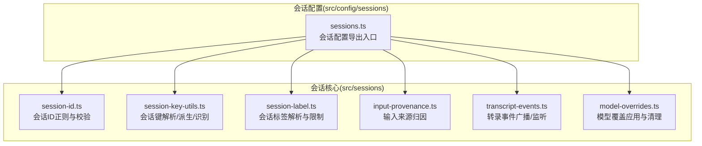
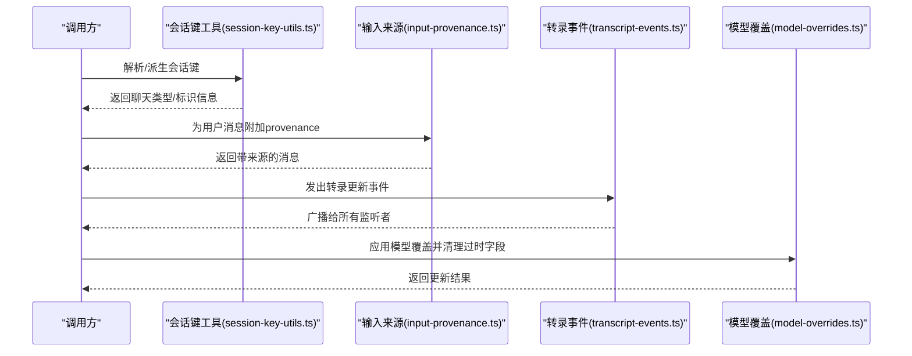
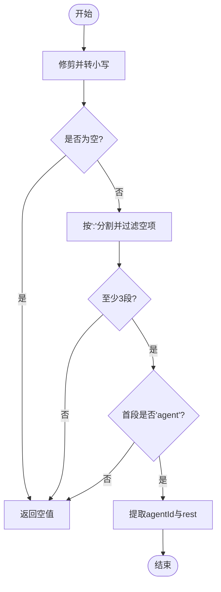
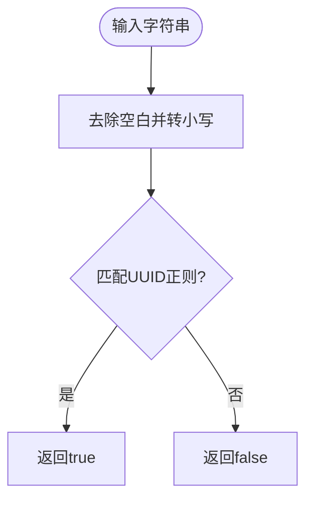
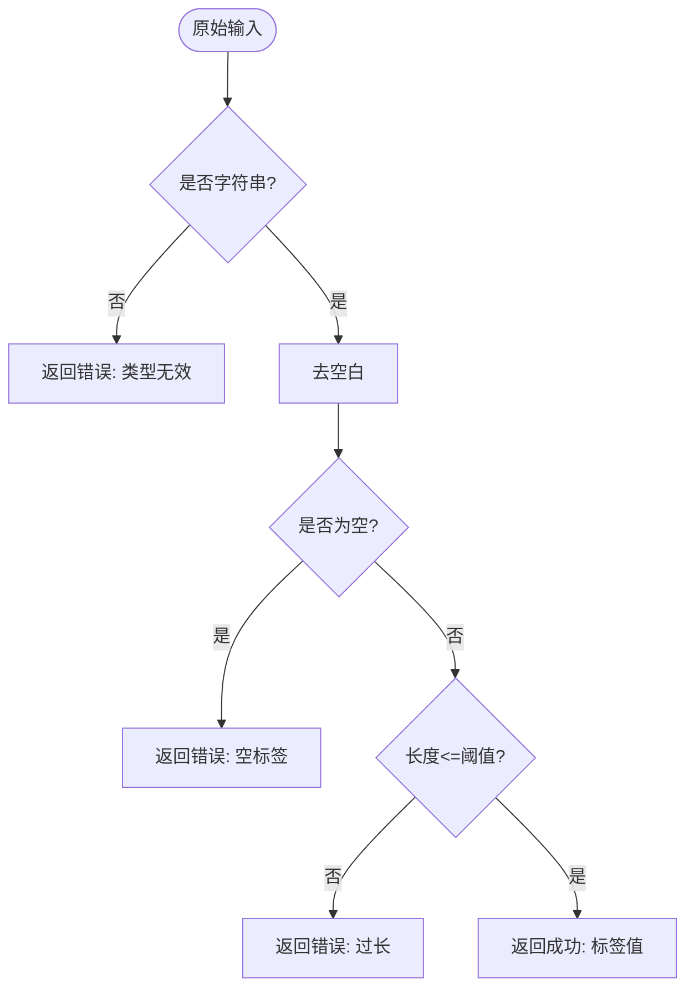
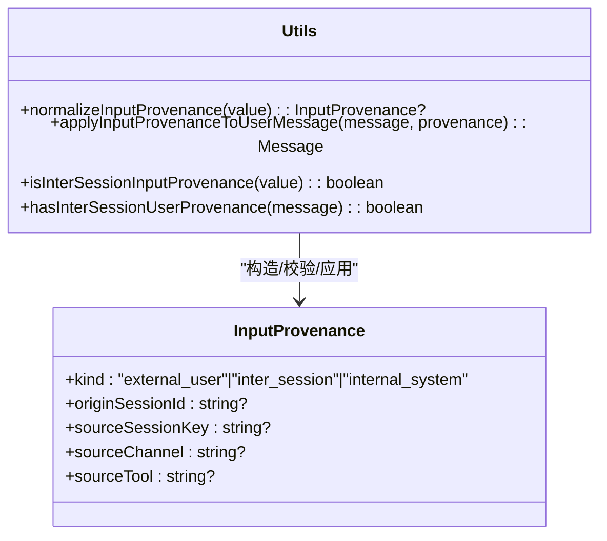
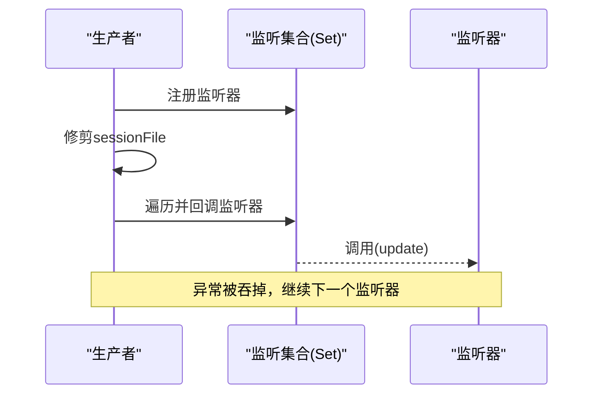
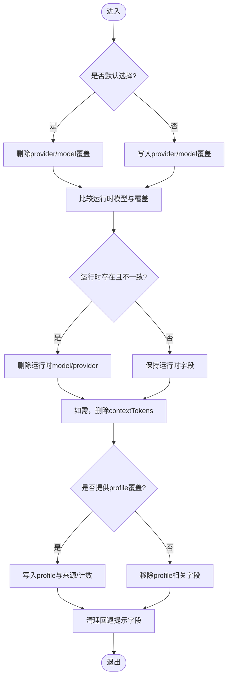
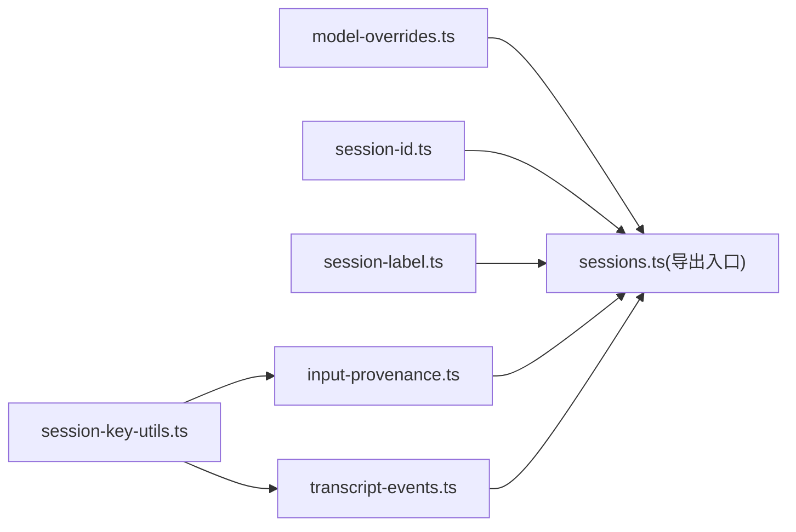

# 会话管理机制

<cite>
**本文引用的文件**
- [src/sessions/session-id.ts](file://src/sessions/session-id.ts)
- [src/sessions/session-key-utils.ts](file://src/sessions/session-key-utils.ts)
- [src/sessions/session-label.ts](file://src/sessions/session-label.ts)
- [src/sessions/input-provenance.ts](file://src/sessions/input-provenance.ts)
- [src/sessions/transcript-events.ts](file://src/sessions/transcript-events.ts)
- [src/sessions/model-overrides.ts](file://src/sessions/model-overrides.ts)
- [src/config/sessions.ts](file://src/config/sessions.ts)
</cite>

## 目录

1. [简介](#简介)
2. [项目结构](#项目结构)
3. [核心组件](#核心组件)
4. [架构总览](#架构总览)
5. [详细组件分析](#详细组件分析)
6. [依赖关系分析](#依赖关系分析)
7. [性能考量](#性能考量)
8. [故障排查指南](#故障排查指南)
9. [结论](#结论)
10. [附录](#附录)

## 简介

本文件系统性阐述 OpenClaw 的会话管理机制，聚焦以下主题：

- 会话生命周期：从创建、更新到销毁的完整流程与关键节点
- 会话键生成与解析规则：会话键的规范、分层与派生逻辑
- 会话状态同步：事件广播与监听机制
- 会话数据持久化：会话文件路径、转录与磁盘预算策略
- 并发访问控制：写锁与线程安全考虑
- 多客户端环境下的同步策略：状态一致性、冲突解决与会话迁移

本文件以仓库现有实现为依据，结合代码级图示与流程图，帮助读者快速理解并正确使用会话管理能力。

## 项目结构

OpenClaw 将会话相关能力集中在 src/sessions 与 src/config/sessions 两个子系统：

- src/sessions：会话键解析、会话标签、输入来源、转录事件、模型覆盖等通用工具
- src/config/sessions：会话配置导出入口，聚合会话主流程、存储、转录、路径等模块

图表来源

- [src/sessions/session-id.ts:1-6](file://src/sessions/session-id.ts#L1-L6)
- [src/sessions/session-key-utils.ts:1-133](file://src/sessions/session-key-utils.ts#L1-L133)
- [src/sessions/session-label.ts:1-21](file://src/sessions/session-label.ts#L1-L21)
- [src/sessions/input-provenance.ts:1-82](file://src/sessions/input-provenance.ts#L1-L82)
- [src/sessions/transcript-events.ts:1-30](file://src/sessions/transcript-events.ts#L1-L30)
- [src/sessions/model-overrides.ts:1-113](file://src/sessions/model-overrides.ts#L1-L113)
- [src/config/sessions.ts:1-14](file://src/config/sessions.ts#L1-L14)

章节来源

- [src/config/sessions.ts:1-14](file://src/config/sessions.ts#L1-L14)

## 核心组件

- 会话标识符校验：提供 UUID 正则与校验函数，确保会话 ID 合法性
- 会话键解析与派生：支持 agent-scoped 键解析、聊天类型推断、cron/subagent/acp 标识、线程父键解析
- 会话标签解析：对标签进行长度与格式约束，避免非法值
- 输入来源归因：为用户消息附加 provenance，支持跨会话来源追踪
- 转录事件广播：提供事件监听注册与广播，驱动外部组件响应
- 模型覆盖应用：将用户选择或默认模型覆盖写入会话条目，并清理过时运行时字段

章节来源

- [src/sessions/session-id.ts:1-6](file://src/sessions/session-id.ts#L1-L6)
- [src/sessions/session-key-utils.ts:1-133](file://src/sessions/session-key-utils.ts#L1-L133)
- [src/sessions/session-label.ts:1-21](file://src/sessions/session-label.ts#L1-L21)
- [src/sessions/input-provenance.ts:1-82](file://src/sessions/input-provenance.ts#L1-L82)
- [src/sessions/transcript-events.ts:1-30](file://src/sessions/transcript-events.ts#L1-L30)
- [src/sessions/model-overrides.ts:1-113](file://src/sessions/model-overrides.ts#L1-L113)

## 架构总览

下图展示了会话管理的关键交互：会话键解析与派生作为入口，输入来源归因贯穿消息处理，转录事件驱动外部订阅者，模型覆盖影响会话运行时状态。

图表来源

- [src/sessions/session-key-utils.ts:12-59](file://src/sessions/session-key-utils.ts#L12-L59)
- [src/sessions/input-provenance.ts:50-68](file://src/sessions/input-provenance.ts#L50-L68)
- [src/sessions/transcript-events.ts:9-29](file://src/sessions/transcript-events.ts#L9-L29)
- [src/sessions/model-overrides.ts:9-112](file://src/sessions/model-overrides.ts#L9-L112)

## 详细组件分析

### 组件一：会话键生成与解析（session-key-utils）

- 规范与解析
  - 支持 agent-scoped 键解析，统一大小写与修剪，返回 agentId 与 rest 部分
  - 对空/非法键返回空值，保证后续派生逻辑安全
- 聊天类型推断
  - 基于 tokens 判断 direct/group/channel；兼容 legacy Discord 格式
  - 无法识别时返回 unknown
- 专用键识别
  - cron/cron-run、subagent、acp 等键前缀识别
  - 提供子代理深度计算与线程父键解析
- 复杂度与性能
  - 解析与派生主要为字符串分割与正则匹配，时间复杂度 O(n)，空间开销与输入长度线性相关

图表来源

- [src/sessions/session-key-utils.ts:12-32](file://src/sessions/session-key-utils.ts#L12-L32)

章节来源

- [src/sessions/session-key-utils.ts:1-133](file://src/sessions/session-key-utils.ts#L1-L133)

### 组件二：会话标识符校验（session-id）

- 功能
  - 提供 UUID 正则与校验函数，用于判断字符串是否符合标准 UUID 格式
- 使用场景
  - 会话 ID 生成后验证、外部输入校验、路由与存储键一致性检查

图表来源

- [src/sessions/session-id.ts:1-6](file://src/sessions/session-id.ts#L1-L6)

章节来源

- [src/sessions/session-id.ts:1-6](file://src/sessions/session-id.ts#L1-L6)

### 组件三：会话标签解析（session-label）

- 功能
  - 校验标签类型、长度与空值，设定最大长度常量
  - 返回解析结果对象，包含 ok 与错误信息
- 用途
  - 会话元数据中的标签字段标准化，避免非法值进入存储

图表来源

- [src/sessions/session-label.ts:5-20](file://src/sessions/session-label.ts#L5-L20)

章节来源

- [src/sessions/session-label.ts:1-21](file://src/sessions/session-label.ts#L1-L21)

### 组件四：输入来源归因（input-provenance）

- 数据结构
  - InputProvenance 包含 kind、originSessionId、sourceSessionKey、sourceChannel、sourceTool
- 归因策略
  - 标准化可选字符串字段，仅对用户消息追加 provenance
  - 支持 inter_session 来源识别与跨会话消息检测
- 与会话的关系
  - 为消息处理链路提供来源上下文，便于审计与路由

图表来源

- [src/sessions/input-provenance.ts:11-17](file://src/sessions/input-provenance.ts#L11-L17)
- [src/sessions/input-provenance.ts:33-48](file://src/sessions/input-provenance.ts#L33-L48)
- [src/sessions/input-provenance.ts:50-68](file://src/sessions/input-provenance.ts#L50-L68)
- [src/sessions/input-provenance.ts:70-82](file://src/sessions/input-provenance.ts#L70-L82)

章节来源

- [src/sessions/input-provenance.ts:1-82](file://src/sessions/input-provenance.ts#L1-L82)

### 组件五：转录事件广播（transcript-events）

- 事件模型
  - 定义更新结构与监听器签名
  - 内部维护监听集合，支持注册与注销
- 广播机制
  - 发出事件时对文件名修剪，忽略空值
  - 遍历监听集合逐一回调，异常静默，避免单点失败影响整体
- 作用
  - 作为会话转录文件变更的观察者模式，驱动外部组件刷新或持久化

图表来源

- [src/sessions/transcript-events.ts:7-29](file://src/sessions/transcript-events.ts#L7-L29)

章节来源

- [src/sessions/transcript-events.ts:1-30](file://src/sessions/transcript-events.ts#L1-L30)

### 组件六：模型覆盖应用（model-overrides）

- 功能
  - 将 provider/model 选择写入会话条目，必要时删除过时运行时字段
  - 当覆盖发生变化或与运行时不一致时，清理缓存窗口与回退提示
  - 可选地设置认证配置覆盖及其来源
- 更新语义
  - 返回 updated 标志，便于上层决定是否触发持久化或刷新
- 与会话状态一致性
  - 清理 stale 字段，确保状态显示与当前选择一致

图表来源

- [src/sessions/model-overrides.ts:9-112](file://src/sessions/model-overrides.ts#L9-L112)

章节来源

- [src/sessions/model-overrides.ts:1-113](file://src/sessions/model-overrides.ts#L1-L113)

### 组件七：会话配置导出入口（sessions.ts）

- 职责
  - 聚合会话相关模块，统一对外导出，便于上层按需引入
- 关联模块
  - 主会话、存储、转录、路径、磁盘预算、交付信息等

章节来源

- [src/config/sessions.ts:1-14](file://src/config/sessions.ts#L1-L14)

## 依赖关系分析

- 组件耦合
  - session-key-utils 与 input-provenance 在“会话键”维度耦合（前者解析，后者使用）
  - transcript-events 与 session-key-utils 通过会话文件名形成弱耦合（前者广播，后者解析）
  - model-overrides 与 sessions.ts 导出入口形成间接耦合（覆盖写入会话条目）
- 外部依赖
  - 无直接外部库依赖，纯工具函数组合
- 循环依赖
  - 未发现循环导入，模块职责清晰

图表来源

- [src/sessions/session-key-utils.ts:12-59](file://src/sessions/session-key-utils.ts#L12-L59)
- [src/sessions/input-provenance.ts:50-68](file://src/sessions/input-provenance.ts#L50-L68)
- [src/sessions/transcript-events.ts:9-29](file://src/sessions/transcript-events.ts#L9-L29)
- [src/sessions/model-overrides.ts:9-112](file://src/sessions/model-overrides.ts#L9-L112)
- [src/sessions/session-id.ts:1-6](file://src/sessions/session-id.ts#L1-L6)
- [src/sessions/session-label.ts:1-21](file://src/sessions/session-label.ts#L1-L21)
- [src/config/sessions.ts:1-14](file://src/config/sessions.ts#L1-L14)

## 性能考量

- 字符串处理为主：键解析、标签校验、正则匹配均为 O(n) 时间复杂度
- 监听集合遍历：转录事件广播为 O(k)（k 为监听数量），建议控制监听器数量
- 覆盖清理：仅在覆盖变化或不一致时清理运行时字段，避免频繁写操作
- 建议
  - 对高频键解析场景，可缓存解析结果
  - 控制监听器数量，避免广播放大
  - 批量应用模型覆盖后再触发持久化

## 故障排查指南

- 会话键解析失败
  - 检查键格式是否符合 agent:agentId:... 规范
  - 确认大小写与空白处理是否正确
  - 参考：[parseAgentSessionKey:12-32](file://src/sessions/session-key-utils.ts#L12-L32)
- 聊天类型识别异常
  - 确认 tokens 是否包含 group/channel/direct/dm
  - 兼容 legacy Discord 格式
  - 参考：[deriveSessionChatType:37-59](file://src/sessions/session-key-utils.ts#L37-L59)
- 输入来源未生效
  - 确保消息角色为 user，且未已有 provenance
  - 参考：[applyInputProvenanceToUserMessage:50-68](file://src/sessions/input-provenance.ts#L50-L68)
- 转录事件未触发
  - 检查 sessionFile 是否为空或未修剪
  - 确认监听器已注册且未抛异常
  - 参考：[emitSessionTranscriptUpdate/onSessionTranscriptUpdate:9-29](file://src/sessions/transcript-events.ts#L9-L29)
- 模型覆盖未生效
  - 确认覆盖是否为默认选择或与运行时一致
  - 检查是否清理了运行时字段与 contextTokens
  - 参考：[applyModelOverrideToSessionEntry:9-112](file://src/sessions/model-overrides.ts#L9-L112)

章节来源

- [src/sessions/session-key-utils.ts:12-59](file://src/sessions/session-key-utils.ts#L12-L59)
- [src/sessions/input-provenance.ts:50-68](file://src/sessions/input-provenance.ts#L50-L68)
- [src/sessions/transcript-events.ts:9-29](file://src/sessions/transcript-events.ts#L9-L29)
- [src/sessions/model-overrides.ts:9-112](file://src/sessions/model-overrides.ts#L9-L112)

## 结论

OpenClaw 的会话管理以“键解析/派生 + 输入来源归因 + 转录事件 + 模型覆盖”为核心，配合会话配置导出入口形成清晰的模块边界。该设计在保证功能完备的同时，兼顾了可扩展性与可维护性。实际部署中，建议结合监听器数量、键解析频率与覆盖变更频次进行性能优化，并严格遵循键格式与标签长度约束，确保会话状态的一致性与可追溯性。

## 附录

- 会话标识符生成与校验
  - 参考：[SESSION_ID_RE/looksLikeSessionId:1-6](file://src/sessions/session-id.ts#L1-L6)
- 会话键解析与派生
  - 参考：[parseAgentSessionKey/deriveSessionChatType/isCronSessionKey/isSubagentSessionKey/isAcpSessionKey/resolveThreadParentSessionKey:12-133](file://src/sessions/session-key-utils.ts#L12-L133)
- 会话标签解析
  - 参考：[SESSION_LABEL_MAX_LENGTH/parseSessionLabel:1-21](file://src/sessions/session-label.ts#L1-L21)
- 输入来源归因
  - 参考：[InputProvenance/normalizeInputProvenance/applyInputProvenanceToUserMessage:11-68](file://src/sessions/input-provenance.ts#L11-L68)
- 转录事件广播
  - 参考：[onSessionTranscriptUpdate/emitSessionTranscriptUpdate:9-29](file://src/sessions/transcript-events.ts#L9-L29)
- 模型覆盖应用
  - 参考：[applyModelOverrideToSessionEntry:9-112](file://src/sessions/model-overrides.ts#L9-L112)
- 会话配置导出入口
  - 参考：[sessions.ts 导出列表:1-14](file://src/config/sessions.ts#L1-L14)
