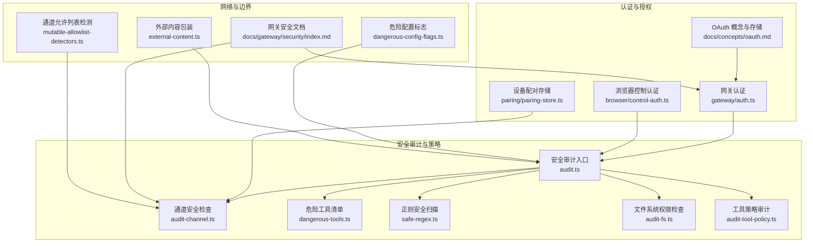
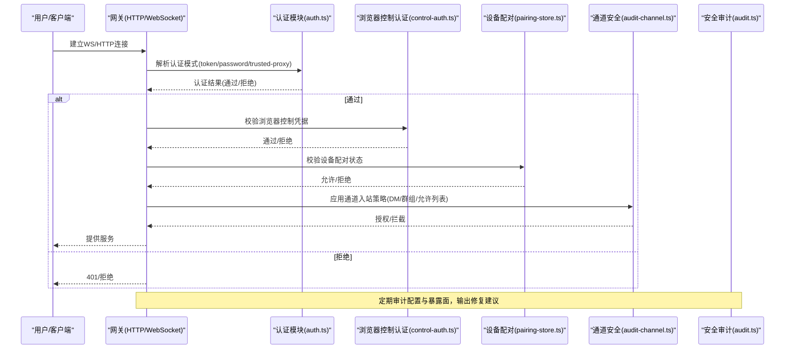
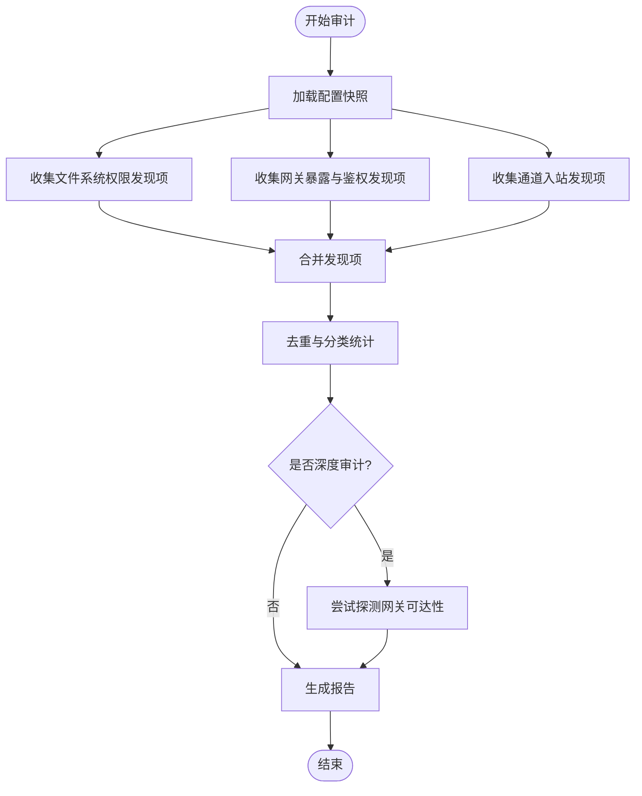
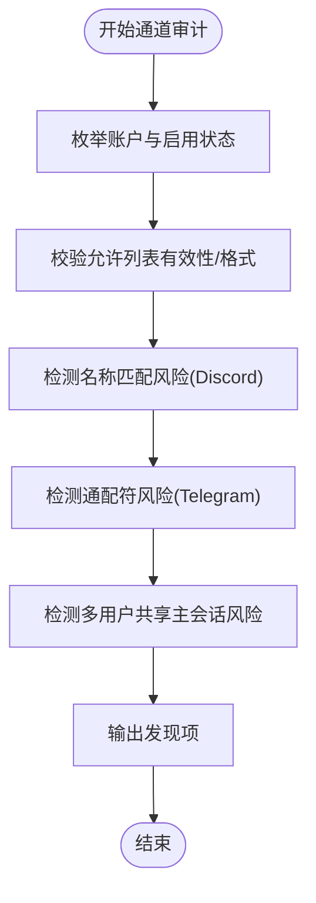
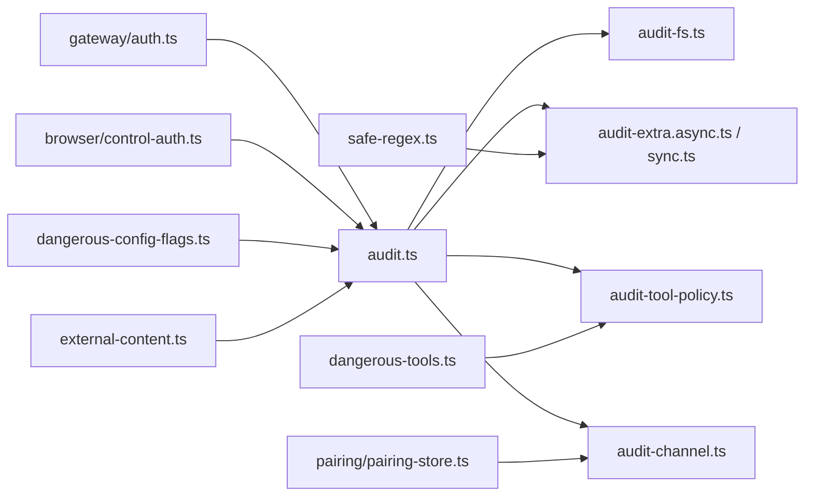

# 安全认证体系

<cite>
**本文引用的文件**
- [src/security/audit.ts](file://src/security/audit.ts)
- [src/security/audit-channel.ts](file://src/security/audit-channel.ts)
- [src/security/audit-extra.ts](file://src/security/audit-extra.ts)
- [src/security/dangerous-tools.ts](file://src/security/dangerous-tools.ts)
- [src/security/safe-regex.ts](file://src/security/safe-regex.ts)
- [docs/gateway/security/index.md](file://docs/gateway/security/index.md)
- [docs/concepts/oauth.md](file://docs/concepts/oauth.md)
- [src/gateway/auth.ts](file://src/gateway/auth.ts)
- [src/browser/control-auth.ts](file://src/browser/control-auth.ts)
- [src/pairing/pairing-store.ts](file://src/pairing/pairing-store.ts)
- [src/channels/telegram/allow-from.ts](file://src/channels/telegram/allow-from.ts)
- [src/security/mutable-allowlist-detectors.ts](file://src/security/mutable-allowlist-detectors.ts)
- [src/security/dangerous-config-flags.ts](file://src/security/dangerous-config-flags.ts)
- [src/security/external-content.ts](file://src/security/external-content.ts)
- [src/security/skill-scanner.ts](file://src/security/skill-scanner.ts)
- [src/security/windows-acl.ts](file://src/security/windows-acl.ts)
- [src/security/temp-path-guard.ts](file://src/security/temp-path-guard.ts)
- [src/security/secret-equal.ts](file://src/security/secret-equal.ts)
- [src/security/scan-paths.ts](file://src/security/scan-paths.ts)
- [src/security/fix.ts](file://src/security/fix.ts)
- [src/security/fix.test.ts](file://src/security/fix.test.ts)
- [src/security/audit.test.ts](file://src/security/audit.test.ts)
- [src/security/audit-fs.ts](file://src/security/audit-fs.ts)
- [src/security/audit-tool-policy.ts](file://src/security/audit-tool-policy.ts)
- [src/security/audit-extra.async.ts](file://src/security/audit-extra.async.ts)
- [src/security/audit-extra.sync.ts](file://src/security/audit-extra.sync.ts)
- [src/security/audit-extra.sync.test.ts](file://src/security/audit-extra.sync.test.ts)
- [src/security/audit-fs.ts](file://src/security/audit-fs.ts)
- [src/security/audit-fs.test.ts](file://src/security/audit-fs.test.ts)
- [src/security/audit-tool-policy.ts](file://src/security/audit-tool-policy.ts)
- [src/security/audit-tool-policy.test.ts](file://src/security/audit-tool-policy.test.ts)
- [src/security/audit-channel.test.ts](file://src/security/audit-channel.test.ts)
- [src/security/audit-extra.async.test.ts](file://src/security/audit-extra.async.test.ts)
- [src/security/audit-extra.sync.test.ts](file://src/security/audit-extra.sync.test.ts)
- [src/security/audit-fs.test.ts](file://src/security/audit-fs.test.ts)
- [src/security/audit-tool-policy.test.ts](file://src/security/audit-tool-policy.test.ts)
- [src/security/audit-channel.test.ts](file://src/security/audit-channel.test.ts)
- [src/security/audit-extra.async.test.ts](file://src/security/audit-extra.async.test.ts)
- [src/security/audit-extra.sync.test.ts](file://src/security/audit-extra.sync.test.ts)
- [src/security/audit-fs.test.ts](file://src/security/audit-fs.test.ts)
- [src/security/audit-tool-policy.test.ts](file://src/security/audit-tool-policy.test.ts)
- [src/security/audit-channel.test.ts](file://src/security/audit-channel.test.ts)
- [src/security/audit-extra.async.test.ts](file://src/security/audit-extra.async.test.ts)
- [src/security/audit-extra.sync.test.ts](file://src/security/audit-extra.sync.test.ts)
- [src/security/audit-fs.test.ts](file://src/security/audit-fs.test.ts)
- [src/security/audit-tool-policy.test.ts](file://src/security/audit-tool-policy.test.ts)
- [src/security/audit-channel.test.ts](file://src/security/audit-channel.test.ts)
- [src/security/audit-extra.async.test.ts](file://src/security/audit-extra.async.test.ts)
- [src/security/audit-extra.sync.test.ts](file://src/security/audit-extra.sync.test.ts)
- [src/security/audit-fs.test.ts](file://src/security/audit-fs.test.ts)
- [src/security/audit-tool-policy.test.ts](file://src/security/audit-tool-policy.test.ts)
- [src/security/audit-channel.test.ts](file://src/security/audit-channel.test.ts)
- [src/security/audit-extra.async.test.ts](file://src/security/audit-extra.async.test.ts)
- [src/security/audit-extra.sync.test.ts](file://src/security/audit-extra.sync.test.ts)
- [src/security/audit-fs.test.ts](file://src/security/audit-fs.test.ts)
- [src/security/audit-tool-policy.test.ts](file://src/security/audit-tool-policy.test.ts)
- [src/security/audit-channel.test.ts](file://src/security/audit-channel.test.ts)
- [src/security/audit-extra.async.test.ts](file://src/security/audit-extra.async.test.ts)
- [src/security/audit-extra.sync.test.ts](file://src/security/audit-extra.sync.test.ts)
- [src/security/audit-fs.test.ts](file://src/security/audit-fs.test.ts)
- [src/security/audit-tool-policy.test.ts](file://src/security/audit-tool-policy.test.ts)
- [src/security/audit-channel.test.ts](file://src/security/audit-channel.test.ts)
- [src/security/audit-extra.async.test.ts](file://src/security/audit-extra.async.test.ts)
- [src/security/audit-extra.sync.test.ts](......)
</cite>

## 目录

1. [简介](#简介)
2. [项目结构](#项目结构)
3. [核心组件](#核心组件)
4. [架构总览](#架构总览)
5. [详细组件分析](#详细组件分析)
6. [依赖关系分析](#依赖关系分析)
7. [性能考量](#性能考量)
8. [故障排查指南](#故障排查指南)
9. [结论](#结论)
10. [附录](#附录)

## 简介

本文件系统化梳理 OpenClaw 的安全认证体系，覆盖多重认证机制（API 密钥、OAuth、设备配对）、访问控制策略（通道入站授权、工具面限制、会话隔离）、安全边界管理（网关绑定与鉴权、反向代理与 Origin 校验、Tailscale 身份注入）、跨域请求控制、令牌与凭据管理、权限验证逻辑、以及在不同网络环境（本地、远程、Tailscale 隧道）下的安全处理。同时给出安全审计与异常检测、攻击防护机制的实践建议，并以图示方式呈现关键流程。

## 项目结构

OpenClaw 将安全能力集中在 src/security 子模块与 docs/gateway/security 文档中，配合网关与浏览器控制认证模块、通道安全检查器、危险工具清单、正则安全扫描等子系统协同工作，形成“配置审计—通道入站—工具面—会话与设备—网络边界”的闭环。

图表来源

- [src/security/audit.ts](file://src/security/audit.ts)
- [src/security/audit-channel.ts](file://src/security/audit-channel.ts)
- [src/security/dangerous-tools.ts](file://src/security/dangerous-tools.ts)
- [src/security/safe-regex.ts](file://src/security/safe-regex.ts)
- [src/security/audit-fs.ts](file://src/security/audit-fs.ts)
- [src/security/audit-tool-policy.ts](file://src/security/audit-tool-policy.ts)
- [src/gateway/auth.ts](file://src/gateway/auth.ts)
- [src/browser/control-auth.ts](file://src/browser/control-auth.ts)
- [docs/concepts/oauth.md](file://docs/concepts/oauth.md)
- [src/pairing/pairing-store.ts](file://src/pairing/pairing-store.ts)
- [docs/gateway/security/index.md](file://docs/gateway/security/index.md)
- [src/security/mutable-allowlist-detectors.ts](file://src/security/mutable-allowlist-detectors.ts)
- [src/security/dangerous-config-flags.ts](file://src/security/dangerous-config-flags.ts)
- [src/security/external-content.ts](file://src/security/external-content.ts)

章节来源

- [src/security/audit.ts](file://src/security/audit.ts)
- [src/security/audit-channel.ts](file://src/security/audit-channel.ts)
- [docs/gateway/security/index.md](file://docs/gateway/security/index.md)

## 核心组件

- 安全审计引擎：统一收集并汇总文件系统权限、网关暴露与鉴权、通道入站策略、工具面风险、插件与模型卫生等发现项，支持深度探测与自动修复建议。
- 通道安全检查器：针对 Discord、Slack、Telegram 等通道的 DM/群组策略、允许列表、名称匹配风险进行专项审计。
- 危险工具清单：集中定义默认禁止通过 HTTP 工具调用的高危动作集合，防止远程会话编排与控制面操作越权。
- 正则安全扫描：对配置中的正则表达式进行嵌套重复模式检测，避免 ReDoS 风险。
- 网关认证与浏览器控制认证：提供共享密钥（token/password）、受信代理（trusted-proxy）与 Tailscale 身份注入等多种认证模式。
- 设备配对与会话隔离：通过配对码与允许列表控制未知发送者，结合会话作用域隔离降低跨用户上下文泄露风险。
- 外部内容包装与危险配置标志：对外部输入进行安全封装，禁用调试/危险开关，降低误配置带来的攻击面。

章节来源

- [src/security/audit.ts](file://src/security/audit.ts)
- [src/security/audit-channel.ts](file://src/security/audit-channel.ts)
- [src/security/dangerous-tools.ts](file://src/security/dangerous-tools.ts)
- [src/security/safe-regex.ts](file://src/security/safe-regex.ts)
- [src/gateway/auth.ts](file://src/gateway/auth.ts)
- [src/browser/control-auth.ts](file://src/browser/control-auth.ts)
- [src/pairing/pairing-store.ts](file://src/pairing/pairing-store.ts)
- [src/security/external-content.ts](file://src/security/external-content.ts)
- [src/security/dangerous-config-flags.ts](file://src/security/dangerous-config-flags.ts)

## 架构总览

下图展示从配置到运行时的认证与访问控制链路，强调“身份—范围—模型”的分层思路与多层边界：

图表来源

- [src/gateway/auth.ts](file://src/gateway/auth.ts)
- [src/browser/control-auth.ts](file://src/browser/control-auth.ts)
- [src/pairing/pairing-store.ts](file://src/pairing/pairing-store.ts)
- [src/security/audit-channel.ts](file://src/security/audit-channel.ts)
- [src/security/audit.ts](file://src/security/audit.ts)

章节来源

- [docs/gateway/security/index.md](file://docs/gateway/security/index.md)
- [src/security/audit.ts](file://src/security/audit.ts)

## 详细组件分析

### 组件A：安全审计引擎（audit.ts）

- 功能要点
  - 聚合文件系统权限、网关暴露与鉴权、通道入站策略、工具面风险、插件与模型卫生等发现项。
  - 支持深度探测（如网关可达性探测）与自动修复建议（权限修正、配置重写）。
  - 分类统计严重级别（info/warn/critical），便于优先处置。
- 关键流程
  - 配置快照读取与缓存，避免重复 I/O。
  - 并行执行同步与异步检查器，合并结果并去重。
  - 输出包含时间戳、汇总与逐条发现的报告对象。
- 性能与可靠性
  - 异步检查器使用缓存（如代码安全摘要缓存）减少重复计算。
  - 对文件系统权限检查进行平台适配（Windows ACL）。

图表来源

- [src/security/audit.ts](file://src/security/audit.ts)
- [src/security/audit-extra.async.ts](file://src/security/audit-extra.async.ts)
- [src/security/audit-extra.sync.ts](file://src/security/audit-extra.sync.ts)

章节来源

- [src/security/audit.ts](file://src/security/audit.ts)
- [src/security/audit-extra.ts](file://src/security/audit-extra.ts)

### 组件B：通道安全检查器（audit-channel.ts）

- 功能要点
  - 针对 Discord、Slack、Telegram 等通道的 DM/群组策略、允许列表、名称匹配风险进行专项审计。
  - 自动检测无效/非数字的 Telegram 允许列表条目、通配符风险、未配置允许列表导致的命令放行等。
  - 对 Discord 名称/标签匹配启用情况进行提示，区分“断发玻璃模式”与默认硬化行为。
- 关键流程
  - 解析账户与启用状态，按通道插件维度遍历。
  - 计算 DM/群组策略与允许列表的组合状态，识别多用户共享主会话的风险。
  - 输出严重级别可区分的发现项（info/warn/critical）。

图表来源

- [src/security/audit-channel.ts](file://src/security/audit-channel.ts)
- [src/channels/telegram/allow-from.ts](file://src/channels/telegram/allow-from.ts)
- [src/security/mutable-allowlist-detectors.ts](file://src/security/mutable-allowlist-detectors.ts)

章节来源

- [src/security/audit-channel.ts](file://src/security/audit-channel.ts)

### 组件C：危险工具清单与工具策略审计（dangerous-tools.ts、audit-tool-policy.ts）

- 功能要点
  - 默认禁止通过 HTTP 工具调用的高危动作集合（会话编排、跨会话注入、控制面、交互式登录等）。
  - 工具策略审计确保策略与沙箱/工作区约束一致，避免误配置扩大攻击面。
- 实施建议
  - 在非 loopback 绑定或 Funnel 暴露场景下，严格禁止将高危工具加入允许列表。
  - 结合工作区只读与沙箱策略，降低远程执行风险。

章节来源

- [src/security/dangerous-tools.ts](file://src/security/dangerous-tools.ts)
- [src/security/audit-tool-policy.ts](file://src/security/audit-tool-policy.ts)

### 组件D：正则安全扫描（safe-regex.ts）

- 功能要点
  - 对配置中的正则表达式进行嵌套重复模式检测，避免 ReDoS。
  - 使用有界窗口测试与缓存机制，平衡准确性与性能。
- 实施建议
  - 在允许用户自定义正则的配置项中启用该扫描，阻断潜在危险模式。

章节来源

- [src/security/safe-regex.ts](file://src/security/safe-regex.ts)

### 组件E：网关认证与浏览器控制认证（gateway/auth.ts、browser/control-auth.ts）

- 功能要点
  - 支持共享密钥（token/password）、受信代理（trusted-proxy）与 Tailscale 身份注入。
  - 反向代理需正确设置转发头（X-Forwarded-For/X-Real-IP），并严格配置 trustedProxies。
  - 浏览器控制端点需与网关认证联动，避免本地回环被 SSRF 利用。
- 实施建议
  - 非 loopback 绑定必须配置强口令或长随机 token，并开启速率限制。
  - 受信代理模式下，仅允许代理服务器地址进入 trustedProxies，且代理负责终止 TLS 与认证。

章节来源

- [src/gateway/auth.ts](file://src/gateway/auth.ts)
- [src/browser/control-auth.ts](file://src/browser/control-auth.ts)
- [docs/gateway/security/index.md](file://docs/gateway/security/index.md)

### 组件F：OAuth 流程与令牌管理（docs/concepts/oauth.md）

- 功能要点
  - 支持订阅型 OAuth（如 OpenAI Codex）与 setup-token（Anthropic）。
  - 采用“凭证池”（auth-profiles.json）集中存储与路由，避免多客户端互相挤占刷新令牌。
  - 支持多账号/多配置文件的路由与会话级覆盖。
- 实施建议
  - 优先使用长随机 token；定期轮换。
  - 通过 per-agent 隔离不同账号与工作负载，避免混用。

章节来源

- [docs/concepts/oauth.md](file://docs/concepts/oauth.md)

### 组件G：设备配对与跨域控制（pairing/pairing-store.ts、docs/gateway/security/index.md）

- 功能要点
  - 未知发送者需经配对码批准，配对码过期与上限控制降低滥用风险。
  - 控制 UI 的跨域由 allowedOrigins 管控，默认要求显式白名单；Host 头回退为危险选项。
  - Tailscale Serve 下可接受身份注入头，但 HTTP API 仍需 token/password。
- 实施建议
  - 生产环境关闭 Host 头回退与不安全认证兼容开关。
  - 严格限制 allowedOrigins，HTTPS 或 localhost 优先。

章节来源

- [src/pairing/pairing-store.ts](file://src/pairing/pairing-store.ts)
- [docs/gateway/security/index.md](file://docs/gateway/security/index.md)

## 依赖关系分析

- 审计引擎依赖各专项检查器与配置解析模块，形成“配置—文件系统—通道—工具—网络”的多维检查矩阵。
- 认证模块与通道安全检查器共同决定入站访问控制，浏览器控制认证与设备配对进一步收紧本地与节点侧访问。
- 危险工具清单与正则扫描作为前置守门人，降低策略漂移与配置风险。

图表来源

- [src/security/audit.ts](file://src/security/audit.ts)
- [src/security/audit-fs.ts](file://src/security/audit-fs.ts)
- [src/security/audit-extra.async.ts](file://src/security/audit-extra.async.ts)
- [src/security/audit-extra.sync.ts](file://src/security/audit-extra.sync.ts)
- [src/security/audit-tool-policy.ts](file://src/security/audit-tool-policy.ts)
- [src/security/audit-channel.ts](file://src/security/audit-channel.ts)
- [src/gateway/auth.ts](file://src/gateway/auth.ts)
- [src/browser/control-auth.ts](file://src/browser/control-auth.ts)
- [src/pairing/pairing-store.ts](file://src/pairing/pairing-store.ts)
- [src/security/dangerous-tools.ts](file://src/security/dangerous-tools.ts)
- [src/security/safe-regex.ts](file://src/security/safe-regex.ts)
- [src/security/dangerous-config-flags.ts](file://src/security/dangerous-config-flags.ts)
- [src/security/external-content.ts](file://src/security/external-content.ts)

章节来源

- [src/security/audit.ts](file://src/security/audit.ts)
- [src/security/audit-channel.ts](file://src/security/audit-channel.ts)

## 性能考量

- 审计缓存：对代码安全摘要与路径权限检查结果进行缓存，减少重复 I/O。
- 并行检查：同步与异步检查器并行执行，缩短整体审计时间。
- 有界测试：正则扫描采用窗口化测试与缓存，避免长输入导致的性能问题。
- 配置快照：审计阶段复用配置快照，避免多次磁盘读取。

## 故障排查指南

- 常见问题与定位
  - 网关暴露与鉴权：bind 非 loopback 且无认证，或 allowedOrigins 缺失/通配，或 Host 头回退启用。
  - 文件系统权限：state/config/world-writable/group-readable 等。
  - 通道入站：Telegram 允许列表含非数字条目或通配符；Discord 名称匹配启用。
  - 工具面风险：将高危工具加入 HTTP 允许列表；工具策略与沙箱/工作区约束不一致。
- 处理建议
  - 使用 `openclaw security audit --fix` 自动修复可修复项。
  - 严格限制 trustedProxies，确保代理正确覆写转发头。
  - 审核 auth-profiles.json 与配对存储，清理无效条目。
  - 定期轮换 token/password，启用速率限制。

章节来源

- [src/security/fix.ts](file://src/security/fix.ts)
- [src/security/audit.ts](file://src/security/audit.ts)
- [src/security/audit-channel.ts](file://src/security/audit-channel.ts)

## 结论

OpenClaw 的安全认证体系以“配置审计—通道入站—工具面—会话与设备—网络边界”为主线，通过多重认证（token/password/OAuth/受信代理/Tailscale）、严格的允许列表与工具面限制、会话隔离与设备配对、以及跨域与反向代理的边界加固，构建了面向个人助理模型的纵深防御。建议在生产环境中坚持最小暴露原则、强口令与速率限制、TLS 终止与 HSTS、以及持续的审计与修复流程。

## 附录

- 安全审计命令参考
  - openclaw security audit
  - openclaw security audit --deep
  - openclaw security audit --fix
  - openclaw security audit --json
- 关键配置要点
  - 网关绑定与认证：bind、auth.mode/token/password/trusted-proxy、rateLimit
  - 反向代理：trustedProxies、allowRealIpFallback、X-Forwarded-For
  - 控制 UI：allowedOrigins、allowInsecureAuth、dangerouslyDisableDeviceAuth
  - 通道策略：dmPolicy、allowFrom、groupPolicy、dangerouslyAllowNameMatching
  - 工具策略：tools.profile、deny、workspaceOnly、exec.host/sandbox
  - OAuth：auth-profiles.json、多账号路由与会话覆盖
