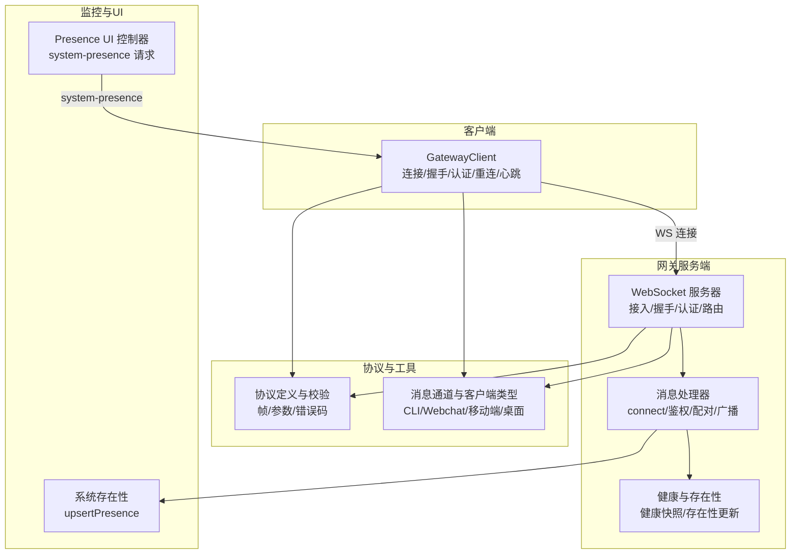
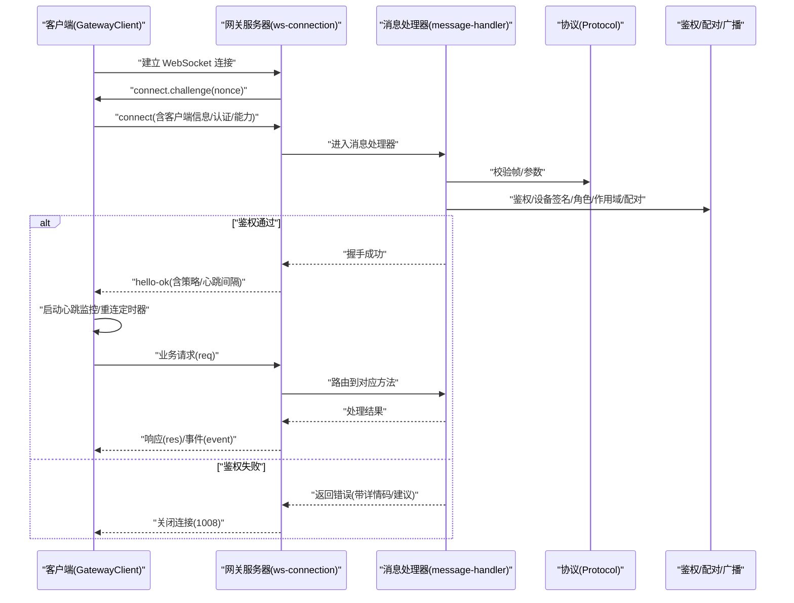
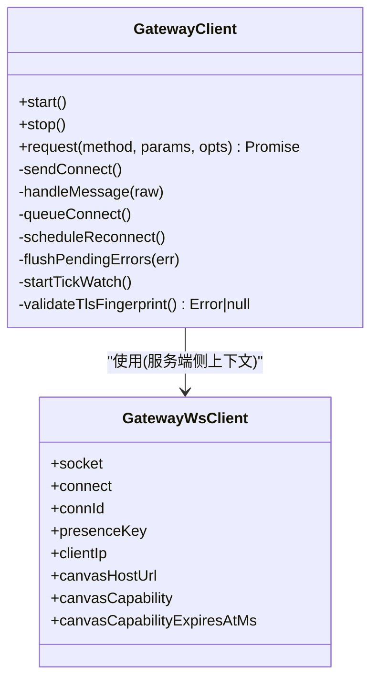
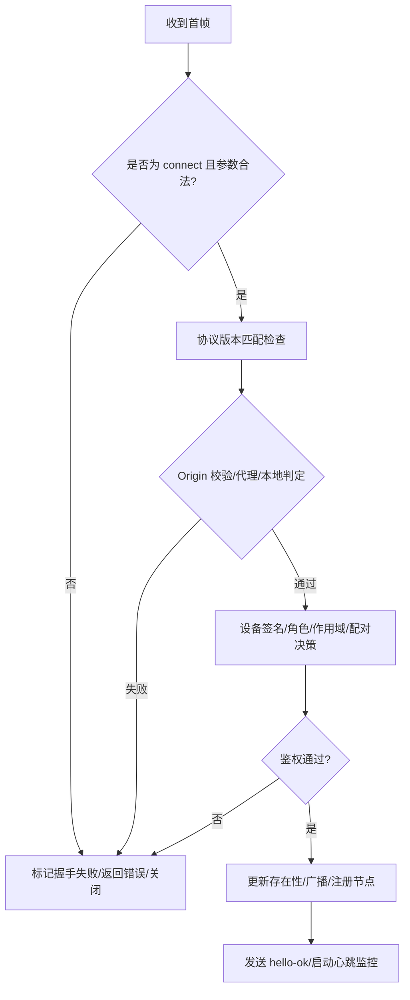
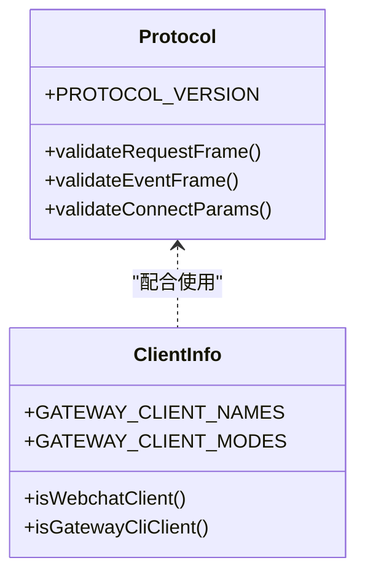
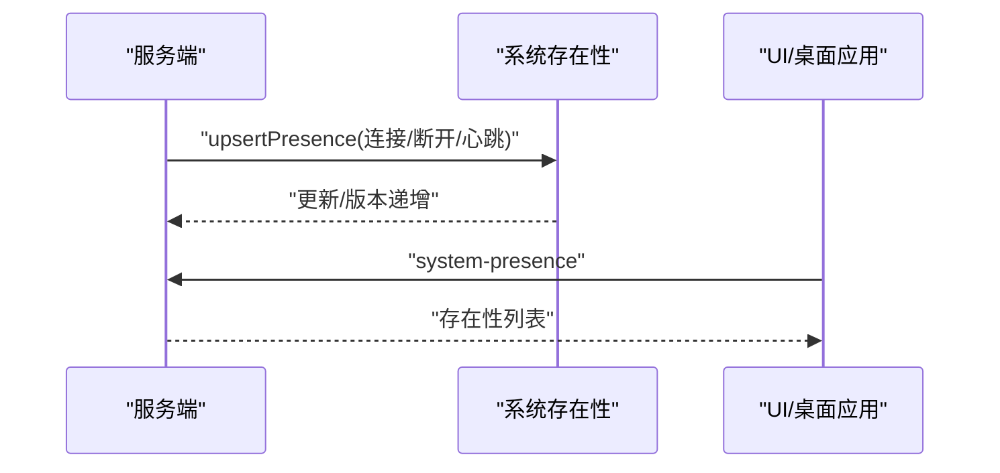
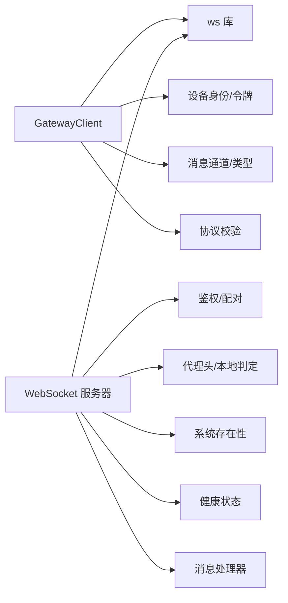

# 客户端连接处理

<cite>
**本文引用的文件**
- [src/gateway/client.ts](file://src/gateway/client.ts)
- [src/gateway/server/ws-connection.ts](file://src/gateway/server/ws-connection.ts)
- [src/gateway/server/ws-connection/message-handler.ts](file://src/gateway/server/ws-connection/message-handler.ts)
- [src/gateway/protocol/index.ts](file://src/gateway/protocol/index.ts)
- [src/gateway/protocol/client-info.ts](file://src/gateway/protocol/client-info.ts)
- [src/utils/message-channel.ts](file://src/utils/message-channel.ts)
- [src/gateway/server/ws-types.ts](file://src/gateway/server/ws-types.ts)
- [src/web/reconnect.ts](file://src/web/reconnect.ts)
- [extensions/mattermost/src/mattermost/reconnect.ts](file://extensions/mattermost/src/mattermost/reconnect.ts)
- [src/gateway/server.canvas-auth.test.ts](file://src/gateway/server.canvas-auth.test.ts)
- [src/gateway/test-helpers.server.ts](file://src/gateway/test-helpers.server.ts)
- [src/gateway/openresponses-http.ts](file://src/gateway/openresponses-http.ts)
- [src/gateway/control-ui-http-utils.ts](file://src/gateway/control-ui-http-utils.ts)
- [src/infra/system-presence.ts](file://src/infra/system-presence.ts)
- [src/gateway/server/health-state.ts](file://src/gateway/server/health-state.ts)
- [ui/src/ui/controllers/presence.ts](file://ui/src/ui/controllers/presence.ts)
- [apps/macos/Sources/OpenClaw/InstancesStore.swift](file://apps/macos/Sources/OpenClaw/InstancesStore.swift)
</cite>

## 目录

1. [简介](#简介)
2. [项目结构](#项目结构)
3. [核心组件](#核心组件)
4. [架构总览](#架构总览)
5. [详细组件分析](#详细组件分析)
6. [依赖关系分析](#依赖关系分析)
7. [性能考量](#性能考量)
8. [故障排查指南](#故障排查指南)
9. [结论](#结论)
10. [附录](#附录)

## 简介

本技术文档聚焦于 OpenClaw 的客户端连接处理机制，覆盖不同类型的客户端（CLI、Web 控制界面、移动应用、桌面应用）的连接建立流程、握手与认证、连接池与并发控制、HTTP API 与 WebSocket 混合模式、请求路由、资源清理、身份识别与会话绑定、连接状态监控、超时与重连策略、以及连接质量评估。文档以代码级分析为基础，辅以图示帮助理解。

## 项目结构

OpenClaw 的连接处理主要由以下模块协同完成：

- 客户端侧：GatewayClient 负责 WebSocket 连接、握手挑战、认证、请求发送、事件处理、重连与心跳监控。
- 服务端侧：WebSocket 服务器负责接入、握手、认证决策、消息路由、广播与健康状态维护。
- 协议层：统一的帧格式与参数校验，确保跨客户端一致性。
- 重连与回退：通用重连策略与抖动、指数退避、最大尝试次数等配置。
- 监控与状态：系统在线状态、实例存在性、健康快照与广播。

**图表来源**

- [src/gateway/client.ts](file://src/gateway/client.ts)
- [src/gateway/server/ws-connection.ts](file://src/gateway/server/ws-connection.ts)
- [src/gateway/server/ws-connection/message-handler.ts](file://src/gateway/server/ws-connection/message-handler.ts)
- [src/gateway/protocol/index.ts](file://src/gateway/protocol/index.ts)
- [src/utils/message-channel.ts](file://src/utils/message-channel.ts)
- [src/infra/system-presence.ts](file://src/infra/system-presence.ts)
- [src/gateway/server/health-state.ts](file://src/gateway/server/health-state.ts)
- [ui/src/ui/controllers/presence.ts](file://ui/src/ui/controllers/presence.ts)

**章节来源**

- [src/gateway/client.ts](file://src/gateway/client.ts)
- [src/gateway/server/ws-connection.ts](file://src/gateway/server/ws-connection.ts)
- [src/gateway/server/ws-connection/message-handler.ts](file://src/gateway/server/ws-connection/message-handler.ts)
- [src/gateway/protocol/index.ts](file://src/gateway/protocol/index.ts)
- [src/utils/message-channel.ts](file://src/utils/message-channel.ts)
- [src/infra/system-presence.ts](file://src/infra/system-presence.ts)
- [src/gateway/server/health-state.ts](file://src/gateway/server/health-state.ts)
- [ui/src/ui/controllers/presence.ts](file://ui/src/ui/controllers/presence.ts)

## 核心组件

- GatewayClient（客户端）
  - 负责建立 WebSocket 连接、发送 connect 握手、处理 connect.challenge、认证失败与重试、请求队列与响应解析、心跳监控与断线重连。
  - 支持设备令牌与共享令牌的自动切换与重试策略，TLS 指纹校验，安全检查（仅允许 wss 或受信任私有网络）。
- WebSocket 服务器与消息处理器（服务端）
  - 接入层负责握手超时、Origin 校验、代理头与本地判定、设备签名验证、角色与作用域解析、配对与权限决策。
  - 消息处理器负责请求路由、错误返回、广播与健康状态更新、存在性记录。
- 协议与客户端类型
  - 统一的帧格式与参数校验，支持 CLI、Webchat、移动端、桌面应用等多客户端类型识别与行为差异。
- 重连与回退
  - 提供通用指数退避、抖动、最大尝试次数、可中断睡眠等重连策略，适用于浏览器 UI 与扩展等场景。

**章节来源**

- [src/gateway/client.ts](file://src/gateway/client.ts)
- [src/gateway/server/ws-connection.ts](file://src/gateway/server/ws-connection.ts)
- [src/gateway/server/ws-connection/message-handler.ts](file://src/gateway/server/ws-connection/message-handler.ts)
- [src/gateway/protocol/index.ts](file://src/gateway/protocol/index.ts)
- [src/gateway/protocol/client-info.ts](file://src/gateway/protocol/client-info.ts)
- [src/utils/message-channel.ts](file://src/utils/message-channel.ts)
- [src/web/reconnect.ts](file://src/web/reconnect.ts)
- [extensions/mattermost/src/mattermost/reconnect.ts](file://extensions/mattermost/src/mattermost/reconnect.ts)

## 架构总览

下图展示了从客户端发起连接到服务端完成握手与认证、建立会话并进入事件循环的整体流程。

**图表来源**

- [src/gateway/client.ts](file://src/gateway/client.ts)
- [src/gateway/server/ws-connection.ts](file://src/gateway/server/ws-connection.ts)
- [src/gateway/server/ws-connection/message-handler.ts](file://src/gateway/server/ws-connection/message-handler.ts)
- [src/gateway/protocol/index.ts](file://src/gateway/protocol/index.ts)

**章节来源**

- [src/gateway/client.ts](file://src/gateway/client.ts)
- [src/gateway/server/ws-connection.ts](file://src/gateway/server/ws-connection.ts)
- [src/gateway/server/ws-connection/message-handler.ts](file://src/gateway/server/ws-connection/message-handler.ts)
- [src/gateway/protocol/index.ts](file://src/gateway/protocol/index.ts)

## 详细组件分析

### 客户端连接类 GatewayClient

- 连接建立与安全
  - 仅允许 wss 或在受信任私有网络下允许 ws；支持 TLS 指纹校验，避免中间人攻击。
  - 连接后等待 connect.challenge，收到 nonce 后发送 connect 请求。
- 认证与握手
  - 支持共享令牌(token)、密码(password)、设备令牌(deviceToken)与设备签名(device)组合认证。
  - 自动缓存设备令牌并进行一次性的设备令牌重试，避免频繁交互。
- 请求与事件
  - 统一的请求帧格式，支持 expectFinal 等语义；事件帧解析与序列号跟踪，检测丢包缺口。
- 心跳与断线重连
  - 服务端下发心跳周期，客户端定时检查 lastTick；超时则主动断开。
  - 断线后按指数退避重连，最大延迟限制；根据错误详情决定是否暂停重连。
- 资源清理
  - 关闭时清理 pending 请求、停止心跳定时器、关闭底层 WebSocket。

**图表来源**

- [src/gateway/client.ts](file://src/gateway/client.ts)
- [src/gateway/server/ws-types.ts](file://src/gateway/server/ws-types.ts)

**章节来源**

- [src/gateway/client.ts](file://src/gateway/client.ts)
- [src/gateway/server/ws-types.ts](file://src/gateway/server/ws-types.ts)

### 服务端 WebSocket 接入与握手

- 接入层
  - 发送 connect.challenge 并设置握手超时；记录远端 IP、Origin、User-Agent、X-Forwarded-\* 等头信息。
  - 未完成握手即关闭连接时记录详细原因与帧元数据。
- 消息处理器
  - 首帧必须是 connect 请求且参数合法；协议版本协商；Origin 校验（浏览器场景）。
  - 设备签名验证、角色与作用域解析、配对策略、可信代理与本地判定。
  - 成功后更新系统存在性、广播存在快照、注册节点等。

**图表来源**

- [src/gateway/server/ws-connection.ts](file://src/gateway/server/ws-connection.ts)
- [src/gateway/server/ws-connection/message-handler.ts](file://src/gateway/server/ws-connection/message-handler.ts)

**章节来源**

- [src/gateway/server/ws-connection.ts](file://src/gateway/server/ws-connection.ts)
- [src/gateway/server/ws-connection/message-handler.ts](file://src/gateway/server/ws-connection/message-handler.ts)

### 协议与客户端类型

- 协议
  - 统一的帧格式（req/res/event），严格的参数校验与错误码定义，保障跨客户端一致性。
- 客户端类型
  - 支持 CLI、Webchat、控制 UI、移动端、桌面应用等标识与模式，用于差异化行为（如 Origin 校验、配对策略）。

**图表来源**

- [src/gateway/protocol/index.ts](file://src/gateway/protocol/index.ts)
- [src/gateway/protocol/client-info.ts](file://src/gateway/protocol/client-info.ts)
- [src/utils/message-channel.ts](file://src/utils/message-channel.ts)

**章节来源**

- [src/gateway/protocol/index.ts](file://src/gateway/protocol/index.ts)
- [src/gateway/protocol/client-info.ts](file://src/gateway/protocol/client-info.ts)
- [src/utils/message-channel.ts](file://src/utils/message-channel.ts)

### HTTP API 与混合连接模式

- HTTP 响应与工具
  - 提供只读/标准文本响应工具函数，便于非 WebSocket 场景下的快速响应。
  - HTTP 响应限制（如文件/图片输入）配置化，保障资源消耗可控。
- 混合模式
  - 浏览器 UI 可能同时使用 WebSocket（实时事件）与 HTTP（静态资源/登录态查询）。
  - Canvas 能力与主机 URL 解析，支持跨域与代理场景下的能力声明与过期时间管理。

**章节来源**

- [src/gateway/control-ui-http-utils.ts](file://src/gateway/control-ui-http-utils.ts)
- [src/gateway/openresponses-http.ts](file://src/gateway/openresponses-http.ts)
- [src/gateway/server/ws-connection.ts](file://src/gateway/server/ws-connection.ts)

### 连接池与并发处理策略

- 连接池
  - 服务端维护 GatewayWsClient 集合，按连接 ID 与存在性键管理；支持广播与状态版本递增。
- 并发
  - 每个连接独立的心跳监控与重连定时器；请求以 UUID 标识，响应按 id 匹配。
  - 服务端按方法路由到具体处理器，避免阻塞其他连接。

**章节来源**

- [src/gateway/server/ws-types.ts](file://src/gateway/server/ws-types.ts)
- [src/gateway/server/ws-connection.ts](file://src/gateway/server/ws-connection.ts)
- [src/gateway/server/ws-connection/message-handler.ts](file://src/gateway/server/ws-connection/message-handler.ts)

### 请求路由机制

- 方法路由
  - 服务端将请求分派到对应处理器，结合鉴权与配对策略执行业务逻辑。
- 错误返回
  - 使用统一错误形状与错误码，必要时携带细节码与恢复建议，便于客户端重试或提示用户。

**章节来源**

- [src/gateway/server/ws-connection/message-handler.ts](file://src/gateway/server/ws-connection/message-handler.ts)
- [src/gateway/protocol/index.ts](file://src/gateway/protocol/index.ts)

### 资源清理策略

- 客户端
  - stop() 清理 pending、关闭定时器与底层连接；握手失败或认证失败时清理持久化设备令牌缓存。
- 服务端
  - 连接关闭时清理客户端集合、注销节点、移除远程节点信息、更新存在性与广播快照。

**章节来源**

- [src/gateway/client.ts](file://src/gateway/client.ts)
- [src/gateway/server/ws-connection.ts](file://src/gateway/server/ws-connection.ts)
- [src/gateway/server/ws-connection/message-handler.ts](file://src/gateway/server/ws-connection/message-handler.ts)

### 客户端身份识别、会话绑定与连接状态监控

- 身份识别
  - 客户端信息包含 id/displayName/version/platform/deviceFamily 等，服务端据此进行 Origin 校验与差异化策略。
- 会话绑定
  - 会话绑定服务抽象了适配器与放置策略，支持会话与子代理/会话的绑定与解绑。
- 连接状态监控
  - upsertPresence 更新存在性条目，包含角色、作用域、设备信息、实例 ID 等；健康快照与版本递增用于广播。
  - UI 通过 system-presence 请求获取存在性列表，macOS 应用也消费存在性事件。

**图表来源**

- [src/infra/system-presence.ts](file://src/infra/system-presence.ts)
- [src/gateway/server/health-state.ts](file://src/gateway/server/health-state.ts)
- [ui/src/ui/controllers/presence.ts](file://ui/src/ui/controllers/presence.ts)
- [apps/macos/Sources/OpenClaw/InstancesStore.swift](file://apps/macos/Sources/OpenClaw/InstancesStore.swift)

**章节来源**

- [src/infra/system-presence.ts](file://src/infra/system-presence.ts)
- [src/gateway/server/health-state.ts](file://src/gateway/server/health-state.ts)
- [ui/src/ui/controllers/presence.ts](file://ui/src/ui/controllers/presence.ts)
- [apps/macos/Sources/OpenClaw/InstancesStore.swift](file://apps/macos/Sources/OpenClaw/InstancesStore.swift)

### 连接超时处理、重连机制与连接质量评估

- 超时处理
  - 握手超时：服务端在限定时间内未收到 connect 则关闭。
  - 心跳超时：客户端超过两倍心跳周期未收到 tick 则断开。
- 重连机制
  - 客户端采用指数退避与抖动，最大延迟限制；根据错误详情码决定暂停重连或继续重试。
  - 浏览器 UI 与扩展提供通用重连策略，支持中断信号、抖动与最大尝试次数。
- 连接质量评估
  - 通过心跳周期、丢包缺口、握手耗时、最后帧元数据等指标辅助评估。

**章节来源**

- [src/gateway/server/ws-connection.ts](file://src/gateway/server/ws-connection.ts)
- [src/gateway/client.ts](file://src/gateway/client.ts)
- [src/web/reconnect.ts](file://src/web/reconnect.ts)
- [extensions/mattermost/src/mattermost/reconnect.ts](file://extensions/mattermost/src/mattermost/reconnect.ts)

## 依赖关系分析

- 客户端依赖
  - ws 库、设备身份与令牌存储、TLS 指纹校验、消息通道与客户端类型、协议校验。
- 服务端依赖
  - ws 服务器、鉴权与配对、代理头解析、系统存在性、健康状态、消息处理器。
- 协议与工具
  - Ajv 参数校验、错误码与错误形状、心跳常量、缓冲区大小限制。

**图表来源**

- [src/gateway/client.ts](file://src/gateway/client.ts)
- [src/gateway/server/ws-connection.ts](file://src/gateway/server/ws-connection.ts)
- [src/gateway/server/ws-connection/message-handler.ts](file://src/gateway/server/ws-connection/message-handler.ts)
- [src/gateway/protocol/index.ts](file://src/gateway/protocol/index.ts)
- [src/utils/message-channel.ts](file://src/utils/message-channel.ts)
- [src/infra/system-presence.ts](file://src/infra/system-presence.ts)
- [src/gateway/server/health-state.ts](file://src/gateway/server/health-state.ts)

**章节来源**

- [src/gateway/client.ts](file://src/gateway/client.ts)
- [src/gateway/server/ws-connection.ts](file://src/gateway/server/ws-connection.ts)
- [src/gateway/server/ws-connection/message-handler.ts](file://src/gateway/server/ws-connection/message-handler.ts)
- [src/gateway/protocol/index.ts](file://src/gateway/protocol/index.ts)
- [src/utils/message-channel.ts](file://src/utils/message-channel.ts)
- [src/infra/system-presence.ts](file://src/infra/system-presence.ts)
- [src/gateway/server/health-state.ts](file://src/gateway/server/health-state.ts)

## 性能考量

- 连接与消息
  - 设置合理的 maxPayload 与缓冲上限，避免大消息导致内存压力。
  - 心跳周期与最小监控间隔需平衡实时性与 CPU 开销。
- 重连策略
  - 指数退避与抖动降低风暴效应；最大尝试次数与最大延迟限制防止资源耗尽。
- 广播与存在性
  - 存在性与健康快照的版本递增与增量广播，减少全量传输成本。

## 故障排查指南

- 常见错误与定位
  - 握手失败：检查 connect.challenge 是否到达、connect 参数合法性、协议版本匹配。
  - 认证失败：核对 token/password/deviceToken、设备签名与 nonce、Origin 校验、可信代理配置。
  - 连接被拒：关注错误详情码与恢复建议，区分一次性错误与需要用户干预的错误。
- 测试辅助
  - 提供 Canvas 认证拒绝与连接成功的测试工具，便于端到端验证。
  - 提供 Webchat 客户端连接辅助函数，简化集成测试。

**章节来源**

- [src/gateway/server.canvas-auth.test.ts](file://src/gateway/server.canvas-auth.test.ts)
- [src/gateway/test-helpers.server.ts](file://src/gateway/test-helpers.server.ts)

## 结论

OpenClaw 的连接处理机制通过严格的握手与认证、统一的协议与消息模型、完善的重连与心跳策略、以及存在性与健康状态的可观测性，实现了对多类型客户端（CLI、Web、移动端、桌面）的稳定支持。服务端在安全性、可扩展性与可观测性之间取得平衡，客户端在健壮性与用户体验上提供良好保障。

## 附录

- 代码示例路径（不直接展示代码内容）
  - 客户端连接初始化与握手：[src/gateway/client.ts](file://src/gateway/client.ts)
  - 服务端接入与握手：[src/gateway/server/ws-connection.ts](file://src/gateway/server/ws-connection.ts)
  - 服务端消息处理器与鉴权：[src/gateway/server/ws-connection/message-handler.ts](file://src/gateway/server/ws-connection/message-handler.ts)
  - 协议校验与错误码：[src/gateway/protocol/index.ts](file://src/gateway/protocol/index.ts)
  - 客户端类型与消息通道：[src/utils/message-channel.ts](file://src/utils/message-channel.ts)
  - 重连策略（浏览器/UI）：[src/web/reconnect.ts](file://src/web/reconnect.ts)
  - 重连策略（扩展）：[extensions/mattermost/src/mattermost/reconnect.ts](file://extensions/mattermost/src/mattermost/reconnect.ts)
  - HTTP 工具与响应限制：[src/gateway/control-ui-http-utils.ts](file://src/gateway/control-ui-http-utils.ts)、[src/gateway/openresponses-http.ts](file://src/gateway/openresponses-http.ts)
  - 存在性与健康状态：[src/infra/system-presence.ts](file://src/infra/system-presence.ts)、[src/gateway/server/health-state.ts](file://src/gateway/server/health-state.ts)
  - UI 存在性控制器：[ui/src/ui/controllers/presence.ts](file://ui/src/ui/controllers/presence.ts)
  - macOS 存在性事件处理：[apps/macos/Sources/OpenClaw/InstancesStore.swift](file://apps/macos/Sources/OpenClaw/InstancesStore.swift)
