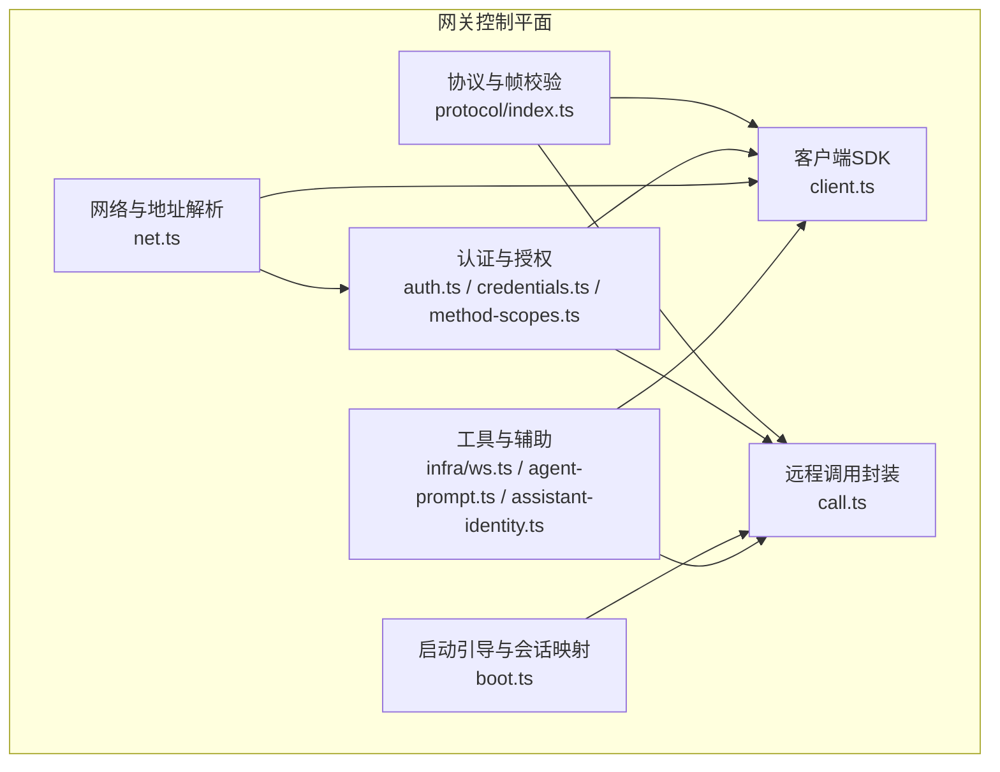
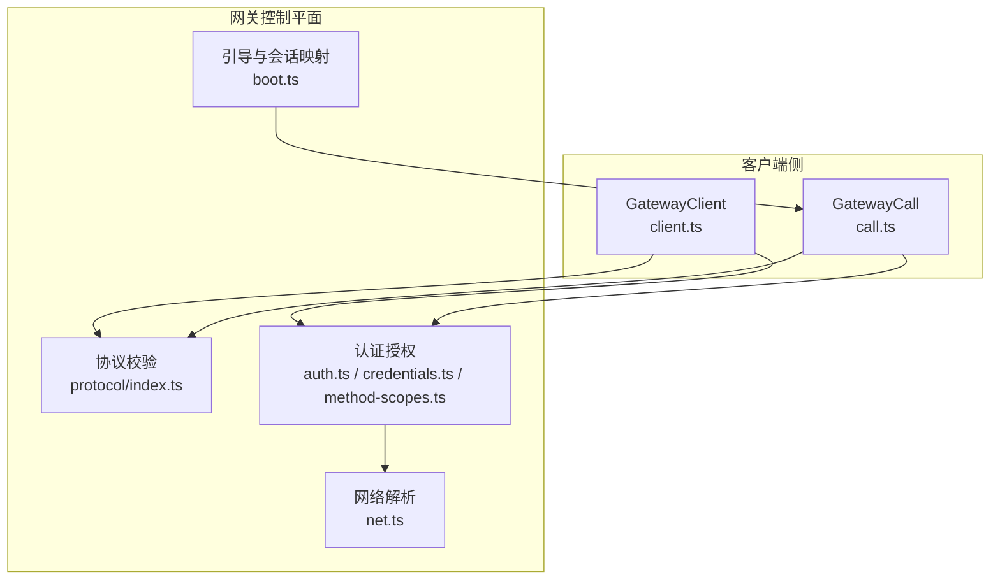
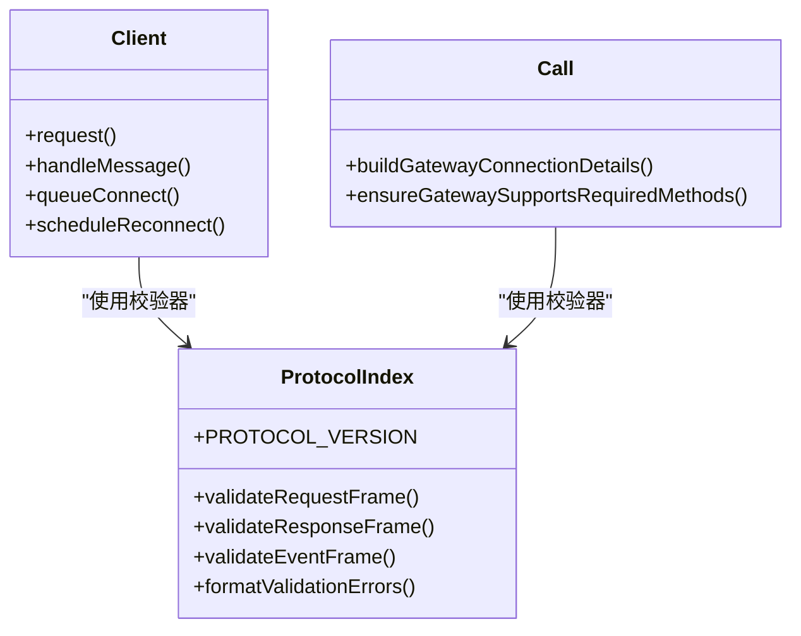
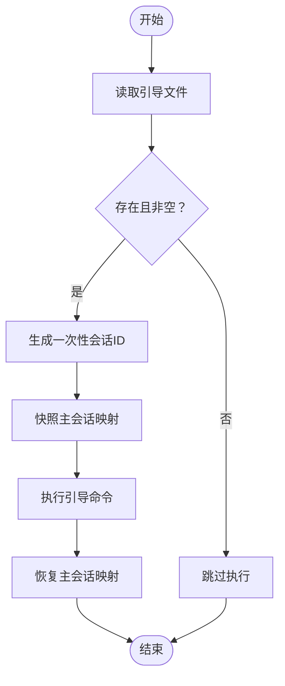
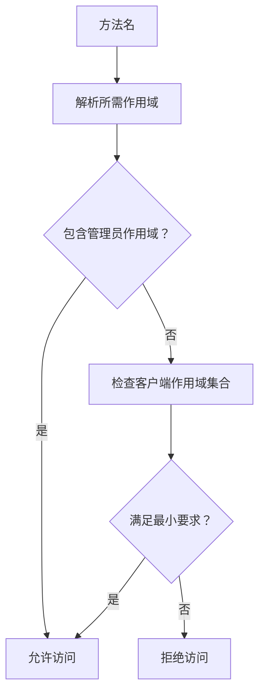
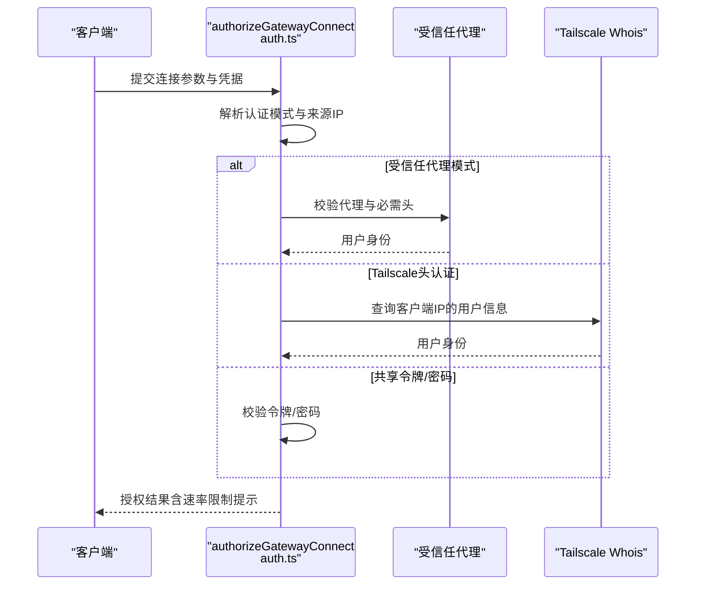
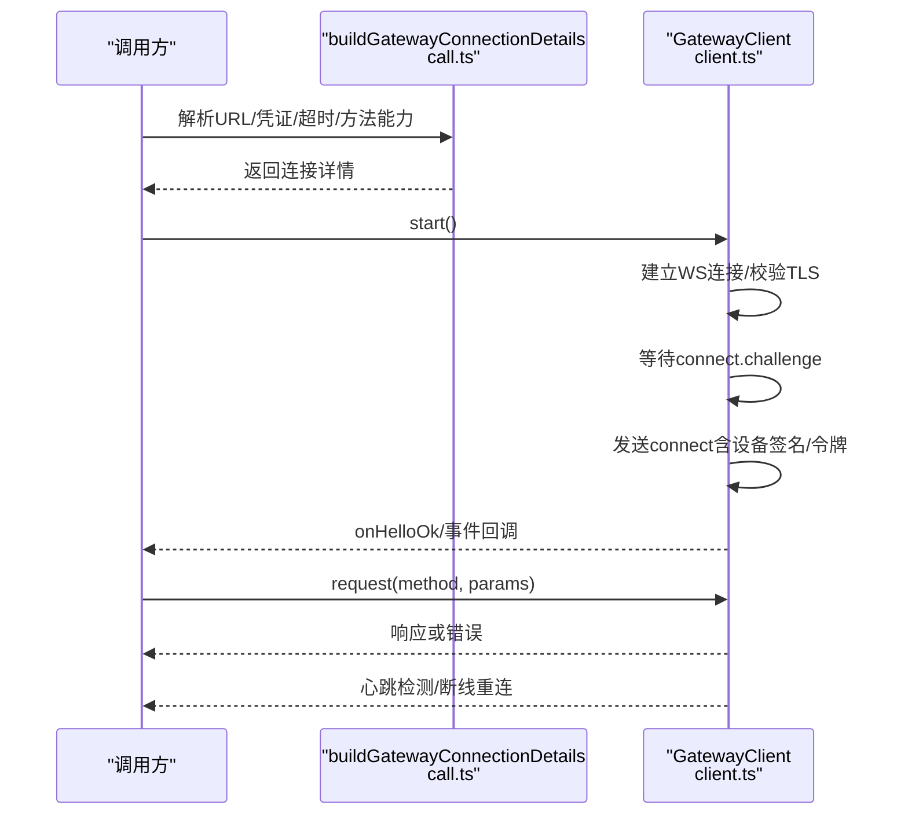
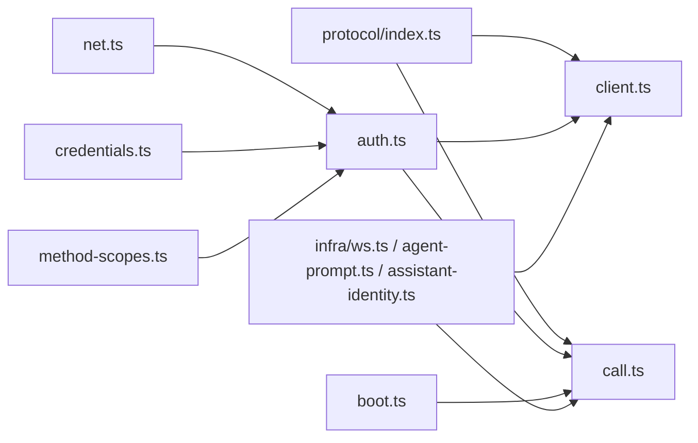

# 网关控制平面

<cite>
**本文引用的文件**
- [src/gateway/boot.ts](file://src/gateway/boot.ts)
- [src/gateway/auth.ts](file://src/gateway/auth.ts)
- [src/gateway/call.ts](file://src/gateway/call.ts)
- [src/gateway/client.ts](file://src/gateway/client.ts)
- [src/gateway/net.ts](file://src/gateway/net.ts)
- [src/gateway/protocol/index.ts](file://src/gateway/protocol/index.ts)
- [src/gateway/method-scopes.ts](file://src/gateway/method-scopes.ts)
- [src/gateway/credentials.ts](file://src/gateway/credentials.ts)
- [src/infra/ws.ts](file://src/infra/ws.ts)
- [src/gateway/agent-prompt.ts](file://src/gateway/agent-prompt.ts)
- [src/gateway/assistant-identity.ts](file://src/gateway/assistant-identity.ts)
</cite>

## 目录

1. [简介](#简介)
2. [项目结构](#项目结构)
3. [核心组件](#核心组件)
4. [架构总览](#架构总览)
5. [详细组件分析](#详细组件分析)
6. [依赖关系分析](#依赖关系分析)
7. [性能考量](#性能考量)
8. [故障排查指南](#故障排查指南)
9. [结论](#结论)
10. [附录](#附录)

## 简介

本文件面向OpenClaw网关控制平面，系统化阐述其单控制平面架构的设计理念与实现细节，覆盖以下主题：

- WebSocket通信协议与帧模型
- 会话管理机制与主会话映射快照
- 事件路由系统与方法权限体系
- 安全认证机制：共享令牌/密码、受信任代理、Tailscale头认证与速率限制
- 并发连接处理与重连退避策略
- 启动流程、配置加载与引导执行
- 分布式场景下的远程访问、Tailscale集成与多网关协调思路

目标是帮助开发者与运维人员快速理解并正确使用与扩展网关控制平面。

## 项目结构

围绕“网关控制平面”的关键目录与文件如下：

- 协议与帧校验：src/gateway/protocol/index.ts
- 客户端SDK：src/gateway/client.ts
- 远程调用封装：src/gateway/call.ts
- 认证与授权：src/gateway/auth.ts、src/gateway/credentials.ts、src/gateway/method-scopes.ts
- 网络与地址解析：src/gateway/net.ts
- 启动引导与会话映射：src/gateway/boot.ts
- 工具与辅助：src/infra/ws.ts、src/gateway/agent-prompt.ts、src/gateway/assistant-identity.ts

图表来源

- [src/gateway/protocol/index.ts:1-673](file://src/gateway/protocol/index.ts#L1-L673)
- [src/gateway/client.ts:1-674](file://src/gateway/client.ts#L1-L674)
- [src/gateway/call.ts:1-942](file://src/gateway/call.ts#L1-L942)
- [src/gateway/auth.ts:1-504](file://src/gateway/auth.ts#L1-L504)
- [src/gateway/credentials.ts:1-351](file://src/gateway/credentials.ts#L1-L351)
- [src/gateway/method-scopes.ts:1-217](file://src/gateway/method-scopes.ts#L1-L217)
- [src/gateway/net.ts:1-457](file://src/gateway/net.ts#L1-L457)
- [src/gateway/boot.ts:1-204](file://src/gateway/boot.ts#L1-L204)
- [src/infra/ws.ts:1-22](file://src/infra/ws.ts#L1-L22)
- [src/gateway/agent-prompt.ts:1-57](file://src/gateway/agent-prompt.ts#L1-L57)
- [src/gateway/assistant-identity.ts:1-119](file://src/gateway/assistant-identity.ts#L1-L119)

章节来源

- [src/gateway/protocol/index.ts:1-673](file://src/gateway/protocol/index.ts#L1-L673)
- [src/gateway/client.ts:1-674](file://src/gateway/client.ts#L1-L674)
- [src/gateway/call.ts:1-942](file://src/gateway/call.ts#L1-L942)
- [src/gateway/auth.ts:1-504](file://src/gateway/auth.ts#L1-L504)
- [src/gateway/credentials.ts:1-351](file://src/gateway/credentials.ts#L1-L351)
- [src/gateway/method-scopes.ts:1-217](file://src/gateway/method-scopes.ts#L1-L217)
- [src/gateway/net.ts:1-457](file://src/gateway/net.ts#L1-L457)
- [src/gateway/boot.ts:1-204](file://src/gateway/boot.ts#L1-L204)
- [src/infra/ws.ts:1-22](file://src/infra/ws.ts#L1-L22)
- [src/gateway/agent-prompt.ts:1-57](file://src/gateway/agent-prompt.ts#L1-L57)
- [src/gateway/assistant-identity.ts:1-119](file://src/gateway/assistant-identity.ts#L1-L119)

## 核心组件

- 协议与帧校验：定义请求/响应/事件帧结构与校验器，确保消息格式一致与安全。
- 客户端SDK：封装WebSocket连接、握手挑战、设备签名、TLS指纹校验、重连退避、心跳检测与事件分发。
- 远程调用封装：统一构建连接详情、凭证解析、超时与安全策略检查、方法支持校验与请求执行。
- 认证与授权：解析认证模式、Tailscale头认证、受信任代理、速率限制与失败回退策略。
- 网络与地址解析：主机/地址解析、可信代理判定、本地/私网/环回地址判断、安全URL校验。
- 启动引导与会话映射：读取引导脚本、生成一次性会话ID、对主会话映射进行快照与恢复。
- 工具与辅助：原始数据转字符串、对话历史拼接、助手身份解析。

章节来源

- [src/gateway/protocol/index.ts:1-673](file://src/gateway/protocol/index.ts#L1-L673)
- [src/gateway/client.ts:1-674](file://src/gateway/client.ts#L1-L674)
- [src/gateway/call.ts:1-942](file://src/gateway/call.ts#L1-L942)
- [src/gateway/auth.ts:1-504](file://src/gateway/auth.ts#L1-L504)
- [src/gateway/credentials.ts:1-351](file://src/gateway/credentials.ts#L1-L351)
- [src/gateway/method-scopes.ts:1-217](file://src/gateway/method-scopes.ts#L1-L217)
- [src/gateway/net.ts:1-457](file://src/gateway/net.ts#L1-L457)
- [src/gateway/boot.ts:1-204](file://src/gateway/boot.ts#L1-L204)
- [src/infra/ws.ts:1-22](file://src/infra/ws.ts#L1-L22)
- [src/gateway/agent-prompt.ts:1-57](file://src/gateway/agent-prompt.ts#L1-L57)
- [src/gateway/assistant-identity.ts:1-119](file://src/gateway/assistant-identity.ts#L1-L119)

## 架构总览

下图展示了从客户端到网关控制平面的整体交互与关键模块职责：

图表来源

- [src/gateway/client.ts:1-674](file://src/gateway/client.ts#L1-L674)
- [src/gateway/call.ts:1-942](file://src/gateway/call.ts#L1-L942)
- [src/gateway/protocol/index.ts:1-673](file://src/gateway/protocol/index.ts#L1-L673)
- [src/gateway/auth.ts:1-504](file://src/gateway/auth.ts#L1-L504)
- [src/gateway/credentials.ts:1-351](file://src/gateway/credentials.ts#L1-L351)
- [src/gateway/method-scopes.ts:1-217](file://src/gateway/method-scopes.ts#L1-L217)
- [src/gateway/net.ts:1-457](file://src/gateway/net.ts#L1-L457)
- [src/gateway/boot.ts:1-204](file://src/gateway/boot.ts#L1-L204)

## 详细组件分析

### 组件一：WebSocket通信协议与帧模型

- 帧类型与版本：定义请求帧、响应帧、事件帧与握手帧，并通过AJV进行严格校验。
- 参数校验：针对各类方法参数（如发送消息、节点操作、会话管理等）提供独立校验器。
- 错误格式化：将校验错误转换为可读字符串，便于诊断。

图表来源

- [src/gateway/protocol/index.ts:1-673](file://src/gateway/protocol/index.ts#L1-L673)
- [src/gateway/client.ts:1-674](file://src/gateway/client.ts#L1-L674)
- [src/gateway/call.ts:1-942](file://src/gateway/call.ts#L1-L942)

章节来源

- [src/gateway/protocol/index.ts:1-673](file://src/gateway/protocol/index.ts#L1-L673)
- [src/gateway/client.ts:1-674](file://src/gateway/client.ts#L1-L674)
- [src/gateway/call.ts:1-942](file://src/gateway/call.ts#L1-L942)

### 组件二：会话管理与引导执行

- 引导脚本：读取工作区中的引导文件，按需执行一次性的引导任务。
- 主会话映射：在执行前对主会话映射做快照，执行后尝试恢复，保证状态一致性。
- 一次性会话ID：生成带时间戳与随机后缀的会话标识，避免冲突。

图表来源

- [src/gateway/boot.ts:1-204](file://src/gateway/boot.ts#L1-L204)

章节来源

- [src/gateway/boot.ts:1-204](file://src/gateway/boot.ts#L1-L204)

### 组件三：事件路由与方法权限体系

- 方法分类：将方法划分为只读、写入、管理员、审批与配对等作用域。
- 权限解析：根据方法名解析所需最小权限，结合客户端提供的作用域进行授权判定。
- 节点角色方法：对特定节点角色方法进行单独识别与处理。

图表来源

- [src/gateway/method-scopes.ts:1-217](file://src/gateway/method-scopes.ts#L1-L217)

章节来源

- [src/gateway/method-scopes.ts:1-217](file://src/gateway/method-scopes.ts#L1-L217)

### 组件四：安全认证与授权

- 认证模式：支持无认证、共享令牌、共享密码、受信任代理与默认模式。
- Tailscale头认证：在非HTTP表面（WS控制UI）启用，基于代理头与whois校验用户身份。
- 受信任代理：校验来源IP、必需头与用户头，支持白名单用户过滤。
- 速率限制：对失败尝试进行记录与限制，成功后重置计数。
- 本地直连判定：区分本地直连与经代理转发，决定是否允许Tailscale头认证。

图表来源

- [src/gateway/auth.ts:1-504](file://src/gateway/auth.ts#L1-L504)
- [src/gateway/net.ts:1-457](file://src/gateway/net.ts#L1-L457)

章节来源

- [src/gateway/auth.ts:1-504](file://src/gateway/auth.ts#L1-L504)
- [src/gateway/net.ts:1-457](file://src/gateway/net.ts#L1-L457)

### 组件五：客户端SDK与远程调用

- 客户端SDK：负责建立安全WS连接（wss优先）、TLS指纹校验、握手挑战、设备签名、心跳监控与断线重连。
- 远程调用封装：统一解析配置与凭证、构建连接详情、安全URL校验、方法能力检查与请求执行。
- 错误处理：格式化关闭原因、超时错误与连接错误，提供详细上下文信息。

图表来源

- [src/gateway/call.ts:1-942](file://src/gateway/call.ts#L1-L942)
- [src/gateway/client.ts:1-674](file://src/gateway/client.ts#L1-L674)

章节来源

- [src/gateway/call.ts:1-942](file://src/gateway/call.ts#L1-L942)
- [src/gateway/client.ts:1-674](file://src/gateway/client.ts#L1-L674)

### 组件六：工具与辅助

- 原始数据转字符串：兼容多种底层数据类型，确保消息解析一致性。
- 对话历史拼接：将历史条目格式化为上下文文本，支持最新用户/工具输入作为当前消息。
- 助手身份解析：从配置、代理与文件中合并助手名称、头像与表情符号，提供默认值。

章节来源

- [src/infra/ws.ts:1-22](file://src/infra/ws.ts#L1-L22)
- [src/gateway/agent-prompt.ts:1-57](file://src/gateway/agent-prompt.ts#L1-L57)
- [src/gateway/assistant-identity.ts:1-119](file://src/gateway/assistant-identity.ts#L1-L119)

## 依赖关系分析

- 协议层被客户端与远程调用共同依赖，确保消息格式一致。
- 认证层依赖网络解析与速率限制，保障来源可信与防暴力破解。
- 客户端SDK依赖协议层、认证层与网络层，形成完整的连接生命周期管理。
- 引导与会话映射依赖配置与会话存储，保证状态一致性。

图表来源

- [src/gateway/protocol/index.ts:1-673](file://src/gateway/protocol/index.ts#L1-L673)
- [src/gateway/client.ts:1-674](file://src/gateway/client.ts#L1-L674)
- [src/gateway/call.ts:1-942](file://src/gateway/call.ts#L1-L942)
- [src/gateway/auth.ts:1-504](file://src/gateway/auth.ts#L1-L504)
- [src/gateway/credentials.ts:1-351](file://src/gateway/credentials.ts#L1-L351)
- [src/gateway/method-scopes.ts:1-217](file://src/gateway/method-scopes.ts#L1-L217)
- [src/gateway/net.ts:1-457](file://src/gateway/net.ts#L1-L457)
- [src/gateway/boot.ts:1-204](file://src/gateway/boot.ts#L1-L204)
- [src/infra/ws.ts:1-22](file://src/infra/ws.ts#L1-L22)
- [src/gateway/agent-prompt.ts:1-57](file://src/gateway/agent-prompt.ts#L1-L57)
- [src/gateway/assistant-identity.ts:1-119](file://src/gateway/assistant-identity.ts#L1-L119)

## 性能考量

- 连接与重连：客户端采用指数退避策略，避免雪崩；心跳检测用于发现静默断开。
- 负载与吞吐：合理设置最大消息大小与超时阈值，避免内存压力；对大响应（如屏幕快照）预留空间。
- 认证与速率限制：在高并发场景下，建议开启速率限制并合理配置阈值，防止暴力破解与滥用。
- 网络安全：强制使用wss，避免明文传输；仅在受控私网环境下允许ws；对可信代理链进行严格校验。

## 故障排查指南

- 连接失败
  - 检查URL是否为wss或本地环回；若为远程ws需明确break-glass条件。
  - 查看TLS指纹校验与证书链；确认设备签名与nonce挑战是否正确。
  - 关闭码与原因：参考客户端对常见关闭码的描述与建议。
- 认证失败
  - 核对令牌/密码是否匹配；查看速率限制状态与重试等待时间。
  - Tailscale头认证需满足代理来源与用户头一致；否则返回未授权。
  - 受信任代理需满足来源IP、必需头与用户白名单。
- 方法不可用
  - 确认目标网关支持所需方法；必要时更新网关或禁用SecretRef。
- 引导执行异常
  - 检查引导文件是否存在且非空；关注主会话映射快照与恢复日志。

章节来源

- [src/gateway/client.ts:1-674](file://src/gateway/client.ts#L1-L674)
- [src/gateway/auth.ts:1-504](file://src/gateway/auth.ts#L1-L504)
- [src/gateway/call.ts:1-942](file://src/gateway/call.ts#L1-L942)
- [src/gateway/boot.ts:1-204](file://src/gateway/boot.ts#L1-L204)

## 结论

OpenClaw网关控制平面以严格的协议校验、完善的认证授权与稳健的客户端SDK为核心，提供了安全、可靠且易于扩展的控制通道。通过会话映射快照与引导执行机制，确保状态一致性；通过方法权限体系与速率限制，兼顾易用性与安全性。在分布式场景下，结合Tailscale与受信任代理，可实现安全的远程访问与多网关协调。

## 附录

- 启动流程要点
  - 加载配置与运行时环境
  - 解析引导文件并执行一次性任务
  - 恢复主会话映射，保持状态稳定
- 配置加载要点
  - 支持本地与远程两种凭证模式
  - SecretRef在特定路径解析后参与选择
- 并发连接处理
  - 客户端指数退避与心跳保活
  - 服务端对速率限制与来源IP进行严格校验
- 分布式与多网关
  - 使用Tailscale Serve/Funnel提供HTTPS远程访问
  - 多网关实例通过一致的协议与认证策略协同工作
