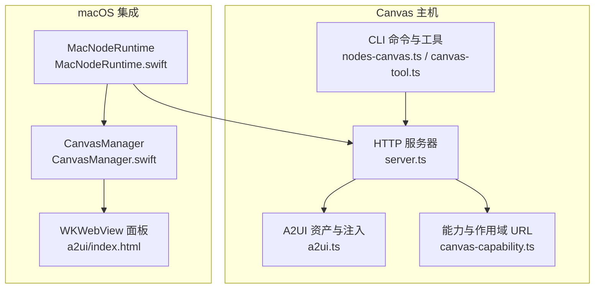
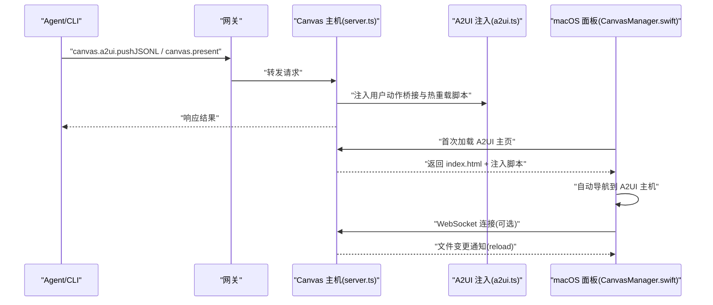
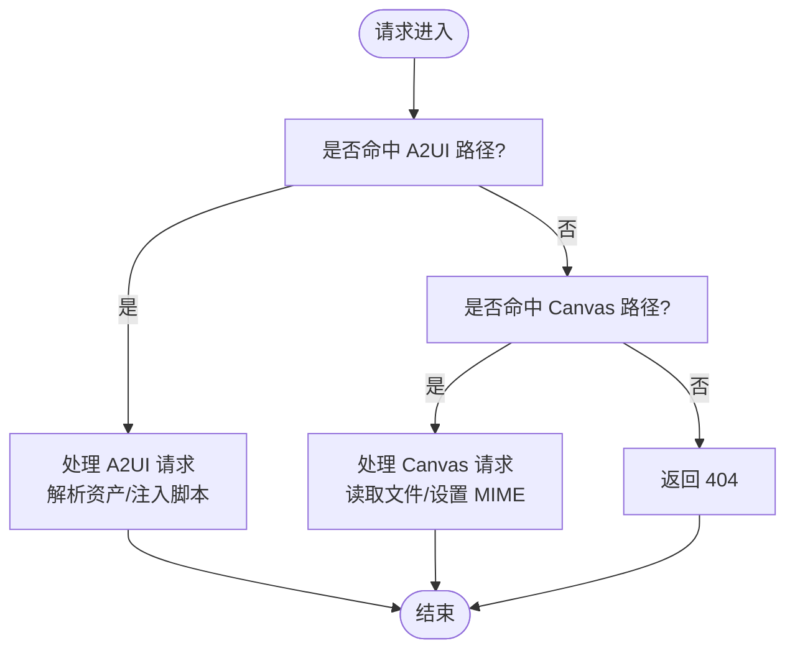
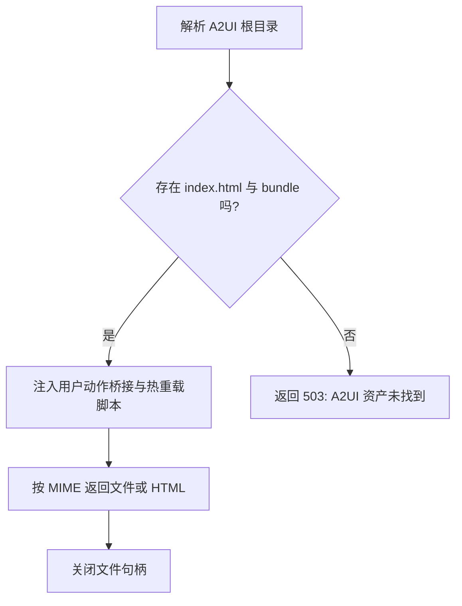
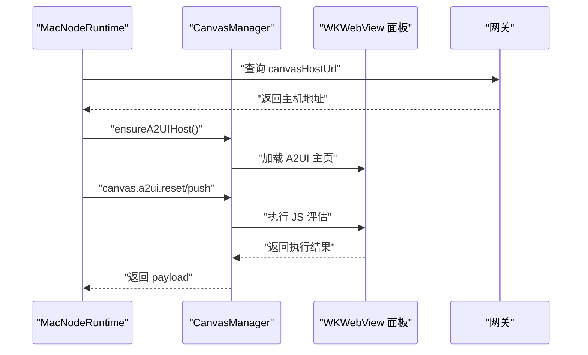
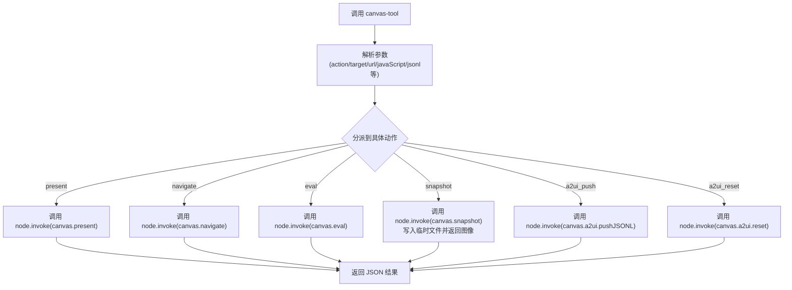
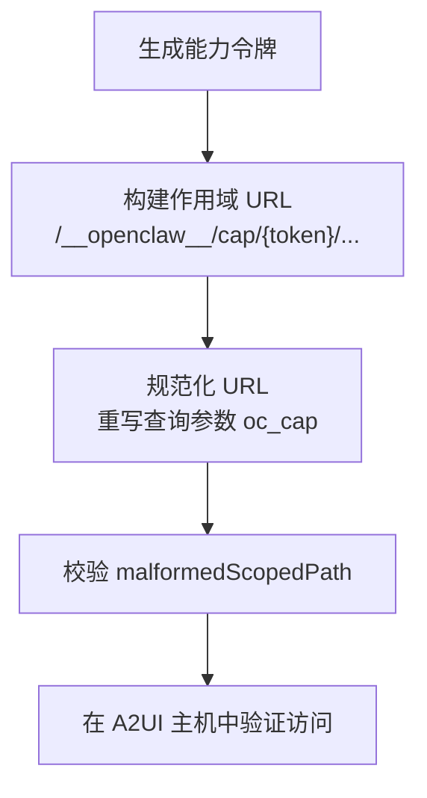
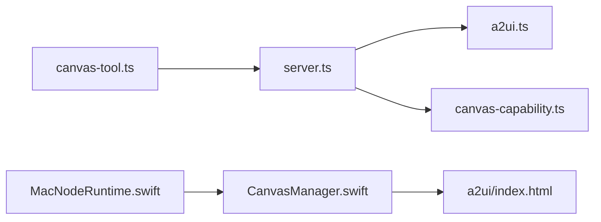

# 实时画布系统

<cite>
**本文引用的文件**
- [a2ui.ts](file://src/canvas-host/a2ui.ts)
- [server.ts](file://src/canvas-host/server.ts)
- [a2ui/index.html](file://src/canvas-host/a2ui/index.html)
- [canvas-tool.ts](file://src/agents/tools/canvas-tool.ts)
- [canvas.md](file://docs/platforms/mac/canvas.md)
- [CanvasManager.swift](file://apps/macos/Sources/OpenClaw/CanvasManager.swift)
- [MacNodeRuntime.swift](file://apps/macos/Sources/OpenClaw/NodeMode/MacNodeRuntime.swift)
- [canvas-a2ui-copy.ts](file://scripts/canvas-a2ui-copy.ts)
- [canvas-capability.ts](file://src/gateway/canvas-capability.ts)
- [nodes-canvas.ts](file://src/cli/nodes-canvas.ts)
</cite>

## 目录

1. [简介](#简介)
2. [项目结构](#项目结构)
3. [核心组件](#核心组件)
4. [架构总览](#架构总览)
5. [详细组件分析](#详细组件分析)
6. [依赖关系分析](#依赖关系分析)
7. [性能考虑](#性能考虑)
8. [故障排除指南](#故障排除指南)
9. [结论](#结论)
10. [附录](#附录)

## 简介

本技术文档聚焦于 OpenClaw 的实时画布系统，系统通过“Canvas 主机服务”在本地提供可热重载的静态资源托管能力，并以 A2UI 协议作为跨平台可视化工作空间的核心通信协议。文档从架构设计、A2UI 协议实现、跨平台可视化工作空间、实时渲染引擎优化策略等方面进行深入解析；同时覆盖 macOS 平台的 A2UI 协议实现、窗口管理与系统原生 UI 组件的集成方式；并提供画布主机的配置选项、性能监控指标、内存管理策略、内容生命周期与动态更新机制、与其他节点的通信协议、扩展开发指南、自定义组件实现以及调试与故障排除方法。

## 项目结构

OpenClaw 的画布系统由以下关键模块组成：

- Canvas 主机服务：提供 HTTP 静态资源服务、WebSocket 热重载、A2UI 资产托管与注入。
- A2UI 协议与宿主页面：定义跨平台消息协议与宿主页面脚本注入，支持 beginRendering、surfaceUpdate、dataModelUpdate、deleteSurface 等消息类型。
- macOS 集成：通过 CanvasManager.swift 管理 WKWebView 窗口面板、会话状态、自动导航到 A2UI 主机、JavaScript 评估与截图。
- Agent 工具与 CLI：提供 canvas 工具，支持 present/hide/navigate/eval/snapshot/A2UI 推送等操作。
- 安全与能力：提供 canvas 能力令牌与作用域 URL 重写，确保访问控制与路径安全。

图表来源

- [server.ts:1-479](file://src/canvas-host/server.ts#L1-L479)
- [a2ui.ts:1-210](file://src/canvas-host/a2ui.ts#L1-L210)
- [canvas-capability.ts:1-88](file://src/gateway/canvas-capability.ts#L1-L88)
- [canvas-tool.ts:1-216](file://src/agents/tools/canvas-tool.ts#L1-L216)
- [nodes-canvas.ts:1-25](file://src/cli/nodes-canvas.ts#L1-L25)
- [CanvasManager.swift:1-343](file://apps/macos/Sources/OpenClaw/CanvasManager.swift#L1-L343)
- [MacNodeRuntime.swift:1-800](file://apps/macos/Sources/OpenClaw/NodeMode/MacNodeRuntime.swift#L1-L800)
- [a2ui/index.html:1-308](file://src/canvas-host/a2ui/index.html#L1-L308)

章节来源

- [server.ts:1-479](file://src/canvas-host/server.ts#L1-L479)
- [a2ui.ts:1-210](file://src/canvas-host/a2ui.ts#L1-L210)
- [canvas-capability.ts:1-88](file://src/gateway/canvas-capability.ts#L1-L88)
- [canvas-tool.ts:1-216](file://src/agents/tools/canvas-tool.ts#L1-L216)
- [nodes-canvas.ts:1-25](file://src/cli/nodes-canvas.ts#L1-L25)
- [CanvasManager.swift:1-343](file://apps/macos/Sources/OpenClaw/CanvasManager.swift#L1-L343)
- [MacNodeRuntime.swift:1-800](file://apps/macos/Sources/OpenClaw/NodeMode/MacNodeRuntime.swift#L1-L800)
- [a2ui/index.html:1-308](file://src/canvas-host/a2ui/index.html#L1-L308)

## 核心组件

- Canvas 主机 HTTP 服务器：负责处理静态资源请求、WebSocket 升级、热重载广播、A2UI 路径代理与注入。
- A2UI 资产解析与注入：解析 A2UI 资产根目录、注入用户动作桥接与 WebSocket 热重载脚本。
- macOS Canvas 管理器：管理会话、面板显示/隐藏、自动导航至 A2UI、执行 JS、截图。
- Agent 工具与 CLI：封装 canvas 命令，统一调用网关节点的 canvas 命令与 A2UI 推送。
- 能力令牌与作用域 URL：生成能力令牌、重写作用域 URL，保障访问安全与路径规范化。

章节来源

- [server.ts:205-397](file://src/canvas-host/server.ts#L205-L397)
- [a2ui.ts:19-79](file://src/canvas-host/a2ui.ts#L19-L79)
- [a2ui.ts:142-210](file://src/canvas-host/a2ui.ts#L142-L210)
- [CanvasManager.swift:32-138](file://apps/macos/Sources/OpenClaw/CanvasManager.swift#L32-L138)
- [canvas-tool.ts:80-216](file://src/agents/tools/canvas-tool.ts#L80-L216)
- [canvas-capability.ts:20-87](file://src/gateway/canvas-capability.ts#L20-L87)

## 架构总览

Canvas 主机服务采用“HTTP + WebSocket + 文件系统监视”的组合模式：

- HTTP 层：提供静态资源服务与 A2UI 资产托管，支持 HEAD/GET 方法与 MIME 类型检测。
- WebSocket 层：在启用热重载时，监听文件变更并通过 WebSocket 广播“reload”指令触发页面刷新。
- A2UI 注入层：在 HTML 中注入跨平台用户动作桥接与 WebSocket 热重载逻辑，适配 iOS/Android/Web。
- macOS 集成层：通过 CanvasManager.swift 控制 WKWebView 面板，自动导航到 A2UI 主机，支持 JS 评估与截图。

图表来源

- [server.ts:416-478](file://src/canvas-host/server.ts#L416-L478)
- [a2ui.ts:142-210](file://src/canvas-host/a2ui.ts#L142-L210)
- [CanvasManager.swift:197-235](file://apps/macos/Sources/OpenClaw/CanvasManager.swift#L197-L235)

## 详细组件分析

### Canvas 主机服务（server.ts）

- 功能要点
  - 创建 HTTP 服务器，拦截 A2UI 请求与常规 Canvas 资源请求。
  - 支持热重载：使用 chokidar 监视文件变化，通过 WebSocket 广播“reload”。
  - 路径规范化与安全：对 basePath 进行标准化，避免越权访问。
  - 默认索引页：若未找到 index.html，则生成默认欢迎页。
- 关键流程
  - 请求进入：优先尝试 A2UI 处理，再尝试 Canvas 资源处理。
  - WebSocket 升级：仅当路径匹配且启用热重载时允许升级。
  - 错误处理：捕获请求异常并返回 500，记录日志。

图表来源

- [server.ts:301-379](file://src/canvas-host/server.ts#L301-L379)
- [server.ts:416-478](file://src/canvas-host/server.ts#L416-L478)

章节来源

- [server.ts:205-397](file://src/canvas-host/server.ts#L205-L397)
- [server.ts:416-478](file://src/canvas-host/server.ts#L416-L478)

### A2UI 协议与资产注入（a2ui.ts）

- 功能要点
  - 解析 A2UI 资产根目录，支持多候选路径与真实路径解析。
  - 注入用户动作桥接：在页面中暴露 OpenClaw.postMessage 与 openclawSendUserAction，适配 iOS/Android/Web。
  - 注入热重载：建立 WebSocket 连接，收到“reload”后刷新页面。
  - 资产分发：根据扩展名检测 MIME 类型，HEAD/GET 支持，HTML 自动注入脚本。
- 关键流程
  - 解析 A2UI 根目录：遍历候选路径，定位 index.html 与 a2ui.bundle.js。
  - 注入脚本：在 </body> 前插入用户动作桥接与热重载逻辑。
  - 资产读取：按需读取文件并返回内容，关闭句柄。

图表来源

- [a2ui.ts:19-79](file://src/canvas-host/a2ui.ts#L19-L79)
- [a2ui.ts:81-140](file://src/canvas-host/a2ui.ts#L81-L140)
- [a2ui.ts:142-210](file://src/canvas-host/a2ui.ts#L142-L210)

章节来源

- [a2ui.ts:19-79](file://src/canvas-host/a2ui.ts#L19-L79)
- [a2ui.ts:81-140](file://src/canvas-host/a2ui.ts#L81-L140)
- [a2ui.ts:142-210](file://src/canvas-host/a2ui.ts#L142-L210)

### macOS 集成（CanvasManager.swift 与 MacNodeRuntime.swift）

- CanvasManager.swift
  - 会话管理：维护当前面板控制器与会话键，支持 show/hide/eval/snapshot。
  - 自动导航：监听网关推送，解析 A2UI 主机 URL 并自动导航。
  - 调试状态：根据连接状态更新面板调试信息。
- MacNodeRuntime.swift
  - 桥接命令：处理 canvas._ 与 canvas.a2ui._ 命令，调用 CanvasManager 执行。
  - A2UI 主机：解析网关广告的 Canvas 主机 URL，确保 A2UI 可用并执行 reset/push。
  - 错误处理：针对禁用 Canvas、权限不足、不可达等场景返回明确错误码。

图表来源

- [MacNodeRuntime.swift:362-434](file://apps/macos/Sources/OpenClaw/NodeMode/MacNodeRuntime.swift#L362-L434)
- [CanvasManager.swift:197-235](file://apps/macos/Sources/OpenClaw/CanvasManager.swift#L197-L235)

章节来源

- [CanvasManager.swift:32-138](file://apps/macos/Sources/OpenClaw/CanvasManager.swift#L32-L138)
- [CanvasManager.swift:197-235](file://apps/macos/Sources/OpenClaw/CanvasManager.swift#L197-L235)
- [MacNodeRuntime.swift:362-434](file://apps/macos/Sources/OpenClaw/NodeMode/MacNodeRuntime.swift#L362-L434)

### Agent 工具与 CLI（canvas-tool.ts 与 nodes-canvas.ts）

- canvas-tool.ts
  - 提供 canvas 工具，支持 present/hide/navigate/eval/snapshot/a2ui_push/a2ui_reset。
  - 参数校验与路径策略：对 jsonlPath 进行入站路径白名单检查。
  - 结果处理：将 snapshot 结果写入临时文件并返回图像结果。
- nodes-canvas.ts
  - 定义快照负载结构与临时文件命名规则，供 CLI 使用。

图表来源

- [canvas-tool.ts:80-216](file://src/agents/tools/canvas-tool.ts#L80-L216)
- [nodes-canvas.ts:5-25](file://src/cli/nodes-canvas.ts#L5-L25)

章节来源

- [canvas-tool.ts:80-216](file://src/agents/tools/canvas-tool.ts#L80-L216)
- [nodes-canvas.ts:5-25](file://src/cli/nodes-canvas.ts#L5-L25)

### 安全与能力（canvas-capability.ts）

- 能力令牌：随机生成 base64url 编码的能力令牌，限制有效期。
- 作用域 URL：将能力令牌嵌入路径前缀，生成 scoped URL，并在必要时重写查询参数。
- 规范化：对输入进行修剪与解码，确保路径与查询参数一致。

图表来源

- [canvas-capability.ts:20-87](file://src/gateway/canvas-capability.ts#L20-L87)

章节来源

- [canvas-capability.ts:20-87](file://src/gateway/canvas-capability.ts#L20-L87)

### A2UI 资产复制与打包（canvas-a2ui-copy.ts）

- 负责将 A2UI 源资产复制到 dist 输出目录，支持环境变量定制源与目标路径。
- 若缺失关键资产，抛出错误提示先运行打包脚本。

章节来源

- [canvas-a2ui-copy.ts:1-41](file://scripts/canvas-a2ui-copy.ts#L1-L41)

## 依赖关系分析

- 组件耦合
  - server.ts 与 a2ui.ts：前者负责 HTTP/WS，后者负责资产解析与注入。
  - MacNodeRuntime.swift 与 CanvasManager.swift：前者桥接命令，后者管理面板与会话。
  - canvas-tool.ts 与 server.ts：工具通过网关调用 canvas 命令，最终落到 server.ts 的处理链。
- 外部依赖
  - chokidar：文件系统监视与稳定写入检测。
  - ws：WebSocket 服务器，用于热重载广播。
  - MIME 检测：根据扩展名确定 Content-Type。
- 循环依赖
  - 未发现直接循环依赖；各模块职责清晰，通过网关与命令通道交互。

图表来源

- [server.ts:14-19](file://src/canvas-host/server.ts#L14-L19)
- [a2ui.ts:1-6](file://src/canvas-host/a2ui.ts#L1-L6)
- [canvas-tool.ts:15-16](file://src/agents/tools/canvas-tool.ts#L15-L16)
- [canvas-capability.ts:1-5](file://src/gateway/canvas-capability.ts#L1-L5)
- [MacNodeRuntime.swift:6-11](file://apps/macos/Sources/OpenClaw/NodeMode/MacNodeRuntime.swift#L6-L11)
- [CanvasManager.swift:7-16](file://apps/macos/Sources/OpenClaw/CanvasManager.swift#L7-L16)
- [a2ui/index.html:1-308](file://src/canvas-host/a2ui/index.html#L1-L308)

章节来源

- [server.ts:14-19](file://src/canvas-host/server.ts#L14-L19)
- [a2ui.ts:1-6](file://src/canvas-host/a2ui.ts#L1-L6)
- [canvas-tool.ts:15-16](file://src/agents/tools/canvas-tool.ts#L15-L16)
- [canvas-capability.ts:1-5](file://src/gateway/canvas-capability.ts#L1-L5)
- [MacNodeRuntime.swift:6-11](file://apps/macos/Sources/OpenClaw/NodeMode/MacNodeRuntime.swift#L6-L11)
- [CanvasManager.swift:7-16](file://apps/macos/Sources/OpenClaw/CanvasManager.swift#L7-L16)
- [a2ui/index.html:1-308](file://src/canvas-host/a2ui/index.html#L1-L308)

## 性能考虑

- 热重载优化
  - 写入稳定性阈值与轮询间隔：测试模式下降低抖动，生产模式下适度放宽。
  - 去抖与批量广播：合并短时间内多次变更，减少 WebSocket 压力。
- 文件系统监视
  - 忽略 .dotfiles 与 node_modules，降低无效事件。
  - 监视器错误降级：出现错误时关闭监视并记录告警，避免影响主流程。
- 资产解析
  - 缓存真实路径与解析时间戳，避免重复 IO。
  - 严格 MIME 检测，避免错误缓存头导致的额外往返。
- macOS 面板
  - 仅在需要时创建面板控制器，复用现有会话以减少初始化开销。
  - 自动导航策略：避免重复导航同一 A2UI 地址。

章节来源

- [server.ts:261-285](file://src/canvas-host/server.ts#L261-L285)
- [server.ts:249-258](file://src/canvas-host/server.ts#L249-L258)
- [a2ui.ts:61-79](file://src/canvas-host/a2ui.ts#L61-L79)
- [CanvasManager.swift:185-195](file://apps/macos/Sources/OpenClaw/CanvasManager.swift#L185-L195)

## 故障排除指南

- A2UI 主机未配置
  - 现象：ensureA2UIHost 抛出“未配置”错误。
  - 处理：确认网关已发布 canvasHostUrl，或手动指定 A2UI 主机 URL。
- A2UI 主机不可达
  - 现象：isA2UIReady 轮询失败，抛出“不可达”错误。
  - 处理：检查网络连通性、端口占用与防火墙设置。
- A2UI 资产缺失
  - 现象：handleA2uiHttpRequest 返回 503。
  - 处理：运行 A2UI 打包与复制脚本，确保 index.html 与 a2ui.bundle.js 存在。
- 权限与安全
  - 现象：canvas 命令返回“禁用/权限不足”。
  - 处理：在设置中启用 Canvas，授予位置/通知等所需权限。
- 热重载不生效
  - 现象：修改文件后页面未刷新。
  - 处理：检查 chokidar 是否报错、WebSocket 升级路径是否正确、浏览器是否支持 WebSocket。

章节来源

- [MacNodeRuntime.swift:412-427](file://apps/macos/Sources/OpenClaw/NodeMode/MacNodeRuntime.swift#L412-L427)
- [a2ui.ts:165-171](file://src/canvas-host/a2ui.ts#L165-L171)
- [canvas-a2ui-copy.ts:18-25](file://scripts/canvas-a2ui-copy.ts#L18-L25)
- [server.ts:276-285](file://src/canvas-host/server.ts#L276-L285)

## 结论

OpenClaw 的实时画布系统通过 Canvas 主机服务与 A2UI 协议实现了跨平台的可视化工作空间，结合 macOS 的 WKWebView 面板与严格的权限控制，提供了安全、可扩展且高性能的实时渲染体验。系统在热重载、文件监视、资产注入与会话管理方面具备良好的工程实践，适合在多节点环境中进行动态更新与协作。

## 附录

### 配置选项与环境变量

- OPENCLAW_SKIP_CANVAS_HOST：禁用 Canvas 主机（测试/CI 场景）。
- OPENCLAW_A2UI_SRC_DIR / OPENCLAW_A2UI_OUT_DIR：A2UI 源与输出目录。
- OPENCLAW_A2UI_SKIP_MISSING：跳过缺失 A2UI 资产的错误。

章节来源

- [server.ts:152-166](file://src/canvas-host/server.ts#L152-L166)
- [canvas-a2ui-copy.ts:7-11](file://scripts/canvas-a2ui-copy.ts#L7-L11)

### 性能监控指标

- 文件变更事件计数与去抖延迟。
- WebSocket 连接数与广播频率。
- MIME 检测命中率与错误率。
- macOS 面板创建/销毁次数与自动导航触发次数。

章节来源

- [server.ts:249-258](file://src/canvas-host/server.ts#L249-L258)
- [server.ts:227-234](file://src/canvas-host/server.ts#L227-L234)
- [CanvasManager.swift:185-195](file://apps/macos/Sources/OpenClaw/CanvasManager.swift#L185-L195)

### 内存管理策略

- 文件句柄及时关闭：所有文件读取完成后显式关闭。
- 缓存策略：A2UI 根目录真实路径缓存与失效时间控制。
- 会话隔离：每个会话独立面板控制器，避免跨会话资源污染。

章节来源

- [a2ui.ts:206-208](file://src/canvas-host/a2ui.ts#L206-L208)
- [a2ui.ts:61-79](file://src/canvas-host/a2ui.ts#L61-L79)
- [CanvasManager.swift:80-114](file://apps/macos/Sources/OpenClaw/CanvasManager.swift#L80-L114)

### 画布内容生命周期与动态更新

- 生命周期：会话创建 → 面板展示 → 资源加载 → 自动导航 A2UI → 热重载 → 截图/JS 评估 → 隐藏/销毁。
- 动态更新：通过 A2UI 推送消息实现组件与数据模型的增量更新；文件变更触发热重载。

章节来源

- [CanvasManager.swift:32-138](file://apps/macos/Sources/OpenClaw/CanvasManager.swift#L32-L138)
- [a2ui/index.html:227-308](file://src/canvas-host/a2ui/index.html#L227-L308)

### 与其他节点的通信协议

- 网关 WebSocket：Agent 通过网关下发 canvas 命令，Canvas 主机在本地处理并返回结果。
- A2UI 消息：beginRendering、surfaceUpdate、dataModelUpdate、deleteSurface 等。

章节来源

- [canvas.md:67-106](file://docs/platforms/mac/canvas.md#L67-L106)
- [canvas-tool.ts:18-26](file://src/agents/tools/canvas-tool.ts#L18-L26)

### 扩展开发指南与自定义组件

- A2UI 主机页面：在 a2ui/index.html 中扩展样式与脚本，注入自定义组件。
- 资产复制：通过 canvas-a2ui-copy.ts 将构建产物复制到 dist 目录。
- 能力令牌：使用 canvas-capability.ts 生成与验证作用域 URL，确保访问安全。

章节来源

- [a2ui/index.html:1-308](file://src/canvas-host/a2ui/index.html#L1-L308)
- [canvas-a2ui-copy.ts:13-28](file://scripts/canvas-a2ui-copy.ts#L13-L28)
- [canvas-capability.ts:20-87](file://src/gateway/canvas-capability.ts#L20-L87)
