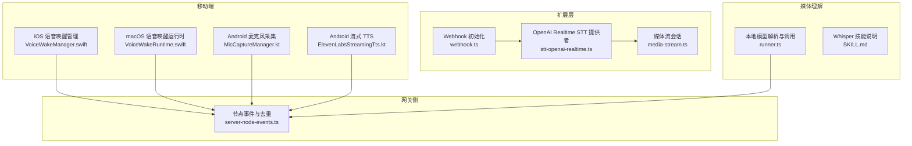
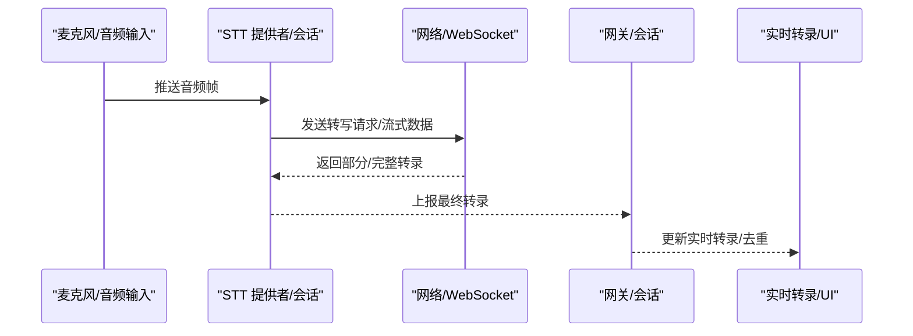
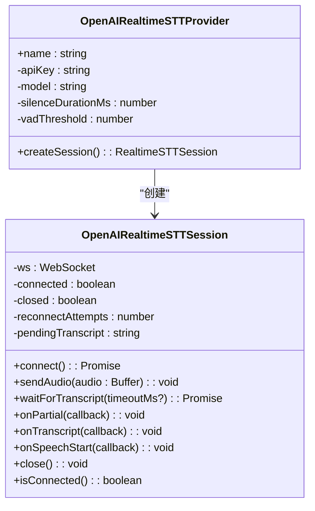
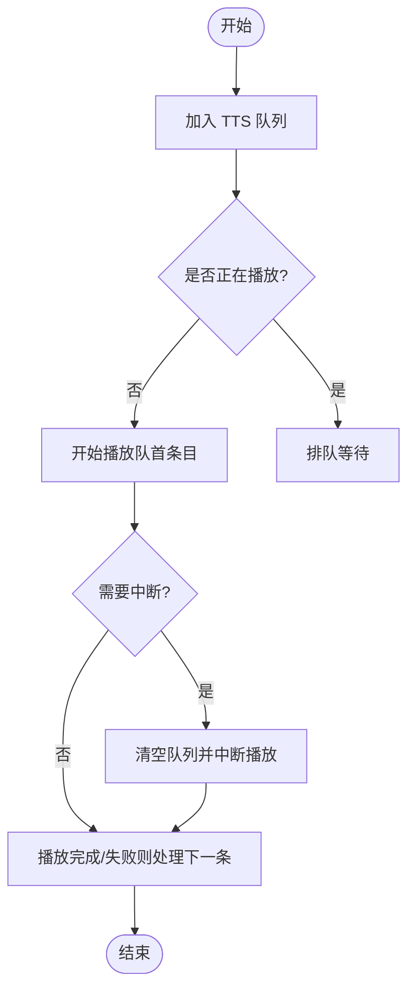
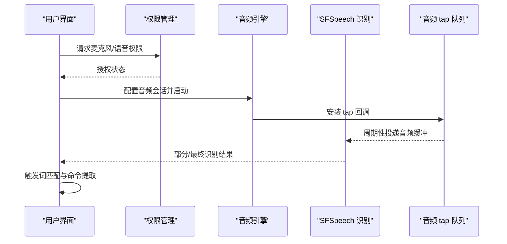
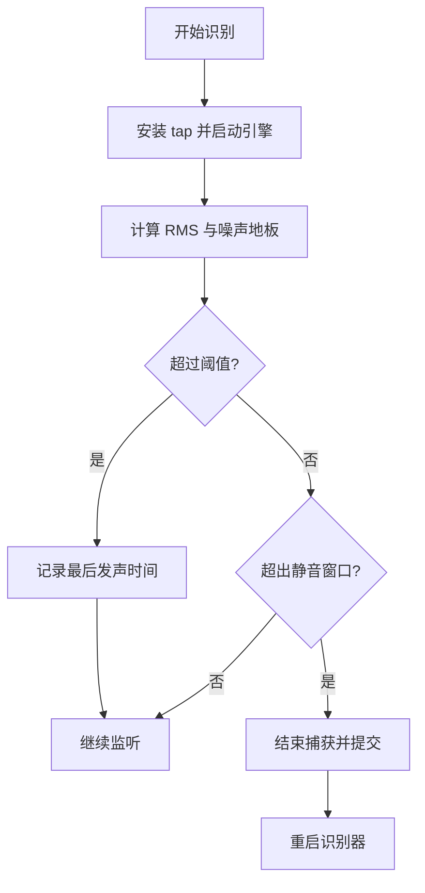
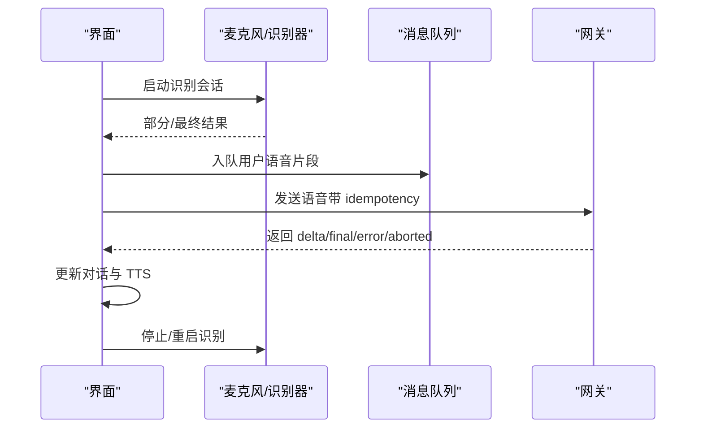
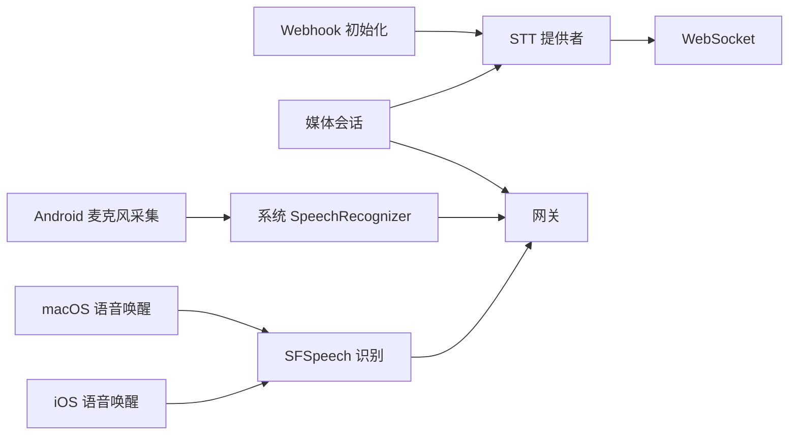

# 持续语音识别

<cite>
**本文引用的文件**
- [stt-openai-realtime.ts](file://extensions/voice-call/src/providers/stt-openai-realtime.ts)
- [webhook.ts](file://extensions/voice-call/src/webhook.ts)
- [media-stream.ts](file://extensions/voice-call/src/media-stream.ts)
- [VoiceWakeRuntime.swift](file://apps/macos/Sources/OpenClaw/VoiceWakeRuntime.swift)
- [VoiceWakeManager.swift](file://apps/ios/Sources/Voice/VoiceWakeManager.swift)
- [MicCaptureManager.kt](file://apps/android/app/src/main/java/ai/openclaw/app/voice/MicCaptureManager.kt)
- [ElevenLabsStreamingTts.kt](file://apps/android/app/src/main/java/ai/openclaw/app/voice/ElevenLabsStreamingTts.kt)
- [runner.ts](file://src/media-understanding/runner.ts)
- [SKILL.md](file://skills/openai-whisper/SKILL.md)
- [server-node-events.ts](file://src/gateway/server-node-events.ts)
</cite>

## 目录

1. [简介](#简介)
2. [项目结构](#项目结构)
3. [核心组件](#核心组件)
4. [架构总览](#架构总览)
5. [详细组件分析](#详细组件分析)
6. [依赖关系分析](#依赖关系分析)
7. [性能考量](#性能考量)
8. [故障排查指南](#故障排查指南)
9. [结论](#结论)
10. [附录](#附录)

## 简介

本技术文档聚焦于 OpenClaw 的持续语音识别能力，覆盖实时语音转文本的实现机制，包括音频流的连续处理、VAD（Voice Activity Detection）检测、以及 ASR 模型的集成方式。文档同时阐述 Android 平台的连续语音功能实现，包括麦克风权限处理、音频缓冲与重连策略、以及网络异常时的本地处理策略；并提供 ASR 配置参数、语言模型选择、识别准确率优化的技术细节，解释与会话系统的集成、实时转录显示、以及语音到文本的转换质量控制。

## 项目结构

围绕持续语音识别的关键代码分布在以下模块：

- 扩展层：基于 OpenAI Realtime API 的流式 STT 提供者与媒体流会话
- 移动端：iOS/macOS 的本地语音唤醒与识别流程；Android 的麦克风采集与队列发送
- 媒体理解：本地 Whisper/Sherpa-ONNX 等离线模型的解析与调用
- 网关侧：去重与事件处理，保障会话一致性

图表来源

- [stt-openai-realtime.ts:1-312](file://extensions/voice-call/src/providers/stt-openai-realtime.ts#L1-L312)
- [media-stream.ts:398-449](file://extensions/voice-call/src/media-stream.ts#L398-L449)
- [webhook.ts:80-104](file://extensions/voice-call/src/webhook.ts#L80-L104)
- [VoiceWakeManager.swift:160-220](file://apps/ios/Sources/Voice/VoiceWakeManager.swift#L160-L220)
- [VoiceWakeRuntime.swift:141-233](file://apps/macos/Sources/OpenClaw/VoiceWakeRuntime.swift#L141-L233)
- [MicCaptureManager.kt:183-246](file://apps/android/app/src/main/java/ai/openclaw/app/voice/MicCaptureManager.kt#L183-L246)
- [ElevenLabsStreamingTts.kt:89-129](file://apps/android/app/src/main/java/ai/openclaw/app/voice/ElevenLabsStreamingTts.kt#L89-L129)
- [runner.ts:248-316](file://src/media-understanding/runner.ts#L248-L316)
- [SKILL.md:1-39](file://skills/openai-whisper/SKILL.md#L1-L39)
- [server-node-events.ts:67-112](file://src/gateway/server-node-events.ts#L67-L112)

章节来源

- [stt-openai-realtime.ts:1-312](file://extensions/voice-call/src/providers/stt-openai-realtime.ts#L1-L312)
- [media-stream.ts:398-449](file://extensions/voice-call/src/media-stream.ts#L398-L449)
- [webhook.ts:80-104](file://extensions/voice-call/src/webhook.ts#L80-L104)
- [VoiceWakeManager.swift:160-220](file://apps/ios/Sources/Voice/VoiceWakeManager.swift#L160-L220)
- [VoiceWakeRuntime.swift:141-233](file://apps/macos/Sources/OpenClaw/VoiceWakeRuntime.swift#L141-L233)
- [MicCaptureManager.kt:183-246](file://apps/android/app/src/main/java/ai/openclaw/app/voice/MicCaptureManager.kt#L183-L246)
- [ElevenLabsStreamingTts.kt:89-129](file://apps/android/app/src/main/java/ai/openclaw/app/voice/ElevenLabsStreamingTts.kt#L89-L129)
- [runner.ts:248-316](file://src/media-understanding/runner.ts#L248-L316)
- [SKILL.md:1-39](file://skills/openai-whisper/SKILL.md#L1-L39)
- [server-node-events.ts:67-112](file://src/gateway/server-node-events.ts#L67-L112)

## 核心组件

- OpenAI Realtime STT 提供者：通过 WebSocket 连接 OpenAI 实时转写服务，支持服务器端 VAD、低延迟流式传输与部分结果回调。
- 媒体会话：封装媒体流的建立、音频数据推送、TTS 队列与中断、会话关闭等生命周期管理。
- iOS/macOS 语音唤醒：基于系统 SFSpeech 的本地识别与音频引擎，包含触发词匹配、静音窗口、自适应噪声阈值与 UI 展示。
- Android 麦克风采集：使用系统 SpeechRecognizer 进行本地识别，维护会话片段、消息队列、等待网关可用与超时处理。
- 本地媒体理解：自动探测 Whisper/Sherpa-ONNX 等本地模型，按优先级选择执行路径。
- 网关事件与去重：对语音转录进行指纹去重，避免重复事件进入会话。

章节来源

- [stt-openai-realtime.ts:52-80](file://extensions/voice-call/src/providers/stt-openai-realtime.ts#L52-L80)
- [media-stream.ts:398-449](file://extensions/voice-call/src/media-stream.ts#L398-L449)
- [VoiceWakeManager.swift:82-144](file://apps/ios/Sources/Voice/VoiceWakeManager.swift#L82-L144)
- [VoiceWakeRuntime.swift:11-77](file://apps/macos/Sources/OpenClaw/VoiceWakeRuntime.swift#L11-L77)
- [MicCaptureManager.kt:39-101](file://apps/android/app/src/main/java/ai/openclaw/app/voice/MicCaptureManager.kt#L39-L101)
- [runner.ts:248-316](file://src/media-understanding/runner.ts#L248-L316)
- [server-node-events.ts:67-112](file://src/gateway/server-node-events.ts#L67-L112)

## 架构总览

持续语音识别在不同平台采用统一的“音频采集 → 识别/转写 → 会话集成”的主干流程，并在各平台内嵌入本地或云端能力以提升鲁棒性与响应速度。

图表来源

- [stt-openai-realtime.ts:105-181](file://extensions/voice-call/src/providers/stt-openai-realtime.ts#L105-L181)
- [media-stream.ts:398-449](file://extensions/voice-call/src/media-stream.ts#L398-L449)
- [server-node-events.ts:67-112](file://src/gateway/server-node-events.ts#L67-L112)

## 详细组件分析

### OpenAI Realtime STT 提供者与会话

- 连接与配置：初始化 WebSocket，设置输入音频格式与转写模型，启用服务器端 VAD，配置静音时长与阈值。
- 事件处理：监听转写增量、完成、开始说话等事件，维护待提交转录与回调分发。
- 重连策略：指数回退重连，限制最大尝试次数，避免抖动。
- 音频推送：将 mu-law 编码的音频以 Base64 形式追加到输入缓冲。

图表来源

- [stt-openai-realtime.ts:52-80](file://extensions/voice-call/src/providers/stt-openai-realtime.ts#L52-L80)
- [stt-openai-realtime.ts:85-311](file://extensions/voice-call/src/providers/stt-openai-realtime.ts#L85-L311)

章节来源

- [stt-openai-realtime.ts:105-181](file://extensions/voice-call/src/providers/stt-openai-realtime.ts#L105-L181)
- [stt-openai-realtime.ts:215-254](file://extensions/voice-call/src/providers/stt-openai-realtime.ts#L215-L254)
- [stt-openai-realtime.ts:262-270](file://extensions/voice-call/src/providers/stt-openai-realtime.ts#L262-L270)
- [stt-openai-realtime.ts:284-297](file://extensions/voice-call/src/providers/stt-openai-realtime.ts#L284-L297)
- [stt-openai-realtime.ts:299-311](file://extensions/voice-call/src/providers/stt-openai-realtime.ts#L299-L311)

### 媒体会话与 TTS 队列

- 会话管理：维护每个媒体流的 TTS 队列，支持清空队列与中断当前播放（抢断式插入）。
- 关闭策略：关闭所有会话，释放 STT 与 WebSocket 资源。
- 与网关集成：通过会话标识关联通话与媒体流，确保事件路由正确。

图表来源

- [media-stream.ts:398-449](file://extensions/voice-call/src/media-stream.ts#L398-L449)

章节来源

- [media-stream.ts:398-449](file://extensions/voice-call/src/media-stream.ts#L398-L449)

### iOS 语音唤醒与识别

- 权限申请：分别请求麦克风与语音识别权限，超时保护。
- 识别管线：安装音频 tap，将缓冲复制到队列，后台周期性取出并注入识别请求。
- 触发词匹配：提取命令文本，最小后触发间隔控制，错误时自动重启识别。
- 外部占用：当相机等外部音频占用时暂停，恢复后自动重启。

图表来源

- [VoiceWakeManager.swift:160-220](file://apps/ios/Sources/Voice/VoiceWakeManager.swift#L160-L220)
- [VoiceWakeManager.swift:238-281](file://apps/ios/Sources/Voice/VoiceWakeManager.swift#L238-L281)
- [VoiceWakeManager.swift:377-419](file://apps/ios/Sources/Voice/VoiceWakeManager.swift#L377-L419)

章节来源

- [VoiceWakeManager.swift:160-220](file://apps/ios/Sources/Voice/VoiceWakeManager.swift#L160-L220)
- [VoiceWakeManager.swift:238-281](file://apps/ios/Sources/Voice/VoiceWakeManager.swift#L238-L281)
- [VoiceWakeManager.swift:377-419](file://apps/ios/Sources/Voice/VoiceWakeManager.swift#L377-L419)

### macOS 语音唤醒运行时

- 自适应噪声阈值：根据 RMS 动态调整触发阈值，抑制环境噪声误触发。
- 静音窗口与硬停止：区分仅触发后与触发+语音后的静音阈值，防止无限会话。
- 识别回调与 UI 更新：实时更新转录、属性化文本与音量指示，最终提交到会话协调器。

图表来源

- [VoiceWakeRuntime.swift:141-233](file://apps/macos/Sources/OpenClaw/VoiceWakeRuntime.swift#L141-L233)
- [VoiceWakeRuntime.swift:576-596](file://apps/macos/Sources/OpenClaw/VoiceWakeRuntime.swift#L576-L596)
- [VoiceWakeRuntime.swift:655-674](file://apps/macos/Sources/OpenClaw/VoiceWakeRuntime.swift#L655-L674)

章节来源

- [VoiceWakeRuntime.swift:51-77](file://apps/macos/Sources/OpenClaw/VoiceWakeRuntime.swift#L51-L77)
- [VoiceWakeRuntime.swift:141-233](file://apps/macos/Sources/OpenClaw/VoiceWakeRuntime.swift#L141-L233)
- [VoiceWakeRuntime.swift:576-596](file://apps/macos/Sources/OpenClaw/VoiceWakeRuntime.swift#L576-L596)
- [VoiceWakeRuntime.swift:655-674](file://apps/macos/Sources/OpenClaw/VoiceWakeRuntime.swift#L655-L674)

### Android 麦克风采集与队列发送

- 权限检查：录音权限缺失时禁用麦克风并提示。
- 识别会话：设置最小会话时长、完整/可能静默时长，启用部分结果。
- 会话片段与队列：累积识别片段，拼接句号，入队并等待网关可用。
- 网络异常与超时：网关断开时保持队列，超时后清理并重试；发送完成后清理状态并继续监听。

图表来源

- [MicCaptureManager.kt:183-246](file://apps/android/app/src/main/java/ai/openclaw/app/voice/MicCaptureManager.kt#L183-L246)
- [MicCaptureManager.kt:289-344](file://apps/android/app/src/main/java/ai/openclaw/app/voice/MicCaptureManager.kt#L289-L344)
- [MicCaptureManager.kt:485-566](file://apps/android/app/src/main/java/ai/openclaw/app/voice/MicCaptureManager.kt#L485-L566)

章节来源

- [MicCaptureManager.kt:183-246](file://apps/android/app/src/main/java/ai/openclaw/app/voice/MicCaptureManager.kt#L183-L246)
- [MicCaptureManager.kt:289-344](file://apps/android/app/src/main/java/ai/openclaw/app/voice/MicCaptureManager.kt#L289-L344)
- [MicCaptureManager.kt:485-566](file://apps/android/app/src/main/java/ai/openclaw/app/voice/MicCaptureManager.kt#L485-L566)

### 本地媒体理解与模型选择

- 自动探测：优先查找本地 Sherpa-ONNX/Whisper 可执行文件与模型目录，否则回落到远程提供商。
- 参数与模型：Whisper 默认模型、输出格式与目录、verbose 控制；Sherpa-ONNX 需要 tokens/encoder/decoder/joiner 文件存在。
- 选择策略：按活动模型、默认图像模型、Gemini CLI、密钥可用性顺序选择，保证在无网络时仍可工作。

章节来源

- [runner.ts:248-316](file://src/media-understanding/runner.ts#L248-L316)
- [SKILL.md:25-39](file://skills/openai-whisper/SKILL.md#L25-L39)

### 网关侧事件与去重

- 去重窗口：基于会话键与指纹的时间窗去重，避免重复语音事件进入会话。
- 状态维护：动态清理过期条目，维持合理上限。

章节来源

- [server-node-events.ts:67-112](file://src/gateway/server-node-events.ts#L67-L112)

## 依赖关系分析

- 扩展层依赖：OpenAI Realtime STT 提供者依赖 WebSocket；媒体流会话依赖提供者与 WebSocket；Webhook 初始化负责装配 STT 提供者。
- 移动端依赖：iOS/macOS 依赖系统 SFSpeech 与 AVFoundation；Android 依赖系统 SpeechRecognizer 与音频会话。
- 网关依赖：所有语音事件最终汇聚到网关，经去重后再进入会话。

图表来源

- [stt-openai-realtime.ts:105-181](file://extensions/voice-call/src/providers/stt-openai-realtime.ts#L105-L181)
- [media-stream.ts:398-449](file://extensions/voice-call/src/media-stream.ts#L398-L449)
- [webhook.ts:80-104](file://extensions/voice-call/src/webhook.ts#L80-L104)
- [VoiceWakeManager.swift:160-220](file://apps/ios/Sources/Voice/VoiceWakeManager.swift#L160-L220)
- [VoiceWakeRuntime.swift:141-233](file://apps/macos/Sources/OpenClaw/VoiceWakeRuntime.swift#L141-L233)
- [MicCaptureManager.kt:183-246](file://apps/android/app/src/main/java/ai/openclaw/app/voice/MicCaptureManager.kt#L183-L246)

章节来源

- [stt-openai-realtime.ts:105-181](file://extensions/voice-call/src/providers/stt-openai-realtime.ts#L105-L181)
- [media-stream.ts:398-449](file://extensions/voice-call/src/media-stream.ts#L398-L449)
- [webhook.ts:80-104](file://extensions/voice-call/src/webhook.ts#L80-L104)
- [VoiceWakeManager.swift:160-220](file://apps/ios/Sources/Voice/VoiceWakeManager.swift#L160-L220)
- [VoiceWakeRuntime.swift:141-233](file://apps/macos/Sources/OpenClaw/VoiceWakeRuntime.swift#L141-L233)
- [MicCaptureManager.kt:183-246](file://apps/android/app/src/main/java/ai/openclaw/app/voice/MicCaptureManager.kt#L183-L246)

## 性能考量

- 服务器端 VAD：减少客户端静音检测负担，降低网络传输与延迟。
- 本地模型：在无网络或弱网环境下，优先使用本地 Whisper/Sherpa-ONNX，保障可用性。
- 音频缓冲与队列：移动端采用环形队列与定时 drain，平衡实时性与资源占用。
- 去重与限流：网关侧去重窗口与条目上限，避免风暴式重复事件影响会话稳定性。

## 故障排查指南

- OpenAI Realtime STT
  - 连接失败：检查 API Key 与网络；关注重连日志与最大重试次数。
  - 无转录：确认服务器端 VAD 阈值与静音时长配置；检查音频编码格式。
  - 事件解析错误：查看事件类型与 JSON 解析异常日志。
- iOS/macOS 语音唤醒
  - 权限问题：确认麦克风与语音识别授权状态；超时后重试。
  - 识别错误：错误回调后自动重启；检查音频会话配置与设备占用。
  - 静音判定：调整静音窗口与触发阈值，避免误触发或过早结束。
- Android 麦克风采集
  - 权限缺失：提示授予录音权限；权限不足时禁用麦克风。
  - 错误分类：根据错误码调整重启延迟；网络错误时延后重试。
  - 队列堆积：网关断开时保持队列，超时后清理并提示；发送完成后及时出队。
- 网关事件
  - 重复转录：检查去重指纹与时间窗；清理过期条目。

章节来源

- [stt-openai-realtime.ts:105-181](file://extensions/voice-call/src/providers/stt-openai-realtime.ts#L105-L181)
- [stt-openai-realtime.ts:215-254](file://extensions/voice-call/src/providers/stt-openai-realtime.ts#L215-L254)
- [VoiceWakeManager.swift:315-343](file://apps/ios/Sources/Voice/VoiceWakeManager.swift#L315-L343)
- [VoiceWakeRuntime.swift:576-596](file://apps/macos/Sources/OpenClaw/VoiceWakeRuntime.swift#L576-L596)
- [MicCaptureManager.kt:505-546](file://apps/android/app/src/main/java/ai/openclaw/app/voice/MicCaptureManager.kt#L505-L546)
- [server-node-events.ts:67-112](file://src/gateway/server-node-events.ts#L67-L112)

## 结论

OpenClaw 的持续语音识别通过“云端流式 STT + 本地唤醒/识别 + 本地模型兜底 + 网关去重”的组合，在多平台实现了低延迟、高鲁棒性的实时语音转文本体验。平台差异体现在权限处理、音频管线与 UI 展示，但核心流程一致：稳定的音频采集、可靠的转写与会话集成、以及完善的异常处理与性能优化策略。

## 附录

### ASR 配置参数与优化建议

- OpenAI Realtime STT
  - 模型：默认 gpt-4o-transcribe，可按需调整。
  - 静音时长：静默达到该毫秒数后认为结束，影响交互节奏。
  - VAD 阈值：0-1，越低越敏感，越容易误触发；越高越保守。
  - 重连策略：指数回退，避免瞬时网络抖动导致频繁断开。
- 本地 Whisper/Sherpa-ONNX
  - 模型选择：小模型更快，大模型更准；根据设备性能与场景权衡。
  - 输出格式与目录：控制输出文件位置与格式，便于后续处理。
  - 环境变量：如 SHERPA_ONNX_MODEL_DIR、WHISPER_CPP_MODEL 等，确保模型文件存在。

章节来源

- [stt-openai-realtime.ts:16-25](file://extensions/voice-call/src/providers/stt-openai-realtime.ts#L16-L25)
- [stt-openai-realtime.ts:59-67](file://extensions/voice-call/src/providers/stt-openai-realtime.ts#L59-L67)
- [runner.ts:248-316](file://src/media-understanding/runner.ts#L248-L316)
- [SKILL.md:25-39](file://skills/openai-whisper/SKILL.md#L25-L39)
