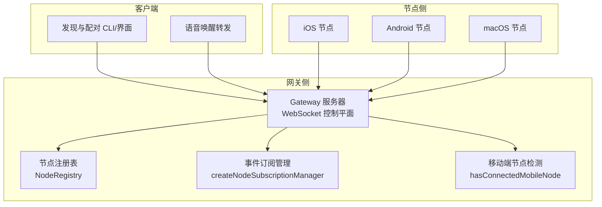
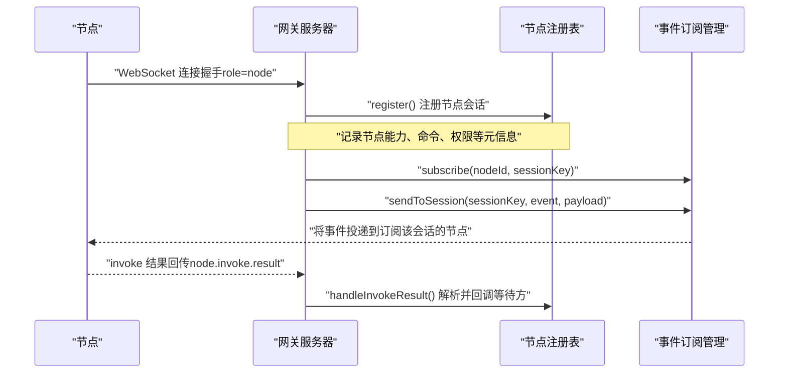
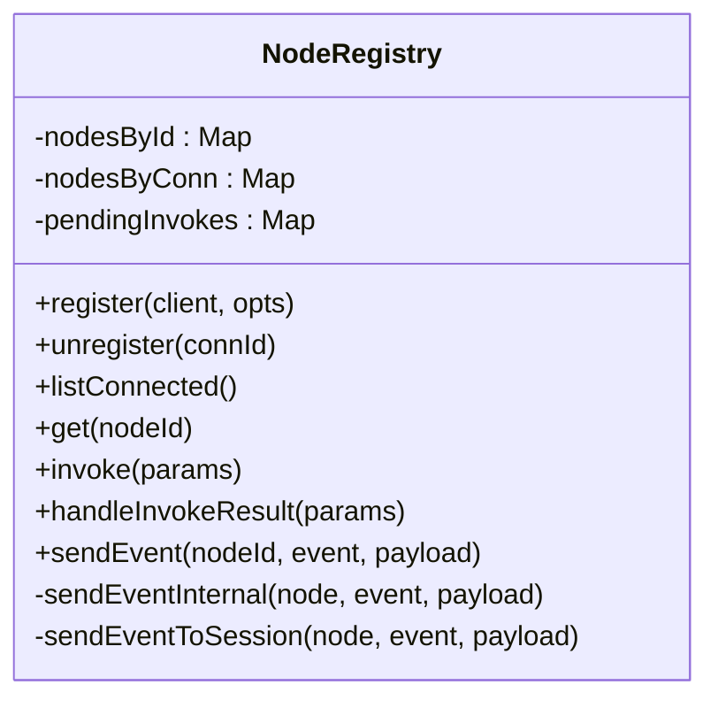
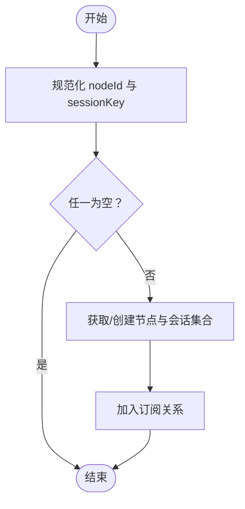
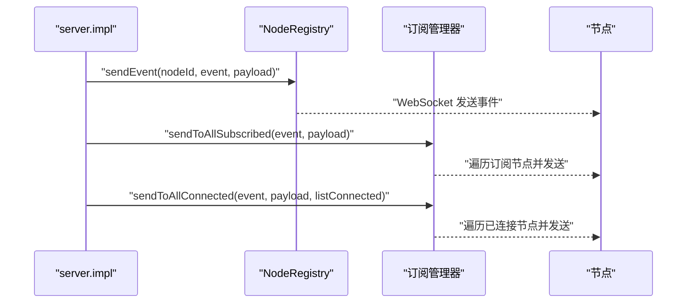
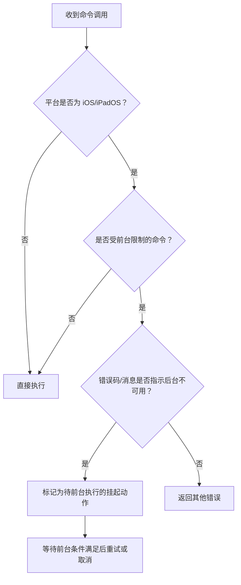
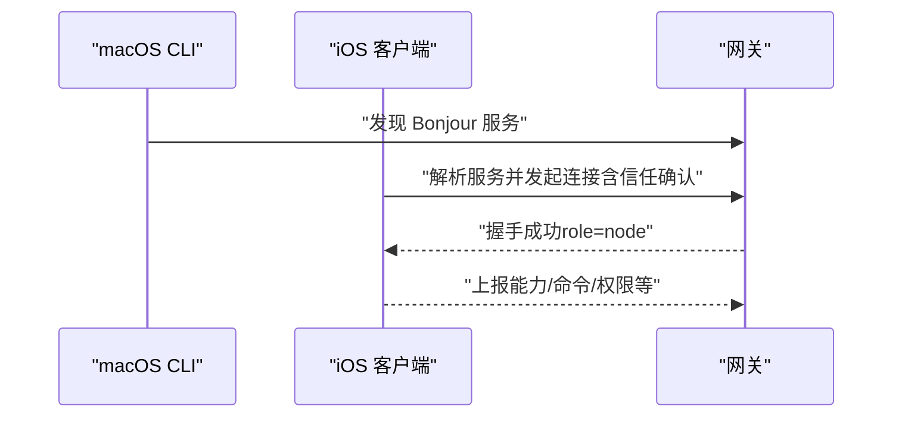
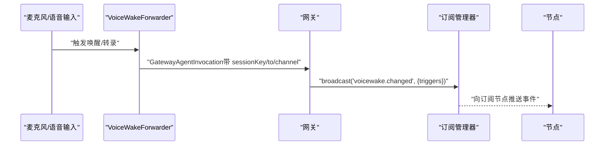
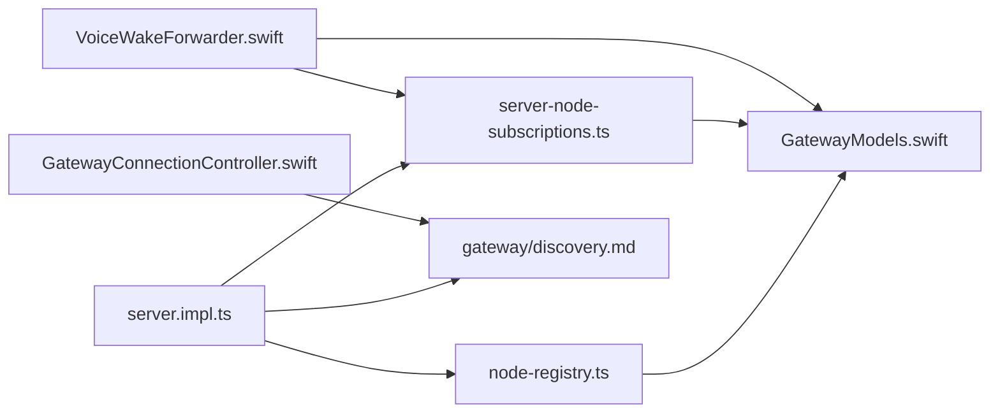

# 节点间通信

<cite>
**本文引用的文件**
- [src/gateway/node-registry.ts](file://src/gateway/node-registry.ts)
- [src/gateway/server-node-subscriptions.ts](file://src/gateway/server-node-subscriptions.ts)
- [src/gateway/server.impl.ts](file://src/gateway/server.impl.ts)
- [src/gateway/server-methods/nodes.ts](file://src/gateway/server-methods/nodes.ts)
- [src/gateway/server-mobile-nodes.ts](file://src/gateway/server-mobile-nodes.ts)
- [apps/macos/Sources/OpenClawMacCLI/DiscoverCommand.swift](file://apps/macos/Sources/OpenClawMacCLI/DiscoverCommand.swift)
- [apps/ios/Sources/Gateway/GatewayConnectionController.swift](file://apps/ios/Sources/Gateway/GatewayConnectionController.swift)
- [apps/macos/Sources/OpenClaw/VoiceWakeForwarder.swift](file://apps/macos/Sources/OpenClaw/VoiceWakeForwarder.swift)
- [apps/shared/OpenClawKit/Sources/OpenClawProtocol/GatewayModels.swift](file://apps/shared/OpenClawKit/Sources/OpenClawProtocol/GatewayModels.swift)
- [apps/shared/OpenClawKit/Sources/OpenClawKit/GatewayNodeSession.swift](file://apps/shared/OpenClawKit/Sources/OpenClawKit/GatewayNodeSession.swift)
- [apps/macos/Sources/OpenClawIPC/IPC.swift](file://apps/macos/Sources/OpenClawIPC/IPC.swift)
- [docs/nodes/index.md](file://docs/nodes/index.md)
- [docs/nodes/voicewake.md](file://docs/nodes/voicewake.md)
- [docs/gateway/discovery.md](file://docs/gateway/discovery.md)
- [src/agents/tools/nodes-utils.ts](file://src/agents/tools/nodes-utils.ts)
- [src/agents/tools/nodes-tool.ts](file://src/agents/tools/nodes-tool.ts)
- [src/infra/heartbeat-wake.ts](file://src/infra/heartbeat-wake.ts)
- [src/infra/restart.ts](file://src/infra/restart.ts)
</cite>

## 目录

1. [引言](#引言)
2. [项目结构](#项目结构)
3. [核心组件](#核心组件)
4. [架构总览](#架构总览)
5. [详细组件分析](#详细组件分析)
6. [依赖关系分析](#依赖关系分析)
7. [性能考量](#性能考量)
8. [故障排查指南](#故障排查指南)
9. [结论](#结论)
10. [附录：节点扩展与协议兼容](#附录节点扩展与协议兼容)

## 引言

本文件系统化阐述 OpenClaw 的节点间通信机制，覆盖节点注册表、节点发现与连接管理、事件订阅系统、语音唤醒与画布节点的通信协议与消息传递、状态同步策略、节点生命周期与故障恢复、负载均衡、权限与安全、性能监控指标，以及节点扩展开发与协议版本兼容管理。

## 项目结构

OpenClaw 将“网关”作为控制平面，节点（macOS/iOS/Android/headless）通过 WebSocket 连接至同一端口，使用统一的“节点命令面”（如 canvas._、camera._、system.\*）并通过 node.invoke 发起调用。客户端侧提供多平台实现（macOS CLI、iOS 客户端、Android 应用），并辅以发现与配对流程。

图示来源

- [src/gateway/server.impl.ts:627-646](file://src/gateway/server.impl.ts#L627-L646)
- [src/gateway/node-registry.ts:38-105](file://src/gateway/node-registry.ts#L38-L105)
- [src/gateway/server-node-subscriptions.ts:33-164](file://src/gateway/server-node-subscriptions.ts#L33-L164)
- [src/gateway/server-mobile-nodes.ts:11-14](file://src/gateway/server-mobile-nodes.ts#L11-L14)
- [apps/macos/Sources/OpenClawMacCLI/DiscoverCommand.swift:1-55](file://apps/macos/Sources/OpenClawMacCLI/DiscoverCommand.swift#L1-L55)
- [apps/macos/Sources/OpenClaw/VoiceWakeForwarder.swift:43-73](file://apps/macos/Sources/OpenClaw/VoiceWakeForwarder.swift#L43-L73)

章节来源

- [docs/gateway/discovery.md:1-124](file://docs/gateway/discovery.md#L1-L124)
- [docs/nodes/index.md:1-385](file://docs/nodes/index.md#L1-L385)

## 核心组件

- 节点注册表（NodeRegistry）
  - 维护节点会话、连接映射、待处理调用队列，并负责向节点发送事件。
- 事件订阅管理（createNodeSubscriptionManager）
  - 基于会话键（sessionKey）对节点进行分组订阅，支持按会话广播、向已订阅节点广播、向所有已连接节点广播。
- 网关运行时（server.impl）
  - 初始化注册表与订阅管理器，桥接事件发送、心跳、维护任务与广播通道。
- 移动端节点检测
  - 检测是否存在移动平台节点，用于行为差异（如前台限制）。
- 客户端发现与连接
  - macOS CLI 提供发现参数解析；iOS 客户端负责服务解析、信任提示与连接选项构造。

章节来源

- [src/gateway/node-registry.ts:38-210](file://src/gateway/node-registry.ts#L38-L210)
- [src/gateway/server-node-subscriptions.ts:33-164](file://src/gateway/server-node-subscriptions.ts#L33-L164)
- [src/gateway/server.impl.ts:627-646](file://src/gateway/server.impl.ts#L627-L646)
- [src/gateway/server-mobile-nodes.ts:11-14](file://src/gateway/server-mobile-nodes.ts#L11-L14)
- [apps/macos/Sources/OpenClawMacCLI/DiscoverCommand.swift:1-55](file://apps/macos/Sources/OpenClawMacCLI/DiscoverCommand.swift#L1-L55)
- [apps/ios/Sources/Gateway/GatewayConnectionController.swift:20-746](file://apps/ios/Sources/Gateway/GatewayConnectionController.swift#L20-L746)

## 架构总览

OpenClaw 的节点间通信以“网关为中心”的控制平面为核心，节点通过 WebSocket 与网关建立长连接，网关侧通过注册表与订阅管理器协调事件分发与调用结果回传。移动端节点在前台受限场景下采用特殊处理策略，网关侧维护心跳与健康度，客户端侧提供发现与配对能力。

图示来源

- [src/gateway/server.impl.ts:627-646](file://src/gateway/server.impl.ts#L627-L646)
- [src/gateway/node-registry.ts:107-181](file://src/gateway/node-registry.ts#L107-L181)
- [src/gateway/server-node-subscriptions.ts:100-148](file://src/gateway/server-node-subscriptions.ts#L100-L148)

## 详细组件分析

### 节点注册表（NodeRegistry）

职责

- 接收节点连接，构建 NodeSession 并登记到 nodesById/nodesByConn 映射。
- 维护 pendingInvokes，用于 node.invoke 请求的超时与结果回调。
- 提供 sendEvent/sendEventToSession，将事件通过 WebSocket 发送至节点。
- 提供 invoke 方法，封装 node.invoke 请求与响应。

复杂度与性能

- 注册/注销：O(1) 哈希表操作。
- invoke：请求发送 O(1)，等待结果基于定时器与 Map 查询，平均 O(1)。
- 发送事件：O(1) JSON 序列化与 socket 发送。

错误处理

- 节点未连接返回明确错误码。
- 超时自动清理 pendingInvokes 并返回 TIMEOUT。
- 断连时清理对应 pendingInvokes 并拒绝后续回调。

图示来源

- [src/gateway/node-registry.ts:38-210](file://src/gateway/node-registry.ts#L38-L210)

章节来源

- [src/gateway/node-registry.ts:43-208](file://src/gateway/node-registry.ts#L43-L208)

### 事件订阅管理（createNodeSubscriptionManager）

职责

- 以 sessionKey 为维度对节点进行订阅，支持：
  - 订阅/取消订阅
  - 清空某节点的所有订阅
  - 向指定会话广播
  - 向所有订阅节点广播
  - 向所有已连接节点广播（配合 listConnected）

数据结构

- nodeSubscriptions：节点 -> Set(sessionKey)
- sessionSubscribers：会话 -> Set(节点)

图示来源

- [src/gateway/server-node-subscriptions.ts:39-62](file://src/gateway/server-node-subscriptions.ts#L39-L62)

章节来源

- [src/gateway/server-node-subscriptions.ts:33-164](file://src/gateway/server-node-subscriptions.ts#L33-L164)

### 网关运行时集成（server.impl）

职责

- 初始化 NodeRegistry 与订阅管理器。
- 暴露 nodeSendEvent/nodeSendToSession/nodeSendToAllSubscribed 等桥接函数。
- 集成心跳、维护任务、技能刷新、发现与健康检查等子系统。
- 提供广播接口（如 voicewake.changed）。

图示来源

- [src/gateway/server.impl.ts:627-646](file://src/gateway/server.impl.ts#L627-L646)
- [src/gateway/node-registry.ts:183-208](file://src/gateway/node-registry.ts#L183-L208)
- [src/gateway/server-node-subscriptions.ts:121-148](file://src/gateway/server-node-subscriptions.ts#L121-L148)

章节来源

- [src/gateway/server.impl.ts:600-799](file://src/gateway/server.impl.ts#L600-L799)

### 移动端节点前台限制（server-methods/nodes.ts）

- 对 iOS/ iPadOS 的 canvas._、camera._、screen._、talk._ 等命令在后台执行时返回特定错误码（如 NODE_BACKGROUND_UNAVAILABLE）。
- 当命令因后台不可用而失败时，可选择排队为“待前台执行”的挂起动作，提升用户体验。

图示来源

- [src/gateway/server-methods/nodes.ts:109-139](file://src/gateway/server-methods/nodes.ts#L109-L139)

章节来源

- [src/gateway/server-methods/nodes.ts:105-139](file://src/gateway/server-methods/nodes.ts#L105-L139)

### 节点发现与连接（客户端）

- macOS CLI DiscoverCommand 支持解析发现参数（超时、输出格式、是否包含本地网关等），并输出发现结果。
- iOS GatewayConnectionController 负责：
  - 服务解析与发现模型
  - 信任提示（指纹校验）
  - 连接选项构造（角色、作用域、能力、命令、权限、客户端标识等）
  - IPv6 回环地址判断与手动稳定 ID 生成

图示来源

- [apps/macos/Sources/OpenClawMacCLI/DiscoverCommand.swift:1-55](file://apps/macos/Sources/OpenClawMacCLI/DiscoverCommand.swift#L1-L55)
- [apps/ios/Sources/Gateway/GatewayConnectionController.swift:20-746](file://apps/ios/Sources/Gateway/GatewayConnectionController.swift#L20-L746)

章节来源

- [apps/macos/Sources/OpenClawMacCLI/DiscoverCommand.swift:1-55](file://apps/macos/Sources/OpenClawMacCLI/DiscoverCommand.swift#L1-L55)
- [apps/ios/Sources/Gateway/GatewayConnectionController.swift:20-746](file://apps/ios/Sources/Gateway/GatewayConnectionController.swift#L20-L746)
- [docs/gateway/discovery.md:43-124](file://docs/gateway/discovery.md#L43-L124)

### 语音唤醒与画布节点通信（macOS）

- macOS 语音唤醒转发器通过 GatewayConnection 调用 GatewayAgentInvocation，将带前缀的转录文本投递给网关。
- 网关侧通过订阅管理器将 voicewake.changed 广播给所有订阅节点，实现跨设备同步。

图示来源

- [apps/macos/Sources/OpenClaw/VoiceWakeForwarder.swift:43-73](file://apps/macos/Sources/OpenClaw/VoiceWakeForwarder.swift#L43-L73)
- [src/gateway/server.impl.ts:642-644](file://src/gateway/server.impl.ts#L642-L644)
- [src/gateway/server-node-subscriptions.ts:121-148](file://src/gateway/server-node-subscriptions.ts#L121-L148)

章节来源

- [apps/macos/Sources/OpenClaw/VoiceWakeForwarder.swift:43-73](file://apps/macos/Sources/OpenClaw/VoiceWakeForwarder.swift#L43-L73)
- [docs/nodes/voicewake.md:58-67](file://docs/nodes/voicewake.md#L58-L67)

### 协议与消息模型（客户端/网关）

- GatewayModels 定义了 HelloOk、RequestFrame、NodeInvokeParams、NodeInvokeResultParams 等消息结构，确保跨语言一致的 RPC 语义。
- macOS IPC 中的 Canvas 命令（canvasEval、canvasSnapshot、canvasA2UI 等）通过统一编码结构与网关交互。

章节来源

- [apps/shared/OpenClawKit/Sources/OpenClawProtocol/GatewayModels.swift:77-123](file://apps/shared/OpenClawKit/Sources/OpenClawProtocol/GatewayModels.swift#L77-L123)
- [apps/shared/OpenClawKit/Sources/OpenClawProtocol/GatewayModels.swift:874-929](file://apps/shared/OpenClawKit/Sources/OpenClawProtocol/GatewayModels.swift#L874-L929)
- [apps/macos/Sources/OpenClawIPC/IPC.swift:245-270](file://apps/macos/Sources/OpenClawIPC/IPC.swift#L245-L270)

### 节点工具与默认节点选择（负载均衡与可用性）

- nodes-utils 提供默认节点选择逻辑：优先具备所需能力（如 canvas）、优先本地 Mac、否则按顺序选择。
- nodes-tool 提供 location、run 等工具命令，底层通过 invokeNodeCommandPayload 调用节点命令，支持超时与幂等键。

章节来源

- [src/agents/tools/nodes-utils.ts:90-169](file://src/agents/tools/nodes-utils.ts#L90-L169)
- [src/agents/tools/nodes-tool.ts:573-608](file://src/agents/tools/nodes-tool.ts#L573-L608)

## 依赖关系分析

- server.impl 依赖 NodeRegistry 与 createNodeSubscriptionManager，形成“注册—订阅—广播”的闭环。
- NodeRegistry 依赖 WebSocket 客户端类型（GatewayWsClient）以发送事件。
- 客户端侧（iOS/macOS）依赖发现与连接控制器完成服务解析与握手。
- 语音唤醒与画布 IPC 通过 GatewayModels 与 IPC.swift 与网关协议对接。

图示来源

- [src/gateway/server.impl.ts:627-646](file://src/gateway/server.impl.ts#L627-L646)
- [src/gateway/node-registry.ts:38-105](file://src/gateway/node-registry.ts#L38-L105)
- [src/gateway/server-node-subscriptions.ts:33-164](file://src/gateway/server-node-subscriptions.ts#L33-L164)
- [apps/ios/Sources/Gateway/GatewayConnectionController.swift:20-746](file://apps/ios/Sources/Gateway/GatewayConnectionController.swift#L20-L746)
- [apps/macos/Sources/OpenClaw/VoiceWakeForwarder.swift:43-73](file://apps/macos/Sources/OpenClaw/VoiceWakeForwarder.swift#L43-L73)
- [apps/shared/OpenClawKit/Sources/OpenClawProtocol/GatewayModels.swift:77-123](file://apps/shared/OpenClawKit/Sources/OpenClawProtocol/GatewayModels.swift#L77-L123)

章节来源

- [src/gateway/server.impl.ts:600-799](file://src/gateway/server.impl.ts#L600-L799)
- [docs/gateway/discovery.md:1-124](file://docs/gateway/discovery.md#L1-L124)

## 性能考量

- 事件广播
  - sendToSession：按会话遍历订阅节点，适合定向广播。
  - sendToAllSubscribed：遍历所有订阅节点，适合全量通知。
  - sendToAllConnected：依赖 listConnected，适合按当前在线节点广播。
- 心跳与健康
  - 心跳唤醒处理器支持合并去抖与生命周期清理，避免重复调度与陈旧状态。
  - 网关维护定时器负责健康快照、媒体清理、消息去重等，降低网关压力。
- 超时与幂等
  - node.invoke 支持超时与幂等键，防止重复执行与资源泄漏。
- 前台限制
  - 对 iOS/iPadOS 的敏感命令在后台失败时采用挂起策略，减少重试风暴。

章节来源

- [src/gateway/server-node-subscriptions.ts:100-148](file://src/gateway/server-node-subscriptions.ts#L100-L148)
- [src/gateway/server.impl.ts:700-799](file://src/gateway/server.impl.ts#L700-L799)
- [src/infra/heartbeat-wake.ts:196-236](file://src/infra/heartbeat-wake.ts#L196-L236)
- [src/gateway/server-methods/nodes.ts:109-139](file://src/gateway/server-methods/nodes.ts#L109-L139)

## 故障排查指南

- 节点未连接
  - invoke 返回 NOT_CONNECTED 或 UNAVAILABLE，检查节点是否已注册与连接。
- 超时
  - invoke 返回 TIMEOUT，检查节点处理耗时、网络延迟与超时配置。
- 断连清理
  - unregister 会清理 pendingInvokes 并拒绝后续回调，避免悬挂任务。
- 前台不可用
  - iOS/iPadOS 返回 NODE_BACKGROUND_UNAVAILABLE，确认应用处于前台或使用挂起策略。
- 发现与信任
  - Bonjour/TLS 指纹校验失败需重新信任；TXT 记录仅作 UX 提示，路由应优先 SRV/A/AAAA。
- 重启与审计
  - 进程内重启后心跳唤醒处理器会清理旧状态并重置运行态，避免陈旧计时器影响。

章节来源

- [src/gateway/node-registry.ts:81-97](file://src/gateway/node-registry.ts#L81-L97)
- [src/gateway/node-registry.ts:113-154](file://src/gateway/node-registry.ts#L113-L154)
- [src/gateway/server-methods/nodes.ts:109-139](file://src/gateway/server-methods/nodes.ts#L109-L139)
- [docs/gateway/discovery.md:71-77](file://docs/gateway/discovery.md#L71-L77)
- [src/infra/heartbeat-wake.ts:202-236](file://src/infra/heartbeat-wake.ts#L202-L236)
- [src/infra/restart.ts:42-71](file://src/infra/restart.ts#L42-L71)

## 结论

OpenClaw 的节点间通信以“注册—订阅—广播”为核心，结合移动端前台限制、心跳与维护任务、超时与幂等策略，实现了高可用、可观测且易扩展的节点控制平面。通过统一的协议模型与客户端发现/连接流程，确保跨平台一致性与安全性。

## 附录：节点扩展与协议兼容

- 自定义节点实现
  - 通过 WebSocket 连接并声明 capabilities/commands/permissions，遵循 GatewayModels 的消息结构。
  - 使用 node.invoke 发起命令，提供幂等键与合理超时。
- 事件订阅
  - 通过 subscribe/unsubscribe 管理会话级订阅，实现定向广播与全量通知。
- 权限与安全
  - 节点侧权限映射（permissions）由网关读取并用于 UI 展示与策略决策；TLS 指纹校验与信任提示必须严格遵循。
- 性能监控
  - 利用心跳、健康快照、媒体清理与去重机制，结合日志与指标（如 activeRuns、busy 状态）评估节点负载。
- 版本兼容
  - 协议字段命名与编码（如 payloadJSON、timeoutMs、idempotencyKey）保持稳定；新增字段建议向后兼容并在客户端/网关侧做兼容性判断。

章节来源

- [apps/shared/OpenClawKit/Sources/OpenClawProtocol/GatewayModels.swift:874-929](file://apps/shared/OpenClawKit/Sources/OpenClawProtocol/GatewayModels.swift#L874-L929)
- [apps/macos/Sources/OpenClawIPC/IPC.swift:245-270](file://apps/macos/Sources/OpenClawIPC/IPC.swift#L245-L270)
- [docs/nodes/index.md:354-357](file://docs/nodes/index.md#L354-L357)
- [docs/gateway/discovery.md:71-77](file://docs/gateway/discovery.md#L71-L77)
