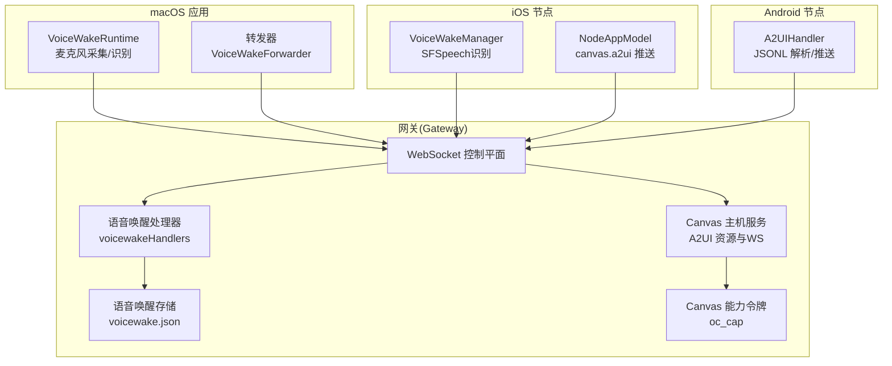
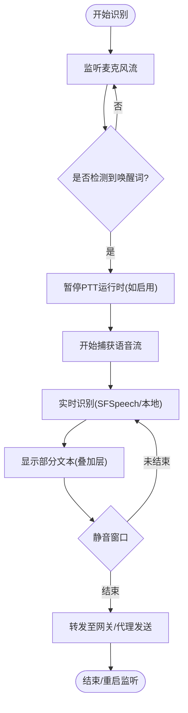
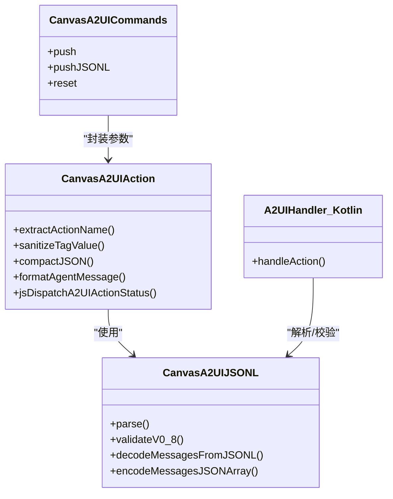
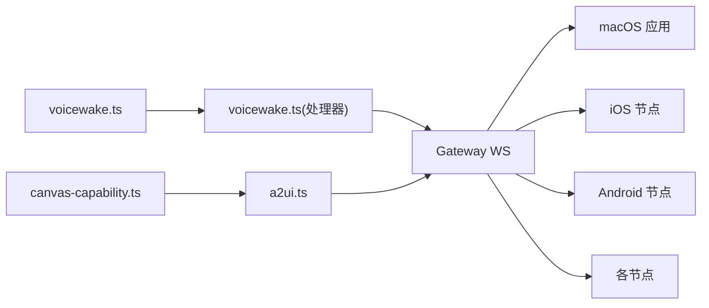

# 语音唤醒与实时画布

<cite>
**本文档引用的文件**
- [README.md](file://README.md)
- [docs/nodes/voicewake.md](file://docs/nodes/voicewake.md)
- [docs/platforms/mac/voicewake.md](file://docs/platforms/mac/voicewake.md)
- [docs/platforms/mac/canvas.md](file://docs/platforms/mac/canvas.md)
- [src/gateway/server-methods/voicewake.ts](file://src/gateway/server-methods/voicewake.ts)
- [src/infra/voicewake.ts](file://src/infra/voicewake.ts)
- [src/agents/tools/canvas-tool.ts](file://src/agents/tools/canvas-tool.ts)
- [apps/shared/OpenClawKit/Sources/OpenClawKit/CanvasA2UICommands.swift](file://apps/shared/OpenClawKit/Sources/OpenClawKit/CanvasA2UICommands.swift)
- [apps/shared/OpenClawKit/Sources/OpenClawKit/CanvasA2UIAction.swift](file://apps/shared/OpenClawKit/Sources/OpenClawKit/CanvasA2UIAction.swift)
- [apps/shared/OpenClawKit/Sources/OpenClawKit/CanvasA2UIJSONL.swift](file://apps/shared/OpenClawKit/Sources/OpenClawKit/CanvasA2UIJSONL.swift)
- [apps/macos/Sources/OpenClaw/VoiceWakeTester.swift](file://apps/macos/Sources/OpenClaw/VoiceWakeTester.swift)
- [apps/ios/Sources/Voice/VoiceWakeManager.swift](file://apps/ios/Sources/Voice/VoiceWakeManager.swift)
- [apps/ios/Sources/Model/NodeAppModel.swift](file://apps/ios/Sources/Model/NodeAppModel.swift)
- [apps/android/app/src/main/java/ai/openclaw/app/node/A2UIHandler.kt](file://apps/android/app/src/main/java/ai/openclaw/app/node/A2UIHandler.kt)
- [apps/android/app/src/main/java/ai/openclaw/app/protocol/OpenClawCanvasA2UIAction.kt](file://apps/android/app/src/main/java/ai/openclaw/app/protocol/OpenClawCanvasA2UIAction.kt)
- [src/gateway/canvas-capability.ts](file://src/gateway/canvas-capability.ts)
- [src/canvas-host/a2ui.ts](file://src/canvas-host/a2ui.ts)
- [src/cli/nodes-cli/register.canvas.ts](file://src/cli/nodes-cli/register.canvas.ts)
</cite>

## 目录

1. [简介](#简介)
2. [项目结构](#项目结构)
3. [核心组件](#核心组件)
4. [架构总览](#架构总览)
5. [详细组件分析](#详细组件分析)
6. [依赖关系分析](#依赖关系分析)
7. [性能考虑](#性能考虑)
8. [故障排查指南](#故障排查指南)
9. [结论](#结论)
10. [附录](#附录)

## 简介

本文件面向OpenClaw在macOS/iOS上的语音唤醒（Voice Wake）与Android平台的连续语音交互，以及跨平台实时画布（Canvas）系统进行深入技术说明。内容涵盖：

- 唤醒词检测与同步机制（macOS/iOS），以及Android端的连续语音流程
- 实时画布系统架构（A2UI协议、Canvas主机服务、跨平台渲染）
- 配置指南、性能优化建议与音频处理底层实现要点
- 节点模式与设备配对机制，以及扩展语音与画布功能的方法

## 项目结构

OpenClaw采用“网关控制平面 + 多平台节点”的分布式架构。语音唤醒与画布能力通过WebSocket协议在网关与各平台节点之间分发与执行。



图示来源

- [src/gateway/server-methods/voicewake.ts:7-34](file://src/gateway/server-methods/voicewake.ts#L7-L34)
- [src/infra/voicewake.ts:30-59](file://src/infra/voicewake.ts#L30-L59)
- [src/canvas-host/a2ui.ts:14-79](file://src/canvas-host/a2ui.ts#L14-L79)
- [src/gateway/canvas-capability.ts:20-40](file://src/gateway/canvas-capability.ts#L20-L40)
- [apps/macos/Sources/OpenClaw/VoiceWakeTester.swift:108-131](file://apps/macos/Sources/OpenClaw/VoiceWakeTester.swift#L108-L131)
- [apps/ios/Sources/Voice/VoiceWakeManager.swift:289-318](file://apps/ios/Sources/Voice/VoiceWakeManager.swift#L289-L318)
- [apps/ios/Sources/Model/NodeAppModel.swift:929-962](file://apps/ios/Sources/Model/NodeAppModel.swift#L929-L962)
- [apps/android/app/src/main/java/ai/openclaw/app/node/A2UIHandler.kt](file://apps/android/app/src/main/java/ai/openclaw/app/node/A2UIHandler.kt)

章节来源

- [README.md:126-136](file://README.md#L126-L136)

## 核心组件

- 语音唤醒（Gateway侧）
  - 方法：voicewake.get、voicewake.set；事件：voicewake.changed
  - 存储：~/.openclaw/settings/voicewake.json
  - 广播：所有客户端与已连接节点
- macOS/iOS语音唤醒
  - macOS：VoiceWakeRuntime + PTT热键；iOS：SFSpeech识别
- Canvas（A2UI）主机服务
  - 提供静态资源托管与WebSocket刷新通道
  - 支持oc_cap能力令牌与scoped URL重写
- 跨平台A2UI协议
  - 支持v0.8消息集：beginRendering、surfaceUpdate、dataModelUpdate、deleteSurface
  - JSONL校验与兼容性检查

章节来源

- [docs/nodes/voicewake.md:9-67](file://docs/nodes/voicewake.md#L9-L67)
- [docs/platforms/mac/voicewake.md:8-68](file://docs/platforms/mac/voicewake.md#L8-L68)
- [src/gateway/server-methods/voicewake.ts:7-34](file://src/gateway/server-methods/voicewake.ts#L7-L34)
- [src/infra/voicewake.ts:30-59](file://src/infra/voicewake.ts#L30-L59)
- [src/canvas-host/a2ui.ts:14-79](file://src/canvas-host/a2ui.ts#L14-L79)
- [src/gateway/canvas-capability.ts:42-87](file://src/gateway/canvas-capability.ts#L42-L87)

## 架构总览

下图展示从语音触发到画布渲染的关键路径与组件交互：

```mermaid
sequenceDiagram
participant User as "用户"
participant MAC as "macOS 应用"
participant IOS as "iOS 节点"
participant AND as "Android 节点"
participant GW as "网关(Gateway)"
participant CH as "Canvas 主机(A2UI)"
participant NODE as "节点(设备)"
User->>MAC : "唤醒词/PTT"
MAC->>GW : "语音转录(WS)"
User->>IOS : "SFSpeech 识别"
IOS->>GW : "语音转录(WS)"
User->>AND : "手动录音(语音标签页)"
AND->>GW : "语音转录(WS)"
GW-->>GW : "广播 voicewake.changed"
GW->>NODE : "推送最新唤醒词"
GW->>CH : "A2UI 消息(JSONL)"
CH-->>NODE : "WebSocket 刷新(reload)"
NODE-->>User : "画布更新/状态反馈"
```

图示来源

- [docs/nodes/voicewake.md:30-49](file://docs/nodes/voicewake.md#L30-L49)
- [src/gateway/server-methods/voicewake.ts:7-34](file://src/gateway/server-methods/voicewake.ts#L7-L34)
- [src/canvas-host/a2ui.ts:122-140](file://src/canvas-host/a2ui.ts#L122-L140)

## 详细组件分析

### 语音唤醒（macOS/iOS）

- macOS
  - 运行时：VoiceWakeRuntime（后台常驻识别）
  - PTT：右Option键全局监听，避免与唤醒词冲突
  - 转发：VoiceWakeForwarder将转录结果发送至当前会话
- iOS
  - 识别：VoiceWakeManager 使用SFSpeech识别
  - 回调：主线程处理识别结果与错误
  - 节点命令：支持canvas.a2ui.push/pushJSONL，自动等待A2UI就绪
- 数据同步
  - Gateway维护全局唤醒词列表，变更后广播给所有客户端与节点



图示来源

- [docs/platforms/mac/voicewake.md:15-23](file://docs/platforms/mac/voicewake.md#L15-L23)
- [apps/macos/Sources/OpenClaw/VoiceWakeTester.swift:108-131](file://apps/macos/Sources/OpenClaw/VoiceWakeTester.swift#L108-L131)
- [apps/ios/Sources/Voice/VoiceWakeManager.swift:289-318](file://apps/ios/Sources/Voice/VoiceWakeManager.swift#L289-L318)

章节来源

- [docs/platforms/mac/voicewake.md:8-68](file://docs/platforms/mac/voicewake.md#L8-L68)
- [apps/macos/Sources/OpenClaw/VoiceWakeTester.swift:108-131](file://apps/macos/Sources/OpenClaw/VoiceWakeTester.swift#L108-L131)
- [apps/ios/Sources/Voice/VoiceWakeManager.swift:289-318](file://apps/ios/Sources/Voice/VoiceWakeManager.swift#L289-L318)
- [apps/ios/Sources/Model/NodeAppModel.swift:929-962](file://apps/ios/Sources/Model/NodeAppModel.swift#L929-L962)

### Android 连续语音（语音标签页）

- 当前行为
  - 语音唤醒在Android端默认关闭，使用“语音标签页”的手动麦克风采集
- 扩展方向
  - 可引入唤醒词识别或SFSpeech风格的持续识别（需评估权限与能耗）
  - 保持与Gateway的统一转录与转发流程一致

章节来源

- [docs/nodes/voicewake.md:63-67](file://docs/nodes/voicewake.md#L63-L67)

### 实时画布系统（A2UI 协议与Canvas主机）

- Canvas主机服务
  - 路由：/**openclaw**/a2ui/（静态资源）、/**openclaw**/ws（刷新WS）
  - 注入：向HTML注入桥接脚本与WebSocket刷新逻辑
  - 能力令牌：oc_cap参数用于安全访问与scoped URL重写
- A2UI 协议
  - 支持v0.8消息：beginRendering、surfaceUpdate、dataModelUpdate、deleteSurface
  - JSONL解析与校验，禁止v0.9的createSurface
- 跨平台推送
  - iOS：NodeAppModel解码push/pushJSONL，确保A2UI就绪后推送
  - Android：A2UIHandler负责解析与应用消息
  - CLI：nodes canvas a2ui push 支持--jsonl或--text



图示来源

- [apps/shared/OpenClawKit/Sources/OpenClawKit/CanvasA2UICommands.swift:3-26](file://apps/shared/OpenClawKit/Sources/OpenClawKit/CanvasA2UICommands.swift#L3-L26)
- [apps/shared/OpenClawKit/Sources/OpenClawKit/CanvasA2UIAction.swift:40-81](file://apps/shared/OpenClawKit/Sources/OpenClawKit/CanvasA2UIAction.swift#L40-L81)
- [apps/shared/OpenClawKit/Sources/OpenClawKit/CanvasA2UIJSONL.swift:14-81](file://apps/shared/OpenClawKit/Sources/OpenClawKit/CanvasA2UIJSONL.swift#L14-L81)
- [apps/android/app/src/main/java/ai/openclaw/app/node/A2UIHandler.kt](file://apps/android/app/src/main/java/ai/openclaw/app/node/A2UIHandler.kt)

章节来源

- [src/canvas-host/a2ui.ts:14-79](file://src/canvas-host/a2ui.ts#L14-L79)
- [src/gateway/canvas-capability.ts:42-87](file://src/gateway/canvas-capability.ts#L42-L87)
- [apps/shared/OpenClawKit/Sources/OpenClawKit/CanvasA2UIJSONL.swift:29-64](file://apps/shared/OpenClawKit/Sources/OpenClawKit/CanvasA2UIJSONL.swift#L29-L64)
- [apps/ios/Sources/Model/NodeAppModel.swift:929-962](file://apps/ios/Sources/Model/NodeAppModel.swift#L929-L962)
- [apps/android/app/src/main/java/ai/openclaw/app/node/A2UIHandler.kt](file://apps/android/app/src/main/java/ai/openclaw/app/node/A2UIHandler.kt)
- [src/cli/nodes-cli/register.canvas.ts:189-205](file://src/cli/nodes-cli/register.canvas.ts#L189-L205)

### 画布工具（Agent侧）

- 工具名称：canvas
- 支持动作：present、hide、navigate、eval、snapshot、a2ui_push、a2ui_reset
- 安全策略：限制JSONL读取路径在允许根目录内；快照输出为临时文件并返回图像结果
- 节点调用：通过node.invoke转发到目标节点

章节来源

- [src/agents/tools/canvas-tool.ts:18-26](file://src/agents/tools/canvas-tool.ts#L18-L26)
- [src/agents/tools/canvas-tool.ts:30-51](file://src/agents/tools/canvas-tool.ts#L30-L51)
- [src/agents/tools/canvas-tool.ts:194-213](file://src/agents/tools/canvas-tool.ts#L194-L213)

## 依赖关系分析

- 语音唤醒
  - Gateway侧：voicewakeHandlers依赖infra/voicewake存储与广播
  - 客户端：macOS/iOS分别维护本地识别与转发
- 画布
  - Gateway侧：canvas-capability生成oc_cap，a2ui.ts托管静态资源与WS刷新
  - 节点侧：iOS/Android解析JSONL并渲染，CLI提供推送入口



图示来源

- [src/infra/voicewake.ts:30-59](file://src/infra/voicewake.ts#L30-L59)
- [src/gateway/server-methods/voicewake.ts:7-34](file://src/gateway/server-methods/voicewake.ts#L7-L34)
- [src/gateway/canvas-capability.ts:20-40](file://src/gateway/canvas-capability.ts#L20-L40)
- [src/canvas-host/a2ui.ts:14-79](file://src/canvas-host/a2ui.ts#L14-L79)

章节来源

- [src/gateway/server-methods/voicewake.ts:7-34](file://src/gateway/server-methods/voicewake.ts#L7-L34)
- [src/infra/voicewake.ts:30-59](file://src/infra/voicewake.ts#L30-L59)
- [src/gateway/canvas-capability.ts:42-87](file://src/gateway/canvas-capability.ts#L42-L87)
- [src/canvas-host/a2ui.ts:142-209](file://src/canvas-host/a2ui.ts#L142-L209)

## 性能考虑

- 语音唤醒
  - macOS：识别器生命周期管理，overlay不阻塞重启；PTT期间暂停唤醒词识别以避免冲突
  - iOS：主线程回调处理识别结果，避免阻塞识别任务
- 画布渲染
  - A2UI资源按需加载，HTML注入仅在HTML响应时注入；WebSocket用于增量刷新
  - oc_cap缩短有效路径，减少无效请求
- I/O与安全
  - JSONL路径白名单与真实路径解析，防止越权读取
  - 快照输出到临时文件，避免重复序列化

章节来源

- [docs/platforms/mac/voicewake.md:25-45](file://docs/platforms/mac/voicewake.md#L25-L45)
- [apps/ios/Sources/Voice/VoiceWakeManager.swift:301-313](file://apps/ios/Sources/Voice/VoiceWakeManager.swift#L301-L313)
- [src/canvas-host/a2ui.ts:196-205](file://src/canvas-host/a2ui.ts#L196-L205)
- [src/agents/tools/canvas-tool.ts:30-51](file://src/agents/tools/canvas-tool.ts#L30-L51)

## 故障排查指南

- 语音唤醒
  - 权限缺失：确认麦克风与语音识别权限；macOS需要无障碍/输入监控
  - 识别失败：检查网络与SFSpeech可用性；查看识别回调错误信息
  - 同步问题：确认Gateway广播的唤醒词列表是否正确下发
- 画布
  - A2UI资源不可用：确认Canvas主机服务可访问且A2UI资产存在
  - oc_cap无效：检查scoped URL是否包含oc_cap查询参数
  - JSONL格式错误：核对消息类型集合与v0.8规范
- 节点命令
  - iOS：确保A2UI主机可用，必要时等待超时后重试
  - Android：确认A2UIHandler正确解析JSONL并应用

章节来源

- [docs/platforms/mac/voicewake.md:47-68](file://docs/platforms/mac/voicewake.md#L47-L68)
- [apps/ios/Sources/Model/NodeAppModel.swift:945-962](file://apps/ios/Sources/Model/NodeAppModel.swift#L945-L962)
- [apps/shared/OpenClawKit/Sources/OpenClawKit/CanvasA2UIJSONL.swift:29-64](file://apps/shared/OpenClawKit/Sources/OpenClawKit/CanvasA2UIJSONL.swift#L29-L64)
- [src/canvas-host/a2ui.ts:165-171](file://src/canvas-host/a2ui.ts#L165-L171)

## 结论

OpenClaw在多平台实现了统一的语音唤醒与实时画布体验：

- 语音唤醒通过Gateway集中管理与广播，macOS/iOS分别采用本地识别与SFSpeech，Android采用手动录音
- Canvas通过A2UI协议与Canvas主机服务实现跨平台可视化工作空间，支持增量刷新与能力令牌保护
- 通过严格的路径白名单与JSONL校验，保障了安全性与稳定性

## 附录

### 配置与使用指引

- 语音唤醒
  - 修改全局唤醒词：调用voicewake.set并观察voicewake.changed事件
  - macOS/iOS设置：在应用中启用Voice Wake与PTT热键
- 画布
  - 推送A2UI：使用nodes canvas a2ui push，支持--jsonl或--text
  - 访问主机：通过oc_cap生成scoped URL，避免直接暴露Canvas主机

章节来源

- [docs/nodes/voicewake.md:30-49](file://docs/nodes/voicewake.md#L30-L49)
- [docs/platforms/mac/canvas.md:67-106](file://docs/platforms/mac/canvas.md#L67-L106)
- [src/cli/nodes-cli/register.canvas.ts:189-205](file://src/cli/nodes-cli/register.canvas.ts#L189-L205)
