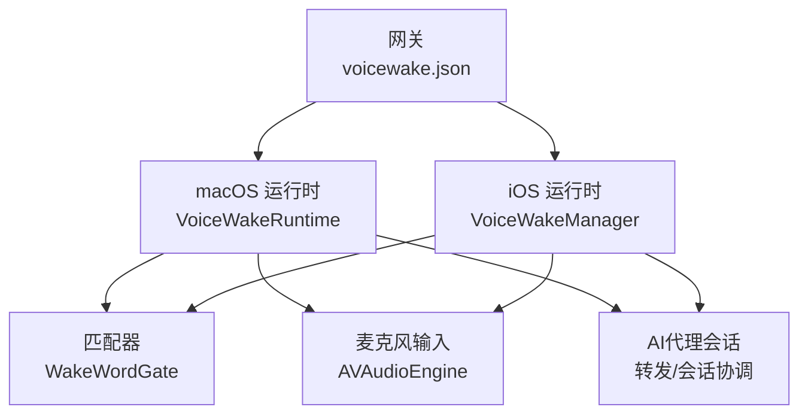
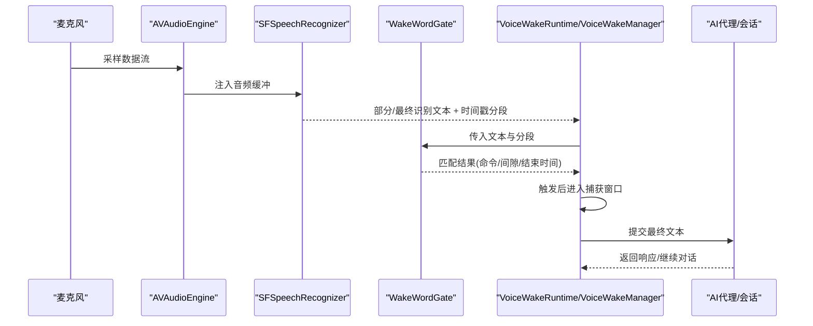
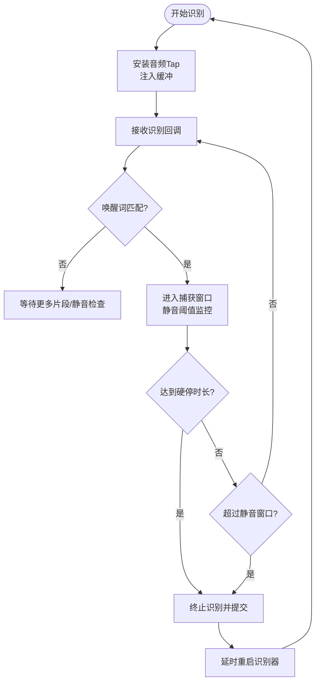
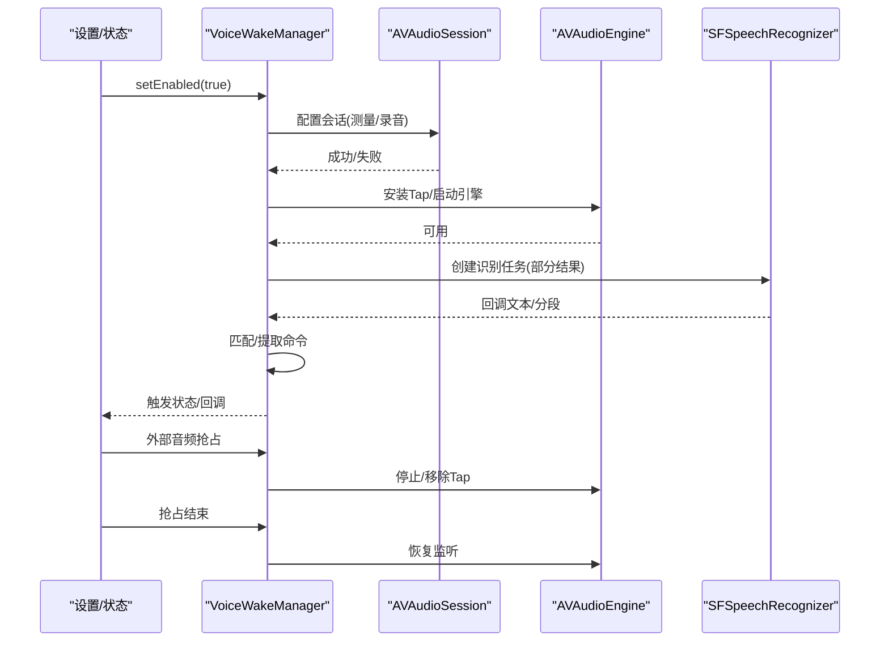
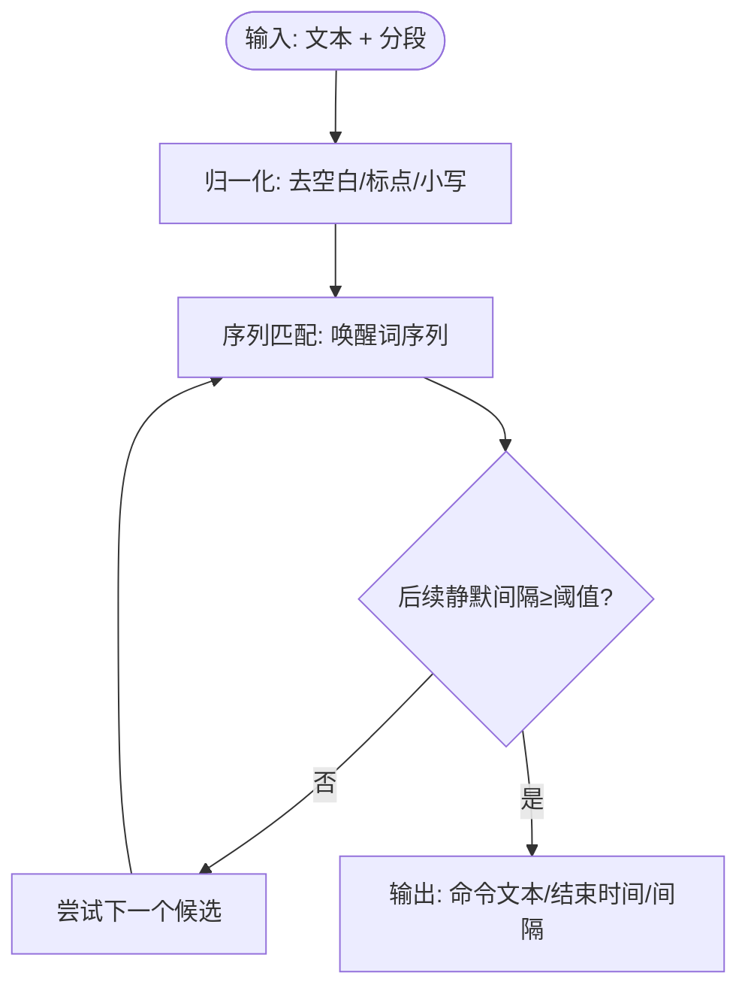
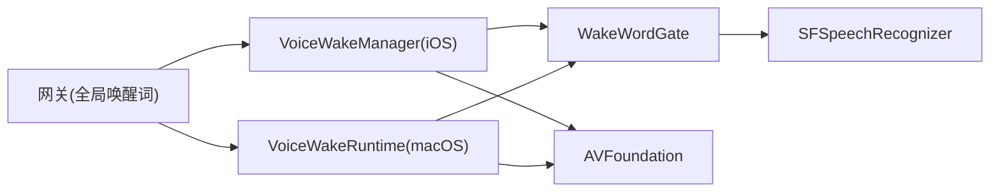

# 语音唤醒处理

<cite>
**本文引用的文件**
- [VoiceWakeRuntime.swift](file://apps/macos/Sources/OpenClaw/VoiceWakeRuntime.swift)
- [VoiceWakeManager.swift](file://apps/ios/Sources/Voice/VoiceWakeManager.swift)
- [WakeWordGate.swift](file://Swabble/Sources/SwabbleKit/WakeWordGate.swift)
- [VoiceWakeTester.swift](file://apps/macos/Sources/OpenClaw/VoiceWakeTester.swift)
- [AudioInputDeviceObserver.swift](file://apps/macos/Sources/OpenClaw/AudioInputDeviceObserver.swift)
- [VoiceWakeWordsSettingsView.swift](file://apps/ios/Sources/Settings/VoiceWakeWordsSettingsView.swift)
- [voicewake.md](file://docs/nodes/voicewake.md)
- [VoiceWakeRecognitionDebugSupport.swift](file://apps/macos/Sources/OpenClaw/VoiceWakeRecognitionDebugSupport.swift)
- [WakeWords.kt](file://apps/android/app/src/main/java/ai/openclaw/app/WakeWords.kt)
- [SecurePrefs.kt](file://apps/android/app/src/main/java/ai/openclaw/app/SecurePrefs.kt)
- [VoiceWakeSettings.swift](file://apps/macos/Sources/OpenClaw/VoiceWakeSettings.swift)
- [VoiceWakePreferences.swift](file://apps/ios/Sources/Voice/VoiceWakePreferences.swift)
</cite>

## 目录

1. [简介](#简介)
2. [项目结构](#项目结构)
3. [核心组件](#核心组件)
4. [架构总览](#架构总览)
5. [详细组件分析](#详细组件分析)
6. [依赖关系分析](#依赖关系分析)
7. [性能考量](#性能考量)
8. [故障排查指南](#故障排查指南)
9. [结论](#结论)
10. [附录](#附录)

## 简介

本文件面向OpenClaw的语音唤醒（Voice Wake）功能，系统性阐述唤醒词检测算法、音频输入捕获机制、实时音频流处理、延迟优化策略、唤醒词配置与敏感度调节、多语言支持、与AI代理引擎的集成方式、唤醒后的会话激活流程，以及错误处理与重试机制。内容覆盖macOS/iOS平台的实现细节，并对Android端的当前行为进行说明。

## 项目结构

OpenClaw在不同平台采用统一的“全局唤醒词列表 + 平台本地运行时”的架构：

- 全局唤醒词由网关维护并广播到所有节点；各平台本地运行时负责实时监听与触发。
- macOS与iOS分别提供独立的运行时组件：macOS使用后台常驻的VoiceWakeRuntime，iOS使用可前台/后台切换的VoiceWakeManager。
- 唤醒词匹配逻辑集中在SwabbleKit的WakeWordGate中，提供基于时间戳分段的精确匹配与文本仅匹配回退。

图表来源

- [VoiceWakeRuntime.swift:11-139](file://apps/macos/Sources/OpenClaw/VoiceWakeRuntime.swift#L11-L139)
- [VoiceWakeManager.swift:83-220](file://apps/ios/Sources/Voice/VoiceWakeManager.swift#L83-L220)
- [WakeWordGate.swift:65-101](file://Swabble/Sources/SwabbleKit/WakeWordGate.swift#L65-L101)
- [voicewake.md:11-66](file://docs/nodes/voicewake.md#L11-L66)

章节来源

- [voicewake.md:11-66](file://docs/nodes/voicewake.md#L11-L66)

## 核心组件

- macOS后台运行时（VoiceWakeRuntime）
  - 负责在后台维持语音识别管道，监听音频输入，执行唤醒词匹配与触发后的会话收尾。
  - 关键特性：延迟优化（tap队列、静音窗口）、冷却去抖、自适应噪声阈值、触发后自动重启识别器。
- iOS前台/后台运行时（VoiceWakeManager）
  - 提供可暂停/恢复的唤醒监听，支持外部音频抢占（如相机视频录制）。
  - 关键特性：权限请求与超时、音频会话配置、结果回调与命令提取。
- 匹配器（WakeWordGate）
  - 基于SFSpeech识别返回的时间戳分段，进行唤醒词序列匹配与命令截取。
  - 支持文本仅匹配回退，提升召回稳定性。
- 测试工具（VoiceWakeTester）
  - 面向设置页与调试场景的测试运行时，用于验证唤醒词配置与识别效果。
- 音频设备观察（AudioInputDeviceObserver）
  - 检测系统默认输入设备变化，保障输入可用性。
- 配置与同步
  - iOS设置界面与偏好存储（VoiceWakeWordsSettingsView、VoiceWakePreferences），Android端唤醒词解析与安全存储（WakeWords.kt、SecurePrefs.kt）。
  - macOS设置页包含麦克风选择、语言选择、音量表等。

章节来源

- [VoiceWakeRuntime.swift:11-139](file://apps/macos/Sources/OpenClaw/VoiceWakeRuntime.swift#L11-L139)
- [VoiceWakeManager.swift:83-220](file://apps/ios/Sources/Voice/VoiceWakeManager.swift#L83-L220)
- [WakeWordGate.swift:65-101](file://Swabble/Sources/SwabbleKit/WakeWordGate.swift#L65-L101)
- [VoiceWakeTester.swift:16-167](file://apps/macos/Sources/OpenClaw/VoiceWakeTester.swift#L16-L167)
- [AudioInputDeviceObserver.swift:60-216](file://apps/macos/Sources/OpenClaw/AudioInputDeviceObserver.swift#L60-L216)
- [VoiceWakeWordsSettingsView.swift:4-98](file://apps/ios/Sources/Settings/VoiceWakeWordsSettingsView.swift#L4-L98)
- [VoiceWakeSettings.swift:603-663](file://apps/macos/Sources/OpenClaw/VoiceWakeSettings.swift#L603-L663)

## 架构总览

OpenClaw的语音唤醒采用“识别 + 匹配 + 触发 + 会话”的流水线式设计：

- 音频输入通过AVFoundation（AVAudioEngine）采集，实时注入SFSpeech识别请求。
- 识别结果携带时间戳分段，交由WakeWordGate进行唤醒词匹配与命令截取。
- 匹配成功后进入“捕获窗口”，在静音阈值与最大时长限制内持续收集语音，最终提交给AI代理引擎或转发模块。

图表来源

- [VoiceWakeRuntime.swift:141-233](file://apps/macos/Sources/OpenClaw/VoiceWakeRuntime.swift#L141-L233)
- [VoiceWakeManager.swift:238-281](file://apps/ios/Sources/Voice/VoiceWakeManager.swift#L238-L281)
- [WakeWordGate.swift:65-101](file://Swabble/Sources/SwabbleKit/WakeWordGate.swift#L65-L101)

## 详细组件分析

### macOS 后台运行时（VoiceWakeRuntime）

- 实时音频流处理
  - 使用AVAudioEngine在输入节点安装tap，以固定buffer大小（macOS为2048）将PCM缓冲注入SFSpeechAudioBufferRecognitionRequest。
  - 识别回调中提取最佳转写文本与时间戳分段，驱动匹配器与UI更新。
- 唤醒词匹配与触发
  - 使用WakeWordGate进行序列匹配；若无时间戳匹配但最终文本命中，使用文本仅匹配回退。
  - 触发后播放提示音、启动会话、记录activeTriggerEndTime，以便精确截取命令文本。
- 捕获窗口与静音检测
  - 触发后根据是否已听到触发后语音选择不同的静音窗口（2秒 vs 5秒）。
  - 自适应噪声阈值（RMS）提升在嘈杂环境下的鲁棒性；UI音量表随能量归一化显示。
- 延迟优化与资源管理
  - 识别生成计数用于丢弃过期回调；识别器在空闲时释放，避免占用音频会话。
  - 触发后立即停止识别，防止缓冲回放导致的重复触发；随后延时重启识别器，保持连续监听能力。
- 冷却与防抖
  - 发送后设置冷却时间，避免误触；冷却期间忽略新触发。
- 会话激活与转发
  - 触发后启动会话协调器，展示听写文本与音量指示；捕获结束后根据是否为空决定播放发送提示音或直接转发。

图表来源

- [VoiceWakeRuntime.swift:576-651](file://apps/macos/Sources/OpenClaw/VoiceWakeRuntime.swift#L576-L651)

章节来源

- [VoiceWakeRuntime.swift:141-233](file://apps/macos/Sources/OpenClaw/VoiceWakeRuntime.swift#L141-L233)
- [VoiceWakeRuntime.swift:278-382](file://apps/macos/Sources/OpenClaw/VoiceWakeRuntime.swift#L278-L382)
- [VoiceWakeRuntime.swift:576-651](file://apps/macos/Sources/OpenClaw/VoiceWakeRuntime.swift#L576-L651)

### iOS 前台/后台运行时（VoiceWakeManager）

- 权限与会话
  - 请求麦克风与语音识别权限，支持超时控制；配置音频会话为测量模式，允许蓝牙通话头盔等设备接入。
- 实时流处理
  - 使用独立的AudioBufferQueue在实时回调中复制缓冲，避免阻塞；后台任务周期性drain队列并注入识别请求。
- 唤醒词匹配与命令提取
  - 与macOS一致，使用WakeWordGate进行匹配；提取命令后回调上层处理并自动重启监听。
- 外部音频抢占
  - 当相机等外部音频捕获激活时，暂停自身监听；外部捕获结束后恢复。

图表来源

- [VoiceWakeManager.swift:160-220](file://apps/ios/Sources/Voice/VoiceWakeManager.swift#L160-L220)
- [VoiceWakeManager.swift:238-281](file://apps/ios/Sources/Voice/VoiceWakeManager.swift#L238-L281)
- [VoiceWakeManager.swift:315-350](file://apps/ios/Sources/Voice/VoiceWakeManager.swift#L315-L350)

章节来源

- [VoiceWakeManager.swift:160-220](file://apps/ios/Sources/Voice/VoiceWakeManager.swift#L160-L220)
- [VoiceWakeManager.swift:238-281](file://apps/ios/Sources/Voice/VoiceWakeManager.swift#L238-L281)
- [VoiceWakeManager.swift:315-350](file://apps/ios/Sources/Voice/VoiceWakeManager.swift#L315-L350)

### 匹配器（WakeWordGate）

- 输入
  - 文本字符串与时间戳分段（由SFSpeech提供）。
- 匹配策略
  - 将唤醒词与识别分段进行归一化（去空白/标点、小写）后序列比对，计算触发结束时间与后续静默间隔。
  - 若未匹配且最终文本命中，使用文本仅匹配回退（matchesTextOnly + stripWake/trim）。
- 输出
  - 匹配结果包含触发结束时间、后续静默间隔与命令文本，供运行时截取与提交。

图表来源

- [WakeWordGate.swift:65-101](file://Swabble/Sources/SwabbleKit/WakeWordGate.swift#L65-L101)
- [WakeWordGate.swift:125-144](file://Swabble/Sources/SwabbleKit/WakeWordGate.swift#L125-L144)

章节来源

- [WakeWordGate.swift:65-101](file://Swabble/Sources/SwabbleKit/WakeWordGate.swift#L65-L101)
- [WakeWordGate.swift:125-144](file://Swabble/Sources/SwabbleKit/WakeWordGate.swift#L125-L144)

### 测试工具（VoiceWakeTester）

- 用途
  - 在设置页或调试场景下验证唤醒词配置与识别效果，支持“静音后检测”回退逻辑。
- 行为
  - 启动识别与音频引擎，安装tap，处理识别回调，按静音窗口策略决定最终检测结果。
- 日志与诊断
  - 提供详细的转录摘要、分段信息与候选间隔日志，便于定位问题。

章节来源

- [VoiceWakeTester.swift:16-167](file://apps/macos/Sources/OpenClaw/VoiceWakeTester.swift#L16-L167)
- [VoiceWakeTester.swift:218-268](file://apps/macos/Sources/OpenClaw/VoiceWakeTester.swift#L218-L268)
- [VoiceWakeTester.swift:388-418](file://apps/macos/Sources/OpenClaw/VoiceWakeTester.swift#L388-L418)

### 音频输入设备观察（AudioInputDeviceObserver）

- 功能
  - 检测系统默认输入设备变更、设备存活状态与输入通道有效性，确保音频输入可用。
- 应用
  - macOS运行时在启动前检查默认输入设备可用性，避免无效设备导致的启动失败。

章节来源

- [AudioInputDeviceObserver.swift:60-216](file://apps/macos/Sources/OpenClaw/AudioInputDeviceObserver.swift#L60-L216)

### 配置与同步

- iOS设置界面
  - 支持编辑唤醒词列表、重置默认值、保存并异步同步至网关；列表变更后延时批量提交，避免频繁网络请求。
- Android端
  - 解析逗号分隔的唤醒词字符串，进行长度与数量限制清理；从安全存储加载/保存，保证默认值与一致性。
- macOS设置页
  - 提供麦克风选择、语言选择、音量表与测试按钮，便于用户校准。

章节来源

- [VoiceWakeWordsSettingsView.swift:4-98](file://apps/ios/Sources/Settings/VoiceWakeWordsSettingsView.swift#L4-L98)
- [VoiceWakePreferences.swift](file://apps/ios/Sources/Voice/VoiceWakePreferences.swift)
- [WakeWords.kt:1-21](file://apps/android/app/src/main/java/ai/openclaw/app/WakeWords.kt#L1-L21)
- [SecurePrefs.kt:302-321](file://apps/android/app/src/main/java/ai/openclaw/app/SecurePrefs.kt#L302-L321)
- [VoiceWakeSettings.swift:603-663](file://apps/macos/Sources/OpenClaw/VoiceWakeSettings.swift#L603-L663)

## 依赖关系分析

- 平台运行时依赖
  - macOS：依赖SwabbleKit的WakeWordGate与SFSpeech；依赖AVFoundation进行音频采集与会话管理。
  - iOS：同样依赖SwabbleKit与SFSpeech；额外处理权限与外部音频抢占。
- 全局配置
  - 唤醒词列表由网关持有并通过协议广播；各平台本地运行时仅负责实时监听与触发。
- 匹配器
  - WakeWordGate是纯Swift实现，依赖SFSpeech提供的分段信息；在非iOS平台可通过适配层提供分段。

图表来源

- [VoiceWakeManager.swift:83-220](file://apps/ios/Sources/Voice/VoiceWakeManager.swift#L83-L220)
- [VoiceWakeRuntime.swift:141-233](file://apps/macos/Sources/OpenClaw/VoiceWakeRuntime.swift#L141-L233)
- [WakeWordGate.swift:65-101](file://Swabble/Sources/SwabbleKit/WakeWordGate.swift#L65-L101)
- [voicewake.md:11-66](file://docs/nodes/voicewake.md#L11-L66)

章节来源

- [VoiceWakeManager.swift:83-220](file://apps/ios/Sources/Voice/VoiceWakeManager.swift#L83-L220)
- [VoiceWakeRuntime.swift:141-233](file://apps/macos/Sources/OpenClaw/VoiceWakeRuntime.swift#L141-L233)
- [voicewake.md:11-66](file://docs/nodes/voicewake.md#L11-L66)

## 性能考量

- 延迟优化
  - iOS使用独立的AudioBufferQueue与后台drain任务，避免实时回调中的阻塞；macOS使用固定buffer大小的tap，降低上下文切换开销。
  - 静音窗口与硬停时长限制，避免长时间监听导致的资源占用与误触发。
- 资源管理
  - 识别器在空闲时释放，避免占用音频会话；触发后立即停止识别，防止缓冲回放。
  - 识别生成计数用于丢弃过期回调，减少无效处理。
- 自适应阈值
  - RMS自适应噪声底噪，结合倍数阈值，提升在不同环境下的稳定性。
- 多语言支持
  - 通过SFSpeechRecognizer的locale配置实现；macOS/iOS均支持指定语言ID，测试工具亦可选择语言。

章节来源

- [VoiceWakeManager.swift:15-39](file://apps/ios/Sources/Voice/VoiceWakeManager.swift#L15-L39)
- [VoiceWakeRuntime.swift:655-674](file://apps/macos/Sources/OpenClaw/VoiceWakeRuntime.swift#L655-L674)
- [VoiceWakeRuntime.swift:576-651](file://apps/macos/Sources/OpenClaw/VoiceWakeRuntime.swift#L576-L651)
- [VoiceWakeTester.swift:36-60](file://apps/macos/Sources/OpenClaw/VoiceWakeTester.swift#L36-L60)

## 故障排查指南

- 权限问题
  - iOS：若麦克风或语音识别权限未授权，会显示相应状态并拒绝启动；可检查权限请求超时与消息提示。
  - macOS：测试工具在缺少隐私描述或权限不足时抛出错误。
- 设备不可用
  - macOS：启动前检查默认输入设备是否存在与可用；若无可用设备，抛出错误并释放引擎。
- 识别异常
  - iOS：识别回调出现错误时，会显示错误状态并在短暂延迟后自动重启；检查日志与状态文本。
  - macOS：识别回调与音频tap均有限制频率的日志输出，便于定位重复/空转问题。
- 唤醒词不生效
  - 检查全局唤醒词列表是否正确同步；确认本地运行时使用的触发词与网关一致。
  - 使用测试工具验证静音后检测与文本仅匹配回退路径。
- 音量表异常
  - macOS设置页提供音量表与错误提示，若无输入或设备异常，会显示相应错误信息。

章节来源

- [VoiceWakeManager.swift:179-213](file://apps/ios/Sources/Voice/VoiceWakeManager.swift#L179-L213)
- [VoiceWakeManager.swift:315-350](file://apps/ios/Sources/Voice/VoiceWakeManager.swift#L315-L350)
- [VoiceWakeTester.swift:431-458](file://apps/macos/Sources/OpenClaw/VoiceWakeTester.swift#L431-L458)
- [AudioInputDeviceObserver.swift:181-216](file://apps/macos/Sources/OpenClaw/AudioInputDeviceObserver.swift#L181-L216)
- [VoiceWakeSettings.swift:603-622](file://apps/macos/Sources/OpenClaw/VoiceWakeSettings.swift#L603-L622)

## 结论

OpenClaw的语音唤醒在macOS与iOS平台上实现了高鲁棒性的实时监听与触发：通过SFSpeech的时间戳分段匹配与文本仅匹配回退，结合静音检测、自适应阈值与资源管理策略，在保证低延迟的同时提升了误触抑制能力。全局唤醒词列表由网关统一管理，确保跨平台一致性；平台本地运行时专注于高效、稳定的音频流处理与会话激活。Android端当前以手动麦克风捕获为主，未来可借鉴iOS/macOS的权限与会话管理经验进行增强。

## 附录

- 唤醒词配置参数
  - 最小触发后静默间隔、最小命令长度、最小命令长度等参数由WakeWordGateConfig控制。
- 敏感度调节
  - 通过minPostTriggerGap与minCommandLength调整匹配严格度；macOS端还可通过自适应阈值与倍数因子影响触发灵敏度。
- 多语言支持
  - 通过localeID配置SFSpeechRecognizer语言；测试工具与运行时均支持指定语言。
- 与AI代理引擎集成
  - 触发后将最终文本提交至会话协调器或转发模块，由AI代理引擎继续处理；发送提示音与会话UI由运行时协调。

章节来源

- [WakeWordGate.swift:19-32](file://Swabble/Sources/SwabbleKit/WakeWordGate.swift#L19-L32)
- [VoiceWakeRuntime.swift:531-574](file://apps/macos/Sources/OpenClaw/VoiceWakeRuntime.swift#L531-L574)
- [VoiceWakeManager.swift:356-364](file://apps/ios/Sources/Voice/VoiceWakeManager.swift#L356-L364)
- [voicewake.md:11-66](file://docs/nodes/voicewake.md#L11-L66)
