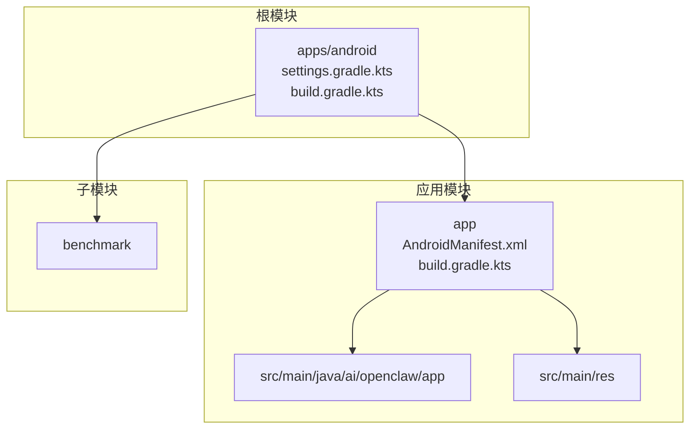
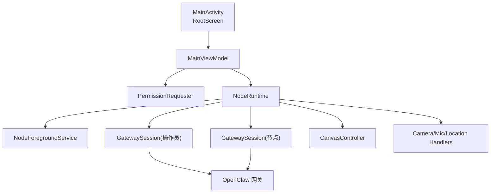
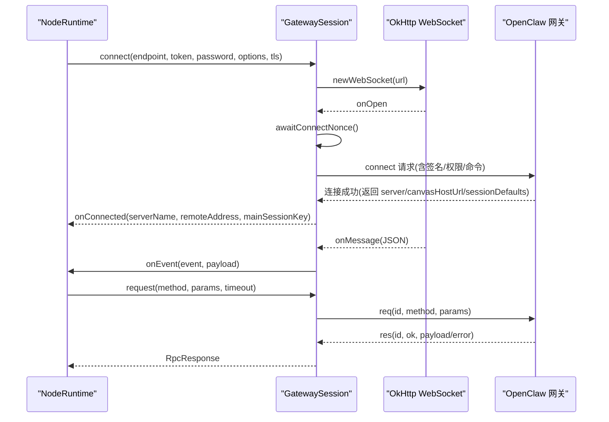
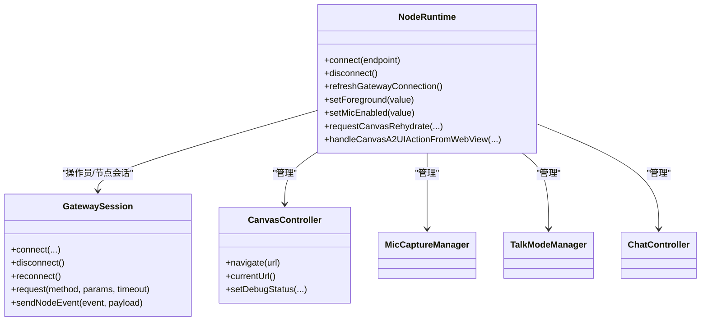
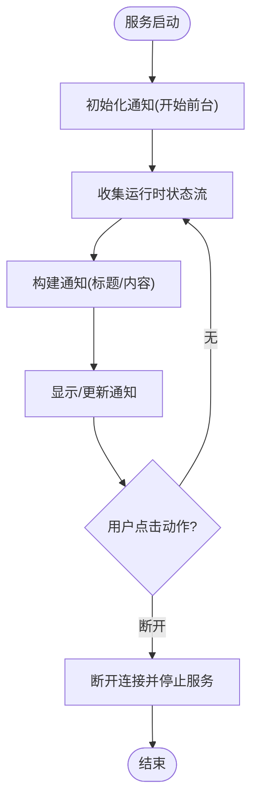
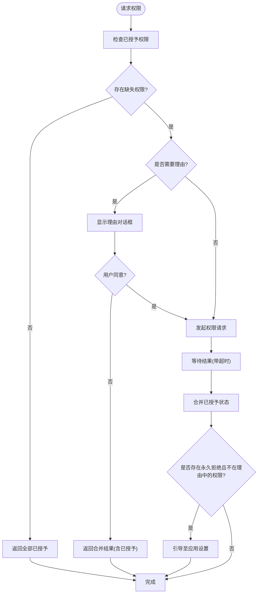
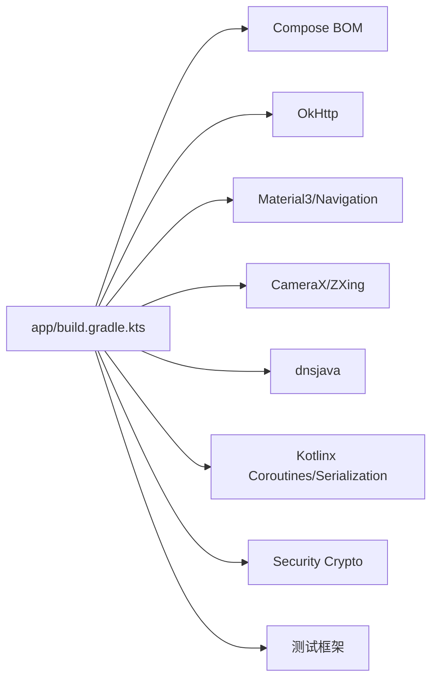

# Android节点应用

<cite>
**本文档引用的文件**
- [apps/android/README.md](file://apps/android/README.md)
- [apps/android/build.gradle.kts](file://apps/android/build.gradle.kts)
- [apps/android/settings.gradle.kts](file://apps/android/settings.gradle.kts)
- [apps/android/gradle.properties](file://apps/android/gradle.properties)
- [apps/android/app/build.gradle.kts](file://apps/android/app/build.gradle.kts)
- [apps/android/app/src/main/AndroidManifest.xml](file://apps/android/app/src/main/AndroidManifest.xml)
- [apps/android/app/src/main/java/ai/openclaw/app/MainActivity.kt](file://apps/android/app/src/main/java/ai/openclaw/app/MainActivity.kt)
- [apps/android/app/src/main/java/ai/openclaw/app/MainViewModel.kt](file://apps/android/app/src/main/java/ai/openclaw/app/MainViewModel.kt)
- [apps/android/app/src/main/java/ai/openclaw/app/NodeApp.kt](file://apps/android/app/src/main/java/ai/openclaw/app/NodeApp.kt)
- [apps/android/app/src/main/java/ai/openclaw/app/NodeRuntime.kt](file://apps/android/app/src/main/java/ai/openclaw/app/NodeRuntime.kt)
- [apps/android/app/src/main/java/ai/openclaw/app/NodeForegroundService.kt](file://apps/android/app/src/main/java/ai/openclaw/app/NodeForegroundService.kt)
- [apps/android/app/src/main/java/ai/openclaw/app/PermissionRequester.kt](file://apps/android/app/src/main/java/ai/openclaw/app/PermissionRequester.kt)
- [apps/android/app/src/main/java/ai/openclaw/app/gateway/GatewaySession.kt](file://apps/android/app/src/main/java/ai/openclaw/app/gateway/GatewaySession.kt)
- [apps/android/app/src/main/java/ai/openclaw/app/gateway/GatewayDiscovery.kt](file://apps/android/app/src/main/java/ai/openclaw/app/gateway/GatewayDiscovery.kt)
- [apps/android/app/src/main/java/ai/openclaw/app/gateway/GatewayEndpoint.kt](file://apps/android/app/src/main/java/ai/openclaw/app/gateway/GatewayEndpoint.kt)
- [apps/android/app/src/main/java/ai/openclaw/app/gateway/GatewayProtocol.kt](file://apps/android/app/src/main/java/ai/openclaw/app/gateway/GatewayProtocol.kt)
- [apps/android/app/src/main/java/ai/openclaw/app/gateway/GatewayTls.kt](file://apps/android/app/src/main/java/ai/openclaw/app/gateway/GatewayTls.kt)
- [apps/android/app/src/main/java/ai/openclaw/app/gateway/DeviceAuthStore.kt](file://apps/android/app/src/main/java/ai/openclaw/app/gateway/DeviceAuthStore.kt)
- [apps/android/app/src/main/java/ai/openclaw/app/gateway/DeviceIdentityStore.kt](file://apps/android/app/src/main/java/ai/openclaw/app/gateway/DeviceIdentityStore.kt)
- [apps/android/app/src/main/java/ai/openclaw/app/node/CanvasController.kt](file://apps/android/app/src/main/java/ai/openclaw/app/node/CanvasController.kt)
- [apps/android/app/src/main/java/ai/openclaw/app/node/A2UIHandler.kt](file://apps/android/app/src/main/java/ai/openclaw/app/node/A2UIHandler.kt)
- [apps/android/app/src/main/java/ai/openclaw/app/node/ConnectionManager.kt](file://apps/android/app/src/main/java/ai/openclaw/app/node/ConnectionManager.kt)
- [apps/android/app/src/main/java/ai/openclaw/app/node/InvokeDispatcher.kt](file://apps/android/app/src/main/java/ai/openclaw/app/node/InvokeDispatcher.kt)
- [apps/android/app/src/main/java/ai/openclaw/app/node/DeviceNotificationListenerService.kt](file://apps/android/app/src/main/java/ai/openclaw/app/node/DeviceNotificationListenerService.kt)
- [apps/android/app/src/main/java/ai/openclaw/app/ui/RootScreen.kt](file://apps/android/app/src/main/java/ai/openclaw/app/ui/RootScreen.kt)
</cite>

## 目录

1. [简介](#简介)
2. [项目结构](#项目结构)
3. [核心组件](#核心组件)
4. [架构总览](#架构总览)
5. [详细组件分析](#详细组件分析)
6. [依赖关系分析](#依赖关系分析)
7. [性能考虑](#性能考虑)
8. [故障排除指南](#故障排除指南)
9. [结论](#结论)
10. [附录](#附录)

## 简介

本文件为 OpenClaw Android 节点应用的技术文档，面向希望理解、开发或维护该应用的工程师与测试人员。文档覆盖应用架构、权限管理、后台服务、与 OpenClaw 网关的通信机制（WebSocket）、构建配置、Gradle 设置、Android 特有挑战与解决方案、开发环境搭建、构建流程、调试技巧、后台限制与电池优化、通知权限、网络连接管理、以及针对 Android 平台的故障排除指南。

## 项目结构

Android 应用位于 apps/android 目录，采用多模块结构：

- 根模块：apps/android（聚合插件、仓库、settings）
- 子模块：app（应用主体）、benchmark（性能基准）
- 应用源码位于 app/src/main/java/ai/openclaw/app 及资源目录
- 关键目录与文件：
  - app/src/main/AndroidManifest.xml：声明权限、服务、Activity
  - app/src/main/java/ai/openclaw/app：应用入口、运行时、会话、UI、节点能力
  - app/build.gradle.kts：应用级构建脚本
  - apps/android/build.gradle.kts、settings.gradle.kts、gradle.properties：根级构建配置

**图表来源**

- [apps/android/settings.gradle.kts:1-20](file://apps/android/settings.gradle.kts#L1-L20)
- [apps/android/app/build.gradle.kts:1-214](file://apps/android/app/build.gradle.kts#L1-L214)

**章节来源**

- [apps/android/README.md:22-86](file://apps/android/README.md#L22-L86)
- [apps/android/settings.gradle.kts:1-20](file://apps/android/settings.gradle.kts#L1-L20)
- [apps/android/app/build.gradle.kts:1-214](file://apps/android/app/build.gradle.kts#L1-L214)

## 核心组件

- 应用入口与生命周期
  - MainActivity：负责启动 Compose UI、权限请求器绑定、前台服务启动时机控制
  - NodeApp：应用类，承载全局运行时
  - MainViewModel：持有 UI 状态与权限请求器
- 运行时与会话
  - NodeRuntime：核心运行时，管理网关发现、连接、事件分发、Canvas 控制、语音与相机等节点能力
  - GatewaySession：封装 WebSocket 连接、RPC 请求/响应、事件处理、自动重连、TLS 配置
- 后台服务
  - NodeForegroundService：前台服务，显示连接状态通知，支持停止动作
- 权限管理
  - PermissionRequester：统一处理多权限请求、拒绝后的设置引导
- UI
  - RootScreen：根据 onboarding 完成状态切换到引导或主标签页

**章节来源**

- [apps/android/app/src/main/java/ai/openclaw/app/MainActivity.kt:18-64](file://apps/android/app/src/main/java/ai/openclaw/app/MainActivity.kt#L18-L64)
- [apps/android/app/src/main/java/ai/openclaw/app/NodeApp.kt](file://apps/android/app/src/main/java/ai/openclaw/app/NodeApp.kt)
- [apps/android/app/src/main/java/ai/openclaw/app/MainViewModel.kt](file://apps/android/app/src/main/java/ai/openclaw/app/MainViewModel.kt)
- [apps/android/app/src/main/java/ai/openclaw/app/NodeRuntime.kt:44-604](file://apps/android/app/src/main/java/ai/openclaw/app/NodeRuntime.kt#L44-L604)
- [apps/android/app/src/main/java/ai/openclaw/app/gateway/GatewaySession.kt:55-761](file://apps/android/app/src/main/java/ai/openclaw/app/gateway/GatewaySession.kt#L55-L761)
- [apps/android/app/src/main/java/ai/openclaw/app/NodeForegroundService.kt:20-159](file://apps/android/app/src/main/java/ai/openclaw/app/NodeForegroundService.kt#L20-L159)
- [apps/android/app/src/main/java/ai/openclaw/app/PermissionRequester.kt:22-134](file://apps/android/app/src/main/java/ai/openclaw/app/PermissionRequester.kt#L22-L134)
- [apps/android/app/src/main/java/ai/openclaw/app/ui/RootScreen.kt:10-21](file://apps/android/app/src/main/java/ai/openclaw/app/ui/RootScreen.kt#L10-L21)

## 架构总览

应用采用“前台服务 + 协程 + Jetpack Compose”的现代 Android 架构：

- 前台服务保障长连接在后台稳定运行
- 协程用于网络、权限、状态流管理
- Compose UI 响应式渲染
- NodeRuntime 统一编排网关连接、事件、能力调用
- GatewaySession 封装 WebSocket 与 RPC 协议

**图表来源**

- [apps/android/app/src/main/java/ai/openclaw/app/MainActivity.kt:18-64](file://apps/android/app/src/main/java/ai/openclaw/app/MainActivity.kt#L18-L64)
- [apps/android/app/src/main/java/ai/openclaw/app/MainViewModel.kt](file://apps/android/app/src/main/java/ai/openclaw/app/MainViewModel.kt)
- [apps/android/app/src/main/java/ai/openclaw/app/NodeRuntime.kt:220-292](file://apps/android/app/src/main/java/ai/openclaw/app/NodeRuntime.kt#L220-L292)
- [apps/android/app/src/main/java/ai/openclaw/app/NodeForegroundService.kt:20-159](file://apps/android/app/src/main/java/ai/openclaw/app/NodeForegroundService.kt#L20-L159)
- [apps/android/app/src/main/java/ai/openclaw/app/gateway/GatewaySession.kt:55-761](file://apps/android/app/src/main/java/ai/openclaw/app/gateway/GatewaySession.kt#L55-L761)

## 详细组件分析

### 网络与通信：GatewaySession（WebSocket/RPC）

GatewaySession 实现了与 OpenClaw 网关的 WebSocket 通信与 RPC 调用：

- 连接建立：基于 OkHttp WebSocket，支持 TLS（可选），自动 ping 保活
- 认证与握手：发送 connect 请求，携带设备签名、角色、权限、命令集等
- 请求/响应：请求方法名与参数 JSON，响应包含 ok/payload/error
- 事件处理：处理 node.invoke.request 事件并回调上层执行
- 自动重连：指数回退策略，支持断线恢复
- Canvas 能力刷新：动态替换 Scoped Canvas URL 的 capability 字段

**图表来源**

- [apps/android/app/src/main/java/ai/openclaw/app/gateway/GatewaySession.kt:241-359](file://apps/android/app/src/main/java/ai/openclaw/app/gateway/GatewaySession.kt#L241-L359)
- [apps/android/app/src/main/java/ai/openclaw/app/gateway/GatewaySession.kt:470-507](file://apps/android/app/src/main/java/ai/openclaw/app/gateway/GatewaySession.kt#L470-L507)
- [apps/android/app/src/main/java/ai/openclaw/app/gateway/GatewaySession.kt:253-271](file://apps/android/app/src/main/java/ai/openclaw/app/gateway/GatewaySession.kt#L253-L271)

**章节来源**

- [apps/android/app/src/main/java/ai/openclaw/app/gateway/GatewaySession.kt:55-761](file://apps/android/app/src/main/java/ai/openclaw/app/gateway/GatewaySession.kt#L55-L761)

### 运行时编排：NodeRuntime

NodeRuntime 是应用的核心编排者：

- 管理两个 GatewaySession：操作员会话（operator）与节点会话（node）
- 管理 CanvasController、相机、位置、短信、通知监听、系统、联系人、日历、运动、A2UI 等能力
- 状态流：连接状态、服务器名称、远端地址、主会话键、前台状态、Canvas 水合状态等
- 自动连接：基于上次发现的网关稳定 ID 或手动配置，结合存储的 TLS 指纹进行安全自动重连
- 语音与聊天：MicCaptureManager、TalkModeManager、ChatController 协同工作
- 通知监听：将系统通知事件转发给节点会话

**图表来源**

- [apps/android/app/src/main/java/ai/openclaw/app/NodeRuntime.kt:44-604](file://apps/android/app/src/main/java/ai/openclaw/app/NodeRuntime.kt#L44-L604)
- [apps/android/app/src/main/java/ai/openclaw/app/gateway/GatewaySession.kt:55-761](file://apps/android/app/src/main/java/ai/openclaw/app/gateway/GatewaySession.kt#L55-L761)
- [apps/android/app/src/main/java/ai/openclaw/app/node/CanvasController.kt](file://apps/android/app/src/main/java/ai/openclaw/app/node/CanvasController.kt)

**章节来源**

- [apps/android/app/src/main/java/ai/openclaw/app/NodeRuntime.kt:44-923](file://apps/android/app/src/main/java/ai/openclaw/app/NodeRuntime.kt#L44-L923)

### 后台服务：NodeForegroundService

NodeForegroundService 提供前台服务以维持连接稳定性，并向用户展示连接状态：

- 创建通知通道，显示连接状态、服务器名、麦克风状态
- 支持停止动作，触发断开并停止服务
- 使用 FOREGROUND_SERVICE_TYPE_DATA_SYNC 类型

**图表来源**

- [apps/android/app/src/main/java/ai/openclaw/app/NodeForegroundService.kt:25-75](file://apps/android/app/src/main/java/ai/openclaw/app/NodeForegroundService.kt#L25-L75)
- [apps/android/app/src/main/java/ai/openclaw/app/NodeForegroundService.kt:93-139](file://apps/android/app/src/main/java/ai/openclaw/app/NodeForegroundService.kt#L93-L139)

**章节来源**

- [apps/android/app/src/main/java/ai/openclaw/app/NodeForegroundService.kt:20-159](file://apps/android/app/src/main/java/ai/openclaw/app/NodeForegroundService.kt#L20-L159)

### 权限管理：PermissionRequester

PermissionRequester 统一处理多权限请求：

- 过滤缺失权限，必要时展示理由对话框
- 异步等待结果，合并已授予状态
- 对于永久拒绝且不在理由中的权限，引导用户前往设置

**图表来源**

- [apps/android/app/src/main/java/ai/openclaw/app/PermissionRequester.kt:33-85](file://apps/android/app/src/main/java/ai/openclaw/app/PermissionRequester.kt#L33-L85)

**章节来源**

- [apps/android/app/src/main/java/ai/openclaw/app/PermissionRequester.kt:22-134](file://apps/android/app/src/main/java/ai/openclaw/app/PermissionRequester.kt#L22-L134)

### UI 与生命周期：MainActivity 与 RootScreen

- MainActivity 在首次绘制后启动前台服务，绑定权限请求器，保持屏幕常亮开关
- RootScreen 根据 onboardingCompleted 切换到引导流程或主标签页

**章节来源**

- [apps/android/app/src/main/java/ai/openclaw/app/MainActivity.kt:18-64](file://apps/android/app/src/main/java/ai/openclaw/app/MainActivity.kt#L18-L64)
- [apps/android/app/src/main/java/ai/openclaw/app/ui/RootScreen.kt:10-21](file://apps/android/app/src/main/java/ai/openclaw/app/ui/RootScreen.kt#L10-L21)

## 依赖关系分析

- 构建工具链
  - Android Gradle Plugin 9.0.1、Kotlin 2.2.21、Compose BOM 2026.02.00
  - Java 17、minSdk 31、targetSdk 36
- 第三方库
  - OkHttp 5.3.2（WebSocket/RPC）
  - Material3、Navigation Compose、Activity Compose
  - CameraX、ZXing（二维码）
  - dnsjava（DNS-SD 发现）
  - Kotlinx Serialization、Coroutines、Security Crypto
- 测试
  - Robolectric、Kotest、MockWebServer

**图表来源**

- [apps/android/app/build.gradle.kts:155-209](file://apps/android/app/build.gradle.kts#L155-L209)

**章节来源**

- [apps/android/app/build.gradle.kts:33-214](file://apps/android/app/build.gradle.kts#L33-L214)

## 性能考虑

- 启动性能
  - Live Edit 与 Apply Changes 支持快速迭代
  - 宏基准与 perf CLI 工具用于冷启动与热点分析
- 运行时
  - 协程隔离 IO 与主线程，避免阻塞 UI
  - 前台服务类型明确，减少被系统回收风险
- 网络
  - WebSocket 长连接 + ping 保活；请求超时与指数回退
  - TLS 可选，指纹校验提升安全性

**章节来源**

- [apps/android/README.md:134-142](file://apps/android/README.md#L134-L142)
- [apps/android/README.md:59-92](file://apps/android/README.md#L59-L92)
- [apps/android/app/src/main/java/ai/openclaw/app/gateway/GatewaySession.kt:290-303](file://apps/android/app/src/main/java/ai/openclaw/app/gateway/GatewaySession.kt#L290-L303)
- [apps/android/app/src/main/java/ai/openclaw/app/NodeForegroundService.kt:131-139](file://apps/android/app/src/main/java/ai/openclaw/app/NodeForegroundService.kt#L131-L139)

## 故障排除指南

- 连接失败
  - 检查网关可达性与端口开放
  - 若首次 TLS，确认指纹验证流程完成
  - 手动模式下确保主机/端口/协议正确
- Canvas 不可用
  - 确保节点已连接且 Canvas 能力已刷新
  - 在 Screen 标签保持前台并主动触发重载
- 权限相关
  - 摄像头/录音/短信等权限需在设置中启用
  - 永久拒绝时使用权限请求器引导至设置
- 后台限制与电池优化
  - 允许“在后台运行”和“自启动”
  - 关闭“智能省电”对应用的限制
- 通知权限
  - 如需通知监听，请在系统设置中开启通知访问
- 网络安全
  - 使用 Network Security Config 放行明文或特定域
- 设备发现
  - Android 13+ 需要 NEARBY_WIFI_DEVICES 权限
  - Android 12 及以下需要 ACCESS_FINE_LOCATION 扫描 NSD

**章节来源**

- [apps/android/README.md:165-224](file://apps/android/README.md#L165-L224)
- [apps/android/app/src/main/AndroidManifest.xml:1-77](file://apps/android/app/src/main/AndroidManifest.xml#L1-L77)
- [apps/android/app/src/main/java/ai/openclaw/app/PermissionRequester.kt:100-114](file://apps/android/app/src/main/java/ai/openclaw/app/PermissionRequester.kt#L100-L114)

## 结论

本应用通过清晰的模块划分与现代化技术栈，实现了稳定的后台连接、丰富的节点能力与良好的用户体验。GatewaySession 抽象了 WebSocket/RPC 通信，NodeRuntime 统一编排各子系统，前台服务与权限管理确保在复杂 Android 环境下的可靠性。建议在开发与发布流程中严格遵循权限与后台限制最佳实践，并持续利用内置的性能与集成测试工具保障质量。

## 附录

### 开发环境搭建与构建流程

- 安装 Android Studio 与 Android SDK（默认路径 ~/Library/Android/sdk）
- 使用 Gradle Wrapper 执行任务
- 本地签名密钥可通过 ~/.gradle/gradle.properties 注入
- 常用命令
  - assembleDebug/installDebug/testDebugUnitTest
  - ktlint 检查与格式化
  - 宏基准与 perf CLI

**章节来源**

- [apps/android/README.md:26-56](file://apps/android/README.md#L26-L56)
- [apps/android/README.md:112-142](file://apps/android/README.md#L112-L142)
- [apps/android/app/build.gradle.kts:3-31](file://apps/android/app/build.gradle.kts#L3-L31)

### Android 特定挑战与解决方案

- 后台限制
  - 使用前台服务 + 明确的 FOREGROUND_SERVICE_TYPE
  - 避免在后台频繁唤醒
- 电池优化
  - 引导用户将应用加入白名单
- 通知权限
  - 通过系统设置启用通知监听
- 网络连接
  - WebSocket 长连接 + ping + 超时与重试
  - TLS 指纹校验增强信任链

**章节来源**

- [apps/android/app/src/main/java/ai/openclaw/app/NodeForegroundService.kt:131-139](file://apps/android/app/src/main/java/ai/openclaw/app/NodeForegroundService.kt#L131-L139)
- [apps/android/app/src/main/AndroidManifest.xml:1-77](file://apps/android/app/src/main/AndroidManifest.xml#L1-L77)
- [apps/android/app/src/main/java/ai/openclaw/app/gateway/GatewaySession.kt:290-303](file://apps/android/app/src/main/java/ai/openclaw/app/gateway/GatewaySession.kt#L290-L303)
