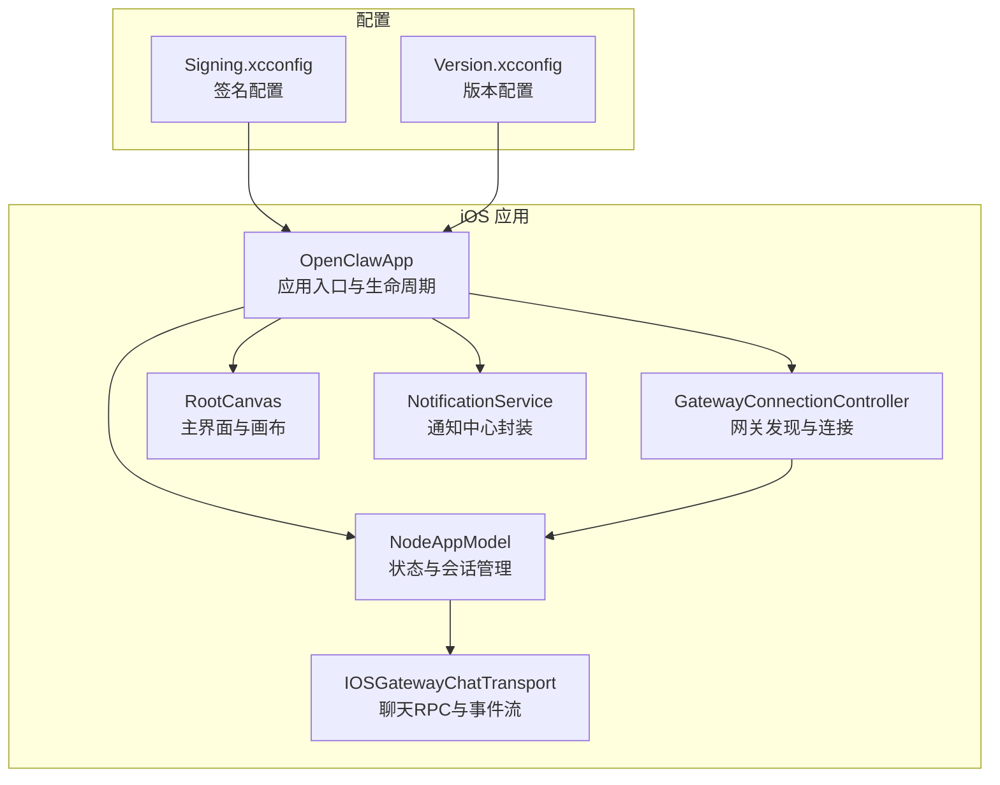
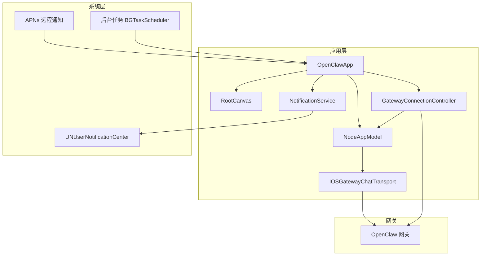
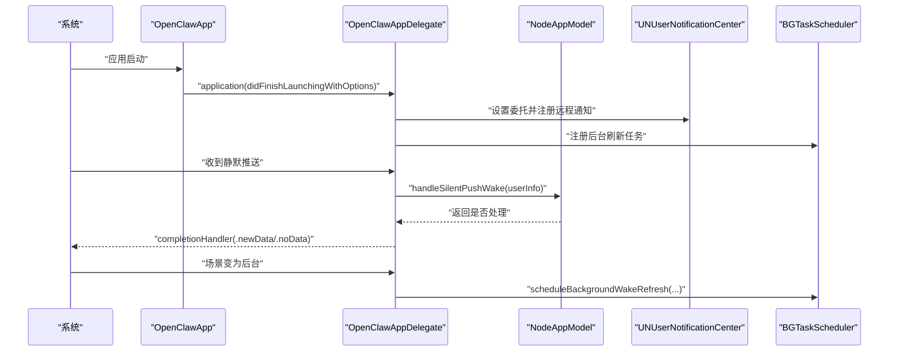
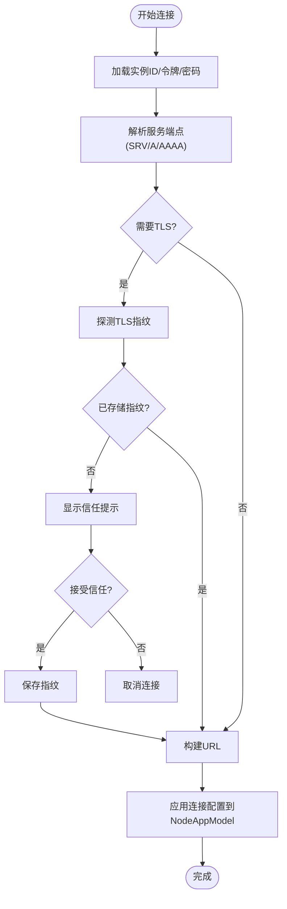
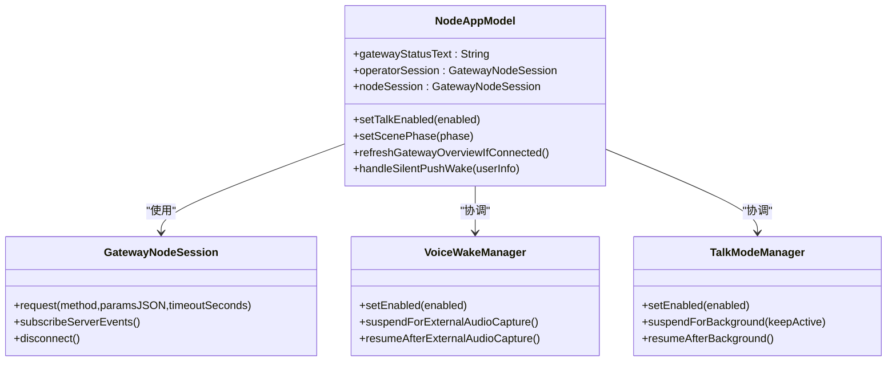
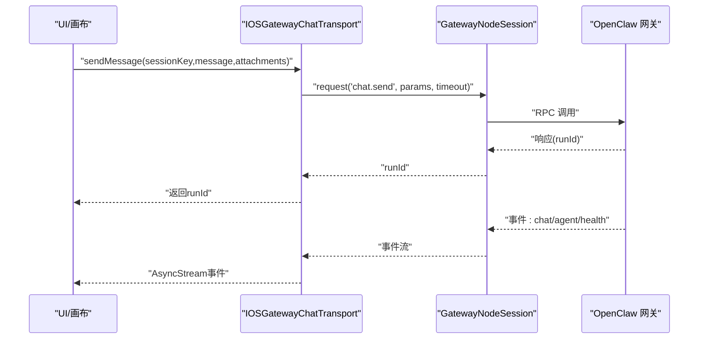
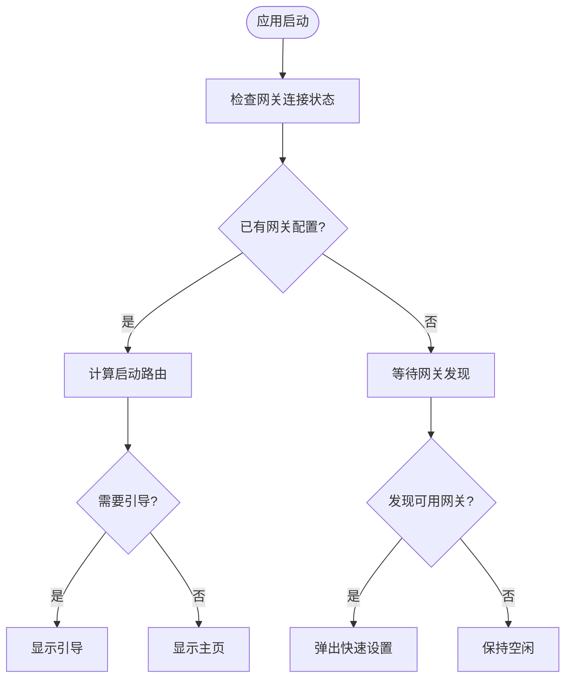
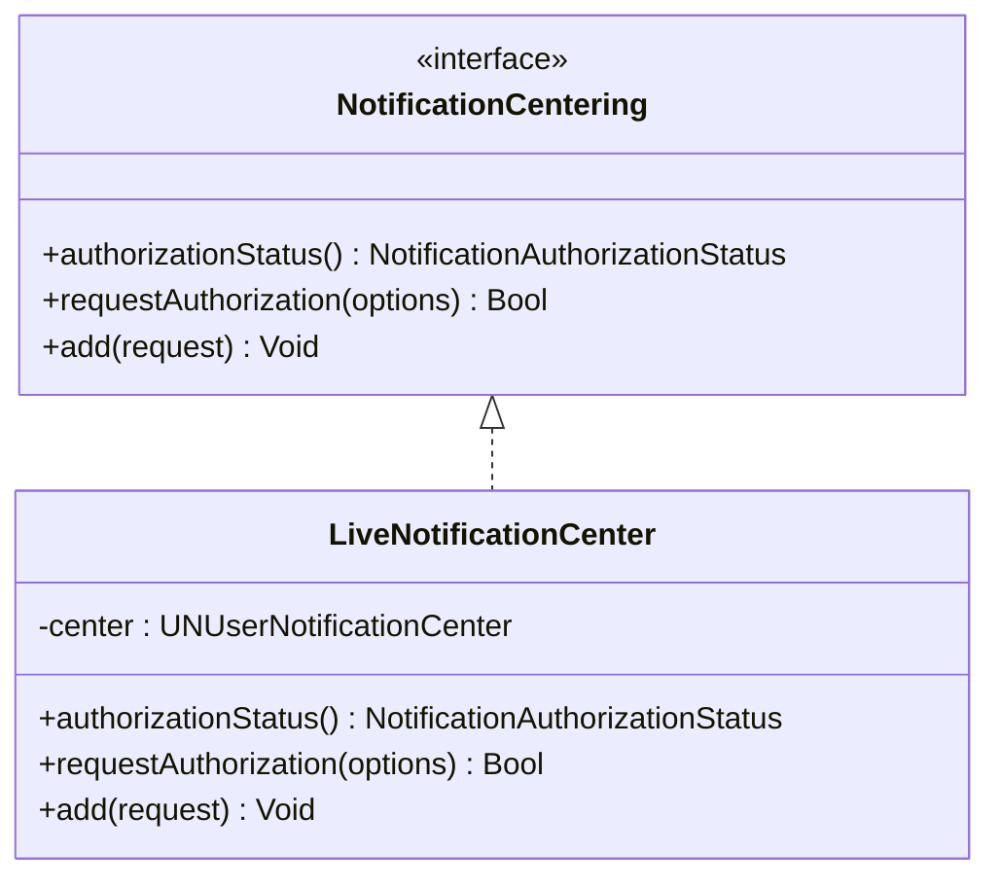
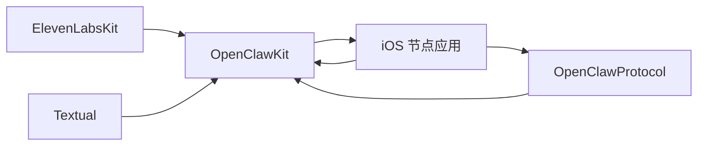

# iOS节点应用

<cite>
**本文档引用的文件**
- [OpenClawApp.swift](file://apps/ios/Sources/OpenClawApp.swift)
- [GatewayConnectionController.swift](file://apps/ios/Sources/Gateway/GatewayConnectionController.swift)
- [NodeAppModel.swift](file://apps/ios/Sources/Model/NodeAppModel.swift)
- [IOSGatewayChatTransport.swift](file://apps/ios/Sources/Chat/IOSGatewayChatTransport.swift)
- [RootCanvas.swift](file://apps/ios/Sources/RootCanvas.swift)
- [NotificationService.swift](file://apps/ios/Sources/Services/NotificationService.swift)
- [Signing.xcconfig](file://apps/ios/Config/Signing.xcconfig)
- [Version.xcconfig](file://apps/ios/Config/Version.xcconfig)
- [OpenClawKit Package.swift](file://apps/shared/OpenClawKit/Package.swift)
</cite>

## 目录

1. [简介](#简介)
2. [项目结构](#项目结构)
3. [核心组件](#核心组件)
4. [架构总览](#架构总览)
5. [详细组件分析](#详细组件分析)
6. [依赖关系分析](#依赖关系分析)
7. [性能考虑](#性能考虑)
8. [故障排除指南](#故障排除指南)
9. [结论](#结论)
10. [附录](#附录)

## 简介

本文件为 OpenClaw iOS 节点应用的技术文档，面向 iOS 平台开发者与运维人员，系统性阐述应用的架构设计、权限配置、后台处理能力、与 OpenClaw 网关的实时通信机制，以及配置管理、签名设置、平台限制与解决方案。文档同时提供开发环境搭建、构建流程、调试技巧，并覆盖后台任务限制、推送通知、设备配对等核心功能。为便于理解，文档通过多种可视化图表展示代码级关系、数据流与交互序列。

## 项目结构

iOS 节点应用位于 apps/ios 目录，采用按功能域划分的模块化组织方式：

- Sources：应用主体源码，包含入口、模型、网关连接、聊天传输、服务层、界面等
- Config：构建配置（签名、版本）
- Tests：单元测试与逻辑测试
- ActivityWidget、ShareExtension、WatchApp、WatchExtension：扩展与手表相关组件
- fastlane：自动化发布与元数据管理

**图表来源**

- [OpenClawApp.swift:492-526](file://apps/ios/Sources/OpenClawApp.swift#L492-L526)
- [GatewayConnectionController.swift:20-80](file://apps/ios/Sources/Gateway/GatewayConnectionController.swift#L20-L80)
- [NodeAppModel.swift:47-150](file://apps/ios/Sources/Model/NodeAppModel.swift#L47-L150)
- [IOSGatewayChatTransport.swift:7-20](file://apps/ios/Sources/Chat/IOSGatewayChatTransport.swift#L7-L20)
- [RootCanvas.swift:5-28](file://apps/ios/Sources/RootCanvas.swift#L5-L28)
- [NotificationService.swift:12-16](file://apps/ios/Sources/Services/NotificationService.swift#L12-L16)
- [Signing.xcconfig:1-22](file://apps/ios/Config/Signing.xcconfig#L1-L22)
- [Version.xcconfig:1-9](file://apps/ios/Config/Version.xcconfig#L1-L9)

**章节来源**

- [OpenClawApp.swift:492-526](file://apps/ios/Sources/OpenClawApp.swift#L492-L526)
- [GatewayConnectionController.swift:20-80](file://apps/ios/Sources/Gateway/GatewayConnectionController.swift#L20-L80)
- [NodeAppModel.swift:47-150](file://apps/ios/Sources/Model/NodeAppModel.swift#L47-L150)
- [IOSGatewayChatTransport.swift:7-20](file://apps/ios/Sources/Chat/IOSGatewayChatTransport.swift#L7-L20)
- [RootCanvas.swift:5-28](file://apps/ios/Sources/RootCanvas.swift#L5-L28)
- [NotificationService.swift:12-16](file://apps/ios/Sources/Services/NotificationService.swift#L12-L16)
- [Signing.xcconfig:1-22](file://apps/ios/Config/Signing.xcconfig#L1-L22)
- [Version.xcconfig:1-9](file://apps/ios/Config/Version.xcconfig#L1-L9)

## 核心组件

- 应用入口与生命周期：负责 AppDelegate 注册、远程通知、后台唤醒任务调度、场景状态变更处理
- 网关连接控制器：负责网关发现、服务解析、TLS 指纹验证、自动重连策略与信任提示
- 应用模型：统一的状态管理、会话生命周期、后台连接保活、语音唤醒与通话模式协调
- 聊天传输层：封装聊天 RPC、事件订阅、健康检查与超时控制
- 主界面画布：承载网关状态、代理列表、快捷操作与引导流程
- 通知服务：封装 UNUserNotificationCenter 的授权与请求接口

**章节来源**

- [OpenClawApp.swift:16-263](file://apps/ios/Sources/OpenClawApp.swift#L16-L263)
- [GatewayConnectionController.swift:20-470](file://apps/ios/Sources/Gateway/GatewayConnectionController.swift#L20-L470)
- [NodeAppModel.swift:47-220](file://apps/ios/Sources/Model/NodeAppModel.swift#L47-L220)
- [IOSGatewayChatTransport.swift:7-143](file://apps/ios/Sources/Chat/IOSGatewayChatTransport.swift#L7-L143)
- [RootCanvas.swift:5-218](file://apps/ios/Sources/RootCanvas.swift#L5-L218)
- [NotificationService.swift:12-58](file://apps/ios/Sources/Services/NotificationService.swift#L12-L58)

## 架构总览

应用采用“观察者驱动”的 MVVM 架构，结合 OpenClawKit 提供的协议与会话抽象，实现与网关的双向通信与状态同步。应用通过 GatewayConnectionController 管理网关连接，NodeAppModel 统一维护会话与状态，RootCanvas 渲染用户界面并触发业务动作，NotificationService 封装系统通知能力。

**图表来源**

- [OpenClawApp.swift:492-526](file://apps/ios/Sources/OpenClawApp.swift#L492-L526)
- [NodeAppModel.swift:99-145](file://apps/ios/Sources/Model/NodeAppModel.swift#L99-L145)
- [GatewayConnectionController.swift:20-80](file://apps/ios/Sources/Gateway/GatewayConnectionController.swift#L20-L80)
- [IOSGatewayChatTransport.swift:7-20](file://apps/ios/Sources/Chat/IOSGatewayChatTransport.swift#L7-L20)
- [NotificationService.swift:12-16](file://apps/ios/Sources/Services/NotificationService.swift#L12-L16)

## 详细组件分析

### 应用入口与生命周期（OpenClawApp）

- AppDelegate 负责注册远程通知、设置 UNUserNotificationCenter 委托、处理静默推送与前台展示
- 后台唤醒任务：注册 BGAppRefreshTask，周期性触发后台刷新以维持网关会话或执行轻量任务
- 场景状态变更：根据 ScenePhase 控制后台任务调度与 UI 更新
- 未捕获异常记录器：安装全局异常处理器，便于定位 SwiftUI/WebKit 异常

**图表来源**

- [OpenClawApp.swift:50-96](file://apps/ios/Sources/OpenClawApp.swift#L50-L96)
- [OpenClawApp.swift:104-156](file://apps/ios/Sources/OpenClawApp.swift#L104-L156)
- [OpenClawApp.swift:158-262](file://apps/ios/Sources/OpenClawApp.swift#L158-L262)

**章节来源**

- [OpenClawApp.swift:16-263](file://apps/ios/Sources/OpenClawApp.swift#L16-L263)

### 网关连接控制器（GatewayConnectionController）

- 发现与解析：基于 Bonjour/Service Endpoint 解析目标主机与端口，支持手动与上次已知连接
- TLS 与信任：探测 TLS 指纹，要求存储指纹后方可建立安全连接；支持手动信任提示
- 自动重连：根据场景状态与用户偏好自动尝试连接，避免重复连接循环
- 权限与能力：动态生成能力列表与命令集，反映当前设备权限状态

**图表来源**

- [GatewayConnectionController.swift:91-156](file://apps/ios/Sources/Gateway/GatewayConnectionController.swift#L91-L156)
- [GatewayConnectionController.swift:242-278](file://apps/ios/Sources/Gateway/GatewayConnectionController.swift#L242-L278)
- [GatewayConnectionController.swift:446-470](file://apps/ios/Sources/Gateway/GatewayConnectionController.swift#L446-L470)

**章节来源**

- [GatewayConnectionController.swift:20-470](file://apps/ios/Sources/Gateway/GatewayConnectionController.swift#L20-L470)

### 应用模型（NodeAppModel）

- 双会话设计：nodeGateway 用于设备能力与 node.invoke 请求；operatorGateway 用于聊天/通话/配置等
- 后台保活：通过后台连接宽限期与重连抑制策略，避免后台网络被系统挂起导致的“假死”状态
- 语音与通话：VoiceWakeManager 与 TalkModeManager 协调麦克风使用，防止冲突
- 状态同步：从网关拉取品牌与代理信息，更新画布状态与 UI

**图表来源**

- [NodeAppModel.swift:99-145](file://apps/ios/Sources/Model/NodeAppModel.swift#L99-L145)
- [NodeAppModel.swift:301-383](file://apps/ios/Sources/Model/NodeAppModel.swift#L301-L383)
- [NodeAppModel.swift:476-508](file://apps/ios/Sources/Model/NodeAppModel.swift#L476-L508)

**章节来源**

- [NodeAppModel.swift:47-220](file://apps/ios/Sources/Model/NodeAppModel.swift#L47-L220)
- [NodeAppModel.swift:301-383](file://apps/ios/Sources/Model/NodeAppModel.swift#L301-L383)
- [NodeAppModel.swift:476-508](file://apps/ios/Sources/Model/NodeAppModel.swift#L476-L508)

### 聊天传输层（IOSGatewayChatTransport）

- RPC 方法：chat.send、chat.history、sessions.list、chat.abort、health
- 事件流：订阅服务器事件（tick、seqGap、health、chat、agent），转换为 AsyncStream
- 超时与日志：统一超时参数与错误日志，便于诊断

**图表来源**

- [IOSGatewayChatTransport.swift:50-90](file://apps/ios/Sources/Chat/IOSGatewayChatTransport.swift#L50-L90)
- [IOSGatewayChatTransport.swift:98-141](file://apps/ios/Sources/Chat/IOSGatewayChatTransport.swift#L98-L141)

**章节来源**

- [IOSGatewayChatTransport.swift:7-143](file://apps/ios/Sources/Chat/IOSGatewayChatTransport.swift#L7-L143)

### 主界面画布（RootCanvas）

- 启动路由：根据连接状态、引导完成度与配置情况决定打开引导、设置或直接进入主页
- 状态展示：根据网关状态渲染不同文案与卡片，展示代理列表与连接信息
- 快速设置：当检测到可用网关但无配置时弹出快速设置面板

**图表来源**

- [RootCanvas.swift:49-85](file://apps/ios/Sources/RootCanvas.swift#L49-L85)
- [RootCanvas.swift:364-389](file://apps/ios/Sources/RootCanvas.swift#L364-L389)
- [RootCanvas.swift:416-426](file://apps/ios/Sources/RootCanvas.swift#L416-L426)

**章节来源**

- [RootCanvas.swift:5-218](file://apps/ios/Sources/RootCanvas.swift#L5-L218)

### 通知服务（NotificationService）

- 授权状态：封装 authorizationStatus，映射系统状态
- 授权请求：封装 requestAuthorization
- 通知添加：封装 add，支持异步抛错

**图表来源**

- [NotificationService.swift:12-58](file://apps/ios/Sources/Services/NotificationService.swift#L12-L58)

**章节来源**

- [NotificationService.swift:12-58](file://apps/ios/Sources/Services/NotificationService.swift#L12-L58)

## 依赖关系分析

- 平台与工具链：iOS 18+，Swift 6.2，StrictConcurrency
- 外部依赖：ElevenLabsKit、Textual（仅 macOS/iOS 文本组件）
- 内部依赖：OpenClawKit（协议、会话）、OpenClawChatUI（聊天 UI）

**图表来源**

- [OpenClawKit Package.swift:16-61](file://apps/shared/OpenClawKit/Package.swift#L16-L61)

**章节来源**

- [OpenClawKit Package.swift:16-61](file://apps/shared/OpenClawKit/Package.swift#L16-L61)

## 性能考虑

- 后台保活策略：通过后台宽限期与重连抑制减少无效重连，避免系统挂起导致的“假死”
- 事件流背压：AsyncStream 订阅在取消时及时释放资源，降低内存占用
- 会话复用：双会话设计区分只读/写入场景，减少不必要的握手与同步
- UI 渲染：画布状态按需更新，避免频繁重绘

[本节为通用指导，无需具体文件分析]

## 故障排除指南

- 远程通知注册失败：检查 AppDelegate 中注册流程与日志输出
- 静默推送未触发：确认 BGTaskScheduler 是否成功提交，检查后台刷新任务回调
- TLS 指纹不匹配：确保首次连接时接受信任提示并保存指纹；若网关证书变更需重新探测
- 后台连接异常：检查后台宽限期与重连抑制逻辑，必要时强制断开并重新应用连接配置
- 通知授权问题：通过 NotificationService 的授权状态查询与请求授权，确保用户允许通知

**章节来源**

- [OpenClawApp.swift:72-74](file://apps/ios/Sources/OpenClawApp.swift#L72-L74)
- [OpenClawApp.swift:117-136](file://apps/ios/Sources/OpenClawApp.swift#L117-L136)
- [GatewayConnectionController.swift:120-136](file://apps/ios/Sources/Gateway/GatewayConnectionController.swift#L120-L136)
- [NodeAppModel.swift:385-474](file://apps/ios/Sources/Model/NodeAppModel.swift#L385-L474)
- [NotificationService.swift:25-41](file://apps/ios/Sources/Services/NotificationService.swift#L25-L41)

## 结论

该 iOS 节点应用通过清晰的分层架构与严格的后台保活策略，在保证低功耗的同时实现了与 OpenClaw 网关的稳定实时通信。其模块化设计便于扩展与维护，配合完善的权限与通知机制，满足了移动端的复杂使用场景。

[本节为总结，无需具体文件分析]

## 附录

### 开发环境搭建与构建流程

- 平台要求：iOS 18+
- 工具链：Xcode（支持 Swift 6.2），Swift Package Manager
- 依赖安装：通过 SPM 导入 OpenClawKit 及其依赖
- 签名配置：使用 Signing.xcconfig 管理 Bundle ID、团队与签名样式
- 版本配置：Version.xcconfig 管理营销版本与构建号
- 构建步骤：在 Xcode 中选择目标工程，配置签名与版本，编译运行或打包发布

**章节来源**

- [OpenClawKit Package.swift:7-10](file://apps/shared/OpenClawKit/Package.swift#L7-L10)
- [Signing.xcconfig:1-22](file://apps/ios/Config/Signing.xcconfig#L1-L22)
- [Version.xcconfig:1-9](file://apps/ios/Config/Version.xcconfig#L1-L9)

### 调试技巧

- 全局异常日志：利用未捕获异常处理器记录调用栈，辅助排查 SwiftUI/WebKit 异常
- 日志分类：按 Push、PushWake、PendingAction、LocationWake、WatchReply 等分类记录日志
- 事件流监控：通过聊天传输层的 AsyncStream 观察服务器事件，定位同步问题
- 后台任务：使用 BGTaskScheduler 的日志与调度行为验证后台唤醒是否按预期执行

**章节来源**

- [OpenClawApp.swift:528-541](file://apps/ios/Sources/OpenClawApp.swift#L528-L541)
- [NodeAppModel.swift:58-63](file://apps/ios/Sources/Model/NodeAppModel.swift#L58-L63)
- [IOSGatewayChatTransport.swift:98-141](file://apps/ios/Sources/Chat/IOSGatewayChatTransport.swift#L98-L141)
