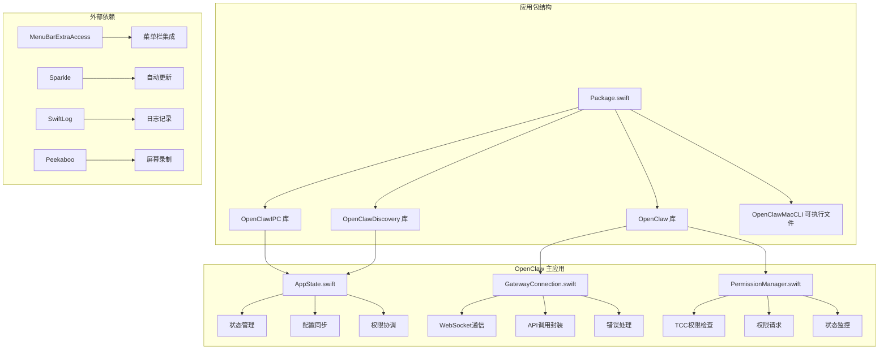
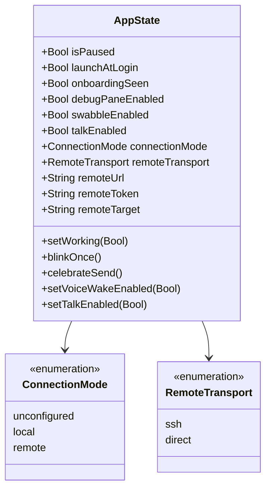
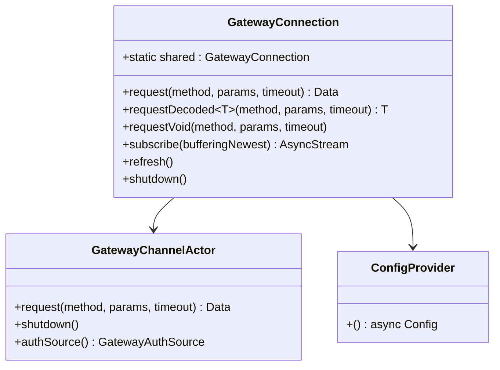
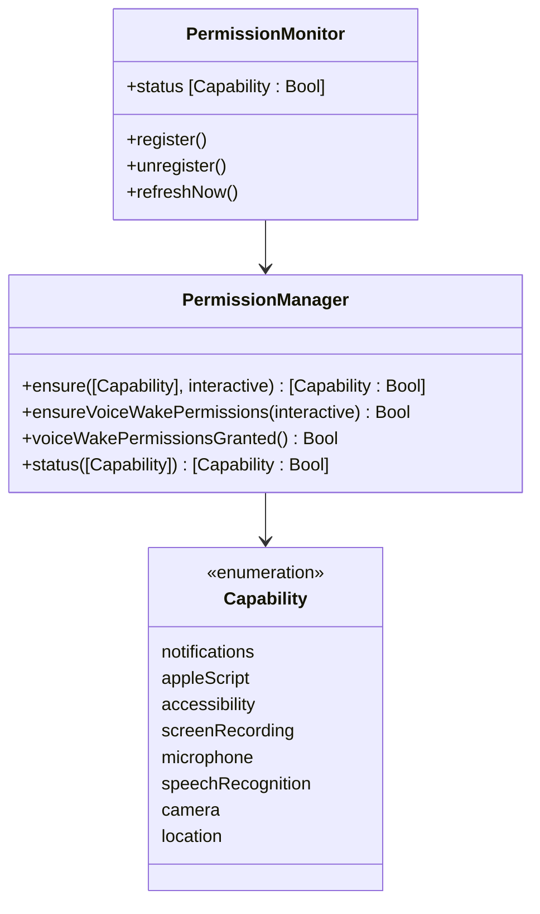
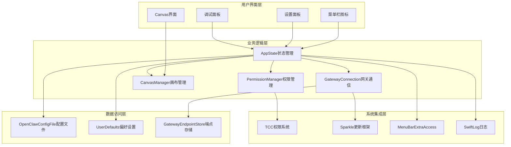
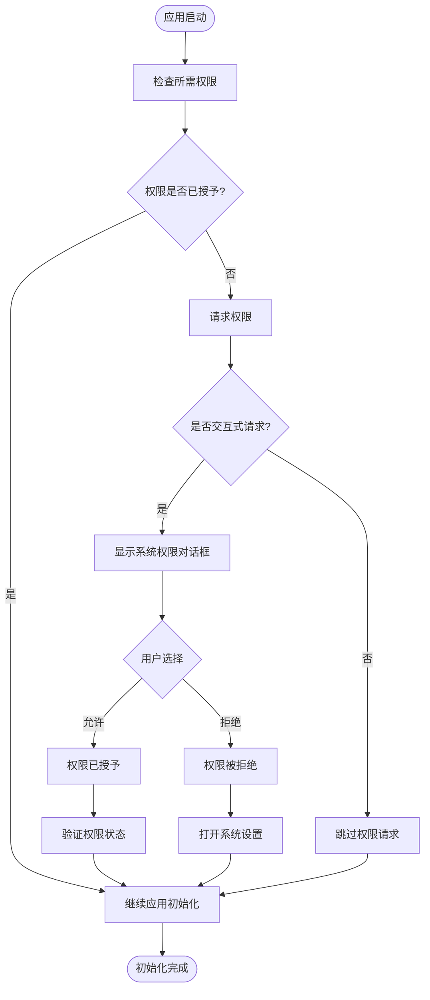
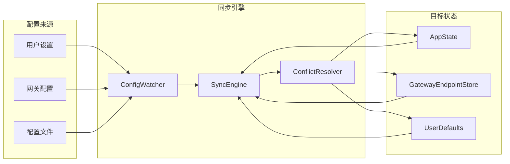
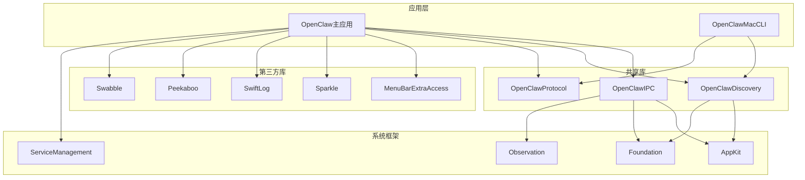

# macOS菜单栏应用

<cite>
**本文档引用的文件**
- [apps/macos/Package.swift](file://apps/macos/Package.swift)
- [apps/macos/Sources/OpenClaw/AppState.swift](file://apps/macos/Sources/OpenClaw/AppState.swift)
- [apps/macos/Sources/OpenClaw/GatewayConnection.swift](file://apps/macos/Sources/OpenClaw/GatewayConnection.swift)
- [apps/macos/Sources/OpenClaw/PermissionManager.swift](file://apps/macos/Sources/OpenClaw/PermissionManager.swift)
- [scripts/codesign-mac-app.sh](file://scripts/codesign-mac-app.sh)
- [scripts/notarize-mac-artifact.sh](file://scripts/notarize-mac-artifact.sh)
- [scripts/package-mac-app.sh](file://scripts/package-mac-app.sh)
- [scripts/make_appcast.sh](file://scripts/make_appcast.sh)
- [scripts/sparkle-build.ts](file://scripts/sparkle-build.ts)
- [appcast.xml](file://appcast.xml)
</cite>

## 目录

1. [简介](#简介)
2. [项目结构](#项目结构)
3. [核心组件](#核心组件)
4. [架构概览](#架构概览)
5. [详细组件分析](#详细组件分析)
6. [依赖关系分析](#依赖关系分析)
7. [性能考虑](#性能考虑)
8. [故障排除指南](#故障排除指南)
9. [结论](#结论)
10. [附录](#附录)

## 简介

OpenClaw macOS菜单栏应用是一个基于Swift的现代化桌面应用程序，专为macOS系统设计。该应用采用菜单栏界面，提供与OpenClaw网关的无缝连接，支持语音唤醒、屏幕录制、摄像头访问等多种功能。

本应用的核心特性包括：

- 菜单栏集成的用户界面
- 与OpenClaw网关的WebSocket通信
- 完整的TCC权限管理系统
- Sparkle自动更新框架
- 多种连接模式支持（本地/远程）
- 高级音频和视觉反馈功能

## 项目结构

OpenClaw macOS应用位于`apps/macos/`目录下，采用模块化架构设计：



**图表来源**

- [apps/macos/Package.swift:1-93](file://apps/macos/Package.swift#L1-L93)

**章节来源**

- [apps/macos/Package.swift:1-93](file://apps/macos/Package.swift#L1-L93)

## 核心组件

### 应用状态管理 (AppState)

应用状态管理是整个应用的核心，负责协调所有功能模块的状态同步：



**图表来源**

- [apps/macos/Sources/OpenClaw/AppState.swift:8-348](file://apps/macos/Sources/OpenClaw/AppState.swift#L8-L348)

### 网关连接管理 (GatewayConnection)

WebSocket连接管理器提供了统一的网关通信接口：



**图表来源**

- [apps/macos/Sources/OpenClaw/GatewayConnection.swift:47-426](file://apps/macos/Sources/OpenClaw/GatewayConnection.swift#L47-L426)

### 权限管理系统 (PermissionManager)

TCC权限管理器确保应用获得必要的系统权限：



**图表来源**

- [apps/macos/Sources/OpenClaw/PermissionManager.swift:12-228](file://apps/macos/Sources/OpenClaw/PermissionManager.swift#L12-L228)

**章节来源**

- [apps/macos/Sources/OpenClaw/AppState.swift:1-846](file://apps/macos/Sources/OpenClaw/AppState.swift#L1-L846)
- [apps/macos/Sources/OpenClaw/GatewayConnection.swift:1-801](file://apps/macos/Sources/OpenClaw/GatewayConnection.swift#L1-L801)
- [apps/macos/Sources/OpenClaw/PermissionManager.swift:1-483](file://apps/macos/Sources/OpenClaw/PermissionManager.swift#L1-L483)

## 架构概览

OpenClaw macOS应用采用分层架构设计，确保各组件间的松耦合和高内聚：



**图表来源**

- [apps/macos/Sources/OpenClaw/AppState.swift:1-846](file://apps/macos/Sources/OpenClaw/AppState.swift#L1-L846)
- [apps/macos/Sources/OpenClaw/GatewayConnection.swift:1-801](file://apps/macos/Sources/OpenClaw/GatewayConnection.swift#L1-L801)
- [apps/macos/Sources/OpenClaw/PermissionManager.swift:1-483](file://apps/macos/Sources/OpenClaw/PermissionManager.swift#L1-L483)

## 详细组件分析

### WebSocket通信流程

应用与OpenClaw网关的通信通过统一的WebSocket连接管理器实现：

```mermaid
sequenceDiagram
participant UI as 用户界面
participant State as AppState
participant Conn as GatewayConnection
participant Actor as GatewayChannelActor
participant GW as OpenClaw网关
UI->>State : 用户操作
State->>Conn : 发送API请求
Conn->>Conn : 检查配置
Conn->>Actor : 创建/复用连接
Actor->>GW : 建立WebSocket连接
GW-->>Actor : 连接确认
Actor->>GW : 发送请求消息
GW-->>Actor : 返回响应
Actor->>Conn : 解析响应
Conn->>State : 更新状态
State->>UI : 刷新界面
Note over Conn,GW : 自动重连和错误恢复
```

**图表来源**

- [apps/macos/Sources/OpenClaw/GatewayConnection.swift:151-426](file://apps/macos/Sources/OpenClaw/GatewayConnection.swift#L151-L426)

### 权限获取流程

TCC权限管理系统提供了一致的权限获取体验：



**图表来源**

- [apps/macos/Sources/OpenClaw/PermissionManager.swift:25-186](file://apps/macos/Sources/OpenClaw/PermissionManager.swift#L25-L186)

### 配置同步机制

应用实现了智能的配置同步，确保本地状态与网关配置保持一致：



**图表来源**

- [apps/macos/Sources/OpenClaw/AppState.swift:460-625](file://apps/macos/Sources/OpenClaw/AppState.swift#L460-L625)

**章节来源**

- [apps/macos/Sources/OpenClaw/GatewayConnection.swift:151-426](file://apps/macos/Sources/OpenClaw/GatewayConnection.swift#L151-L426)
- [apps/macos/Sources/OpenClaw/PermissionManager.swift:25-186](file://apps/macos/Sources/OpenClaw/PermissionManager.swift#L25-L186)
- [apps/macos/Sources/OpenClaw/AppState.swift:460-625](file://apps/macos/Sources/OpenClaw/AppState.swift#L460-L625)

## 依赖关系分析

应用的依赖关系体现了清晰的模块化设计：



**图表来源**

- [apps/macos/Package.swift:17-57](file://apps/macos/Package.swift#L17-L57)

**章节来源**

- [apps/macos/Package.swift:17-57](file://apps/macos/Package.swift#L17-L57)

## 性能考虑

### 内存管理优化

应用采用了多种内存管理策略以确保最佳性能：

- **弱引用模式**：在委托和回调中使用弱引用避免循环引用
- **异步任务管理**：合理使用`Task`和`async/await`避免阻塞主线程
- **资源清理**：及时释放WebSocket连接和系统资源
- **缓存策略**：对频繁访问的数据实施适当的缓存机制

### 网络通信优化

- **连接复用**：单例模式管理WebSocket连接，避免重复建立连接
- **超时控制**：为所有网络请求设置合理的超时时间
- **错误重试**：实现指数退避算法处理临时性网络错误
- **流量控制**：限制并发请求数量防止系统过载

### UI响应性保证

- **主线程隔离**：所有UI更新都在主线程执行
- **后台计算**：将耗时操作移至后台队列
- **增量更新**：只更新发生变化的UI元素
- **懒加载**：延迟加载非关键资源

## 故障排除指南

### 常见问题及解决方案

#### Sparkle更新框架Team ID不匹配

**问题描述**：应用无法正确验证Sparkle更新包的签名

**解决方案**：

1. 检查`sparkle-build.ts`脚本中的Team ID配置
2. 确保代码签名证书与Team ID匹配
3. 验证`appcast.xml`中的公钥指纹

#### 权限获取失败

**问题描述**：应用无法获取所需的系统权限

**排查步骤**：

1. 检查系统设置中的权限状态
2. 重新启动应用以刷新权限状态
3. 在系统偏好设置中手动授予权限

#### WebSocket连接中断

**问题描述**：与OpenClaw网关的连接不稳定

**诊断方法**：

1. 查看应用日志中的连接错误信息
2. 检查网络连接状态
3. 验证防火墙设置

#### 代码签名问题

**问题描述**：应用无法通过Gatekeeper验证

**解决步骤**：

1. 使用`codesign-mac-app.sh`脚本重新签名
2. 检查Entitlements文件配置
3. 验证Provisioning Profile的有效性

**章节来源**

- [scripts/codesign-mac-app.sh](file://scripts/codesign-mac-app.sh)
- [scripts/notarize-mac-artifact.sh](file://scripts/notarize-mac-artifact.sh)
- [scripts/package-mac-app.sh](file://scripts/package-mac-app.sh)
- [scripts/make_appcast.sh](file://scripts/make_appcast.sh)

## 结论

OpenClaw macOS菜单栏应用展现了现代Swift应用开发的最佳实践。通过模块化架构、完善的权限管理系统、以及可靠的网关通信机制，该应用为用户提供了稳定而强大的桌面体验。

关键优势包括：

- **架构清晰**：分层设计便于维护和扩展
- **权限安全**：完整的TCC权限管理确保合规性
- **通信可靠**：健壮的WebSocket连接管理
- **用户体验**：流畅的界面交互和即时反馈
- **自动化程度高**：Sparkle自动更新简化了维护工作

未来改进方向：

- 增强错误恢复机制
- 优化内存使用效率
- 扩展更多连接模式支持
- 改进调试工具和诊断功能

## 附录

### 开发环境设置

#### 快速开发运行

1. **克隆仓库**：`git clone https://github.com/verse-ai-org/openclaw.git`
2. **进入目录**：`cd openclaw`
3. **构建应用**：`swift build -p apps/macos`
4. **运行应用**：`swift run -p apps/macos OpenClaw`

#### 打包发布流程

```bash
# 1. 代码签名
./scripts/codesign-mac-app.sh

# 2. 雪梨公证
./scripts/notarize-mac-artifact.sh

# 3. 创建DMG包
./scripts/package-mac-app.sh

# 4. 生成应用清单
./scripts/make_appcast.sh
```

#### 调试技巧

- 使用`Console.app`查看应用日志
- 启用`DEBUG`构建配置获取详细日志
- 利用Xcode的Instruments进行性能分析
- 使用`lldb`进行断点调试
