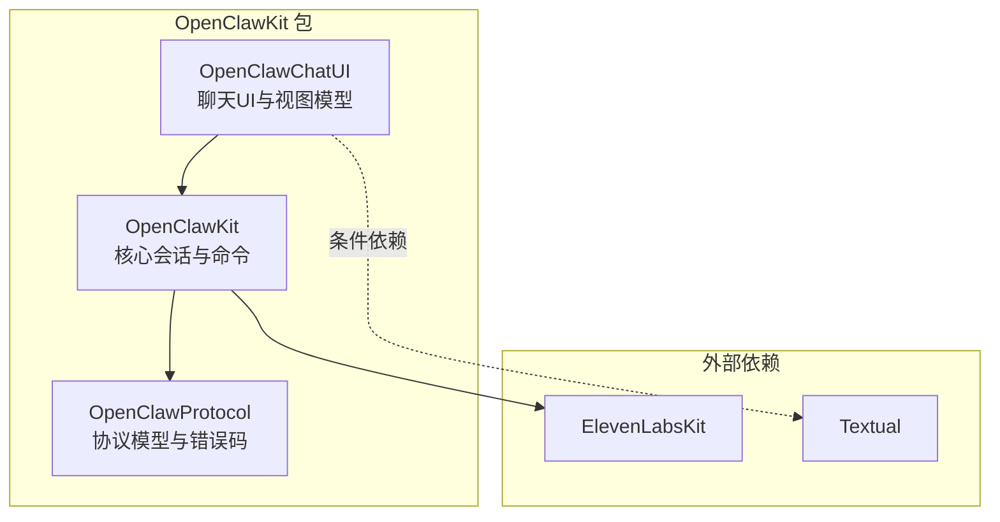
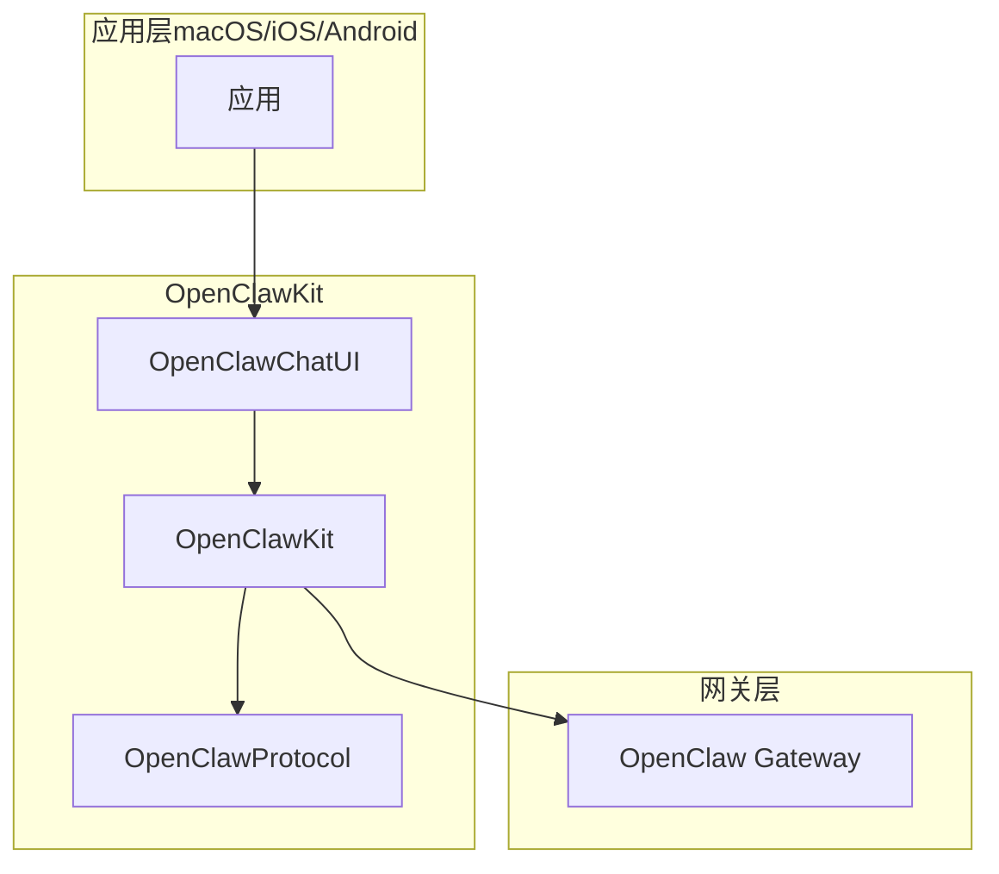
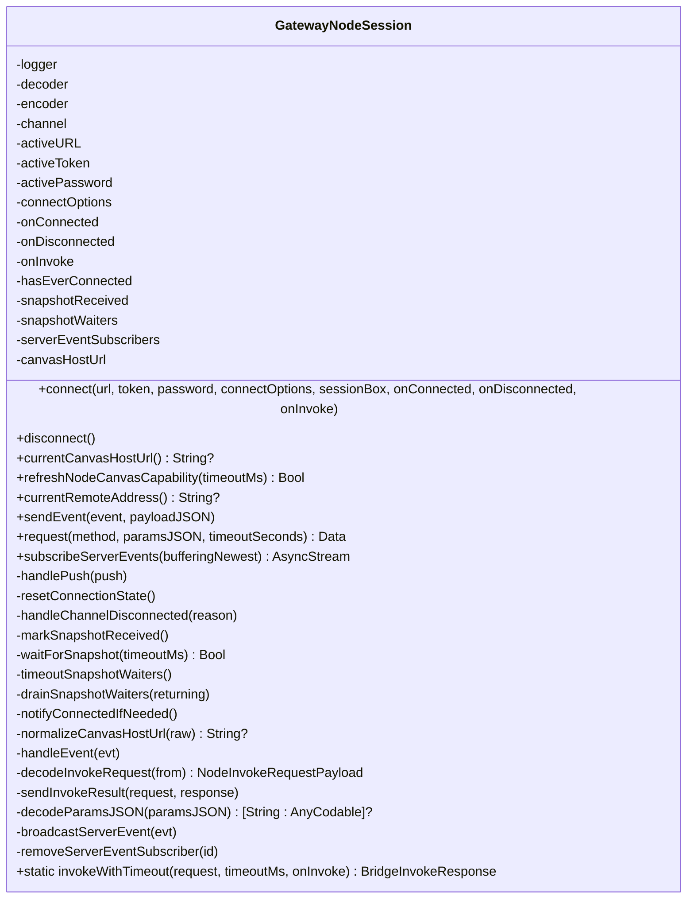
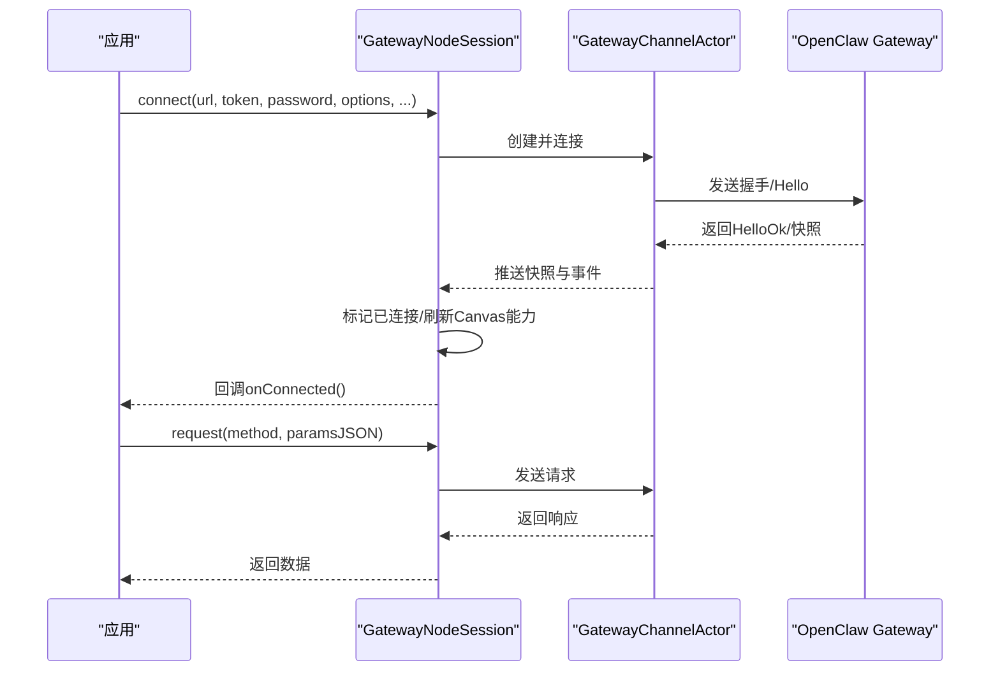
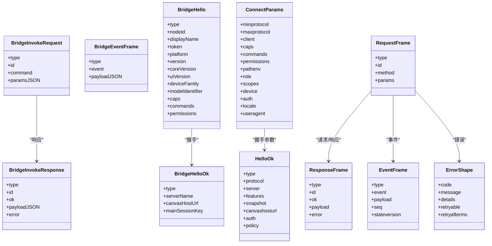
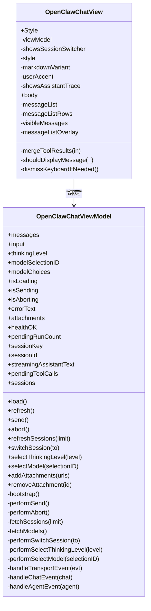
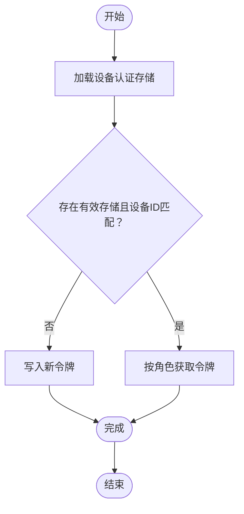
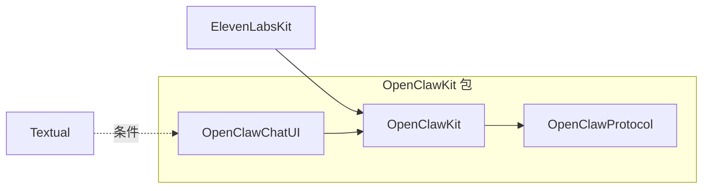

# 共享OpenClawKit

<cite>
**本文档引用的文件**
- [Package.swift](file://apps/shared/OpenClawKit/Package.swift)
- [GatewayModels.swift](file://apps/shared/OpenClawKit/Sources/OpenClawProtocol/GatewayModels.swift)
- [GatewayNodeSession.swift](file://apps/shared/OpenClawKit/Sources/OpenClawKit/GatewayNodeSession.swift)
- [BridgeFrames.swift](file://apps/shared/OpenClawKit/Sources/OpenClawKit/BridgeFrames.swift)
- [Capabilities.swift](file://apps/shared/OpenClawKit/Sources/OpenClawKit/Capabilities.swift)
- [DeviceAuthStore.swift](file://apps/shared/OpenClawKit/Sources/OpenClawKit/DeviceAuthStore.swift)
- [ChatView.swift](file://apps/shared/OpenClawKit/Sources/OpenClawChatUI/ChatView.swift)
- [ChatViewModel.swift](file://apps/shared/OpenClawKit/Sources/OpenClawChatUI/ChatViewModel.swift)
- [README.md](file://README.md)
</cite>

## 目录

1. [简介](#简介)
2. [项目结构](#项目结构)
3. [核心组件](#核心组件)
4. [架构总览](#架构总览)
5. [详细组件分析](#详细组件分析)
6. [依赖关系分析](#依赖关系分析)
7. [性能考虑](#性能考虑)
8. [故障排查指南](#故障排查指南)
9. [结论](#结论)
10. [附录](#附录)

## 简介

本文件面向希望在多平台（macOS、iOS、Android）共享与复用OpenClaw能力的开发者，系统性阐述OpenClawKit包的设计理念、模块化架构、跨平台代码复用策略、包管理配置、模块组织方式、测试框架与质量保证流程，并提供在各平台集成与使用的完整开发指南。

OpenClaw是一个个人AI助手，支持多通道消息、设备节点能力（相机、屏幕录制、位置等）、Canvas可视化工作区、语音唤醒与对话模式等。OpenClawKit作为共享库，封装了跨平台的网关通信协议、会话管理、聊天UI与工具集，使macOS、iOS、Android应用能够一致地接入OpenClaw能力。

## 项目结构

OpenClawKit位于apps/shared/OpenClawKit目录，采用Swift Package Manager进行包管理，包含三个主要目标：

- OpenClawProtocol：定义跨平台通信协议模型与错误码
- OpenClawKit：核心业务逻辑与设备能力封装
- OpenClawChatUI：基于SwiftUI的聊天界面与视图模型

图表来源

- [Package.swift:16-19](file://apps/shared/OpenClawKit/Package.swift#L16-L19)
- [Package.swift:20-52](file://apps/shared/OpenClawKit/Package.swift#L20-L52)

章节来源

- [Package.swift:1-62](file://apps/shared/OpenClawKit/Package.swift#L1-L62)

## 核心组件

- 协议层（OpenClawProtocol）
  - 定义连接参数、握手响应、请求/响应帧、事件帧、状态快照、错误形状等
  - 提供统一的跨平台数据契约，确保客户端与网关的兼容性
- 会话层（OpenClawKit）
  - 封装WebSocket通道、握手、心跳、事件订阅、节点调用超时控制
  - 提供Canvas能力刷新、远程地址解析、事件广播等
- UI层（OpenClawChatUI）
  - 基于SwiftUI的聊天视图与视图模型，支持消息列表、输入框、会话切换、工具调用结果合并显示
  - 提供跨平台布局适配（macOS与iOS）

章节来源

- [GatewayModels.swift:1-800](file://apps/shared/OpenClawKit/Sources/OpenClawProtocol/GatewayModels.swift#L1-L800)
- [GatewayNodeSession.swift:1-530](file://apps/shared/OpenClawKit/Sources/OpenClawKit/GatewayNodeSession.swift#L1-L530)
- [BridgeFrames.swift:1-262](file://apps/shared/OpenClawKit/Sources/OpenClawKit/BridgeFrames.swift#L1-L262)
- [ChatView.swift:1-593](file://apps/shared/OpenClawKit/Sources/OpenClawChatUI/ChatView.swift#L1-L593)
- [ChatViewModel.swift:1-800](file://apps/shared/OpenClawKit/Sources/OpenClawChatUI/ChatViewModel.swift#L1-L800)

## 架构总览

OpenClawKit通过三层次架构实现跨平台共享：

- 协议层：标准化数据结构与方法名，屏蔽平台差异
- 会话层：封装网络与权限交互，提供统一的节点调用与事件订阅接口
- UI层：提供可复用的聊天界面，按平台特性进行布局与行为适配

图表来源

- [GatewayNodeSession.swift:194-253](file://apps/shared/OpenClawKit/Sources/OpenClawKit/GatewayNodeSession.swift#L194-L253)
- [ChatView.swift:64-93](file://apps/shared/OpenClawKit/Sources/OpenClawChatUI/ChatView.swift#L64-L93)

## 详细组件分析

### 组件A：网关节点会话（GatewayNodeSession）

GatewayNodeSession负责与OpenClaw Gateway建立并维持连接，处理握手、事件订阅、节点调用与超时控制，同时提供Canvas能力刷新与URL规范化。

图表来源

- [GatewayNodeSession.swift:59-530](file://apps/shared/OpenClawKit/Sources/OpenClawKit/GatewayNodeSession.swift#L59-L530)

图表来源

- [GatewayNodeSession.swift:194-253](file://apps/shared/OpenClawKit/Sources/OpenClawKit/GatewayNodeSession.swift#L194-L253)
- [GatewayNodeSession.swift:333-345](file://apps/shared/OpenClawKit/Sources/OpenClawKit/GatewayNodeSession.swift#L333-L345)

章节来源

- [GatewayNodeSession.swift:1-530](file://apps/shared/OpenClawKit/Sources/OpenClawKit/GatewayNodeSession.swift#L1-L530)

### 组件B：桥接帧与协议模型（BridgeFrames/GatewayModels）

- BridgeFrames：定义节点调用、事件、握手、配对、心跳、错误等桥接帧结构，用于与网关进行二进制或JSON编码传输
- GatewayModels：定义连接参数、握手响应、请求/响应帧、事件帧、状态快照、错误形状等协议模型，确保跨平台一致性

图表来源

- [BridgeFrames.swift:11-262](file://apps/shared/OpenClawKit/Sources/OpenClawKit/BridgeFrames.swift#L11-L262)
- [GatewayModels.swift:15-800](file://apps/shared/OpenClawKit/Sources/OpenClawProtocol/GatewayModels.swift#L15-L800)

章节来源

- [BridgeFrames.swift:1-262](file://apps/shared/OpenClawKit/Sources/OpenClawKit/BridgeFrames.swift#L1-L262)
- [GatewayModels.swift:1-800](file://apps/shared/OpenClawKit/Sources/OpenClawProtocol/GatewayModels.swift#L1-L800)

### 组件C：聊天UI与视图模型（OpenClawChatUI）

OpenClawChatUI提供跨平台聊天界面，包含消息列表、输入框、会话切换、工具调用结果合并显示、错误提示与空状态处理等。

图表来源

- [ChatView.swift:7-494](file://apps/shared/OpenClawKit/Sources/OpenClawChatUI/ChatView.swift#L7-L494)
- [ChatViewModel.swift:17-800](file://apps/shared/OpenClawKit/Sources/OpenClawChatUI/ChatViewModel.swift#L17-L800)

章节来源

- [ChatView.swift:1-593](file://apps/shared/OpenClawKit/Sources/OpenClawChatUI/ChatView.swift#L1-L593)
- [ChatViewModel.swift:1-800](file://apps/shared/OpenClawKit/Sources/OpenClawChatUI/ChatViewModel.swift#L1-L800)

### 组件D：设备能力与认证存储（Capabilities/DeviceAuthStore）

- Capabilities：定义可用能力枚举（如canvas、browser、camera、screen、voiceWake、location、device、watch、photos、contacts、calendar、reminders、motion），用于节点描述与权限声明
- DeviceAuthStore：提供设备级认证令牌的加载、存储与清理，确保跨会话的安全与一致性

图表来源

- [DeviceAuthStore.swift:26-65](file://apps/shared/OpenClawKit/Sources/OpenClawKit/DeviceAuthStore.swift#L26-L65)

章节来源

- [Capabilities.swift:1-18](file://apps/shared/OpenClawKit/Sources/OpenClawKit/Capabilities.swift#L1-L18)
- [DeviceAuthStore.swift:1-108](file://apps/shared/OpenClawKit/Sources/OpenClawKit/DeviceAuthStore.swift#L1-L108)

## 依赖关系分析

- 平台与版本
  - 支持iOS 18+、macOS 15+
- 外部依赖
  - ElevenLabsKit：用于音频相关能力
  - Textual：用于文本渲染（条件编译，仅在macOS/iOS启用）
- 内部依赖
  - OpenClawChatUI依赖OpenClawKit
  - OpenClawKit依赖OpenClawProtocol

图表来源

- [Package.swift:7-19](file://apps/shared/OpenClawKit/Package.swift#L7-L19)
- [Package.swift:29-47](file://apps/shared/OpenClawKit/Package.swift#L29-L47)

章节来源

- [Package.swift:1-62](file://apps/shared/OpenClawKit/Package.swift#L1-L62)

## 性能考虑

- 连接与事件
  - 使用异步流与检查延续（AsyncStream/CheckedContinuation）优化事件订阅与等待逻辑，避免阻塞主线程
  - 在节点调用中引入显式竞态与超时机制，确保权限弹窗等阻塞场景下的稳定性
- UI渲染
  - ChatView采用LazyVStack与滚动锚点，减少重排开销；根据平台调整内边距与间距，提升滚动性能
  - 视图模型使用@Observable与@MainActor，确保UI线程安全与最小化更新范围
- 数据处理
  - 消息去重与ID复用策略，降低重复渲染与网络传输成本
  - 工具调用结果合并显示，减少消息碎片化带来的渲染压力

## 故障排查指南

- 连接问题
  - 检查Canvas URL规范化与TLS端口映射，确保非本地回环主机在HTTPS下正确转换
  - 关注握手失败、快照缺失与断线重连后的seqGap事件，必要时触发历史刷新
- 节点调用超时
  - invokeWithTimeout确保超时优先于回调完成，避免UI卡死；记录超时日志便于定位
- 认证与权限
  - 设备认证存储需与当前设备ID匹配；角色与作用域需规范化后写入
- UI异常
  - 错误文本为空状态与错误横幅的区分逻辑，确保用户可见性与可操作性

章节来源

- [GatewayNodeSession.swift:27-56](file://apps/shared/OpenClawKit/Sources/OpenClawKit/GatewayNodeSession.swift#L27-L56)
- [GatewayNodeSession.swift:78-152](file://apps/shared/OpenClawKit/Sources/OpenClawKit/GatewayNodeSession.swift#L78-L152)
- [DeviceAuthStore.swift:26-65](file://apps/shared/OpenClawKit/Sources/OpenClawKit/DeviceAuthStore.swift#L26-L65)
- [ChatView.swift:242-282](file://apps/shared/OpenClawKit/Sources/OpenClawChatUI/ChatView.swift#L242-L282)

## 结论

OpenClawKit通过清晰的分层架构与严格的协议契约，实现了在macOS、iOS、Android平台上的能力共享与一致体验。借助Swift Package Manager与条件编译，既保证了跨平台复用，又兼顾了平台特性。建议在新增共享功能时遵循现有模式：先在协议层定义数据结构，再在会话层实现业务逻辑，最后在UI层提供可复用组件，确保测试覆盖与质量稳定。

## 附录

### 开发指南：添加新的共享功能

- 协议层
  - 在OpenClawProtocol中新增数据结构或方法定义，保持字段命名与编码键一致
  - 为新类型实现Codable与Sendable，确保跨线程安全
- 会话层
  - 在OpenClawKit中新增对应的方法或Actor，封装网络调用与事件处理
  - 为可能的超时与竞态场景提供明确的超时控制与错误返回
- UI层
  - 在OpenClawChatUI中新增视图或视图模型方法，遵循@Observable与@MainActor
  - 针对平台差异（macOS/iOS）进行条件编译与布局适配
- 测试与质量
  - 编写单元测试与集成测试，覆盖正常路径、边界条件与错误路径
  - 使用Swift Testing框架（已在包配置中启用）进行并发安全测试

章节来源

- [Package.swift:57-60](file://apps/shared/OpenClawKit/Package.swift#L57-L60)

### 跨平台代码编写要点

- 平台条件编译
  - 使用#if os(macOS)/#if os(iOS)等条件编译宏，针对平台差异进行布局与行为适配
- 并发与线程
  - 使用@MainActor标注UI相关状态与方法，Actor与Task确保并发安全
- 资源与权限
  - 通过Capabilities枚举声明节点能力，结合DeviceAuthStore进行认证令牌管理

章节来源

- [ChatView.swift:27-46](file://apps/shared/OpenClawKit/Sources/OpenClawChatUI/ChatView.swift#L27-L46)
- [Capabilities.swift:1-18](file://apps/shared/OpenClawKit/Sources/OpenClawKit/Capabilities.swift#L1-L18)
- [DeviceAuthStore.swift:1-108](file://apps/shared/OpenClawKit/Sources/OpenClawKit/DeviceAuthStore.swift#L1-L108)

### 在macOS、iOS、Android应用中的集成步骤

- macOS
  - 通过SwiftPM引入OpenClawKit，使用OpenClawChatView与OpenClawChatViewModel构建聊天界面
  - 在菜单栏或窗口中嵌入WebChat与Canvas
- iOS
  - 在iOS应用中集成OpenClawChatUI，利用Textual渲染Markdown内容
  - 通过节点能力执行相机、屏幕录制、位置等本地动作
- Android
  - 通过网关WebSocket协议与OpenClawKit共享的协议模型对接
  - 实现相应的UI与权限适配，复用OpenClawKit定义的数据结构与方法语义

章节来源

- [README.md:126-176](file://README.md#L126-L176)
- [README.md:289-311](file://README.md#L289-L311)
