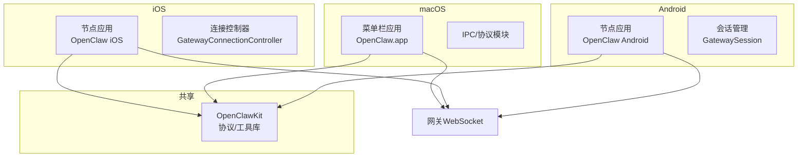
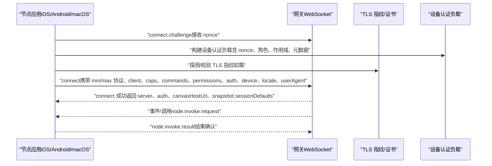
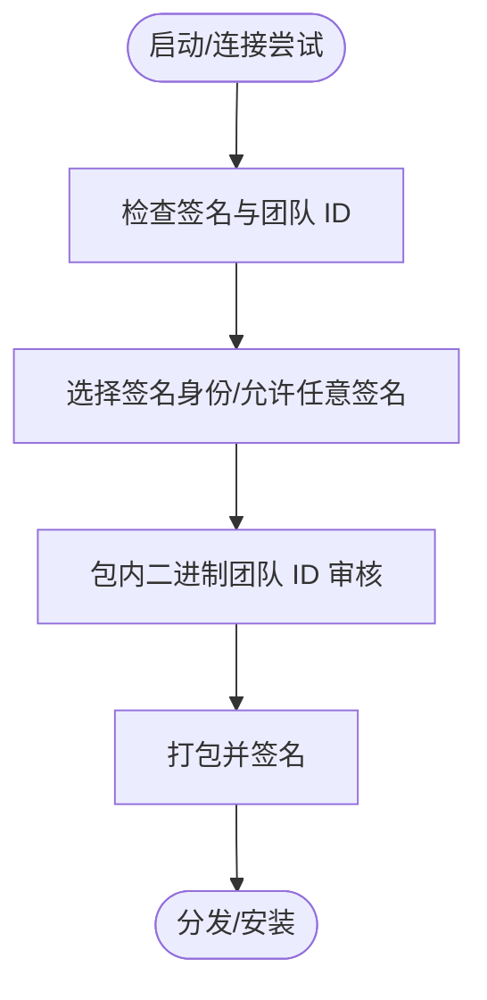
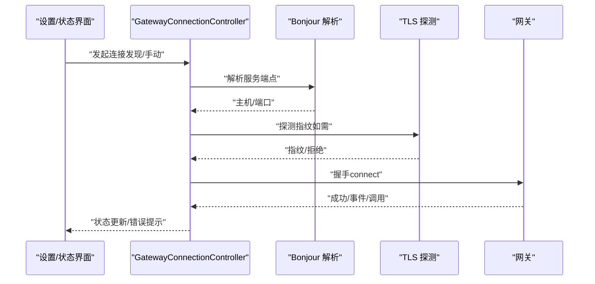
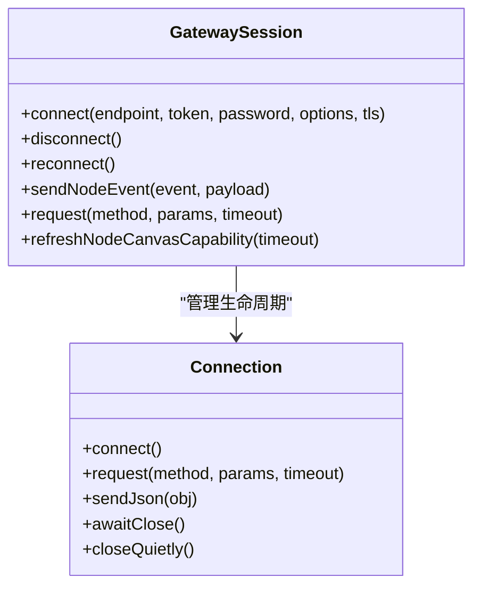
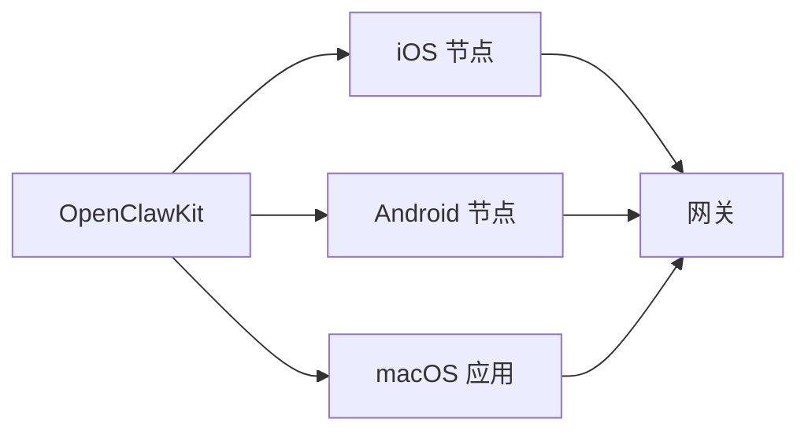

# 配套应用程序

<cite>
**本文引用的文件**
- [apps/macos/README.md](file://apps/macos/README.md)
- [apps/ios/README.md](file://apps/ios/README.md)
- [apps/android/README.md](file://apps/android/README.md)
- [GatewayConnectionController.swift](file://apps/ios/Sources/Gateway/GatewayConnectionController.swift)
- [GatewaySession.kt](file://apps/android/app/src/main/java/ai/openclaw/app/gateway/GatewaySession.kt)
- [DevicePairingApprovalPrompter.swift](file://apps/macos/Sources/OpenClaw/DevicePairingApprovalPrompter.swift)
- [DeviceAuthPayload.swift](file://apps/shared/OpenClawKit/Sources/OpenClawKit/DeviceAuthPayload.swift)
- [Package.swift（OpenClawKit）](file://apps/shared/OpenClawKit/Package.swift)
- [protocol.md（网关协议）](file://docs/zh-CN/gateway/protocol.md)
- [bundled-gateway.md（mac 平台捆绑网关）](file://docs/zh-CN/platforms/mac/bundled-gateway.md)
- [remote-gateway-readme.md（远程网关）](file://docs/zh-CN/gateway/remote-gateway-readme.md)
- [device-pairing.test.ts（设备配对测试）](file://src/infra/device-pairing.test.ts)
</cite>

## 目录

1. [简介](#简介)
2. [项目结构](#项目结构)
3. [核心组件](#核心组件)
4. [架构总览](#架构总览)
5. [详细组件分析](#详细组件分析)
6. [依赖关系分析](#依赖关系分析)
7. [性能考量](#性能考量)
8. [故障排除指南](#故障排除指南)
9. [结论](#结论)
10. [附录](#附录)

## 简介

本文件面向 OpenClaw 的配套应用程序，系统性梳理 macOS 菜单栏应用、iOS 节点、Android 节点的架构设计、权限管理、与网关的通信机制，并提供安装配置、使用教程、开发与调试指南，以及与网关交互、设备配对、功能扩展的实践路径。

## 项目结构

配套应用位于 apps 目录下，分别包含：

- macOS：菜单栏应用与相关工具、协议与 IPC 组件
- iOS：节点应用，支持发现与手动连接网关、TLS 指纹信任、聊天与语音、位置自动化等
- Android：节点应用，支持发现/手动连接、权限请求、Canvas/A2UI、集成能力测试等
- 共享库 OpenClawKit：跨平台协议与工具库（iOS/macOS）

图表来源

- [apps/macos/README.md:1-65](file://apps/macos/README.md#L1-L65)
- [apps/ios/README.md:1-178](file://apps/ios/README.md#L1-L178)
- [apps/android/README.md:1-229](file://apps/android/README.md#L1-L229)
- [GatewayConnectionController.swift:1-1072](file://apps/ios/Sources/Gateway/GatewayConnectionController.swift#L1-L1072)
- [GatewaySession.kt:1-761](file://apps/android/app/src/main/java/ai/openclaw/app/gateway/GatewaySession.kt#L1-L761)
- [Package.swift（OpenClawKit）:1-62](file://apps/shared/OpenClawKit/Package.swift#L1-L62)

章节来源

- [apps/macos/README.md:1-65](file://apps/macos/README.md#L1-L65)
- [apps/ios/README.md:1-178](file://apps/ios/README.md#L1-L178)
- [apps/android/README.md:1-229](file://apps/android/README.md#L1-L229)
- [Package.swift（OpenClawKit）:1-62](file://apps/shared/OpenClawKit/Package.swift#L1-L62)

## 核心组件

- macOS 菜单栏应用
  - 快速运行与打包签名流程、自动团队 ID 审计、库验证绕过（仅限本地开发）
  - 设备配对审批提示器，负责弹窗与状态维护
- iOS 节点
  - 发现与手动连接、TLS 指纹信任、聊天与 Talk、相机/屏幕/位置/联系人/日历/提醒/照片/运动/通知等能力路由
  - 蓝牙/推送通知能力（APNs）注册与校验
- Android 节点
  - 发现/手动连接、权限请求（相机/录音/位置/通知）、Canvas/A2UI、集成能力测试
  - 前台服务、热重载与宏基准测试支持
- 共享库 OpenClawKit
  - 提供协议常量、设备认证负载构建、跨平台一致性规范

章节来源

- [apps/macos/README.md:1-65](file://apps/macos/README.md#L1-L65)
- [apps/ios/README.md:1-178](file://apps/ios/README.md#L1-L178)
- [apps/android/README.md:1-229](file://apps/android/README.md#L1-L229)
- [DevicePairingApprovalPrompter.swift:1-49](file://apps/macos/Sources/OpenClaw/DevicePairingApprovalPrompter.swift#L1-L49)
- [DeviceAuthPayload.swift:1-55](file://apps/shared/OpenClawKit/Sources/OpenClawKit/DeviceAuthPayload.swift#L1-L55)
- [Package.swift（OpenClawKit）:1-62](file://apps/shared/OpenClawKit/Package.swift#L1-L62)

## 架构总览

配套应用均通过 WebSocket 与网关建立连接，握手阶段声明角色（role）、作用域（scopes）、能力（caps）、命令（commands）、权限（permissions），并进行设备认证与 TLS 指纹校验。iOS/Android 节点在前台运行时具备更完整的功能集，后台受限；macOS 应用作为 operator 节点与网关交互并通过菜单栏提供控制与状态。

图表来源

- [protocol.md（网关协议）:1-71](file://docs/zh-CN/gateway/protocol.md#L1-L71)
- [GatewayConnectionController.swift:1-1072](file://apps/ios/Sources/Gateway/GatewayConnectionController.swift#L1-L1072)
- [GatewaySession.kt:1-761](file://apps/android/app/src/main/java/ai/openclaw/app/gateway/GatewaySession.kt#L1-L761)
- [DeviceAuthPayload.swift:1-55](file://apps/shared/OpenClawKit/Sources/OpenClawKit/DeviceAuthPayload.swift#L1-L55)

## 详细组件分析

### macOS 菜单栏应用

- 开发与打包
  - 快速启动脚本、签名策略（开发者 ID/Apple 分发/Apple 开发/任意签名）、团队 ID 审计、库验证绕过（开发期）
- 设备配对
  - 审批提示器集中管理待处理与修复中的配对请求队列，避免重复弹窗与状态错乱

图表来源

- [apps/macos/README.md:17-65](file://apps/macos/README.md#L17-L65)
- [DevicePairingApprovalPrompter.swift:1-49](file://apps/macos/Sources/OpenClaw/DevicePairingApprovalPrompter.swift#L1-L49)

章节来源

- [apps/macos/README.md:1-65](file://apps/macos/README.md#L1-L65)
- [DevicePairingApprovalPrompter.swift:1-49](file://apps/macos/Sources/OpenClaw/DevicePairingApprovalPrompter.swift#L1-L49)

### iOS 节点

- 连接与发现
  - 自动发现网关、Bonjour 解析、TXT/A/AAAA 记录解析、TLS 指纹探测与信任提示、手动连接与上次连接恢复
  - 场景切换（前台/后台）触发发现启停与自动重连
- 能力与命令
  - 默认启用 canvas/screen；可选开启 camera、voiceWake；支持 location/contacts/calendar/reminders/photos/motion/local notifications 等
- 权限与后台限制
  - 严格限制后台执行（canvas/camera/screen/talk 等），前台优先；位置权限需“始终”；APNs 注册受推送能力与配置影响
- 聊天与语音
  - 通过网关会话承载聊天与 Talk；Talk 与 Voice Wake 共用麦克风资源，存在互斥

图表来源

- [GatewayConnectionController.swift:1-1072](file://apps/ios/Sources/Gateway/GatewayConnectionController.swift#L1-L1072)
- [apps/ios/README.md:89-178](file://apps/ios/README.md#L89-L178)

章节来源

- [GatewayConnectionController.swift:1-1072](file://apps/ios/Sources/Gateway/GatewayConnectionController.swift#L1-L1072)
- [apps/ios/README.md:1-178](file://apps/ios/README.md#L1-L178)

### Android 节点

- 会话与连接
  - 基于 OkHttp WebSocket，统一 RPC 请求/响应与事件分发；支持 TLS 参数注入与主机名校验
  - 连接循环：失败指数回退、断线重连、Canvas 主机地址规范化
- 能力与命令
  - 支持 camera/canvas/screen/location/contacts/calendar/reminders/photos/motion/notifications 等
  - Canvas/A2UI 命令需要前台与 Screen Tab 可见
- 权限与测试
  - 发现阶段按系统版本区分权限（Nearby Wi-Fi Devices / ACCESS_FINE_LOCATION）；前台服务通知（Android 13+）
  - 集成能力测试覆盖非交互命令，支持 ADB 反向隧道本地联调

图表来源

- [GatewaySession.kt:1-761](file://apps/android/app/src/main/java/ai/openclaw/app/gateway/GatewaySession.kt#L1-L761)

章节来源

- [GatewaySession.kt:1-761](file://apps/android/app/src/main/java/ai/openclaw/app/gateway/GatewaySession.kt#L1-L761)
- [apps/android/README.md:1-229](file://apps/android/README.md#L1-L229)

### 共享库 OpenClawKit

- 协议与工具
  - 设备认证负载构建（标准化元数据字段大小写、拼接规则一致）
  - 跨平台一致性保障（TS/Swift/Kotlin）
- 模块化
  - OpenClawProtocol、OpenClawKit、OpenClawChatUI 三库分离，便于复用与测试

章节来源

- [DeviceAuthPayload.swift:1-55](file://apps/shared/OpenClawKit/Sources/OpenClawKit/DeviceAuthPayload.swift#L1-L55)
- [Package.swift（OpenClawKit）:1-62](file://apps/shared/OpenClawKit/Package.swift#L1-L62)

## 依赖关系分析

- iOS/Android 节点依赖 OpenClawKit 提供协议与认证能力
- macOS 应用同样依赖 OpenClawKit，配合菜单栏与系统权限框架
- 网关协议定义了统一的 WebSocket 控制面与节点传输层

图表来源

- [Package.swift（OpenClawKit）:1-62](file://apps/shared/OpenClawKit/Package.swift#L1-L62)
- [protocol.md（网关协议）:1-71](file://docs/zh-CN/gateway/protocol.md#L1-L71)

章节来源

- [Package.swift（OpenClawKit）:1-62](file://apps/shared/OpenClawKit/Package.swift#L1-L62)
- [protocol.md（网关协议）:1-71](file://docs/zh-CN/gateway/protocol.md#L1-L71)

## 性能考量

- iOS
  - 后台限制严格，建议前台运行关键能力；自动重连与场景切换需谨慎处理，避免死连接状态
- Android
  - 使用前台服务与通知；Canvas/A2UI 需要 WebView 依附；宏基准测试与热区分析可用于定位启动瓶颈
- macOS
  - 打包签名与团队 ID 审核确保加载稳定性；库验证绕过仅限开发期

章节来源

- [apps/ios/README.md:137-178](file://apps/ios/README.md#L137-L178)
- [apps/android/README.md:59-92](file://apps/android/README.md#L59-L92)
- [apps/macos/README.md:47-65](file://apps/macos/README.md#L47-L65)

## 故障排除指南

- 连接与发现
  - iOS：启用发现调试日志、检查网关状态与 TLS 指纹；必要时切换手动主机/端口/TLS
  - Android：ADB 反向隧道直连本地网关；检查 Canvas 主机可达性与 Screen Tab 可见性
- 认证与配对
  - macOS：通过审批提示器处理待处理/修复中的配对请求；确保网关侧批准最新请求
  - 网关侧配对令牌与作用域验证可通过测试用例参考
- 远程网关
  - 通过 SSH 隧道访问远端网关；确保本地端口转发正确

章节来源

- [apps/ios/README.md:156-178](file://apps/ios/README.md#L156-L178)
- [apps/android/README.md:112-164](file://apps/android/README.md#L112-L164)
- [DevicePairingApprovalPrompter.swift:1-49](file://apps/macos/Sources/OpenClaw/DevicePairingApprovalPrompter.swift#L1-L49)
- [device-pairing.test.ts（设备配对测试）:1-132](file://src/infra/device-pairing.test.ts#L1-L132)
- [remote-gateway-readme.md（远程网关）:18-38](file://docs/zh-CN/gateway/remote-gateway-readme.md#L18-L38)

## 结论

配套应用围绕统一的网关协议与共享库构建，实现了跨平台的一致体验与安全连接。iOS/Android 节点侧重前台能力与权限管理，macOS 应用承担 operator 角色并提供菜单栏控制。通过严格的 TLS 指纹校验、设备认证与后台限制策略，配套应用在可用性与安全性之间取得平衡。

## 附录

### 安装与配置指南

- macOS
  - 快速运行与打包签名、团队 ID 审核、库验证绕过（开发期）
- iOS
  - Xcode 手动部署、Beta 发布流程、APNs 期望与调试
- Android
  - 构建/运行/测试、Kotlin Lint/Format、宏基准测试、USB 本地联调

章节来源

- [apps/macos/README.md:1-65](file://apps/macos/README.md#L1-L65)
- [apps/ios/README.md:1-178](file://apps/ios/README.md#L1-L178)
- [apps/android/README.md:1-229](file://apps/android/README.md#L1-L229)

### 使用教程

- iOS
  - 配对（Telegram）、发现/手动连接、聊天/Talk、相机/屏幕/位置/联系人/日历/提醒/照片/运动/通知
- Android
  - 连接/配对、权限请求、Canvas/A2UI、集成能力测试

章节来源

- [apps/ios/README.md:98-146](file://apps/ios/README.md#L98-L146)
- [apps/android/README.md:143-229](file://apps/android/README.md#L143-L229)

### 开发与调试

- iOS
  - 项目生成与签名配置、Beta 归档/上传、调试子系统过滤、前台优先验证
- Android
  - Live Edit/Apply Changes、Canvas Web 内容热重载、宏基准与热点分析
- macOS
  - 快速启动脚本、签名与审计、库验证绕过（开发期）

章节来源

- [apps/ios/README.md:18-88](file://apps/ios/README.md#L18-L88)
- [apps/android/README.md:134-142](file://apps/android/README.md#L134-L142)
- [apps/macos/README.md:3-23](file://apps/macos/README.md#L3-L23)

### 与网关交互、配对与扩展

- 交互要点
  - 握手阶段声明 role/scopes/caps/commands/permissions；connect 成功后进入事件/调用循环
- 配对流程
  - 网关侧请求配对、批准后颁发令牌；macOS 审批提示器集中管理
- 扩展建议
  - 在 OpenClawKit 中新增协议常量与认证负载字段时，保持跨平台一致性

章节来源

- [protocol.md（网关协议）:1-71](file://docs/zh-CN/gateway/protocol.md#L1-L71)
- [DeviceAuthPayload.swift:1-55](file://apps/shared/OpenClawKit/Sources/OpenClawKit/DeviceAuthPayload.swift#L1-L55)
- [DevicePairingApprovalPrompter.swift:1-49](file://apps/macos/Sources/OpenClaw/DevicePairingApprovalPrompter.swift#L1-L49)
- [device-pairing.test.ts（设备配对测试）:1-132](file://src/infra/device-pairing.test.ts#L1-L132)
