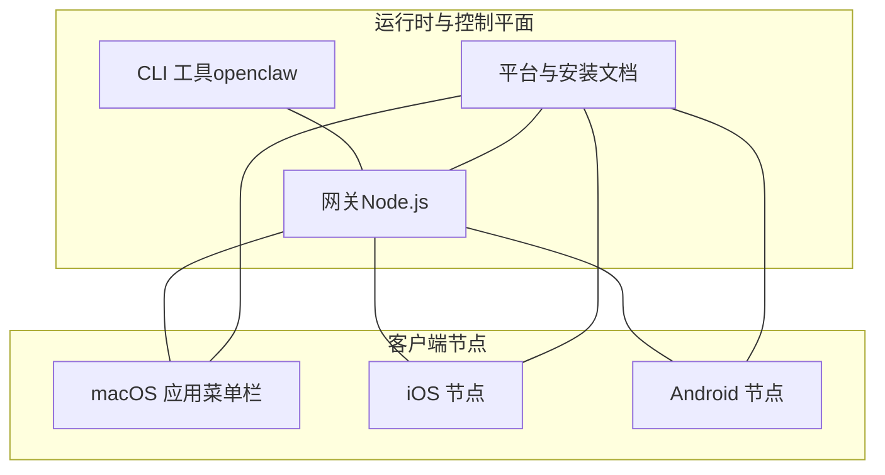
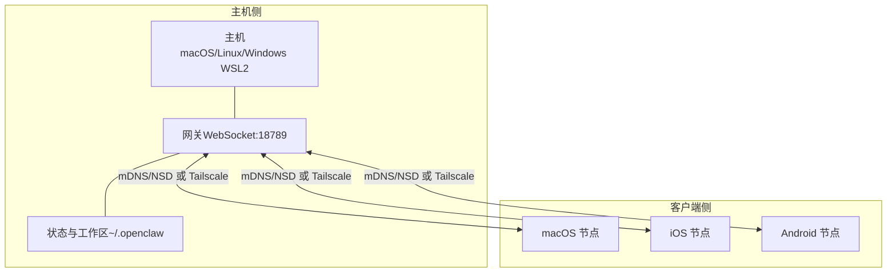
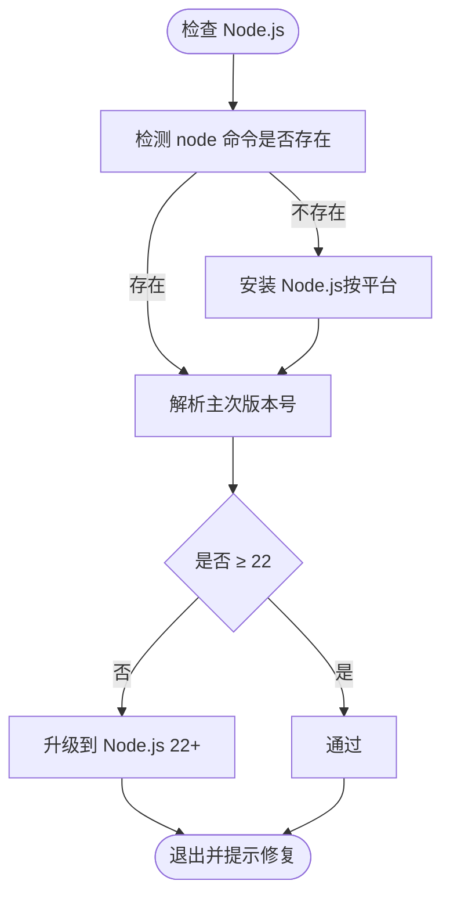
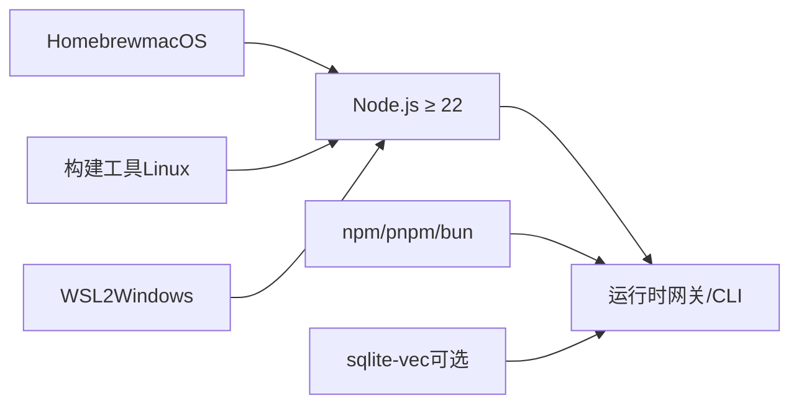
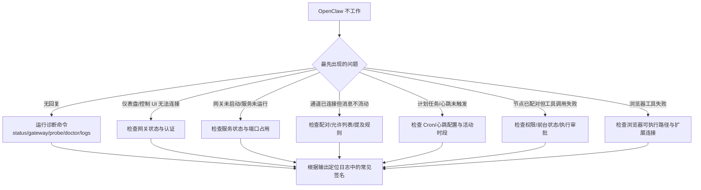

# 系统要求

<cite>
**本文引用的文件**
- [README.md](file://README.md)
- [package.json](file://package.json)
- [scripts/install.sh](file://scripts/install.sh)
- [src/daemon/runtime-paths.ts](file://src/daemon/runtime-paths.ts)
- [docs/platforms/android.md](file://docs/platforms/android.md)
- [docs/platforms/ios.md](file://docs/platforms/ios.md)
- [docs/platforms/linux.md](file://docs/platforms/linux.md)
- [docs/platforms/windows.md](file://docs/platforms/windows.md)
- [docs/platforms/macos.md](file://docs/platforms/macos.md)
- [docs/help/troubleshooting.md](file://docs/help/troubleshooting.md)
- [src/memory/backend-config.ts](file://src/memory/backend-config.ts)
- [src/memory/manager-sync-ops.ts](file://src/memory/manager-sync-ops.ts)
- [scripts/test-perf-budget.mjs](file://scripts/test-perf-budget.mjs)
- [scripts/sqlite-vec-smoke.mjs](file://scripts/sqlite-vec-smoke.mjs)
</cite>

## 目录

1. [简介](#简介)
2. [项目结构](#项目结构)
3. [核心组件](#核心组件)
4. [架构总览](#架构总览)
5. [详细组件分析](#详细组件分析)
6. [依赖关系分析](#依赖关系分析)
7. [性能考虑](#性能考虑)
8. [故障排除指南](#故障排除指南)
9. [结论](#结论)
10. [附录](#附录)

## 简介

本文件面向希望在本地或远程运行 OpenClaw 的用户，提供详尽的系统要求说明与平台适配建议。内容涵盖：

- 运行时与系统依赖：Node.js 版本要求、操作系统支持、网络与端口、存储与内存建议
- 平台特定要求：macOS、Linux、Windows（WSL2）、iOS、Android 的安装与连接要点
- 兼容性与性能：SQLite Vector 扩展、向量检索模式、测试性能预算工具
- 常见问题排查：基于官方诊断命令的快速定位流程

## 项目结构

OpenClaw 采用多语言混合架构，核心以 Node.js 实现控制平面与网关，同时提供 Swift/ObjC 的 macOS 应用以及 Kotlin/Java 的 Android/iOS 节点应用。安装脚本与平台文档提供了跨平台的安装与连接指引。

图示来源

- [README.md](file://README.md)
- [docs/platforms/android.md](file://docs/platforms/android.md)
- [docs/platforms/ios.md](file://docs/platforms/ios.md)
- [docs/platforms/macos.md](file://docs/platforms/macos.md)

章节来源

- [README.md](file://README.md)
- [docs/platforms/android.md](file://docs/platforms/android.md)
- [docs/platforms/ios.md](file://docs/platforms/ios.md)
- [docs/platforms/linux.md](file://docs/platforms/linux.md)
- [docs/platforms/windows.md](file://docs/platforms/windows.md)
- [docs/platforms/macos.md](file://docs/platforms/macos.md)

## 核心组件

- Node.js 运行时：最低版本要求为 22；包管理器支持 npm/pnpm/bun；引擎声明与安装脚本均体现该要求。
- 网关（Gateway）：作为控制平面，承载会话、通道、工具与事件的统一 WebSocket 接口，默认监听回环地址。
- 客户端节点：macOS/iOS/Android 通过设备配对与 WebSocket 连接至网关，执行本地能力（如 Canvas、相机、屏幕录制、系统命令等）。
- 内存与检索：内置内存后端与可选的 QMD 向量化索引；向量扩展依赖 sqlite-vec。

章节来源

- [package.json](file://package.json)
- [scripts/install.sh](file://scripts/install.sh)
- [src/daemon/runtime-paths.ts](file://src/daemon/runtime-paths.ts)
- [src/memory/backend-config.ts](file://src/memory/backend-config.ts)

## 架构总览

下图展示 OpenClaw 的典型部署形态：网关在主机上运行，客户端节点通过局域网或 Tailscale 尾网进行发现与连接。

图示来源

- [docs/platforms/android.md](file://docs/platforms/android.md)
- [docs/platforms/ios.md](file://docs/platforms/ios.md)
- [docs/platforms/linux.md](file://docs/platforms/linux.md)
- [docs/platforms/windows.md](file://docs/platforms/windows.md)
- [docs/platforms/macos.md](file://docs/platforms/macos.md)

## 详细组件分析

### Node.js 运行时与系统依赖

- 版本要求：Node.js ≥ 22；安装脚本与包引擎字段明确要求。
- 包管理器：npm、pnpm、bun 均受支持；推荐使用 pnpm 构建源码。
- 平台路径解析：在不同平台（macOS/Linux/Windows）上自动探测系统 Node 可执行路径，便于诊断与兼容。

图示来源

- [scripts/install.sh](file://scripts/install.sh)
- [package.json](file://package.json)
- [src/daemon/runtime-paths.ts](file://src/daemon/runtime-paths.ts)

章节来源

- [scripts/install.sh](file://scripts/install.sh)
- [package.json](file://package.json)
- [src/daemon/runtime-paths.ts](file://src/daemon/runtime-paths.ts)

### 操作系统支持与平台差异

- macOS：提供菜单栏应用，负责权限与本地节点服务；支持本地/远程模式；建议避免将状态目录置于 iCloud 同步路径。
- Linux：网关完全支持；建议使用 systemd 用户服务；不推荐在 Gateway 上使用 Bun（WhatsApp/Telegram 存在已知问题）。
- Windows：推荐通过 WSL2（Ubuntu）安装与运行；需要启用 systemd；可配置开机自启与端口转发。
- iOS：节点应用通过 WebSocket 连接网关，支持 Canvas、语音唤醒/通话模式；需前台运行以启用部分功能。
- Android：节点应用通过 mDNS/NSD 或 Tailscale 发现网关；支持 Canvas、相机、屏幕录制与设备命令。

章节来源

- [docs/platforms/macos.md](file://docs/platforms/macos.md)
- [docs/platforms/linux.md](file://docs/platforms/linux.md)
- [docs/platforms/windows.md](file://docs/platforms/windows.md)
- [docs/platforms/ios.md](file://docs/platforms/ios.md)
- [docs/platforms/android.md](file://docs/platforms/android.md)

### 网络与端口要求

- 默认端口：网关默认绑定回环地址的 WebSocket 端口（通常为 18789），可通过配置调整。
- 发现机制：同一局域网内使用 mDNS/NSD；跨网络可使用 Tailscale 尾网并通过单播 DNS-SD 发布记录。
- 远程访问：可通过 SSH 隧道或 Tailscale Serve/Funnel 暴露网关仪表盘与 WebSocket；注意认证与密码策略。

章节来源

- [docs/platforms/android.md](file://docs/platforms/android.md)
- [docs/platforms/ios.md](file://docs/platforms/ios.md)
- [docs/platforms/linux.md](file://docs/platforms/linux.md)
- [docs/platforms/windows.md](file://docs/platforms/windows.md)
- [docs/platforms/macos.md](file://docs/platforms/macos.md)

### 存储与内存需求

- 状态目录：默认位于用户主目录下的工作区（例如 ~/.openclaw），建议放置于本地非同步路径，避免云盘同步带来的锁争用与延迟。
- 内存后端：默认使用内置内存；可选启用 QMD 向量化索引，支持自定义集合与更新策略。
- 向量扩展：sqlite-vec 扩展用于向量相似度检索；加载失败时会降级为非向量模式并记录告警。

章节来源

- [docs/platforms/macos.md](file://docs/platforms/macos.md)
- [src/memory/backend-config.ts](file://src/memory/backend-config.ts)
- [src/memory/manager-sync-ops.ts](file://src/memory/manager-sync-ops.ts)

### 性能与基准

- 测试性能预算：提供性能回归检查工具，支持设置最大墙钟时间、基线时间与最大回归百分比，用于单元测试阶段的性能约束。
- 向量检索模式：默认优先交互速度，可切换为查询模式以提升召回但可能更慢；可根据硬件条件选择合适模式。

章节来源

- [scripts/test-perf-budget.mjs](file://scripts/test-perf-budget.mjs)
- [src/memory/backend-config.ts](file://src/memory/backend-config.ts)

## 依赖关系分析

OpenClaw 的运行依赖主要分为三类：

- 运行时与包管理：Node.js ≥ 22、npm/pnpm/bun
- 平台工具链：macOS（Homebrew）、Linux（构建工具）、Windows（WSL2 + systemd）
- 可选向量化：sqlite-vec 扩展（用于向量检索）

图示来源

- [package.json](file://package.json)
- [scripts/install.sh](file://scripts/install.sh)
- [src/memory/manager-sync-ops.ts](file://src/memory/manager-sync-ops.ts)

章节来源

- [package.json](file://package.json)
- [scripts/install.sh](file://scripts/install.sh)
- [src/memory/manager-sync-ops.ts](file://src/memory/manager-sync-ops.ts)

## 性能考虑

- 向量检索模式：默认使用“search”模式以平衡速度与召回；在 CPU 资源紧张时尤为适用；若追求更高召回可切换为“query”模式。
- 更新与嵌入：QMD 支持定时更新与嵌入，可通过配置调整间隔与超时，避免频繁 I/O 抖动。
- 性能预算：通过测试工具设定回归阈值，确保关键路径性能稳定。

章节来源

- [src/memory/backend-config.ts](file://src/memory/backend-config.ts)
- [scripts/test-perf-budget.mjs](file://scripts/test-perf-budget.mjs)

## 故障排除指南

以下为基于官方诊断命令的快速排障流程，建议在遇到问题时按顺序执行：

图示来源

- [docs/help/troubleshooting.md](file://docs/help/troubleshooting.md)

章节来源

- [docs/help/troubleshooting.md](file://docs/help/troubleshooting.md)

## 结论

- Node.js ≥ 22 是运行 OpenClaw 的最低要求，安装脚本与包引擎字段均明确此限制。
- 网关默认绑定回环地址，推荐通过局域网 mDNS/NSD 或 Tailscale 尾网进行发现与连接。
- macOS/Linux/Windows（WSL2）均可运行网关；iOS/Android 提供节点应用，通过 WebSocket 与网关通信。
- 内存与检索支持内置后端与可选的 QMD 向量化索引；sqlite-vec 加载失败时会自动降级。
- 建议使用性能预算工具在开发与 CI 中约束回归，并根据硬件条件选择合适的向量检索模式。

## 附录

- 快速验证向量扩展可用性：可参考 sqlite-vec 烟雾测试脚本，确认扩展加载与基本查询功能正常。

章节来源

- [scripts/sqlite-vec-smoke.mjs](file://scripts/sqlite-vec-smoke.mjs)
