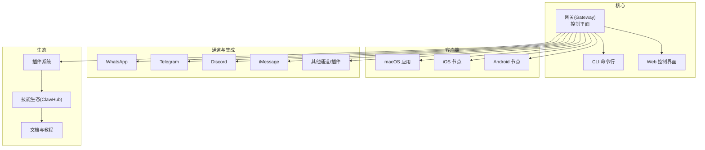
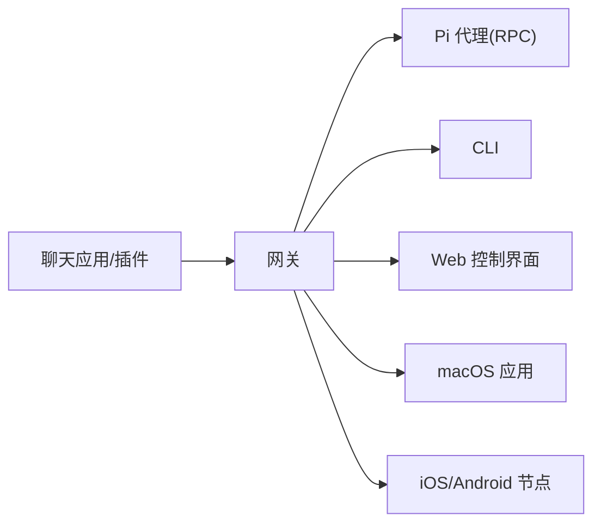
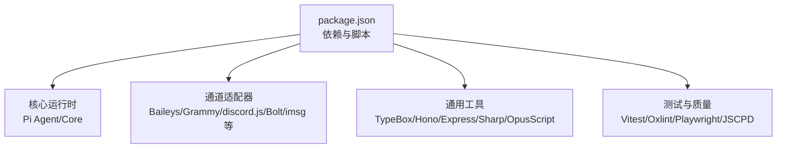

# 项目发展历程与社区

<cite>
**本文档引用的文件**
- [README.md](file://README.md)
- [VISION.md](file://VISION.md)
- [CONTRIBUTING.md](file://CONTRIBUTING.md)
- [SECURITY.md](file://SECURITY.md)
- [CHANGELOG.md](file://CHANGELOG.md)
- [package.json](file://package.json)
- [docs/index.md](file://docs/index.md)
- [docs/start/lore.md](file://docs/start/lore.md)
- [docs/reference/credits.md](file://docs/reference/credits.md)
- [scripts/update-clawtributors.ts](file://scripts/update-clawtributors.ts)
- [scripts/update-clawtributors.types.ts](file://scripts/update-clawtributors.types.ts)
- [scripts/openclaw-npm-release-check.ts](file://scripts/openclaw-npm-release-check.ts)
</cite>

## 目录

1. [引言](#引言)
2. [项目结构](#项目结构)
3. [核心组件](#核心组件)
4. [架构总览](#架构总览)
5. [详细组件分析](#详细组件分析)
6. [依赖关系分析](#依赖关系分析)
7. [性能考量](#性能考量)
8. [故障排除指南](#故障排除指南)
9. [结论](#结论)
10. [附录](#附录)

## 引言

本文件系统性梳理 OpenClaw 的项目发展历程、社区建设与治理实践，涵盖项目起源、演进脉络、开源理念、治理模式、贡献机制、版本发布策略、路线图与发展规划，并提供社区资源与支持方式，帮助用户更好地参与和贡献。

## 项目结构

OpenClaw 是一个以“个人 AI 助手”为核心定位的多通道网关项目，强调本地运行、隐私安全与跨平台设备协同。项目采用模块化组织，包含核心网关、CLI 工具、Web 控制界面、移动节点（iOS/Android）、桌面应用以及丰富的插件与技能生态。

图表来源

- [README.md:185-212](file://README.md#L185-L212)
- [docs/index.md:59-71](file://docs/index.md#L59-L71)

章节来源

- [README.md:185-212](file://README.md#L185-L212)
- [docs/index.md:59-71](file://docs/index.md#L59-L71)

## 核心组件

- 网关（Gateway）：单一路由与控制平面，承载会话、通道连接、工具与事件处理。
- CLI：命令行入口，提供向导、诊断、守护进程安装与远程访问等能力。
- Web 控制界面：浏览器仪表盘，用于聊天、配置与会话管理。
- 移动节点：iOS/Android 节点通过配对实现设备本地能力（相机、屏幕录制、通知等）。
- 插件与技能：扩展通道、工具与工作流；ClawHub 提供社区技能注册中心。
- 文档与教程：覆盖安装、配置、故障排查与深入技术细节。

章节来源

- [README.md:126-177](file://README.md#L126-L177)
- [docs/index.md:73-94](file://docs/index.md#L73-L94)

## 架构总览

OpenClaw 的核心是“网关控制平面”，所有消息通道、工具调用与事件均通过网关统一编排。网关与 CLI、Web 控制界面、桌面与移动端节点协同，形成“本地运行、跨端协作”的个人助手体系。

图表来源

- [README.md:185-212](file://README.md#L185-L212)
- [docs/index.md:59-71](file://docs/index.md#L59-L71)

章节来源

- [README.md:185-212](file://README.md#L185-L212)
- [docs/index.md:59-71](file://docs/index.md#L59-L71)

## 详细组件分析

### 项目起源与演进

- 名称演进：从 Warelay → Clawd → Moltbot → OpenClaw，最终在 2026 年 1 月完成“脱壳”式命名迁移，确立“OpenClaw = 开源 + 爪子”的品牌内核。
- 创始人与角色：Peter Steinberger（创作者/“龙虾语者”），Mario Zechner（Pi 创造者/安全渗透测试者），以及社区“空间龙虾”形象贯穿项目文化。
- 重要时刻：2026 年 1 月 27 日（首次脱壳）、1 月 30 日（最终定名迁移），期间伴随社区活动、品牌建设与安全加固。

章节来源

- [docs/start/lore.md:12-55](file://docs/start/lore.md#L12-L55)
- [docs/reference/credits.md:8-26](file://docs/reference/credits.md#L8-L26)

### 开源理念与安全默认

- 开源理念：MIT 许可证，社区驱动，强调本地运行、用户主权与开放生态。
- 安全默认：强默认安全策略，明确信任模型与边界，要求 operator 显式授权高风险路径。
- 信任模型：个人助理（单用户可信操作者）优先，不模拟多租户对抗场景；建议按用户/主机/OS 用户进行隔离部署。

章节来源

- [VISION.md:15-33](file://VISION.md#L15-L33)
- [SECURITY.md:88-152](file://SECURITY.md#L88-L152)

### 社区治理与贡献机制

- 维护者团队：由创始人与核心贡献者组成，负责代码审查、问题分类与方向把控。
- 贡献流程：先讨论（Issues 或 Discord），再提交 PR；保持“一议题一 PR”，避免大而无当的变更批次。
- 评审与 AI 协作：鼓励使用 AI 辅助编码，但需标注并确保可追溯性；机器人评审对话需作者自行跟进闭环。
- 社区支持：Discord 频道、GitHub Issues、文档与教程作为主要沟通与学习渠道。

章节来源

- [CONTRIBUTING.md:12-78](file://CONTRIBUTING.md#L12-L78)
- [CONTRIBUTING.md:79-106](file://CONTRIBUTING.md#L79-L106)
- [CONTRIBUTING.md:138-147](file://CONTRIBUTING.md#L138-L147)

### 版本发布策略与路线图

- 版本号与通道：稳定版（stable）、预发布版（beta）、开发头（dev）。版本号采用日期型语义，beta 包含递增序号。
- 发布检查：内置脚本校验版本格式与日期合法性，保障发布一致性。
- 当前优先级：稳定性修复、用户体验优化、技能生态与性能优化。

章节来源

- [README.md:83-91](file://README.md#L83-L91)
- [scripts/openclaw-npm-release-check.ts:54-114](file://scripts/openclaw-npm-release-check.ts#L54-L114)
- [CONTRIBUTING.md:138-147](file://CONTRIBUTING.md#L138-L147)

### 活跃度指标与社区规模

- Star 历史：通过 Star History 图表反映社区关注度趋势。
- 贡献者统计：自动化脚本抓取 GitHub 贡献者数据，生成 README 中的“爪contributor”徽章与榜单，综合提交、PR 与代码量计算复合评分。

章节来源

- [README.md:137-139](file://README.md#L137-L139)
- [scripts/update-clawtributors.ts:17-322](file://scripts/update-clawtributors.ts#L17-L322)
- [scripts/update-clawtributors.types.ts:1-36](file://scripts/update-clawtributors.types.ts#L1-L36)

### 用户群体与全球影响力

- 多语言与国际化：文档与 UI 支持多语言（如西班牙语），体现全球化社区参与。
- 全球分布：社区成员来自不同国家与时区，通过 Discord、GitHub Issues 等渠道协作。

章节来源

- [VISION.md:34-40](file://VISION.md#L34-L40)
- [docs/index.md:176-192](file://docs/index.md#L176-L192)

### 核心团队与维护者

- 创始人：Peter Steinberger（@steipete）
- 维护者：涵盖各子系统（Telegram、Discord、iOS/Android、macOS、安全、UI/UX、文档等）负责人
- 扩招机制：对有持续贡献与责任心的资深贡献者开放维护者申请通道

章节来源

- [CONTRIBUTING.md:12-78](file://CONTRIBUTING.md#L12-L78)
- [CONTRIBUTING.md:149-167](file://CONTRIBUTING.md#L149-L167)

### 技能生态与插件体系

- 插件 API：提供扩展通道、工具与能力的统一接口；核心保持精简，可选能力通常以插件形式提供。
- 技能生态：ClawHub 作为社区技能注册中心，新技能优先发布于 ClawHub，减少核心默认技能数量。
- MCP 支持：通过 mcporter 以桥接模型集成 MCP，降低对核心运行时的耦合。

章节来源

- [VISION.md:52-83](file://VISION.md#L52-L83)
- [README.md:264-270](file://README.md#L264-L270)

### 安全与合规

- 安全政策：明确漏洞上报流程、受理范围与“可验证性”门槛；强调边界绕过才构成漏洞。
- 信任模型与边界：清晰区分受信操作者、工具策略与沙箱边界；禁止将公开暴露作为安全基线。
- 运维建议：Node 版本要求、Docker 安全加固、检测工具使用等。

章节来源

- [SECURITY.md:5-46](file://SECURITY.md#L5-L46)
- [SECURITY.md:88-152](file://SECURITY.md#L88-L152)
- [SECURITY.md:246-288](file://SECURITY.md#L246-L288)

### 文档与教程

- 文档索引：提供“开始”“概念”“通道”“平台”“工具”“参考”等导航，便于按需检索。
- 教程与实战：从快速入门到深度技术解析，覆盖安装、配置、远程访问、故障排查等主题。

章节来源

- [docs/index.md:151-192](file://docs/index.md#L151-L192)

## 依赖关系分析

OpenClaw 通过 package.json 管理依赖与构建脚本，核心依赖包括：

- 通道适配器：WhatsApp（Baileys）、Telegram（Grammy）、Discord（discord.js）、Slack（Bolt）、iMessage（imsg）、IRC、Teams、Matrix、Feishu、LINE、Mattermost、Nextcloud Talk、Nostr、Synology Chat、Tlon、Twitch、Zalo 等。
- 运行时与工具：Pi 代理（Pi Agent Core/PI-AI）、类型系统（TypeBox）、网络框架（Hono/Express）、媒体处理（Sharp）、语音（OpusScript/Edge TTS）、定时任务（Croner）、SQLite 向量（sqlite-vec）等。
- 构建与测试：TypeScript、Vitest、Oxlint、Playwright、JSCPD 等。

图表来源

- [package.json:342-397](file://package.json#L342-L397)
- [package.json:398-419](file://package.json#L398-L419)

章节来源

- [package.json:342-419](file://package.json#L342-L419)

## 性能考量

- Token 使用优化与上下文压缩：通过压缩逻辑与模板引导，降低无效 token 消耗。
- 并发与队列：通道适配器与任务调度采用并发与队列模型，保证吞吐与响应。
- 本地执行与沙箱：工具执行默认在宿主上进行，可通过沙箱模式隔离非主会话，平衡安全与性能。
- 测试与基准：内置性能热点分析与预算检查脚本，辅助识别瓶颈。

章节来源

- [CONTRIBUTING.md:138-147](file://CONTRIBUTING.md#L138-L147)
- [SECURITY.md:207-244](file://SECURITY.md#L207-L244)

## 故障排除指南

- 常见问题：通道连接异常（如 WhatsApp/Telegram）、远程访问（SSH/Tailscale）、浏览器控制界面访问、权限与 TCC 设置等。
- 诊断工具：`openclaw doctor`、日志与健康检查、Webhook/轮询调试、邮件触发链路（Gmail Pub/Sub）等。
- 安全审计：通过安全审计命令与修复建议，识别潜在风险点并给出加固方案。

章节来源

- [README.md:442-450](file://README.md#L442-L450)
- [SECURITY.md:209-244](file://SECURITY.md#L209-L244)

## 结论

OpenClaw 以“本地运行、用户主权、跨端协作”为核心，通过严谨的安全默认、清晰的治理与贡献流程、完善的文档与生态体系，构建了可持续发展的开源项目。未来将持续优化稳定性、用户体验与性能，扩大通道与平台支持，深化技能生态与社区协作。

## 附录

### 社区资源与支持

- 官方网站与文档：https://openclaw.ai、https://docs.openclaw.ai
- 快速开始与向导：`openclaw onboard`、`openclaw wizard`
- 交流渠道：Discord（官方频道）、GitHub Discussions/Issues
- 技能生态：ClawHub（https://clawhub.ai）

章节来源

- [README.md:26-49](file://README.md#L26-L49)
- [CONTRIBUTING.md:7-11](file://CONTRIBUTING.md#L7-L11)

### 贡献者统计与榜单

- 自动化脚本抓取贡献者数据，生成 README 中的“爪contributor”徽章与榜单，综合评分包含提交、PR 与代码量，并考虑贡献时长权重。

章节来源

- [scripts/update-clawtributors.ts:17-322](file://scripts/update-clawtributors.ts#L17-L322)
- [scripts/update-clawtributors.types.ts:1-36](file://scripts/update-clawtributors.types.ts#L1-L36)
