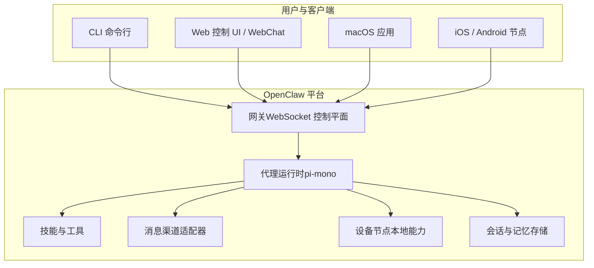
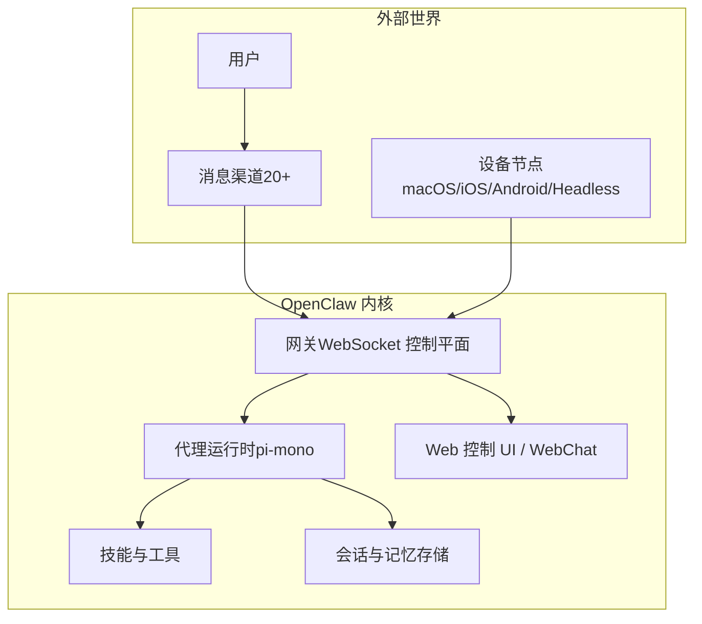
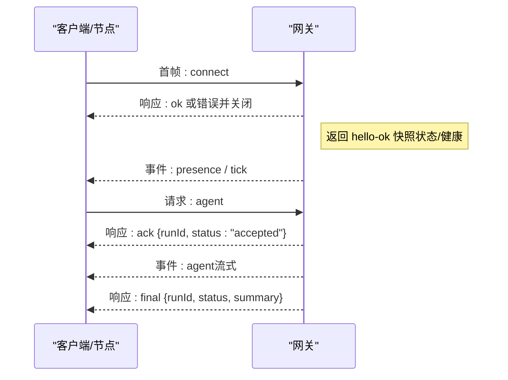
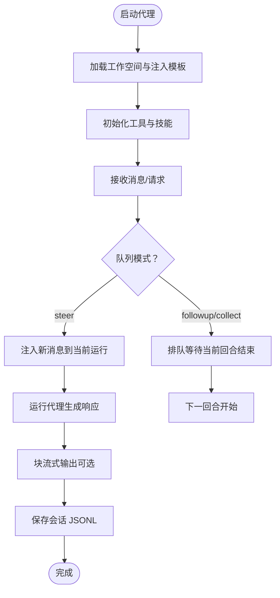
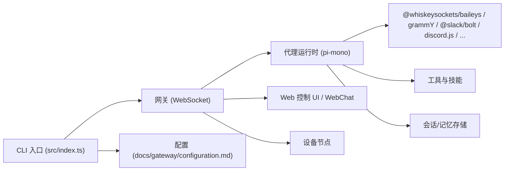

# 项目概述

<cite>
**本文档引用的文件**
- [README.md](file://README.md)
- [VISION.md](file://VISION.md)
- [CONTRIBUTING.md](file://CONTRIBUTING.md)
- [src/index.ts](file://src/index.ts)
- [package.json](file://package.json)
- [docs/concepts/architecture.md](file://docs/concepts/architecture.md)
- [docs/concepts/agent.md](file://docs/concepts/agent.md)
- [docs/gateway/configuration.md](file://docs/gateway/configuration.md)
- [docs/channels/index.md](file://docs/channels/index.md)
- [docs/platforms/index.md](file://docs/platforms/index.md)
- [docs/tools/skills.md](file://docs/tools/skills.md)
- [docs/web/index.md](file://docs/web/index.md)
- [docs/install/index.md](file://docs/install/index.md)
- [docs/security/README.md](file://docs/security/README.md)
- [docs/nodes/index.md](file://docs/nodes/index.md)
- [docs/providers/index.md](file://docs/providers/index.md)
- [docs/automations/index.md](file://docs/automations/index.md)
- [docs/reference/AGENTS.default.md](file://docs/reference/AGENTS.default.md)
- [docs/reference/templates/AGENTS.md](file://docs/reference/templates/AGENTS.md)
- [docs/reference/templates/BOOTSTRAP.md](file://docs/reference/templates/BOOTSTRAP.md)
- [docs/reference/templates/IDENTITY.md](file://docs/reference/templates/IDENTITY.md)
- [docs/reference/templates/SOUL.md](file://docs/reference/templates/SOUL.md)
- [docs/reference/templates/TOOLS.md](file://docs/reference/templates/TOOLS.md)
- [docs/reference/templates/USER.md](file://docs/reference/templates/USER.md)
</cite>

## 目录

1. [引言](#引言)
2. [项目结构](#项目结构)
3. [核心组件](#核心组件)
4. [架构总览](#架构总览)
5. [详细组件分析](#详细组件分析)
6. [依赖关系分析](#依赖关系分析)
7. [性能考量](#性能考量)
8. [故障排查指南](#故障排查指南)
9. [结论](#结论)
10. [附录](#附录)

## 引言

OpenClaw 是一个在您自己的设备上运行的个人 AI 助手平台，旨在提供“本地化、即时、始终在线”的体验。它通过统一的网关（Gateway）控制平面连接多种消息渠道（如 WhatsApp、Telegram、Slack、Discord、Google Chat、Signal、iMessage、BlueBubbles、IRC、Microsoft Teams、Matrix、飞书、LINE、Mattermost、Nextcloud Talk、Nostr、Synology Chat、Tlon、Twitch、Zalo、Zalo Personal、WebChat 等），并支持在 macOS/iOS/Android 上进行语音唤醒与对话，以及在 macOS 上提供可交互的 Live Canvas 工作区。

OpenClaw 的核心价值主张包括：

- 本地化运行：所有处理在您的设备或受信任的远程主机上完成，降低隐私与安全风险。
- 多渠道聚合：统一接入主流 IM 渠道，实现跨平台消息聚合与回复。
- 本地 AI 代理：内置基于 pi-mono 的代理运行时，支持工具调用、会话管理与技能扩展。
- 跨平台设备节点控制：通过 WebSocket 连接的设备节点（macOS/iOS/Android/Headless）执行本地命令、摄像头、屏幕录制、位置获取等操作。
- 安全优先：默认安全策略与可配置的沙箱机制，确保高风险路径显式可控。

## 项目结构

OpenClaw 采用模块化与多语言混合的工程组织方式：

- 核心 CLI 入口与运行时：位于 src/index.ts，负责加载环境变量、运行时校验、构建 CLI 程序并处理未捕获异常。
- 网关与协议：docs/concepts/architecture.md 描述了基于 WebSocket 的单点控制平面，客户端（macOS 应用、CLI、Web UI、自动化）与节点（设备）均通过该网关进行通信。
- 通道集成：docs/channels/index.md 提供了对 20+ 消息渠道的接入说明与配置要点。
- 平台与应用：docs/platforms/index.md 涵盖 macOS、iOS、Android、Windows、Linux 等平台的配套应用与运行指南。
- 工具与技能：docs/tools/skills.md 介绍技能注册表（ClawHub）与技能体系；docs/reference/templates 下提供 AGENTS、SOUL、TOOLS、BOOTSTRAP、IDENTITY、USER 等模板文件，用于定义代理人格、工作空间与注入提示。
- 配置参考：docs/gateway/configuration.md 提供完整的配置键值与示例，涵盖模型、通道、安全、沙箱、节点等。
- 安全与合规：docs/security/README.md 提供安全模型与最佳实践。
- Web 表面：docs/web/index.md 说明控制 UI 与 WebChat 的部署与访问方式。
- 安装与升级：docs/install/index.md 提供多平台安装与升级指南。

**图表来源**

- [docs/concepts/architecture.md:12-26](file://docs/concepts/architecture.md#L12-L26)
- [docs/concepts/agent.md:10-18](file://docs/concepts/agent.md#L10-L18)
- [docs/gateway/configuration.md](file://docs/gateway/configuration.md)

**章节来源**

- [README.md:21-31](file://README.md#L21-L31)
- [docs/concepts/architecture.md:12-26](file://docs/concepts/architecture.md#L12-L26)
- [docs/platforms/index.md](file://docs/platforms/index.md)

## 核心组件

- 网关（Gateway）
  - 单一长连接的 WebSocket 控制平面，负责维护各消息提供商连接、暴露类型化请求/事件接口、分发会话与事件、提供 Canvas 主机服务。
  - 支持设备配对、鉴权令牌、事件去重与幂等键、节点角色声明与权限映射。
- 代理运行时（Agent Runtime）
  - 基于 pi-mono 的嵌入式代理运行时，使用工作空间目录作为唯一工作目录，注入 AGENTS/SOUL/TOOLS 等模板文件，支持工具调用、会话管理与技能扩展。
- 消息渠道（Channels）
  - 支持 20+ 渠道，通过各自 SDK 或 API 接入，统一路由到网关，再由代理处理与回复。
- 设备节点（Nodes）
  - 通过 WebSocket 连接，声明角色与能力，执行本地命令、摄像头、屏幕录制、通知、位置获取等操作。
- 技能与工具（Skills & Tools）
  - 技能注册表（ClawHub）与本地/工作空间技能，结合浏览器控制、Canvas、Cron、会话工具等，形成强大的自动化与计算机使用能力。
- 配置与安全（Configuration & Security）
  - 通过配置文件与环境变量控制模型、通道、沙箱、安全策略；默认安全策略与可选沙箱隔离非主会话，提升安全性。

**章节来源**

- [docs/concepts/architecture.md:27-48](file://docs/concepts/architecture.md#L27-L48)
- [docs/concepts/agent.md:12-42](file://docs/concepts/agent.md#L12-L42)
- [docs/channels/index.md](file://docs/channels/index.md)
- [docs/nodes/index.md](file://docs/nodes/index.md)
- [docs/tools/skills.md](file://docs/tools/skills.md)
- [docs/gateway/configuration.md](file://docs/gateway/configuration.md)

## 架构总览

OpenClaw 的整体架构以“网关控制平面 + 代理运行时 + 多渠道适配 + 设备节点”为核心，形成统一的消息入口、智能决策与本地执行闭环。

**图表来源**

- [docs/concepts/architecture.md:12-26](file://docs/concepts/architecture.md#L12-L26)
- [docs/concepts/agent.md:10-18](file://docs/concepts/agent.md#L10-L18)
- [docs/web/index.md](file://docs/web/index.md)

**章节来源**

- [docs/concepts/architecture.md:12-26](file://docs/concepts/architecture.md#L12-L26)
- [docs/concepts/agent.md:10-18](file://docs/concepts/agent.md#L10-L18)

## 详细组件分析

### 组件 A：网关与协议（WebSocket 控制平面）

- 角色与职责
  - 维护各消息提供商连接，暴露类型化请求/响应与事件推送。
  - 严格握手流程（必须首帧 connect）、鉴权令牌、设备配对与签名验证。
  - 事件流包含 agent/chat/presence/health/heartbeat/cron 等。
- 连接生命周期
  - 客户端/节点连接后，网关返回 hello-ok 快照（包含状态与健康信息），随后持续推送事件。
  - 请求采用 {type:"req", id, method, params} 形式，响应为 {type:"res"}，事件为 {type:"event"}。
- 远程访问
  - 推荐 Tailscale/VPN；也可通过 SSH 隧道访问；支持可选 TLS 与证书固定。

**图表来源**

- [docs/concepts/architecture.md:59-78](file://docs/concepts/architecture.md#L59-L78)

**章节来源**

- [docs/concepts/architecture.md:27-48](file://docs/concepts/architecture.md#L27-L48)
- [docs/concepts/architecture.md:80-92](file://docs/concepts/architecture.md#L80-L92)
- [docs/concepts/architecture.md:117-128](file://docs/concepts/architecture.md#L117-L128)

### 组件 B：代理运行时与工作空间（pi-mono 集成）

- 工作空间
  - 使用单一工作空间目录作为代理 cwd，注入 AGENTS/SOUL/TOOLS/BOOTSTRAP/IDENTITY/USER 等模板文件。
  - 支持沙箱模式下按会话覆盖工作空间根目录。
- 技能与工具
  - 技能来源：内建、托管/本地 ~/.openclaw/skills、工作空间 skills 目录；可通过配置/环境变量启用/禁用。
  - 内置工具始终可用（受工具策略约束），如 apply_patch 受 gated 工具策略控制。
- 会话与流式
  - 会话转录以 JSONL 存储；队列模式支持 steer/followup/collect；块流式输出可配置边界与合并策略。

**图表来源**

- [docs/concepts/agent.md:73-104](file://docs/concepts/agent.md#L73-L104)

**章节来源**

- [docs/concepts/agent.md:12-42](file://docs/concepts/agent.md#L12-L42)
- [docs/concepts/agent.md:56-65](file://docs/concepts/agent.md#L56-L65)
- [docs/concepts/agent.md:73-104](file://docs/concepts/agent.md#L73-L104)
- [docs/reference/templates/AGENTS.md](file://docs/reference/templates/AGENTS.md)
- [docs/reference/templates/SOUL.md](file://docs/reference/templates/SOUL.md)
- [docs/reference/templates/TOOLS.md](file://docs/reference/templates/TOOLS.md)
- [docs/reference/templates/BOOTSTRAP.md](file://docs/reference/templates/BOOTSTRAP.md)
- [docs/reference/templates/IDENTITY.md](file://docs/reference/templates/IDENTITY.md)
- [docs/reference/templates/USER.md](file://docs/reference/templates/USER.md)

### 组件 C：消息渠道与多平台接入

- 渠道覆盖
  - 支持 WhatsApp、Telegram、Slack、Discord、Google Chat、Signal、iMessage（BlueBubbles/iMessage）、IRC、Microsoft Teams、Matrix、飞书、LINE、Mattermost、Nextcloud Talk、Nostr、Synology Chat、Tlon、Twitch、Zalo、Zalo Personal、WebChat 等。
- 配置与安全
  - 各渠道需设置相应凭据与允许列表；默认 DM 策略为“配对”，未知发送方需经配对批准；可切换为“开放”并显式允许名单。
- 分组路由
  - 支持提及门控、回复标签、按渠道分块与路由规则。

**章节来源**

- [docs/channels/index.md](file://docs/channels/index.md)
- [README.md:126-136](file://README.md#L126-L136)

### 组件 D：设备节点与本地能力

- 节点角色
  - 通过 WebSocket 连接并声明 role=node，提供设备身份与能力清单（如 canvas._、camera._、screen.record、location.get）。
- 权限与安全
  - macOS TCC 权限与 Elevated 访问（需白名单与会话级开关）；节点调用通过 node.invoke 执行。
- 能力范围
  - macOS：system.run/system.notify、Canvas、Camera、Screen Record、Location 获取。
  - iOS/Android：Canvas、Voice Wake、Talk Mode、相机/屏幕录制、设备命令族（通知/位置/SMS/联系人/日历/运动/应用更新）。

**章节来源**

- [docs/concepts/architecture.md:42-48](file://docs/concepts/architecture.md#L42-L48)
- [README.md:240-254](file://README.md#L240-L254)
- [docs/nodes/index.md](file://docs/nodes/index.md)

### 组件 E：Web 控制 UI 与远程访问

- Web 表面
  - 控制 UI 与 WebChat 由网关 HTTP 服务器提供，使用同一端口（默认 18789）。
- 远程访问
  - Tailscale Serve/Funnel（尾网/公网）或 SSH 隧道；可强制密码认证与尾网身份头。
- 安全建议
  - Serve 默认绑定 loopback；Funnel 需要密码认证；可选择性重置退出时的 Serve/Funnel。

**章节来源**

- [docs/web/index.md](file://docs/web/index.md)
- [README.md:213-229](file://README.md#L213-L229)

### 组件 F：安装与升级（多平台）

- 运行时要求
  - Node ≥22；推荐使用 npm/pnpm/bun。
- 安装方式
  - 全局安装 openclaw 包；通过 openclaw onboard 安装网关守护进程；或从源码构建（pnpm install && pnpm build）。
- 升级与诊断
  - 支持稳定/测试/开发通道切换；提供 doctor 命令进行健康检查与配置诊断。

**章节来源**

- [README.md:50-91](file://README.md#L50-L91)
- [README.md:92-111](file://README.md#L92-L111)
- [docs/install/index.md](file://docs/install/index.md)

## 依赖关系分析

OpenClaw 的依赖关系围绕“CLI 入口 → 网关 → 代理运行时 → 渠道适配器/工具/技能 → 存储/节点”的链路展开。核心依赖包括：

- 网关与协议：WebSocket、JSON Schema 校验、TypeBox 类型定义。
- 渠道适配器：各平台 SDK（如 @whiskeysockets/baileys、grammy、@slack/bolt、discord.js 等）。
- 代理运行时：pi-mono 生态（@mariozechner/pi-\*）。
- 工具与 UI：Hono、Express、Playwright、Lit、Markdown-it 等。
- 安全与网络：Tailscale、HTTPS 代理、IP 地址解析、Bonjour/mDNS。

**图表来源**

- [src/index.ts:1-94](file://src/index.ts#L1-L94)
- [package.json:342-397](file://package.json#L342-L397)
- [docs/concepts/architecture.md:12-26](file://docs/concepts/architecture.md#L12-L26)

**章节来源**

- [src/index.ts:1-94](file://src/index.ts#L1-L94)
- [package.json:342-397](file://package.json#L342-L397)

## 性能考量

- 会话压缩与上下文管理
  - 支持会话压缩与摘要，减少上下文长度，提高响应效率。
- 流式与块流式输出
  - 块流式输出可配置边界与合并策略，减少细粒度消息带来的网络与 UI 压力。
- 队列模式
  - steer/followup/collect 三种模式影响消息注入时机与并发处理，合理选择可平衡实时性与稳定性。
- 沙箱与隔离
  - 对非主会话启用沙箱，限制工具集与资源访问，避免高风险操作影响主会话性能与安全。

**章节来源**

- [docs/concepts/agent.md:82-104](file://docs/concepts/agent.md#L82-L104)
- [docs/concepts/session-pruning.md](file://docs/concepts/session-pruning.md)
- [docs/gateway/configuration.md](file://docs/gateway/configuration.md)

## 故障排查指南

- 健康检查与诊断
  - 使用 openclaw doctor 进行配置与安全诊断；检查端口占用、环境变量、模型提供者连通性。
- 渠道问题
  - 按渠道文档检查凭据、允许列表、Webhook/轮询配置；关注 DM 策略与配对状态。
- 远程访问
  - 确认 Tailscale/SSH 隧道配置正确；若使用 Funnel，需设置密码认证；Serve/Funnel 仅在 loopback 绑定下启用。
- 安全与权限
  - macOS 节点需遵循 TCC 权限；Elevated 访问需白名单与会话级开关；默认 DM 策略为“配对”，未知发送方需批准。

**章节来源**

- [README.md:442-449](file://README.md#L442-L449)
- [docs/channels/troubleshooting.md](file://docs/channels/troubleshooting.md)
- [docs/gateway/remote.md](file://docs/gateway/remote.md)
- [docs/gateway/security.md](file://docs/gateway/security.md)

## 结论

OpenClaw 将“本地化、多渠道聚合、本地代理运行、跨平台设备节点控制”有机结合，形成一套可扩展、可审计、可远程的安全 AI 助手平台。通过统一的网关控制平面与嵌入式代理运行时，OpenClaw 在保障隐私与安全的前提下，提供了强大的自动化与计算机使用能力，并持续演进于多平台生态与技能体系。

## 附录

- 发展历程与愿景
  - 项目起源于个人学习与实用需求，经历了 Warelay → Clawdbot → Moltbot → OpenClaw 的演进；愿景强调“做真正能做事的 AI”，尊重隐私与安全。
- 社区与贡献
  - 鼓励讨论先行、小步快跑、聚焦单一议题；欢迎 AI 辅助 PR，但需保持透明与自审。
- 技术栈概览
  - 运行时：Node ≥22；包管理：pnpm；构建：TypeScript + tsdown；测试：Vitest；UI：Lit + Hono；渠道 SDK：多平台官方 SDK；安全：Tailscale/SSH/TLS；存储：SQLite/JSONL；插件：npm 包 + 本地扩展加载。
- 系统边界
  - 网关为控制平面边界，所有消息通道与设备节点均通过网关接入；Web 表面与 Canvas 主机由网关 HTTP 服务提供；远程访问通过隧道或尾网服务暴露。

**章节来源**

- [VISION.md:11-13](file://VISION.md#L11-L13)
- [VISION.md:17-33](file://VISION.md#L17-L33)
- [CONTRIBUTING.md:79-95](file://CONTRIBUTING.md#L79-L95)
- [README.md:212-239](file://README.md#L212-L239)
- [package.json:342-397](file://package.json#L342-L397)
