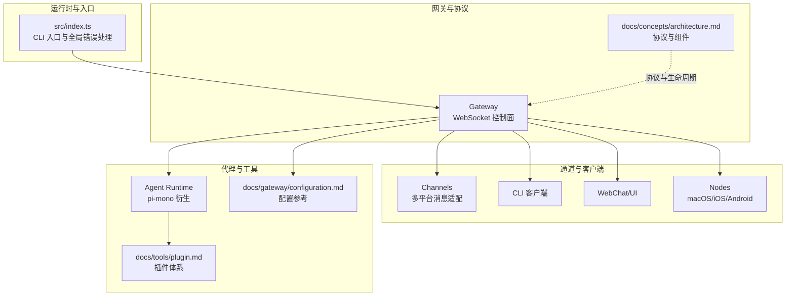
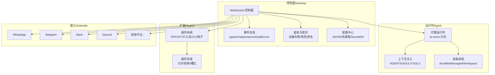
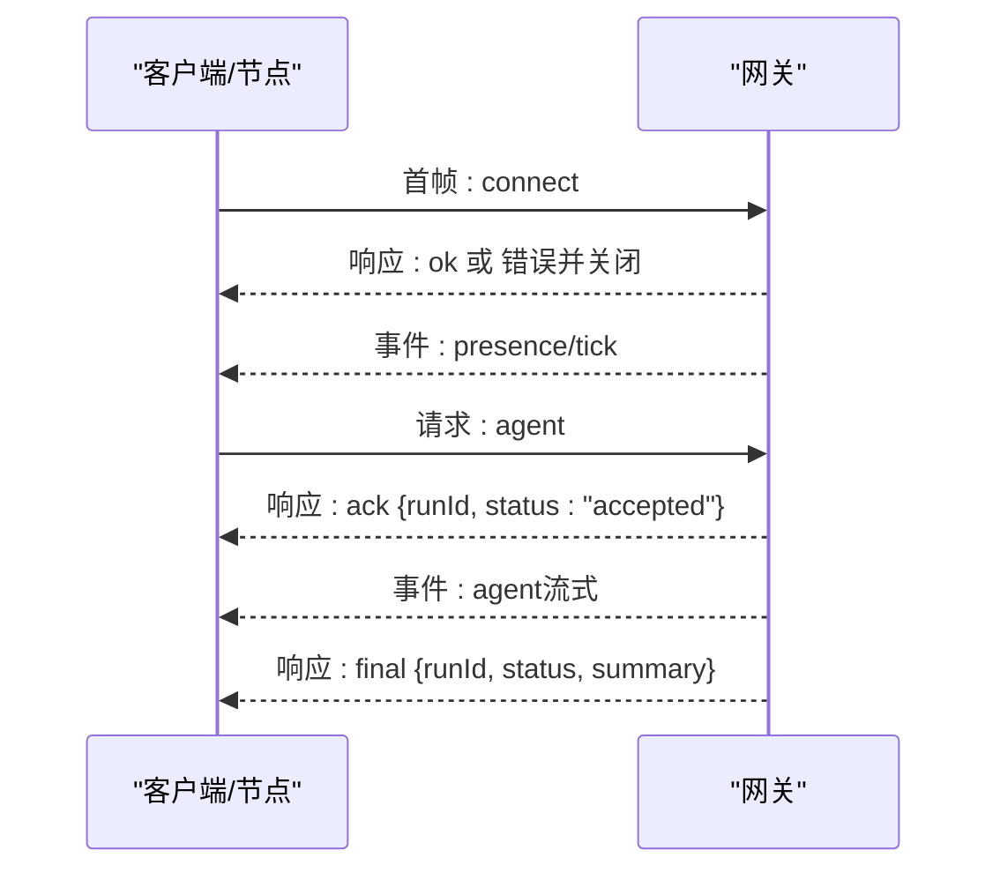
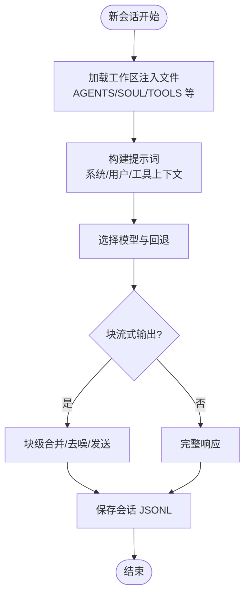
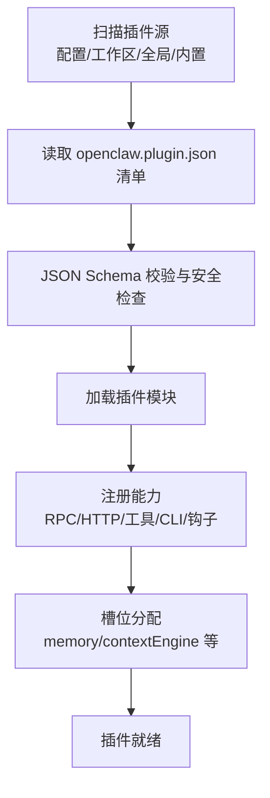
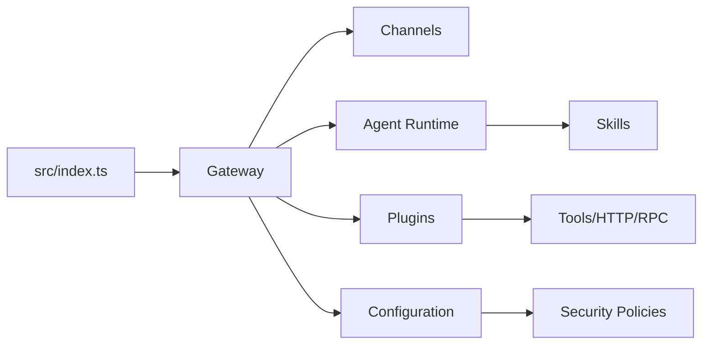

# 项目概述

<cite>
**本文引用的文件**
- [README.md](file://README.md)
- [VISION.md](file://VISION.md)
- [CONTRIBUTING.md](file://CONTRIBUTING.md)
- [SECURITY.md](file://SECURITY.md)
- [src/index.ts](file://src/index.ts)
- [docs/concepts/architecture.md](file://docs/concepts/architecture.md)
- [docs/gateway/configuration.md](file://docs/gateway/configuration.md)
- [docs/concepts/agent.md](file://docs/concepts/agent.md)
- [docs/tools/plugin.md](file://docs/tools/plugin.md)
</cite>

## 目录

1. [引言](#引言)
2. [项目结构](#项目结构)
3. [核心组件](#核心组件)
4. [架构总览](#架构总览)
5. [详细组件分析](#详细组件分析)
6. [依赖关系分析](#依赖关系分析)
7. [性能考量](#性能考量)
8. [故障排查指南](#故障排查指南)
9. [结论](#结论)
10. [附录](#附录)

## 引言

OpenClaw 是一个“个人 AI 助手”，可在你的设备上本地运行，统一接入你已有的消息渠道（如 WhatsApp、Telegram、Slack、Discord、Google Chat、Signal、iMessage、BlueBubbles、IRC、Microsoft Teams、Matrix、飞书、LINE、Mattermost、Nextcloud Talk、Nostr、Synology Chat、Tlon、Twitch、Zalo、WebChat 等），支持语音唤醒与对话、实时 Canvas 可视化工作区，并通过“网关（Gateway）”这一控制平面连接所有客户端、工具与事件。它强调本地优先、隐私与安全，默认安全策略明确且可配置，适合单用户、始终在线的个人助理场景。

- 核心价值主张
  - 本地运行：数据与执行均在你的主机或受信任节点上进行，降低外泄风险。
  - 多平台消息集成：覆盖主流 IM 与企业协作平台，统一入口管理。
  - AI 代理引擎：基于嵌入式 pi-mono 的代理运行时，结合会话、工具与技能生态。
  - 插件与扩展：以插件为中心的可扩展能力，核心保持精简，能力以插件形式加载。
  - 安全沙箱：对非主会话（群组/频道）默认可启用 Docker 沙箱隔离，限制工具与执行范围。

- 目标用户
  - 注重隐私与可控性的个人用户
  - 需要跨平台消息统一入口的开发者与技术用户
  - 希望在本地或私有网络内部署与扩展的团队或组织

- 应用场景
  - 个人助理：日程、信息查询、自动化任务、媒体理解与可视化
  - 开发者助手：代码补全、构建与测试、系统命令执行、浏览器与 Canvas 协作
  - 团队协作：在 Slack/Discord 等平台上的自动化与知识检索

**章节来源**

- [README.md:1-560](file://README.md#L1-L560)
- [VISION.md:1-111](file://VISION.md#L1-L111)

## 项目结构

OpenClaw 采用模块化与分层设计：

- CLI 入口与程序构建：入口脚本负责环境初始化、运行时校验、错误处理与命令解析。
- 网关（Gateway）：WebSocket 控制面，承载会话、通道、工具、事件与远程访问。
- 通道（Channels）：对多种消息平台的适配器与路由。
- 工具（Tools）：浏览器控制、Canvas、节点（macOS/iOS/Android）、定时任务、钩子等。
- 插件（Plugins）：扩展能力的载体，涵盖模型认证、消息通道、上下文引擎、HTTP 路由等。
- 配置（Configuration）：JSON5 配置驱动，严格模式下未知键将导致启动失败。
- 文档与指南：概念性文档（架构、代理、插件）、操作指南（安装、配置、安全）与 CLI 参考。

**图示来源**

- [src/index.ts:1-94](file://src/index.ts#L1-L94)
- [docs/concepts/architecture.md:1-140](file://docs/concepts/architecture.md#L1-L140)
- [docs/gateway/configuration.md:1-547](file://docs/gateway/configuration.md#L1-L547)
- [docs/tools/plugin.md:1-963](file://docs/tools/plugin.md#L1-L963)

**章节来源**

- [src/index.ts:1-94](file://src/index.ts#L1-L94)
- [docs/concepts/architecture.md:1-140](file://docs/concepts/architecture.md#L1-L140)
- [docs/gateway/configuration.md:1-547](file://docs/gateway/configuration.md#L1-L547)
- [docs/tools/plugin.md:1-963](file://docs/tools/plugin.md#L1-L963)

## 核心组件

- 网关（Gateway）
  - 单一长连接的 WebSocket 控制面，负责维护各消息提供商连接、事件推送、请求响应与配对鉴权。
  - 支持本地回环绑定与远程安全暴露（SSH 隧道、Tailscale）。
  - 提供健康检查、心跳、钩子、定时任务、会话管理等能力。
- 代理运行时（Agent Runtime）
  - 嵌入式 pi-mono 派生，使用工作区注入文件（AGENTS.md、SOUL.md、TOOLS.md 等）作为上下文引导。
  - 支持会话持久化、队列模式、块流式输出、模型选择与回退。
- 通道（Channels）
  - 对 WhatsApp、Telegram、Slack、Discord、Signal、iMessage、WebChat 等平台的适配与路由。
  - 支持 DM 策略（配对、白名单、开放、禁用）与群组提及门控。
- 工具与自动化
  - 浏览器控制、Canvas、节点（摄像头、屏幕录制、位置获取、通知）、Cron 与 Webhook、钩子。
- 插件（Plugins）
  - 扩展 RPC 方法、HTTP 路由、Agent 工具、CLI 命令、背景服务、上下文引擎、技能与自动回复。
  - 支持包安装、本地开发加载、槽位（Exclusive Slots）选择（如内存插件）。
- 配置（Configuration）
  - JSON5 配置文件，严格校验；支持热重载、环境变量注入、SecretRef 凭证引用、多文件 include。
  - 支持多代理路由、会话作用域、心跳、钩子、沙箱等高级设置。

**章节来源**

- [docs/concepts/architecture.md:1-140](file://docs/concepts/architecture.md#L1-L140)
- [docs/concepts/agent.md:1-124](file://docs/concepts/agent.md#L1-L124)
- [docs/gateway/configuration.md:1-547](file://docs/gateway/configuration.md#L1-L547)
- [docs/tools/plugin.md:1-963](file://docs/tools/plugin.md#L1-L963)

## 架构总览

OpenClaw 的核心是“网关 + 代理 + 插件 + 通道”的组合。网关作为控制平面，统一承载会话、事件、工具与远程访问；代理在网关内运行，按配置与会话上下文调用工具与技能；通道将外部消息平台接入到网关；插件扩展能力边界，既可内置也可外部加载。

**图示来源**

- [docs/concepts/architecture.md:1-140](file://docs/concepts/architecture.md#L1-L140)
- [docs/concepts/agent.md:1-124](file://docs/concepts/agent.md#L1-L124)
- [docs/tools/plugin.md:1-963](file://docs/tools/plugin.md#L1-L963)

## 详细组件分析

### 组件 A：网关（Gateway）与协议

- 连接生命周期：客户端/节点通过 WebSocket 连接，首帧必须为 connect，握手后支持请求/响应与事件推送。
- 鉴权与配对：支持设备身份、挑战签名、设备令牌与本地/远程批准流程。
- 事件与状态：提供 presence、tick、agent、chat、health、heartbeat、cron 等事件。
- 远程访问：推荐 Tailscale 或 SSH 隧道，支持 WS TLS 与凭据校验。

**图示来源**

- [docs/concepts/architecture.md:59-78](file://docs/concepts/architecture.md#L59-L78)

**章节来源**

- [docs/concepts/architecture.md:1-140](file://docs/concepts/architecture.md#L1-L140)

### 组件 B：代理运行时（Agent Runtime）

- 工作区：单一工作区目录作为工具与上下文的 cwd，注入 AGENTS/SOUL/TOOLS 等文件。
- 会话：会话转录存储于 JSONL 文件，ID 稳定；支持队列模式与块流式输出。
- 模型：支持模型别名与回退，模型引用解析遵循“提供商标识/模型标识”格式。
- 技能：从 Bundled/Managed/Workspace 三层加载，可受配置/环境约束。

**图示来源**

- [docs/concepts/agent.md:24-104](file://docs/concepts/agent.md#L24-L104)

**章节来源**

- [docs/concepts/agent.md:1-124](file://docs/concepts/agent.md#L1-L124)

### 组件 C：插件（Plugins）与扩展生态

- 发现与加载：按配置路径、工作区扩展、全局扩展、内置扩展顺序扫描，支持包打包与清单元数据。
- 安全与信任：插件以进程内方式运行，被视为可信代码；支持允许/拒绝列表、槽位独占（如 memory）。
- 能力注册：RPC 方法、HTTP 路由、Agent 工具、CLI 命令、背景服务、上下文引擎、技能与自动回复。
- 配置与热更新：插件配置变更需重启网关；支持 UI Schema 与标签增强。

**图示来源**

- [docs/tools/plugin.md:228-304](file://docs/tools/plugin.md#L228-L304)
- [docs/tools/plugin.md:357-426](file://docs/tools/plugin.md#L357-L426)

**章节来源**

- [docs/tools/plugin.md:1-963](file://docs/tools/plugin.md#L1-L963)

### 组件 D：通道（Channels）与消息路由

- 平台覆盖：WhatsApp、Telegram、Slack、Discord、Google Chat、Signal、iMessage、BlueBubbles、IRC、Microsoft Teams、Matrix、飞书、LINE、Mattermost、Nextcloud Talk、Nostr、Synology Chat、Tlon、Twitch、Zalo、WebChat 等。
- DM 策略：配对（pairing）、白名单（allowlist）、开放（open）、禁用（disabled）四种模式。
- 群组门控：支持 @提及与文本模式正则，可按代理与通道分别配置。
- 组织路由：支持按通道/账号/群组将消息路由到不同代理实例，实现隔离与权限控制。

**章节来源**

- [README.md:145-154](file://README.md#L145-L154)
- [docs/gateway/configuration.md:74-323](file://docs/gateway/configuration.md#L74-L323)

### 组件 E：工具与自动化

- 浏览器控制：专用 Chrome/Chromium 实例，支持快照、动作与上传。
- Canvas：A2UI 主机，支持 agent 可编辑的 HTML/CSS/JS 与评估。
- 节点能力：macOS/iOS/Android 节点提供摄像头、屏幕录制、位置获取、通知等本地能力。
- Cron 与 Webhook：周期任务与外部触发器，支持安全策略与内容过滤。
- 钩子（Hooks）：HTTP 入口映射，支持 Gmail Pub/Sub 等。

**章节来源**

- [README.md:163-176](file://README.md#L163-L176)
- [docs/gateway/configuration.md:249-301](file://docs/gateway/configuration.md#L249-L301)

## 依赖关系分析

- 入口与运行时
  - CLI 入口负责环境准备、运行时版本校验、未捕获异常与拒绝处理，随后构建并解析命令行程序。
- 网关与通道
  - 网关通过通道适配器连接各消息平台，通道配置与策略由配置中心统一管理。
- 代理与插件
  - 代理运行时依赖工作区注入文件与技能系统；插件扩展工具与能力，二者共同决定代理可执行的任务范围。
- 安全与信任
  - 网关鉴权与配对、节点权限、插件信任边界、临时目录与沙箱策略共同构成安全基线。

**图示来源**

- [src/index.ts:1-94](file://src/index.ts#L1-L94)
- [docs/gateway/configuration.md:1-547](file://docs/gateway/configuration.md#L1-L547)
- [SECURITY.md:1-288](file://SECURITY.md#L1-L288)

**章节来源**

- [src/index.ts:1-94](file://src/index.ts#L1-L94)
- [docs/gateway/configuration.md:1-547](file://docs/gateway/configuration.md#L1-L547)
- [SECURITY.md:1-288](file://SECURITY.md#L1-L288)

## 性能考量

- 会话与上下文压缩：通过会话修剪、上下文组装与压缩策略减少 token 使用，提升成本与延迟表现。
- 块流式输出：在支持的通道启用块流式输出，减少首字节延迟并改善用户体验。
- 沙箱与资源隔离：对非主会话启用 Docker 沙箱，避免高风险工具对宿主造成影响。
- 配置热重载：大部分配置变更无需重启即可生效，关键项（如网关服务器）在混合模式下自动重启。
- 运行时要求：建议使用 Node.js LTS 版本，确保安全补丁与性能优化。

[本节为通用指导，不直接分析具体文件]

## 故障排查指南

- 启动失败与严格校验
  - 若配置中存在未知键或类型不匹配，网关将拒绝启动；可通过诊断命令查看问题并修复。
- 安全审计与建议
  - 使用安全审计命令识别潜在风险配置（如公开暴露、弱权限、插件信任边界等），并按建议调整。
- 远程访问与鉴权
  - 推荐通过 SSH 隧道或 Tailscale 访问网关，避免直接对外暴露；确保鉴权与 TLS 设置正确。
- 插件与扩展
  - 插件加载失败通常与清单校验、路径安全检查或依赖安装有关；检查插件清单与允许列表，必要时重启网关。

**章节来源**

- [docs/gateway/configuration.md:61-73](file://docs/gateway/configuration.md#L61-L73)
- [SECURITY.md:207-244](file://SECURITY.md#L207-L244)

## 结论

OpenClaw 将“本地、统一、安全、可扩展”作为核心设计原则，通过网关控制面、嵌入式代理运行时、丰富的通道与工具生态以及灵活的插件体系，为个人与团队提供了强大而可控的 AI 助手平台。其安全模型与默认策略在保证能力的同时，将高风险路径显式化并交由操作者控制，适合对隐私与可控性有较高要求的用户与场景。

[本节为总结性内容，不直接分析具体文件]

## 附录

- 设计理念与路线图
  - 优先安全与稳定、Setup 可靠性与首次体验；逐步完善模型供应商支持、消息通道覆盖、性能与测试基础设施、计算机使用与代理能力、CLI 与 Web 前端的人体工程学、以及 macOS/iOS/Android/Linux/Windows 的配套应用。
- 贡献与社区
  - 欢迎各类贡献，PR 应聚焦单一议题；大型 PR 需要审慎评估；社区通过讨论区与 Discord 协同推进。

**章节来源**

- [VISION.md:17-33](file://VISION.md#L17-L33)
- [CONTRIBUTING.md:79-147](file://CONTRIBUTING.md#L79-L147)
