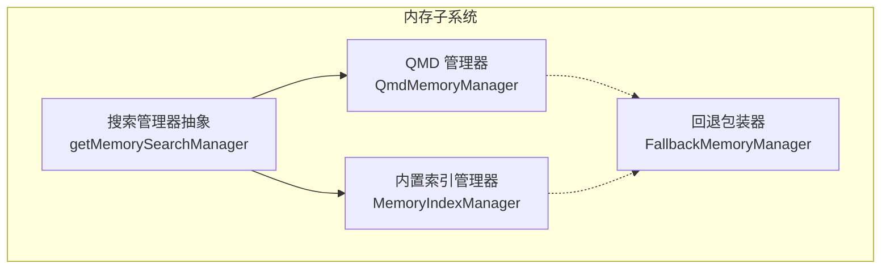
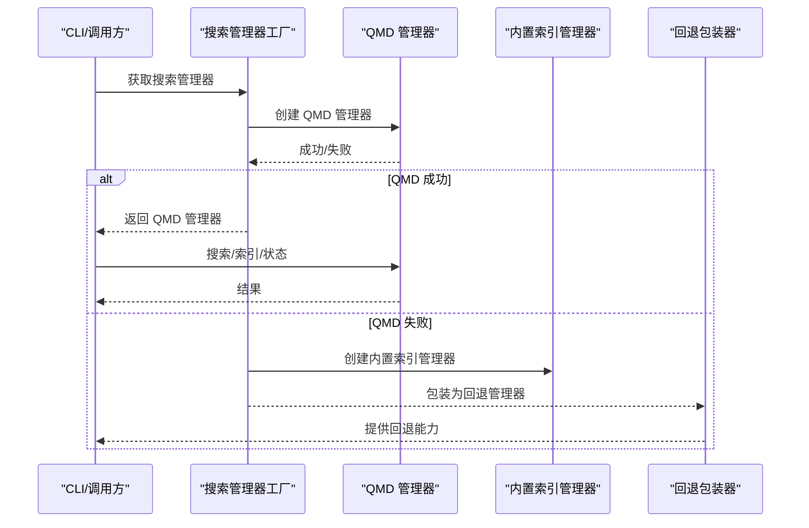
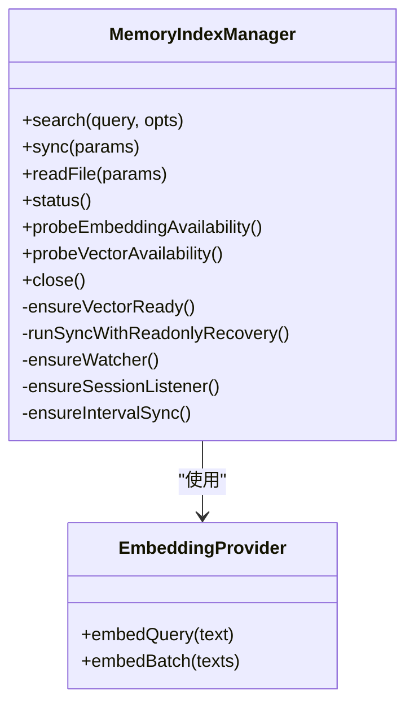
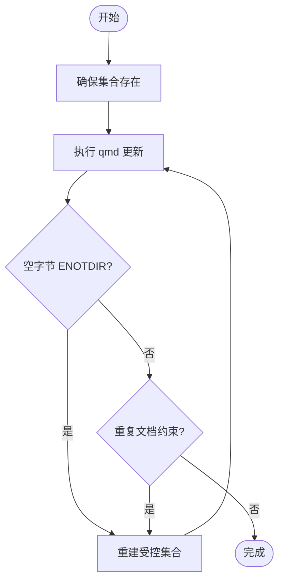
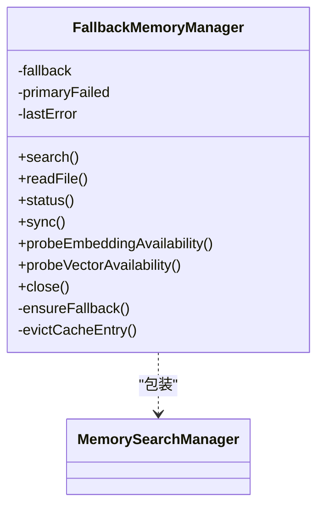
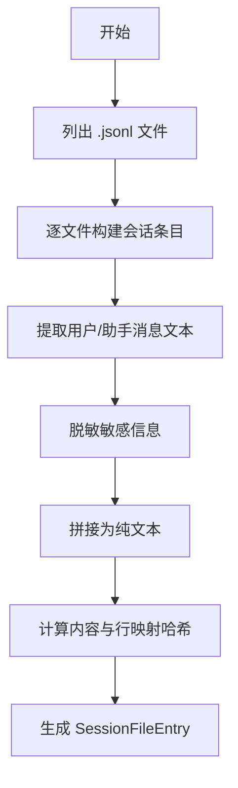
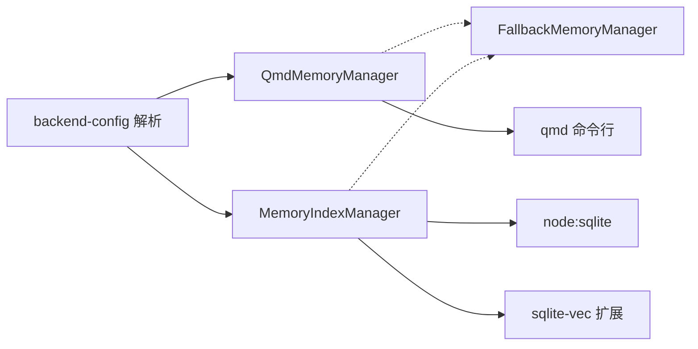

# 内存管理

<cite>
**本文引用的文件**
- [src/memory/manager.ts](file://src/memory/manager.ts)
- [src/memory/qmd-manager.ts](file://src/memory/qmd-manager.ts)
- [src/memory/search-manager.ts](file://src/memory/search-manager.ts)
- [src/memory/backend-config.ts](file://src/memory/backend-config.ts)
- [src/memory/types.ts](file://src/memory/types.ts)
- [src/memory/internal.ts](file://src/memory/internal.ts)
- [src/memory/fs-utils.ts](file://src/memory/fs-utils.ts)
- [src/memory/sqlite.ts](file://src/memory/sqlite.ts)
- [src/memory/embeddings.ts](file://src/memory/embeddings.ts)
- [src/memory/session-files.ts](file://src/memory/session-files.ts)
- [src/memory/qmd-scope.ts](file://src/memory/qmd-scope.ts)
- [src/cli/memory-cli.ts](file://src/cli/memory-cli.ts)
- [src/agents/sandbox/context.ts](file://src/agents/sandbox/context.ts)
- [src/agents/sandbox/shared.ts](file://src/agents/sandbox/shared.ts)
</cite>

## 目录

1. [简介](#简介)
2. [项目结构](#项目结构)
3. [核心组件](#核心组件)
4. [架构总览](#架构总览)
5. [详细组件分析](#详细组件分析)
6. [依赖关系分析](#依赖关系分析)
7. [性能考量](#性能考量)
8. [故障排查指南](#故障排查指南)
9. [结论](#结论)
10. [附录](#附录)

## 简介

本文件系统性阐述 OpenClaw 的内存管理机制，覆盖以下主题：

- 内存分配策略：内置索引（SQLite）与外部 QMD 引擎两种后端的索引构建与缓存策略
- 垃圾回收与只读恢复：数据库只读错误时的自动重连与状态恢复
- 内存泄漏防护：资源句柄关闭、缓存键失效、定时器清理、文件监听器释放
- 会话内存管理：按会话维度的增量同步与增量更新
- 代理工作空间内存控制：工作区隔离、文件访问白名单与路径规范化
- 沙箱内存隔离：容器化运行时的工作区映射、权限与用户 ID 对齐
- 内存使用监控：状态快照、进度回调、只读恢复统计
- 内存优化配置：批处理并发、缓存容量、向量维度、查询限制
- 内存泄漏检测：关闭流程日志、异常路径告警、测试用例覆盖

## 项目结构

OpenClaw 的内存子系统由“搜索管理器”抽象层与两个具体实现组成：

- 内置管理器（MemoryIndexManager）：基于 node:sqlite 的本地索引，支持向量与全文检索（FTS）
- QMD 管理器（QmdMemoryManager）：通过外部 qmd 命令行工具维护索引，支持多集合与会话导出

图表来源

- [src/memory/search-manager.ts:25-86](file://src/memory/search-manager.ts#L25-L86)
- [src/memory/manager.ts:61-187](file://src/memory/manager.ts#L61-L187)
- [src/memory/qmd-manager.ts:127-141](file://src/memory/qmd-manager.ts#L127-L141)

章节来源

- [src/memory/search-manager.ts:25-86](file://src/memory/search-manager.ts#L25-L86)
- [src/memory/backend-config.ts:297-355](file://src/memory/backend-config.ts#L297-L355)

## 核心组件

- 搜索管理器工厂：根据配置选择 QMD 或内置后端，并在 QMD 失败时自动回退到内置索引
- 内置索引管理器：负责 SQLite 数据库连接、模式初始化、向量扩展加载、FSW 监听、批处理嵌入、只读恢复
- QMD 管理器：负责 qmd 集合的生命周期、索引重建、超时与错误修复（空字节元数据、重复文档约束）、会话导出
- 后端配置解析：统一解析 memory 配置，生成 ResolvedQmdConfig 与默认集合
- 类型与接口：定义 MemorySearchManager 接口、状态结构体、进度回调等

章节来源

- [src/memory/types.ts:61-81](file://src/memory/types.ts#L61-L81)
- [src/memory/backend-config.ts:297-355](file://src/memory/backend-config.ts#L297-L355)
- [src/memory/manager.ts:61-187](file://src/memory/manager.ts#L61-L187)
- [src/memory/qmd-manager.ts:127-141](file://src/memory/qmd-manager.ts#L127-L141)

## 架构总览

OpenClaw 的内存管理采用“抽象 + 双实现 + 回退”的设计：

- 抽象层：MemorySearchManager 接口屏蔽后端差异
- QMD 实现：通过外部进程与本地文件系统交互，适合大规模 Markdown 文档与会话
- 内置实现：纯 JS/SQLite 实现，便于无外部依赖部署
- 回退机制：当 QMD 不可用或失败时，自动切换到内置索引并缓存失效

图表来源

- [src/memory/search-manager.ts:25-86](file://src/memory/search-manager.ts#L25-L86)
- [src/memory/qmd-manager.ts:127-141](file://src/memory/qmd-manager.ts#L127-L141)
- [src/memory/manager.ts:61-187](file://src/memory/manager.ts#L61-L187)

## 详细组件分析

### 内置索引管理器（MemoryIndexManager）

- 职责
  - 管理 SQLite 连接与模式初始化
  - 加载向量扩展（sqlite-vec），探测可用性
  - 维护嵌入提供者（OpenAI、Gemini、本地 Llama 等），支持自动/回退
  - 文件系统监听（chokidar）与增量同步
  - 批处理嵌入队列与并发控制
  - 只读数据库错误的自动恢复（重新打开连接、重建状态）
  - 缓存与统计：嵌入缓存表、源计数、批处理失败计数
- 关键特性
  - 会话热身（warmSession）：在会话开始时触发一次同步
  - 搜索融合：向量与关键词检索结果合并（MMR、时间衰减）
  - 路径白名单：仅允许 MEMORY.md、memory 目录及额外路径中的 .md 文件
  - 状态快照：返回文件/块数量、向量/FTS 状态、批处理与只读恢复统计

图表来源

- [src/memory/manager.ts:61-187](file://src/memory/manager.ts#L61-L187)
- [src/memory/manager.ts:256-364](file://src/memory/manager.ts#L256-L364)
- [src/memory/manager.ts:451-551](file://src/memory/manager.ts#L451-L551)
- [src/memory/manager.ts:768-800](file://src/memory/manager.ts#L768-L800)
- [src/memory/embeddings.ts:32-60](file://src/memory/embeddings.ts#L32-L60)

章节来源

- [src/memory/manager.ts:61-187](file://src/memory/manager.ts#L61-L187)
- [src/memory/manager.ts:256-364](file://src/memory/manager.ts#L256-L364)
- [src/memory/manager.ts:451-551](file://src/memory/manager.ts#L451-L551)
- [src/memory/manager.ts:768-800](file://src/memory/manager.ts#L768-L800)
- [src/memory/embeddings.ts:166-286](file://src/memory/embeddings.ts#L166-L286)

### QMD 管理器（QmdMemoryManager）

- 职责
  - 管理 qmd 集合（默认 + 自定义），确保集合存在且绑定正确
  - 通过 qmd 命令执行索引更新、查询与会话导出
  - 错误修复：空字节导致的 ENOTDIR、重复文档约束冲突
  - 会话导出：将会话 JSONL 导出为 Markdown 并纳入集合
  - 会话范围控制：根据会话键（频道/群组/私聊）决定是否允许访问
- 关键特性
  - 集合迁移：从旧命名到新命名的兼容迁移
  - 命令超时与输出长度限制
  - 嵌入背压：防止频繁触发 qmd 嵌入任务

图表来源

- [src/memory/qmd-manager.ts:290-336](file://src/memory/qmd-manager.ts#L290-L336)
- [src/memory/qmd-manager.ts:694-725](file://src/memory/qmd-manager.ts#L694-L725)
- [src/memory/qmd-manager.ts:727-800](file://src/memory/qmd-manager.ts#L727-L800)

章节来源

- [src/memory/qmd-manager.ts:127-141](file://src/memory/qmd-manager.ts#L127-L141)
- [src/memory/qmd-manager.ts:290-336](file://src/memory/qmd-manager.ts#L290-L336)
- [src/memory/qmd-manager.ts:694-725](file://src/memory/qmd-manager.ts#L694-L725)
- [src/memory/qmd-manager.ts:727-800](file://src/memory/qmd-manager.ts#L727-L800)
- [src/memory/qmd-scope.ts:10-51](file://src/memory/qmd-scope.ts#L10-L51)

### 搜索管理器工厂与回退包装器

- 工厂职责：解析配置、选择后端、缓存管理器实例
- 回退包装器：当主后端失败时，记录错误并切换到备用后端；同时负责缓存条目失效

图表来源

- [src/memory/search-manager.ts:104-246](file://src/memory/search-manager.ts#L104-L246)

章节来源

- [src/memory/search-manager.ts:25-86](file://src/memory/search-manager.ts#L25-L86)
- [src/memory/search-manager.ts:104-246](file://src/memory/search-manager.ts#L104-L246)

### 会话内存管理

- 会话文件扫描：列出 agent 的 sessions 目录下的 .jsonl 文件
- 会话内容提取：过滤消息类型，标准化文本，脱敏敏感信息
- 行号映射：将分块后的行号映射回原始 JSONL 行号，保证引用准确
- 会话导出：可选将会话导出为 Markdown 并加入 qmd 集合

图表来源

- [src/memory/session-files.ts:21-33](file://src/memory/session-files.ts#L21-L33)
- [src/memory/session-files.ts:74-132](file://src/memory/session-files.ts#L74-L132)

章节来源

- [src/memory/session-files.ts:10-19](file://src/memory/session-files.ts#L10-L19)
- [src/memory/session-files.ts:74-132](file://src/memory/session-files.ts#L74-L132)

### 代理工作空间内存控制

- 路径白名单：仅允许 MEMORY.md、memory 目录及额外路径中的 .md 文件
- 路径规范化：统一相对路径、去符号链接、去重复
- 读取安全：严格校验文件类型与存在性，缺失时返回空内容而非抛错

章节来源

- [src/memory/internal.ts:48-57](file://src/memory/internal.ts#L48-L57)
- [src/memory/internal.ts:35-46](file://src/memory/internal.ts#L35-L46)
- [src/memory/internal.ts:59-146](file://src/memory/internal.ts#L59-L146)
- [src/memory/fs-utils.ts:17-31](file://src/memory/fs-utils.ts#L17-L31)
- [src/memory/manager.ts:553-624](file://src/memory/manager.ts#L553-L624)

### 沙箱内存隔离

- 工作区布局：根据作用域（shared/session/agent）生成唯一工作区目录
- 权限对齐：自动解析宿主机 UID/GID 并注入到容器用户字段
- 容器与浏览器桥接：在沙箱内启动浏览器服务并通过认证令牌进行控制
- 会话工作区：为特定会话创建独立工作区并可选择同步技能

章节来源

- [src/agents/sandbox/shared.ts:18-34](file://src/agents/sandbox/shared.ts#L18-L34)
- [src/agents/sandbox/context.ts:20-65](file://src/agents/sandbox/context.ts#L20-L65)
- [src/agents/sandbox/context.ts:108-186](file://src/agents/sandbox/context.ts#L108-L186)
- [src/agents/sandbox/context.ts:188-210](file://src/agents/sandbox/context.ts#L188-L210)

## 依赖关系分析

- 抽象与实现
  - MemorySearchManager 抽象被 QmdMemoryManager 与 MemoryIndexManager 实现
  - FallbackMemoryManager 包装任意 MemorySearchManager 实例
- 外部依赖
  - QMD 管理器依赖 qmd 命令行工具与 XDG 目录隔离
  - 内置管理器依赖 node:sqlite 与 sqlite-vec 扩展
- 配置解析
  - backend-config 将用户配置解析为稳定的 ResolvedQmdConfig，用于缓存键与初始化

图表来源

- [src/memory/backend-config.ts:297-355](file://src/memory/backend-config.ts#L297-L355)
- [src/memory/qmd-manager.ts:127-141](file://src/memory/qmd-manager.ts#L127-L141)
- [src/memory/manager.ts:61-187](file://src/memory/manager.ts#L61-L187)
- [src/memory/sqlite.ts:6-19](file://src/memory/sqlite.ts#L6-L19)

章节来源

- [src/memory/backend-config.ts:297-355](file://src/memory/backend-config.ts#L297-L355)
- [src/memory/qmd-manager.ts:127-141](file://src/memory/qmd-manager.ts#L127-L141)
- [src/memory/manager.ts:61-187](file://src/memory/manager.ts#L61-L187)
- [src/memory/sqlite.ts:6-19](file://src/memory/sqlite.ts#L6-L19)

## 性能考量

- 批处理与并发
  - 内置管理器支持嵌入批处理并发与轮询间隔配置，避免过载
  - QMD 管理器对嵌入任务加锁，避免并发冲突
- 检索效率
  - 向量检索与关键词检索融合，支持 MMR 与时间衰减，提升相关性
  - 查询前进行会话热身与必要同步，减少冷启动延迟
- 存储与缓存
  - 嵌入缓存表降低重复计算成本
  - QMD 管理器通过集合绑定与增量更新减少全量重建
- I/O 与网络
  - 本地嵌入优先，远程提供商回退策略降低网络抖动影响
  - 文件系统监听与定时器在关闭时全部清理，避免后台任务占用

## 故障排查指南

- QMD 相关
  - 空字节 ENOTDIR：尝试重建受控集合后重试
  - 重复文档约束：移除重复文档后重建集合
  - 集合缺失：自动修复并重试一次
- 内置索引
  - 只读数据库：自动关闭并重建连接，重置向量可用状态
  - 向量扩展加载失败：记录错误并在后续探测中反馈
- CLI 使用
  - 使用 memory status 查看状态、向量/FTS 可用性、批处理与只读恢复统计
  - 使用 memory index 强制重建索引，观察进度与耗时
  - 使用 memory search 验证检索效果与阈值设置

章节来源

- [src/cli/memory-cli.ts:335-574](file://src/cli/memory-cli.ts#L335-L574)
- [src/cli/memory-cli.ts:614-744](file://src/cli/memory-cli.ts#L614-L744)
- [src/memory/qmd-manager.ts:694-725](file://src/memory/qmd-manager.ts#L694-L725)
- [src/memory/manager.ts:468-551](file://src/memory/manager.ts#L468-L551)

## 结论

OpenClaw 的内存管理以“双后端 + 回退 + 会话感知”为核心设计，兼顾易用性与可扩展性：

- QMD 适合大规模 Markdown 与会话场景，具备强大的集合管理与导出能力
- 内置索引适合轻量部署与离线环境，具备完善的错误恢复与性能优化
- 通过严格的路径白名单、会话范围控制与沙箱隔离，有效降低内存泄漏与越权风险
- CLI 提供完整的监控与诊断能力，便于定位问题与优化配置

## 附录

### 内存使用监控与优化配置

- 监控项
  - 状态快照：文件/块数量、向量/FTS 可用性、缓存条目、批处理失败次数、只读恢复统计
  - 进度回调：索引过程中的完成/总数与标签
- 优化建议
  - 合理设置批处理并发与轮询间隔，避免 CPU/IO 抖动
  - 控制最大结果数与片段长度，平衡召回与注入开销
  - 在 QMD 中启用会话导出并设置保留期，提升检索覆盖面
  - 为本地嵌入提供合适的模型路径与缓存目录，减少首次加载成本

章节来源

- [src/memory/types.ts:24-59](file://src/memory/types.ts#L24-L59)
- [src/memory/backend-config.ts:180-195](file://src/memory/backend-config.ts#L180-L195)
- [src/memory/backend-config.ts:326-347](file://src/memory/backend-config.ts#L326-L347)
- [src/cli/memory-cli.ts:362-400](file://src/cli/memory-cli.ts#L362-L400)

### 内存泄漏检测方法

- 关闭流程
  - 确保所有管理器在退出时调用 close，清理定时器、监听器与数据库连接
  - 回退包装器在失败后主动失效缓存条目，避免悬挂引用
- 日志与告警
  - 关闭失败与只读恢复均记录警告日志，便于审计
  - CLI 输出详细状态与错误，辅助定位问题
- 测试覆盖
  - 单测覆盖关闭流程、只读恢复、集合修复、范围控制等关键路径

章节来源

- [src/memory/manager.ts:768-800](file://src/memory/manager.ts#L768-L800)
- [src/memory/search-manager.ts:88-102](file://src/memory/search-manager.ts#L88-L102)
- [src/memory/qmd-manager.ts:694-725](file://src/memory/qmd-manager.ts#L694-L725)
- [src/memory/qmd-scope.ts:10-51](file://src/memory/qmd-scope.ts#L10-L51)
