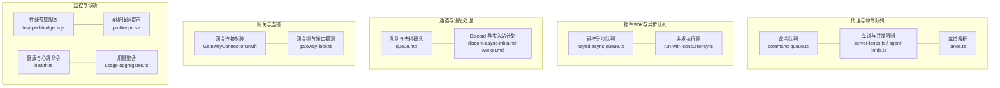
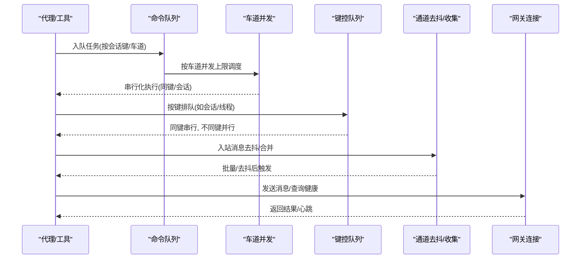
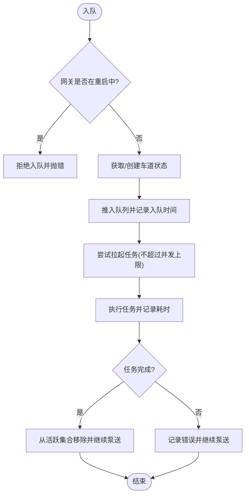
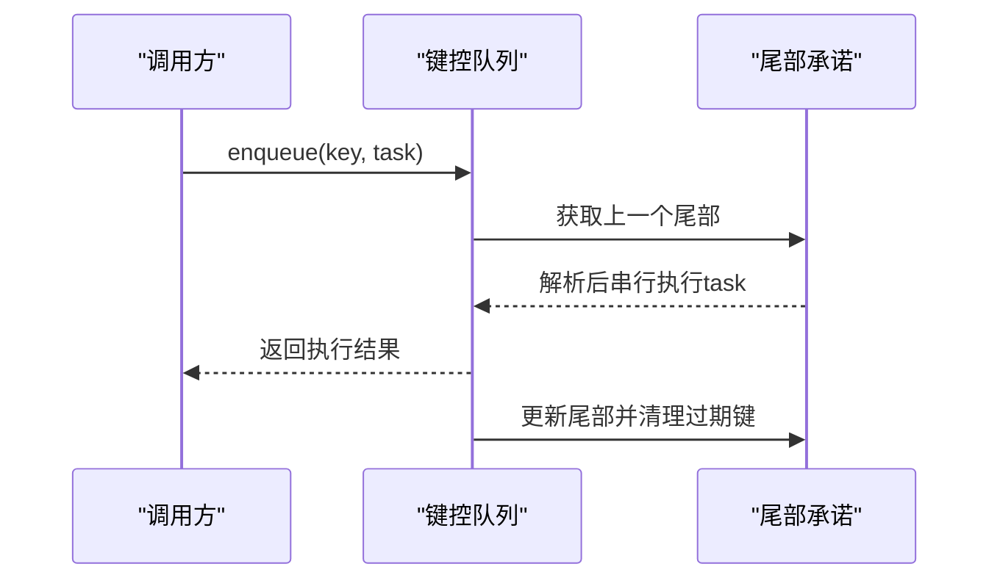
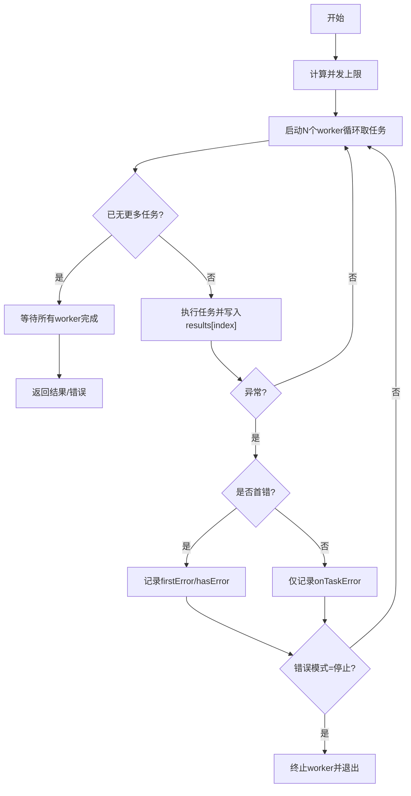
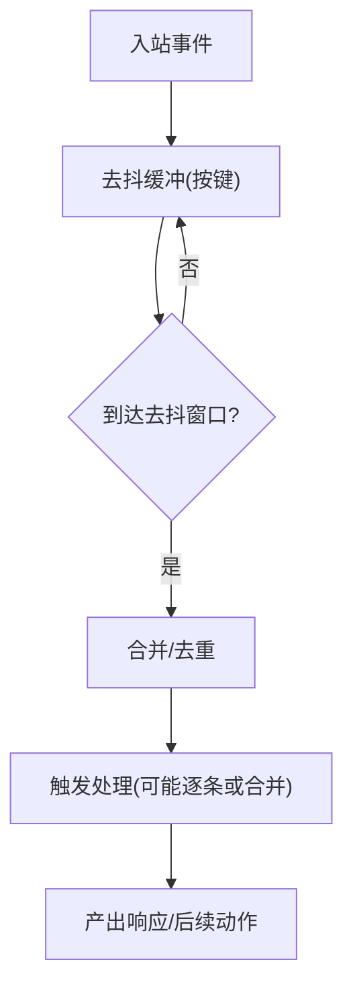
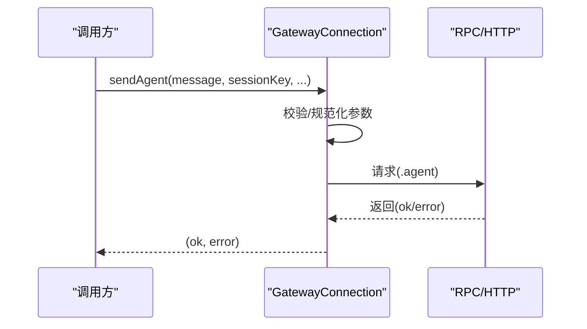
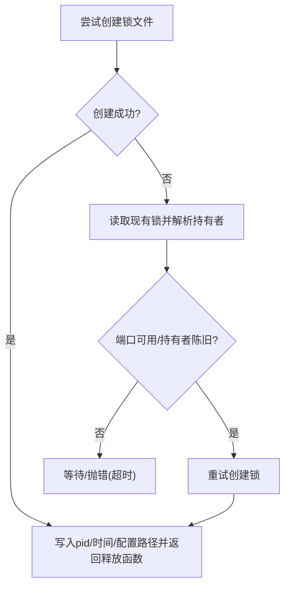
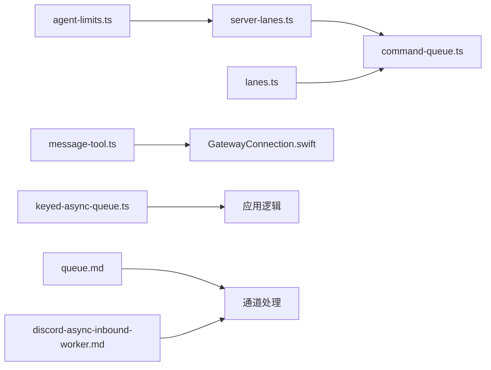

# 并发处理

<cite>
**本文引用的文件**
- [keyed-async-queue.ts](file://src/plugin-sdk/keyed-async-queue.ts)
- [run-with-concurrency.ts](file://src/utils/run-with-concurrency.ts)
- [command-queue.ts](file://src/process/command-queue.ts)
- [server-lanes.ts](file://src/gateway/server-lanes.ts)
- [agent-limits.ts](file://src/config/agent-limits.ts)
- [lanes.ts](file://src/agents/lanes.ts)
- [queue.md](file://docs/concepts/queue.md)
- [discord-async-inbound-worker.md](file://docs/experiments/plans/discord-async-inbound-worker.md)
- [SimpleTaskSupport.swift](file://apps/macos/Sources/OpenClaw/SimpleTaskSupport.swift)
- [GatewayConnection.swift](file://apps/macos/Sources/OpenClaw/GatewayConnection.swift)
- [message-tool.ts](file://src/agents/tools/message-tool.ts)
- [gateway-lock.ts](file://src/infra/gateway-lock.ts)
- [test-perf-budget.mjs](file://scripts/test-perf-budget.mjs)
- [profiler.prose](file://extensions/open-prose/skills/prose/lib/profiler.prose)
- [health.ts](file://src/commands/health.ts)
- [usage-aggregates.ts](file://src/shared/usage-aggregates.ts)
</cite>

## 目录

1. [简介](#简介)
2. [项目结构](#项目结构)
3. [核心组件](#核心组件)
4. [架构总览](#架构总览)
5. [详细组件分析](#详细组件分析)
6. [依赖关系分析](#依赖关系分析)
7. [性能考量](#性能考量)
8. [故障排查指南](#故障排查指南)
9. [结论](#结论)
10. [附录](#附录)

## 简介

本指南聚焦于 OpenClaw 的并发处理体系，系统阐述多线程模型、异步任务调度与并发控制机制，覆盖代理并发执行、通道消息并发处理以及网关并发连接的实现策略。文档同时提供性能调优参数、死锁与竞态预防方法、并发监控与瓶颈识别技巧，帮助读者在复杂场景下构建稳定高效的并发系统。

## 项目结构

OpenClaw 的并发能力由“进程内命令队列”“键控异步队列”“通道去抖与收集策略”“网关连接与心跳”等模块协同实现，并通过配置与运行时参数进行精细化控制。

图表来源

- [command-queue.ts:1-325](file://src/process/command-queue.ts#L1-L325)
- [server-lanes.ts:1-11](file://src/gateway/server-lanes.ts#L1-L11)
- [agent-limits.ts:1-23](file://src/config/agent-limits.ts#L1-L23)
- [lanes.ts:1-14](file://src/agents/lanes.ts#L1-L14)
- [keyed-async-queue.ts:1-49](file://src/plugin-sdk/keyed-async-queue.ts#L1-L49)
- [run-with-concurrency.ts:1-49](file://src/utils/run-with-concurrency.ts#L1-L49)
- [queue.md:1-23](file://docs/concepts/queue.md#L1-L23)
- [discord-async-inbound-worker.md:1-45](file://docs/experiments/plans/discord-async-inbound-worker.md#L1-L45)
- [GatewayConnection.swift:470-669](file://apps/macos/Sources/OpenClaw/GatewayConnection.swift#L470-L669)
- [gateway-lock.ts:59-101](file://src/infra/gateway-lock.ts#L59-L101)
- [test-perf-budget.mjs:98-127](file://scripts/test-perf-budget.mjs#L98-L127)
- [profiler.prose:317-357](file://extensions/open-prose/skills/prose/lib/profiler.prose#L317-L357)
- [health.ts:82-118](file://src/commands/health.ts#L82-L118)
- [usage-aggregates.ts:1-66](file://src/shared/usage-aggregates.ts#L1-L66)

章节来源

- [command-queue.ts:1-325](file://src/process/command-queue.ts#L1-L325)
- [server-lanes.ts:1-11](file://src/gateway/server-lanes.ts#L1-L11)
- [agent-limits.ts:1-23](file://src/config/agent-limits.ts#L1-L23)
- [lanes.ts:1-14](file://src/agents/lanes.ts#L1-L14)
- [keyed-async-queue.ts:1-49](file://src/plugin-sdk/keyed-async-queue.ts#L1-L49)
- [run-with-concurrency.ts:1-49](file://src/utils/run-with-concurrency.ts#L1-L49)
- [queue.md:1-23](file://docs/concepts/queue.md#L1-L23)
- [discord-async-inbound-worker.md:1-45](file://docs/experiments/plans/discord-async-inbound-worker.md#L1-L45)
- [GatewayConnection.swift:470-669](file://apps/macos/Sources/OpenClaw/GatewayConnection.swift#L470-L669)
- [gateway-lock.ts:59-101](file://src/infra/gateway-lock.ts#L59-L101)
- [test-perf-budget.mjs:98-127](file://scripts/test-perf-budget.mjs#L98-L127)
- [profiler.prose:317-357](file://extensions/open-prose/skills/prose/lib/profiler.prose#L317-L357)
- [health.ts:82-118](file://src/commands/health.ts#L82-L118)
- [usage-aggregates.ts:1-66](file://src/shared/usage-aggregates.ts#L1-L66)

## 核心组件

- 命令队列与车道：提供跨会话串行化与全局并发上限控制，支持按车道设置最大并发数，保障资源不被过度争用。
- 键控异步队列：以键为单位保证任务串行化，不同键可并行，适合按会话或路由边界隔离的任务流。
- 并发执行器：在固定并发度下批量调度任务，支持“继续/停止”两种错误模式，便于容错与可观测性。
- 通道去抖与收集：对高频入站消息进行去抖与合并，降低代理负载；支持跨频道与线程边界下的有序处理。
- 网关连接与心跳：封装 RPC 调用、幂等键、超时与心跳开关，确保消息发送与状态查询的可靠性。
- 网关锁与端口探测：避免多实例竞争同一端口，提升重启与恢复的稳定性。
- 监控与诊断：健康命令、用量聚合、性能预算脚本与剖析技能，用于定位瓶颈与评估回归。

章节来源

- [command-queue.ts:1-325](file://src/process/command-queue.ts#L1-L325)
- [keyed-async-queue.ts:1-49](file://src/plugin-sdk/keyed-async-queue.ts#L1-L49)
- [run-with-concurrency.ts:1-49](file://src/utils/run-with-concurrency.ts#L1-L49)
- [queue.md:1-23](file://docs/concepts/queue.md#L1-L23)
- [GatewayConnection.swift:470-669](file://apps/macos/Sources/OpenClaw/GatewayConnection.swift#L470-L669)
- [gateway-lock.ts:59-101](file://src/infra/gateway-lock.ts#L59-L101)
- [health.ts:82-118](file://src/commands/health.ts#L82-L118)
- [usage-aggregates.ts:1-66](file://src/shared/usage-aggregates.ts#L1-L66)
- [test-perf-budget.mjs:98-127](file://scripts/test-perf-budget.mjs#L98-L127)
- [profiler.prose:317-357](file://extensions/open-prose/skills/prose/lib/profiler.prose#L317-L357)

## 架构总览

OpenClaw 的并发架构围绕“命令队列 + 车道并发 + 键控串行 + 通道去抖 + 网关连接”的组合展开，既保证关键路径的串行一致性，又允许在安全边界内最大化并行度。

图表来源

- [command-queue.ts:154-197](file://src/process/command-queue.ts#L154-L197)
- [server-lanes.ts:6-10](file://src/gateway/server-lanes.ts#L6-L10)
- [keyed-async-queue.ts:6-31](file://src/plugin-sdk/keyed-async-queue.ts#L6-L31)
- [queue.md:10-23](file://docs/concepts/queue.md#L10-L23)
- [GatewayConnection.swift:484-529](file://apps/macos/Sources/OpenClaw/GatewayConnection.swift#L484-L529)

## 详细组件分析

### 命令队列与车道并发

- 多车道模型：支持主车道、子代理车道、定时任务车道等，分别设置最大并发数，避免相互干扰。
- 串行化与限流：每个车道维护队列与活跃任务集合，按并发上限逐个出队执行，记录等待时长与排队人数，便于告警与诊断。
- 清理与重启：支持清理指定车道、重置所有车道生成代数以避免重启后悬挂任务阻塞，以及等待当前活跃任务完成。

图表来源

- [command-queue.ts:154-197](file://src/process/command-queue.ts#L154-L197)
- [command-queue.ts:80-144](file://src/process/command-queue.ts#L80-L144)

章节来源

- [command-queue.ts:1-325](file://src/process/command-queue.ts#L1-L325)
- [server-lanes.ts:1-11](file://src/gateway/server-lanes.ts#L1-L11)
- [agent-limits.ts:1-23](file://src/config/agent-limits.ts#L1-L23)
- [lanes.ts:1-14](file://src/agents/lanes.ts#L1-L14)

### 键控异步队列（按会话/路由串行）

- 以键为单位维护“尾部承诺”，新任务基于前一尾部链路串行执行，不同键互不阻塞。
- 提供钩子回调，便于观测入队与结算时机。
- 适用于代理会话、线程、频道等需要强顺序的边界。

图表来源

- [keyed-async-queue.ts:6-31](file://src/plugin-sdk/keyed-async-queue.ts#L6-L31)

章节来源

- [keyed-async-queue.ts:1-49](file://src/plugin-sdk/keyed-async-queue.ts#L1-L49)

### 并发执行器（批量限流）

- 固定并发 worker 数，按序分配任务索引，支持“遇到错误即停止/继续执行”两种模式。
- 记录首次错误与整体错误状态，便于上层决策与日志输出。

图表来源

- [run-with-concurrency.ts:3-48](file://src/utils/run-with-concurrency.ts#L3-L48)

章节来源

- [run-with-concurrency.ts:1-49](file://src/utils/run-with-concurrency.ts#L1-L49)

### 通道消息并发处理与去抖

- 去抖策略：对同一键（如频道+线程+发送者）的消息进行去抖，合并后一次性触发处理，减少重复工作。
- 收集模式：在跨频道或需要严格顺序时，强制逐条处理，保证一致性。
- Discord 异步入站：监听器接受事件后快速归一化，再入队到专用工作者，避免监听器超时导致用户感知失败。

图表来源

- [queue.md:10-23](file://docs/concepts/queue.md#L10-L23)
- [discord-async-inbound-worker.md:11-32](file://docs/experiments/plans/discord-async-inbound-worker.md#L11-L32)

章节来源

- [queue.md:1-23](file://docs/concepts/queue.md#L1-L23)
- [discord-async-inbound-worker.md:1-45](file://docs/experiments/plans/discord-async-inbound-worker.md#L1-L45)

### 网关并发连接与消息发送

- 连接封装：统一构造请求参数（消息体、会话键、思考模式、投递选项、幂等键、超时），并进行空值校验与会话键规范化。
- 心跳与健康：支持开启/关闭心跳、查询健康快照与健康状态，便于运维与自愈。
- Swift 主线程与后台任务：提供主线程安全的启动/停止与分离循环任务的工具函数，避免 UI 卡顿与资源泄漏。

图表来源

- [GatewayConnection.swift:484-529](file://apps/macos/Sources/OpenClaw/GatewayConnection.swift#L484-L529)
- [GatewayConnection.swift:470-669](file://apps/macos/Sources/OpenClaw/GatewayConnection.swift#L470-L669)
- [SimpleTaskSupport.swift:1-31](file://apps/macos/Sources/OpenClaw/SimpleTaskSupport.swift#L1-L31)

章节来源

- [GatewayConnection.swift:470-669](file://apps/macos/Sources/OpenClaw/GatewayConnection.swift#L470-L669)
- [SimpleTaskSupport.swift:1-31](file://apps/macos/Sources/OpenClaw/SimpleTaskSupport.swift#L1-L31)
- [message-tool.ts:726-743](file://src/agents/tools/message-tool.ts#L726-L743)

### 网关锁与端口探测（死锁/重启安全）

- 通过锁文件与进程启动时间判断锁持有者有效性，若端口无监听则视为“陈旧持有者”，允许回收。
- Linux 下通过读取 /proc/<pid>/stat 获取启动时间，增强锁判定准确性。

图表来源

- [gateway-lock.ts:59-101](file://src/infra/gateway-lock.ts#L59-L101)
- [gateway-lock.ts:193-221](file://src/infra/gateway-lock.ts#L193-L221)

章节来源

- [gateway-lock.ts:59-101](file://src/infra/gateway-lock.ts#L59-L101)
- [gateway-lock.ts:193-221](file://src/infra/gateway-lock.ts#L193-L221)

## 依赖关系分析

- 命令队列依赖车道与并发上限配置，后者来自网关配置与默认值。
- 键控队列与通道去抖均以“键”为边界，前者面向会话/线程，后者面向频道/线程/发送者。
- 网关连接封装依赖代理工具参数解析与会话键规范化。

图表来源

- [agent-limits.ts:1-23](file://src/config/agent-limits.ts#L1-L23)
- [server-lanes.ts:1-11](file://src/gateway/server-lanes.ts#L1-L11)
- [command-queue.ts:1-325](file://src/process/command-queue.ts#L1-L325)
- [lanes.ts:1-14](file://src/agents/lanes.ts#L1-L14)
- [message-tool.ts:726-743](file://src/agents/tools/message-tool.ts#L726-L743)
- [GatewayConnection.swift:470-669](file://apps/macos/Sources/OpenClaw/GatewayConnection.swift#L470-L669)
- [keyed-async-queue.ts:1-49](file://src/plugin-sdk/keyed-async-queue.ts#L1-L49)
- [queue.md:1-23](file://docs/concepts/queue.md#L1-L23)
- [discord-async-inbound-worker.md:1-45](file://docs/experiments/plans/discord-async-inbound-worker.md#L1-L45)

章节来源

- [agent-limits.ts:1-23](file://src/config/agent-limits.ts#L1-L23)
- [server-lanes.ts:1-11](file://src/gateway/server-lanes.ts#L1-L11)
- [command-queue.ts:1-325](file://src/process/command-queue.ts#L1-L325)
- [lanes.ts:1-14](file://src/agents/lanes.ts#L1-L14)
- [message-tool.ts:726-743](file://src/agents/tools/message-tool.ts#L726-L743)
- [GatewayConnection.swift:470-669](file://apps/macos/Sources/OpenClaw/GatewayConnection.swift#L470-L669)
- [keyed-async-queue.ts:1-49](file://src/plugin-sdk/keyed-async-queue.ts#L1-L49)
- [queue.md:1-23](file://docs/concepts/queue.md#L1-L23)
- [discord-async-inbound-worker.md:1-45](file://docs/experiments/plans/discord-async-inbound-worker.md#L1-L45)

## 性能考量

- 并发上限调优
  - 代理与子代理最大并发：通过配置项与默认值决定，建议根据 CPU/IO 与外部服务速率调整。
  - 车道并发：主车道用于自动回复等关键路径，子代理与定时任务车道可适当提高并发以提升吞吐。
- 任务批量化与去抖
  - 对高频入站消息启用去抖与合并，显著降低代理与外部服务压力。
  - 在跨频道或严格顺序场景下启用逐条处理，避免乱序。
- 错误模式选择
  - “继续模式”适合探索式任务，尽快暴露全部问题；“停止模式”适合关键路径，避免级联失败。
- 监控与回归控制
  - 使用健康命令与心跳状态检查系统健康。
  - 用量聚合与日志采样辅助定位热点与异常。
  - 性能预算脚本对测试用例设定墙钟时间上限，防止回归恶化。
  - 剖析技能提示提供成本/时间/效率/缓存命中率等维度的分析框架。

章节来源

- [agent-limits.ts:1-23](file://src/config/agent-limits.ts#L1-L23)
- [server-lanes.ts:1-11](file://src/gateway/server-lanes.ts#L1-L11)
- [queue.md:1-23](file://docs/concepts/queue.md#L1-L23)
- [run-with-concurrency.ts:1-49](file://src/utils/run-with-concurrency.ts#L1-L49)
- [health.ts:82-118](file://src/commands/health.ts#L82-L118)
- [usage-aggregates.ts:1-66](file://src/shared/usage-aggregates.ts#L1-L66)
- [test-perf-budget.mjs:98-127](file://scripts/test-perf-budget.mjs#L98-L127)
- [profiler.prose:317-357](file://extensions/open-prose/skills/prose/lib/profiler.prose#L317-L357)

## 故障排查指南

- 死锁与悬挂任务
  - 若重启后出现“队列卡住”，使用重置所有车道功能，清除活跃任务集合并推进队列。
  - 清理特定车道以隔离问题任务。
- 竞态与串行化问题
  - 确认关键路径（如会话/线程）使用键控队列串行化。
  - 对跨车道/跨频道操作启用逐条处理，避免跨上下文的并发副作用。
- 网关连接与端口冲突
  - 若端口占用或锁文件异常，检查锁持有者进程状态与启动时间，必要时回收锁。
  - 通过心跳与健康接口确认网关存活与超时配置。
- 性能退化与瓶颈
  - 使用性能预算脚本与剖析提示，对比基线与回归阈值，定位耗时增长点。
  - 结合健康命令与用量聚合，识别慢代理、慢模型与高缓存读写比。

章节来源

- [command-queue.ts:244-259](file://src/process/command-queue.ts#L244-L259)
- [command-queue.ts:216-228](file://src/process/command-queue.ts#L216-L228)
- [keyed-async-queue.ts:6-31](file://src/plugin-sdk/keyed-async-queue.ts#L6-L31)
- [gateway-lock.ts:59-101](file://src/infra/gateway-lock.ts#L59-L101)
- [GatewayConnection.swift:474-500](file://apps/macos/Sources/OpenClaw/GatewayConnection.swift#L474-L500)
- [test-perf-budget.mjs:98-127](file://scripts/test-perf-budget.mjs#L98-L127)
- [profiler.prose:317-357](file://extensions/open-prose/skills/prose/lib/profiler.prose#L317-L357)

## 结论

OpenClaw 的并发体系通过“命令队列 + 车道并发 + 键控串行 + 通道去抖 + 网关连接”形成闭环：既保证关键路径的确定性，又在安全边界内最大化吞吐。配合完善的监控与诊断工具，可在复杂场景下实现稳定、可观测且可调优的并发系统。

## 附录

- 关键参数与配置要点
  - 代理最大并发：agents.defaults.maxConcurrent
  - 子代理最大并发：agents.defaults.subagents.maxConcurrent
  - 车道并发：cron/main/subagent
  - 队列模式/去抖/容量/丢弃策略：messages.queue.\*
  - 网关连接超时、幂等键、心跳开关
- 推荐实践
  - 将会话/线程作为键控边界，频道/线程作为通道去抖边界。
  - 对外部服务调用采用批量限流与错误模式控制。
  - 定期运行健康命令与性能预算脚本，结合剖析提示持续优化。
