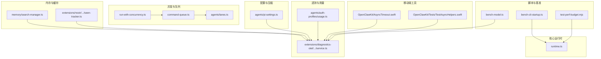
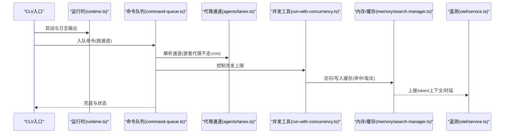
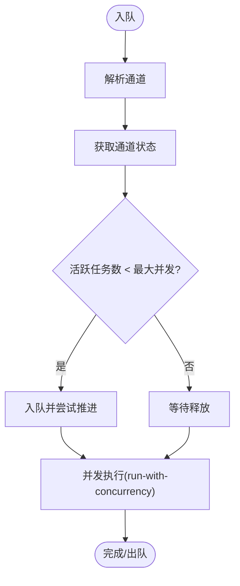
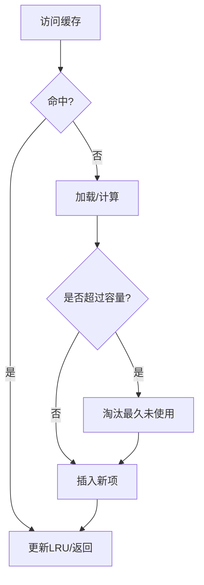
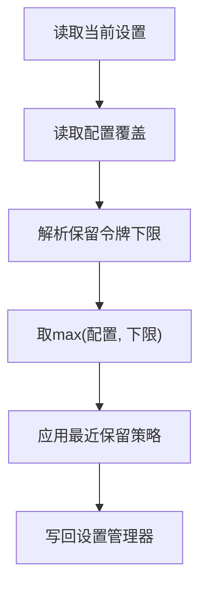
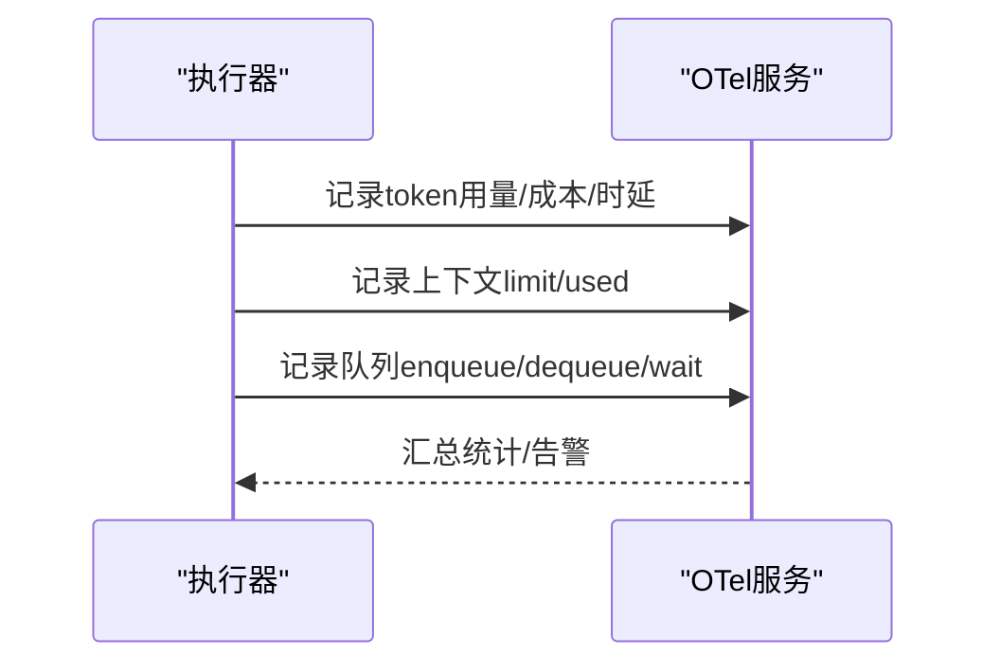
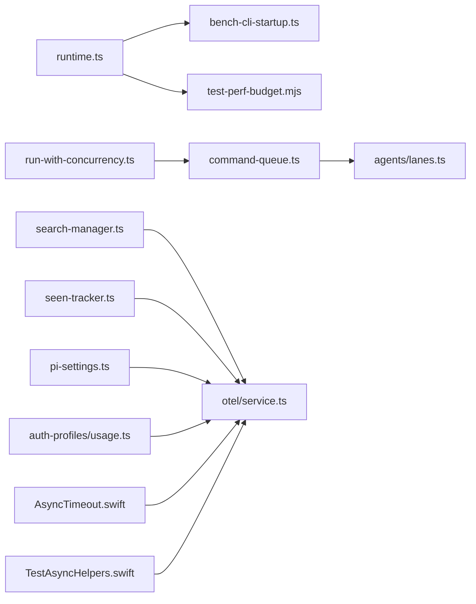

# 性能优化

<cite>
**本文引用的文件**
- [bench-model.ts](file://scripts/bench-model.ts)
- [bench-cli-startup.ts](file://scripts/bench-cli-startup.ts)
- [test-perf-budget.mjs](file://scripts/test-perf-budget.mjs)
- [run-with-concurrency.ts](file://src/utils/run-with-concurrency.ts)
- [command-queue.ts](file://src/process/command-queue.ts)
- [lanes.ts](file://src/agents/lanes.ts)
- [pi-settings.ts](file://src/agents/pi-settings.ts)
- [pi-settings.test.ts](file://src/agents/pi-settings.test.ts)
- [search-manager.ts](file://src/memory/search-manager.ts)
- [seen-tracker.ts](file://extensions/nostr/src/seen-tracker.ts)
- [service.ts](file://extensions/diagnostics-otel/src/service.ts)
- [usage.ts](file://src/agents/auth-profiles/usage.ts)
- [AsyncTimeout.swift](file://apps/shared/OpenClawKit/Sources/OpenClawKit/AsyncTimeout.swift)
- [AsyncHelpers.swift](file://apps/shared/OpenClawKit/Tests/OpenClawKitTests/TestAsyncHelpers.swift)
- [runtime.ts](file://src/runtime.ts)
</cite>

## 目录

1. [引言](#引言)
2. [项目结构](#项目结构)
3. [核心组件](#核心组件)
4. [架构总览](#架构总览)
5. [详细组件分析](#详细组件分析)
6. [依赖关系分析](#依赖关系分析)
7. [性能考量与优化策略](#性能考量与优化策略)
8. [故障排查指南](#故障排查指南)
9. [结论](#结论)
10. [附录](#附录)

## 引言

本指南面向OpenClaw系统的性能优化工作，聚焦于瓶颈识别、优化策略与监控方法。内容覆盖内存管理、并发控制、缓存策略、资源调度与扩展性设计，并提供可落地的调优步骤（配置优化、代码优化、基础设施优化）。文档以仓库中现有实现为依据，结合测试与基准脚本，帮助在不同平台与场景下稳定提升系统性能。

## 项目结构

OpenClaw采用多语言混合架构：核心逻辑以TypeScript为主，包含CLI、进程与队列、代理与会话、内存与缓存、诊断与遥测等模块；移动端部分使用Swift；同时提供Node脚本用于模型与启动性能基准测试，以及测试性能预算工具。

**图表来源**

- [bench-model.ts:1-147](file://scripts/bench-model.ts#L1-L147)
- [bench-cli-startup.ts:1-201](file://scripts/bench-cli-startup.ts#L1-L201)
- [test-perf-budget.mjs:1-128](file://scripts/test-perf-budget.mjs#L1-L128)
- [runtime.ts:1-54](file://src/runtime.ts#L1-L54)
- [run-with-concurrency.ts:1-48](file://src/utils/run-with-concurrency.ts#L1-L48)
- [command-queue.ts:43-90](file://src/process/command-queue.ts#L43-L90)
- [lanes.ts:1-15](file://src/agents/lanes.ts#L1-L15)
- [search-manager.ts:239-252](file://src/memory/search-manager.ts#L239-L252)
- [seen-tracker.ts:49-242](file://extensions/nostr/src/seen-tracker.ts#L49-L242)
- [pi-settings.ts:58-77](file://src/agents/pi-settings.ts#L58-L77)
- [service.ts:389-587](file://extensions/diagnostics-otel/src/service.ts#L389-L587)
- [usage.ts:192-234](file://src/agents/auth-profiles/usage.ts#L192-L234)
- [AsyncTimeout.swift:1-36](file://apps/shared/OpenClawKit/Sources/OpenClawKit/AsyncTimeout.swift#L1-L36)
- [AsyncHelpers.swift:1-22](file://apps/shared/OpenClawKit/Tests/OpenClawKitTests/TestAsyncHelpers.swift#L1-L22)

**章节来源**

- [bench-model.ts:1-147](file://scripts/bench-model.ts#L1-L147)
- [bench-cli-startup.ts:1-201](file://scripts/bench-cli-startup.ts#L1-L201)
- [test-perf-budget.mjs:1-128](file://scripts/test-perf-budget.mjs#L1-L128)
- [runtime.ts:1-54](file://src/runtime.ts#L1-L54)

## 核心组件

- 基准与性能预算
  - 模型推理基准：scripts/bench-model.ts 提供跨模型的耗时与用量统计，便于对比不同模型的性能表现。
  - CLI启动基准：scripts/bench-cli-startup.ts 统计命令执行的平均、中位、95分位耗时与退出状态分布。
  - 测试性能预算：scripts/test-perf-budget.mjs 在CI中限制测试总耗时与回归阈值，避免性能退化。
- 并发与队列
  - run-with-concurrency.ts 提供受控并发执行任务的工具，支持错误模式与回调。
  - process/command-queue.ts 管理“通道（Lane）”级队列与最大并发，支持排空与生成器隔离。
  - agents/lanes.ts 将嵌套代理运行从“cron”通道中解耦，避免阻塞。
- 内存与缓存
  - memory/search-manager.ts 包含缓存淘汰与键构建逻辑，强调热路径上的快速序列化。
  - extensions/nostr/.../seen-tracker.ts 实现LRU链表与容量淘汰，保障热点命中与内存占用可控。
- 配置与压缩
  - agents/pi-settings.ts 应用压缩设置（保留令牌、最近保留），并强制下限，确保上下文安全。
- 遥测与用量
  - extensions/diagnostics-otel/.../service.ts 记录token用量、成本、时延、上下文大小、队列深度与等待时间等指标。
  - agents/auth-profiles/usage.ts 负责认证配置的冷却与禁用窗口管理，避免频繁失败重试导致抖动。
- 移动端异步超时
  - OpenClawKit/AsyncTimeout.swift 提供统一的异步超时封装，配合测试工具TestAsyncHelpers.swift进行条件等待与超时断言。

**章节来源**

- [run-with-concurrency.ts:1-48](file://src/utils/run-with-concurrency.ts#L1-L48)
- [command-queue.ts:43-90](file://src/process/command-queue.ts#L43-L90)
- [lanes.ts:1-15](file://src/agents/lanes.ts#L1-L15)
- [search-manager.ts:239-252](file://src/memory/search-manager.ts#L239-L252)
- [seen-tracker.ts:49-242](file://extensions/nostr/src/seen-tracker.ts#L49-L242)
- [pi-settings.ts:58-77](file://src/agents/pi-settings.ts#L58-L77)
- [service.ts:389-587](file://extensions/diagnostics-otel/src/service.ts#L389-L587)
- [usage.ts:192-234](file://src/agents/auth-profiles/usage.ts#L192-L234)
- [AsyncTimeout.swift:1-36](file://apps/shared/OpenClawKit/Sources/OpenClawKit/AsyncTimeout.swift#L1-L36)
- [AsyncHelpers.swift:1-22](file://apps/shared/OpenClawKit/Tests/OpenClawKitTests/TestAsyncHelpers.swift#L1-L22)

## 架构总览

OpenClaw的性能相关路径贯穿“输入/命令解析 → 并发调度 → 执行 → 用量与遥测 → 输出/缓存”。以下序列图展示典型流程：

**图表来源**

- [runtime.ts:1-54](file://src/runtime.ts#L1-L54)
- [command-queue.ts:43-90](file://src/process/command-queue.ts#L43-L90)
- [lanes.ts:1-15](file://src/agents/lanes.ts#L1-L15)
- [run-with-concurrency.ts:1-48](file://src/utils/run-with-concurrency.ts#L1-L48)
- [search-manager.ts:239-252](file://src/memory/search-manager.ts#L239-L252)
- [service.ts:389-587](file://extensions/diagnostics-otel/src/service.ts#L389-L587)

## 详细组件分析

### 组件A：并发与队列（command-queue + run-with-concurrency）

- 设计要点
  - 通道（Lane）隔离与最大并发控制，避免高优先级任务饥饿。
  - 排空机制与代数（generation）防止过期任务推进。
  - 受控并发工具支持错误聚合与停止策略，降低连锁失败风险。
- 性能影响
  - 合理设置maxConcurrent可提升吞吐；过小则排队延迟上升，过大则资源争用增加。
  - 通道解耦（如嵌套代理不走cron）减少长任务对计划任务的影响。
- 优化建议
  - 为不同类型任务设置独立通道与并发配额。
  - 对批量任务采用批处理或分片，降低队列抖动。
  - 结合测试预算脚本持续评估并发参数对端到端耗时的影响。

**图表来源**

- [command-queue.ts:43-90](file://src/process/command-queue.ts#L43-L90)
- [run-with-concurrency.ts:1-48](file://src/utils/run-with-concurrency.ts#L1-L48)
- [lanes.ts:1-15](file://src/agents/lanes.ts#L1-L15)

**章节来源**

- [command-queue.ts:43-90](file://src/process/command-queue.ts#L43-L90)
- [run-with-concurrency.ts:1-48](file://src/utils/run-with-concurrency.ts#L1-L48)
- [lanes.ts:1-15](file://src/agents/lanes.ts#L1-L15)

### 组件B：内存与缓存（search-manager + seen-tracker）

- 设计要点
  - 快速键构建与缓存淘汰，热路径避免深排序开销。
  - LRU链表维护最近使用顺序，容量超限时淘汰尾部。
- 性能影响
  - 缓存命中率直接影响响应时延与模型用量；淘汰策略需平衡冷热数据。
  - 长生命周期缓存可能放大上下文膨胀，需结合压缩策略。
- 优化建议
  - 为不同agent/后端配置独立缓存键空间，避免串扰。
  - 结合token用量与上下文直方图，动态调整缓存容量与TTL。

**图表来源**

- [search-manager.ts:239-252](file://src/memory/search-manager.ts#L239-L252)
- [seen-tracker.ts:49-242](file://extensions/nostr/src/seen-tracker.ts#L49-L242)

**章节来源**

- [search-manager.ts:239-252](file://src/memory/search-manager.ts#L239-L252)
- [seen-tracker.ts:49-242](file://extensions/nostr/src/seen-tracker.ts#L49-L242)

### 组件C：配置与压缩（pi-settings）

- 设计要点
  - 强制保留令牌下限与最近保留策略，避免上下文过小引发重复填充。
  - 支持显式覆盖与安全模式下的保护。
- 性能影响
  - 保留令牌下限不足会导致频繁压缩与上下文重建，增加时延与token消耗。
- 优化建议
  - 根据模型上下文窗口与任务类型设定合理下限。
  - 结合用量直方图与失败率，动态调整保留与最近保留比例。

**图表来源**

- [pi-settings.ts:58-77](file://src/agents/pi-settings.ts#L58-L77)

**章节来源**

- [pi-settings.ts:58-77](file://src/agents/pi-settings.ts#L58-L77)
- [pi-settings.test.ts:1-90](file://src/agents/pi-settings.test.ts#L1-L90)

### 组件D：遥测与用量（otel service + auth-profiles usage）

- 设计要点
  - 记录输入/输出/缓存读写/总token、成本、时延、上下文限制与使用量、队列深度与等待时间。
  - 认证配置冷却与禁用窗口自动清理，避免失败风暴。
- 性能影响
  - 指标粒度决定可观测性与开销权衡；过多标签会放大存储与查询压力。
- 优化建议
  - 为关键路径打点，避免在热路径上记录细粒度过高的事件。
  - 使用采样或聚合策略，结合直方图与计数器，降低遥测成本。

**图表来源**

- [service.ts:389-587](file://extensions/diagnostics-otel/src/service.ts#L389-L587)
- [usage.ts:192-234](file://src/agents/auth-profiles/usage.ts#L192-L234)

**章节来源**

- [service.ts:389-587](file://extensions/diagnostics-otel/src/service.ts#L389-L587)
- [usage.ts:192-234](file://src/agents/auth-profiles/usage.ts#L192-L234)

### 组件E：移动端异步超时（AsyncTimeout.swift + TestAsyncHelpers.swift）

- 设计要点
  - 提供统一的异步超时封装，避免死等与资源泄漏。
  - 测试辅助函数支持可配置轮询与超时错误。
- 性能影响
  - 合理的超时与轮询间隔可避免长时间阻塞，提升整体稳定性。
- 优化建议
  - 为不同操作设置差异化超时，避免全局一刀切。
  - 在测试中使用轮询等待替代硬等待，减少CI波动。

**章节来源**

- [AsyncTimeout.swift:1-36](file://apps/shared/OpenClawKit/Sources/OpenClawKit/AsyncTimeout.swift#L1-L36)
- [AsyncHelpers.swift:1-22](file://apps/shared/OpenClawKit/Tests/OpenClawKitTests/TestAsyncHelpers.swift#L1-L22)

## 依赖关系分析

- 组件耦合
  - 运行时（runtime.ts）为日志与退出提供统一出口，被CLI与测试脚本广泛依赖。
  - 并发工具与队列共同构成执行层，向上游提供稳定的吞吐与隔离能力。
  - 遥测服务横切多个模块，形成统一的观测面。
- 外部依赖
  - Node脚本依赖Vitest报告与子进程执行，测试预算脚本通过环境变量控制阈值。
  - Swift侧依赖Foundation与Task Group，保证并发与超时的一致性。

**图表来源**

- [runtime.ts:1-54](file://src/runtime.ts#L1-L54)
- [bench-cli-startup.ts:1-201](file://scripts/bench-cli-startup.ts#L1-L201)
- [test-perf-budget.mjs:1-128](file://scripts/test-perf-budget.mjs#L1-L128)
- [run-with-concurrency.ts:1-48](file://src/utils/run-with-concurrency.ts#L1-L48)
- [command-queue.ts:43-90](file://src/process/command-queue.ts#L43-L90)
- [lanes.ts:1-15](file://src/agents/lanes.ts#L1-L15)
- [search-manager.ts:239-252](file://src/memory/search-manager.ts#L239-L252)
- [seen-tracker.ts:49-242](file://extensions/nostr/src/seen-tracker.ts#L49-L242)
- [pi-settings.ts:58-77](file://src/agents/pi-settings.ts#L58-L77)
- [service.ts:389-587](file://extensions/diagnostics-otel/src/service.ts#L389-L587)
- [usage.ts:192-234](file://src/agents/auth-profiles/usage.ts#L192-L234)
- [AsyncTimeout.swift:1-36](file://apps/shared/OpenClawKit/Sources/OpenClawKit/AsyncTimeout.swift#L1-L36)
- [AsyncHelpers.swift:1-22](file://apps/shared/OpenClawKit/Tests/OpenClawKitTests/TestAsyncHelpers.swift#L1-L22)

**章节来源**

- [runtime.ts:1-54](file://src/runtime.ts#L1-L54)
- [bench-cli-startup.ts:1-201](file://scripts/bench-cli-startup.ts#L1-L201)
- [test-perf-budget.mjs:1-128](file://scripts/test-perf-budget.mjs#L1-L128)
- [run-with-concurrency.ts:1-48](file://src/utils/run-with-concurrency.ts#L1-L48)
- [command-queue.ts:43-90](file://src/process/command-queue.ts#L43-L90)
- [lanes.ts:1-15](file://src/agents/lanes.ts#L1-L15)
- [search-manager.ts:239-252](file://src/memory/search-manager.ts#L239-L252)
- [seen-tracker.ts:49-242](file://extensions/nostr/src/seen-tracker.ts#L49-L242)
- [pi-settings.ts:58-77](file://src/agents/pi-settings.ts#L58-L77)
- [service.ts:389-587](file://extensions/diagnostics-otel/src/service.ts#L389-L587)
- [usage.ts:192-234](file://src/agents/auth-profiles/usage.ts#L192-L234)
- [AsyncTimeout.swift:1-36](file://apps/shared/OpenClawKit/Sources/OpenClawKit/AsyncTimeout.swift#L1-L36)
- [AsyncHelpers.swift:1-22](file://apps/shared/OpenClawKit/Tests/OpenClawKitTests/TestAsyncHelpers.swift#L1-L22)

## 性能考量与优化策略

### 识别瓶颈

- 启动与冷启动
  - 使用 bench-cli-startup.ts 观察命令的平均/中位/95分位耗时，定位启动慢的命令与异常退出。
- 推理与模型
  - 使用 bench-model.ts 对比不同模型的耗时分布与token用量，识别高延迟或高用量的后端。
- 测试与回归
  - 使用 test-perf-budget.mjs 在CI中限制测试总耗时与回归幅度，防止性能退化。

**章节来源**

- [bench-cli-startup.ts:1-201](file://scripts/bench-cli-startup.ts#L1-L201)
- [bench-model.ts:1-147](file://scripts/bench-model.ts#L1-L147)
- [test-perf-budget.mjs:1-128](file://scripts/test-perf-budget.mjs#L1-L128)

### 内存管理与缓存

- 策略
  - 使用LRU与容量淘汰，避免缓存无限增长；在热路径上采用快速键构建，减少序列化开销。
  - 结合上下文直方图与token用量，动态调整缓存容量与TTL。
- 最佳实践
  - 为不同agent/后端划分独立缓存键空间，避免串扰。
  - 对长生命周期会话启用压缩与保留令牌下限，防止上下文膨胀。

**章节来源**

- [search-manager.ts:239-252](file://src/memory/search-manager.ts#L239-L252)
- [seen-tracker.ts:49-242](file://extensions/nostr/src/seen-tracker.ts#L49-L242)
- [pi-settings.ts:58-77](file://src/agents/pi-settings.ts#L58-L77)

### 并发处理

- 策略
  - 使用通道隔离与并发上限，避免高优先级任务饥饿；在嵌套代理场景避免占用cron通道。
  - 对批量任务采用批处理或分片，降低队列抖动。
- 最佳实践
  - 为不同类型任务设置独立通道与并发配额。
  - 使用受控并发工具聚合错误，必要时立即停止，避免连锁失败。

**章节来源**

- [command-queue.ts:43-90](file://src/process/command-queue.ts#L43-L90)
- [run-with-concurrency.ts:1-48](file://src/utils/run-with-concurrency.ts#L1-L48)
- [lanes.ts:1-15](file://src/agents/lanes.ts#L1-L15)

### 资源调度与扩展

- 策略
  - 基于通道与并发上限的资源配额，结合队列深度与等待时间直方图，动态调整。
  - 使用冷却与禁用窗口管理认证配置，避免失败风暴。
- 最佳实践
  - 为关键通道设置更高的并发与更低的等待阈值。
  - 在大规模部署中，将通道与实例绑定，避免跨实例竞争。

**章节来源**

- [service.ts:389-587](file://extensions/diagnostics-otel/src/service.ts#L389-L587)
- [usage.ts:192-234](file://src/agents/auth-profiles/usage.ts#L192-L234)

### 基础设施优化

- 日志与退出
  - 使用 runtime.ts 的统一日志与退出接口，避免在测试中产生噪声输出。
- 超时与轮询
  - 使用 AsyncTimeout.swift 与测试辅助函数，避免死等与资源泄漏，提升稳定性。

**章节来源**

- [runtime.ts:1-54](file://src/runtime.ts#L1-L54)
- [AsyncTimeout.swift:1-36](file://apps/shared/OpenClawKit/Sources/OpenClawKit/AsyncTimeout.swift#L1-L36)
- [AsyncHelpers.swift:1-22](file://apps/shared/OpenClawKit/Tests/OpenClawKitTests/TestAsyncHelpers.swift#L1-L22)

## 故障排查指南

- 启动缓慢
  - 使用 bench-cli-startup.ts 分析命令耗时分布与退出码，定位异常分支。
- 测试超时
  - 使用 test-perf-budget.mjs 设置maxWallMs与回归阈值，结合CI日志定位回归点。
- 队列积压
  - 关注OTel中的队列深度与等待时间直方图，检查通道并发上限与任务粒度。
- 缓存命中低
  - 检查缓存键构建与淘汰策略，确认容量与TTL设置是否合理。
- 上下文膨胀
  - 结合token用量与上下文直方图，调整压缩保留令牌下限与最近保留策略。

**章节来源**

- [bench-cli-startup.ts:1-201](file://scripts/bench-cli-startup.ts#L1-L201)
- [test-perf-budget.mjs:1-128](file://scripts/test-perf-budget.mjs#L1-L128)
- [service.ts:389-587](file://extensions/diagnostics-otel/src/service.ts#L389-L587)
- [search-manager.ts:239-252](file://src/memory/search-manager.ts#L239-L252)
- [pi-settings.ts:58-77](file://src/agents/pi-settings.ts#L58-L77)

## 结论

通过基准脚本与测试预算建立性能基线，结合并发队列、缓存与压缩策略，以及统一的遥测与日志接口，OpenClaw能够在多平台与多场景下实现稳定且可扩展的性能表现。建议在持续集成中固定性能预算，在生产环境中以指标驱动动态调参，并在大规模部署中采用通道隔离与实例绑定策略，确保资源公平分配与系统韧性。

## 附录

- 性能调优清单
  - 启动：使用bench-cli-startup.ts定位慢命令，优化冷启动路径。
  - 推理：使用bench-model.ts对比模型，选择合适上下文窗口与token限额。
  - 并发：调整通道并发上限与批处理粒度，观察队列深度与等待时间。
  - 缓存：根据命中率与内存占用，调整容量、TTL与键空间。
  - 压缩：设置保留令牌下限与最近保留比例，避免上下文过度膨胀。
  - 遥测：聚焦关键指标（token、成本、时延、上下文、队列），避免过度打点。
  - CI：启用test-perf-budget.mjs，防止回归。
