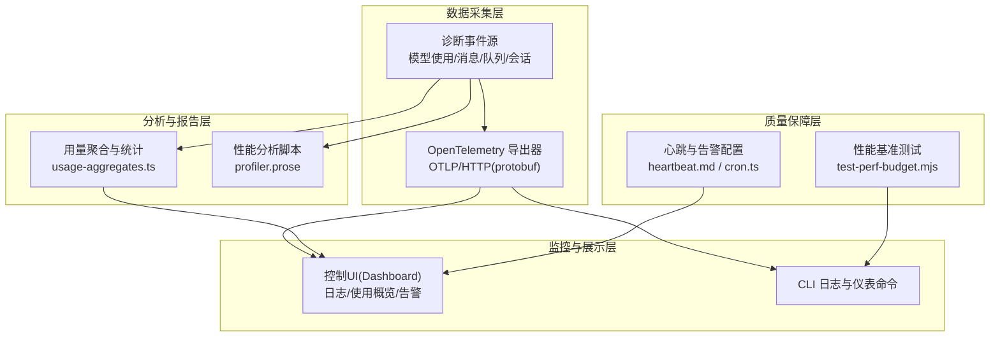
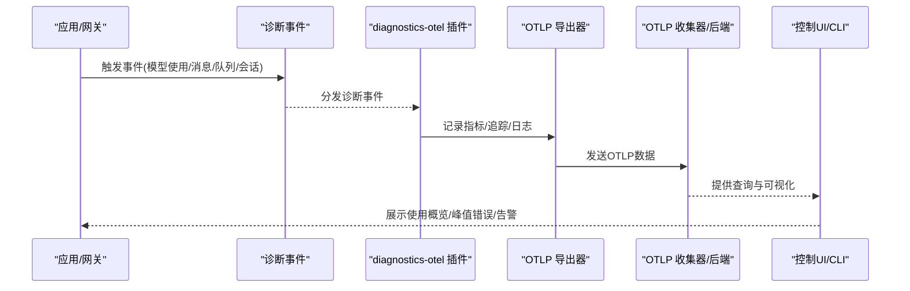
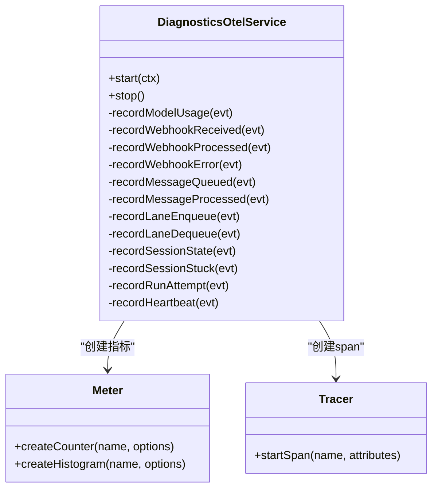
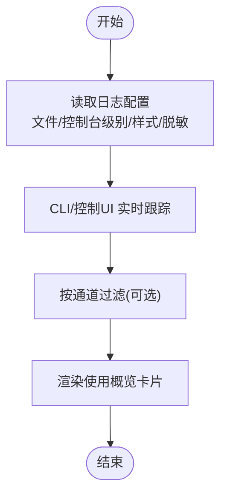
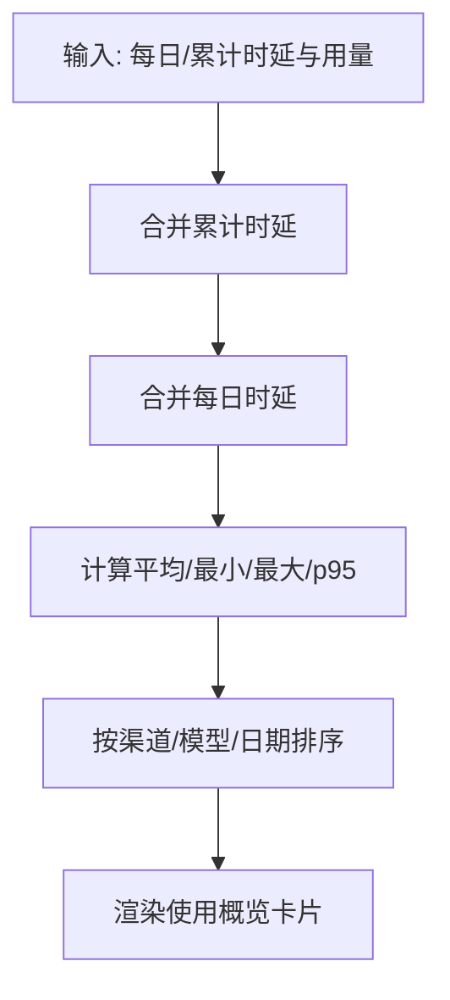
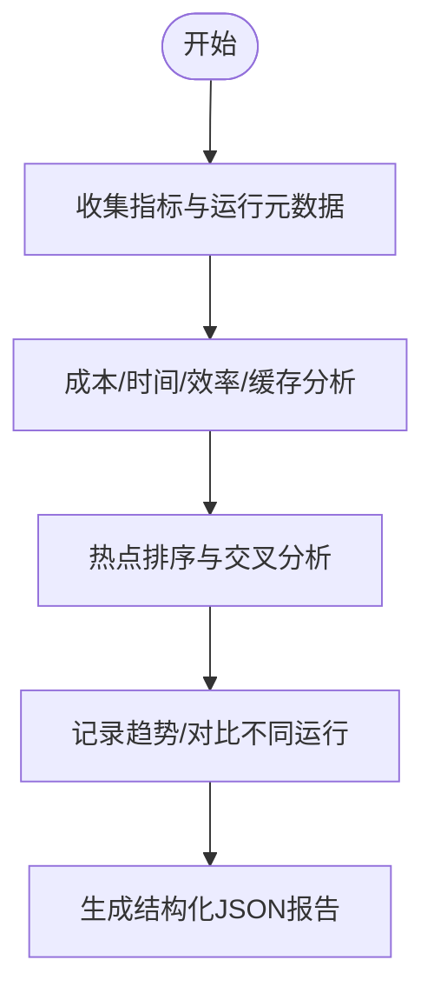
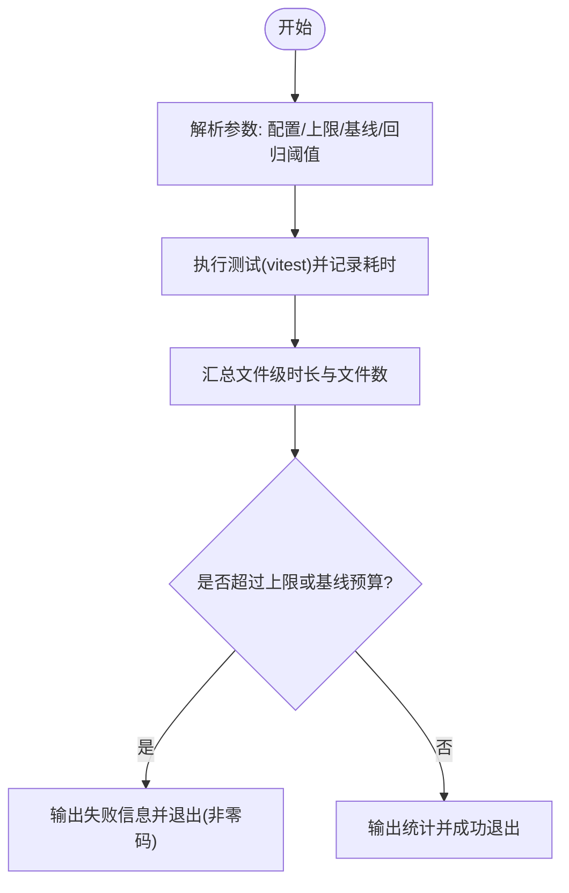
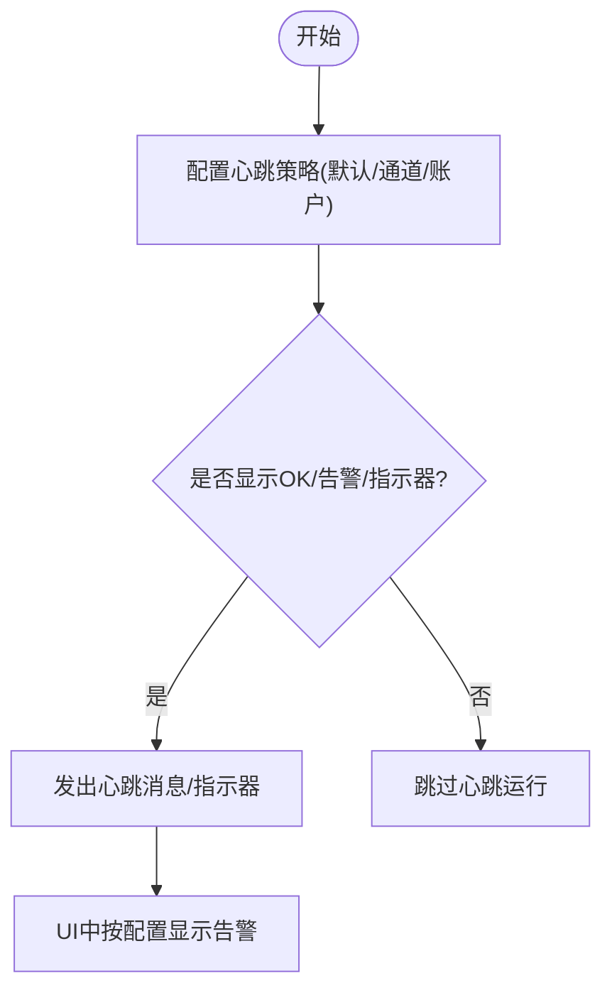
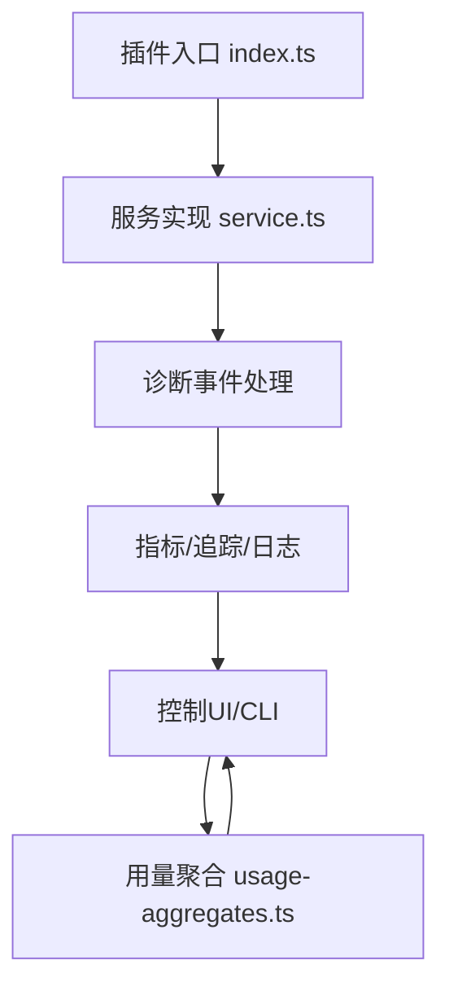

# 性能监控

<cite>
**本文引用的文件**   
- [service.ts](file://extensions/diagnostics-otel/src/service.ts)
- [index.ts](file://extensions/diagnostics-otel/index.ts)
- [logging.md](file://docs/logging.md)
- [dashboard.md](file://docs/web/dashboard.md)
- [dashboard.md](file://docs/cli/dashboard.md)
- [usage-aggregates.ts](file://src/shared/usage-aggregates.ts)
- [usage-metrics.ts](file://ui/src/ui/views/usage-metrics.ts)
- [usage-render-overview.ts](file://ui/src/ui/views/usage-render-overview.ts)
- [test-perf-budget.mjs](file://scripts/test-perf-budget.mjs)
- [heartbeat.md](file://docs/gateway/heartbeat.md)
- [cron.ts](file://ui/src/ui/views/cron.ts)
- [status.ts](file://src/auto-reply/status.ts)
- [profiler.prose](file://extensions/open-prose/skills/prose/lib/profiler.prose)
</cite>

## 目录

1. [简介](#简介)
2. [项目结构](#项目结构)
3. [核心组件](#核心组件)
4. [架构总览](#架构总览)
5. [详细组件分析](#详细组件分析)
6. [依赖关系分析](#依赖关系分析)
7. [性能考量](#性能考量)
8. [故障排查指南](#故障排查指南)
9. [结论](#结论)
10. [附录](#附录)

## 简介

本指南面向OpenClaw的性能监控与优化，覆盖系统性能监控、应用性能监控与业务性能监控三类场景，提供指标采集、监控告警、性能分析、基准测试与回归检测、瓶颈定位以及监控仪表板与告警规则配置的实操指引。OpenClaw通过内置的诊断事件与OpenTelemetry导出能力，结合UI仪表板与CLI工具，形成从数据采集到可视化呈现的闭环。

## 项目结构

OpenClaw的性能监控由以下关键部分组成：

- 诊断事件与指标导出：通过“diagnostics-otel”插件将模型使用、消息处理、队列与会话状态等事件转化为OTLP指标/追踪/日志。
- 日志与仪表板：通过CLI与控制UI（Dashboard）查看实时日志与使用概览；支持按通道过滤与目标化调试标志。
- 性能分析与报告：基于聚合函数对时延与用量进行统计，结合LLM辅助的性能分析脚本生成洞察。
- 基准测试与回归检测：通过测试脚本对测试运行时间施加预算限制，防止性能退化。
- 告警与心跳：通过心跳机制与UI中的告警配置，实现异常与峰值的及时通知。

图示来源

- [service.ts:170-242](file://extensions/diagnostics-otel/src/service.ts#L170-L242)
- [logging.md:142-353](file://docs/logging.md#L142-L353)
- [usage-aggregates.ts:32-109](file://src/shared/usage-aggregates.ts#L32-L109)
- [test-perf-budget.mjs:1-128](file://scripts/test-perf-budget.mjs#L1-L128)
- [heartbeat.md:277-313](file://docs/gateway/heartbeat.md#L277-L313)
- [cron.ts:1237-1260](file://ui/src/ui/views/cron.ts#L1237-L1260)

章节来源

- [logging.md:142-353](file://docs/logging.md#L142-L353)
- [dashboard.md:1-55](file://docs/web/dashboard.md#L1-L55)
- [dashboard.md:1-23](file://docs/cli/dashboard.md#L1-L23)

## 核心组件

- 诊断事件与OTLP导出
  - 插件注册与服务启动：在启用diagnostics与otel后，插件初始化NodeSDK、指标读取器与日志导出器，并注册诊断事件处理器。
  - 指标与追踪：导出令牌用量、成本、运行时长、上下文大小、Webhook处理、消息处理、队列深度/等待、会话状态与卡滞等指标与span。
  - 日志导出：当开启otel.logs时，将主日志结构化输出通过OTLP发送至收集器。
- 日志与仪表板
  - CLI日志：支持实时跟踪、JSON/纯文本输出、颜色控制与敏感信息脱敏。
  - 控制UI：提供日志标签页与使用概览卡片，支持按通道过滤与峰值错误列表。
- 用量聚合与统计
  - 聚合函数：合并每日/累计时延与用量，构建按渠道、模型、日期等维度的聚合视图。
  - UI渲染：将聚合结果渲染为Top模型/提供商/工具/代理/渠道与峰值错误小时/天等洞察卡片。
- 性能分析与报告
  - 聚合阶段：计算总成本、总耗时、效率、缓存命中率、热点排序等。
  - 趋势与对比：记录多轮运行趋势，识别成本与时延变化与回归。
- 基准测试与回归检测
  - 测试脚本：对测试运行墙钟时间施加上限与基线回归阈值，失败时退出非零码。
- 心跳与告警
  - 心跳配置：按通道/账户级别控制OK提示、告警内容与指示器。
  - UI告警：配置失败告警最小冷却时间与告警通道。

章节来源

- [service.ts:72-108](file://extensions/diagnostics-otel/src/service.ts#L72-L108)
- [service.ts:170-242](file://extensions/diagnostics-otel/src/service.ts#L170-L242)
- [service.ts:382-444](file://extensions/diagnostics-otel/src/service.ts#L382-L444)
- [service.ts:446-501](file://extensions/diagnostics-otel/src/service.ts#L446-L501)
- [service.ts:503-558](file://extensions/diagnostics-otel/src/service.ts#L503-L558)
- [service.ts:560-607](file://extensions/diagnostics-otel/src/service.ts#L560-L607)
- [logging.md:142-353](file://docs/logging.md#L142-L353)
- [usage-aggregates.ts:32-109](file://src/shared/usage-aggregates.ts#L32-L109)
- [usage-metrics.ts:1-48](file://ui/src/ui/views/usage-metrics.ts#L1-L48)
- [usage-render-overview.ts:338-543](file://ui/src/ui/views/usage-render-overview.ts#L338-L543)
- [test-perf-budget.mjs:1-128](file://scripts/test-perf-budget.mjs#L1-L128)
- [heartbeat.md:277-313](file://docs/gateway/heartbeat.md#L277-L313)
- [cron.ts:1237-1260](file://ui/src/ui/views/cron.ts#L1237-L1260)

## 架构总览

OpenClaw的性能监控架构以“诊断事件—指标/追踪/日志—可视化/告警”为主线，结合CLI与控制UI实现端到端观测性闭环。

图示来源

- [service.ts:619-664](file://extensions/diagnostics-otel/src/service.ts#L619-L664)
- [logging.md:224-353](file://docs/logging.md#L224-L353)

章节来源

- [service.ts:619-664](file://extensions/diagnostics-otel/src/service.ts#L619-L664)
- [logging.md:224-353](file://docs/logging.md#L224-L353)

## 详细组件分析

### 组件A：诊断事件与OTLP导出

- 事件类型与指标映射
  - 模型使用：令牌计数、成本、运行时长、上下文窗口。
  - Webhook：接收/处理/错误计数与时长。
  - 消息：入队/处理计数与时长、结果Outcome。
  - 队列：Lane入队/出队、深度直方图、等待时长。
  - 会话：状态转换、卡滞计数与年龄直方图、尝试次数。
- 追踪与属性
  - span包含渠道、提供商、模型、会话标识、令牌明细、错误信息等属性。
- 日志导出
  - 当启用otel.logs时，将结构化日志通过OTLP发送，尊重文件日志级别与敏感信息脱敏策略。

图示来源

- [service.ts:72-108](file://extensions/diagnostics-otel/src/service.ts#L72-L108)
- [service.ts:170-242](file://extensions/diagnostics-otel/src/service.ts#L170-L242)
- [service.ts:382-607](file://extensions/diagnostics-otel/src/service.ts#L382-L607)

章节来源

- [service.ts:72-108](file://extensions/diagnostics-otel/src/service.ts#L72-L108)
- [service.ts:170-242](file://extensions/diagnostics-otel/src/service.ts#L170-L242)
- [service.ts:382-607](file://extensions/diagnostics-otel/src/service.ts#L382-L607)

### 组件B：日志与仪表板

- 日志采集与格式
  - 文件日志(JSON Lines)与控制台输出；支持TTY美化、紧凑模式、JSON模式与颜色控制。
  - 敏感信息脱敏策略可针对工具摘要生效。
- 仪表板与CLI
  - 控制UI提供日志标签页与使用概览；CLI支持实时跟踪与按通道过滤。
  - 使用概览卡片包含Top模型/提供商/工具/代理/渠道与峰值错误小时/天。

图示来源

- [logging.md:100-222](file://docs/logging.md#L100-L222)
- [usage-render-overview.ts:338-543](file://ui/src/ui/views/usage-render-overview.ts#L338-L543)

章节来源

- [logging.md:100-222](file://docs/logging.md#L100-L222)
- [usage-render-overview.ts:338-543](file://ui/src/ui/views/usage-render-overview.ts#L338-L543)

### 组件C：用量聚合与统计

- 聚合逻辑
  - 合并累计时延与每日时延，计算平均/最小/最大/p95等指标。
  - 按渠道/模型/日期排序，生成聚合视图。
- UI渲染
  - 将聚合结果渲染为Top列表与峰值错误列表，便于快速定位异常。

图示来源

- [usage-aggregates.ts:32-109](file://src/shared/usage-aggregates.ts#L32-L109)
- [usage-metrics.ts:1-48](file://ui/src/ui/views/usage-metrics.ts#L1-L48)
- [usage-render-overview.ts:338-543](file://ui/src/ui/views/usage-render-overview.ts#L338-L543)

章节来源

- [usage-aggregates.ts:32-109](file://src/shared/usage-aggregates.ts#L32-L109)
- [usage-metrics.ts:1-48](file://ui/src/ui/views/usage-metrics.ts#L1-L48)
- [usage-render-overview.ts:338-543](file://ui/src/ui/views/usage-render-overview.ts#L338-L543)

### 组件D：性能分析与报告

- 分析阶段
  - 成本归属、时间归属、效率评估、缓存效率、热点排序。
- 趋势与对比
  - 记录多轮运行趋势，标注程序与运行ID，识别改进或回归。
- 输出
  - 结构化JSON输出，便于进一步可视化与审计。

图示来源

- [profiler.prose:317-376](file://extensions/open-prose/skills/prose/lib/profiler.prose#L317-L376)

章节来源

- [profiler.prose:317-376](file://extensions/open-prose/skills/prose/lib/profiler.prose#L317-L376)

### 组件E：基准测试与回归检测

- 预算策略
  - 对测试运行墙钟时间施加上限(maxWallMs)，并允许基于基线的回归阈值(+/-%)。
- 执行流程
  - 启动vitest运行，统计总文件时长与文件数量，输出汇总信息并在超限时退出非零码。

图示来源

- [test-perf-budget.mjs:1-128](file://scripts/test-perf-budget.mjs#L1-L128)

章节来源

- [test-perf-budget.mjs:1-128](file://scripts/test-perf-budget.mjs#L1-L128)

### 组件F：心跳与告警配置

- 心跳策略
  - 可按通道/账户级别控制OK提示、告警内容与指示器开关。
- UI告警
  - 配置失败告警最小冷却时间与告警通道，避免频繁告警。

图示来源

- [heartbeat.md:277-313](file://docs/gateway/heartbeat.md#L277-L313)
- [cron.ts:1237-1260](file://ui/src/ui/views/cron.ts#L1237-L1260)

章节来源

- [heartbeat.md:277-313](file://docs/gateway/heartbeat.md#L277-L313)
- [cron.ts:1237-1260](file://ui/src/ui/views/cron.ts#L1237-L1260)

## 依赖关系分析

- 插件注册与生命周期
  - 插件通过registerService注册服务，启动时根据配置决定是否启用traces/metrics/logs与采样率、刷新间隔等。
  - 事件处理器订阅诊断事件，按事件类型记录指标、追踪与日志。
- UI与CLI依赖
  - 控制UI依赖日志与使用概览数据；CLI提供日志跟踪与仪表命令。
- 聚合与分析
  - 用量聚合函数被UI模块复用，用于渲染Top列表与峰值错误卡片。

图示来源

- [index.ts:1-15](file://extensions/diagnostics-otel/index.ts#L1-L15)
- [service.ts:72-108](file://extensions/diagnostics-otel/src/service.ts#L72-L108)
- [usage-aggregates.ts:32-109](file://src/shared/usage-aggregates.ts#L32-L109)

章节来源

- [index.ts:1-15](file://extensions/diagnostics-otel/index.ts#L1-L15)
- [service.ts:72-108](file://extensions/diagnostics-otel/src/service.ts#L72-L108)
- [usage-aggregates.ts:32-109](file://src/shared/usage-aggregates.ts#L32-L109)

## 性能考量

- 指标粒度与开销
  - 指标与追踪的采样率与刷新间隔需权衡可观测性与资源消耗。
- 日志体积控制
  - OTLP日志导出可能产生高流量，建议在收集器侧进行采样与过滤。
- UI渲染与聚合
  - 大量会话与高频事件可能导致聚合与渲染压力，建议分页与懒加载。
- 缓存与命中率
  - 通过缓存命中率与读写比例评估上下文管理与内存使用效率。

## 故障排查指南

- Gateway不可达
  - 使用CLI doctor检查；确认日志文件路径与权限。
- 日志为空或无输出
  - 提升日志级别至debug/trace，确认Gateway正在运行且写入目标文件。
- OTLP导出失败
  - 检查endpoint、协议、headers与服务名；确保收集器可用。
- 告警风暴
  - 调整失败告警最小冷却时间与告警通道，避免重复触发。
- 心跳不生效
  - 检查通道/账户级别的心跳配置，确认未全部关闭。

章节来源

- [logging.md:347-353](file://docs/logging.md#L347-L353)
- [dashboard.md:45-55](file://docs/web/dashboard.md#L45-L55)

## 结论

OpenClaw通过诊断事件与OTLP导出实现了系统、应用与业务层面的全链路性能监控，配合控制UI与CLI提供了便捷的观测入口。结合用量聚合、性能分析脚本与基准测试，可有效支撑性能优化与回归防护。建议在生产环境中合理配置采样率、刷新间隔与告警策略，以平衡可观测性与资源消耗。

## 附录

- 监控仪表板配置
  - 通过CLI打开控制UI，进入日志与使用概览页面；按需配置通道过滤与峰值错误展示。
- 告警规则设置
  - 在UI中设置失败告警最小冷却时间与告警通道；结合心跳策略控制告警频率。
- 性能报告生成
  - 使用性能分析脚本生成结构化JSON报告，结合聚合视图进行趋势与对比分析。
- 基准测试与回归检测
  - 在CI中集成性能预算脚本，设定maxWallMs与基线回归阈值，自动阻断回归。

章节来源

- [dashboard.md:1-55](file://docs/web/dashboard.md#L1-L55)
- [dashboard.md:1-23](file://docs/cli/dashboard.md#L1-L23)
- [cron.ts:1237-1260](file://ui/src/ui/views/cron.ts#L1237-L1260)
- [profiler.prose:317-376](file://extensions/open-prose/skills/prose/lib/profiler.prose#L317-L376)
- [test-perf-budget.mjs:1-128](file://scripts/test-perf-budget.mjs#L1-L128)
