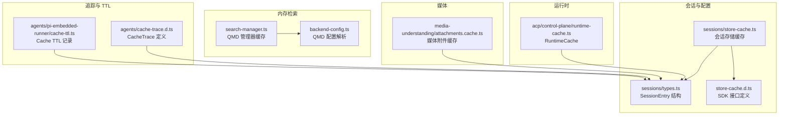
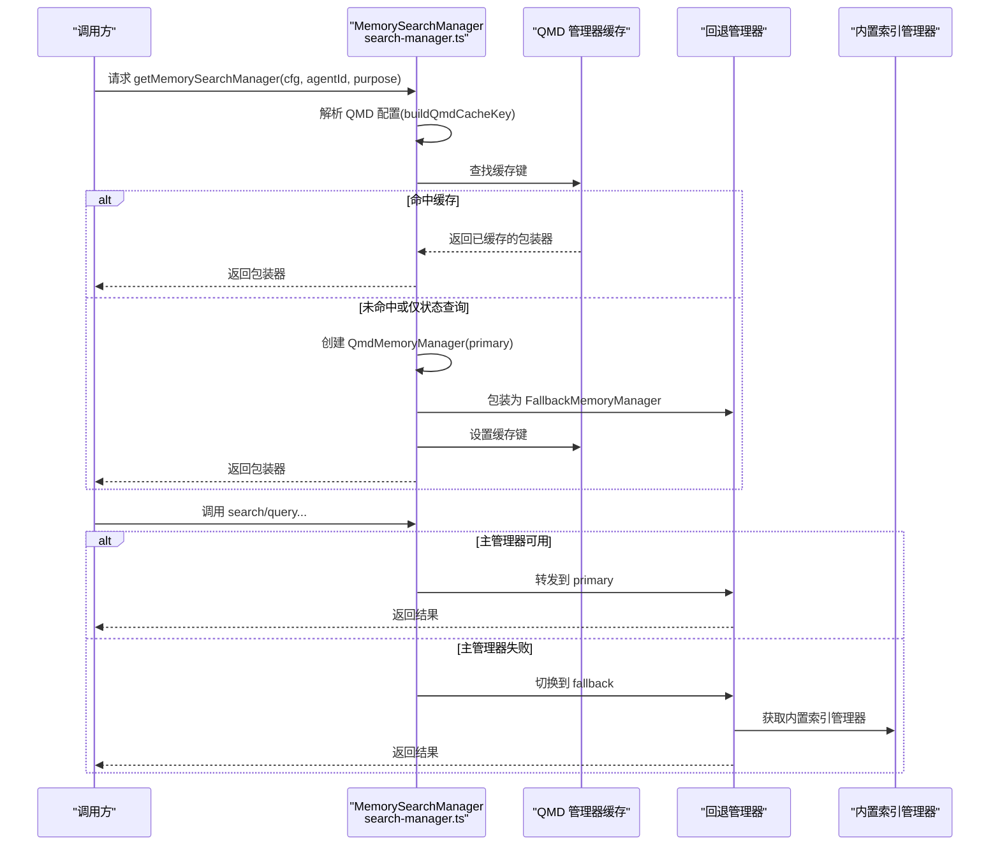
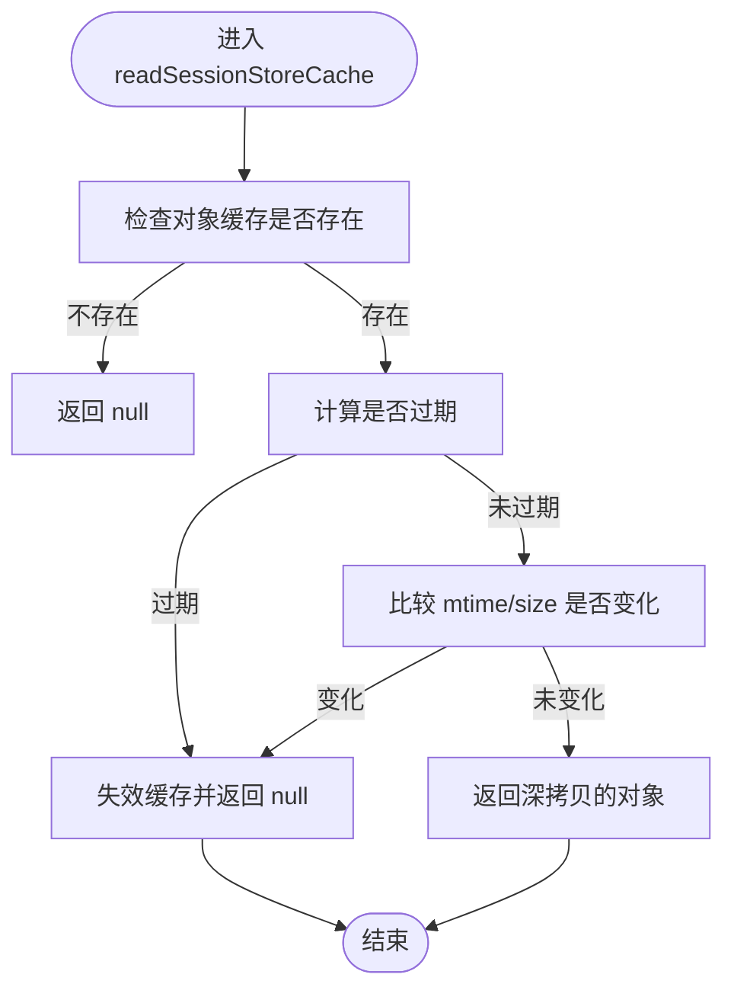
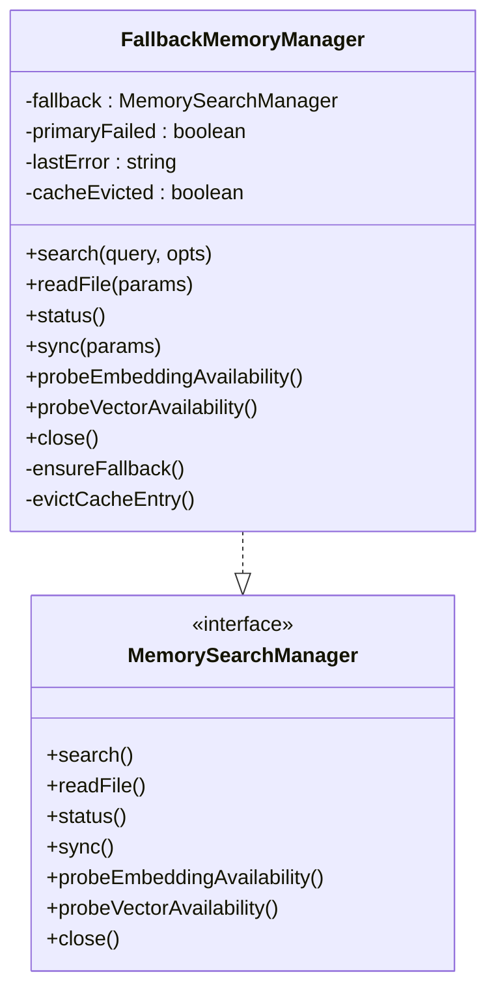
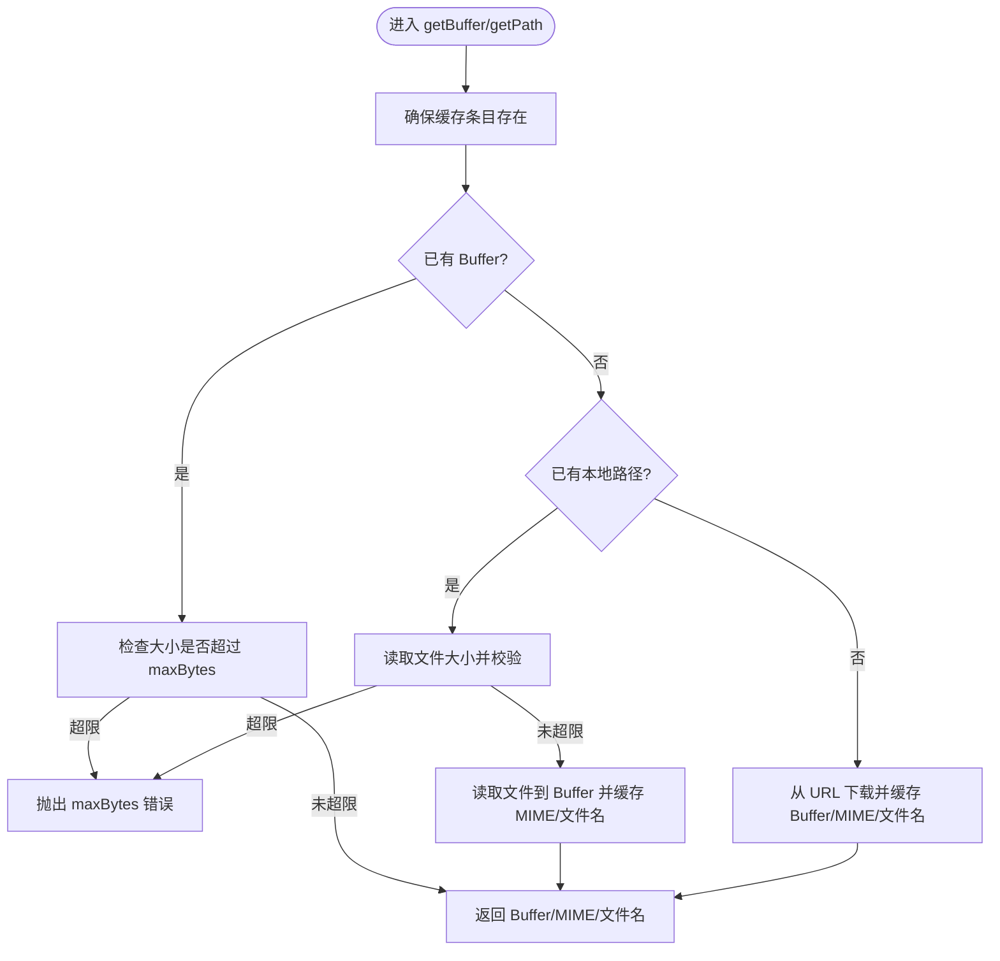
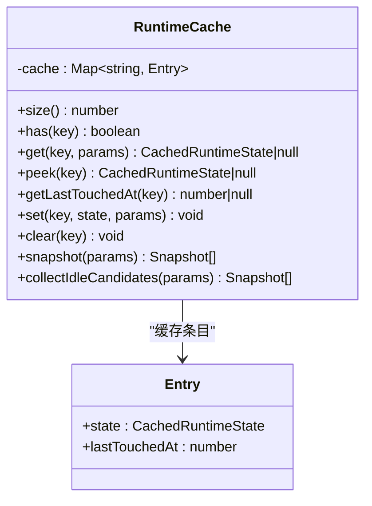
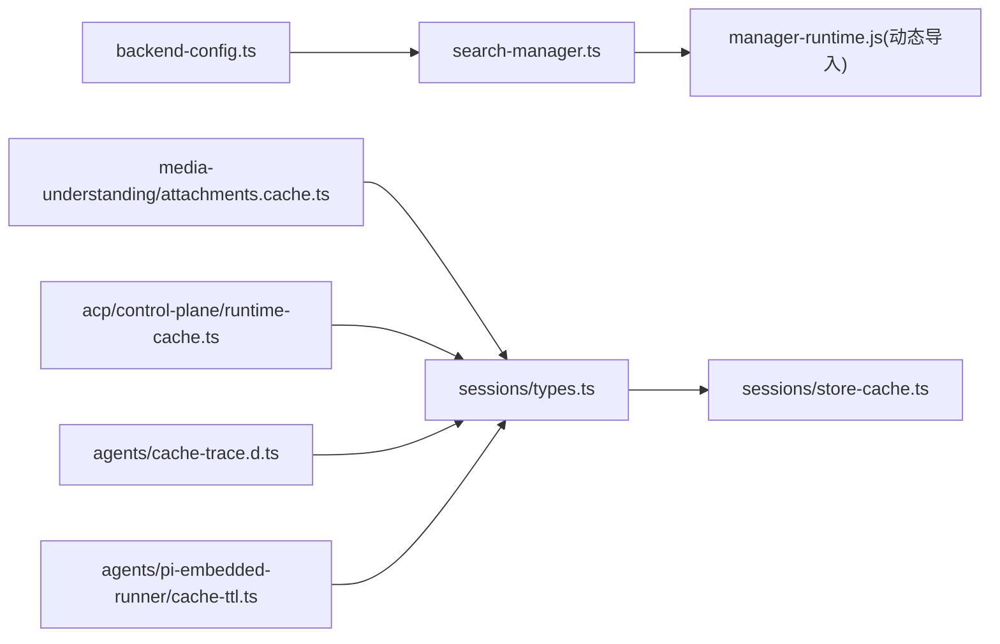

# 缓存策略

<cite>
**本文引用的文件**
- [src/memory/search-manager.ts](file://src/memory/search-manager.ts)
- [src/memory/backend-config.ts](file://src/memory/backend-config.ts)
- [src/config/sessions/types.ts](file://src/config/sessions/types.ts)
- [src/config/sessions/store-cache.ts](file://src/config/sessions/store-cache.ts)
- [src/config/sessions/cache-fields.test.ts](file://src/config/sessions/cache-fields.test.ts)
- [src/acp/control-plane/runtime-cache.ts](file://src/acp/control-plane/runtime-cache.ts)
- [dist/plugin-sdk/agents/cache-trace.d.ts](file://dist/plugin-sdk/agents/cache-trace.d.ts)
- [dist/plugin-sdk/config/sessions/store-cache.d.ts](file://dist/plugin-sdk/config/sessions/store-cache.d.ts)
- [src/media-understanding/attachments.cache.ts](file://src/media-understanding/attachments.cache.ts)
- [src/agents/pi-embedded-runner/cache-ttl.ts](file://src/agents/pi-embedded-runner/cache-ttl.ts)
</cite>

## 目录

1. [引言](#引言)
2. [项目结构](#项目结构)
3. [核心组件](#核心组件)
4. [架构总览](#架构总览)
5. [详细组件分析](#详细组件分析)
6. [依赖关系分析](#依赖关系分析)
7. [性能考量](#性能考量)
8. [故障排查指南](#故障排查指南)
9. [结论](#结论)
10. [附录](#附录)

## 引言

本文件系统化阐述 OpenClaw 的多级缓存架构与策略，覆盖会话缓存、配置缓存、模型缓存（内存检索）、媒体缓存与运行时缓存等模块，并给出缓存算法选择、失效策略、性能调优、命中率优化与一致性保障方法，以及监控指标与故障排查建议。目标是帮助开发者在不同平台与场景下正确使用与扩展缓存能力。

## 项目结构

OpenClaw 的缓存分布在多个子系统中：

- 内存检索缓存：基于 QMD 管理器的进程内缓存与降级包装器
- 会话缓存：会话存储对象与序列化缓存
- 运行时缓存：ACP 运行时状态的内存缓存与空闲回收
- 媒体缓存：附件下载与本地路径解析的缓冲与临时文件管理
- 配置与追踪：缓存字段、缓存追踪与 TTL 记录

**图表来源**

- [src/memory/search-manager.ts:1-253](file://src/memory/search-manager.ts#L1-L253)
- [src/memory/backend-config.ts:1-355](file://src/memory/backend-config.ts#L1-L355)
- [src/config/sessions/types.ts:1-380](file://src/config/sessions/types.ts#L1-L380)
- [src/config/sessions/store-cache.ts:1-100](file://src/config/sessions/store-cache.ts#L1-L100)
- [src/acp/control-plane/runtime-cache.ts:1-100](file://src/acp/control-plane/runtime-cache.ts#L1-L100)
- [src/media-understanding/attachments.cache.ts:1-324](file://src/media-understanding/attachments.cache.ts#L1-L324)
- [dist/plugin-sdk/agents/cache-trace.d.ts:1-50](file://dist/plugin-sdk/agents/cache-trace.d.ts#L1-L50)
- [src/agents/pi-embedded-runner/cache-ttl.ts:1-100](file://src/agents/pi-embedded-runner/cache-ttl.ts#L1-L100)

**章节来源**

- [src/memory/search-manager.ts:1-253](file://src/memory/search-manager.ts#L1-L253)
- [src/memory/backend-config.ts:1-355](file://src/memory/backend-config.ts#L1-L355)
- [src/config/sessions/types.ts:1-380](file://src/config/sessions/types.ts#L1-L380)
- [src/config/sessions/store-cache.ts:1-100](file://src/config/sessions/store-cache.ts#L1-L100)
- [src/acp/control-plane/runtime-cache.ts:1-100](file://src/acp/control-plane/runtime-cache.ts#L1-L100)
- [src/media-understanding/attachments.cache.ts:1-324](file://src/media-understanding/attachments.cache.ts#L1-L324)
- [dist/plugin-sdk/agents/cache-trace.d.ts:1-50](file://dist/plugin-sdk/agents/cache-trace.d.ts#L1-L50)
- [src/agents/pi-embedded-runner/cache-ttl.ts:1-100](file://src/agents/pi-embedded-runner/cache-ttl.ts#L1-L100)

## 核心组件

- 内存检索缓存（QMD 管理器）：通过进程内 Map 缓存管理器实例，支持主备切换与缓存剔除
- 会话缓存：对会话存储对象与序列化内容进行 TTL 控制与变更感知失效
- 运行时缓存（RuntimeCache）：按 actorKey 缓存 ACP 运行时状态，支持 touch 与空闲回收
- 媒体缓存：附件缓冲（Buffer/MIME/文件名）、本地路径解析与临时文件清理
- 缓存追踪与 TTL：记录缓存阶段事件与写入 TTL 时间戳，辅助诊断与一致性校验

**章节来源**

- [src/memory/search-manager.ts:104-246](file://src/memory/search-manager.ts#L104-L246)
- [src/config/sessions/store-cache.ts:41-81](file://src/config/sessions/store-cache.ts#L41-L81)
- [src/acp/control-plane/runtime-cache.ts:25-99](file://src/acp/control-plane/runtime-cache.ts#L25-L99)
- [src/media-understanding/attachments.cache.ts:61-324](file://src/media-understanding/attachments.cache.ts#L61-L324)
- [dist/plugin-sdk/agents/cache-trace.d.ts:29-48](file://dist/plugin-sdk/agents/cache-trace.d.ts#L29-L48)
- [src/agents/pi-embedded-runner/cache-ttl.ts:38-76](file://src/agents/pi-embedded-runner/cache-ttl.ts#L38-L76)

## 架构总览

OpenClaw 的缓存采用“多级 + 多源”策略：

- 进程内缓存：QMD 管理器、RuntimeCache、媒体附件缓存
- 文件/对象缓存：会话存储对象与序列化缓存
- 降级与一致性：主备切换、TTL 与变更检测、清理回调
- 可观测性：缓存追踪事件与 TTL 记录

**图表来源**

- [src/memory/search-manager.ts:25-102](file://src/memory/search-manager.ts#L25-L102)
- [src/memory/search-manager.ts:104-246](file://src/memory/search-manager.ts#L104-L246)
- [src/memory/backend-config.ts:297-354](file://src/memory/backend-config.ts#L297-L354)

**章节来源**

- [src/memory/search-manager.ts:1-253](file://src/memory/search-manager.ts#L1-L253)
- [src/memory/backend-config.ts:1-355](file://src/memory/backend-config.ts#L1-L355)

## 详细组件分析

### 会话缓存（Session Store Cache）

- 设计要点
  - 对会话存储对象与序列化字符串分别缓存，支持 TTL 与 mtime/size 变更感知失效
  - 提供读写接口与缓存清空/失效工具函数
- 关键行为
  - 读取：若缓存未过期且文件元信息一致则返回克隆后的对象
  - 写入：保存对象、时间戳、mtime、size 与可选序列化字符串
  - 清理：按 storePath 删除对象缓存与序列化缓存
- 会话条目中的缓存统计字段
  - cacheRead、cacheWrite 支持在会话条目中记录读写次数，便于统计与诊断

**图表来源**

- [src/config/sessions/store-cache.ts:41-81](file://src/config/sessions/store-cache.ts#L41-L81)

**章节来源**

- [src/config/sessions/store-cache.ts:1-100](file://src/config/sessions/store-cache.ts#L1-L100)
- [src/config/sessions/types.ts:138-139](file://src/config/sessions/types.ts#L138-L139)
- [src/config/sessions/cache-fields.test.ts:1-69](file://src/config/sessions/cache-fields.test.ts#L1-L69)

### 配置缓存（Session Store Serialized Cache）

- 设计要点
  - SDK 层提供统一的缓存接口声明，包括读写、失效与对象缓存删除
- 使用场景
  - 在 CLI 或网关层对会话存储进行序列化缓存以减少 IO

**章节来源**

- [dist/plugin-sdk/config/sessions/store-cache.d.ts:1-20](file://dist/plugin-sdk/config/sessions/store-cache.d.ts#L1-L20)

### 模型缓存（内存检索：QMD 管理器）

- 设计要点
  - 进程内 Map 缓存 QMD 管理器实例，键由 agentId 与稳定序列化的 QMD 配置组成
  - 包装器支持主备切换：主管理器异常时切换到内置索引管理器，并在关闭时剔除缓存项
- 失效策略
  - 主管理器失败后，包装器记录错误并切换；关闭时触发 evictCacheEntry 回调，从缓存中移除
  - 状态查询时可仅获取状态而不写入缓存，避免污染缓存

**图表来源**

- [src/memory/search-manager.ts:104-246](file://src/memory/search-manager.ts#L104-L246)

**章节来源**

- [src/memory/search-manager.ts:1-253](file://src/memory/search-manager.ts#L1-L253)
- [src/memory/backend-config.ts:248-252](file://src/memory/backend-config.ts#L248-L252)

### 媒体缓存（MediaAttachmentCache）

- 设计要点
  - 以附件索引为键的进程内缓存，支持 Buffer/MIME/文件名与本地路径解析
  - 支持从 URL 下载、本地路径校验与临时文件落盘，提供清理回调
  - 通过最大字节数限制与超时控制，避免资源滥用
- 失效策略
  - 生命周期结束时统一清理临时文件
  - 本地路径不在允许根目录范围内时主动清空路径，避免越权访问

**图表来源**

- [src/media-understanding/attachments.cache.ts:75-219](file://src/media-understanding/attachments.cache.ts#L75-L219)

**章节来源**

- [src/media-understanding/attachments.cache.ts:1-324](file://src/media-understanding/attachments.cache.ts#L1-L324)

### 运行时缓存（RuntimeCache）

- 设计要点
  - 以 actorKey 为键的 Map 缓存，记录 lastTouchedAt，支持 touch 与 peek
  - 提供快照与空闲候选收集，用于周期性回收
- 失效策略
  - 通过 collectIdleCandidates 按最大空闲时间筛选候选，结合上层调度执行清理

**图表来源**

- [src/acp/control-plane/runtime-cache.ts:25-99](file://src/acp/control-plane/runtime-cache.ts#L25-L99)

**章节来源**

- [src/acp/control-plane/runtime-cache.ts:1-100](file://src/acp/control-plane/runtime-cache.ts#L1-L100)

### 缓存追踪与 TTL

- 缓存追踪（CacheTrace）
  - 定义缓存阶段事件与写入器，支持按阶段记录运行时上下文与消息摘要
- TTL 记录（Cache TTL）
  - 从会话管理器读取最后 TTL 时间戳，或追加新的 TTL 条目，用于一致性校验与重放控制

**章节来源**

- [dist/plugin-sdk/agents/cache-trace.d.ts:1-50](file://dist/plugin-sdk/agents/cache-trace.d.ts#L1-L50)
- [src/agents/pi-embedded-runner/cache-ttl.ts:38-76](file://src/agents/pi-embedded-runner/cache-ttl.ts#L38-L76)

## 依赖关系分析

- 组件耦合
  - search-manager 依赖 backend-config 生成缓存键，依赖 manager-runtime 动态加载回退实现
  - 会话缓存依赖 sessions/types 中的 SessionEntry 结构与合并策略
  - 媒体缓存依赖媒体理解与路径策略模块
  - 运行时缓存独立于业务逻辑，仅依赖 ACP 类型
- 外部依赖
  - Node FS 与 URL/Request API 用于媒体下载与文件操作
  - 日志与全局开关用于调试与安全策略

**图表来源**

- [src/memory/backend-config.ts:297-354](file://src/memory/backend-config.ts#L297-L354)
- [src/memory/search-manager.ts:15-18](file://src/memory/search-manager.ts#L15-L18)
- [src/config/sessions/types.ts:68-171](file://src/config/sessions/types.ts#L68-L171)
- [src/config/sessions/store-cache.ts:1-100](file://src/config/sessions/store-cache.ts#L1-L100)
- [src/media-understanding/attachments.cache.ts:1-324](file://src/media-understanding/attachments.cache.ts#L1-L324)
- [src/acp/control-plane/runtime-cache.ts:1-100](file://src/acp/control-plane/runtime-cache.ts#L1-L100)
- [src/agents/pi-embedded-runner/cache-ttl.ts:1-100](file://src/agents/pi-embedded-runner/cache-ttl.ts#L1-L100)

**章节来源**

- [src/memory/search-manager.ts:1-253](file://src/memory/search-manager.ts#L1-L253)
- [src/config/sessions/types.ts:1-380](file://src/config/sessions/types.ts#L1-L380)
- [src/media-understanding/attachments.cache.ts:1-324](file://src/media-understanding/attachments.cache.ts#L1-L324)
- [src/acp/control-plane/runtime-cache.ts:1-100](file://src/acp/control-plane/runtime-cache.ts#L1-L100)
- [src/agents/pi-embedded-runner/cache-ttl.ts:1-100](file://src/agents/pi-embedded-runner/cache-ttl.ts#L1-L100)

## 性能考量

- 缓存算法选择
  - LRU/LFU 未直接实现；当前采用“键值映射 + 手动剔除”的简单策略，适合高并发短生命周期对象
- 失效策略
  - QMD 管理器：主失败即剔除缓存键，下次请求重建
  - 会话存储：TTL + mtime/size 变更双重失效
  - 媒体附件：生命周期结束统一清理临时文件
  - 运行时缓存：按空闲时间收集候选，周期性回收
- 命中率优化
  - 合理设置 TTL：避免过短导致频繁重建，过长导致数据陈旧
  - 使用稳定的缓存键：QMD 配置解析保证字段顺序稳定，减少键抖动
  - 降低回退频率：优先修复主管理器问题，减少切换成本
- 一致性保证
  - 通过 TTL 与变更检测（mtime/size）确保缓存与磁盘状态一致
  - 缓存追踪事件可用于定位不一致环节

[本节为通用指导，无需列出具体文件来源]

## 故障排查指南

- 内存检索缓存
  - 症状：search 抛错后切换到内置索引，但后续仍走回退
  - 排查：确认主管理器是否抛出异常并触发 evictCacheEntry；检查日志中的“qmd memory failed”提示
- 会话存储缓存
  - 症状：读取到空或旧数据
  - 排查：检查 TTL 是否过期；核对 mtime/size 是否变化；必要时调用失效接口
- 媒体附件缓存
  - 症状：下载超时或超出 maxBytes
  - 排查：调整超时与 maxBytes；检查本地路径是否在允许根目录内；确认临时文件清理是否成功
- 运行时缓存
  - 症状：内存占用持续增长
  - 排查：检查 collectIdleCandidates 的阈值与调度频率；确认清理流程是否执行
- 缓存追踪与 TTL
  - 症状：一致性问题或重放异常
  - 排查：启用 CacheTrace 并观察阶段事件；读取最后 TTL 时间戳进行比对

**章节来源**

- [src/memory/search-manager.ts:104-246](file://src/memory/search-manager.ts#L104-L246)
- [src/config/sessions/store-cache.ts:41-81](file://src/config/sessions/store-cache.ts#L41-L81)
- [src/media-understanding/attachments.cache.ts:75-219](file://src/media-understanding/attachments.cache.ts#L75-L219)
- [src/acp/control-plane/runtime-cache.ts:78-99](file://src/acp/control-plane/runtime-cache.ts#L78-L99)
- [src/agents/pi-embedded-runner/cache-ttl.ts:38-76](file://src/agents/pi-embedded-runner/cache-ttl.ts#L38-L76)

## 结论

OpenClaw 的缓存体系以“进程内键值缓存 + 多级降级 + TTL/变更感知 + 可观测性”为核心，兼顾性能与一致性。通过合理配置 TTL、稳定缓存键与空闲回收策略，可在多平台与多场景下获得稳定表现。建议在生产环境启用缓存追踪与 TTL 记录，配合定期清理与容量评估，持续优化命中率与资源占用。

[本节为总结性内容，无需列出具体文件来源]

## 附录

- 相关类型与接口
  - SessionEntry：包含 cacheRead、cacheWrite 等缓存统计字段
  - CacheTrace：缓存阶段事件与写入器定义
  - RuntimeCache：运行时状态缓存与空闲回收

**章节来源**

- [src/config/sessions/types.ts:138-139](file://src/config/sessions/types.ts#L138-L139)
- [dist/plugin-sdk/agents/cache-trace.d.ts:29-48](file://dist/plugin-sdk/agents/cache-trace.d.ts#L29-L48)
- [src/acp/control-plane/runtime-cache.ts:25-99](file://src/acp/control-plane/runtime-cache.ts#L25-L99)
