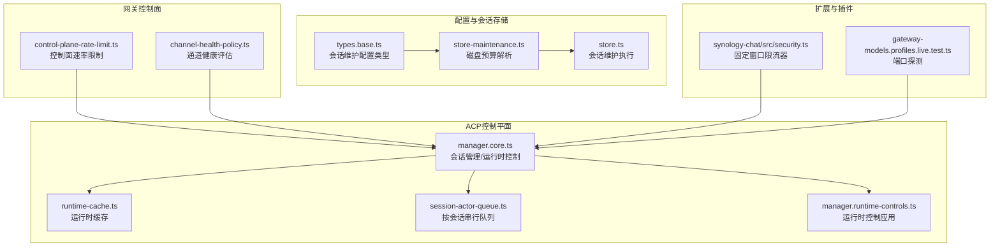
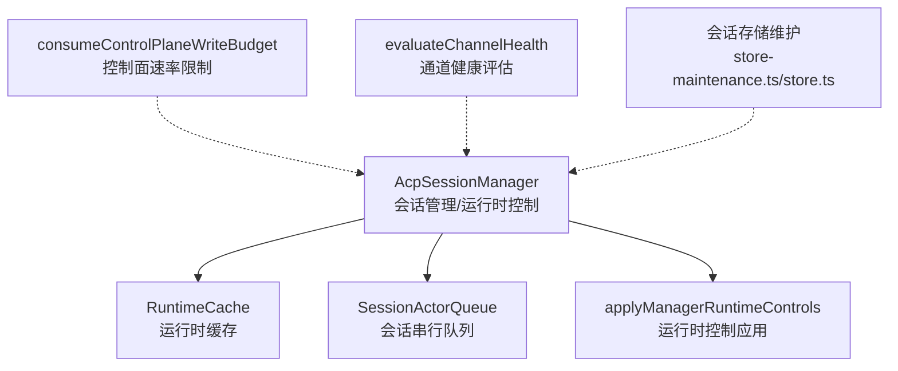
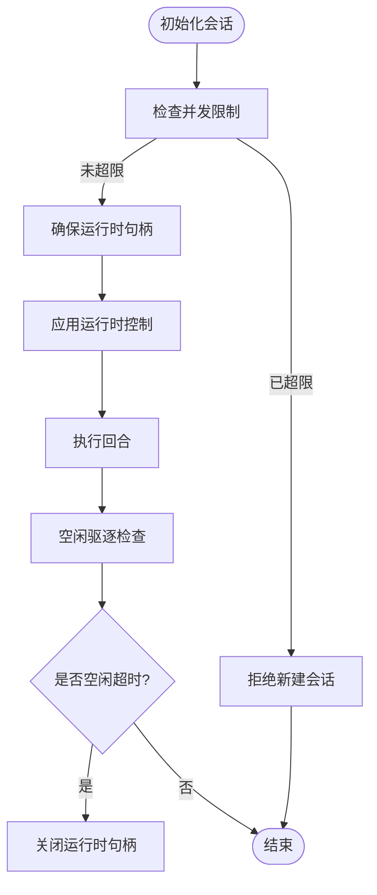
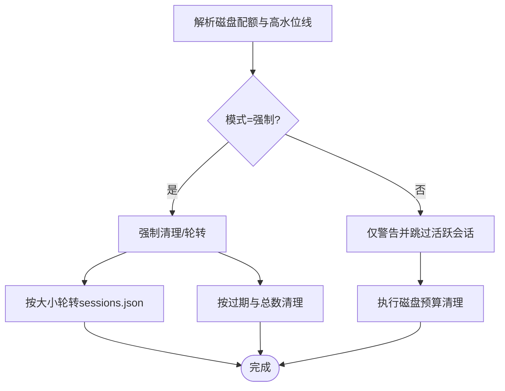
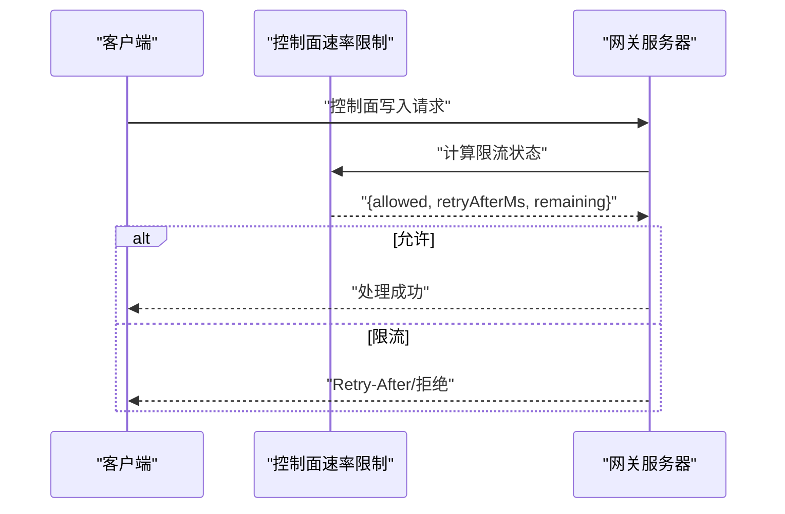
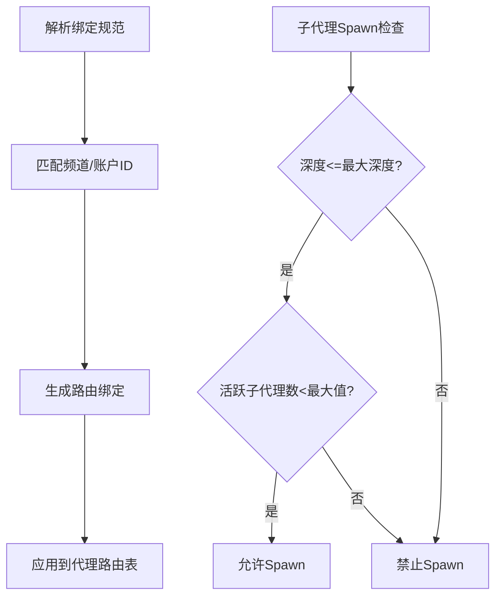
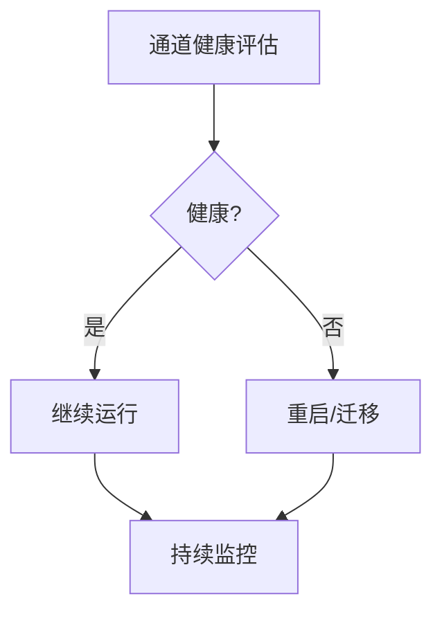
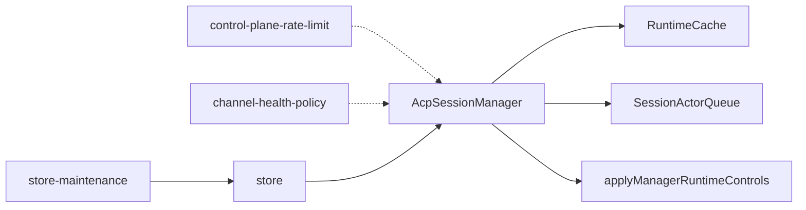

# 资源调度

<cite>
**本文引用的文件**
- [src/acp/control-plane/manager.core.ts](file://src/acp/control-plane/manager.core.ts)
- [src/acp/control-plane/runtime-cache.ts](file://src/acp/control-plane/runtime-cache.ts)
- [src/acp/control-plane/session-actor-queue.ts](file://src/acp/control-plane/session-actor-queue.ts)
- [src/acp/control-plane/manager.runtime-controls.ts](file://src/acp/control-plane/manager.runtime-controls.ts)
- [src/gateway/control-plane-rate-limit.ts](file://src/gateway/control-plane-rate-limit.ts)
- [src/gateway/channel-health-policy.ts](file://src/gateway/channel-health-policy.ts)
- [src/config/types.base.ts](file://src/config/types.base.ts)
- [src/config/sessions/store-maintenance.ts](file://src/config/sessions/store-maintenance.ts)
- [src/config/sessions/store.ts](file://src/config/sessions/store.ts)
- [src/agents/subagent-spawn.ts](file://src/agents/subagent-spawn.ts)
- [src/commands/agents.bindings.ts](file://src/commands/agents.bindings.ts)
- [extensions/synology-chat/src/security.ts](file://extensions/synology-chat/src/security.ts)
- [src/gateway/gateway-models.profiles.live.test.ts](file://src/gateway/gateway-models.profiles.live.test.ts)
- [docs/install/render.mdx](file://docs/install/render.mdx)
</cite>

## 目录

1. [简介](#简介)
2. [项目结构](#项目结构)
3. [核心组件](#核心组件)
4. [架构总览](#架构总览)
5. [详细组件分析](#详细组件分析)
6. [依赖关系分析](#依赖关系分析)
7. [性能考量](#性能考量)
8. [故障排查指南](#故障排查指南)
9. [结论](#结论)
10. [附录](#附录)

## 简介

本文件聚焦OpenClaw在“资源调度”方面的设计与实现，覆盖CPU资源分配（会话并发与运行时缓存）、I/O资源管理（会话存储维护与磁盘配额）、网络资源调度（网关速率限制与通道健康策略）三大维度。同时阐述代理资源池管理、通道资源分配与网关负载均衡的实现原理，并提供资源使用监控、资源限制配置与资源争用解决方法，以及面向大规模部署的资源规划与扩缩容策略。

## 项目结构

围绕资源调度的关键模块分布于以下路径：

- ACP控制平面：会话生命周期、运行时缓存、并发队列与运行时控制应用
- 网关控制面：速率限制、通道健康评估与重启决策
- 配置与会话存储：会话维护策略、磁盘预算与高水位线
- 扩展与插件：限流器示例、端口探测测试
- 文档与安装：部署蓝图与环境变量

**图表来源**

- [src/acp/control-plane/manager.core.ts:72-144](file://src/acp/control-plane/manager.core.ts#L72-L144)
- [src/acp/control-plane/runtime-cache.ts:25-99](file://src/acp/control-plane/runtime-cache.ts#L25-L99)
- [src/acp/control-plane/session-actor-queue.ts:3-38](file://src/acp/control-plane/session-actor-queue.ts#L3-L38)
- [src/acp/control-plane/manager.runtime-controls.ts:44-84](file://src/acp/control-plane/manager.runtime-controls.ts#L44-L84)
- [src/gateway/control-plane-rate-limit.ts:1-87](file://src/gateway/control-plane-rate-limit.ts#L1-L87)
- [src/gateway/channel-health-policy.ts:1-149](file://src/gateway/channel-health-policy.ts#L1-L149)
- [src/config/types.base.ts:140-166](file://src/config/types.base.ts#L140-L166)
- [src/config/sessions/store-maintenance.ts:80-124](file://src/config/sessions/store-maintenance.ts#L80-L124)
- [src/config/sessions/store.ts:353-392](file://src/config/sessions/store.ts#L353-L392)
- [extensions/synology-chat/src/security.ts:92-124](file://extensions/synology-chat/src/security.ts#L92-L124)
- [src/gateway/gateway-models.profiles.live.test.ts:448-475](file://src/gateway/gateway-models.profiles.live.test.ts#L448-L475)

**章节来源**

- [src/acp/control-plane/manager.core.ts:72-144](file://src/acp/control-plane/manager.core.ts#L72-L144)
- [src/gateway/control-plane-rate-limit.ts:1-87](file://src/gateway/control-plane-rate-limit.ts#L1-L87)
- [src/gateway/channel-health-policy.ts:1-149](file://src/gateway/channel-health-policy.ts#L1-L149)
- [src/config/types.base.ts:140-166](file://src/config/types.base.ts#L140-L166)
- [src/config/sessions/store-maintenance.ts:80-124](file://src/config/sessions/store-maintenance.ts#L80-L124)
- [src/config/sessions/store.ts:353-392](file://src/config/sessions/store.ts#L353-L392)

## 核心组件

- ACP会话管理器：负责会话初始化、状态查询、运行时模式切换、配置项设置、运行时选项更新与回收、并发限制与观察性快照等。
- 运行时缓存：以会话为键缓存运行时句柄与元数据，支持空闲驱逐、最后触达时间统计与快照导出。
- 会话Actor队列：基于键控异步队列，确保同一会话的任务串行执行，避免并发冲突。
- 运行时控制应用：从会话元数据推导运行时控制签名，按能力集应用模式与配置变更。
- 控制面速率限制：针对网关控制面写入操作进行固定窗口限流，支持客户端标识与连接ID回退。
- 通道健康策略：对通道运行状态、忙碌度、事件时效与重连尝试进行综合评估，决定是否重启或标记为健康/不健康。
- 会话存储维护：解析磁盘配额与高水位线，按策略执行清理与轮转，支持“警告模式”与“强制模式”。

**章节来源**

- [src/acp/control-plane/manager.core.ts:211-317](file://src/acp/control-plane/manager.core.ts#L211-L317)
- [src/acp/control-plane/runtime-cache.ts:25-99](file://src/acp/control-plane/runtime-cache.ts#L25-L99)
- [src/acp/control-plane/session-actor-queue.ts:3-38](file://src/acp/control-plane/session-actor-queue.ts#L3-L38)
- [src/acp/control-plane/manager.runtime-controls.ts:44-84](file://src/acp/control-plane/manager.runtime-controls.ts#L44-L84)
- [src/gateway/control-plane-rate-limit.ts:21-80](file://src/gateway/control-plane-rate-limit.ts#L21-L80)
- [src/gateway/channel-health-policy.ts:57-132](file://src/gateway/channel-health-policy.ts#L57-L132)
- [src/config/sessions/store-maintenance.ts:80-124](file://src/config/sessions/store-maintenance.ts#L80-L124)

## 架构总览

下图展示资源调度在系统中的交互关系：会话管理器协调运行时缓存与队列，应用运行时控制；网关侧通过速率限制保护控制面；通道健康策略保障消息通道可用性；会话存储维护确保磁盘空间可控。

**图表来源**

- [src/acp/control-plane/manager.core.ts:395-447](file://src/acp/control-plane/manager.core.ts#L395-L447)
- [src/acp/control-plane/runtime-cache.ts:78-99](file://src/acp/control-plane/runtime-cache.ts#L78-L99)
- [src/acp/control-plane/session-actor-queue.ts:23-37](file://src/acp/control-plane/session-actor-queue.ts#L23-L37)
- [src/acp/control-plane/manager.runtime-controls.ts:44-84](file://src/acp/control-plane/manager.runtime-controls.ts#L44-L84)
- [src/gateway/control-plane-rate-limit.ts:34-80](file://src/gateway/control-plane-rate-limit.ts#L34-L80)
- [src/gateway/channel-health-policy.ts:57-132](file://src/gateway/channel-health-policy.ts#L57-L132)
- [src/config/sessions/store.ts:353-392](file://src/config/sessions/store.ts#L353-L392)

## 详细组件分析

### CPU资源分配：会话并发与运行时缓存

- 并发限制：在初始化会话前检查当前活跃运行时数量与最大并发配置，超过阈值则拒绝新建会话，防止CPU与内存过载。
- 串行化执行：同一会话的所有操作通过键控队列串行化，避免多任务竞争同一运行时资源。
- 空闲驱逐：根据配置的空闲超时阈值，周期性扫描并关闭长时间未使用的运行时句柄，释放CPU与内存占用。
- 观测性：记录回合耗时、错误码分布与队列深度，辅助容量规划与瓶颈定位。

**图表来源**

- [src/acp/control-plane/manager.core.ts:1061-1078](file://src/acp/control-plane/manager.core.ts#L1061-L1078)
- [src/acp/control-plane/session-actor-queue.ts:23-37](file://src/acp/control-plane/session-actor-queue.ts#L23-L37)
- [src/acp/control-plane/runtime-cache.ts:92-99](file://src/acp/control-plane/runtime-cache.ts#L92-L99)
- [src/acp/control-plane/manager.core.ts:1097-1139](file://src/acp/control-plane/manager.core.ts#L1097-L1139)

**章节来源**

- [src/acp/control-plane/manager.core.ts:1061-1078](file://src/acp/control-plane/manager.core.ts#L1061-L1078)
- [src/acp/control-plane/session-actor-queue.ts:11-21](file://src/acp/control-plane/session-actor-queue.ts#L11-L21)
- [src/acp/control-plane/runtime-cache.ts:92-99](file://src/acp/control-plane/runtime-cache.ts#L92-L99)

### I/O资源管理：会话存储维护与磁盘配额

- 配置解析：支持最大磁盘字节与高水位线字节，自动计算默认高水位线，避免超出上限。
- 维护策略：支持“警告模式”与“强制模式”，在警告模式下避免影响活跃会话，强制模式下按规则清理与轮转。
- 会话清理：按过期时间与总数上限清理会话条目，结合磁盘预算回收空间。

**图表来源**

- [src/config/sessions/store-maintenance.ts:80-124](file://src/config/sessions/store-maintenance.ts#L80-L124)
- [src/config/sessions/store.ts:353-392](file://src/config/sessions/store.ts#L353-L392)
- [src/config/types.base.ts:140-166](file://src/config/types.base.ts#L140-L166)

**章节来源**

- [src/config/sessions/store-maintenance.ts:80-124](file://src/config/sessions/store-maintenance.ts#L80-L124)
- [src/config/sessions/store.ts:353-392](file://src/config/sessions/store.ts#L353-L392)
- [src/config/types.base.ts:140-166](file://src/config/types.base.ts#L140-L166)

### 网络资源调度：控制面速率限制与通道健康策略

- 控制面速率限制：固定窗口限流，按设备ID与客户端IP生成键，必要时回退到连接ID，限制控制面写入频率，避免突发写入导致网关拥塞。
- 通道健康评估：综合运行状态、忙碌度、事件时效、启动宽限期与重连尝试次数，判定通道健康与重启原因，保障消息链路稳定。
- 端口探测：在本地测试中探测可用端口块，避免端口冲突，保证网关服务可稳定启动。

**图表来源**

- [src/gateway/control-plane-rate-limit.ts:34-80](file://src/gateway/control-plane-rate-limit.ts#L34-L80)

**章节来源**

- [src/gateway/control-plane-rate-limit.ts:21-80](file://src/gateway/control-plane-rate-limit.ts#L21-L80)
- [src/gateway/channel-health-policy.ts:57-132](file://src/gateway/channel-health-policy.ts#L57-L132)
- [src/gateway/gateway-models.profiles.live.test.ts:448-475](file://src/gateway/gateway-models.profiles.live.test.ts#L448-L475)

### 代理资源池管理与通道资源分配

- 代理绑定解析：将绑定规范解析为路由绑定，支持按频道与账户ID匹配，便于将消息路由至指定代理实例。
- 子代理 Spawn 限制：限制子代理最大生成深度与每个会话的最大活跃子代理数，避免递归调用导致资源耗尽。
- 速率限制器：扩展层提供固定窗口限流器，可用于通道侧的用户级请求节流，缓解瞬时洪峰。

**图表来源**

- [src/commands/agents.bindings.ts:288-326](file://src/commands/agents.bindings.ts#L288-L326)
- [src/agents/subagent-spawn.ts:315-332](file://src/agents/subagent-spawn.ts#L315-L332)
- [extensions/synology-chat/src/security.ts:92-124](file://extensions/synology-chat/src/security.ts#L92-L124)

**章节来源**

- [src/commands/agents.bindings.ts:161-326](file://src/commands/agents.bindings.ts#L161-L326)
- [src/agents/subagent-spawn.ts:315-332](file://src/agents/subagent-spawn.ts#L315-L332)
- [extensions/synology-chat/src/security.ts:92-124](file://extensions/synology-chat/src/security.ts#L92-L124)

### 网关负载均衡与资源争用解决

- 负载均衡：通过通道健康评估与重启原因决策，动态调整通道实例的重启与迁移，间接实现跨实例的负载分担。
- 争用解决：会话串行队列确保同一会话内任务串行化，避免并发写入冲突；控制面限流抑制突发写入；运行时空闲驱逐释放闲置资源。

**图表来源**

- [src/gateway/channel-health-policy.ts:57-132](file://src/gateway/channel-health-policy.ts#L57-L132)

**章节来源**

- [src/gateway/channel-health-policy.ts:57-132](file://src/gateway/channel-health-policy.ts#L57-L132)
- [src/acp/control-plane/session-actor-queue.ts:23-37](file://src/acp/control-plane/session-actor-queue.ts#L23-L37)
- [src/gateway/control-plane-rate-limit.ts:34-80](file://src/gateway/control-plane-rate-limit.ts#L34-L80)

## 依赖关系分析

- ACP会话管理器依赖运行时缓存与会话队列，用于并发控制与资源回收；依赖运行时控制应用以同步会话元数据到运行时。
- 网关控制面通过速率限制保护控制面写入，通道健康策略为通道实例的可用性提供依据。
- 会话存储维护依赖配置解析模块，按策略执行清理与轮转，避免磁盘空间不足引发I/O争用。

**图表来源**

- [src/acp/control-plane/manager.core.ts:72-144](file://src/acp/control-plane/manager.core.ts#L72-L144)
- [src/acp/control-plane/runtime-cache.ts:25-99](file://src/acp/control-plane/runtime-cache.ts#L25-L99)
- [src/acp/control-plane/session-actor-queue.ts:3-38](file://src/acp/control-plane/session-actor-queue.ts#L3-L38)
- [src/acp/control-plane/manager.runtime-controls.ts:44-84](file://src/acp/control-plane/manager.runtime-controls.ts#L44-L84)
- [src/gateway/control-plane-rate-limit.ts:1-87](file://src/gateway/control-plane-rate-limit.ts#L1-L87)
- [src/gateway/channel-health-policy.ts:1-149](file://src/gateway/channel-health-policy.ts#L1-L149)
- [src/config/sessions/store-maintenance.ts:80-124](file://src/config/sessions/store-maintenance.ts#L80-L124)
- [src/config/sessions/store.ts:353-392](file://src/config/sessions/store.ts#L353-L392)

**章节来源**

- [src/acp/control-plane/manager.core.ts:72-144](file://src/acp/control-plane/manager.core.ts#L72-L144)
- [src/gateway/control-plane-rate-limit.ts:1-87](file://src/gateway/control-plane-rate-limit.ts#L1-L87)
- [src/gateway/channel-health-policy.ts:1-149](file://src/gateway/channel-health-policy.ts#L1-L149)
- [src/config/sessions/store-maintenance.ts:80-124](file://src/config/sessions/store-maintenance.ts#L80-L124)
- [src/config/sessions/store.ts:353-392](file://src/config/sessions/store.ts#L353-L392)

## 性能考量

- CPU：通过并发限制与空闲驱逐控制运行时数量，避免峰值时段过度分配；串行队列降低上下文切换与锁竞争。
- I/O：磁盘预算与高水位线配合定期清理与轮转，减少碎片化与大文件带来的I/O抖动。
- 网络：控制面限流抑制突发写入，通道健康策略避免半死连接占用带宽与连接数。
- 可观测性：回合耗时、错误码统计与队列深度有助于识别热点与瓶颈，指导扩容与参数调优。

## 故障排查指南

- 会话初始化失败（并发超限）：检查最大并发配置与当前活跃会话数，必要时提升并发上限或等待空闲驱逐释放资源。
- 控制面写入被限流：查看限流键（设备ID/IP/连接ID）与剩余配额，优化客户端写入节奏或增加限流窗口内的配额。
- 通道不可用或卡住：依据通道健康评估结果（未运行/断开/停滞/套接字陈旧）采取重启或迁移措施。
- 磁盘空间不足：启用强制模式清理过期会话与轮转日志，或提高磁盘配额与高水位线阈值。
- 端口冲突：在启动前探测可用端口块，避免与其他进程冲突。

**章节来源**

- [src/acp/control-plane/manager.core.ts:1061-1078](file://src/acp/control-plane/manager.core.ts#L1061-L1078)
- [src/gateway/control-plane-rate-limit.ts:47-80](file://src/gateway/control-plane-rate-limit.ts#L47-L80)
- [src/gateway/channel-health-policy.ts:134-148](file://src/gateway/channel-health-policy.ts#L134-L148)
- [src/config/sessions/store.ts:353-392](file://src/config/sessions/store.ts#L353-L392)
- [src/gateway/gateway-models.profiles.live.test.ts:448-475](file://src/gateway/gateway-models.profiles.live.test.ts#L448-L475)

## 结论

OpenClaw通过“会话并发限制+运行时缓存+串行队列+空闲驱逐”的组合拳实现CPU资源的稳健分配；通过“磁盘预算+高水位线+清理轮转”保障I/O资源的可持续使用；通过“控制面限流+通道健康策略”实现网络资源的有序调度。上述机制相互配合，既能在峰值场景下保持稳定性，又能在异常情况下快速恢复与自愈。

## 附录

### 资源使用监控

- ACP管理器观测指标：运行时缓存规模、空闲驱逐计数、回合完成/失败数、平均/最大回合耗时、错误码分布、队列深度。
- 建议：基于这些指标建立告警阈值，结合业务流量趋势进行容量规划。

**章节来源**

- [src/acp/control-plane/manager.core.ts:121-144](file://src/acp/control-plane/manager.core.ts#L121-L144)

### 资源限制配置

- 并发限制：在配置中设置最大并发会话数，避免CPU与内存过载。
- 磁盘配额：设置每代理会话目录最大磁盘字节与高水位线，控制I/O压力。
- 控制面限流：调整窗口与最大请求数，平衡吞吐与稳定性。

**章节来源**

- [src/acp/control-plane/manager.core.ts:1061-1078](file://src/acp/control-plane/manager.core.ts#L1061-L1078)
- [src/config/types.base.ts:140-166](file://src/config/types.base.ts#L140-L166)
- [src/gateway/control-plane-rate-limit.ts:3-4](file://src/gateway/control-plane-rate-limit.ts#L3-L4)

### 资源争用解决

- 使用会话串行队列避免同一会话内的并发写入冲突。
- 启用运行时空闲驱逐，及时释放闲置资源。
- 在网关侧启用控制面限流，抑制突发写入。

**章节来源**

- [src/acp/control-plane/session-actor-queue.ts:23-37](file://src/acp/control-plane/session-actor-queue.ts#L23-L37)
- [src/acp/control-plane/manager.core.ts:1097-1139](file://src/acp/control-plane/manager.core.ts#L1097-L1139)
- [src/gateway/control-plane-rate-limit.ts:34-80](file://src/gateway/control-plane-rate-limit.ts#L34-L80)

### 大规模部署的资源规划与扩缩容策略

- 计算资源：按峰值并发与回合耗时估算CPU核数与内存容量，预留空闲驱逐与队列积压缓冲。
- 存储资源：根据会话数量与消息体量设定磁盘配额与高水位线，开启定期清理与轮转。
- 网络资源：根据通道数量与消息速率配置控制面限流参数，结合通道健康策略实现实例级弹性。
- 部署蓝图：参考渲染平台蓝图定义容器计划、健康检查与持久卷，确保服务可用性与数据安全。

**章节来源**

- [docs/install/render.mdx:26-63](file://docs/install/render.mdx#L26-L63)
