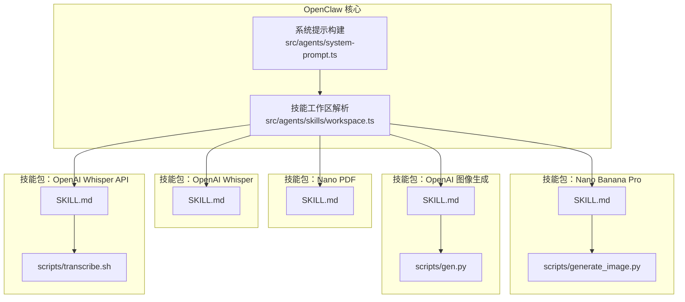
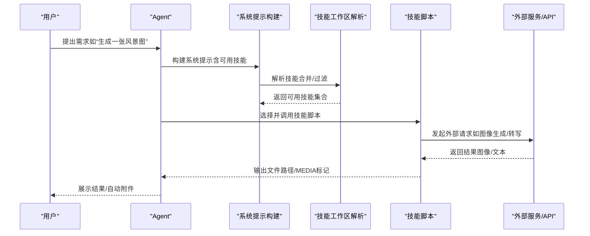
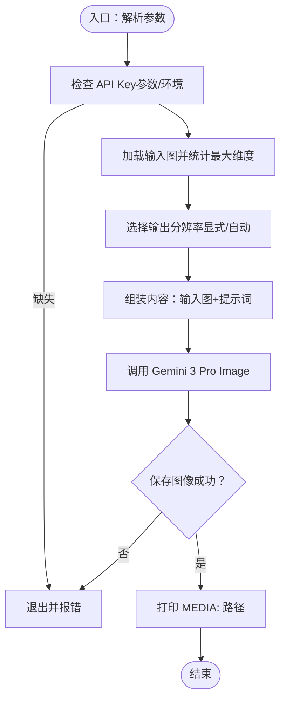
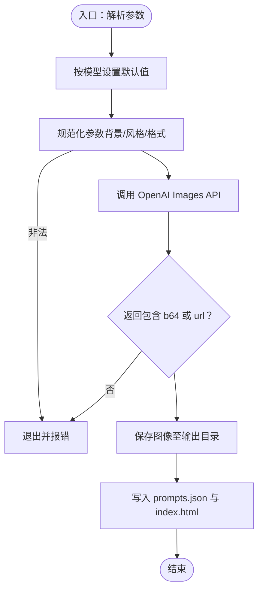
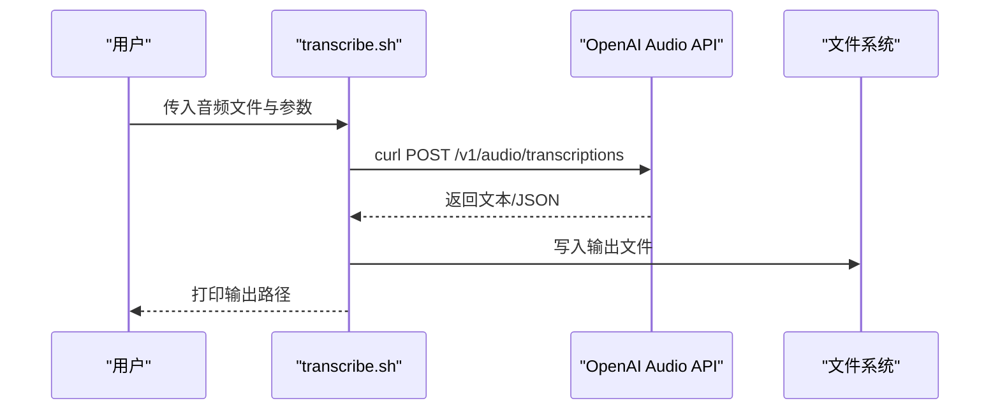
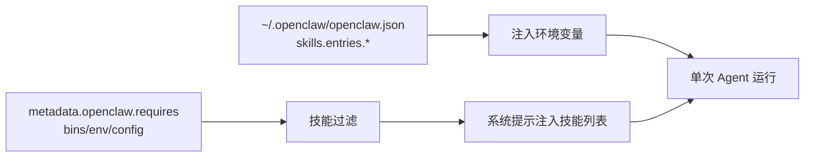

# AI生成技能

<cite>
**本文引用的文件**
- [skills/nano-banana-pro/SKILL.md](file://skills/nano-banana-pro/SKILL.md)
- [skills/nano-banana-pro/scripts/generate_image.py](file://skills/nano-banana-pro/scripts/generate_image.py)
- [skills/nano-banana-pro/scripts/test_generate_image.py](file://skills/nano-banana-pro/scripts/test_generate_image.py)
- [skills/nano-pdf/SKILL.md](file://skills/nano-pdf/SKILL.md)
- [skills/openai-image-gen/SKILL.md](file://skills/openai-image-gen/SKILL.md)
- [skills/openai-image-gen/scripts/gen.py](file://skills/openai-image-gen/scripts/gen.py)
- [skills/openai-image-gen/scripts/test_gen.py](file://skills/openai-image-gen/scripts/test_gen.py)
- [skills/openai-whisper/SKILL.md](file://skills/openai-whisper/SKILL.md)
- [skills/openai-whisper-api/SKILL.md](file://skills/openai-whisper-api/SKILL.md)
- [skills/openai-whisper-api/scripts/transcribe.sh](file://skills/openai-whisper-api/scripts/transcribe.sh)
- [docs/tools/skills.md](file://docs/tools/skills.md)
- [docs/tools/skills-config.md](file://docs/tools/skills-config.md)
- [src/agents/skills/workspace.ts](file://src/agents/skills/workspace.ts)
- [src/agents/system-prompt.ts](file://src/agents/system-prompt.ts)
</cite>

## 目录

1. [简介](#简介)
2. [项目结构](#项目结构)
3. [核心组件](#核心组件)
4. [架构总览](#架构总览)
5. [详细组件分析](#详细组件分析)
6. [依赖关系分析](#依赖关系分析)
7. [性能考量](#性能考量)
8. [故障排查指南](#故障排查指南)
9. [结论](#结论)
10. [附录](#附录)

## 简介

本文件系统性梳理与讲解 OpenClaw 中的五类 AI 生成能力技能：Nano Banana Pro 图像生成（Gemini 3 Pro Image）、Nano PDF 文档处理、OpenAI 图像批量生成、OpenAI Whisper 本地语音转文字、以及 OpenAI Whisper API 远程转写。内容覆盖配置要求、使用方法、运行流程、数据流、错误处理与性能建议，并提供可直接落地的操作示例路径与预期输出。

## 项目结构

这些技能以“技能包（Skill）”形式组织，每个技能包含：

- SKILL.md：技能元信息（名称、描述、主页、安装器、环境变量要求等）与使用说明
- scripts/：可执行脚本或工具（Python 脚本、Shell 脚本）

图表来源

- [skills/nano-banana-pro/SKILL.md:1-66](file://skills/nano-banana-pro/SKILL.md#L1-L66)
- [skills/nano-banana-pro/scripts/generate_image.py:1-236](file://skills/nano-banana-pro/scripts/generate_image.py#L1-L236)
- [skills/openai-image-gen/SKILL.md:1-93](file://skills/openai-image-gen/SKILL.md#L1-L93)
- [skills/openai-image-gen/scripts/gen.py:1-329](file://skills/openai-image-gen/scripts/gen.py#L1-L329)
- [skills/openai-whisper-api/SKILL.md:1-53](file://skills/openai-whisper-api/SKILL.md#L1-L53)
- [skills/openai-whisper-api/scripts/transcribe.sh:1-86](file://skills/openai-whisper-api/scripts/transcribe.sh#L1-L86)
- [src/agents/skills/workspace.ts:490-527](file://src/agents/skills/workspace.ts#L490-L527)
- [src/agents/system-prompt.ts:20-36](file://src/agents/system-prompt.ts#L20-L36)

章节来源

- [skills/nano-banana-pro/SKILL.md:1-66](file://skills/nano-banana-pro/SKILL.md#L1-L66)
- [skills/openai-image-gen/SKILL.md:1-93](file://skills/openai-image-gen/SKILL.md#L1-L93)
- [skills/openai-whisper-api/SKILL.md:1-53](file://skills/openai-whisper-api/SKILL.md#L1-L53)
- [src/agents/skills/workspace.ts:490-527](file://src/agents/skills/workspace.ts#L490-L527)
- [src/agents/system-prompt.ts:20-36](file://src/agents/system-prompt.ts#L20-L36)

## 核心组件

- Nano Banana Pro（Gemini 3 Pro Image）
  - 功能：通过 Google Gemini 3 Pro Image 生成或编辑图片；支持多图合成（最多 14 张）；可指定分辨率与宽高比；自动从输入图推断输出分辨率。
  - 关键参数：提示词、输出文件名、输入图列表、分辨率（1K/2K/4K）、宽高比、API 密钥。
  - 输出：PNG 文件，同时打印 MEDIA: 路径供 OpenClaw 自动附件。
- Nano PDF
  - 功能：用自然语言指令对 PDF 指定页进行编辑。
  - 关键参数：PDF 路径、页码（注意不同版本可能 0 基或 1 基）、指令文本。
  - 输出：修改后的 PDF。
- OpenAI 图像生成
  - 功能：批量生成图像，内置随机结构化提示词，生成缩略图画廊与映射文件。
  - 关键参数：模型（gpt-image-\*、dall-e-2、dall-e-3）、数量、尺寸、质量、风格、背景透明度、输出格式、输出目录。
  - 输出：图像文件、prompts.json、index.html 画廊。
- OpenAI Whisper（本地 CLI）
  - 功能：本地音频转文字，无需 API Key。
  - 关键参数：音频文件、模型、输出格式、输出目录、任务（转写/翻译）。
  - 输出：文本/字幕文件。
- OpenAI Whisper API（远程）
  - 功能：通过 OpenAI Audio Transcriptions API 远程转写。
  - 关键参数：音频文件、模型、语言、提示词、响应格式（text/json）。
  - 输出：文本或 JSON 文件。

章节来源

- [skills/nano-banana-pro/SKILL.md:26-66](file://skills/nano-banana-pro/SKILL.md#L26-L66)
- [skills/nano-pdf/SKILL.md:25-39](file://skills/nano-pdf/SKILL.md#L25-L39)
- [skills/openai-image-gen/SKILL.md:26-93](file://skills/openai-image-gen/SKILL.md#L26-L93)
- [skills/openai-whisper/SKILL.md:25-39](file://skills/openai-whisper/SKILL.md#L25-L39)
- [skills/openai-whisper-api/SKILL.md:16-53](file://skills/openai-whisper-api/SKILL.md#L16-L53)

## 架构总览

OpenClaw 在会话开始时加载技能，按优先级合并工作区、托管与内置技能，过滤掉不满足二进制/环境/配置条件的技能，再将可用技能注入系统提示，驱动模型选择与调用具体技能脚本。

图表来源

- [src/agents/system-prompt.ts:20-36](file://src/agents/system-prompt.ts#L20-L36)
- [src/agents/skills/workspace.ts:490-527](file://src/agents/skills/workspace.ts#L490-L527)
- [skills/nano-banana-pro/scripts/generate_image.py:175-231](file://skills/nano-banana-pro/scripts/generate_image.py#L175-L231)
- [skills/openai-image-gen/scripts/gen.py:157-207](file://skills/openai-image-gen/scripts/gen.py#L157-L207)
- [skills/openai-whisper-api/scripts/transcribe.sh:75-83](file://skills/openai-whisper-api/scripts/transcribe.sh#L75-L83)

## 详细组件分析

### Nano Banana Pro（Gemini 3 Pro Image）

- 配置要求
  - 环境变量：GEMINI_API_KEY
  - 二进制依赖：uv（用于运行脚本）
  - 可选：在 OpenClaw 配置中设置 skills."nano-banana-pro".apiKey 或 env.GEMINI_API_KEY
- 使用方法
  - 生成：传入提示词、输出文件名、可选分辨率与宽高比
  - 编辑/多图合成：传入一张或多张输入图，配合提示词进行编辑或组合
  - 宽高比：支持常见比例；未指定时由模型自由选择
- 数据流与处理逻辑
  - 解析参数与环境变量
  - 加载输入图并计算最大维度以自动推断分辨率
  - 组装内容（输入图+提示词），调用 Gemini 3 Pro Image 接口
  - 将返回的内联数据保存为 PNG，必要时转换模式
  - 打印 MEDIA: 路径以便自动附件
- 错误处理
  - 缺少 API Key、输入图加载失败、无图像生成、网络异常等均会打印错误并退出非零状态

图表来源

- [skills/nano-banana-pro/scripts/generate_image.py:38-231](file://skills/nano-banana-pro/scripts/generate_image.py#L38-L231)

章节来源

- [skills/nano-banana-pro/SKILL.md:1-66](file://skills/nano-banana-pro/SKILL.md#L1-L66)
- [skills/nano-banana-pro/scripts/generate_image.py:1-236](file://skills/nano-banana-pro/scripts/generate_image.py#L1-L236)
- [skills/nano-banana-pro/scripts/test_generate_image.py:1-37](file://skills/nano-banana-pro/scripts/test_generate_image.py#L1-L37)

### Nano PDF（文档处理）

- 配置要求
  - 二进制依赖：nano-pdf
  - 通过 uv 安装
- 使用方法
  - 对 PDF 指定页应用自然语言指令进行编辑
  - 注意页码基（0 基/1 基）差异，若结果偏差 1，切换另一种基
- 输出
  - 修改后的 PDF 文件

章节来源

- [skills/nano-pdf/SKILL.md:1-39](file://skills/nano-pdf/SKILL.md#L1-L39)

### OpenAI 图像生成（批量）

- 配置要求
  - 环境变量：OPENAI_API_KEY
  - 二进制依赖：python3
  - 执行超时：建议提高到 300 秒以上，避免因默认超时导致中断
- 使用方法
  - 默认批量生成若干图像，自动产出画廊与映射文件
  - 支持多种模型与参数组合（尺寸、质量、风格、背景、输出格式、输出目录）
- 数据流与处理逻辑
  - 解析参数与默认值（按模型自动选择）
  - 校验参数合法性（如 --background 仅 gpt-image 模型支持）
  - 调用 OpenAI Images API，下载或解码返回的图像
  - 写入 prompts.json 与 index.html 画廊
- 错误处理
  - 缺失 API Key、HTTP 请求失败、参数非法、下载失败等均会抛出错误并退出

图表来源

- [skills/openai-image-gen/scripts/gen.py:67-207](file://skills/openai-image-gen/scripts/gen.py#L67-L207)
- [skills/openai-image-gen/scripts/gen.py:243-324](file://skills/openai-image-gen/scripts/gen.py#L243-L324)

章节来源

- [skills/openai-image-gen/SKILL.md:1-93](file://skills/openai-image-gen/SKILL.md#L1-L93)
- [skills/openai-image-gen/scripts/gen.py:1-329](file://skills/openai-image-gen/scripts/gen.py#L1-L329)
- [skills/openai-image-gen/scripts/test_gen.py:1-141](file://skills/openai-image-gen/scripts/test_gen.py#L1-L141)

### OpenAI Whisper（本地 CLI）

- 配置要求
  - 二进制依赖：whisper
  - 首次运行会下载模型到缓存目录
- 使用方法
  - 指定音频文件、模型、输出格式与输出目录
  - 支持转写与翻译两种任务
- 输出
  - 文本或字幕文件

章节来源

- [skills/openai-whisper/SKILL.md:1-39](file://skills/openai-whisper/SKILL.md#L1-L39)

### OpenAI Whisper API（远程）

- 配置要求
  - 环境变量：OPENAI_API_KEY
  - 二进制依赖：curl
- 使用方法
  - 通过脚本调用 /v1/audio/transcriptions 接口
  - 支持指定模型、语言、提示词、响应格式（text/json）
- 输出
  - 文本或 JSON 文件（默认与 --json 控制）

图表来源

- [skills/openai-whisper-api/scripts/transcribe.sh:75-83](file://skills/openai-whisper-api/scripts/transcribe.sh#L75-L83)

章节来源

- [skills/openai-whisper-api/SKILL.md:1-53](file://skills/openai-whisper-api/SKILL.md#L1-L53)
- [skills/openai-whisper-api/scripts/transcribe.sh:1-86](file://skills/openai-whisper-api/scripts/transcribe.sh#L1-L86)

## 依赖关系分析

- 技能加载与过滤
  - OpenClaw 在会话开始时合并工作区/托管/内置技能，依据 metadata.openclaw.requres（二进制、环境变量、配置项）与配置文件进行筛选
  - 可通过 skills.entries.<name>.env 与 apiKey 注入环境变量，且仅在进程未设置时生效
- 系统提示中的技能列表
  - 将可用技能以紧凑 XML 形式注入系统提示，影响 token 成本与上下文长度
- 运行时环境
  - 对于沙箱场景，需在容器内安装所需二进制或通过自定义镜像预置

图表来源

- [docs/tools/skills.md:106-187](file://docs/tools/skills.md#L106-L187)
- [docs/tools/skills.md:189-246](file://docs/tools/skills.md#L189-L246)
- [src/agents/system-prompt.ts:20-36](file://src/agents/system-prompt.ts#L20-L36)
- [src/agents/skills/workspace.ts:490-527](file://src/agents/skills/workspace.ts#L490-L527)

章节来源

- [docs/tools/skills.md:1-303](file://docs/tools/skills.md#L1-L303)
- [src/agents/skills/workspace.ts:490-527](file://src/agents/skills/workspace.ts#L490-L527)
- [src/agents/system-prompt.ts:20-36](file://src/agents/system-prompt.ts#L20-L36)

## 性能考量

- 图像生成
  - OpenAI 图像生成默认超时较短，建议在执行工具中提升超时（例如 300 秒），避免因超时重试导致的重复请求与成本上升
  - 合理选择模型与尺寸，减少不必要的大图生成
- Whisper 转写
  - 本地 Whisper 首次运行会下载模型，后续复用缓存；可选择更小模型以提升速度
  - 远程 API 转写按需设置语言与提示词，有助于提升准确率与速度
- 技能提示成本
  - 技能列表注入会带来固定字符开销与每技能额外开销，建议控制技能数量与描述长度，避免过度膨胀上下文

章节来源

- [skills/openai-image-gen/SKILL.md:30-38](file://skills/openai-image-gen/SKILL.md#L30-L38)
- [skills/openai-whisper/SKILL.md:34-39](file://skills/openai-whisper/SKILL.md#L34-L39)
- [docs/tools/skills.md:269-286](file://docs/tools/skills.md#L269-L286)

## 故障排查指南

- 缺少 API Key
  - Nano Banana Pro：检查 GEMINI_API_KEY 是否设置，或在配置中提供 apiKey/env
  - OpenAI 图像/Whisper API：检查 OPENAI_API_KEY 是否设置
- 二进制不可用
  - 确认 uv、python3、whisper、curl 已安装并可在 PATH 中找到
- 参数非法
  - OpenAI 图像生成：--background 仅 gpt-image 模型支持；--style 仅 dall-e-3 支持；--output-format 仅 gpt-image 模型支持；参数值不在允许集合内会报错
- 输出为空或未生成图像
  - 检查模型返回是否包含 b64_json 或 url；确认网络连通与权限
- 本地 Whisper 首次运行慢
  - 首次下载模型需要时间，后续复用缓存即可加速
- 技能未出现在提示中
  - 检查 metadata.openclaw.requires（bins/env/config）是否满足；查看配置中是否禁用该技能

章节来源

- [skills/nano-banana-pro/SKILL.md:48-51](file://skills/nano-banana-pro/SKILL.md#L48-L51)
- [skills/openai-image-gen/SKILL.md:10-22](file://skills/openai-image-gen/SKILL.md#L10-L22)
- [skills/openai-whisper-api/SKILL.md:40-52](file://skills/openai-whisper-api/SKILL.md#L40-L52)
- [skills/openai-image-gen/scripts/gen.py:89-106](file://skills/openai-image-gen/scripts/gen.py#L89-L106)
- [skills/openai-image-gen/scripts/gen.py:109-154](file://skills/openai-image-gen/scripts/gen.py#L109-L154)
- [skills/openai-whisper/SKILL.md:34-39](file://skills/openai-whisper/SKILL.md#L34-L39)
- [docs/tools/skills.md:106-187](file://docs/tools/skills.md#L106-L187)

## 结论

上述五类 AI 生成技能覆盖了图像创作、文档处理与语音识别三大场景。通过统一的技能框架与严格的环境/二进制/配置门控，OpenClaw 能够安全、可控地将外部服务能力整合到智能体工作流中。建议在生产使用中：

- 明确配置与环境变量注入策略
- 合理设置执行超时与并发策略
- 利用画廊与元数据文件便于回溯与复用
- 在沙箱环境中预置所需二进制，确保跨节点一致性

## 附录

- 实际操作示例（示例路径）
  - Nano Banana Pro：生成/编辑/多图合成命令参考 SKILL.md 中的示例块
  - Nano PDF：编辑 PDF 指定页的命令参考 SKILL.md
  - OpenAI 图像生成：批量生成与参数示例参考 SKILL.md
  - Whisper（本地）：转写/翻译命令参考 SKILL.md
  - Whisper API：远程转写命令参考 SKILL.md 与 transcribe.sh
- 配置参考
  - 技能配置 schema 与示例：参见 skills-config.md
  - 技能加载、过滤与注入提示的机制：参见 skills.md

章节来源

- [skills/nano-banana-pro/SKILL.md:26-66](file://skills/nano-banana-pro/SKILL.md#L26-L66)
- [skills/nano-pdf/SKILL.md:25-39](file://skills/nano-pdf/SKILL.md#L25-L39)
- [skills/openai-image-gen/SKILL.md:26-93](file://skills/openai-image-gen/SKILL.md#L26-L93)
- [skills/openai-whisper/SKILL.md:25-39](file://skills/openai-whisper/SKILL.md#L25-L39)
- [skills/openai-whisper-api/SKILL.md:16-53](file://skills/openai-whisper-api/SKILL.md#L16-L53)
- [docs/tools/skills-config.md:1-78](file://docs/tools/skills-config.md#L1-L78)
- [docs/tools/skills.md:1-303](file://docs/tools/skills.md#L1-L303)
