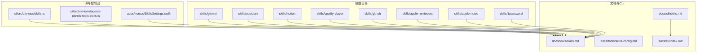
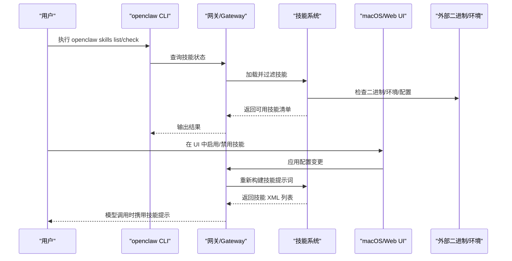
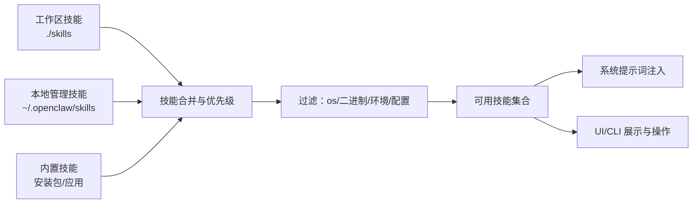

# 内置技能

<cite>
**本文引用的文件**
- [skills/1password/SKILL.md](file://skills/1password/SKILL.md)
- [skills/apple-notes/SKILL.md](file://skills/apple-notes/SKILL.md)
- [skills/apple-reminders/SKILL.md](file://skills/apple-reminders/SKILL.md)
- [skills/github/SKILL.md](file://skills/github/SKILL.md)
- [skills/spotify-player/SKILL.md](file://skills/spotify-player/SKILL.md)
- [skills/notion/SKILL.md](file://skills/notion/SKILL.md)
- [skills/obsidian/SKILL.md](file://skills/obsidian/SKILL.md)
- [skills/gemini/SKILL.md](file://skills/gemini/SKILL.md)
- [docs/tools/skills.md](file://docs/tools/skills.md)
- [docs/tools/skills-config.md](file://docs/tools/skills-config.md)
- [docs/cli/skills.md](file://docs/cli/skills.md)
- [docs/cli/index.md](file://docs/cli/index.md)
- [docs/help/troubleshooting.md](file://docs/help/troubleshooting.md)
- [docs/tools/creating-skills.md](file://docs/tools/creating-skills.md)
- [apps/macos/Sources/OpenClaw/SkillsSettings.swift](file://apps/macos/Sources/OpenClaw/SkillsSettings.swift)
- [ui/src/ui/views/agents-panels-tools-skills.ts](file://ui/src/ui/views/agents-panels-tools-skills.ts)
- [ui/src/ui/views/skills.ts](file://ui/src/ui/views/skills.ts)
</cite>

## 目录

1. [简介](#简介)
2. [项目结构](#项目结构)
3. [核心组件](#核心组件)
4. [架构总览](#架构总览)
5. [详细组件分析](#详细组件分析)
6. [依赖关系分析](#依赖关系分析)
7. [性能考量](#性能考量)
8. [故障排除指南](#故障排除指南)
9. [结论](#结论)
10. [附录](#附录)

## 简介

本文件为 OpenClaw 内置技能的综合文档，覆盖以下主题：

- 可用内置技能清单与功能特性：1Password、Apple Notes、Apple Reminders、GitHub、Spotify 等
- 每个技能的配置项、参数与集成方式（二进制依赖、环境变量、可选安装器）
- 安装、启用、禁用与更新流程
- 使用案例与最佳实践
- 故障排除与常见问题

OpenClaw 使用“技能（Skills）”作为能力载体，每个技能是一个目录，包含一个遵循特定格式的 SKILL.md 文件，描述名称、元数据、使用说明与可选安装器。系统在加载时根据平台、二进制存在性、环境变量与配置进行“准入过滤”，仅将满足条件的技能纳入可用集合。

## 项目结构

OpenClaw 的技能位于仓库根目录下的 skills 子目录中，每个子目录代表一个技能，并包含该技能的 SKILL.md 文档与可选资源（如脚本或参考材料）。此外，OpenClaw 还提供：

- 技能系统与加载规则的官方文档
- CLI 中与技能相关的命令与子命令
- macOS 控制界面与 Web UI 中对技能的展示与管理入口
- 故障排除与创建自定义技能的指南

**图表来源**

- [docs/tools/skills.md:11-27](file://docs/tools/skills.md#L11-L27)
- [docs/cli/skills.md:9-27](file://docs/cli/skills.md#L9-L27)
- [docs/cli/index.md:471-488](file://docs/cli/index.md#L471-L488)

**章节来源**

- [docs/tools/skills.md:11-27](file://docs/tools/skills.md#L11-L27)
- [docs/cli/index.md:471-488](file://docs/cli/index.md#L471-L488)

## 核心组件

- 技能目录与元数据
  - 每个技能以目录形式存在，目录内含 SKILL.md，采用 YAML 前言头声明技能名称、描述与元数据（metadata.openclaw），其中可包含：
    - 平台限制（os）
    - 二进制依赖（requires.bins 或 requires.anyBins）
    - 环境变量要求（requires.env）
    - 配置开关要求（requires.config）
    - 主要密钥环境变量（primaryEnv）
    - 可选安装器列表（install），用于 UI/CLI 自动安装
- 加载与过滤
  - 系统按“工作区技能 > 本地管理技能 > 内置技能”的优先级加载；同名冲突时高优先级覆盖低优先级
  - 加载时基于上述元数据进行“准入过滤”，仅将满足条件的技能纳入可用集合
- 配置与注入
  - 通过 ~/.openclaw/openclaw.json 下的 skills.entries.<skillKey> 对技能进行启用/禁用、环境变量注入与密钥注入
  - 运行时会将满足条件的技能列表注入到系统提示词中，影响 token 开销

**章节来源**

- [docs/tools/skills.md:106-187](file://docs/tools/skills.md#L106-L187)
- [docs/tools/skills-config.md:13-78](file://docs/tools/skills-config.md#L13-L78)

## 架构总览

下图展示了技能从发现、过滤到被模型使用的整体流程，以及与 CLI、UI 和配置的关系。

**图表来源**

- [docs/cli/skills.md:9-27](file://docs/cli/skills.md#L9-L27)
- [docs/tools/skills.md:106-187](file://docs/tools/skills.md#L106-L187)
- [apps/macos/Sources/OpenClaw/SkillsSettings.swift:75-166](file://apps/macos/Sources/OpenClaw/SkillsSettings.swift#L75-L166)
- [ui/src/ui/views/agents-panels-tools-skills.ts:312-537](file://ui/src/ui/views/agents-panels-tools-skills.ts#L312-L537)

## 详细组件分析

### 1Password 技能

- 功能概述
  - 通过 1Password CLI（op）进行安装、桌面应用集成、登录授权、读取/注入/运行机密
- 关键元数据
  - 平台：通用
  - 二进制依赖：op
  - 可选安装器：brew 安装 1password-cli
- 使用要点
  - 必须在专用 tmux 会话中执行 op 命令，避免重复弹窗与失败
  - 登录后需验证 whoami 成功后再进行机密读取
  - 多账户场景使用 --account 或 OP_ACCOUNT
- 安全与守则
  - 不要在日志、聊天或代码中粘贴机密
  - 优先使用 op run / op inject 而非写盘
  - 若无桌面集成，可使用 op account add
- 实际案例
  - 在 tmux 会话中完成一次性登录与 whoami 校验，随后批量列出保险库
  - 将账户切换与会话生命周期管理纳入自动化脚本

**章节来源**

- [skills/1password/SKILL.md:1-71](file://skills/1password/SKILL.md#L1-L71)

### Apple Notes 技能

- 功能概述
  - 通过 memo CLI 管理 Apple Notes：创建、查看、编辑、删除、搜索、移动、导出
- 关键元数据
  - 平台：darwin（macOS）
  - 二进制依赖：memo
  - 可选安装器：brew 安装 antoniorodr/memo/memo
- 使用要点
  - 支持按文件夹筛选与模糊搜索
  - 导出支持 HTML/Markdown
- 局限与注意
  - 无法编辑包含图片或附件的笔记
  - 交互式提示需要终端访问权限
  - 需授予 Notes.app Automation 权限

**章节来源**

- [skills/apple-notes/SKILL.md:1-78](file://skills/apple-notes/SKILL.md#L1-L78)

### Apple Reminders 技能

- 功能概述
  - 通过 remindctl CLI 管理 Apple Reminders：列出、添加、编辑、完成、删除、列表管理、日期筛选、JSON/纯文本输出
- 关键元数据
  - 平台：darwin（macOS）
  - 二进制依赖：remindctl
  - 可选安装器：brew 安装 steipete/tap/remindctl
- 使用要点
  - 支持 today/tomorrow/week/overdue/all/具体日期等筛选
  - 支持列表的创建/删除
  - 支持 JSON 与纯文本输出，便于脚本化
- 注意事项
  - 与日历事件不同，适用于个人待办且需同步到 iPhone/iPad 的场景
  - 与定时提醒不同，后者应使用 cron 工具

**章节来源**

- [skills/apple-reminders/SKILL.md:1-119](file://skills/apple-reminders/SKILL.md#L1-L119)

### GitHub 技能

- 功能概述
  - 通过 gh CLI 进行 Issues、PR、CI 运行、代码评审、API 查询等操作
- 关键元数据
  - 二进制依赖：gh
  - 可选安装器：brew gh 或 apt gh
- 使用要点
  - 适用场景：检查 PR 状态/CI、创建/关闭/评论 Issue、列出/筛选 PR/Issue、查看运行日志、查询仓库数据
  - 不适用场景：本地 Git 操作、非 GitHub 仓库、克隆仓库、审查代码变更（建议使用 coding-agent）、复杂多文件 diff
- 常用命令与模板
  - PR 列表、CI 状态、PR 查看、创建/合并 PR
  - Issue 列表、创建、关闭
  - CI 运行列表、查看、失败步骤日志、重试失败任务
  - API 查询与 JSON 结构化输出
- 最佳实践
  - 总是显式指定 --repo owner/repo
  - 使用速率限制策略（缓存）

**章节来源**

- [skills/github/SKILL.md:1-164](file://skills/github/SKILL.md#L1-L164)

### Spotify Player 技能

- 功能概述
  - 通过 spogo（首选）或 spotify_player 进行播放/暂停/下一首/上一首、设备列表/选择、状态查询与搜索
- 关键元数据
  - 二进制依赖：spogo 或 spotify_player
  - 可选安装器：brew 安装 spogo 或 spotify_player
- 使用要点
  - 需要 Spotify Premium 账号
  - 推荐使用 spogo，必要时回退到 spotify_player
  - 支持导入浏览器 Cookie 完成认证
- 注意事项
  - 配置目录：~/.config/spotify-player
  - 如需 Spotify Connect，可在配置中设置用户 client_id
  - 提供 TUI 快捷键帮助

**章节来源**

- [skills/spotify-player/SKILL.md:1-65](file://skills/spotify-player/SKILL.md#L1-L65)

### Notion 技能

- 功能概述
  - 通过 Notion API 创建/读取/更新页面、数据库与块内容
- 关键元数据
  - 环境变量依赖：NOTION_API_KEY
  - 主要密钥环境变量：NOTION_API_KEY
- 使用要点
  - 需在 Notion 中创建 Integration 并分享目标页面/数据库
  - 请求需包含 Authorization: Bearer 与 Notion-Version 头
  - 版本：2025-09-03（数据源替代数据库）
- 常见操作
  - 搜索页面/数据源
  - 获取页面与块内容
  - 在数据源中创建页面
  - 查询数据源（过滤/排序）
  - 更新页面属性
  - 添加块到页面

**章节来源**

- [skills/notion/SKILL.md:1-175](file://skills/notion/SKILL.md#L1-L175)

### Obsidian 技能

- 功能概述
  - 通过 obsidian-cli 与 Obsidian 保险库交互：查找活动保险库、搜索、创建、移动/重命名、删除、直接编辑
- 关键元数据
  - 二进制依赖：obsidian-cli
  - 可选安装器：brew 安装 yakitrak/yakitrak/obsidian-cli
- 使用要点
  - 保险库即磁盘上的普通文件夹
  - 通过 ~/Library/Application Support/obsidian/obsidian.json 解析活动保险库
  - 优先使用 print-default 与 print-default --path-only
  - 移动/重命名会自动更新链接
- 注意事项
  - 避免在脚本中硬编码保险库路径，应读取配置或使用默认值

**章节来源**

- [skills/obsidian/SKILL.md:1-82](file://skills/obsidian/SKILL.md#L1-L82)

### Gemini CLI 技能

- 功能概述
  - 使用 Gemini CLI 进行一次性问答、摘要与生成
- 关键元数据
  - 二进制依赖：gemini
  - 可选安装器：brew 安装 gemini-cli
- 使用要点
  - 采用位置参数提示（避免交互模式）
  - 支持模型选择与 JSON 输出
  - 支持扩展管理

**章节来源**

- [skills/gemini/SKILL.md:1-44](file://skills/gemini/SKILL.md#L1-L44)

## 依赖关系分析

- 技能加载与优先级
  - 工作区技能（<workspace>/skills） > 本地管理技能（~/.openclaw/skills） > 内置技能（随安装包分发）
  - 同名冲突时，高优先级覆盖低优先级
- 元数据门控
  - os、requires.bins/anyBins、requires.env、requires.config 决定技能是否“合格”
  - primaryEnv 与 skills.entries.<key>.apiKey 用于注入密钥
- UI 与 CLI 的联动
  - macOS UI 与 Web UI 均提供技能列表、过滤、启用/禁用、一键安装入口
  - CLI 提供 skills list/info/check 用于诊断与调试

**图表来源**

- [docs/tools/skills.md:13-40](file://docs/tools/skills.md#L13-L40)
- [docs/tools/skills.md:106-187](file://docs/tools/skills.md#L106-L187)

**章节来源**

- [docs/tools/skills.md:13-40](file://docs/tools/skills.md#L13-L40)
- [docs/tools/skills.md:106-187](file://docs/tools/skills.md#L106-L187)

## 性能考量

- 技能提示词开销
  - 当有技能可用时，系统会在系统提示词中注入技能 XML 列表，字符数开销确定
  - 公式：基础 195 字符 + Σ（每技能 97 + 名称/描述/位置的 XML 转义长度）
  - 估算：约 97 字符 ≈ 24 token/技能（因分词器而异）
- 会话快照与热重载
  - 系统在会话开始时快照可用技能，后续回合复用
  - 可通过技能监视器在文件变更时热更新（watch/watchDebounceMs）

**章节来源**

- [docs/tools/skills.md:269-286](file://docs/tools/skills.md#L269-L286)
- [docs/tools/skills.md:242-247](file://docs/tools/skills.md#L242-L247)

## 故障排除指南

- 快速排查流程（前 60 秒）
  - 运行 openclaw status、openclaw gateway probe/status、openclaw doctor、openclaw channels status --probe、openclaw logs --follow
  - 关注输出中的“Runtime: running”、“RPC probe: ok”、“connected/ready”等关键信息
- 常见症状与定位
  - 网关未启动/服务未运行：检查端口占用、绑定策略、认证配置
  - 控制 UI 无法连接：确认 Dashboard 地址、HTTPS/安全上下文、设备令牌
  - 浏览器工具失败：检查浏览器可执行路径、扩展附加状态、WSL/远程 CDP 连接
  - 节点工具失败：检查节点前台状态、权限授予、执行审批与允许列表
- 技能相关问题
  - 缺少二进制/环境变量/配置：使用 openclaw skills check 与 openclaw skills info <name> 查看缺失项
  - 安装器不可用：在 macOS UI 中点击“安装”，或在 CLI 中使用 clawhub 安装
  - 禁用/启用：在 UI 中切换，或通过配置文件 skills.entries.<key>.enabled

**章节来源**

- [docs/help/troubleshooting.md:13-299](file://docs/help/troubleshooting.md#L13-L299)
- [docs/cli/skills.md:9-27](file://docs/cli/skills.md#L9-L27)

## 结论

OpenClaw 的技能体系以“可发现、可过滤、可配置、可安装”为核心设计，既保证了灵活性与安全性，又提供了良好的用户体验。通过统一的 SKILL.md 规范与元数据门控，系统能够动态适配不同平台与环境，将合适的技能暴露给模型与用户。对于内置技能而言，1Password、Apple Notes/Reminders、GitHub、Spotify Player、Notion、Obsidian 与 Gemini CLI 等覆盖了日常办公、开发协作与媒体娱乐等高频场景。结合 CLI 与 UI 的管理能力，用户可以快速完成安装、启用、禁用与更新，并在出现问题时高效定位与修复。

## 附录

### 安装、启用与禁用操作

- 通过 macOS UI
  - 在“技能设置”中筛选、启用/禁用技能，若存在可选安装器则可一键安装
- 通过 CLI
  - openclaw skills list：列出全部技能
  - openclaw skills list --eligible：仅显示已就绪技能
  - openclaw skills info <name>：查看技能详情与缺失项
  - openclaw skills check：汇总“已就绪/缺失要求”
- 通过配置文件
  - 在 ~/.openclaw/openclaw.json 的 skills.entries.<skillKey> 下设置 enabled、env、apiKey 等
  - 使用 skills.allowBundled 限定内置技能白名单
  - 使用 skills.load.extraDirs 添加额外技能目录

**章节来源**

- [docs/tools/skills.md:189-239](file://docs/tools/skills.md#L189-L239)
- [docs/tools/skills-config.md:13-78](file://docs/tools/skills-config.md#L13-L78)
- [apps/macos/Sources/OpenClaw/SkillsSettings.swift:75-166](file://apps/macos/Sources/OpenClaw/SkillsSettings.swift#L75-L166)
- [ui/src/ui/views/agents-panels-tools-skills.ts:312-537](file://ui/src/ui/views/agents-panels-tools-skills.ts#L312-L537)
- [ui/src/ui/views/skills.ts:130-173](file://ui/src/ui/views/skills.ts#L130-L173)

### 使用案例与最佳实践

- 1Password
  - 在专用 tmux 会话中完成一次性登录与 whoami 校验，再进行机密读取
  - 使用 op run/op inject 避免落盘
- Apple Notes/Reminders
  - 通过交互式命令快速创建/编辑/移动笔记或提醒
  - 使用 JSON/纯文本输出便于脚本化
- GitHub
  - 使用 --repo owner/repo 显式指定仓库
  - 使用 --json 与 --jq 进行结构化输出与过滤
- Spotify Player
  - 优先使用 spogo，必要时回退到 spotify_player
  - 通过配置文件设置 client_id 以启用 Spotify Connect
- Notion/Obsidian
  - 通过配置文件解析活动保险库与 API 密钥
  - 使用移动/重命名自动更新链接，避免手动维护

**章节来源**

- [skills/1password/SKILL.md:34-71](file://skills/1password/SKILL.md#L34-L71)
- [skills/apple-notes/SKILL.md:26-78](file://skills/apple-notes/SKILL.md#L26-L78)
- [skills/apple-reminders/SKILL.md:26-119](file://skills/apple-reminders/SKILL.md#L26-L119)
- [skills/github/SKILL.md:35-55](file://skills/github/SKILL.md#L35-L55)
- [skills/spotify-player/SKILL.md:33-65](file://skills/spotify-player/SKILL.md#L33-L65)
- [skills/notion/SKILL.md:16-28](file://skills/notion/SKILL.md#L16-L28)
- [skills/obsidian/SKILL.md:36-82](file://skills/obsidian/SKILL.md#L36-L82)

### 创建自定义技能

- 步骤
  - 在工作区创建技能目录（通常位于 ~/.openclaw/workspace/skills/<skill-name>）
  - 编写 SKILL.md（YAML 前言头 + 指南正文）
  - 可选：添加 scripts/ 与 references/ 资源
  - 使用 openclaw agent --message "use my new skill" 进行测试
- 最佳实践
  - 保持简洁，明确“做什么”而非“如何做”
  - 安全优先，避免任意命令注入
  - 通过 UI/CLI 刷新或重启网关使新技能生效

**章节来源**

- [docs/tools/creating-skills.md:9-59](file://docs/tools/creating-skills.md#L9-L59)
