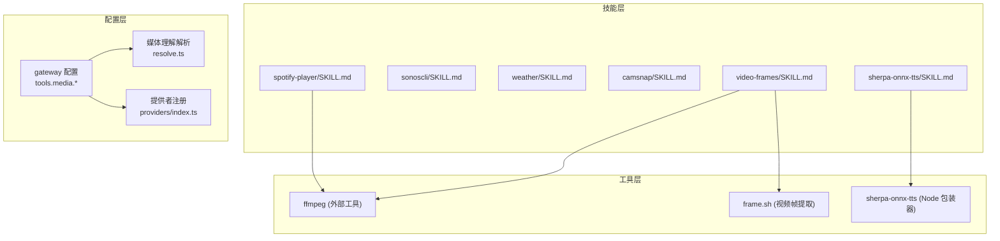
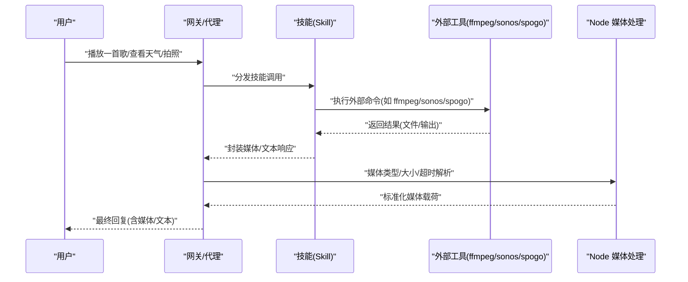
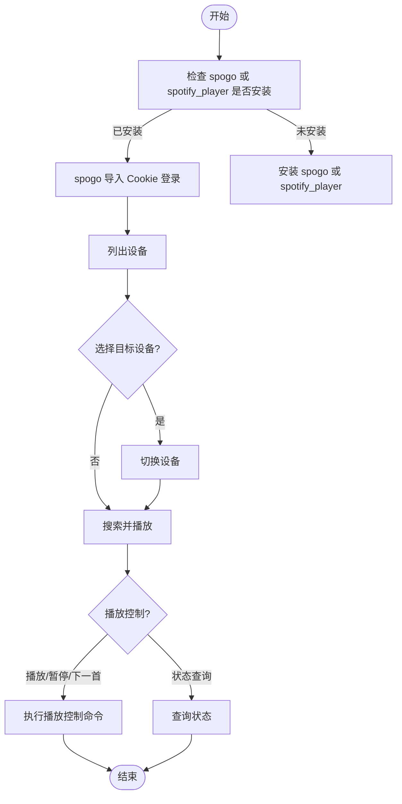
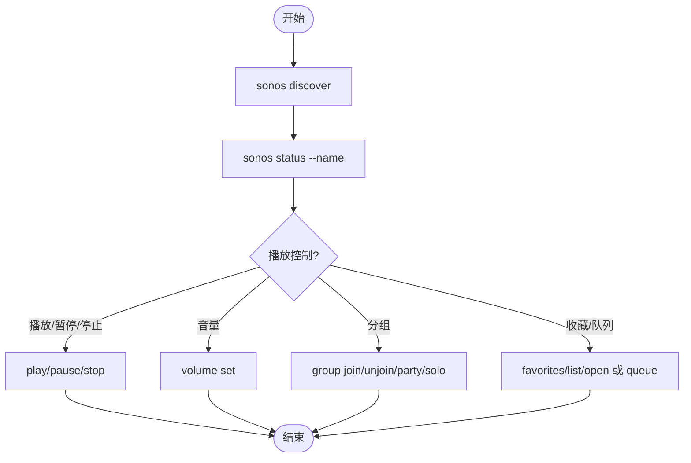
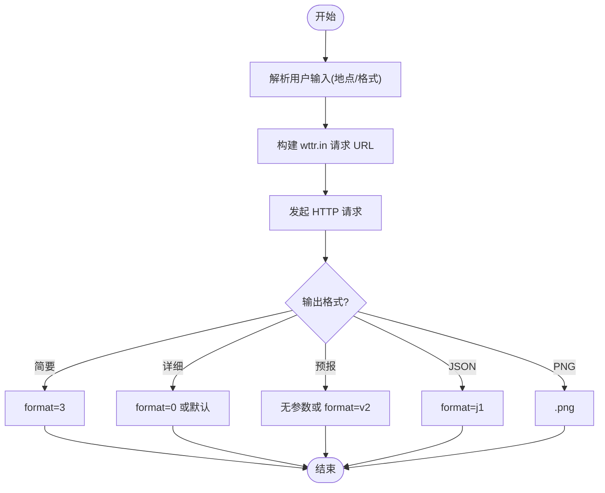
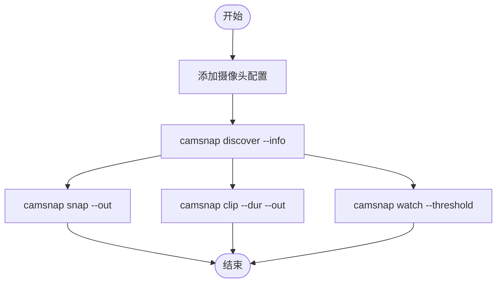
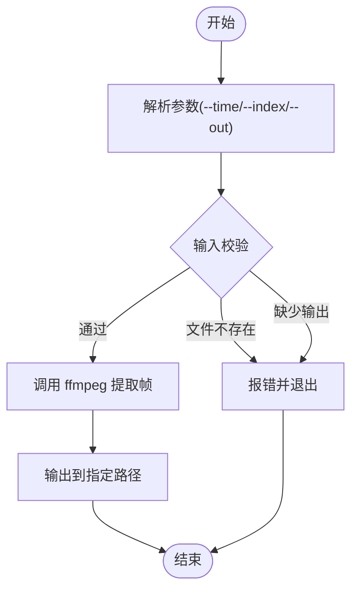
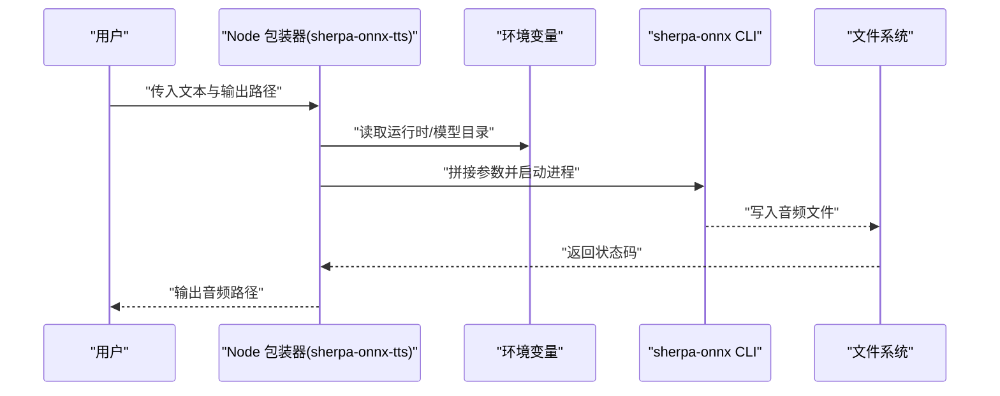
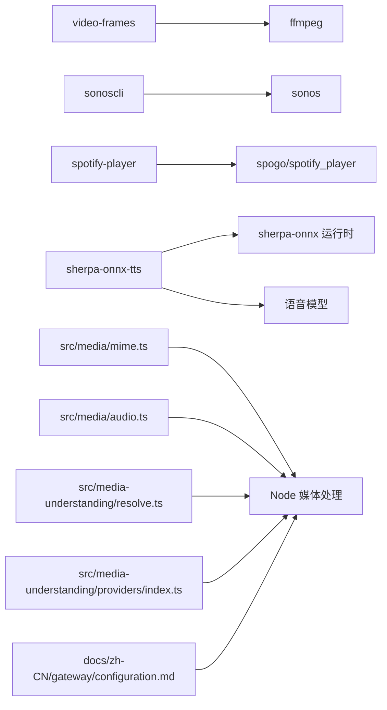

# 媒体娱乐技能

<cite>
**本文档引用的文件**
- [spotify-player/SKILL.md](file://skills/spotify-player/SKILL.md)
- [sonoscli/SKILL.md](file://skills/sonoscli/SKILL.md)
- [weather/SKILL.md](file://skills/weather/SKILL.md)
- [camsnap/SKILL.md](file://skills/camsnap/SKILL.md)
- [video-frames/SKILL.md](file://skills/video-frames/SKILL.md)
- [video-frames/scripts/frame.sh](file://skills/video-frames/scripts/frame.sh)
- [sherpa-onnx-tts/SKILL.md](file://skills/sherpa-onnx-tts/SKILL.md)
- [sherpa-onnx-tts/bin/sherpa-onnx-tts](file://skills/sherpa-onnx-tts/bin/sherpa-onnx-tts)
- [src/media/audio.ts](file://src/media/audio.ts)
- [src/media/mime.ts](file://src/media/mime.ts)
- [src/media-understanding/resolve.ts](file://src/media-understanding/resolve.ts)
- [src/media-understanding/providers/index.ts](file://src/media-understanding/providers/index.ts)
- [src/plugin-sdk/agent-media-payload.ts](file://src/plugin-sdk/agent-media-payload.ts)
- [src/agents/tools/nodes-tool.ts](file://src/agents/tools/nodes-tool.ts)
- [docs/zh-CN/gateway/configuration.md](file://docs/zh-CN/gateway/configuration.md)
</cite>

## 目录

1. [简介](#简介)
2. [项目结构](#项目结构)
3. [核心组件](#核心组件)
4. [架构总览](#架构总览)
5. [详细组件分析](#详细组件分析)
6. [依赖关系分析](#依赖关系分析)
7. [性能考虑](#性能考虑)
8. [故障排除指南](#故障排除指南)
9. [结论](#结论)
10. [附录](#附录)

## 简介

本文件系统性梳理与媒体娱乐相关的技能，包括：

- 音乐播放：Spotify 播放器与 Sonos 音响控制
- 天气查询：基于 wttr.in 的本地化天气信息
- 相机快照：RTSP/ONVIF 摄像头抓拍与剪辑
- 视频帧提取：基于 ffmpeg 的视频帧截图与缩略图生成
- 语音合成：本地 Sherpa TTS（离线无云）

文档涵盖各技能的配置要求、使用方法、集成场景与最佳实践，并提供可视化流程图与排障建议。

## 项目结构

媒体相关技能主要分布在 skills 目录下，配套有 Node 运行时侧的媒体处理工具与配置项：

- 技能层：各技能的 SKILL.md 描述与安装脚本
- 工具层：Node/Shell 包装器与命令行工具
- 配置层：网关与工具配置项，控制媒体理解与处理行为

图表来源

- [spotify-player/SKILL.md:1-65](file://skills/spotify-player/SKILL.md#L1-L65)
- [sonoscli/SKILL.md:1-66](file://skills/sonoscli/SKILL.md#L1-L66)
- [weather/SKILL.md:1-113](file://skills/weather/SKILL.md#L1-L113)
- [camsnap/SKILL.md:1-46](file://skills/camsnap/SKILL.md#L1-L46)
- [video-frames/SKILL.md:1-47](file://skills/video-frames/SKILL.md#L1-L47)
- [sherpa-onnx-tts/SKILL.md:1-104](file://skills/sherpa-onnx-tts/SKILL.md#L1-L104)
- [video-frames/scripts/frame.sh:1-82](file://skills/video-frames/scripts/frame.sh#L1-L82)
- [sherpa-onnx-tts/bin/sherpa-onnx-tts:1-179](file://skills/sherpa-onnx-tts/bin/sherpa-onnx-tts#L1-L179)
- [docs/zh-CN/gateway/configuration.md:2020-2043](file://docs/zh-CN/gateway/configuration.md#L2020-L2043)
- [src/media-understanding/resolve.ts:36-72](file://src/media-understanding/resolve.ts#L36-L72)
- [src/media-understanding/providers/index.ts:34-63](file://src/media-understanding/providers/index.ts#L34-L63)

章节来源

- [spotify-player/SKILL.md:1-65](file://skills/spotify-player/SKILL.md#L1-L65)
- [sonoscli/SKILL.md:1-66](file://skills/sonoscli/SKILL.md#L1-L66)
- [weather/SKILL.md:1-113](file://skills/weather/SKILL.md#L1-L113)
- [camsnap/SKILL.md:1-46](file://skills/camsnap/SKILL.md#L1-L46)
- [video-frames/SKILL.md:1-47](file://skills/video-frames/SKILL.md#L1-L47)
- [sherpa-onnx-tts/SKILL.md:1-104](file://skills/sherpa-onnx-tts/SKILL.md#L1-L104)
- [docs/zh-CN/gateway/configuration.md:2020-2043](file://docs/zh-CN/gateway/configuration.md#L2020-L2043)

## 核心组件

- 音乐播放控制
  - Spotify 播放器：支持搜索、播放控制、设备切换、状态查询；推荐使用 spogo，回退到 spotify_player。
  - Sonos 音响：本地网络发现、状态查询、播放控制、音量调节、分组与收藏管理。
- 天气查询
  - 基于 wttr.in 的当前天气与预报查询，无需 API Key；支持多种格式与机场代码。
- 相机快照
  - 支持 RTSP/ONVIF 摄像头抓拍、录制片段、运动检测与诊断。
- 视频帧提取
  - 基于 ffmpeg 的单帧提取、指定时间戳截图与缩略图生成。
- 语音合成
  - 本地 Sherpa TTS，通过 Node 包装器调用 sherpa-onnx CLI，支持多平台运行时与模型目录配置。

章节来源

- [spotify-player/SKILL.md:33-65](file://skills/spotify-player/SKILL.md#L33-L65)
- [sonoscli/SKILL.md:25-47](file://skills/sonoscli/SKILL.md#L25-L47)
- [weather/SKILL.md:8-113](file://skills/weather/SKILL.md#L8-L113)
- [camsnap/SKILL.md:25-46](file://skills/camsnap/SKILL.md#L25-L46)
- [video-frames/SKILL.md:25-47](file://skills/video-frames/SKILL.md#L25-L47)
- [sherpa-onnx-tts/SKILL.md:60-104](file://skills/sherpa-onnx-tts/SKILL.md#L60-L104)

## 架构总览

媒体技能在系统中的交互路径如下：

- 用户意图触发技能调用
- 技能根据配置与前置条件执行外部命令或工具
- Node 侧进行媒体类型识别、大小限制与超时控制
- 结果以媒体路径或数据形式返回给上层

图表来源

- [src/media-understanding/resolve.ts:36-72](file://src/media-understanding/resolve.ts#L36-L72)
- [src/media-understanding/providers/index.ts:34-63](file://src/media-understanding/providers/index.ts#L34-L63)
- [src/plugin-sdk/agent-media-payload.ts:1-24](file://src/plugin-sdk/agent-media-payload.ts#L1-L24)
- [src/agents/tools/nodes-tool.ts:273-327](file://src/agents/tools/nodes-tool.ts#L273-L327)

## 详细组件分析

### Spotify 播放器

- 配置与前置条件
  - 推荐安装 spogo 或 spotify_player 其一；需要 Spotify Premium 账号。
  - spogo 支持从浏览器导入 Cookie 完成授权。
- 常用命令
  - 搜索、播放/暂停/下一首/上一首、设备列表与切换、状态查询。
  - 配置文件位置与 Spotify Connect 用户 client_id 设置。
- 使用场景
  - 在终端快速控制播放列表、切换设备、查询当前曲目。
- 最佳实践
  - 优先使用 spogo；若需 GUI 或特定功能可回退到 spotify_player。
  - 设备名/ID 切换前先列出可用设备，避免连接失败。

图表来源

- [spotify-player/SKILL.md:37-65](file://skills/spotify-player/SKILL.md#L37-L65)

章节来源

- [spotify-player/SKILL.md:1-65](file://skills/spotify-player/SKILL.md#L1-L65)

### Sonos 音响控制

- 配置与前置条件
  - 安装 sonoscli；确保本地网络可达 Sonos 设备。
- 常用任务
  - 发现设备、查询状态、播放/暂停/停止、音量设置、分组/派对模式、收藏与队列管理。
  - 可选通过 SMAPI 使用 Spotify 搜索。
- 故障排除
  - SSDP 失败时可指定 IP；Mac 本地网络权限问题需授予 Local Network 访问；沙盒环境可启用容器网络访问。
- 使用场景
  - 家庭音响自动化、分区播放、派对模式切换。

图表来源

- [sonoscli/SKILL.md:29-47](file://skills/sonoscli/SKILL.md#L29-L47)

章节来源

- [sonoscli/SKILL.md:1-66](file://skills/sonoscli/SKILL.md#L1-L66)

### 天气查询

- 使用场景
  - 当用户询问天气、温度、降水概率或短期/长期预报时。
- 查询要点
  - 总是包含城市、地区或机场代码；支持多种格式与 JSON/PNG 输出。
- 注意事项
  - 无需 API Key；存在速率限制；不适用于历史天气、极端天气预警或专业气象分析。

图表来源

- [weather/SKILL.md:36-113](file://skills/weather/SKILL.md#L36-L113)

章节来源

- [weather/SKILL.md:1-113](file://skills/weather/SKILL.md#L1-L113)

### 相机快照

- 配置与前置条件
  - 安装 camsnap；配置文件位于用户目录；依赖 ffmpeg。
- 常用命令
  - 发现设备、抓拍、录制短片、运动监测、诊断。
- 使用场景
  - 家庭安防、实时监控、事件触发录制。

图表来源

- [camsnap/SKILL.md:29-46](file://skills/camsnap/SKILL.md#L29-L46)

章节来源

- [camsnap/SKILL.md:1-46](file://skills/camsnap/SKILL.md#L1-L46)

### 视频帧提取

- 配置与前置条件
  - 安装 ffmpeg；技能提供脚本封装常用场景。
- 快速开始
  - 提取首帧、指定时间戳帧、导出为 JPEG/PNG。
- 使用场景
  - 视频预览、内容定位、截图分享。

图表来源

- [video-frames/scripts/frame.sh:1-82](file://skills/video-frames/scripts/frame.sh#L1-L82)
- [video-frames/SKILL.md:29-47](file://skills/video-frames/SKILL.md#L29-L47)

章节来源

- [video-frames/SKILL.md:1-47](file://skills/video-frames/SKILL.md#L1-L47)
- [video-frames/scripts/frame.sh:1-82](file://skills/video-frames/scripts/frame.sh#L1-L82)

### 语音合成（Sherpa TTS）

- 配置与前置条件
  - 下载对应平台运行时与语音模型；在配置中设置运行时与模型目录环境变量。
- 使用方式
  - 通过 Node 包装器调用 sherpa-onnx CLI，支持覆盖模型文件、令牌文件与数据目录。
- 使用场景
  - 本地离线 TTS、隐私敏感场景、低延迟语音播报。

图表来源

- [sherpa-onnx-tts/bin/sherpa-onnx-tts:1-179](file://skills/sherpa-onnx-tts/bin/sherpa-onnx-tts#L1-L179)
- [sherpa-onnx-tts/SKILL.md:64-104](file://skills/sherpa-onnx-tts/SKILL.md#L64-L104)

章节来源

- [sherpa-onnx-tts/SKILL.md:1-104](file://skills/sherpa-onnx-tts/SKILL.md#L1-L104)
- [sherpa-onnx-tts/bin/sherpa-onnx-tts:1-179](file://skills/sherpa-onnx-tts/bin/sherpa-onnx-tts#L1-L179)

## 依赖关系分析

- 技能与外部工具
  - 视频帧提取依赖 ffmpeg；Sonos 控制依赖 sonoscli；Spotify 控制依赖 spogo/spotify_player；TTS 依赖 sherpa-onnx 运行时与模型。
- Node 侧媒体处理
  - 媒体类型识别与扩展映射、Telegram 语音兼容性判断、媒体理解配置解析与提供者注册。
- 网关配置
  - tools.media.\* 统一控制图片/音频/视频的理解能力、并发度、大小限制、超时与模型选择。

图表来源

- [video-frames/SKILL.md:1-47](file://skills/video-frames/SKILL.md#L1-L47)
- [video-frames/scripts/frame.sh:1-82](file://skills/video-frames/scripts/frame.sh#L1-L82)
- [sonoscli/SKILL.md:1-66](file://skills/sonoscli/SKILL.md#L1-L66)
- [spotify-player/SKILL.md:1-65](file://skills/spotify-player/SKILL.md#L1-L65)
- [sherpa-onnx-tts/SKILL.md:1-104](file://skills/sherpa-onnx-tts/SKILL.md#L1-L104)
- [src/media/mime.ts:1-193](file://src/media/mime.ts#L1-L193)
- [src/media/audio.ts:1-49](file://src/media/audio.ts#L1-L49)
- [src/media-understanding/resolve.ts:36-72](file://src/media-understanding/resolve.ts#L36-L72)
- [src/media-understanding/providers/index.ts:34-63](file://src/media-understanding/providers/index.ts#L34-L63)
- [docs/zh-CN/gateway/configuration.md:2020-2043](file://docs/zh-CN/gateway/configuration.md#L2020-L2043)

章节来源

- [src/media/mime.ts:1-193](file://src/media/mime.ts#L1-L193)
- [src/media/audio.ts:1-49](file://src/media/audio.ts#L1-L49)
- [src/media-understanding/resolve.ts:36-72](file://src/media-understanding/resolve.ts#L36-L72)
- [src/media-understanding/providers/index.ts:34-63](file://src/media-understanding/providers/index.ts#L34-L63)
- [docs/zh-CN/gateway/configuration.md:2020-2043](file://docs/zh-CN/gateway/configuration.md#L2020-L2043)

## 性能考虑

- 并发与资源
  - 合理设置 tools.media.concurrency，避免同时大量媒体理解任务导致资源争用。
- 文件大小与超时
  - 图片默认上限 10MB，音频 20MB，视频 50MB；根据场景调整 maxBytes 与 timeoutSeconds。
- 外部工具效率
  - ffmpeg 提取帧时优先使用 --time 精确定位，减少解码开销；PNG 适合 UI 截图，JPG 适合快速分享。
- 网络与权限
  - Sonos 发现可能受本地网络与沙盒权限影响，必要时启用容器网络或授予系统权限。

## 故障排除指南

- Sonos 发现失败
  - SSDP 错误：Mac 上为父进程授予 Local Network 权限；或使用沙盒容器并允许网络访问。
  - 绑定错误：沙盒限制网络访问，需提升权限或调整沙盒策略。
- TTS 运行时缺失
  - 确认运行时与模型目录环境变量正确；当模型目录包含多个 .onnx 文件时，显式指定模型文件或通过参数覆盖。
- 媒体理解配置
  - 若媒体过大或超时，检查 tools.media.image/audio/video 的 maxBytes 与 timeoutSeconds；必要时降级到更小模型或禁用能力。

章节来源

- [sonoscli/SKILL.md:49-66](file://skills/sonoscli/SKILL.md#L49-L66)
- [sherpa-onnx-tts/bin/sherpa-onnx-tts:120-132](file://skills/sherpa-onnx-tts/bin/sherpa-onnx-tts#L120-L132)
- [docs/zh-CN/gateway/configuration.md:2020-2043](file://docs/zh-CN/gateway/configuration.md#L2020-L2043)

## 结论

上述媒体娱乐技能覆盖了从播放控制、天气查询、相机快照到视频帧提取与本地语音合成的完整链路。通过合理的前置条件配置、工具依赖与网关参数调优，可在保证性能与隐私的前提下，为用户提供流畅的媒体体验。建议在生产环境中结合实际网络与硬件条件，持续优化并发与超时策略，并针对不同技能场景制定标准化的使用规范与排障手册。

## 附录

- 实际使用示例与最佳实践
  - 音乐播放：优先使用 spogo，设备切换前先列出设备；播放控制命令简洁可靠。
  - 天气查询：每次查询附带城市/地区/机场代码；需要 JSON/PNG 时明确格式参数。
  - 相机快照：先进行短时测试捕获，再进行长时间录制；注意 ffmpeg 可用性。
  - 视频帧提取：优先使用 --time 精确截帧；根据用途选择 JPEG/PNG。
  - 语音合成：下载对应平台运行时与模型；必要时显式指定模型/令牌/数据目录。
