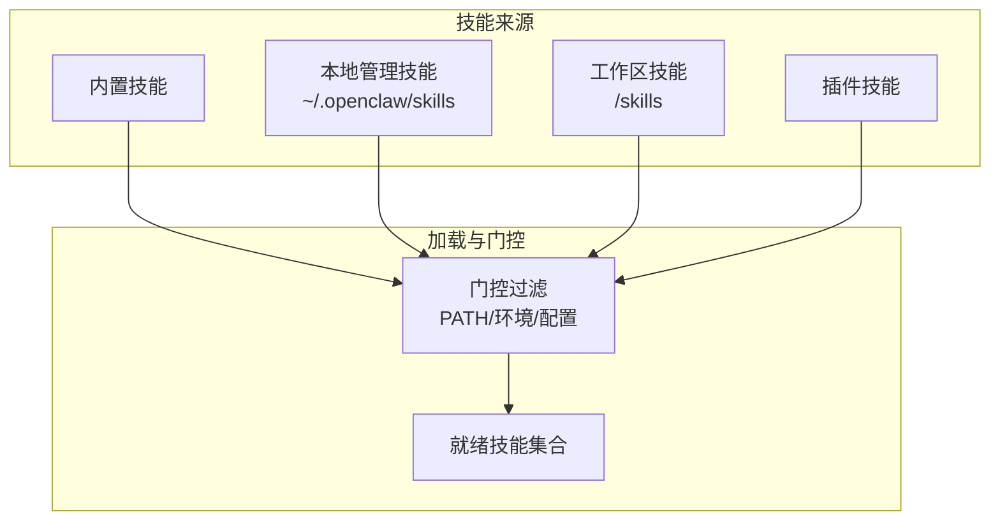
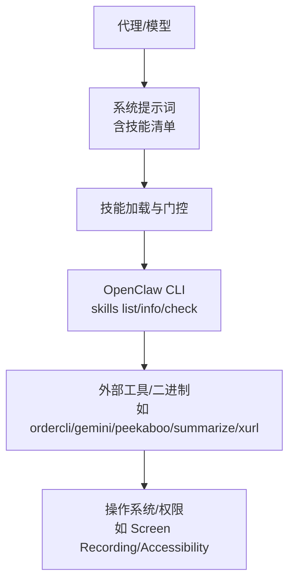
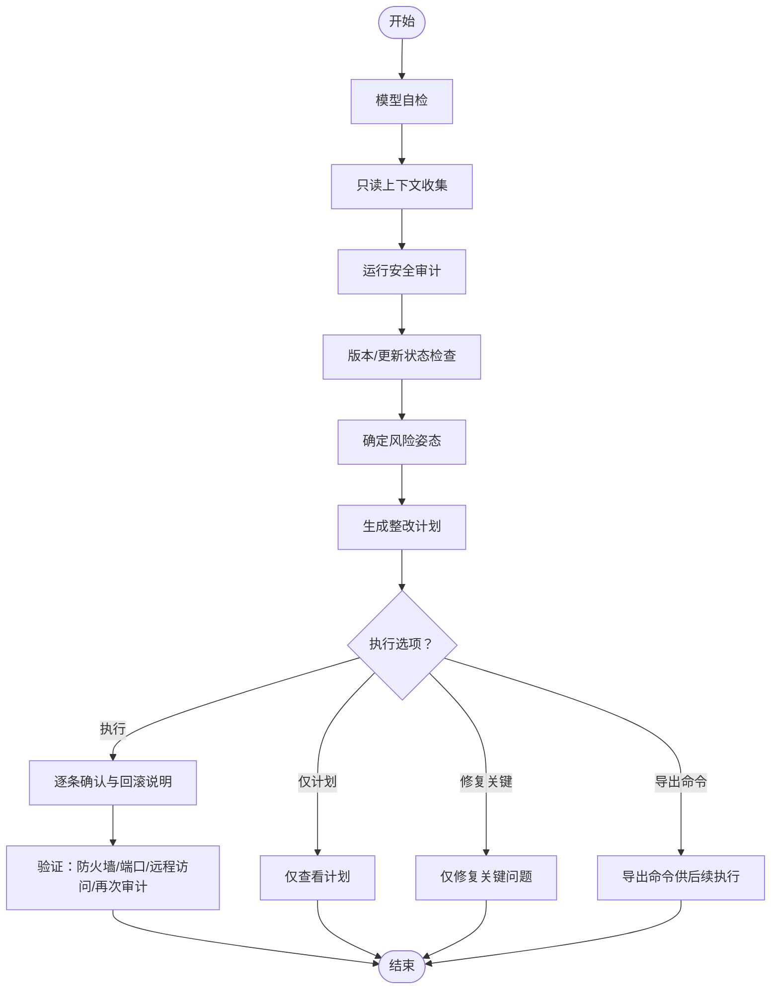
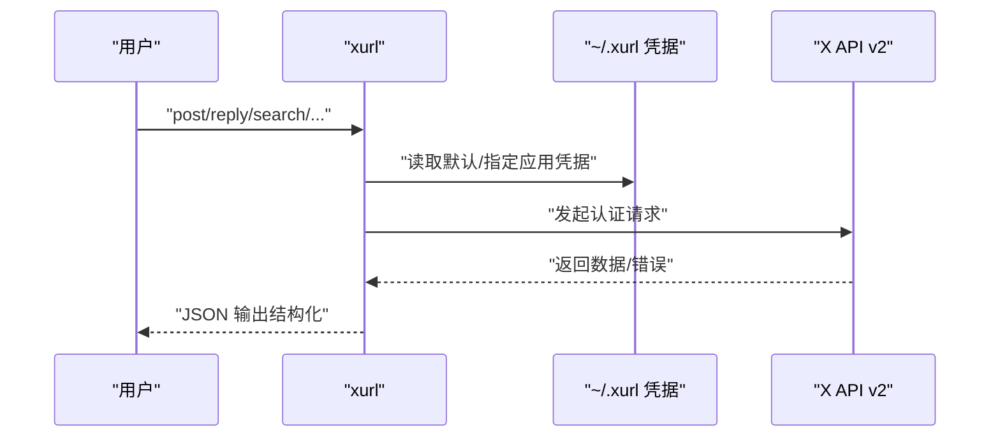
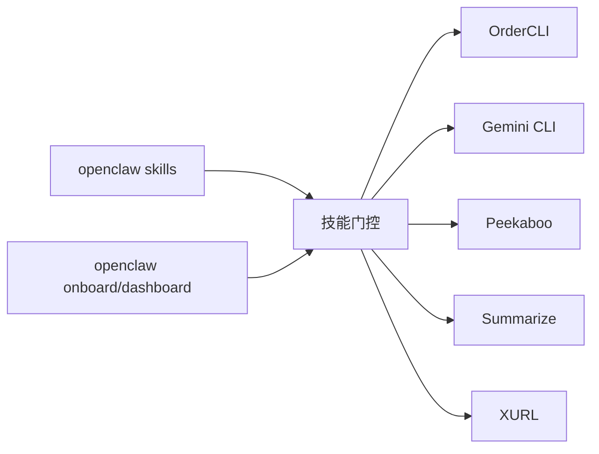

# 实用工具技能

<cite>
**本文引用的文件**
- [ordercli/SKILL.md](file://skills/ordercli/SKILL.md)
- [gemini/SKILL.md](file://skills/gemini/SKILL.md)
- [healthcheck/SKILL.md](file://skills/healthcheck/SKILL.md)
- [peekaboo/SKILL.md](file://skills/peekaboo/SKILL.md)
- [session-logs/SKILL.md](file://skills/session-logs/SKILL.md)
- [summarize/SKILL.md](file://skills/summarize/SKILL.md)
- [xurl/SKILL.md](file://skills/xurl/SKILL.md)
- [docs/cli/index.md](file://docs/cli/index.md)
- [docs/tools/skills.md](file://docs/tools/skills.md)
- [docs/start/getting-started.md](file://docs/start/getting-started.md)
- [src/cli/skills-cli.ts](file://src/cli/skills-cli.ts)
</cite>

## 目录

1. [简介](#简介)
2. [项目结构与技能体系](#项目结构与技能体系)
3. [核心技能概览](#核心技能概览)
4. [架构总览](#架构总览)
5. [详细技能解析](#详细技能解析)
6. [依赖关系分析](#依赖关系分析)
7. [性能与安全考量](#性能与安全考量)
8. [故障排查指南](#故障排查指南)
9. [结论](#结论)
10. [附录：常用操作速查](#附录常用操作速查)

## 简介

本文件系统化梳理 OpenClaw 的“实用工具技能”，围绕以下能力展开：

- OrderCLI 订单查询与重购（Foodora）
- Gemini CLI 问答、摘要与生成
- 健康检查（主机加固与风险评估）
- Peekaboo macOS UI 自动化
- 会话日志检索与分析（基于 jq/ripgrep）
- 摘要生成（Summarize CLI）
- XURL 链接处理（X/Twitter API）

内容涵盖用途、安装配置、使用场景、操作流程与最佳实践，帮助在日常办公、系统监控、信息整理等场景高效落地。

## 项目结构与技能体系

OpenClaw 使用“技能（Skills）”机制管理可被代理调用的外部工具与工作流。技能以目录形式存在，包含规范化的 SKILL.md 文档与可选的安装器元数据。技能加载时会根据环境变量、二进制可用性、配置项进行“门控过滤”，仅对满足条件的技能注入到系统提示词中。

- 技能来源与优先级
  - 内置技能（随安装包分发）
  - 本地管理技能（~/.openclaw/skills）
  - 工作区技能（<workspace>/skills）
  - 插件自带技能（启用插件后参与加载）
- CLI 能力
  - openclaw skills list/info/check：查看技能状态与就绪度
  - openclaw onboard：快速引导安装与配置
  - openclaw dashboard：打开控制界面进行首次聊天

图表来源

- [docs/tools/skills.md:13-27](file://docs/tools/skills.md#L13-L27)
- [docs/tools/skills.md:106-147](file://docs/tools/skills.md#L106-L147)

章节来源

- [docs/tools/skills.md:13-27](file://docs/tools/skills.md#L13-L27)
- [docs/tools/skills.md:106-147](file://docs/tools/skills.md#L106-L147)
- [docs/cli/index.md:471-488](file://docs/cli/index.md#L471-L488)
- [src/cli/skills-cli.ts:40-81](file://src/cli/skills-cli.ts#L40-L81)

## 核心技能概览

- OrderCLI：面向 Foodora 的订单查询、活动订单跟踪、历史订单详情与重购（需浏览器登录或会话导入）
- Gemini CLI：一次性问答、摘要与生成，支持扩展列表与管理
- 健康检查：主机安全加固与风险评估，结合 OpenClaw 安全审计与版本状态检查，支持周期性任务调度
- Peekaboo：macOS 屏幕录制、窗口/菜单/应用自动化、输入驱动与截图分析
- 会话日志：基于 jq/ripgrep 的会话 JSONL 检索与统计，支持成本、消息计数、工具使用分析
- 摘要生成：URL/本地文件/YouTube 链接的摘要与转录提取，支持多模型与服务
- XURL：X/Twitter API v2 的认证请求封装，覆盖发推、回复、转发、搜索、用户信息、媒体上传等

章节来源

- [ordercli/SKILL.md:1-79](file://skills/ordercli/SKILL.md#L1-L79)
- [gemini/SKILL.md:1-44](file://skills/gemini/SKILL.md#L1-L44)
- [healthcheck/SKILL.md:1-246](file://skills/healthcheck/SKILL.md#L1-L246)
- [peekaboo/SKILL.md:1-191](file://skills/peekaboo/SKILL.md#L1-L191)
- [session-logs/SKILL.md:1-116](file://skills/session-logs/SKILL.md#L1-L116)
- [summarize/SKILL.md:1-88](file://skills/summarize/SKILL.md#L1-L88)
- [xurl/SKILL.md:1-462](file://skills/xurl/SKILL.md#L1-L462)

## 架构总览

下图展示技能在系统中的位置与交互：代理通过系统提示词获知可用技能；技能通过门控过滤决定是否可用；最终由 CLI 或工具层执行具体命令。

图表来源

- [docs/tools/skills.md:106-147](file://docs/tools/skills.md#L106-L147)
- [docs/cli/index.md:471-488](file://docs/cli/index.md#L471-L488)

## 详细技能解析

### OrderCLI（Foodora 订单）

- 用途
  - 查询活动订单、跟踪状态、查看历史详情
  - 重购（预览/确认/指定地址）
  - Cloudflare/机器人防护绕过（浏览器登录/复用配置/导入 Cookie）
  - 会话导入（免密码登录）、Deliveroo（开发中）
- 安装与前置
  - 支持 brew/go 安装，要求二进制在 PATH
- 使用场景
  - 日常点餐追踪、批量重购、跨设备登录
- 快速操作
  - 列出国家/地区、设置国家、登录、查看活动订单、历史详情、重购（带确认与地址选择）
  - 浏览器登录与会话导入用于绕过机器人保护
- 注意事项
  - 使用测试配置文件进行验证
  - 执行重购前务必确认

章节来源

- [ordercli/SKILL.md:1-79](file://skills/ordercli/SKILL.md#L1-L79)

### Gemini CLI（问答/摘要/生成）

- 用途
  - 一次性问答、摘要与生成
  - 列举/管理扩展
- 安装与前置
  - brew 安装 gemini CLI，确保二进制在 PATH
- 使用场景
  - 快速问答、内容提炼、模板化生成
- 快速操作
  - 传入提示词直接输出结果
  - 指定模型与输出格式
  - 查看/管理扩展
- 注意事项
  - 首次可能需要交互式登录
  - 避免使用高风险模式

章节来源

- [gemini/SKILL.md:1-44](file://skills/gemini/SKILL.md#L1-L44)

### 健康检查（主机安全加固与风险评估）

- 用途
  - 主机安全审计、防火墙/SSH/更新策略建议、风险姿态设定、版本状态检查
  - 结合 OpenClaw 安全审计与周期性任务调度
- 工作流
  - 1. 模型自检（推荐高阶模型）
  - 2. 只读上下文收集（OS/权限/访问路径/网络暴露/网关状态/备份/磁盘加密/自动更新）
  - 3. 运行 OpenClaw 安全审计（可修复）
  - 4. 版本/更新状态检查
  - 5. 风险姿态选择（平衡/硬核/开发者便利/自定义）
  - 6. 输出整改计划（含命令、回滚、最小权限、凭据卫生）
  - 7. 执行选项（执行/仅计划/修复关键/导出命令）
  - 8. 验证与报告
- 周期性检查
  - 审计、深度审计、版本检查
  - 通过 openclaw cron 添加定时任务（如 healthcheck:security-audit、healthcheck:update-status）
- 命令参考
  - openclaw security audit / --deep / --fix / --json
  - openclaw update status
  - openclaw cron add/list/runs/run

图表来源

- [healthcheck/SKILL.md:23-151](file://skills/healthcheck/SKILL.md#L23-L151)

章节来源

- [healthcheck/SKILL.md:1-246](file://skills/healthcheck/SKILL.md#L1-L246)
- [docs/cli/index.md:270-272](file://docs/cli/index.md#L270-L272)

### Peekaboo（macOS UI 自动化）

- 用途
  - 屏幕捕获/视频采集帧提取、UI 元素标注、点击/拖拽/滚动/输入、应用/窗口/菜单/Dock 管理、剪贴板、对话框、Spaces 切换、可视化反馈动画
- 安装与前置
  - brew 安装，需授予屏幕录制与辅助功能权限
- 使用场景
  - 自动化登录、表单填写、界面截图、仪表盘摘要、窗口管理
- 快速操作
  - 权限检查、列出应用、UI 标注截图、按元素 ID/坐标点击、文本输入、滚动/手势、键盘热键、应用/窗口/菜单/状态栏/Dock 操作
- 注意事项
  - 建议先 see 并标注再点击，确保目标稳定

章节来源

- [peekaboo/SKILL.md:1-191](file://skills/peekaboo/SKILL.md#L1-L191)

### 会话日志（基于 jq/ripgrep 的检索与分析）

- 用途
  - 搜索历史会话记录（JSONL），提取用户消息、助手响应、工具调用、成本统计、消息计数、工具使用分布
- 存储位置
  - ~/.openclaw/agents/<agentId>/sessions/
  - sessions.json：会话索引
  - <session-id>.jsonl：完整对话转录
- 使用场景
  - 回溯历史对话、统计成本、分析工具使用、关键词检索
- 快速操作
  - 列出按日期与大小排序的会话
  - 按日期筛选会话
  - 提取用户消息/助手响应
  - 统计单日成本
  - 计算消息数量与时间范围
  - 工具使用统计
  - 全局关键词搜索
- 提示
  - 大文件建议 head/tail 采样
  - sessions.json 映射聊天渠道到会话 ID

章节来源

- [session-logs/SKILL.md:1-116](file://skills/session-logs/SKILL.md#L1-L116)

### 摘要生成（Summarize CLI）

- 用途
  - 快速摘要 URL/本地文件/YouTube 链接，支持最佳努力转录（无需 yt-dlp）
- 安装与前置
  - brew 安装 summarize CLI，支持配置文件与服务密钥
- 使用场景
  - 快速理解网页/文章/视频内容，生成摘要或转录
- 快速操作
  - 指定模型与长度/令牌上限
  - 仅抽取文本（URLs）
  - YouTube 自动抽取（可选 Apify 回退）
- 配置
  - OPENAI/Anthropic/xAI/Google 等提供商 API Key
  - 可选配置文件与服务（FIRECRAWL_API_KEY、APIFY_API_TOKEN）

章节来源

- [summarize/SKILL.md:1-88](file://skills/summarize/SKILL.md#L1-L88)

### XURL（X/Twitter API v2）

- 用途
  - 发布/回复/引用/删除推文，读取推文，搜索，用户信息，时间线，点赞/取消赞，转发/取消转发，收藏/移除收藏，关注/取消关注，屏蔽/取消屏蔽，静音/取消静音，发送私信，媒体上传与状态查询，应用管理与切换
- 安装与前置
  - brew/npm/go 安装，需 OAuth2 认证（凭据保存于 ~/.xurl）
- 安全注意事项
  - 严禁在代理/LLM 会话中打印/解析/上传 ~/.xurl
  - 严禁在聊天中粘贴凭据
  - 禁止在代理命令中使用敏感标志（如 bearer-token、consumer-key 等）
  - 不要在代理会话中使用 --verbose
- 使用场景
  - 社交运营、内容发布、互动管理、媒体处理、多账号/多应用切换
- 快速操作
  - 发布/回复/引用/删除
  - 搜索/读取/时间线/提及
  - 点赞/转发/收藏/关注/屏蔽/静音
  - 私信/媒体上传/状态查询
  - 应用注册/切换/默认账户设置

图表来源

- [xurl/SKILL.md:73-105](file://skills/xurl/SKILL.md#L73-L105)
- [xurl/SKILL.md:314-336](file://skills/xurl/SKILL.md#L314-L336)

章节来源

- [xurl/SKILL.md:1-462](file://skills/xurl/SKILL.md#L1-L462)

## 依赖关系分析

- 技能门控
  - 二进制存在性（PATH）、环境变量、配置项
  - macOS 专属技能在连接 macOS 节点且允许 system.run 时可被视作可用
- CLI 与技能
  - openclaw skills list/info/check 用于查看技能就绪度
  - openclaw onboard/dashboard 用于首次安装与接入
- 外部工具
  - ordercli/gemini/peekaboo/summarize/xurl 分别对应不同平台与功能域

图表来源

- [docs/tools/skills.md:106-147](file://docs/tools/skills.md#L106-L147)
- [docs/cli/index.md:471-488](file://docs/cli/index.md#L471-L488)

章节来源

- [docs/tools/skills.md:106-147](file://docs/tools/skills.md#L106-L147)
- [docs/cli/index.md:471-488](file://docs/cli/index.md#L471-L488)
- [src/cli/skills-cli.ts:40-81](file://src/cli/skills-cli.ts#L40-L81)

## 性能与安全考量

- 性能
  - 会话日志检索建议使用 head/tail 采样大文件，避免全量扫描
  - 摘要生成可设置最大输出令牌数与长度，控制成本
  - 健康检查建议使用 --json 便于脚本化与自动化
- 安全
  - 健康检查严格要求显式批准后再变更系统设置
  - XURL 强制禁止在代理会话中使用敏感标志与 verbose 输出
  - 会话日志与 XURL 凭据均不得泄露至 LLM 上下文或日志
  - Peekaboo 需要屏幕录制与辅助功能权限，应谨慎授权

章节来源

- [session-logs/SKILL.md:104-116](file://skills/session-logs/SKILL.md#L104-L116)
- [summarize/SKILL.md:67-74](file://skills/summarize/SKILL.md#L67-L74)
- [healthcheck/SKILL.md:153-167](file://skills/healthcheck/SKILL.md#L153-L167)
- [xurl/SKILL.md:73-82](file://skills/xurl/SKILL.md#L73-L82)
- [peekaboo/SKILL.md:187-191](file://skills/peekaboo/SKILL.md#L187-L191)

## 故障排查指南

- 技能不可用
  - 使用 openclaw skills check 查看缺失的二进制/环境/配置
  - 使用 openclaw skills info <name> 获取详细说明与安装器
- 认证问题
  - XURL：使用 xurl auth status 检查已注册应用与默认账户；必要时重新 OAuth2 登录
  - OrderCLI：尝试浏览器登录或会话导入以绕过机器人保护
- 权限问题
  - Peekaboo：运行 xurl permissions 或在系统偏好设置中授予屏幕录制与辅助功能
- 日志与审计
  - 健康检查：执行后重新运行 openclaw security audit 与 openclaw update status 验证
  - 会话日志：使用 jq/rg 快速定位关键词，注意大文件采样

章节来源

- [src/cli/skills-cli.ts:40-81](file://src/cli/skills-cli.ts#L40-L81)
- [xurl/SKILL.md:71-105](file://skills/xurl/SKILL.md#L71-L105)
- [ordercli/SKILL.md:58-68](file://skills/ordercli/SKILL.md#L58-L68)
- [peekaboo/SKILL.md:28-32](file://skills/peekaboo/SKILL.md#L28-L32)
- [healthcheck/SKILL.md:92-96](file://skills/healthcheck/SKILL.md#L92-L96)
- [session-logs/SKILL.md:98-102](file://skills/session-logs/SKILL.md#L98-L102)

## 结论

上述实用工具技能覆盖了从日常办公（订单、摘要、X 平台运营）、系统监控（健康检查、会话日志）、到桌面自动化（Peekaboo）的广泛场景。通过 OpenClaw 的技能门控与 CLI 管理，用户可以安全、可控地将外部工具整合进代理工作流，实现端到端的自动化与智能化。

## 附录：常用操作速查

- 技能管理
  - openclaw skills list/info/check
  - openclaw onboard（首次安装）
  - openclaw dashboard（控制界面）
- 健康检查
  - openclaw security audit / --deep / --fix / --json
  - openclaw update status
  - openclaw cron add --name healthcheck:security-audit
- 会话日志
  - jq/rg 快速检索与统计
- OrderCLI
  - foodora countries/config set/login/orders/history/show/reorder
  - 浏览器登录与会话导入
- Gemini
  - gemini "提示词" / --model / --output-format
- Summarize
  - summarize "URL/文件/YouTube" --model --length --max-output-tokens --extract-only --json
- XURL
  - xurl auth status / oauth2 / whoami / timeline / search / post/reply/quote/delete
  - xurl media upload/status / auth apps list/remove/default

章节来源

- [docs/cli/index.md:471-488](file://docs/cli/index.md#L471-L488)
- [docs/start/getting-started.md:55-77](file://docs/start/getting-started.md#L55-L77)
- [healthcheck/SKILL.md:169-203](file://skills/healthcheck/SKILL.md#L169-L203)
- [session-logs/SKILL.md:32-116](file://skills/session-logs/SKILL.md#L32-L116)
- [ordercli/SKILL.md:36-79](file://skills/ordercli/SKILL.md#L36-L79)
- [gemini/SKILL.md:29-44](file://skills/gemini/SKILL.md#L29-L44)
- [summarize/SKILL.md:38-88](file://skills/summarize/SKILL.md#L38-L88)
- [xurl/SKILL.md:109-156](file://skills/xurl/SKILL.md#L109-L156)
