# 开发工具技能

<cite>
**本文档引用的文件**
- [README.md](file://README.md)
- [package.json](file://package.json)
- [tsconfig.json](file://tsconfig.json)
- [.github/workflows/ci.yml](file://.github/workflows/ci.yml)
- [scripts/auth-monitor.sh](file://scripts/auth-monitor.sh)
- [scripts/cron_usage_report.ts](file://scripts/cron_usage_report.ts)
- [scripts/docs-link-audit.mjs](file://scripts/docs-link-audit.mjs)
- [scripts/docs-spellcheck.sh](file://scripts/docs-spellcheck.sh)
- [skills/github/SKILL.md](file://skills/github/SKILL.md)
- [skills/gh-issues/SKILL.md](file://skills/gh-issues/SKILL.md)
- [skills/blogwatcher/SKILL.md](file://skills/blogwatcher/SKILL.md)
- [skills/gog/SKILL.md](file://skills/gog/SKILL.md)
- [skills/eightctl/SKILL.md](file://skills/eightctl/SKILL.md)
- [skills/sag/SKILL.md](file://skills/sag/SKILL.md)
- [skills/wacli/SKILL.md](file://skills/wacli/SKILL.md)
</cite>

## 目录

1. [简介](#简介)
2. [项目结构](#项目结构)
3. [核心组件](#核心组件)
4. [架构总览](#架构总览)
5. [详细组件分析](#详细组件分析)
6. [依赖关系分析](#依赖关系分析)
7. [性能考虑](#性能考虑)
8. [故障排除指南](#故障排除指南)
9. [结论](#结论)
10. [附录](#附录)

## 简介

本文件面向开发团队与运维人员，系统化梳理与OpenClaw生态相关的开发工具技能，重点覆盖以下主题：

- GitHub 集成：通过 gh CLI 进行 Issues/PR/CI 管理与自动化查询
- GitHub Issues 自动化：基于 REST API 的 Issues 拉取、子代理自动修复与评审跟进
- 博客监控：使用 blogwatcher CLI 跟踪 RSS/Atom 更新
- GOG 游戏管理：通过 gog CLI 管理 Google Workspace（Gmail/日历/驱动/联系人/表格/文档）
- Eightctl 工具：控制 Eight Sleep 床垫设备（状态、温度、闹钟、定时）
- SAG 系统管理：ElevenLabs 文本转语音（TTS）本地播放与语音角色
- WACLI 命令行工具：向第三方发送 WhatsApp 消息与历史检索

上述技能在仓库中以“技能”（skills）形式提供，配合 CI/CD 流水线、脚本与文档校验工具，形成可复用、可审计的开发工作流。

## 项目结构

OpenClaw 采用多语言混合工程，包含 Node.js/TypeScript 核心、Swift/iOS/macOS 应用、以及大量技能与脚本。与本主题直接相关的目录与文件包括：

- skills：各工具技能的说明与使用指南
- .github/workflows：CI 流水线定义
- scripts：认证监控、链接检查、拼写检查、用量统计等运维脚本
- package.json：包管理与脚本入口
- tsconfig.json：TypeScript 编译配置

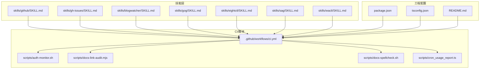

**图表来源**

- [.github/workflows/ci.yml:1-737](file://.github/workflows/ci.yml#L1-L737)
- [package.json:1-465](file://package.json#L1-L465)
- [tsconfig.json:1-29](file://tsconfig.json#L1-L29)
- [README.md:1-560](file://README.md#L1-L560)
- [scripts/auth-monitor.sh:1-90](file://scripts/auth-monitor.sh#L1-L90)
- [scripts/docs-link-audit.mjs:1-234](file://scripts/docs-link-audit.mjs#L1-L234)
- [scripts/docs-spellcheck.sh:1-45](file://scripts/docs-spellcheck.sh#L1-L45)
- [scripts/cron_usage_report.ts:1-274](file://scripts/cron_usage_report.ts#L1-L274)
- [skills/github/SKILL.md:1-164](file://skills/github/SKILL.md#L1-L164)
- [skills/gh-issues/SKILL.md:1-866](file://skills/gh-issues/SKILL.md#L1-L866)
- [skills/blogwatcher/SKILL.md:1-70](file://skills/blogwatcher/SKILL.md#L1-L70)
- [skills/gog/SKILL.md:1-117](file://skills/gog/SKILL.md#L1-L117)
- [skills/eightctl/SKILL.md:1-51](file://skills/eightctl/SKILL.md#L1-L51)
- [skills/sag/SKILL.md:1-88](file://skills/sag/SKILL.md#L1-L88)
- [skills/wacli/SKILL.md:1-73](file://skills/wacli/SKILL.md#L1-L73)

**章节来源**

- [README.md:1-560](file://README.md#L1-L560)
- [package.json:1-465](file://package.json#L1-L465)
- [tsconfig.json:1-29](file://tsconfig.json#L1-L29)
- [.github/workflows/ci.yml:1-737](file://.github/workflows/ci.yml#L1-L737)

## 核心组件

本节概述与开发工作流密切相关的技能与工具，并给出其职责边界与适用场景。

- GitHub 技能（gh CLI）
  - 用途：Issues/PR/CI 查询、评论与合并、API 查询与 JSON 输出
  - 适用场景：日常代码审查、CI 失败排查、批量数据导出
  - 安装与认证：通过 gh CLI 官方安装器安装；首次运行需执行登录与状态验证
  - 参考路径：[skills/github/SKILL.md:1-164](file://skills/github/SKILL.md#L1-L164)

- GitHub Issues 自动化（REST API）
  - 用途：拉取 Issues → 子代理自动修复 → PR 评审跟进 → 可选持续轮询
  - 适用场景：自动化缺陷修复、减少重复性人工评审
  - 关键能力：参数解析、过滤条件、预检（分支/PR/claim）、并发子代理、评审处理
  - 参考路径：[skills/gh-issues/SKILL.md:1-866](file://skills/gh-issues/SKILL.md#L1-L866)

- 博客监控（blogwatcher）
  - 用途：RSS/Atom 订阅、扫描更新、标记已读、增删站点
  - 适用场景：信息聚合、内容提醒、知识库维护
  - 参考路径：[skills/blogwatcher/SKILL.md:1-70](file://skills/blogwatcher/SKILL.md#L1-L70)

- GOG 游戏管理（gog CLI）
  - 用途：Gmail/日历/驱动/联系人/表格/文档操作；OAuth 配置
  - 适用场景：自动化邮件发送、日程同步、数据表维护
  - 参考路径：[skills/gog/SKILL.md:1-117](file://skills/gog/SKILL.md#L1-L117)

- Eightctl 工具
  - 用途：Eight Sleep 设备状态、温度、闹钟、定时、音频与底座控制
  - 适用场景：智能睡眠环境自动化、健康数据联动
  - 参考路径：[skills/eightctl/SKILL.md:1-51](file://skills/eightctl/SKILL.md#L1-L51)

- SAG 系统管理（ElevenLabs TTS）
  - 用途：本地 TTS 播放、语音角色、SSML/音频标签、模型选择
  - 适用场景：语音播报、有声内容生成、聊天语音回复
  - 参考路径：[skills/sag/SKILL.md:1-88](file://skills/sag/SKILL.md#L1-L88)

- WACLI 命令行工具
  - 用途：向第三方发送 WhatsApp 消息、搜索/同步历史、JID 管理
  - 适用场景：外部沟通自动化、历史归档与检索
  - 参考路径：[skills/wacli/SKILL.md:1-73](file://skills/wacli/SKILL.md#L1-L73)

**章节来源**

- [skills/github/SKILL.md:1-164](file://skills/github/SKILL.md#L1-L164)
- [skills/gh-issues/SKILL.md:1-866](file://skills/gh-issues/SKILL.md#L1-L866)
- [skills/blogwatcher/SKILL.md:1-70](file://skills/blogwatcher/SKILL.md#L1-L70)
- [skills/gog/SKILL.md:1-117](file://skills/gog/SKILL.md#L1-L117)
- [skills/eightctl/SKILL.md:1-51](file://skills/eightctl/SKILL.md#L1-L51)
- [skills/sag/SKILL.md:1-88](file://skills/sag/SKILL.md#L1-L88)
- [skills/wacli/SKILL.md:1-73](file://skills/wacli/SKILL.md#L1-L73)

## 架构总览

下图展示开发工具在项目中的集成位置与交互关系：技能作为“工具层”，CI/脚本作为“流程层”，工程配置作为“基础设施层”。

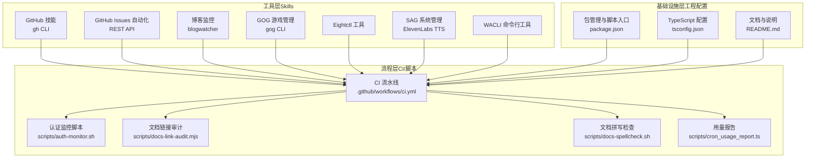

**图表来源**

- [.github/workflows/ci.yml:1-737](file://.github/workflows/ci.yml#L1-L737)
- [package.json:1-465](file://package.json#L1-L465)
- [tsconfig.json:1-29](file://tsconfig.json#L1-L29)
- [README.md:1-560](file://README.md#L1-L560)
- [scripts/auth-monitor.sh:1-90](file://scripts/auth-monitor.sh#L1-L90)
- [scripts/docs-link-audit.mjs:1-234](file://scripts/docs-link-audit.mjs#L1-L234)
- [scripts/docs-spellcheck.sh:1-45](file://scripts/docs-spellcheck.sh#L1-L45)
- [scripts/cron_usage_report.ts:1-274](file://scripts/cron_usage_report.ts#L1-L274)
- [skills/github/SKILL.md:1-164](file://skills/github/SKILL.md#L1-L164)
- [skills/gh-issues/SKILL.md:1-866](file://skills/gh-issues/SKILL.md#L1-L866)
- [skills/blogwatcher/SKILL.md:1-70](file://skills/blogwatcher/SKILL.md#L1-L70)
- [skills/gog/SKILL.md:1-117](file://skills/gog/SKILL.md#L1-L117)
- [skills/eightctl/SKILL.md:1-51](file://skills/eightctl/SKILL.md#L1-L51)
- [skills/sag/SKILL.md:1-88](file://skills/sag/SKILL.md#L1-L88)
- [skills/wacli/SKILL.md:1-73](file://skills/wacli/SKILL.md#L1-L73)

## 详细组件分析

### GitHub 集成（gh CLI）

- 配置方法
  - 安装：提供 brew/apt 等多种安装方式
  - 认证：首次登录并验证状态
- 使用场景
  - PR 状态与 CI 检查查看
  - Issues 列表与评论管理
  - API 查询与 JSON 结构化输出
- 集成方式
  - 在技能中声明二进制依赖与安装指引
  - 在 CI 中结合文档校验与脚本进行统一管理

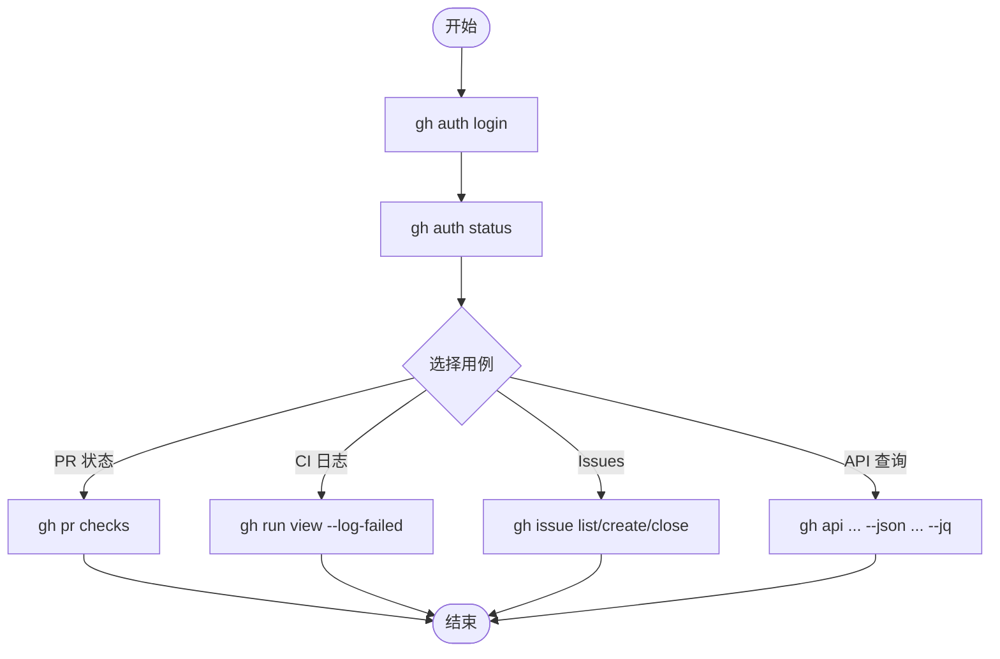

**图表来源**

- [skills/github/SKILL.md:56-164](file://skills/github/SKILL.md#L56-L164)

**章节来源**

- [skills/github/SKILL.md:1-164](file://skills/github/SKILL.md#L1-L164)

### GitHub Issues 自动化（REST API）

- 配置方法
  - 环境变量注入 GH_TOKEN；支持从配置文件读取
  - 参数解析与过滤（标签、里程碑、指派、状态）
- 使用场景
  - 批量缺陷修复与 PR 创建
  - 评审评论跟进与子代理修复
  - 持续轮询与通知汇总
- 集成方式
  - 通过 exec 调用 curl；避免依赖 gh CLI
  - 并发子代理与 claim 机制防止重复处理

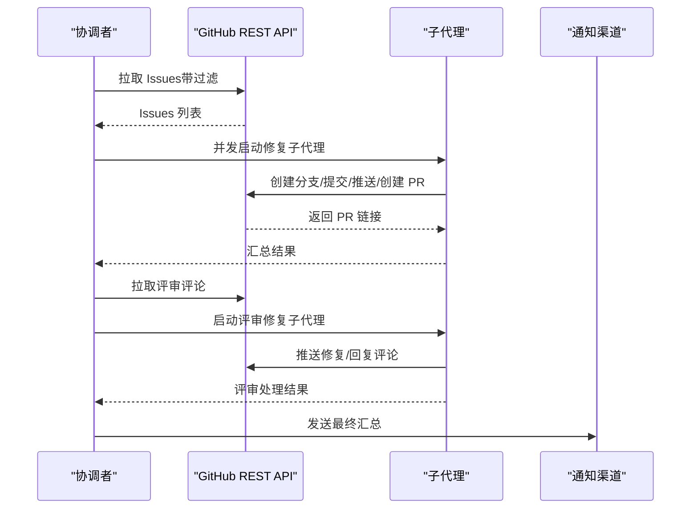

**图表来源**

- [skills/gh-issues/SKILL.md:21-866](file://skills/gh-issues/SKILL.md#L21-L866)

**章节来源**

- [skills/gh-issues/SKILL.md:1-866](file://skills/gh-issues/SKILL.md#L1-L866)

### 博客监控（blogwatcher）

- 配置方法
  - 安装：Go 安装指定模块
  - 快速上手：添加站点、扫描、列出文章、标记已读
- 使用场景
  - RSS/Atom 订阅与增量更新检测
  - 内容聚合与提醒
- 集成方式
  - 作为独立 CLI 工具在 CI 或本地脚本中调用

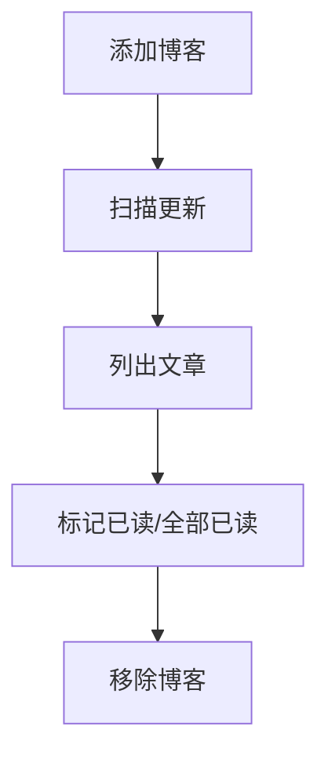

**图表来源**

- [skills/blogwatcher/SKILL.md:29-70](file://skills/blogwatcher/SKILL.md#L29-L70)

**章节来源**

- [skills/blogwatcher/SKILL.md:1-70](file://skills/blogwatcher/SKILL.md#L1-L70)

### GOG 游戏管理（gog CLI）

- 配置方法
  - OAuth：凭据导入与账户授权
  - 服务范围：Gmail/日历/驱动/联系人/文档/表格
- 使用场景
  - 自动化邮件发送与草稿管理
  - 日程事件创建/更新/颜色设置
  - 表格数据读取/更新/追加/清空
  - 文档导出与内容读取
- 集成方式
  - 通过命令行参数与 JSON 输出进行脚本化

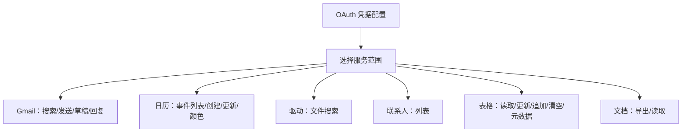

**图表来源**

- [skills/gog/SKILL.md:29-117](file://skills/gog/SKILL.md#L29-L117)

**章节来源**

- [skills/gog/SKILL.md:1-117](file://skills/gog/SKILL.md#L1-L117)

### Eightctl 工具

- 配置方法
  - 配置文件或环境变量（邮箱/密码）
- 使用场景
  - 设备状态查询、开关、温度调节
  - 闹钟与定时任务管理
  - 音频与底座控制
- 集成方式
  - 本地命令行调用，注意速率限制与确认提示

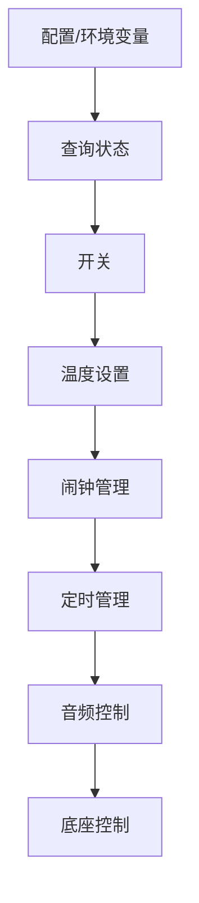

**图表来源**

- [skills/eightctl/SKILL.md:29-51](file://skills/eightctl/SKILL.md#L29-L51)

**章节来源**

- [skills/eightctl/SKILL.md:1-51](file://skills/eightctl/SKILL.md#L1-L51)

### SAG 系统管理（ElevenLabs TTS）

- 配置方法
  - API Key（优先 ELEVENLABS_API_KEY）
  - 语音模型与默认语音 ID
- 使用场景
  - 本地 TTS 播放与语音角色
  - SSML/音频标签与发音规则
  - 聊天语音回复媒体集成
- 集成方式
  - 本地生成音频文件并通过消息工具发送

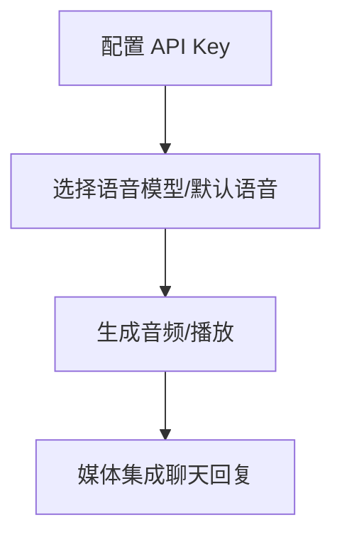

**图表来源**

- [skills/sag/SKILL.md:30-88](file://skills/sag/SKILL.md#L30-L88)

**章节来源**

- [skills/sag/SKILL.md:1-88](file://skills/sag/SKILL.md#L1-L88)

### WACLI 命令行工具

- 配置方法
  - QR 登录与初始同步、持续同步
  - 存储目录与 JSON 输出
- 使用场景
  - 向第三方发送消息（个人/群组/文件）
  - 历史消息搜索与回填
- 集成方式
  - 仅用于非用户聊天场景，避免与常规路由冲突

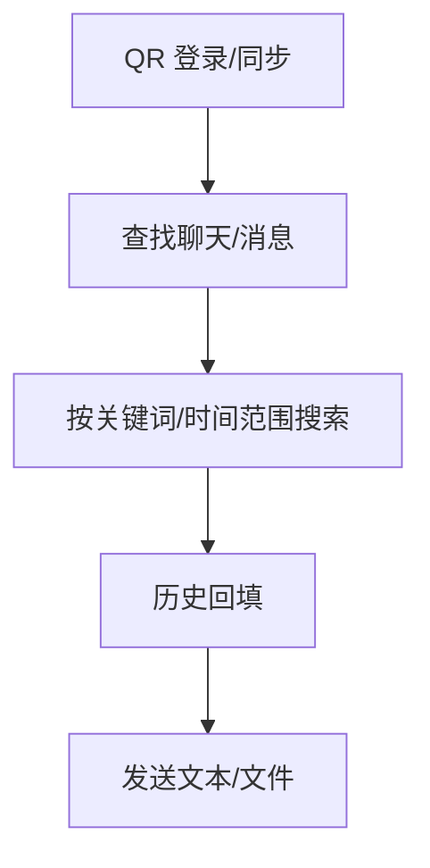

**图表来源**

- [skills/wacli/SKILL.md:44-73](file://skills/wacli/SKILL.md#L44-L73)

**章节来源**

- [skills/wacli/SKILL.md:1-73](file://skills/wacli/SKILL.md#L1-L73)

## 依赖关系分析

- 包管理与脚本入口
  - package.json 提供统一脚本入口与依赖声明，便于在 CI 中复用
- TypeScript 配置
  - tsconfig.json 统一编译目标与路径映射，确保跨平台一致性
- CI 流水线
  - .github/workflows/ci.yml 将文档变更检测、构建产物共享、测试与检查串联为端到端流水线

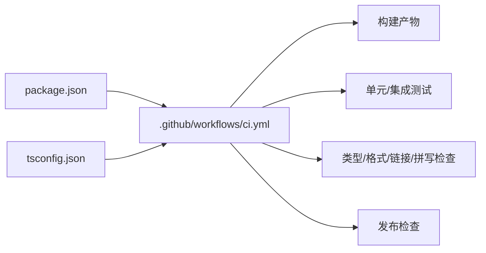

**图表来源**

- [package.json:1-465](file://package.json#L1-L465)
- [tsconfig.json:1-29](file://tsconfig.json#L1-L29)
- [.github/workflows/ci.yml:1-737](file://.github/workflows/ci.yml#L1-L737)

**章节来源**

- [package.json:1-465](file://package.json#L1-L465)
- [tsconfig.json:1-29](file://tsconfig.json#L1-L29)
- [.github/workflows/ci.yml:1-737](file://.github/workflows/ci.yml#L1-L737)

## 性能考虑

- 并发与资源
  - CI 中对不同平台与任务进行分片与并发控制，避免资源争用
  - 测试阶段通过环境变量调整内存上限与工作进程数
- 文档质量与开销
  - 文档链接审计与拼写检查在变更范围内执行，减少不必要开销
- 用量统计
  - 通过 cron 用量报告脚本按时间窗口聚合 token 使用情况，辅助成本控制与优化

**章节来源**

- [.github/workflows/ci.yml:329-737](file://.github/workflows/ci.yml#L329-L737)
- [scripts/cron_usage_report.ts:1-274](file://scripts/cron_usage_report.ts#L1-L274)

## 故障排除指南

- 认证过期预警
  - 使用认证监控脚本定期检查 Claude Code 凭证有效期，提前预警并通知
- 文档链接与拼写
  - 文档链接审计脚本定位缺失路由/文件；拼写检查脚本提供自动修复模式
- CI 失败定位
  - 通过 CI 流水线的“变更范围检测”跳过无关任务，快速聚焦问题域

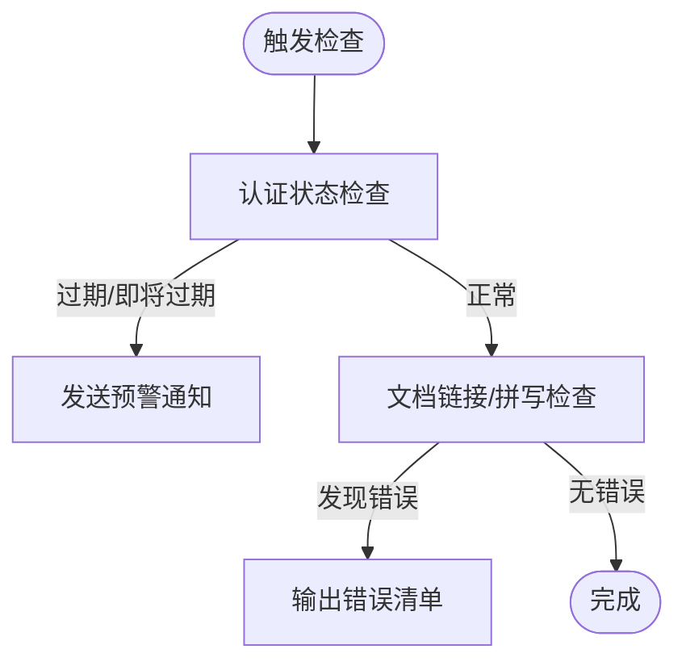

**图表来源**

- [scripts/auth-monitor.sh:1-90](file://scripts/auth-monitor.sh#L1-L90)
- [scripts/docs-link-audit.mjs:1-234](file://scripts/docs-link-audit.mjs#L1-L234)
- [scripts/docs-spellcheck.sh:1-45](file://scripts/docs-spellcheck.sh#L1-L45)

**章节来源**

- [scripts/auth-monitor.sh:1-90](file://scripts/auth-monitor.sh#L1-L90)
- [scripts/docs-link-audit.mjs:1-234](file://scripts/docs-link-audit.mjs#L1-L234)
- [scripts/docs-spellcheck.sh:1-45](file://scripts/docs-spellcheck.sh#L1-L45)

## 结论

本文件系统化梳理了 OpenClaw 生态中的开发工具技能，涵盖 GitHub 集成、Issues 自动化、博客监控、GOG 管理、Eightctl、SAG 与 WACLI 等工具。通过技能文档、CI 流水线与运维脚本的协同，这些工具能够高效支撑代码管理、项目跟踪与系统运维等开发工作流。建议在团队内推广使用这些技能与脚本，以提升自动化水平与协作效率。

## 附录

- 实际应用案例（示例性描述）
  - GitHub Issues 自动化：在 CI 中周期性拉取 openclaw 仓库的高优先级 Issues，自动创建修复分支并提交 PR；随后自动跟进评审评论并推送修复
  - 博客监控：每日定时扫描技术博客订阅源，发现新文章后在团队频道中推送摘要
  - GOG 管理：根据日历事件自动生成会议邮件草稿并发送给参会者
  - Eightctl：根据睡眠计划自动调整床垫温度与闹钟
  - SAG：在聊天中根据上下文生成语音回复并通过媒体通道发送
  - WACLI：向外部合作伙伴发送项目进度报告与附件
