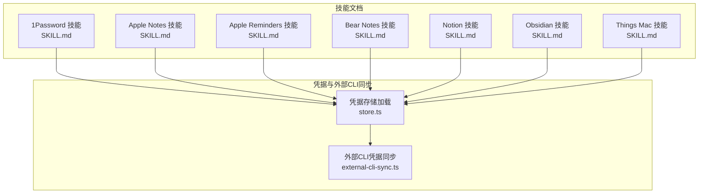
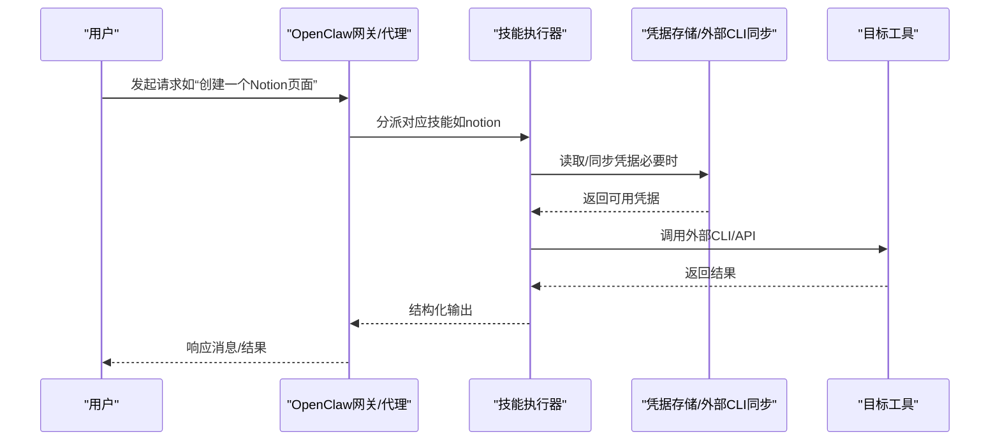
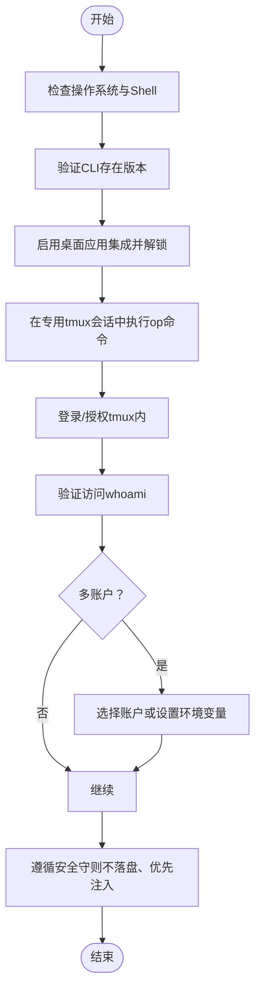
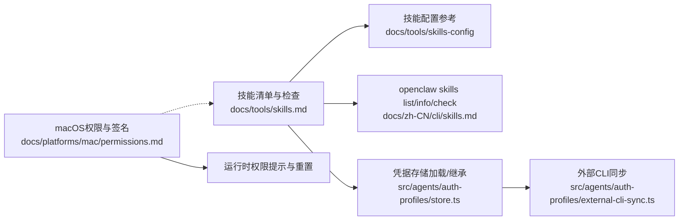

# 生产力工具技能

<cite>
**本文引用的文件**
- [skills/1password/SKILL.md](file://skills/1password/SKILL.md)
- [skills/1password/references/get-started.md](file://skills/1password/references/get-started.md)
- [skills/apple-notes/SKILL.md](file://skills/apple-notes/SKILL.md)
- [skills/apple-reminders/SKILL.md](file://skills/apple-reminders/SKILL.md)
- [skills/bear-notes/SKILL.md](file://skills/bear-notes/SKILL.md)
- [skills/notion/SKILL.md](file://skills/notion/SKILL.md)
- [skills/obsidian/SKILL.md](file://skills/obsidian/SKILL.md)
- [skills/things-mac/SKILL.md](file://skills/things-mac/SKILL.md)
- [src/agents/auth-profiles/store.ts](file://src/agents/auth-profiles/store.ts)
- [src/agents/auth-profiles/external-cli-sync.ts](file://src/agents/auth-profiles/external-cli-sync.ts)
- [docs/platforms/mac/permissions.md](file://docs/platforms/mac/permissions.md)
- [docs/zh-CN/platforms/mac/permissions.md](file://docs/zh-CN/platforms/mac/permissions.md)
- [docs/tools/skills.md](file://docs/tools/skills.md)
- [docs/zh-CN/tools/skills.md](file://docs/zh-CN/tools/skills.md)
- [docs/zh-CN/cli/skills.md](file://docs/zh-CN/cli/skills.md)
</cite>

## 目录

1. [简介](#简介)
2. [项目结构](#项目结构)
3. [核心组件](#核心组件)
4. [架构总览](#架构总览)
5. [详细组件分析](#详细组件分析)
6. [依赖关系分析](#依赖关系分析)
7. [性能考量](#性能考量)
8. [故障排查指南](#故障排查指南)
9. [结论](#结论)
10. [附录](#附录)

## 简介

本文件面向OpenClaw生态中的生产力工具技能，系统性梳理并说明以下工具的安装、认证、配置与使用方法，并给出与OpenClaw其他能力的集成方式与工作流优化建议：

- 1Password 密码管理（CLI）
- Apple Notes（memo）
- Apple Reminders（remindctl）
- Bear Notes（grizzly）
- Notion（API）
- Obsidian（obsidian-cli）
- Things Mac（things）

同时，结合OpenClaw的凭据存储与外部CLI同步机制，帮助你在安全、自动化与跨平台场景下高效使用这些技能。

## 项目结构

OpenClaw通过“技能（Skill）”组织各工具的能力，每个技能以独立目录存放其说明文档与可选的参考材料；同时，核心运行时在Agent层维护统一的凭据存储与外部CLI同步逻辑，确保凭据在不同工具间的一致性与可用性。

**图表来源**

- [skills/1password/SKILL.md:1-71](file://skills/1password/SKILL.md#L1-L71)
- [skills/apple-notes/SKILL.md:1-78](file://skills/apple-notes/SKILL.md#L1-L78)
- [skills/apple-reminders/SKILL.md:1-119](file://skills/apple-reminders/SKILL.md#L1-L119)
- [skills/bear-notes/SKILL.md:1-108](file://skills/bear-notes/SKILL.md#L1-L108)
- [skills/notion/SKILL.md:1-175](file://skills/notion/SKILL.md#L1-L175)
- [skills/obsidian/SKILL.md:1-82](file://skills/obsidian/SKILL.md#L1-L82)
- [skills/things-mac/SKILL.md:1-87](file://skills/things-mac/SKILL.md#L1-L87)
- [src/agents/auth-profiles/store.ts:346-372](file://src/agents/auth-profiles/store.ts#L346-L372)
- [src/agents/auth-profiles/external-cli-sync.ts:89-91](file://src/agents/auth-profiles/external-cli-sync.ts#L89-L91)

**章节来源**

- [skills/1password/SKILL.md:1-71](file://skills/1password/SKILL.md#L1-L71)
- [skills/apple-notes/SKILL.md:1-78](file://skills/apple-notes/SKILL.md#L1-L78)
- [skills/apple-reminders/SKILL.md:1-119](file://skills/apple-reminders/SKILL.md#L1-L119)
- [skills/bear-notes/SKILL.md:1-108](file://skills/bear-notes/SKILL.md#L1-L108)
- [skills/notion/SKILL.md:1-175](file://skills/notion/SKILL.md#L1-L175)
- [skills/obsidian/SKILL.md:1-82](file://skills/obsidian/SKILL.md#L1-L82)
- [skills/things-mac/SKILL.md:1-87](file://skills/things-mac/SKILL.md#L1-L87)
- [src/agents/auth-profiles/store.ts:346-372](file://src/agents/auth-profiles/store.ts#L346-L372)
- [src/agents/auth-profiles/external-cli-sync.ts:89-91](file://src/agents/auth-profiles/external-cli-sync.ts#L89-L91)

## 核心组件

- 凭据存储与继承：OpenClaw在Agent运行时加载凭据存储，支持从主Agent向子Agent继承凭据，并在读取模式下保持只读，避免意外写入。
- 外部CLI同步：自动从外部CLI工具（如部分门户的OAuth凭据）同步到内部凭据存储，保证凭据新鲜度与一致性。
- 技能元数据：每个技能通过SKILL.md声明名称、描述、图标、操作系统限制、二进制依赖、安装方式与主页链接，便于统一管理与校验。

**章节来源**

- [src/agents/auth-profiles/store.ts:346-372](file://src/agents/auth-profiles/store.ts#L346-L372)
- [src/agents/auth-profiles/store.ts:374-441](file://src/agents/auth-profiles/store.ts#L374-L441)
- [src/agents/auth-profiles/store.ts:443-460](file://src/agents/auth-profiles/store.ts#L443-L460)
- [src/agents/auth-profiles/external-cli-sync.ts:89-91](file://src/agents/auth-profiles/external-cli-sync.ts#L89-L91)
- [skills/1password/SKILL.md:5-22](file://skills/1password/SKILL.md#L5-L22)
- [skills/apple-notes/SKILL.md:5-23](file://skills/apple-notes/SKILL.md#L5-L23)
- [skills/apple-reminders/SKILL.md:5-23](file://skills/apple-reminders/SKILL.md#L5-L23)
- [skills/bear-notes/SKILL.md:5-23](file://skills/bear-notes/SKILL.md#L5-L23)
- [skills/notion/SKILL.md:5-10](file://skills/notion/SKILL.md#L5-L10)
- [skills/obsidian/SKILL.md:5-22](file://skills/obsidian/SKILL.md#L5-L22)
- [skills/things-mac/SKILL.md:5-23](file://skills/things-mac/SKILL.md#L5-L23)

## 架构总览

OpenClaw的技能体系与凭据系统协同工作：技能负责对外部工具的调用与封装，凭据系统负责安全地存储与同步认证信息，二者共同支撑自动化工作流。

**图表来源**

- [src/agents/auth-profiles/store.ts:346-372](file://src/agents/auth-profiles/store.ts#L346-L372)
- [src/agents/auth-profiles/external-cli-sync.ts:89-91](file://src/agents/auth-profiles/external-cli-sync.ts#L89-L91)
- [skills/notion/SKILL.md:16-28](file://skills/notion/SKILL.md#L16-L28)

## 详细组件分析

### 1Password 密码管理（CLI）

- 安装与集成
  - 使用包管理器安装CLI；启用桌面应用集成并在解锁状态下进行授权。
  - 强制在专用tmux会话中执行op命令，避免重复提示与失败。
- 认证与安全
  - 支持单账户或多账户登录；多账户需显式指定账户或设置环境变量。
  - 严禁在日志、聊天或代码中粘贴敏感信息；优先使用注入或运行模式避免落盘。
- 使用场景与最佳实践
  - 自动化脚本中通过op注入密钥，减少明文暴露风险。
  - 与凭据存储联动：当外部CLI有更新时，运行时会同步到内部凭据存储。

**图表来源**

- [skills/1password/SKILL.md:34-71](file://skills/1password/SKILL.md#L34-L71)
- [skills/1password/references/get-started.md:1-17](file://skills/1password/references/get-started.md#L1-L17)

**章节来源**

- [skills/1password/SKILL.md:1-71](file://skills/1password/SKILL.md#L1-L71)
- [skills/1password/references/get-started.md:1-17](file://skills/1password/references/get-started.md#L1-L17)
- [src/agents/auth-profiles/store.ts:346-372](file://src/agents/auth-profiles/store.ts#L346-L372)
- [src/agents/auth-profiles/external-cli-sync.ts:89-91](file://src/agents/auth-profiles/external-cli-sync.ts#L89-L91)

### Apple Notes（memo）

- 安装与权限
  - 通过包管理器安装CLI；首次运行需授予Notes.app自动化权限。
- 功能与限制
  - 支持列表、筛选、搜索、创建、编辑、删除、移动与导出（HTML/Markdown）。
  - 不支持对含图片/附件的笔记进行编辑；交互式操作需要终端访问。
- 使用场景与最佳实践
  - 将日常记录快速导入/导出到Markdown，配合Obsidian进行知识整理。
  - 在自动化场景中，注意交互式提示需要终端可用。

**章节来源**

- [skills/apple-notes/SKILL.md:1-78](file://skills/apple-notes/SKILL.md#L1-L78)

### Apple Reminders（remindctl）

- 适用场景
  - 个人待办与带截止日期的任务，需要同步到iOS设备。
- 常用命令
  - 查看今日/明日/本周/逾期/全部；按列表/日期过滤；添加/完成/删除任务；输出JSON/纯文本/计数。
- 日期格式
  - 支持today/tomorrow/yesterday、YYYY-MM-DD、YYYY-MM-DD HH:mm、ISO 8601等。
- 使用场景与最佳实践
  - 与定时提醒工具区分用途：一次性通知用定时工具，持续性任务用Reminders。
  - 在自动化中，先确认授权状态与权限已授予。

**章节来源**

- [skills/apple-reminders/SKILL.md:1-119](file://skills/apple-reminders/SKILL.md#L1-L119)

### Bear Notes（grizzly）

- 安装与令牌
  - 通过Go安装CLI；部分操作（追加文本、标签、打开选定笔记）需要Bear API令牌。
- 常用命令
  - 创建笔记、按ID打开/读取、追加文本、列出标签、按标签检索。
- 配置与选项
  - 支持CLI参数、环境变量、当前目录配置文件与用户级配置文件；常用标志包括回调等待、JSON输出、令牌文件等。
- 使用场景与最佳实践
  - Bear必须在后台运行；使用回调标志读取返回数据；敏感操作务必提供令牌文件。

**章节来源**

- [skills/bear-notes/SKILL.md:1-108](file://skills/bear-notes/SKILL.md#L1-L108)

### Notion（API）

- 安装与认证
  - 在Notion创建集成并复制API密钥，保存至约定位置；将目标页面/数据库分享给该集成。
- API基础
  - 请求头需包含授权Bearer Token与特定版本号；数据库在新版API中称为“数据源”。
- 常用操作
  - 搜索页面/数据源、获取页面与块内容、在数据源中创建页面、查询数据源、创建数据源、更新页面属性、向页面追加块。
- 属性类型与注意事项
  - 支持多种属性类型（标题、富文本、选择、多选、日期、复选框、数字、URL、邮箱、关联等）。
  - 注意速率限制、块数量与负载大小限制；数据源视图过滤仅在UI生效。

**章节来源**

- [skills/notion/SKILL.md:1-175](file://skills/notion/SKILL.md#L1-L175)

### Obsidian（obsidian-cli）

- 存储与定位
  - 仓库即普通文件夹；活动仓库由桌面应用配置文件记录；可通过CLI打印默认仓库路径。
- 快速上手
  - 设置默认仓库；搜索笔记名与内容；创建笔记并通过URI打开；移动/重命名会自动更新链接；直接编辑文件亦可被Obsidian识别。
- 使用场景与最佳实践
  - 多仓库常见（iCloud与本地等），不要硬编码路径；优先读取配置而非猜测。

**章节来源**

- [skills/obsidian/SKILL.md:1-82](file://skills/obsidian/SKILL.md#L1-L82)

### Things Mac（things）

- 安装与权限
  - 推荐使用Go安装；若读取本地数据库失败，需为调用程序授予“完全磁盘访问”权限。
- 读取与写入
  - 读取收件箱/今日/即将到来/搜索/项目/区域/标签；写入通过URL Scheme添加任务，支持预览、前置窗口、备注、时间、截止日、项目/区域、标题行/段落、标签与清单项。
- 修改与删除
  - 修改需认证令牌；支持替换/追加/前置备注、移动列表/标题行、替换/新增标签、完成/取消；暂不支持删除，可标记完成或在UI中删除。
- 使用场景与最佳实践
  - 写入前建议先预览URL；修改操作务必携带认证令牌。

**章节来源**

- [skills/things-mac/SKILL.md:1-87](file://skills/things-mac/SKILL.md#L1-L87)

## 依赖关系分析

- 技能与系统权限
  - macOS权限（TCC）对自动化能力至关重要，签名、Bundle ID与路径稳定性决定权限持久性。
- 技能与凭据系统
  - 技能通过统一的凭据存储加载与外部CLI同步，实现跨工具的凭据共享与新鲜度保障。
- 技能与OpenClaw配置
  - 技能清单、检查与配置schema由工具文档定义，支持本地覆盖与工作区优先。

**图表来源**

- [docs/tools/skills.md:287-303](file://docs/tools/skills.md#L287-L303)
- [docs/zh-CN/tools/skills.md:267-279](file://docs/zh-CN/tools/skills.md#L267-L279)
- [docs/zh-CN/cli/skills.md:16-33](file://docs/zh-CN/cli/skills.md#L16-L33)
- [docs/platforms/mac/permissions.md:10-51](file://docs/platforms/mac/permissions.md#L10-L51)
- [docs/zh-CN/platforms/mac/permissions.md:17-44](file://docs/zh-CN/platforms/mac/permissions.md#L17-L44)
- [src/agents/auth-profiles/store.ts:346-372](file://src/agents/auth-profiles/store.ts#L346-L372)
- [src/agents/auth-profiles/external-cli-sync.ts:89-91](file://src/agents/auth-profiles/external-cli-sync.ts#L89-L91)

**章节来源**

- [docs/tools/skills.md:287-303](file://docs/tools/skills.md#L287-L303)
- [docs/zh-CN/tools/skills.md:267-279](file://docs/zh-CN/tools/skills.md#L267-L279)
- [docs/zh-CN/cli/skills.md:16-33](file://docs/zh-CN/cli/skills.md#L16-L33)
- [docs/platforms/mac/permissions.md:10-51](file://docs/platforms/mac/permissions.md#L10-L51)
- [docs/zh-CN/platforms/mac/permissions.md:17-44](file://docs/zh-CN/platforms/mac/permissions.md#L17-L44)
- [src/agents/auth-profiles/store.ts:346-372](file://src/agents/auth-profiles/store.ts#L346-L372)
- [src/agents/auth-profiles/external-cli-sync.ts:89-91](file://src/agents/auth-profiles/external-cli-sync.ts#L89-L91)

## 性能考量

- 1Password
  - 专用tmux会话避免重复提示与失败，提升自动化稳定性。
- Notion
  - 注意API速率限制与负载大小限制；合理拆分批量操作，避免超限。
- Obsidian
  - 优先使用CLI的搜索与移动功能，减少全量扫描；避免在隐藏目录创建笔记。
- Things
  - 写入前使用预览URL，减少误操作；修改操作务必携带认证令牌，避免失败重试。

[本节为通用指导，无需具体文件分析]

## 故障排查指南

- macOS权限问题
  - 若权限提示消失或失效，按文档步骤重置TCC并从固定路径重新授予权限。
- 1Password
  - 若提示未登录或无访问，请在专用tmux会话中重新登录并验证身份。
- Apple Notes/Reminders/Bear/Things
  - 确认应用已安装且具备所需自动化/全盘访问权限；必要时在系统设置中重新授权。
- 凭据同步
  - 运行时会自动从外部CLI同步凭据；若凭据未更新，检查相关工具是否已刷新令牌。

**章节来源**

- [docs/platforms/mac/permissions.md:27-51](file://docs/platforms/mac/permissions.md#L27-L51)
- [docs/zh-CN/platforms/mac/permissions.md:30-44](file://docs/zh-CN/platforms/mac/permissions.md#L30-L44)
- [skills/1password/SKILL.md:64-71](file://skills/1password/SKILL.md#L64-L71)
- [src/agents/auth-profiles/store.ts:346-372](file://src/agents/auth-profiles/store.ts#L346-L372)
- [src/agents/auth-profiles/external-cli-sync.ts:89-91](file://src/agents/auth-profiles/external-cli-sync.ts#L89-L91)

## 结论

通过将各生产力工具以技能形式封装，并结合OpenClaw的凭据存储与外部CLI同步机制，可以在保证安全性的前提下，实现跨工具的自动化与工作流优化。建议在部署初期完善权限与凭据配置，后续以技能清单与配置schema为依据进行扩展与维护。

[本节为总结，无需具体文件分析]

## 附录

- 技能生命周期与覆盖规则
  - OpenClaw内置技能为基础，用户可在本地与工作区覆盖；技能清单与检查命令可用于诊断缺失的二进制/环境变量/配置。
- 相关文档
  - 技能系统与配置参考、macOS权限与签名要求、CLI技能命令参考。

**章节来源**

- [docs/tools/skills.md:287-303](file://docs/tools/skills.md#L287-L303)
- [docs/zh-CN/tools/skills.md:267-279](file://docs/zh-CN/tools/skills.md#L267-L279)
- [docs/zh-CN/cli/skills.md:16-33](file://docs/zh-CN/cli/skills.md#L16-L33)
- [docs/platforms/mac/permissions.md:10-51](file://docs/platforms/mac/permissions.md#L10-L51)
- [docs/zh-CN/platforms/mac/permissions.md:17-44](file://docs/zh-CN/platforms/mac/permissions.md#L17-L44)
