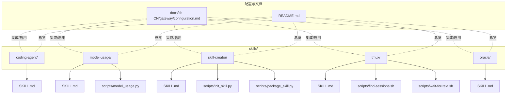
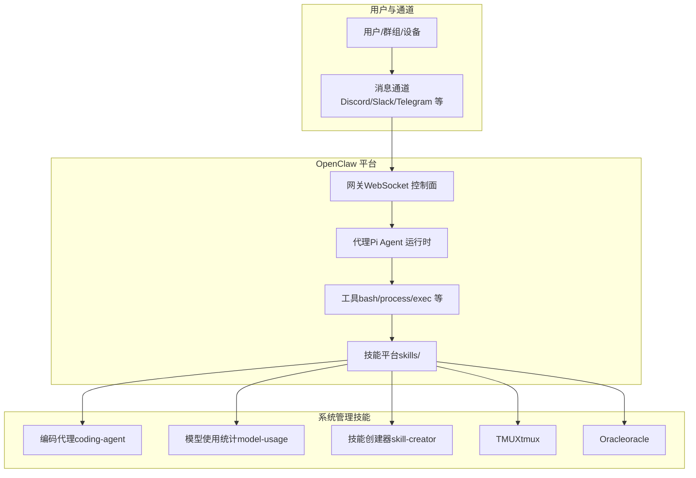
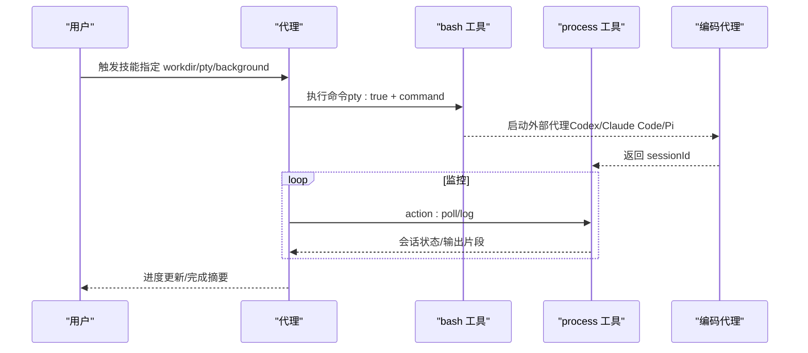
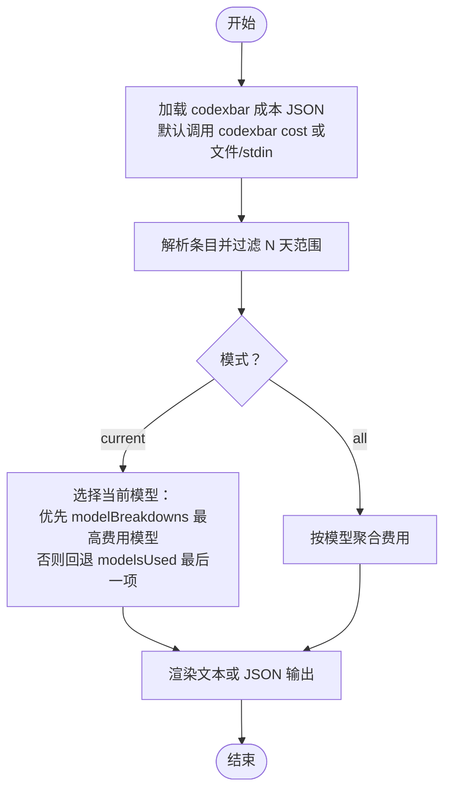
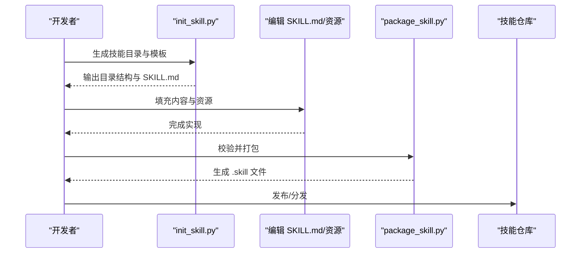
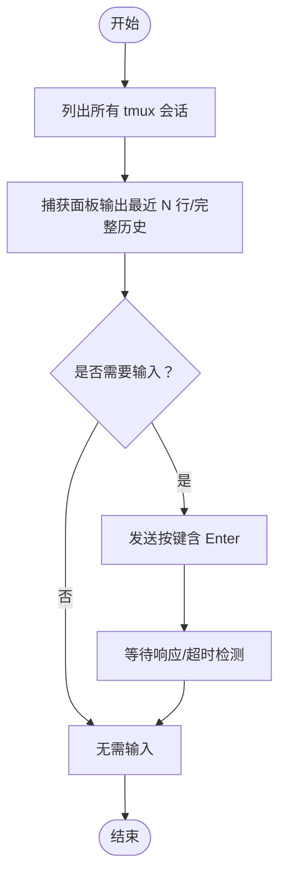
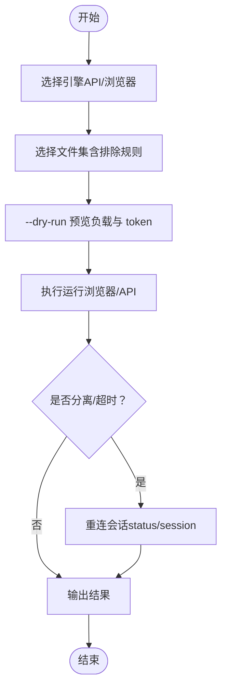
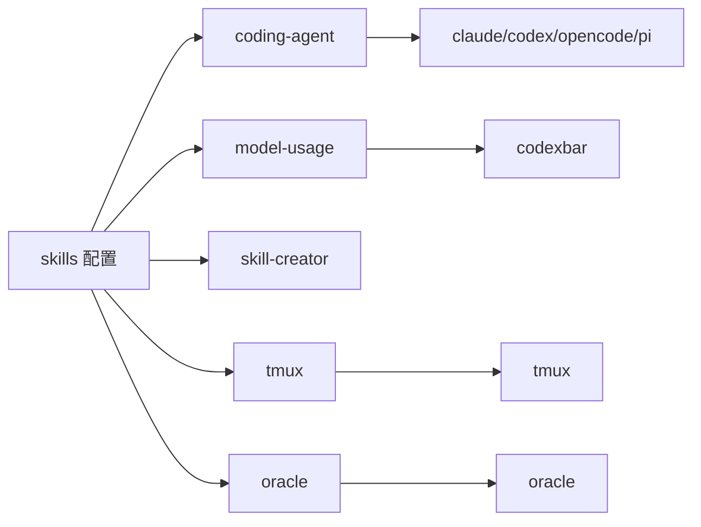

# 系统管理技能

<cite>
**本文引用的文件**
- [coding-agent/SKILL.md](file://skills/coding-agent/SKILL.md)
- [model-usage/SKILL.md](file://skills/model-usage/SKILL.md)
- [model_usage.py](file://skills/model-usage/scripts/model_usage.py)
- [skill-creator/SKILL.md](file://skills/skill-creator/SKILL.md)
- [init_skill.py](file://skills/skill-creator/scripts/init_skill.py)
- [package_skill.py](file://skills/skill-creator/scripts/package_skill.py)
- [tmux/SKILL.md](file://skills/tmux/SKILL.md)
- [find-sessions.sh](file://skills/tmux/scripts/find-sessions.sh)
- [wait-for-text.sh](file://skills/tmux/scripts/wait-for-text.sh)
- [oracle/SKILL.md](file://skills/oracle/SKILL.md)
- [README.md](file://README.md)
- [configuration.md](file://docs/zh-CN/gateway/configuration.md)
</cite>

## 目录

1. [简介](#简介)
2. [项目结构](#项目结构)
3. [核心组件](#核心组件)
4. [架构总览](#架构总览)
5. [详细组件分析](#详细组件分析)
6. [依赖关系分析](#依赖关系分析)
7. [性能考量](#性能考量)
8. [故障排查指南](#故障排查指南)
9. [结论](#结论)
10. [附录](#附录)

## 简介

本文件面向系统运维与平台工程人员，系统性梳理 OpenClaw 中与“系统管理”密切相关的技能与工具链，包括：

- 编码代理（Coding Agent）：委托 Codex、Claude Code、Pi 等代理执行交互式任务，支持 PTY 模式与后台会话管理。
- 模型使用统计（Model Usage）：基于 CodexBar 本地成本日志，按模型聚合统计并输出当前模型或全量模型汇总。
- 技能创建器（Skill Creator）：提供从零到一创建、打包与迭代技能的标准流程与工具。
- TMUX 终端管理（tmux）：通过 tmux 控制台发送按键、抓取面板输出，用于监控与交互式任务。
- Oracle 数据库连接（Oracle）：以“文件捆绑 + 引擎 + 会话”的最佳实践指导进行数据库查询与上下文检索。

目标是帮助读者快速理解各技能的配置方法、使用场景与集成方式，并提供可复用的实际应用案例。

## 项目结构

OpenClaw 将“技能”作为可插拔能力单元，分布在 skills/ 目录下，每个技能包含：

- SKILL.md：技能元数据与使用说明
- scripts/：可选的可执行脚本（如 Python、Bash）
- references/：可选的参考文档
- assets/：可选的输出资源（模板、图标、字体等）

图示来源

- [coding-agent/SKILL.md:1-296](file://skills/coding-agent/SKILL.md#L1-L296)
- [model-usage/SKILL.md:1-70](file://skills/model-usage/SKILL.md#L1-L70)
- [model_usage.py:1-321](file://skills/model-usage/scripts/model_usage.py#L1-L321)
- [skill-creator/SKILL.md:1-373](file://skills/skill-creator/SKILL.md#L1-L373)
- [init_skill.py:1-379](file://skills/skill-creator/scripts/init_skill.py#L1-L379)
- [package_skill.py:1-140](file://skills/skill-creator/scripts/package_skill.py#L1-L140)
- [tmux/SKILL.md:1-154](file://skills/tmux/SKILL.md#L1-L154)
- [find-sessions.sh:1-113](file://skills/tmux/scripts/find-sessions.sh#L1-L113)
- [wait-for-text.sh:1-84](file://skills/tmux/scripts/wait-for-text.sh#L1-L84)
- [oracle/SKILL.md:1-126](file://skills/oracle/SKILL.md#L1-L126)
- [README.md:1-560](file://README.md#L1-L560)
- [configuration.md:2735-2778](file://docs/zh-CN/gateway/configuration.md#L2735-L2778)

章节来源

- [README.md:1-560](file://README.md#L1-L560)
- [configuration.md:2735-2778](file://docs/zh-CN/gateway/configuration.md#L2735-L2778)

## 核心组件

- 编码代理（Coding Agent）
  - 作用：通过 bash 工具委托外部代理（Codex、Claude Code、Pi、OpenCode）执行交互式任务；支持 PTY 模式与后台会话管理。
  - 关键参数：command、pty、workdir、background、timeout、elevated；进程工具动作：list、poll、log、write、submit、send-keys、paste、kill。
  - 使用要点：Codex/Pi/OpenCode 必须使用 pty:true；Claude Code 使用 --print --permission-mode bypassPermissions。
- 模型使用统计（Model Usage）
  - 作用：读取 CodexBar 本地成本日志，按模型聚合统计，支持“当前模型”和“全量模型”两种模式。
  - 输入：默认通过 codexbar cost 命令获取 JSON；也支持文件或标准输入。
  - 输出：文本或 JSON，默认仅显示费用，不拆分 token。
- 技能创建器（Skill Creator）
  - 作用：提供标准化的技能生命周期：理解需求、规划资源、初始化模板、编辑实现、打包发布、迭代优化。
  - 工具：init_skill.py、package_skill.py；遵循“前端触发 + 后端脚本”的渐进披露设计。
- TMUX 终端管理（tmux）
  - 作用：远程控制 tmux 会话，发送按键、抓取面板输出，适合监控 Claude/Codex 等交互式任务。
  - 常用命令：列出会话、捕获面板输出、发送按键、窗口/窗格导航、会话管理。
- Oracle 数据库连接（Oracle）
  - 作用：将提示词与选定文件打包为“一次性请求”，借助浏览器或 API 引擎进行检索与回答。
  - 最佳实践：选择最小文件集、预览负载与 token 消耗、优先使用浏览器引擎、长时运行建议附带会话以便重连。

章节来源

- [coding-agent/SKILL.md:1-296](file://skills/coding-agent/SKILL.md#L1-L296)
- [model-usage/SKILL.md:1-70](file://skills/model-usage/SKILL.md#L1-L70)
- [model_usage.py:1-321](file://skills/model-usage/scripts/model_usage.py#L1-L321)
- [skill-creator/SKILL.md:1-373](file://skills/skill-creator/SKILL.md#L1-L373)
- [init_skill.py:1-379](file://skills/skill-creator/scripts/init_skill.py#L1-L379)
- [package_skill.py:1-140](file://skills/skill-creator/scripts/package_skill.py#L1-L140)
- [tmux/SKILL.md:1-154](file://skills/tmux/SKILL.md#L1-L154)
- [find-sessions.sh:1-113](file://skills/tmux/scripts/find-sessions.sh#L1-L113)
- [wait-for-text.sh:1-84](file://skills/tmux/scripts/wait-for-text.sh#L1-L84)
- [oracle/SKILL.md:1-126](file://skills/oracle/SKILL.md#L1-L126)

## 架构总览

下图展示各系统管理技能在 OpenClaw 中的协作关系与调用路径：

图示来源

- [README.md:185-212](file://README.md#L185-L212)
- [coding-agent/SKILL.md:1-296](file://skills/coding-agent/SKILL.md#L1-L296)
- [model-usage/SKILL.md:1-70](file://skills/model-usage/SKILL.md#L1-L70)
- [skill-creator/SKILL.md:1-373](file://skills/skill-creator/SKILL.md#L1-L373)
- [tmux/SKILL.md:1-154](file://skills/tmux/SKILL.md#L1-L154)
- [oracle/SKILL.md:1-126](file://skills/oracle/SKILL.md#L1-L126)

## 详细组件分析

### 编码代理（Coding Agent）

- 配置与要求
  - 依赖二进制：claude、codex、opencode、pi 中至少一个。
  - PTY 模式：Codex/Pi/OpenCode 必须开启 pty:true；Claude Code 使用 --print --permission-mode bypassPermissions。
  - 工作目录：workdir 限定代理上下文，避免无关文件干扰。
  - 后台会话：background:true 返回 sessionId，配合 process 工具进行监控与交互。
- 使用场景
  - 新建/构建功能、PR 代码审查、重构大型代码库、需要文件探索的迭代式开发。
  - 避免在 OpenClaw 自身仓库中启动 Codex；避免在 ~/Projects/openclaw/ 中检出分支。
- 实际应用案例
  - 临时工作区：在临时 git 仓库中快速对话，Codex 需要在受信 git 目录内运行。
  - 批量 PR 审查：使用 git worktree 为多个 PR 分别创建工作树，同时启动多个 Codex 进程并行审查。
  - 自动完成通知：在长任务完成后追加唤醒命令，使系统立即收到事件通知，缩短等待时间。

图示来源

- [coding-agent/SKILL.md:37-102](file://skills/coding-agent/SKILL.md#L37-L102)
- [coding-agent/SKILL.md:108-198](file://skills/coding-agent/SKILL.md#L108-L198)

章节来源

- [coding-agent/SKILL.md:1-296](file://skills/coding-agent/SKILL.md#L1-L296)

### 模型使用统计（Model Usage）

- 配置与要求
  - 依赖二进制：codexbar（macOS），Linux 支持待完善。
  - 输入：默认通过 codexbar cost 获取 JSON；也可传入文件或标准输入。
  - 模式：current（当前模型，按最高费用模型）与 all（全量模型）。
- 处理逻辑
  - 解析 codexbar 成本 JSON，过滤最近 N 天条目，按模型聚合费用。
  - 当前模型选择策略：优先取含 modelBreakdowns 的最新日期条目中费用最高的模型；若缺失则回退到 modelsUsed 的最后一个模型。
- 实际应用案例
  - 日常成本审计：定期运行脚本输出当前模型费用与总费用，便于预算控制。
  - 多模型对比：输出全量模型费用排序，识别高消耗模型并调整策略。

图示来源

- [model-usage/SKILL.md:33-70](file://skills/model-usage/SKILL.md#L33-L70)
- [model_usage.py:34-72](file://skills/model-usage/scripts/model_usage.py#L34-L72)
- [model_usage.py:111-159](file://skills/model-usage/scripts/model_usage.py#L111-L159)
- [model_usage.py:246-321](file://skills/model-usage/scripts/model_usage.py#L246-L321)

章节来源

- [model-usage/SKILL.md:1-70](file://skills/model-usage/SKILL.md#L1-L70)
- [model_usage.py:1-321](file://skills/model-usage/scripts/model_usage.py#L1-L321)

### 技能创建器（Skill Creator）

- 生命周期
  - 理解需求：明确技能用途、典型场景与触发条件。
  - 规划资源：确定是否需要 scripts/、references/、assets/ 及其内容。
  - 初始化模板：使用 init_skill.py 生成目录结构与 SKILL.md 模板。
  - 编辑实现：填充 SKILL.md 与资源文件，确保描述准确、可触发。
  - 打包发布：使用 package_skill.py 校验并生成 .skill 文件。
  - 迭代优化：根据真实使用反馈持续改进。
- 设计原则
  - 渐进披露：metadata（始终在上下文）+ SKILL.md（触发后加载）+ 资源（按需加载）。
  - 内容组织：避免重复，将详细参考放入 references/，保持 SKILL.md 精炼。
  - 触发描述：frontmatter 的 description 是触发关键，应包含何时使用、针对的任务类型与文件类型等。
- 实际应用案例
  - 创建新技能：先用 init_skill.py 生成骨架，再逐步完善 SKILL.md 与资源。
  - 包装分发：完成验证后生成 .skill 文件，便于团队共享与安装。

图示来源

- [skill-creator/SKILL.md:201-373](file://skills/skill-creator/SKILL.md#L201-L373)
- [init_skill.py:1-379](file://skills/skill-creator/scripts/init_skill.py#L1-L379)
- [package_skill.py:1-140](file://skills/skill-creator/scripts/package_skill.py#L1-L140)

章节来源

- [skill-creator/SKILL.md:1-373](file://skills/skill-creator/SKILL.md#L1-L373)
- [init_skill.py:1-379](file://skills/skill-creator/scripts/init_skill.py#L1-L379)
- [package_skill.py:1-140](file://skills/skill-creator/scripts/package_skill.py#L1-L140)

### TMUX 终端管理（tmux）

- 配置与要求
  - 依赖二进制：tmux。
  - 适用场景：监控 Claude/Codex 会话、向交互式 CLI 发送输入、抓取长时间运行进程的输出、程序化导航窗格与窗口。
- 常用操作
  - 列出会话、捕获面板输出（最近 N 行或完整滚动历史）、发送按键（含特殊键）、窗口/窗格切换、会话创建/重命名/销毁。
  - 安全发送：对交互式 TUI，建议将文本与 Enter 分开发送，避免粘贴/多行边界问题。
- 实际应用案例
  - 批量状态检查：遍历多个 worker-\* 会话，抓取最后若干行输出，判断是否需要人工确认。
  - 任务派发：将具体任务文本发送至 worker-\* 会话，由代理自动处理。

图示来源

- [tmux/SKILL.md:41-103](file://skills/tmux/SKILL.md#L41-L103)
- [tmux/SKILL.md:114-154](file://skills/tmux/SKILL.md#L114-L154)
- [find-sessions.sh:1-113](file://skills/tmux/scripts/find-sessions.sh#L1-L113)
- [wait-for-text.sh:1-84](file://skills/tmux/scripts/wait-for-text.sh#L1-L84)

章节来源

- [tmux/SKILL.md:1-154](file://skills/tmux/SKILL.md#L1-L154)
- [find-sessions.sh:1-113](file://skills/tmux/scripts/find-sessions.sh#L1-L113)
- [wait-for-text.sh:1-84](file://skills/tmux/scripts/wait-for-text.sh#L1-L84)

### Oracle 数据库连接（Oracle）

- 配置与要求
  - 依赖二进制：oracle（Node 包）。
  - 引擎选择：OPENAI_API_KEY 存在时自动选择 API；否则默认浏览器引擎。
  - 文件绑定：支持多路径、通配符与排除规则；默认忽略 node_modules、dist、coverage、.git 等；超过 1MB 的文件会被拒绝。
- 最佳实践
  - 选择最小文件集合，确保“真相”集中；使用 --dry-run + --files-report 预览负载与 token 消耗。
  - 浏览器引擎适合“长思考”路径；API 引擎适合多模型或多供应商场景。
  - 长时运行可能分离/超时，建议附带会话并通过 slug 保持可读性，必要时重连而非重跑。
- 实际应用案例
  - 问题重现与上下文恢复：将项目简报、错误文本、复现步骤与关键文件打包，形成可复用的“穷举式提示”模板，便于日后重跑。

图示来源

- [oracle/SKILL.md:45-102](file://skills/oracle/SKILL.md#L45-L102)
- [oracle/SKILL.md:117-126](file://skills/oracle/SKILL.md#L117-L126)

章节来源

- [oracle/SKILL.md:1-126](file://skills/oracle/SKILL.md#L1-L126)

## 依赖关系分析

- 二进制依赖
  - coding-agent：claude、codex、opencode、pi（任一即可）
  - model-usage：codexbar（macOS）
  - tmux：tmux
  - oracle：oracle（Node 包）
- 配置与启用
  - 通过 skills 配置项控制内置白名单、额外扫描目录、安装偏好与每技能覆盖。
  - 示例：允许内置技能白名单、额外扫描目录、安装偏好（brew/npm/pnpm/yarn）以及特定技能的启用/环境变量覆盖。

图示来源

- [configuration.md:2735-2778](file://docs/zh-CN/gateway/configuration.md#L2735-L2778)
- [coding-agent/SKILL.md:4-7](file://skills/coding-agent/SKILL.md#L4-L7)
- [model-usage/SKILL.md:4-22](file://skills/model-usage/SKILL.md#L4-L22)
- [tmux/SKILL.md:4-6](file://skills/tmux/SKILL.md#L4-L6)
- [oracle/SKILL.md:6-22](file://skills/oracle/SKILL.md#L6-L22)

章节来源

- [configuration.md:2735-2778](file://docs/zh-CN/gateway/configuration.md#L2735-L2778)

## 性能考量

- 编码代理
  - PTY 模式是交互式代理的必要条件，避免输出中断或挂起；批量任务建议使用后台模式并合理设置超时。
  - 在临时工作区执行 Codex 任务时，注意 git 初始化的成本与网络依赖。
- 模型使用统计
  - codexbar JSON 解析与聚合为 O(N)（N 为条目数），建议限制天数范围以减少计算量。
  - 输出格式选择（text/json）影响后续处理成本，生产环境建议使用 JSON 并按需美化。
- 技能创建器
  - init_skill.py 与 package_skill.py 均为本地脚本，性能瓶颈主要在磁盘 IO 与 ZIP 打包；建议在空闲时段执行打包。
- TMUX
  - 捕获面板输出与正则匹配为 CPU 密集型操作，建议限制历史行数与合适的轮询间隔。
- Oracle
  - 文件大小与数量直接影响 token 消耗与运行时长；优先选择最小文件集并使用排除规则。

## 故障排查指南

- 编码代理
  - 未使用 PTY：Codex/Pi/OpenCode 无输出或挂起；Claude Code 使用 --print --permission-mode bypassPermissions。
  - 在错误目录启动：Codex 拒绝运行；使用临时 git 仓库或在受信目录执行。
  - 会话卡住：使用 process 工具的 log/poll/kill 动作进行诊断与清理。
- 模型使用统计
  - codexbar 未找到：检查 PATH 与安装；确认提供者名称正确。
  - JSON 格式异常：检查 codexbar 输出或输入文件完整性。
- 技能创建器
  - init_skill.py 参数错误：检查资源类型与示例开关组合。
  - package_skill.py 校验失败：检查目录结构、文件名与符号链接（打包过程拒绝符号链接）。
- TMUX
  - tmux 未找到：检查 PATH；确认会话存在且可访问。
  - 文本等待超时：增大超时与历史行数，或调整轮询间隔。
- Oracle
  - 文件过大被拒绝：移除或排除大文件；使用更精确的通配符。
  - 会话未重连：使用 status 列表并按 slug 重连；避免重复运行。

章节来源

- [coding-agent/SKILL.md:14-36](file://skills/coding-agent/SKILL.md#L14-L36)
- [coding-agent/SKILL.md:232-247](file://skills/coding-agent/SKILL.md#L232-L247)
- [model_usage.py:34-48](file://skills/model-usage/scripts/model_usage.py#L34-L48)
- [init_skill.py:208-225](file://skills/skill-creator/scripts/init_skill.py#L208-L225)
- [package_skill.py:75-104](file://skills/skill-creator/scripts/package_skill.py#L75-L104)
- [wait-for-text.sh:47-84](file://skills/tmux/scripts/wait-for-text.sh#L47-L84)
- [oracle/SKILL.md:77-93](file://skills/oracle/SKILL.md#L77-L93)

## 结论

上述系统管理技能围绕“代理编排、成本统计、技能生命周期、终端控制与上下文检索”五大维度，提供了从配置、使用到集成的完整方案。通过合理的资源组织、渐进披露与自动化脚本，可在 OpenClaw 平台上高效开展代码编写辅助、资源监控、技能开发与终端管理工作。

## 附录

- 实际应用清单
  - 编码代理：临时工作区快速对话、批量 PR 审查、自动完成通知。
  - 模型使用统计：日常成本审计、多模型费用对比。
  - 技能创建器：新技能初始化与打包、团队分发与安装。
  - TMUX：批量状态检查、任务派发与交互式会话管理。
  - Oracle：最小文件集检索、长时运行与会话重连。
