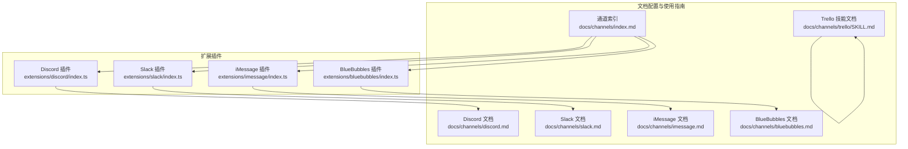
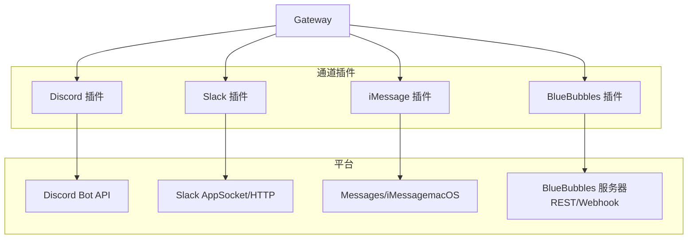
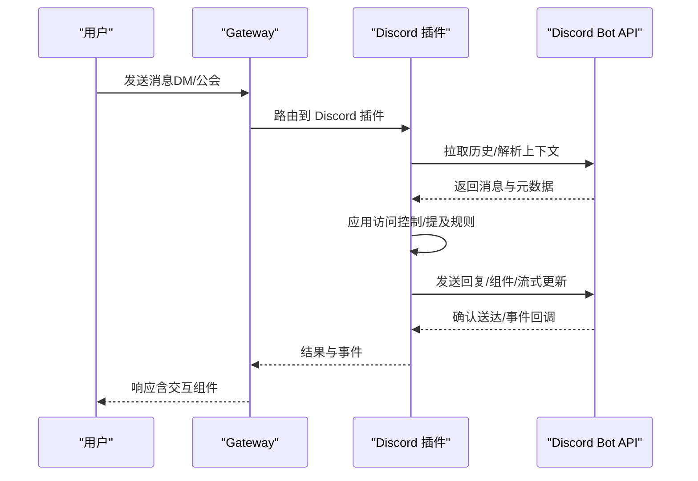
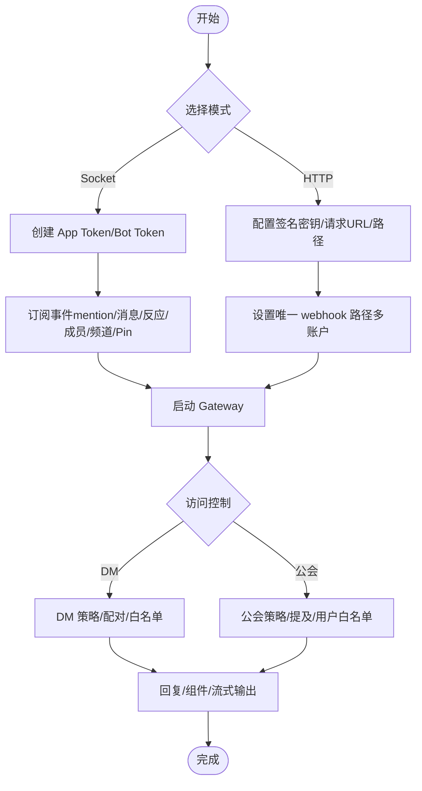
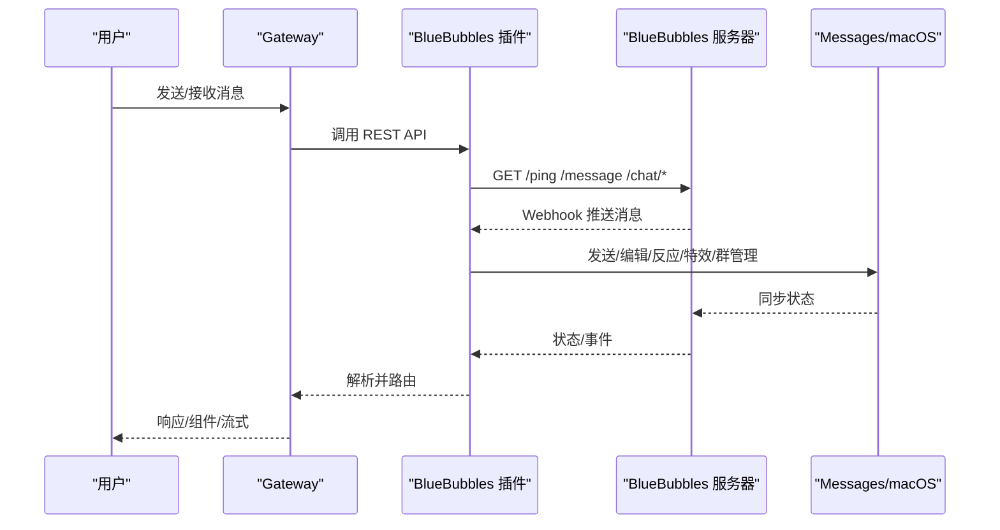
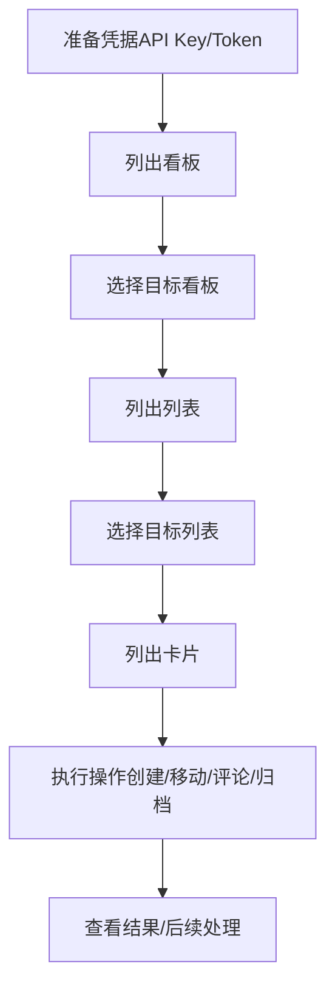
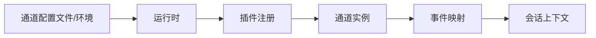

# 通信协作技能

<cite>
**本文引用的文件**
- [docs/channels/discord.md](file://docs/channels/discord.md)
- [docs/channels/slack.md](file://docs/channels/slack.md)
- [docs/channels/imessage.md](file://docs/channels/imessage.md)
- [docs/channels/bluebubbles.md](file://docs/channels/bluebubbles.md)
- [docs/channels/trello/SKILL.md](file://docs/channels/trello/SKILL.md)
- [extensions/discord/index.ts](file://extensions/discord/index.ts)
- [extensions/slack/index.ts](file://extensions/slack/index.ts)
- [extensions/imessage/index.ts](file://extensions/imessage/index.ts)
- [extensions/bluebubbles/index.ts](file://extensions/bluebubbles/index.ts)
- [docs/channels/index.md](file://docs/channels/index.md)
- [docs/cli/skills.md](file://docs/cli/skills.md)
</cite>

## 目录

1. [简介](#简介)
2. [项目结构](#项目结构)
3. [核心组件](#核心组件)
4. [架构总览](#架构总览)
5. [详细组件分析](#详细组件分析)
6. [依赖关系分析](#依赖关系分析)
7. [性能考量](#性能考量)
8. [故障排查指南](#故障排查指南)
9. [结论](#结论)
10. [附录](#附录)

## 简介

本文件系统化梳理 OpenClaw 在通信与协作领域的技能与实践，重点覆盖 Discord、Slack、iMessage（含 BlueBubbles）、以及 Trello 的配置、权限与集成方式，并给出团队协作场景下的使用案例与配置示例。内容涵盖消息转发、任务管理、通知与交互组件、线程会话绑定、以及跨渠道的路由与访问控制策略。

## 项目结构

OpenClaw 将“通道（Channel）”抽象为插件形式，通过扩展目录中的各平台插件接入不同即时通讯与协作平台；同时在文档目录中提供了各平台的完整配置与运行说明。

**图表来源**

- [extensions/discord/index.ts:1-20](file://extensions/discord/index.ts#L1-L20)
- [extensions/slack/index.ts:1-18](file://extensions/slack/index.ts#L1-L18)
- [extensions/imessage/index.ts:1-18](file://extensions/imessage/index.ts#L1-L18)
- [extensions/bluebubbles/index.ts:1-18](file://extensions/bluebubbles/index.ts#L1-L18)
- [docs/channels/discord.md:1-1224](file://docs/channels/discord.md#L1-L1224)
- [docs/channels/slack.md:1-555](file://docs/channels/slack.md#L1-L555)
- [docs/channels/imessage.md:1-368](file://docs/channels/imessage.md#L1-L368)
- [docs/channels/bluebubbles.md:1-348](file://docs/channels/bluebubbles.md#L1-L348)
- [docs/channels/trello/SKILL.md:1-96](file://docs/channels/trello/SKILL.md#L1-L96)
- [docs/channels/index.md:1-48](file://docs/channels/index.md#L1-L48)

**章节来源**

- [docs/channels/index.md:1-48](file://docs/channels/index.md#L1-L48)

## 核心组件

- 平台通道插件：以插件形式注册到 OpenClaw 运行时，负责建立与平台的连接、消息收发、事件处理与会话路由。
- 配置与凭据：各平台的令牌、模式（Socket/HTTP/Webhook）、权限范围、分组策略、历史限制、流式输出等均通过配置项统一管理。
- 访问控制与路由：支持按用户/角色/群组白名单、提及要求、线程绑定、会话隔离等策略进行精细化控制。
- 交互与通知：支持按钮/选择器/模态表单等交互组件、反应通知、打字指示、已读回执、块式流式回复等增强体验。

**章节来源**

- [extensions/discord/index.ts:1-20](file://extensions/discord/index.ts#L1-L20)
- [extensions/slack/index.ts:1-18](file://extensions/slack/index.ts#L1-L18)
- [extensions/imessage/index.ts:1-18](file://extensions/imessage/index.ts#L1-L18)
- [extensions/bluebubbles/index.ts:1-18](file://extensions/bluebubbles/index.ts#L1-L18)
- [docs/channels/discord.md:369-800](file://docs/channels/discord.md#L369-L800)
- [docs/channels/slack.md:136-340](file://docs/channels/slack.md#L136-L340)
- [docs/channels/bluebubbles.md:149-314](file://docs/channels/bluebubbles.md#L149-L314)

## 架构总览

下图展示 OpenClaw 通过插件接入多通道的整体架构：Gateway 统一调度，各通道插件负责具体协议与平台交互，配置驱动行为，会话键区分上下文，事件映射为系统事件供代理使用。

**图表来源**

- [extensions/discord/index.ts:1-20](file://extensions/discord/index.ts#L1-L20)
- [extensions/slack/index.ts:1-18](file://extensions/slack/index.ts#L1-L18)
- [extensions/imessage/index.ts:1-18](file://extensions/imessage/index.ts#L1-L18)
- [extensions/bluebubbles/index.ts:1-18](file://extensions/bluebubbles/index.ts#L1-L18)

## 详细组件分析

### Discord 通道

- 快速设置要点
  - 创建应用与机器人、启用特权意图（消息内容、成员列表、存在状态）、生成邀请链接与权限、复制服务器/用户 ID、允许来自服务器成员的私信、安全地保存机器人令牌并启用通道。
  - 支持 DM 与公会频道；推荐将服务器加入白名单，按需关闭“必须提及”响应，结合内存工具实现长程上下文。
- 运行模型
  - 网关持有连接；默认 DM 共享主会话，公会频道独立会话；论坛频道仅接受主题贴，支持自动建线程或显式创建线程。
- 交互组件与模型选择
  - 支持文本、分区、动作行、媒体画廊、文件块、模态表单等；按钮/选择器可限定使用者；/model 与 /models 命令提供交互式模型选择。
- 访问控制与路由
  - DM 策略：配对、白名单、开放、禁用；公会策略：开放、白名单、禁用；提及开关与忽略其他提及；群组 DM 可选白名单。
  - 角色级代理路由：基于角色 ID 的绑定，先评估同成员绑定再进入公会绑定。
- 特性细节
  - 回复标签与原生回复；预览流式输出（partial/block）；历史与上下文、线程行为；线程绑定会话用于子代理；持久化 ACP 通道绑定；反应通知与确认反应。
- 故障排查
  - 关注令牌解析优先级、意图与权限、ID 复制、DM 开放策略、配对码过期时间等。

**图表来源**

- [docs/channels/discord.md:255-315](file://docs/channels/discord.md#L255-L315)
- [extensions/discord/index.ts:1-20](file://extensions/discord/index.ts#L1-L20)

**章节来源**

- [docs/channels/discord.md:24-251](file://docs/channels/discord.md#L24-L251)
- [docs/channels/discord.md:255-800](file://docs/channels/discord.md#L255-L800)
- [extensions/discord/index.ts:1-20](file://extensions/discord/index.ts#L1-L20)

### Slack 通道

- 快速设置要点
  - Socket 模式：启用 Socket Mode、创建 App Token 与 Bot Token、订阅事件、开启 App Home 的消息页签。
  - HTTP 事件 API 模式：设置签名密钥、事件/交互/斜杠命令请求 URL、为多账户配置唯一 webhook 路径。
- 令牌模型与权限
  - Socket 模式需要 App Token + Bot Token；HTTP 模式需要 Bot Token + 签名密钥；支持用户令牌只读写入；可自定义发送用户名与头像。
- 访问控制与路由
  - DM 策略：配对、白名单、开放、禁用；支持组 DM；公会策略：开放、白名单、禁用；提及开关、通道用户白名单、技能/系统提示注入。
- 命令与交互
  - 默认不自动启用原生命令；可启用或注册单个斜杠命令；参数菜单根据选项数量自动切换渲染策略；斜杠会话隔离。
- 线程、会话与回复标签
  - DM 直接会话、通道会话、MPIM 分组会话；线程会话后缀；replyToMode 控制回复线程；显式回复标签支持。
- 媒体、分块与投递目标
  - 下载并缓存附件；出站文本分块与文件上传；支持线程回复；优先使用 user:/channel: 目标。
- 事件与操作行为
  - 编辑/删除/广播映射为系统事件；反应增删映射为系统事件；成员加入/离开、频道重命名、Pin 增删映射为系统事件；助手线程状态更新需要 assistant:write 权限。
- 打字指示与确认反应
  - 可配置 ackReaction 与 typingReaction；短代码格式；支持清理。
- 流式输出
  - 通过 Agents and AI Apps API 实现原生流式预览；支持 partial/block/progress；失败时回退普通发送。

**图表来源**

- [docs/channels/slack.md:24-121](file://docs/channels/slack.md#L24-L121)
- [docs/channels/slack.md:136-340](file://docs/channels/slack.md#L136-L340)
- [docs/channels/slack.md:492-532](file://docs/channels/slack.md#L492-L532)

**章节来源**

- [docs/channels/slack.md:1-555](file://docs/channels/slack.md#L1-L555)
- [extensions/slack/index.ts:1-18](file://extensions/slack/index.ts#L1-L18)

### iMessage 通道（遗留：imsg）与 BlueBubbles

- 遗留方案（imsg）
  - 通过本地或远程 Mac 上的 imsg CLI 与 Messages 数据库交互，采用 JSON-RPC over stdio；需要 Full Disk Access 与自动化权限；支持配对、组策略、会话隔离与分块发送。
- 推荐方案（BlueBubbles）
  - 通过 BlueBubbles macOS 服务器 REST API 与 Webhook 接收消息；支持编辑、撤回、回复线程、特效、群管理、反应、打字指示、已读回执等；Webhook 需密码认证；支持块式流式回复；提供向导与 CLI 添加方式。
- 部署模式
  - 专用 macOS 用户、远程 Mac over SSH/Tailscale、多账户配置；远程附件通过 SCP 获取；保持 Messages 常驻（AppleScript + LaunchAgent）。
- 访问控制与路由
  - DM 策略与配对；组策略与提及检测（正则）；会话隔离；稳定路由目标（chat_guid/chat_id）。
- 媒体与分块
  - 可选下载附件；SCP 严格主机校验；出站媒体大小限制；文本分块与换行优先策略。
- 安全与排障
  - Webhook 密码认证；HTTPS 与防火墙；编辑/撤回在新系统版本上的兼容性；状态检查与日志定位。

**图表来源**

- [docs/channels/bluebubbles.md:14-52](file://docs/channels/bluebubbles.md#L14-L52)
- [extensions/bluebubbles/index.ts:1-18](file://extensions/bluebubbles/index.ts#L1-L18)
- [extensions/imessage/index.ts:1-18](file://extensions/imessage/index.ts#L1-L18)

**章节来源**

- [docs/channels/imessage.md:1-368](file://docs/channels/imessage.md#L1-L368)
- [docs/channels/bluebubbles.md:1-348](file://docs/channels/bluebubbles.md#L1-L348)
- [extensions/imessage/index.ts:1-18](file://extensions/imessage/index.ts#L1-L18)
- [extensions/bluebubbles/index.ts:1-18](file://extensions/bluebubbles/index.ts#L1-L18)

### Trello 技能

- 功能概述
  - 通过 Trello REST API 管理看板、列表与卡片，包括列出、创建、移动、评论、归档等常用操作。
- 设置与凭据
  - 生成 API Key 与 Token；设置环境变量；使用 jq 进行结果过滤。
- 使用示例
  - 列出我的看板、某看板的列表、某列表的卡片；创建卡片、移动卡片、添加评论、归档卡片。
- 注意事项
  - 凭据具有完全访问权限，注意保密；关注速率限制与端点配额。

**图表来源**

- [docs/channels/trello/SKILL.md:16-96](file://docs/channels/trello/SKILL.md#L16-L96)

**章节来源**

- [docs/channels/trello/SKILL.md:1-96](file://docs/channels/trello/SKILL.md#L1-L96)

## 依赖关系分析

- 插件注册与运行时
  - 各通道插件在注册时设置运行时并注册通道，Gateway 依据配置与会话键进行路由。
- 配置与凭据来源
  - 通道配置支持文件与环境变量回退；令牌解析遵循账户感知优先级；部分通道支持 SecretRef。
- 事件与系统事件
  - 平台事件（如反应、成员变更、Pin）被映射为系统事件，供代理在会话中使用。

**图表来源**

- [extensions/discord/index.ts:12-16](file://extensions/discord/index.ts#L12-L16)
- [extensions/slack/index.ts:11-14](file://extensions/slack/index.ts#L11-L14)
- [extensions/imessage/index.ts:11-14](file://extensions/imessage/index.ts#L11-L14)
- [extensions/bluebubbles/index.ts:11-14](file://extensions/bluebubbles/index.ts#L11-L14)

**章节来源**

- [docs/channels/discord.md:169-173](file://docs/channels/discord.md#L169-L173)
- [docs/channels/slack.md:123-135](file://docs/channels/slack.md#L123-L135)
- [docs/channels/bluebubbles.md:330-336](file://docs/channels/bluebubbles.md#L330-L336)

## 性能考量

- 文本分块与传输
  - 合理设置 textChunkLimit 与 chunkMode，避免超长消息导致延迟或失败。
- 媒体限制
  - 通过 mediaMaxMb 控制入/出站媒体大小，减少带宽与存储压力。
- 流式输出
  - 在支持的平台上启用原生流式预览，提升交互体验；失败时自动回退。
- 会话隔离与历史
  - 合理设置历史限制，避免无界上下文增长影响性能与成本。
- 并发与多账户
  - 多账户并发时注意令牌与权限的隔离，避免冲突与重复调用。

## 故障排查指南

- 通用步骤
  - 使用通道状态探测、日志跟踪与健康检查命令定位问题。
- Discord
  - 关注意图与权限、ID 复制、DM 策略、配对码过期、论坛频道限制、组件权限。
- Slack
  - Socket/HTTP 模式验证令牌与请求 URL；事件订阅与交互配置；斜杠命令注册；流式 API 权限与线程可用性。
- iMessage/BlueBubbles
  - 权限与自动化提示、远程附件 SCP、Messages 常驻、Webhook 密码与路径、编辑/撤回兼容性、状态检查。
- Trello
  - 凭据有效性、速率限制、端点配额、网络连通性。

**章节来源**

- [docs/channels/discord.md:169-800](file://docs/channels/discord.md#L169-L800)
- [docs/channels/slack.md:433-555](file://docs/channels/slack.md#L433-L555)
- [docs/channels/imessage.md:304-360](file://docs/channels/imessage.md#L304-L360)
- [docs/channels/bluebubbles.md:337-348](file://docs/channels/bluebubbles.md#L337-L348)
- [docs/channels/trello/SKILL.md:78-83](file://docs/channels/trello/SKILL.md#L78-L83)

## 结论

OpenClaw 通过模块化的通道插件体系，为 Discord、Slack、iMessage（BlueBubbles）与 Trello 等平台提供了统一的配置入口与运行时能力。借助访问控制、会话隔离、交互组件与流式输出等特性，可在团队协作场景中实现高效的消息转发、任务管理与通知配置。建议优先采用 BlueBubbles 进行 iMessage 集成，并结合各平台的令牌与权限模型，按需启用流式与组件能力，确保安全与性能平衡。

## 附录

- 相关 CLI
  - 使用 `openclaw skills` 查看可用技能与依赖检查，辅助定位缺失二进制或环境变量等问题。
- 通道概览
  - 参考通道索引了解支持的平台与特性差异，选择最适合团队的接入方式。

**章节来源**

- [docs/cli/skills.md:1-27](file://docs/cli/skills.md#L1-L27)
- [docs/channels/index.md:1-48](file://docs/channels/index.md#L1-L48)
