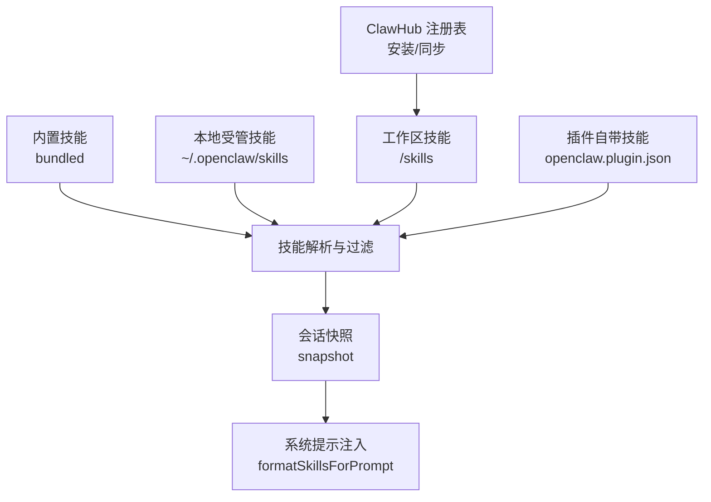
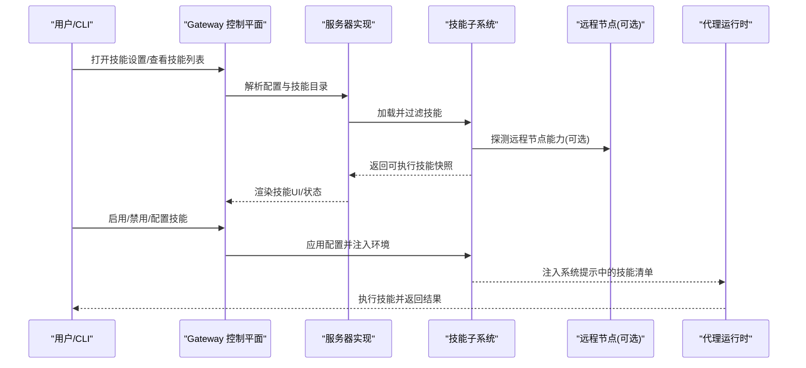
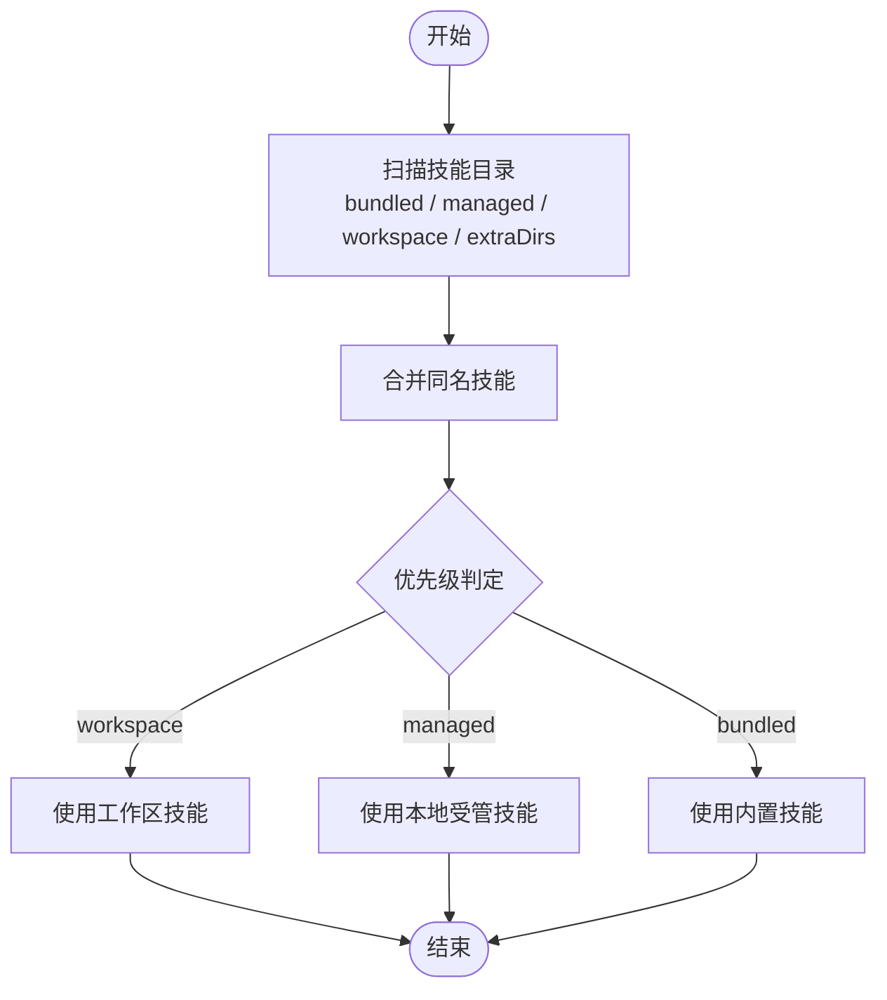
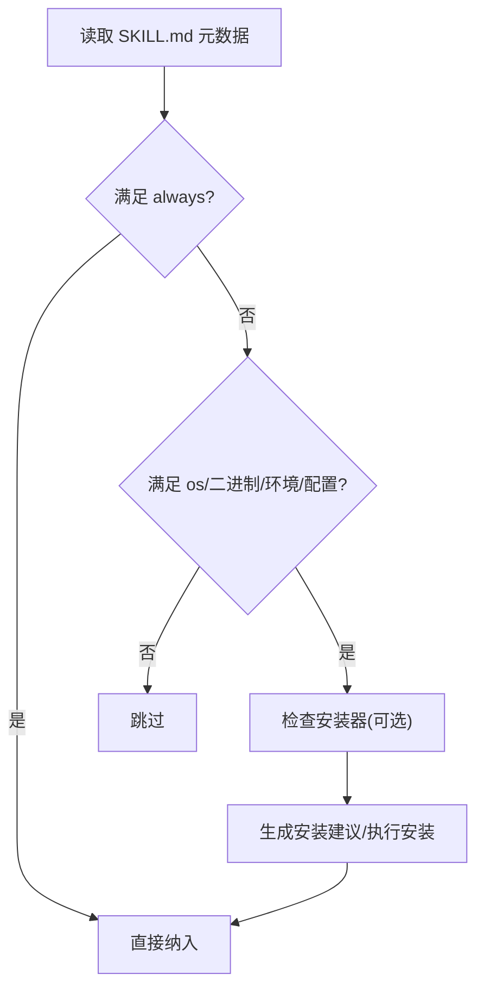
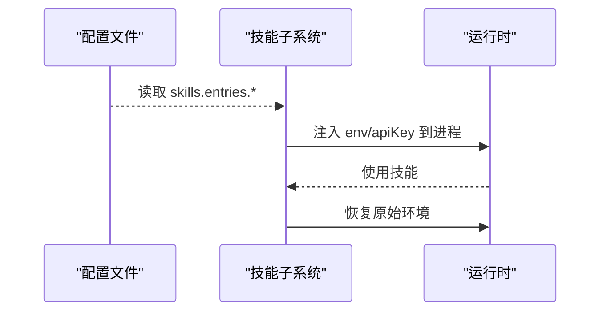
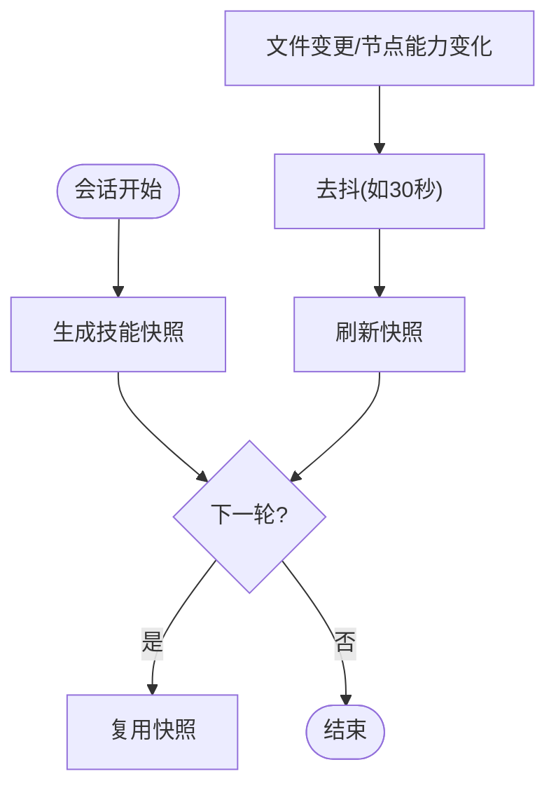
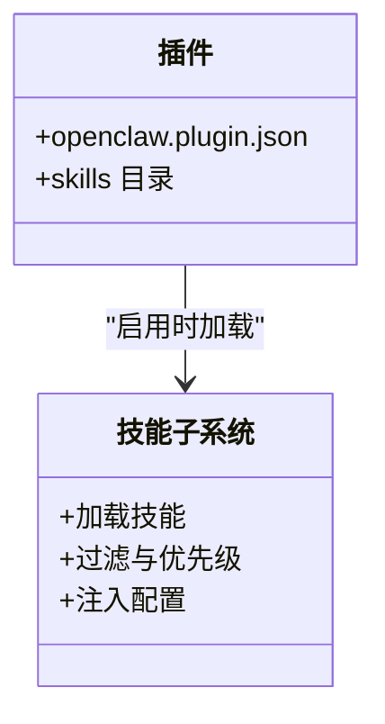
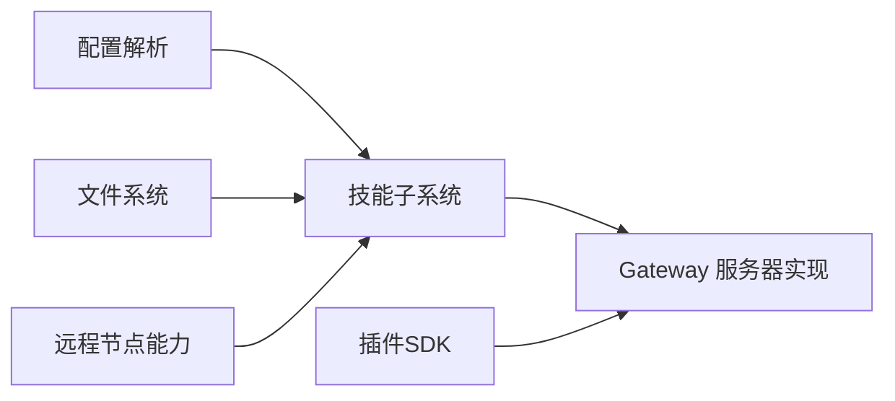

# 技能平台

<cite>
**本文引用的文件**
- [README.md](file://README.md)
- [skills.md](file://docs/tools/skills.md)
- [skills.md（CLI）](file://docs/cli/skills.md)
- [技能创建器 SKILL.md](file://skills/skill-creator/SKILL.md)
- [serialize.ts](file://src/agents/skills/serialize.ts)
- [server.impl.ts](file://src/gateway/server.impl.ts)
- [core.ts](file://src/plugin-sdk/core.ts)
</cite>

## 目录

1. [简介](#简介)
2. [项目结构](#项目结构)
3. [核心组件](#核心组件)
4. [架构总览](#架构总览)
5. [详细组件分析](#详细组件分析)
6. [依赖关系分析](#依赖关系分析)
7. [性能考量](#性能考量)
8. [故障排除指南](#故障排除指南)
9. [结论](#结论)
10. [附录](#附录)

## 简介

本文件面向OpenClaw技能平台，系统化阐述技能系统的架构设计、技能开发流程与管理机制，覆盖内置技能特性、使用方法与配置选项，并提供从“创建-打包-分发-安装-更新-卸载”的完整指南，以及常见问题排查与最佳实践。

## 项目结构

OpenClaw采用“多层叠加”的技能加载模型：内置技能（bundled）、本地受管技能（managed/local）与工作区技能（workspace），并支持插件自带技能与ClawHub注册表的安装同步。技能在加载时按元数据进行“准入过滤”，并在会话内做快照复用以提升性能。

图示来源

- [skills.md:13-48](file://docs/tools/skills.md#L13-L48)
- [skills.md:106-187](file://docs/tools/skills.md#L106-L187)

章节来源

- [README.md:13-170](file://README.md#L13-L170)
- [skills.md:13-48](file://docs/tools/skills.md#L13-L48)

## 核心组件

- 技能目录与优先级
  - 内置技能（bundled）：随安装包或应用分发
  - 本地受管技能（managed/local）：用户主目录下的技能覆盖
  - 工作区技能（workspace）：每个代理的工作区私有技能，优先级最高
  - 插件自带技能：通过插件清单声明，启用后参与优先级规则
- 加载与过滤
  - 基于元数据（metadata.openclaw）的准入条件：操作系统、二进制依赖、环境变量、配置项等
  - 支持“总是包含”“安装器描述”“平台过滤”等策略
- 配置与注入
  - 通过配置文件对技能进行开关、密钥注入与自定义参数注入
  - 运行期按代理回合注入环境变量，结束后恢复
- 性能与热更新
  - 会话开始时对可执行技能做快照；变更在新会话生效或启用监视器时热更新
  - 远程节点能力探测与二进制探测联动，避免频繁触发

章节来源

- [skills.md:13-48](file://docs/tools/skills.md#L13-L48)
- [skills.md:106-187](file://docs/tools/skills.md#L106-L187)
- [skills.md:189-246](file://docs/tools/skills.md#L189-L246)
- [skills.md:254-267](file://docs/tools/skills.md#L254-L267)

## 架构总览

技能系统围绕“发现-过滤-注入-执行-反馈”闭环构建，贯穿Gateway控制平面与代理运行时。

图示来源

- [server.impl.ts:675-698](file://src/gateway/server.impl.ts#L675-L698)
- [serialize.ts:1-14](file://src/agents/skills/serialize.ts#L1-L14)
- [skills.md:242-267](file://docs/tools/skills.md#L242-L267)

## 详细组件分析

### 组件A：技能加载与优先级

- 目录来源与优先级
  - workspace > managed/local > bundled
  - 可通过额外目录扩展（extraDirs）
- 多代理场景
  - per-agent：仅当前代理可见
  - shared：全机共享（managed/local 或 extraDirs）

图示来源

- [skills.md:13-48](file://docs/tools/skills.md#L13-L48)

章节来源

- [skills.md:13-48](file://docs/tools/skills.md#L13-L48)

### 组件B：技能准入过滤与安装器

- 元数据字段
  - always、os、requires.bins/anyBins、requires.env、requires.config、primaryEnv、install
- 容器内二进制要求
  - 沙箱中需同时满足宿主机与容器内二进制存在
- 安装器类型
  - brew、node、go、download等，支持平台过滤与下载归档解压

图示来源

- [skills.md:106-187](file://docs/tools/skills.md#L106-L187)

章节来源

- [skills.md:106-187](file://docs/tools/skills.md#L106-L187)

### 组件C：配置注入与运行期环境

- 配置入口
  - skills.entries.<key>：enabled、apiKey、env、config、allowBundled
- 运行期注入
  - 在代理回合开始时注入环境变量，回合结束后恢复
- 密钥安全
  - 支持SecretRef对象；避免将密钥写入提示与日志

图示来源

- [skills.md:189-246](file://docs/tools/skills.md#L189-L246)

章节来源

- [skills.md:189-246](file://docs/tools/skills.md#L189-L246)

### 组件D：会话快照与热更新

- 快照策略
  - 会话开始时缓存可执行技能列表，后续轮次复用
- 热更新
  - 文件监视器监听 SKILL.md 变更，去抖后刷新
  - 远程节点能力变化时延迟批量刷新，避免风暴

图示来源

- [skills.md:242-267](file://docs/tools/skills.md#L242-L267)
- [server.impl.ts:675-698](file://src/gateway/server.impl.ts#L675-L698)
- [serialize.ts:1-14](file://src/agents/skills/serialize.ts#L1-L14)

章节来源

- [skills.md:242-267](file://docs/tools/skills.md#L242-L267)
- [server.impl.ts:675-698](file://src/gateway/server.impl.ts#L675-L698)
- [serialize.ts:1-14](file://src/agents/skills/serialize.ts#L1-L14)

### 组件E：插件与技能集成

- 插件声明技能目录
  - openclaw.plugin.json 中列出 skills 子目录
- 加载时机
  - 插件启用时加载，遵循统一优先级与过滤规则
- 认证与运行时
  - 提供认证上下文与命令运行封装

图示来源

- [skills.md:41-48](file://docs/tools/skills.md#L41-L48)
- [core.ts:1-44](file://src/plugin-sdk/core.ts#L1-L44)

章节来源

- [skills.md:41-48](file://docs/tools/skills.md#L41-L48)
- [core.ts:1-44](file://src/plugin-sdk/core.ts#L1-L44)

### 组件F：CLI与调试

- openclaw skills list/info/check
  - 查看可用/就绪/缺失条件
- 与文档协同
  - 对应技能系统与配置参考

章节来源

- [skills.md（CLI）:1-27](file://docs/cli/skills.md#L1-L27)
- [skills.md:1-303](file://docs/tools/skills.md#L1-L303)

## 依赖关系分析

- 组件耦合
  - 技能子系统依赖配置解析、文件系统扫描、远程节点能力探测
  - Gateway服务器实现负责技能变更监听与远程节点二进制刷新
- 外部依赖
  - 插件SDK提供认证、命令运行、临时目录等基础设施
- 潜在循环
  - 技能加载与远程节点探测通过事件回调解耦，避免直接循环

图示来源

- [server.impl.ts:675-698](file://src/gateway/server.impl.ts#L675-L698)
- [core.ts:1-44](file://src/plugin-sdk/core.ts#L1-L44)

章节来源

- [server.impl.ts:675-698](file://src/gateway/server.impl.ts#L675-L698)
- [core.ts:1-44](file://src/plugin-sdk/core.ts#L1-L44)

## 性能考量

- 技能提示注入成本
  - 基础开销与每技能附加长度呈线性关系，XML转义会放大字符数
  - 建议控制技能数量与描述长度，避免过度膨胀上下文
- 会话快照
  - 复用已筛选技能列表，减少重复解析与过滤
- 监视器去抖
  - 批量处理文件变更，降低频繁探测带来的抖动

章节来源

- [skills.md:269-286](file://docs/tools/skills.md#L269-L286)
- [skills.md:242-267](file://docs/tools/skills.md#L242-L267)

## 故障排除指南

- 常见症状与定位
  - 技能未显示：检查是否被配置禁用、是否满足准入条件（二进制/环境/配置）
  - 运行失败：确认运行时环境变量是否正确注入、沙箱内二进制是否存在
  - 远程节点不可用：确认节点允许system.run且探测到所需二进制
- 调试命令
  - 使用 openclaw skills list --eligible 与 openclaw skills check 查看就绪状态
- 文档参考
  - 技能系统与配置参考、安全指南

章节来源

- [skills.md（CLI）:1-27](file://docs/cli/skills.md#L1-L27)
- [skills.md:1-303](file://docs/tools/skills.md#L1-L303)

## 结论

OpenClaw技能平台通过“三层目录+元数据准入+配置注入+会话快照”的组合，实现了高可维护性与高性能的技能生命周期管理。配合ClawHub与插件生态，开发者可以快速创建、分发与迭代技能，同时保持安全与可控。

## 附录

### 技能开发流程（从零到上线）

- 设计与规划
  - 明确技能目标、触发词、工作流与资源组织
- 初始化与模板
  - 使用技能创建器脚手架生成基础结构
- 编写与打包
  - 编写 SKILL.md 与必要资源，使用打包脚本生成可分发包
- 发布与分发
  - 上传至ClawHub或内部仓库，通过 openclaw skills 安装/更新
- 运维与迭代
  - 通过监视器热更新、配置开关与密钥注入进行运维

章节来源

- [技能创建器 SKILL.md:201-373](file://skills/skill-creator/SKILL.md#L201-L373)

### 内置技能与示例

- 内置技能示例库位于 skills/ 目录，覆盖多种工具与服务
- 可通过 openclaw skills list 查看可用技能清单

章节来源

- [README.md:164-170](file://README.md#L164-L170)

### 最佳实践

- 信息密度与上下文控制：遵循“先核心、后引用”的渐进披露原则
- 资源组织：scripts/ references/ assets 分离职责，避免 SKILL.md 过长
- 触发词与描述：清晰表达“何时使用”与“如何触发”
- 安全与审计：第三方技能需审阅；密钥不写入提示与日志；使用SecretRef

章节来源

- [技能创建器 SKILL.md:113-200](file://skills/skill-creator/SKILL.md#L113-L200)
- [skills.md:69-76](file://docs/tools/skills.md#L69-L76)
